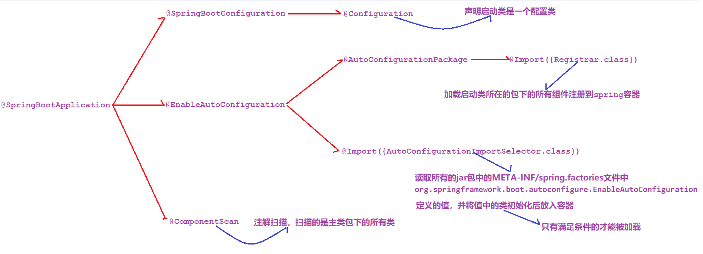
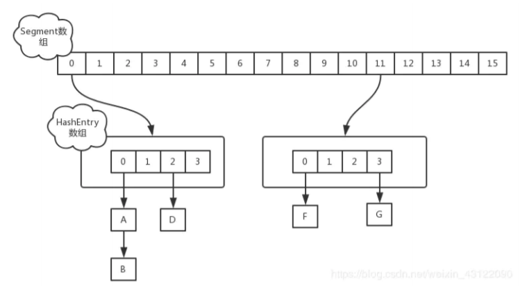

## Java基础

### JDK JRE JVM的区别（必会）

- JDK：Java Development Kit，Java标准开发包，提供了编译和运行Java程序所需的各种工具和资源，包括**Java编译器**、**Java运行环境**，以及**常用的Java类库**等，程序员必须安装JDK来编译和调试程序
- JRE：Java Runtime Environment，Java运行环境。普通用户只需安装JRE，即可运行Java程序
- JVM：Java Virtual Mechine，Java虚拟机，是Java实现**跨平台的最核心部分**，负责解释执行字节码文件
- JDK包含JRE，JRE包含JVM
- JVM是Java的核心并且具有平台独立性（体系结构无关、可移植）


### Final 有什么用？

被final修饰的类不可以被继承 

被final修饰的方法不可以被重写 

被final修饰的变量不可以被改变，

**被final修饰不可变的是变量的引用，而不是引用指向的内容， 引用指向的内容是可以改变的**


### 重载和重写的区别（必会）

- 重载：在**同一个类中**，<u>方法名相同，参数列表不一致</u>即构成重载，与返回值类型无关
- 重写：发生没有被private修饰的**在子父类中**，<u>方法名和参数列表必须相同</u>，子类的**返回值**、**抛出的异常**范围小于等于父类，**权限修饰符**范围大于等于父类


### ==和equals的区别（必会）

- ==
  - 基本类型：比较**值**是否相同
  - 引用类型：比较**地址值**是否相同
- equals
  - 重写前比较地址值
  - 重写后按重写方法的逻辑进行比较
- **String、Integer、Date**类中equals被重写过，比较的是内容


### String、StringBuffer、StringBuilder的区别（必会）

- String是**final类**，内部维护了一个常量字符数组`private final char value[];`，所以String类一旦实例化，他的值就不能改变
- StringBuffer类**JDK1.0**提供，为**字符串拼接**和将**其他对象转换为字符串**提供了特殊支持类，内部维护字符数组，其实例的值可以被改变，其字符串运算方法**由synchronized修饰**，是同步的
- StringBuilder类**JDK1.5**提供，与StringBuffer的API兼容，但**不同步**，用于在单线程下替代StringBuffer
- 区别：
  - **可变性**：String是final类，StringBuffer和StringBuilder不是
  - **线程安全**：StringBuffer是JDK1.0提供，线程安全，在并发修改的情况下推荐；Stringbuilder是JDK1.5提供，线程不安全，单线程情况下推荐使用


### 单例模式（必会）

- 单列模式：在程序运行时，同一个类只有一个实例
- 常用的单例设计模式有五种
  - **饿汉式**
  - **懒汉式**
  - **懒汉加锁**
  - **懒汉双检锁**
  - **静态内部类**实现单例


### 接口和抽象类（必会）

- <u>抽象类</u>要被子类**继承**；<u>接口</u>要被类**实现**
- <u>抽象类</u>中的变量是**普通变量**；<u>接口</u>里定义的变量只能是**公共的静态的常量**
- <u>类</u>只能**单继承**；<u>接口</u>可继承接口，并且可以**多继承**


### 手写冒泡排序（必会）

```java
public static void bubbleSort(int[] buf){
    int temp;
    for (int i = 0; i < buf.length - 1; i++) {
        for (int j = 0; j < buf.length - 1 -i; j++) {
            if (buf[j] < buf[j+1]){
                temp = buf[j];
                buf[j] = buf[j+1];
                buf[j+1] = temp;
            }
        }
    }
}
```


### 二分查找

```java
private static int getIndex(int[] arr, int i) {
    int minIndex = 0;
    int maxIndex = arr.length - 1;

    while (minIndex <= maxIndex) {
        int midIndex = (minIndex + maxIndex) / 2;
        if (i < arr[midIndex]) {
            maxIndex = midIndex - 1;
        } else if (i > arr[midIndex]) {
            minIndex = midIndex + 1;
        } else {
            return midIndex;
        }
    }

    return -1;
}
```


### ArrayList和LinkedList的区别

- **相同点**：ArrayList和LinkedList都实现了List接口，用于存储一系列的引用对象。都可以对元素进行增删改查操作
- **数据结构**：ArrayList 是动态数组的数据结构实现，而 LinkedList 是双向链表的数据结构实现。 
- **随机访问效率**：ArrayList 比 LinkedList 在随机访问的时候效率要高，因为 LinkedList 是线性的数 据存储方式，所以需要移动指针从前往后依次查找。 

- **增加和删除效率**：在非首尾的增加和删除操作，LinkedList 要比 ArrayList 效率要高，因为 ArrayList 增删操作要影响数组内的其他数据的下标。 

- **内存空间占用**：LinkedList 比 ArrayList 更占内存，因为 LinkedList 的节点除了存储数据，还存储 了两个引用，一个指向前一个元素，一个指向后一个元素。 

- **线程安全**：ArrayList 和 LinkedList 都是不同步的，也就是不保证线程安全； 


## 二、集合

### List、Map、Set的区别（必会）

- <u>List和Set</u>是存储**单列数据**的集合，<u>Map</u>是存储键值对这样的**双列数据**的集合
- <u>List</u>中的数据是**有顺序、可重复的**
- <u>Set</u>中的数据是**无序的、不重复的**；<u>HashSet</u>靠重写**hashCode和equals**实现去重；<u>TreeSet</u>靠实现**Comparable接口**方法或**Comparator比较器**实现去重
- <u>Map</u>中是数据是**无序的**，他的**键不可以重复**，值可以重复


## 三、多线程

### 创建多线程的四种方式（必会）

- **继承Thread类**并重写run方法，实现简单但不能继承其他类
- 实现**Runnable接口**并重写run方法，避免了单继承局限性，实现解耦
- 实现**Callable接口**并重写call方法，可以获取线程执行结果的返回值，并且可以抛异常
- 使用**线程池**创建


### Runnable和callable的区别（必会）

- <u>Runnable</u>**无返回值**，**只能抛运行异常**，且**无法捕获处理**
- <u>callable</u>**有返回值**，支持**泛型**，**允许抛出异常**，和Future、 FutureTask配合可以用来获取异步执行的结果，但此方法会阻塞主进程的继续往下执行，如果不调用不会阻塞。


### 如何启动一个新线程，调用start和run方法的区别（必会）

- 线程对象调用<u>run</u>方法**不开启线程**，仅是对象调用方法
- 线程对象调用<u>start</u>**开启线程**，并让jvm调用run方法在开启的线程中执行
- 调用start方法可以启动线程，并且使得线程进入就绪状态，而run方法只是thread的一个普通方法，还是在主线程中执行


### 线程有哪几种状态以及状态之间的转换（必会）

- 有NEW、RUNNABLE、TERMINATED、BLOCKED、WATING、TIMED_WATING六种状态

- NEW：尚未启动的线程处于此状态
- RUNNABLE：在Java虚拟机中执行的线程处于此状态
- BLOCKED：被阻塞等待监视器锁定的线程处于此状态
- WAITING：无限期等待另一个线程执行特定操作的线程处于此状态
- TIMED_WAITING：等待另一个线程执行操作的线程在指定的等待时间内处于此状态
- TERMINATED：已退出的线程处于此状态


### 线程相关的基本方法（必会）

- 线程相关基本方法有：wait、sleep、notifly、notiflyall、jion、yield等
- 线程等待（wait）：
  - 一般用在同步方法或同步代码块中，调用该方法线程会释放锁并进入WAITING状态，只有等待其他线程通知或被中断才会返回
- 线程睡眠（sleep）
  - 使当前线程进入TIMED_WAITING状态，但是不会释放锁，休眠时间到了后继续执行代码
- 线程让步（yield）
  - 使当前线程让出CPU执行时间片，重新参与锁的竞争
- 线程中断（interrupt）
  - 中断一个线程，会影响这个线程内部的中断标识位，但不会改变线程状态
- 等待其他线程终止（join）
  - 使当前线程转为阻塞状态，join另一个线程直到该线程结束，当前线程再有阻塞状态变为就绪状态，重新参与锁的竞争
- 线程唤醒（notify）
  - Object类的方法，唤醒正在等待锁的单个线程，如果有多个线程同时在等待，只会随机唤醒某个线程


### wait()和sleep()的区别（必会）

| 区别     | wait()                 | sleep()                |
| -------- | ---------------------- | ---------------------- |
| 所属类   | Object类               | Thread类               |
| 锁的释放 | 在等待过程中会释放锁   | 在等待过程中不会释放锁 |
| 使用范围 | 必须在同步代码块中使用 | 可以在如何地方使用     |


## 四、线程池

### Java中的线程池类

可进行缓存重复利用的线程池、可重用固定线程数的线程池、只执行一个线程的线程池（队列）、只执行一个线程的线程池（延迟或定期执行）、给定延迟运行命令或定期执行的线程池、带并行级别的线程池

1. newCachedThreadPool：创建一个**可进行缓存重复利用的线程池**
2. newFixedThreadPool：创建一个**可重用固定线程数的线程池**，以共享的无界队列方式来运行这些线程，线程池中的线程处于一定的量，可以很好的控制线程的并发量
3. newSingleThreadExecutor：创建一个使用单个 worker 线程的Executor ，以无界队列方式来运行该线程。线程池中**最多执行一个线程，之后提交的线程将会排在队列中以此执行**
4. newSingleThreadScheduledExecutor：创建一个**单线程**执行程序，它可安排在**给定延迟后运行命令或者定期执行**
5. newScheduledThreadPool：创建一个线程池，它可安排在**给定延迟后运行命令或者定期的执行**
6. newWorkStealingPool：创建一个带并**行级别的线程池**，并行级别决定了**同一时刻**最多有多少个线程在执行，如不传并行级别参数，将默认为当前系统的**CPU核心数*2**


### Java线程池创建时核心参数（高薪常问）

- corePoolSize：核心线程数量
- maximumPoolSize：最大线程数量（核心线程+临时线程）
- keepAliveTime：空闲线程存活时间
- unit：时间单位（毫秒、秒、分、时）
- workQueue：阻塞队列，用于保存任务的阻塞队列（默认为int最大值）
- threadFactory：创建线程的工程类
- handler：饱和策略（拒绝策略）默认会抛出异常


## 五、网络

### 网络七层架构

- 物理层
  - 主要定义物理设备标准，如**接口类型、传输速率**等。主要作用是**传输比特流**，模数转换和数模转换发生在这一层，这一层的数据叫做**比特**
- 数据链路层
  - 主要将物理层接收的数据进行**MAC地址的封装和解封装**。这一层的数据叫做**帧**，工作设备主要是**交换机**
- 网络层
  - 主要将下层接收到的数据进行**IP地址的封装和解封装**。这一层的数据叫做**数据包**，工作设备主要是**路由器**
- 传输层
  - 定义传输数据的**协议和端口**，主要是将从下层接收的数据进行**分段传输**，到达目的地址后进行**重组**。这一层数据叫做**段**
- 会话层
  - 通过传输层建立数据传输的通道，主要是在系统之间**发起会话**或**接受会话请求**
- 表示层
  - 主要对接收的数据进行**解释**、**加密和解密**、**压缩和解压缩**等，也就是把计算机能够个识别的东西**转换成人能识别**的东西
- 应用层
  - 主要是一些**终端应用**


### TCP和UDP的区别

- **连接**
  - TCP需要建立连接；
  - UDP无需建立连接
- **可靠性**
  - TCP提供交付保证，传输过程数据丢失会重发；
  - UDP不提供交付保证，传输过程数据会丢失
- **有序性**
  - 信息到达网络另一端时可能是无序的，TCP会进行排序，UDP不提供排序
- **速度**
  - TCP比较慢，UDP速度比较快；因为TCP必须创建连接
- **报头大小**
  - TCP是重量级协议，报头最少是20字节，包含源端口、目的端口、序列号、ACK号、数据偏移量、保留、控制位、窗口、紧急指针、可选项、填充项、校验位
  - UDP是轻量级协议，报头固定8个字节，包含长度、源端口号、目的端口、校验位
- **流量控制和拥塞控制**
  - TCP有流量控制和拥塞控制
  - UDP没有流量控制和拥塞控制
- **边界记录**
  - TCP是面向字节流的协议，无边界记录
  - UDP是面向报文的协议，发送的每个数据报都是记录型的数据报，就是接收进程可以识别接收到的数据报的记录边界
- **广播和组播**
  - TCP只能单播
  - UDP可以广播和组播
- **应用场景**
  - TCP：因为传输中需要对数据进行确认、重发、排序等操作，相比之下效率没有UDP高。因此应用在效率要求相对低，但对准确性要求相对高的场景。如：文件传输、邮件传输、远程登录
  - UDP应用在效率要求相对高，对准确性要求相对低的场景。如：视频聊天、即时通讯、广播通信


## 数据库

### 连接查询

- 内连接
  - 隐式内连接：`select 字段名 from 表1，表2 where 条件;`
  - 显式内连接：`select 字段名 from 表1 [inner] join 表2 on 表连接条件;`
- 外连接
  - 左外连接：`select 字段名 from 表1 left [outer] join 表2 on 表连接条件;`
    - 以左表为基准进行查询，左表的数据会全部显示出来，右表如果和左表匹配，则显示相应的数据，如果不匹配，则显示为null
  - 右外连接：`select 字段名 from 表1 right [outer] join 表2 on 表连接条件;`
    - 以右表为基准进行查询，右表的数据会全部显示出来，左表如果和左表匹配，则显示相应的数据，如果不匹配，则显示为null


### 聚合函数

- count：是用来统计值为非NULL字段数量的；当字段名为*时统计所有行数
- sum：对数值类型的字段求和
- avg：对数值类型的字段求平均值
- max：对数值类型的字段求最大值
- min：对数值类型的字段求最小值


### SQL关键字

- 分页limit：`select * from 表名 limit 跳过数量,显示数量;`
- 分组groud by：`select 字段名, count(*) from 表名 groud by 字段名;`
- 去重distinct：`select distinct 字段名 from 表名;`


### Mysql查询语句的书写顺序

**Select**   [distinct ]  <字段名称>  **from**  表1   [ <join类型>  join 表2  on <join条件>   ]  **where** <where条件>  **group by** <字段> 

**having** <having条件>   **order by** <排序字段>  **limit** <起始偏移量,行数>


### Mysql查询语句的执行顺序

from...where...group by...having...select...order by...limit...


### 数据库事务

- 事务特性ACID
  - **原子性**：事务是不可分割的最小操作单位，要么同时成功，要么同时失败
  - **一致性**：使得数据库从一种正确状态转换成另一种正确状态
  - **隔离性**：在事务正确提交之前，不允许把该事务对数据的任何改变提供给任何其他事务
  - **持久性**：事务正确提交后，其结果将永久保存在数据库中，即使在事务提交后有了其他故障，事务的处理结果也会得到保存
- 隔离级别
  - **读未提交**：所有的事务都可以读取到别的事务中未提交的数据，会产生**脏读**问题
  - **读已提交**：是**大多数数据库默认的隔离级别**，满足了简单的隔离要求：一个事务只能看见已经提交事务的数据，可以避免脏读问题；但随之而来产生了**不可重复读**和**虚读**等问题
    - 不可重复读：是指在一个事务内，多次读同一数据。在这个事务还没有结束时，另外一个事务也访问该同一数据。那么，在第一个事务中的两次读数据之间，由于第二个事务的修改，那么第一个事务两次读到的的数据可能是不一样的。这样就发生了在一个事务内两次读到的数据是不一样的，因此称为是不可重复读。
    - 幻读（虚读）：是指当事务不是独立执行时发生的一种现象，例如第一个事务对一个表中的数据进行了修改，这种修改涉及到表中的全部数据行。同时，第二个事务也修改这个表中的数据，这种修改是向表中插入一行新数据。那么，以后就会发生操作第一个事务的用户发现表中还有没有修改的数据行，就好象发生了幻觉一样。
    - 不可重复读和幻读（虚读）差别
      不可重复读的重点是修改： 同样的条件，你读取过的数据，再次读取出来发现值不一样了
      幻读的重点在于新增或者删除： 同样的条件，第 1 次和第 2 次读出来的记录数不一样
      简单来讲，前一个是读取到的数据不一样，后一个是读取到的数据量不一样
  - **可重复读**：**MySQL默认隔离级别**，确保了一个事务中多个实例在并发读取数据时，读取到一样的数据；但也导致了**幻读**的问题
    - 幻读指当用户读 取某一范围的数据行时，另一个事务又在该范围内插入了新行，当用户再读取该范围的数据行时，会发现有新的“幻影” 行，可通过**多版本并发控制**（MVCC）机制解决该问题
  - **可串行化**：事务的最高级别，通过强制事务排序，使之不会相互冲突，从而解决幻读问题。它是在每个读的数据行上加锁，这样一来大幅降低事务的并发能力


### SQL语言分为哪几部分

- 数据定义DDL：creat创建、alter修改、drop删除
- 数据操作DML：insert增、delete删、update改
- 数据控制DCL：grant允许、revoke废弃
- 数据查询DQL：select查询


## MyBatis

### 在Mybatis中，${} 和 #{} 的区别是什么?

- ${}：底层是statement，实际上是对变量进行字符串的拼接，因此存在SQL注入的风险
- #{}：底层是preparedStatement，实际上是将其替换为？，并进行预编译，可以防范SQL注入


### 在Mybatis中，resultType和ResultMap的区别是什么?

- 一般情况下，当数据库字段名和实体类对象的成员变量名一致时，用resultType
- 当数据库字段名和实体类对象的成员变量名不一致时，用resultMap，通过resultMap手动建立映射关系
- 但是，在多表查询时，即使类的成员变量名和数据库字段名一致，也不会完成自动映射，需要通过resultMap手动建立映射关系


### 在Mybatis中，动态SQL标签有哪些?作用是什么?

- if标签，用于判断传入的值是否符合某种规则
  - `<if test=" ... ">`
- where标签，用于做动态拼接查询条件，自动补全where关键字，去掉多余的and和or关键字
- set标签，用在update语句中，相当于set关键字，可去掉SQL语句中多余的逗号
- foreach标签，用于对传入的集合进行遍历，把每一项内容作为参数传入SQL语句汇中
  - `<foreach collection="list" item="id" open="(" separator="," close=")">`
- include标签，用于将大量的重复代码整理起来，减少代码重复率，当使用的时候直接include即可


## Web

### GET和POST的区别

- GET是from默认的提交方式，执行效率比POST要高
- 请求体：GET没有请求体
- 安全性：
  - GET的参数放在URL中，是不安全的；
  - POST请求参数通过消息体传输，相对安全
- 数据量：
  - GET传输的数据受URL长度限制，数据量较小，一般在18kb以内；
  - POST传输的数据量不受限制
- 编码：
  - GET请求使用的是ASCII字符；
  - POST请求使用的是ISO10646字符集
- 使用情形：
  - 传输非敏感数据，数据量小，推荐使用get；
  - 传输敏感数据，数据量大，推荐使用post


### Servlet生命周期

- web服务器从创建servlet对象到销毁的过程
- 方法：
  - init()：初始化方法，在创建servlet对象后立即调用，只会调用一次
  - service()：处理请求方法，每次请求时都会调用
  - destroy()：销毁方法，当前服务器关闭或重启时调用
- 创建时机
  - 默认是第一次访问时创建servlet对象，并且只会创建一次，是单例对象
  - 通过配置loadOnStartup可以设置创建时机
    - 负整数：第一次被访问时再创建Servlet对象
    - 0或正整数：服务器启动时创建Servlet对象，数字越小优先级越高


### HTTP中重定向和请求转发的区别

- 请求转发：是一种服务器内部的资源跳转方式
  - 实现：`request.getRequestDispatcher("资源路径").forword(request,response);`
  - 浏览器只发出一次请求，URL不改变
  - 只能转发到当前服务器内部的资源
  - 可以在转发的资源间共享数据
- 重定向：是一种资源跳转方式
- 实现：方式一：`response.SetStatus(302);response.SetHeader("location",""资源路径);`，方式二：`response.sendRedirect("资源路径");`
  - 浏览器发出两次请求，URL发生改变
  - 可以重定向到任意位置的资源
  - 不能在资源键共享数据


### Jsp和Servlet的区别

- JSP本质上就是一个Servlet，最终调用的就是==_jspService方法==。JSP在被访问时，由JSP容器（Tomcat）将其转换为Java文件（Serclet），再由JSP容器（Tomcat）将其编译，最终对外提供服务的其实就是这个字节码文件

  

- 不同点：

  - JSP侧重展现数据，servlet主要用于逻辑控制和获取数据
  - jsp中的内置对象都必须通过HttpServletRequest对象，HttpServletResponse对象以及HttpServlet对象得到；servlet中没有内置对象


### cookie和session的区别

- 存储位置
  - cookie的数据存储在客户端浏览器上，不占用服务器资源，并发友好
  - session的数据存储在服务器上，占用服务器资源
- 存储容量不同
  - 单个cookie的大小<=4kb
  - session没有限制
- 存储方式不同
  - cookie只能保管ASCII字符串，并需要通过编码存储为unicode字符或二进制数据
  - session中能存储任何类型的数据，包括但不限于string、integer、list、map
- 安全性
  - cookie存储在客户端，对于用户是可见的，存在cookie欺骗
  - session存储在服务器上相对更加安全
- 有效期不同
  - cookie可以通过设置达到长期有效
  - session默认是在浏览器关闭则失效


## Ajax

### 什么是Ajax，及其优势

- Ajax即异步的JavaScript和XML，能在不更新整个页面的前提下更新数据
  - 提升用户体验
  - 优化了浏览器和服务器之间传输的数据量，减少不必要的数据传输，降低宽带占用


### JavaWeb的三大组件及作用

- Servlet：用于处理请求与响应
- Filter：用于拦截请求与响应
- Listener：用于监听三大域对象request、response、servletContext的创建和销毁，以及域中数据发生变化时调用监听器实现逻辑控制


### 过滤器

- 执行流程：访问被拦截的web资源时首先会经过过滤器，执行放行前的代码当放行后再访问web资源最后在返回到过滤器执行放行后的代码
- 生命周期：在服务器启动时创建，服务器关闭之前销毁
- 应用场景：权限控制、全局乱码统一处理


### 监听器

- 实现步骤：
  - 创建类实现监听器接口
  - 重写监听器接口的所有方法
  - 在实现类上添加@WebListener注解，定义为监听类
- 应用场景：对ServletContext监听，在ServletContext对象创建后和销毁前，进行创建mysql连接池、线程池等操作、销毁mysql连接池、线程池等操作


## Spring

### Spring的两大核心是什么?

- IOC：**控制反转**，是一种**解耦合**的设计思想
  - 就是将原本在程序中手动创建对象的**控制权交给spring**框架来管理
  - 当程序中需要一个对象时，**不再使用new的方式**主动创建，而是从spring容器中获取，spring容器会通过**工厂模式**来创建对象
  - 如果容器中的对象**依赖于其他对象**，spring则会依赖IOC容器来**动态注入**对象需要的外部资源
  - IOC的注入方式：构造器注入、setter方法注入、根据注解注入
- AOP：**面向切面编程**，核心思想是将那些**与业务无关**，却被业务模块**共同使用**的功能抽取并**封装**为一个单独的模块，这个模块就称为“切面”
  - AOP是**基于动态代理**实现的，底层同时支持**JDK和CGlib**的代理方式，会根据被代理类**是否有接口**自动选择代理方式。当被代理类有接口时，就会使用JDK动态代理；如果没有接口，就会使用CGlib动态代理，JDK动态代理（反射机制）的效率会比CGlib（字节码技术）的效率更高。
  - 主要的应用场景有：事务管理、日志、性能监视、安全检查等
  - 使用AOP可以减少系统的**冗余代码**，降低模块间的**耦合度**，有利于代码的**扩展和维护**


### Spring支持bean的作用域有几种吗? 每种作用域是什么样的?

- singleton：**单例模式**，对象仅创建一次，然后一直存在容器中（随Spring容器启动而创建；随Spring容器销毁而销毁）
- prototype：**多例模式**，每次获取对象时，容器都会创建一个新对象（spring框架只负责创建，不负责销毁；销毁时机是由Java垃圾回收机制决定的 ）
- request：每一次**HTTP请求**都会产生一个新的对象，该对象仅在当前请求内有效
- session：每一次**HTTP会话**都会产生一个新的对象，该对象仅在当前会话内有效


### Spring框架中都用到了哪些设计模式?

- **工厂模式**：Spring使用工厂模式通过**BeanFactory**和**ApplicationContext**创建bean对象
- **单例模式**：Spring中的**bean**默认都是单例的
- **代理模式**：Spring的AOP功能用到了**JDK**的动态代理和**CGLIB**字节码生成技术
- **模板方法**：用来解决代码重复的问题，比如**RestTemplate**、**jdbcTemplate**
- **适配器模式**：Spring**AOP的增强或通知**使用到了适配器模式
- **观察者模式**：Spring**事件驱动模型**，如Spring实现**ApplicationListener**


### Spring常用注解

| 注解                        | 作用                                                         |
| --------------------------- | ------------------------------------------------------------ |
| @Component（任何层）        | 用于实例化对象                                               |
| @Controller                 | 用于实例化对象                                               |
| @Service                    | 用于实例化对象                                               |
| @Repository（dao层）        | 用于实例化对象                                               |
| @Scope                      | 设置spring对象的作用域                                       |
| @PostConstruct、@PreDestory | 用于设置spring创建对象之后和销毁之前要执行的方法             |
| @Value                      | 简单属性的依赖注入                                           |
| @Autowired                  | 对象属性的依赖注入                                           |
| @ComponentScan              | 组件扫描                                                     |
| @Bean                       | 用于将方法的返回值对象放入容器                               |
| @PropertySource             | 用于引入其它的properties配置文件                             |
| @Import                     | 在一个配置类中导入其它配置类的内容                           |
| @Configuration              | 被此注解标注的类会被Spring认为是配置类，Spring在启动时会自动扫描并加载所有配置类，然后将配置类中bean放入容器 |
| @Transactional              | 此注解可以标注在类上，也可以标在方法上，表示当前类中的方法具有事务管理功能 |


### Spring支持的事务管理方式

- 编程式事务：在代码中硬编码，此方式的缺点是代码耦合，复用性低；优点是可以精确控制要增强的代码（不仅仅限于方法的粒度）
- 声明式事务：是AOP思想的一种应用，将业务方法作为切点，将事务处理方法作为增强，通过动态代理实现事务的管理，此方法优缺点与编程式相反


### Spring的事务传播行为

事务传播行为是为了**解决业务层方法之间相互调用**的事务问题，当事务方法被另一个事务方法调用时，必须指定事务应该如何传播。

Spring支持7种事务传播行为

- propagation_**required（必须）**：存在就加入；没有就创建
- propagation_**requires_new（必须新）**：创建新事务，有就挂起
- propagation_**supports（支持）**：存在就加入；没有就非事务
- propagation_**not_supported（不支持）**：非事务运行，有就挂起
- propagation_**mandatory（强制）**：存在就加入；没有就抛异常
- propagation_**never（强制没有）**：非事务运行，有就抛异常
- propagation_**nested（嵌套）**：如果当前存在事务，则创建一个事务作为当前事务的子事务来运行；如果当前没有事务，则创建一个事务（嵌套事务开始执行时，将取得一个保存点，如果这个嵌套事务失败，将回滚到此保存点；嵌套事务是外部事务的一部分，只有当外部事务结束后它才会被提交）


### spring的事务隔离级别

- isolation_default：这个是PlatfromTransactionManager默认的隔离级别，使用数据库默认的事务隔离级别
- isolation_read_uncommitted：**读未提交**：所有的事务都可以读取到别的事务中未提交的数据，会产生**脏读**问题
- isolation_read_committed：**读已提交**：是**大多数数据库默认的隔离级别**，满足了简单的隔离要求：一个事务只能看见已经提交事务的数据，可以避免脏读问题；但随之而来产生了**不可重复读**和**虚读**等问题
- isolation_repeatable_read：**可重复读**：**MySQL默认隔离级别**，确保了一个事务中多个实例在并发读取数据时，读取到一样的数据；但也导致了**幻读**的问题
- isolation_serializable：**可串行化**：事务的最高级别，通过强制事务排序，使之不会相互冲突，从而解决幻读问题。它是在每个读的数据行上加锁，这样一来大幅降低事务的并发能力

```
- 不可重复读：是指在一个事务内，多次读同一数据。在这个事务还没有结束时，另外一个事务也访问该同一数据。那么，在第一个事务中的两次读数据之间，由于第二个事务的修改，那么第一个事务两次读到的的数据可能是不一样的。这样就发生了在一个事务内两次读到的数据是不一样的，因此称为是不可重复读。
- 幻读（虚读）：是指当事务不是独立执行时发生的一种现象，例如第一个事务对一个表中的数据进行了修改，这种修改涉及到表中的全部数据行。同时，第二个事务也修改这个表中的数据，这种修改是向表中插入一行新数据。那么，以后就会发生操作第一个事务的用户发现表中还有没有修改的数据行，就好象发生了幻觉一样。
- 不可重复读和幻读（虚读）差别
  不可重复读的重点是修改： 同样的条件，你读取过的数据，再次读取出来发现值不一样了
  幻读的重点在于新增或者删除： 同样的条件，第 1 次和第 2 次读出来的记录数不一样
  简单来讲，前一个是读取到的数据不一样，后一个是读取到的数据量不一样

- 幻读指当用户读 取某一范围的数据行时，另一个事务又在该范围内插入了新行，当用户再读取该范围的数据行时，会发现有新的“幻影” 行，可通过**多版本并发控制**（MVCC）机制解决该问题
```


### Spring 的对象默认是单例的还是多例的? 单例 bean 存不存在线程安全问题呢?

- 单例的
- 单例对象是所有线程共享一个实例，因此就可能会存在线程安全问题。但是单例对象又分为无状态和有状态
  - **无状态**对象，只对对象的成员变量进行**查询**操作，不会修改成员变量的值，因此不存在线程安全问题
  - **有状态**对象，会对成员变量的数据进行**修改**操作，因此存在线程安全问题
  - 所以，只有有状态的单例对象才会存在线程安全问题
- 处理方式：
  - 将作用域由**singleton改为prototype**
  - 在类中定义**ThreadLocal**的成员变量，将可变的成员变量保存在TheadLocal中，相当于为每个线程提供了一个独立的变量副本，每个线程只需要操作自己的线程副本变量，从而解决线程安全问题


## SpringMVC

### SpringMVC主要组件

- **DispatcherServlet：前端控制器**，接收请求、响应结果，相当于转发器
- **HandleMapping：处理映射器**，根据请求的URL来查找Handler
- **HandleAdapter：处理器适配器**，负责调用处理器Handler
- **Handler：处理器**，需要程序员开发，处理业务逻辑的Java类
- **ViewResolver：视图解析器**：进行视图的解析，根据视图逻辑名解析成真正的视图
- **View：视图页面**，它的实现类支持不同的视图类型（jsp、freemarker、pdf等等）


### 谈一下SpringMVC的执行流程以及各个组件的作用


1. 用户发送请求到前端控制器DispathcherServlet
2. 前端控制器DispathcherServlet收到请求调用处理器映射器HandlerMapping，去查找处理器Handler
3. 处理映射器HandlerMapping找到具体的处理器Handler（可以根据XML配置、注解进行查找）及拦截器（如果有），返回给映射器前端控制器DispathcherServlet
4. 前端控制器DispathcherServlet调用处理器适配器HandlerAdapter
5. 处理器适配器HandlerAdapter调用自定义的处理器类（Controller，也叫后端控制器），将得到的参数进行处理并返回结果给处理器适配器HandlerAdapter
6. 处理器适配器HandlerAdapter将得到的结果返回给前端控制器DispathcherServlet
7. 前端控制器DispathcherServlet将ModelAndView传给视图解析器ViewReslover
8. 视图解析器ViewReslover将得到的参数从逻辑视图转换为物理视图并返回给前端控制器DispatherServlet
9. 前端控制器DispatherServlet调用物理视图进行渲染并返回
10. 前端控制器DispatherServlet将渲染后的结果返回给浏览器


### SpringMVC支持的转发和重定向的写法

- 转发：  forward方式：在返回值前面加“forward”，比如forword:user.do?name=zhangsan
- 重定向：redireat方式：在返回值前面加redirect，比如redirect:http://www.baidu.com


### SpringMVC常用注解

| 注解                               | 作用                                                         | 位置                 |
| ---------------------------------- | ------------------------------------------------------------ | -------------------- |
| @RequestMaping                     | 用于处理url请求路径映射                                      | 类或方法上           |
| @RequestBody                       | 实现接收http请求的json数据，并转换为java对象                 | 形参前               |
| @ResponseBody                      | 实现将controller方法返回对象转换为json对象                   |                      |
| @PathVariable                      | /test/id => /test/{id}从url路径上获取指定参数，@PathVariable("参数名") | 形参前               |
| @RequestParam                      | /test?id=10，用于对传入的参数做一些限制，其中属性有<br>- value：默认属性，用于指定传入参数的名称<br>- required：用于指定此参数是否必传<br>- defaultValue：当参数为非必传且没有传入时，指定一个默认值 | 形参前               |
| @ControllerAdvice                  | 表示该类是一个全局异常处理类                                 | 类上                 |
| @ExceptionHandler(Exception.class) | 表示该方法可以处理的异常类型                                 | 处理异常类中的方法上 |


### SpringMVC统一异常处理的思想和实现方法

- 对异常进行抛出，最终会抛到框架中，由框架指定异常处理类进行统一处理
  - 方式一：创建一个自定义处理器（实现HandlerExceptionResolver接口），并实现里面的异常处理方法，然后将这个类交给Spring容器管理
  - 方式二：在类上添加@ControllerAdvice注解，表明这是一个全局异常处理类，在方法上添加@ExceptionHandler注解，在ExceptionHandler中的value属性指定可以处理的异常类型


### SpringMVC通过转发数据传递到前台的几种写法？

- 方式一：直接使用request域进行数据传递
  - request.setAttirbuate("name", value);
- 方式二：使用Model进行传递，底层会将数据放入request域进行数据传递
  - model.addAttribuate("name", value);
- 方式三：使用ModelMap传递，底层会将数据放入request域进行数据传递
  - modelmap.put("name", value);
- 方式四：借用ModelAndView在其中设置数据和视图
  - mv.addObject("name", value);
  - mv.setView("success");
  - return mv;


### SpringMVC中拦截使用步骤？

- 创建一个类实现HandlerInterceptor，重写接口中的抽象方法

  - preHandle方法：在调用处理器之前调用该方法，如果返回true则请求继续进行
  - postHandle方法：在调用完处理器后调用该方法
  - afterCompletion方法：在前端控制器渲染完页面后嗲用该方法

- 注册拦截器

  ```
  @Configuration
  public class WebMvcConfig implements WebMvcConfigurer {
  
      @Override
      public void addInterceptors(InterceptorRegistry registry) {
          registry.addInterceptor(new 自定义的拦截器对象).addPathPatterns("拦截路径规则").excludePathPatterns("放行规则");
      }
  }
  ```


### SpringBoot的优点

- **版本锁定**：SpringBoot在**父工程**中进行了大量常见依赖版本锁定，省去了我们**查找依赖版本**和**解决版本冲突**的麻烦
- **起步依赖**：SpringBoot以**功能化的方式**将需要的依赖进行**组装**，我们只要**以start的方式**进行引入
- **默认配置**：SpringBoot实现了**大量依赖框架的默认配置项**，我们无须再进行配置
- **内置Tomcat**：SpringBoot内置了一个tomcat，使用它开发的程序无需再进行tomcat部署，可以直接运行


### SpringBoot的启动器starter

- starter启动器，可以通过启动器集成其他的技术，可以提供对应技术的开发和运行环境
- 执行原理
  - springboot启动时会扫描jar包中的spring.factories文件，去加载自动配置类，创建这些类的对象，放到spring容器中


### SpringBoot中的配置文件

- application和bootstrap两种配置文件
- bootstrap由父ApplicationContext加载，比application配置文件优先被加载，是不能被覆盖的属性，可以加载一些加密/解密的数据
- 读取配置文件的方式
  - 直接获取注入Environment进行获取，这个对象是Spring默认提供的封装配置的对象
  2. 使用@Value注解直接注入对应的值，这能获取到Spring中Environment的值
  3. 使用@ConfigurationProperties注解把对应的值绑定到一个配置对象，然后将配置对象注入到需要读取配置的对象


### SpringBoot常用注解

| 注解                                 | 作用                                                         | 位置 |
| ------------------------------------ | ------------------------------------------------------------ | ---- |
| @SpringBootApplication               | 封装了核心的@SpringBootConfiguration+@EnableAutoConfiguration +@ComponentScan这三个类 |      |
| @MapperScan                          | 指定mybatis接口类的路径，完成对mybatis接口的扫描             |      |
| @RestController                      | 是@Controller 和@ResponseBody的结合                          |      |
| @RequestMapping                      | 请求路径                                                     |      |
| @Get/Post/Put/DeleteMapping          | RESTful风格指定子路径                                        |      |
| @PathVariable                        | 路径变量注解，用{}定义url部分的变量名                        |      |
| @Service                             | 标记业务层的注解                                             |      |
| @Component                           | 注入到IOC容器中                                              |      |
| @ControllerAdvice和@ExceptionHandler | 配合完成统一异常拦截处理                                     |      |


### SpringBoot自动装配原理



- SpringBoot自动装配主要是**基于注解编程**和**约定优于配置**的思想来进行设计的
- 自动装配就是自动地把其他组件中的**Bean装载到IOC容器中**，不需要再去配置文件中添加大量配置
- 我们只需要在SpringBoot的启动类上**添加一个@SpringBootApplication的注解**,就可以开启自动装配
- SpringBootApplication底层最重要的一部分是**@EnableAutoConfiguration**这个注解来实现的，归纳为以下三个核心步骤
  - SpringBoot会**读取所有jar包/META-INF/spring.factories文件**中EnableAutoConfiguration**键对应的值**（SpringFactories机制）
  - 这些值必须**声明为Spring的配置类**，也就是在类中添加@Configuration注解
  - 为了防止非当前所需要的组件进入到容器，配置类中需要**使用@Conditional注解**来声明配置成立的必要条件


## SpringCloud

### SOA和微服务的区别

- SOA是一种面向服务的架构风格，它将应用程序的功能设计为一组可重用的服务。微服务架构是一种基于分布式系统和服务的架构风格，它将应用程序分解为一组小型服务，每个服务都可以独立部署、扩展和替换。
  - 服务粒度不同：SOA的服务粒度相对较大，而微服务的服务粒度更小。
  - 技术实现不同：SOA通常使用SOAP和XML作为服务之间的通信协议，而微服务则更倾向于使用轻量级的REST和JSON。
  - 对于业务的支持不同：SOA更注重对于业务的复用和整合，而微服务则更注重对于业务的创新和快速迭代。


### 你所知道的微服务技术栈

- 服务开发：springboot spring springmvc
- 服务配置与管理:Netfix公司的Archaiusm ,阿里的Diamond
- 服务注册与发现:Eureka,Zookeeper nacos
- 服务调用:Rest RPC gRpc
- 服务熔断器:Hystrix
- 服务负载均衡:Ribbon Nginx
- 服务接口调用:Fegin
- 消息队列:Kafka Rabbitmq activemq
- 服务配置中心管理:SpringCloudConfig
- 服务路由（API网关）Zuul
- 事件消息总线:SpringCloud Bus


### SpringCloud有哪些核心组件

- Eureka: 注册中心, 服务注册和发现
- Ribbon: 负载均衡, 实现服务调用的负载均衡
- Hystrix: 熔断器
- Feign: 远程调用
- Zuul: 网关
- Spring Cloud Config: 配置中心


### 什么是服务熔断、服务降级

- 熔断机制是应对雪崩效应的一种**微服务链路保护机制**。当某个微服务**不可用**或者**响应时间过长**，会进行**服务降级**，进而熔断该节点微服务的调用，**快速返回错误**的响应信息。当检测到该节点微服务调用响应正常后恢复调用链路。
- springcloud框架里熔断机制通过hystrix实现，默认是如果在**10秒内调用20次**，失败比例达到**50%**，则触发熔断，则会开启断路器**5秒**。


### Eureka和zookeeper的区别

- 服务注册方式不同：Eureka是基于HTTP的RESTful接口，而Zookeeper则是基于Zookeeper自己的API。
- 集群管理方式不同：Eureka集群中的所有节点彼此对等，没有主节点；而Zookeeper集群中有一个主节点和多个从节点，主节点负责处理写操作，从节点负责处理读操作。
- 数据复制方式不同：
  - **Eureka**，它使用**异步**的方式进行数据复制，保证了**高可用性**，但可能会存在数据不一致的情况是**AP**的；
  - **Zookeeper**使用**同步**方式进行数据复制，保证数据**一致性**，是**CP**的


### springcloud和dubbo的区别

|                | Dubbo                   | SpringCloud              | SpringCloudAlibaba       |
| -------------- | ----------------------- | ------------------------ | ------------------------ |
| 注册中心       | zookeeper、Redis        | Eureka、Consul           | Nacos、Eureka            |
| 服务远程调用   | Dubbo协议、HTTP、REST等 | Feign（http协议）        | Dubbo、Feign             |
| 配置中心       | 无                      | SpringCloudConfig        | SpringCloudConfig、Nacos |
| 服务网关       | 无                      | SpringCloudGateway、Zuul | SpringCloudGateway、Zuul |
| 服务监控和保护 | dubbo-admin，功能弱     | Hystrix                  | Sentinel                 |


### RPC和REST的对比

- **通信方式**：RPC使用远程过程调用协议进行通信，而REST使用HTTP协议进行通信。
- **传输格式**：RPC使用二进制传输数据，REST使用文本格式传输数据。
- **RPC**的主要缺陷是服务提供方和调用方之间的**依赖太强**，需要对每一个微服务进行接口的定义。
- **REST**是轻量级的接口，服务的提供和调用不存在代码之间的**耦合**，只需要遵守**RESTful规范**即可。


### 微服务之间是如何通讯的

- **Feign调用**（HTTP/REST）：通过HTTP协议进行通信，可以使用RESTful API进行数据传输。
- **RPC**：使用类似于本地调用的方式进行远程调用，常用的框架有gRPC、Thrift、Dubbo等。
- **消息中间件**：通过消息队列进行异步通信，例如Kafka、RabbitMQ等。
- **服务总线**：使用像Spring Cloud Bus这样的工具实现服务之间的通信。


## Redis

### redis的持久化

- **RDB**（Redis DataBase）：就是在**不同的时间点**，将 redis 存储的数据**生成快照并存储到磁盘等介质上**。RDB的执行方式有save和bgsave两种，其中使用save来执行RDB会导致主线程阻塞。bgsave的话是异步的，bgsave时会执行fork创建子进程，采用copy-on-write(写时拷贝技术)，主进程会复制一份数据进行修改，而子进程会将修改前的数据进行持久化到磁盘中，避免脏数据产生。
  - RDB执行间隔时间长，两次RDB之间写入数据有丢失的风险
  - 例如，配置为"save 900 1"表示在900秒(15分钟)内如果发生了至少1个键值对的变化，则进行一次快照保存。
- **AOF**（Append Only File）：就是将 redis 执行过的所有**写命令**记录下来。另外，可以通过执行bgrewriteaof命令，可以让AOF文件执行重写功能，用最少的命令达到相同效果。AOF 方式的优点是能够保证数据的完整性，但相对于 RDB 方式，备份的数据量较大，对性能影响较大。
  - 刷盘策略：
    - 每执行一次写命令，立即记录到AOF文件
    - 每隔1秒将缓冲区数据写到AOF文件，是默认方案
    - 先放入AOF缓冲区，由操作系统决定何时将缓冲区内容写回磁盘
- 如果 redis 重启的话，则会优先采用 AOF 方式来进行数据恢复，这是因为 AOF 方式的数据恢复完整度更高。


### 数据一致性问题

常见的数据同步方案有三种：

- **读写请求串行化**：即所有读写请求都先发送到数据库，等数据库处理完后再更新缓存
  - 优点：实现简单，粗暴
  - 缺点：业务耦合度高，响应速度慢
- 基于**消息中间件**异步通知
  - 优点：低耦合，实现难度一般
  - 缺点：依赖mq的可靠性
- **Canal**监听binlog
  - 优点：完全解除服务间耦合
  - 缺点：开启binlog增加数据库负担、实现复杂度高，只能在MySQL使用


### 缓存雪崩问题

- 表示是指在同一时段内大量的缓存key同时失效或者Redis服务宕机，导致大量的请求到达了数据库，带来了巨大的数据库压力。
  - **设置随机的缓存过期时间**：将缓存的过期时间设置随机，在一定时间范围内分散缓存失效的时间。
  - 利用**Redis集群**提高服务的高可用性
  - **多级缓存**：在系统中增加多级缓存，如本地缓存、分布式缓存等，让缓存失效的时间错开，降低失效的概率。
  - **熔断降级**：在缓存失效的情况下，使用熔断降级机制，及时返回错误响应，避免请求直接打到后端服务导致服务崩溃。
  - **并发控制**：对关键资源进行并发控制，如使用分布式锁等方式，避免缓存失效后大量请求涌入数据库或者其他后端服务。


### 缓存穿透问题

- 缓存穿透是指客户端请求的数据在缓存中和数据库中都不存在，这样的缓存永远都不会生效，这些请求都会打到数据库上。

- 解决方案：
  - 缓存空对象：哪怕这个数据在数据库中也不存在，我们也把这个数据存入到redis中去，这样，下次用户过来访问这个不存在的数据，那么在redis中也能找到这个数据就不会打到数据库了。
  - 布隆过滤器：布隆过滤器其实采用的是哈希思想去判断当前这个要查询的这个数据是否存在，如果布隆过滤器判断有可能存在，则放行，这个请求会去访问redis。但是会存在误判的情况。


### 缓存击穿问题

- 缓存击穿问题也叫热点key问题，就是说一个被高并发访问并且缓存重建业务较为复杂的key突然失效了，那么此时无数的请求访问就会在瞬间给数据库带来巨大的压力冲击，这种情况叫缓存击穿。
  - 使用**互斥锁**，避免并发问题。对于同一个key的请求，在数据库查询完毕之前，可以加互斥锁，避免并发请求同时访问数据库，从而导致数据库压力过大。
  - **设置热点数据永不过期**。对于一些访问量极高，且数据变化不频繁的数据，可以将其设置为永不过期，这样就能避免缓存失效导致的击穿问题。
  - 但是不设置过期时间，这样数据不就一直占用我们内存了吗，我们可以采用**逻辑过期**方案。查询缓存时发现逻辑时间已过期，则开启新现场重新构建缓存，同时返回过期数据。使用了异步的构建缓存，缺点在于在构建完缓存之前，返回的都是脏数据。
  - 采用**分布式锁**，保证只有一个请求能够去访问数据库。在缓存失效的瞬间，只允许一个请求访问数据库，其他请求则等待这个请求的结果，并将结果缓存起来。这样可以有效地避免大量请求同时涌入数据库的问题。


### 热点数据和冷数据是什么

- 热点数据是指被频繁访问的数据，而冷数据则相反，指的是被很少或不访问的数据。通常情况下，热点数据是需要尽可能被缓存的，以减轻后端系统的负担，提高访问速度和响应时间。而冷数据可以适当降低缓存时间，减少缓存的压力，同时保证后端数据的更新及时生效。


### Redis的分布式锁

- 它的实现原理是利用Redis的**单线程特性**和**SETNX命令**（**SET if Not eXists**）用于设置一个键值对，如果该键不存在则设置成功，返回1；如果该键已存在，则设置失败，返回0。通过竞争加锁来控制共享资源的访问。当多个应用程序需要同时访问共享资源时，它们需要先竞争获取锁，只有获取锁的应用程序才能够访问共享资源，其他应用程序则需要等待锁被释放。
- 特性：
  - **安全特性**：互斥访问，即永远只有一个client能拿到锁
  - **避免死锁**：最终client都可能拿到锁，不会出现死锁的情况
  - **容错性**：只要大部分Redis节点存活就可以正常提供服务


## MQ消息中间件

### 使用RabbitMQ有什么好处

- **异步处理**：使用消息队列可以实现异步处理，提高系统的响应速度和吞吐量，实现流量削峰。
- **解耦合**：消息队列可以将发送者和接收者解耦，发送者只需要将消息发送到队列，而不需要知道消息被哪些接收者接收。
- **可靠性**：RabbitMQ有消息持久化机制和消息确认机制，可以保证消息的可靠传输。
- **扩展性**：可以通过增加消息队列节点来实现系统的水平扩展。


 ### 如何保证消息的可靠传输？如何确保消息正确地发送至RabbitMQ？ 如何确保消息接收方消费了消息

- RabbitMQ可以开启**ACK消息确认机制**，在**发送方**可以通过开启**confirm模式**来确保发送方的消息正确发送至RabbitMQ，它对所有信道上发布的消息会指派一个唯一的ID，一旦消息被投递到目的队列后，或者被持久化后，信道会发送一个确认信息给生产者。如果RabbitMQ内部发生错误导致消息丢失，则会发送一条未确认消息。在**接收方**，消费者接收到每一条信息后都必须进行确认。只有消费者确认了消息，RabbitMQ才会把消息从队列中删除。


###  如何避免消息重复投递或重复消费

- 为每条消息设置一个唯一的**标识id** , 将已经消费的消息记录保存起来 , 后期再进行消费的时候判断是否已经消费过即可 , 如果已经消费过则不消费 , 如果没有消费过则正常消费，这样就可以避免同一条消息被重复消费。


### 如何保证消息的顺序性

- 通过单一的队列：将具有相同顺序的消息发送到同一个队列中，并将消费者数量设置为1，这样就可以保证消息按照发送的顺序被消费。
- 通过多个队列和路由键：可以为每个需要保证顺序的消息类型创建一个单独的队列，并为每个队列设置相应的路由键。将消息按照其对应的路由键发送到相应的队列中，消费者消费消息时按照路由键的顺序进行消费。

需要注意的是，在进行多个队列和路由键的方式中，需要保证消息发送的顺序与路由键的顺序一致，否则可能会出现消息顺序不正确的情况。


### Kafka、ActiveMQ、RabbitMQ、RocketMQ都有什么区别

- **吞吐量**：kafka和rocketMQ单机吞吐量为10万机，ActiveMq和RabbitMQ则是万级。
- **延迟**：rabbitMQ是微秒级别，其他的是毫秒级。
- Kafka适用于处理海量数据和追求高吞吐量场景，RocketMQ适用于可靠性要求很高的金融互联网领域。


## ElasticSerach

### 倒排索引

- 就是通过**分词策略**，对所有数据的内容进行拆分，然后形成**词与文章的映射关系表**，这种**词典+映射表**就是倒排索引。


### 公司es的集群架构，索引数据大小，分片有多少


### ES调优

- 采取基于日期模板创建索引，通过 roll over API 滚动索引

- 对索引做 force_merge 操作，以释放空间
- 写入前副本数设置为 0；写入前关闭 refresh_interval 设置为-1，禁用刷新机制；
- 禁用 wildcard；禁用批量 terms（成百上千的场景）；
- 充分利用倒排索引机制，能 keyword 类型尽量 keyword；


### elasticsearch是如何实现master选举的

- 第一步：确认候选主节点数是否达标（discovery.zen.minimum_master_nodes）
- 第二步：判断是否具备master资格。具备候选主节点资格的优先返回；若两节点都为候选主节点，则 id小的值会主节点


### 脑裂问题

- 当候选数量为两个时，只能修改为唯一的一个 master 候选，其他作为 data节点，避免脑裂问题
- 当候选数量大于两个时，可以通过设置最少投票通过数量（discovery.zen.minimum_master_nodes）超过所有候选节点一半以上来解决脑裂问题；


### 在并发情况下，Elasticsearch如果保证读写一致

- 可以通过版本号使用乐观并发控制，以确保新版本不会被旧版本覆盖，由应用层来处理具体的冲突；
- 另外对于写操作，一致性级别支持 quorum/one/all，默认为 quorum，即只有当大多数分片可用时才允许写操作。但即使大多数可用，也可能存在因为网络等原因导致写入副本失败，这样该副本被认为故障，分片将会在一个不同的节点上重建。
- 对于读操作，可以设置 replication 为 sync(默认)，这使得操作在主分片和副本分片都完成后才会返回；如果设置 replication 为 async 时，也可以通过设置搜索请求参数
  _preference 为 primary 来查询主分片，确保文档是最新版本。


## 数据结构

### Hashmap的底层原理

HashMap的数据结构： HashMap实际上是数组和链表的结合体。 

HashMap 基于 Hash 算法实现的 

1. 当我们往HashMap中put元素时，利用key的hashCode重新hash计算出当前对象的元素在数 组中的下标 
2. 存储时，如果出现hash值相同的key，此时有两种情况。
   1. 如果key相同，则覆盖原始值；
   2. 如果key不同（出现冲突），则将当前的key-value放入链表中 
3. 获取时，直接找到hash值对应的下标，在进一步判断key是否相同，从而找到对应值。

**HashMap链表树化**

- JDK1.8之前，HashMap采用**数组 + 链表**实现，从JDK1.8开始，优化为**数组 + 链表 + 红黑树**实现
- 当某个**链表元素超过 8 个**，并且**数组长度>=64**时，链表会转为红黑树，当红黑树节点<=6时退化为链表

**HashMap扩容**

- **初始长度为16**
- 当存储的元素个数超过阈值时，数组会进行扩容 （阈值 = 数组长度 * 扩容因子）
- 默认的扩容因子是0.75，也就是当元素个数到达 16*0.75=12 时，会进行扩容，每次扩容为**原先的 2 倍**

**HashTable扩容**

- **初始长度11**
- **负载因子0.75** 
- **扩容长度2n+1**


### Hashmap和Hashtable ConcurrentHashMap区别

**HashMap 和 HashTable 区别**

- HashMap是**非线程安全**的，而ConcurrentHashMap是**线程安全**的，所以HashMap的效率要比HashTable要高。
- HashMap的键和值都允许**有null值存在**，而HashTable则**不行**
- HashTable是同步的，而HashMap不是。因此HashMap更适合于单线程环境，而HashTable适合于多线程环境。不过由于HashTable是遗留类，内部实现很多没优化和冗余；所以不使用HashTable，而是使用ConcurrentHashMap代替。

**HashTable 和 ConcurrentHashMap 区别**

- HashTable使用的是**Synchronized**修饰，ConcurrentHashMap在**JDK1.7**使用**锁分段**技术来保证线程安全。**JDK1.8**开始取消分段锁，采用**CAS和synchronize**来保证并发安全。数据结构和HashMap1.8的结构类似，为数组+链表/红黑树。synchronized只锁定当前链表或红黑树的**首节点**，这样只要hash不冲突，就不会产生并发。


### ConcurrentHashMap 底层具体实现知道吗？

ConcurrentHashMap 是一种线程安全的高效Map集合

**底层数据结构：**

- JDK1.7的 ConcurrentHashMap 底层采用 分段的数组+链表 实现，

- JDK1.8 采用的数据结构跟HashMap1.8的结构一样，数组+链表/红黑二叉树。

  

**JDK1.7**

首先将数据分为一段一段的存储，然后给每一段数据配一把锁，当一个线程占用锁访问其中一个段 数据时，其他段的数据也能被其他线程访问。

在JDK1.7中，ConcurrentHashMap采用Segment + HashEntry的方式进行实现



一个 ConcurrentHashMap 里包含一个 Segment 数组。Segment 的结构和HashMap类似，是一 种数组和链表结构，一个 Segment 包含一个 HashEntry 数组，每个 HashEntry 是一个链表结构 的元素，每个 Segment 守护着一个HashEntry数组里的元素，当对 HashEntry 数组的数据进行修 改时，必须首先获得对应的 Segment的锁。

Segment 是一种可重入的锁 ReentrantLock，每个 Segment 守护一个HashEntry 数组里得元 素，当对 HashEntry 数组的数据进行修改时，必须首先获得对应的 Segment 锁。


**JDK1.8**

在JDK1.8中，放弃了Segment臃肿的设计，取而代之的是采用Node + CAS + Synchronized来保 证并发安全进行实现，synchronized只锁定当前链表或红黑二叉树的首节点，这样只要hash不冲 突，就不会产生并发 , 效率得到提升


## 多线程

### Threadloal的原理

​	ThreadLocal的原理就是通过**为每个线程提供独立的变量副本**来避免多个线程之间的**竞争和同步问题**，从而**实现线程安全**的操作。

​	ThreadLocal适用于每个线程需要自己独立的实例，而且该实例需要在多个方法中被使用，也就是变量在线程间隔离而在方法或类间共享的场景。

​	ThreadLocal的实现是通过ThreadLocalMap这个类实现的，每个Thread维护一个ThreadLocalMap的引用，ThreadLocalMap的键为ThreadLocal对象本身，值为该线程所持有的变量副本。

 

### ThreadPoolExecutor的缺点

1. 队列容量有限：ThreadPoolExecutor中的任务队列默认是有界的，如果线程池中的线程数量达到上限并且队列已满，则新的任务将被拒绝。
2. 线程生命周期难以控制：线程池中的线程是由ThreadPoolExecutor来管理的，这意味着线程的创建、销毁和重用等生命周期都由ThreadPoolExecutor来控制，开发者难以对线程的生命周期进行精细的控制。
3. 对CPU密集型任务不友好：ThreadPoolExecutor中的线程池适用于I/O密集型任务，但对于CPU密集型任务，由于线程的调度和切换等开销，可能会导致性能下降。
4. 对线程池的调优需要一定的经验：ThreadPoolExecutor提供了很多参数可以调整线程池的性能，但是对线程池的调优需要一定的经验和技巧，否则可能会导致性能问题。


### 锁升级

对于并发控制，可以采用无锁和有锁两种方式进行控制，例如采用CAS乐观锁在程序上进行version版本控制并发修改；有锁的话，如果只有一个线程来竞争锁，则直接把这个锁给它，这时候就是偏向锁，然后如果此时还有第二个线程过来获取锁，则升级为自旋锁，这个时候还是轻量级锁；如果还有第三个或者更多线程过来获取锁，则升级为重量级锁。比如常见的synchronized。


###  同步锁、死锁、乐观锁、悲观锁

**同步锁**

- 同步锁是一种用于多线程同步的机制，通过对代码块或方法加锁的方式来保证同一时刻只有一个线程能够访问被锁定的代码块或方法。Java 中的 synchronized 关键字就是用于实现同步锁的机制。

**死锁**

- 死锁指的是两个或多个线程相互等待对方释放所持有的锁，从而导致所有线程都无法继续执行下去的情况。产生死锁的条件：
  - 互斥：资源不能同时被多个线程占有，如果一个线程占有了某个资源，其他线程必须等待该资源释放。
  - 占有和等待：线程A已经占有了资源X，但还需要资源Y才能继续执行，而线程B占有了资源Y，但需要资源X才能继续执行。
  - 不可抢占：线程不能强制抢占其他线程占有的资源，只能在资源被释放后重新申请。
  - 循环等待：多个线程形成一个环路，每个线程都在等待下一个线程所占有的资源。
- 解决死锁的方法通常是对线程请求锁的顺序进行规定，或者使用超时机制强制释放锁。

**乐观锁**

- 总是假设最好的情况，每次去拿数据的时候都认为别人不会修改，所以不会上锁，但是在更新的时候会判断以下在此期间别人有没有去更新这个数据，可以使用版本号机制和CAS算法实现。

- 版本号机制

  在数据表中加入一个数据版本号version字段，表示数据被修改的次数，当数据被修改时，version指会加一。当线程A要重新更新数据值时，在读取数据的时候也会读取version值，在提交更新时，若刚才读取到的version值与当前数据库中的version值相等才更新，否则重新更新操作，直到更新成功。

- CAS算法

  CAS 即compare and swap（比较并交换），是一种有名的无锁算法，在不适用锁的情况下实现多线程之间的变量同步，也就是在没有线程被阻塞的情况下实现变量同步，所以也叫非阻塞同步。CAS算法涉及到三个操作数：1、要更新的变量V 2、预期的值E 3、新值N仅当V值等于E值时，才会将V的值设置为N，否则说明都不做。最后CAS返回当前V的值。CAS算法需要你额外给出一个期望值，也就是你认为现在变量应该是是样子的，如果变量不是你想象的样子，就说明已经被别人修改过，就重新读取，再次尝试修改即可。

**悲观锁**

- 总是假设最坏的情况，每次去拿数据的时候都认为别人会修改，所以每次在拿数据的时候都会上锁，这样别人想拿这个数据就会阻塞直到它拿到锁。在实现上，通常会使用数据库中的排他锁（如 SELECT ... FOR UPDATE 语句）、 Java 中的 synchronized 关键字、以串行的方式取代并发执行等机制都是悲观锁的体现。

乐观锁与悲观锁的选择：

- 读多写少的场景适用于乐观锁；写多的场景适用于悲观锁


### synchronized底层实现原理

synchronized可以**保证**方法或代码块在运行时，同一时刻**只有一个方法可以进入到临界区**，同时它还可以**保证共享变量的内存可见性**。

synchronized实现同步的基础：

- 普通同步方法，锁是当前实例对象
- 静态同步方法，锁是当前类的class对象
- 同步方法块，锁是括号里面的对象


### synchronized和volatile的区别是什么

volatile本质是在告诉jvm当前变量在寄存器（工作内存）中的值是不确定的，需要从主存中读取；synchronized则是锁定当前变量，只有当前线程可以访问该变量，其他线程被阻塞住。

volatile仅能使用在变量级别；synchronized则可以使用在变量、方法、和类级别的。

**volatile仅能实现变量的修改可见性，不能保证原子性；而synchronized则可以保证变量的修改可见性和原子性。**

volatile**不会**造成线程的**阻塞**；synchronized可能会造成线程的**阻塞**。

volatile标记的变量**不会被编译器优化**；synchronized标记的变量**可以被编译器优化**


## JVM

### JAVA代码在JVM是怎么执行的

- jvm包含两个子系统（类装载、执行引擎）和两个组件（运行时数据区域、本地接口）
  - 类装载：JVM在运行时通过类装载器加载class文件到jvm内存中
  - 执行引擎：读取方法区中的字节码，并执行相应的指令。
  - 本地接口：通过本地接口调用本地库的方法，以便Java程序可以调用系统底层的功能，如操作系统的文件和网络协议栈等，提高java应用程序的灵活性。
  - 运行时数据区域：包括堆、栈、方法区、本地方法栈和程序计数器。
    - 堆：用于存储对象实例的内存区域
    - 栈：用于存储方法执行时的临时变量和操作数
    - 方法区：用于存储类信息、常量池、静态变量等
    - 本地方法栈：用于执行本地方法调用
    - 程序计数器：是当前线程所执行的字节码的行号指示器

- 首先通过编译器把 Java 代码转换成字节码，类加载器（ClassLoader）再把字节码加载到 内存中，将其放在运行时数据区（Runtime data area）的方法区内，而字节码文件只是 JVM 的一 套指令集规范，并不能直接交给底层操作系统去执行，因此需要特定的命令解析器执行引擎 （Execution Engine），将字节码翻译成底层系统指令，再交由 CPU 去执行，而这个过程中需要 调用其他语言的本地库接口（Native Interface）来实现整个程序的功能。


### 什么是反射机制？

JAVA反射机制是在运行状态中，对于任意一个类，都能够知道这个类的所有属性和方法；对于任 意一个对象，都能够调用它的任意一个方法和属性；这种动态获取的信息以及动态调用对象的方法 的功能称为java语言的反射机制。

- 优点： 运行期类型的判断，动态加载类，提高代码灵活度。
- 缺点： 性能瓶颈：反射相当于一系列解释操作，通知 JVM 要做的事情，性能比直接的java代码要 慢很多


### 在你进行项目开发的过程中有没有用到过反射

在我们的项目中经常会使用反射 + 自定义注解的方式去实现一些功能  , 例如 : 

1. 在前后端交互的时候, 后端Long类型返回前端后会产生精度丢失 , 我们的处理方式就是在服务端, 通过配置修改Jackson的序列化规则, 将一些Long类型字段转化为字符串返回给前端, 这个时候我们自定义了一个@IdEncrpt注解 , 通过反射获取类的属性, 判断属性上是否添加了@IdEncrpt注解, 如果添加了 , 就会通过反射获取属性值, 转化为字符串
2. 在整合EMQ的时候 , 为了能够方便的接收订阅消息, 我们自定义了一个@Topic注解 , 作用在类上 , 之后我们通过反射获取类的字节码,  并且获取类上的@Topic注解, 读取到里面定义的主题 , 通过策略模式将不同主题的消息分发到不同的处理器中
3. 除了上述之外, 在我们项目开发中经常使用的一些框架, 例如 : Mybatis , Spring , SpringMVC 等, 以及一些常用的工具库 common-utils , hutool工具库等都大量使用到了反射机制


### java常见的集合类有哪些


### 常用的线程安全的类有哪些 ?

- Vector：就比Arraylist多了个 synchronized （线程安全），因为效率较低，现在已经不太建议使 用。

- hashTable：就比hashMap多了个synchronized (线程安全)，不建议使用。

- ConcurrentHashMap：是Java5中支持高并发、高吞吐量的线程安全HashMap实现


### JDK1.8堆内存结构

分为Young 年轻区和Tenured 年老区，Jdk1.7和Jdk1.8的区别在于, 1.8将永久代中的对象放到了元数据区, 不存永久代这一区域了

- Young 年轻区又分为Eden区、Survivor0区和Survivor1区，其中Eden区是对象被创建的初始区域，Survivor0区和Survivor1区是两个大小相同的区域，用于存放从Eden区复制过来的存活对象。当一个Survivor区被填满时，其中的存活对象会被复制到另一个Survivor区中，同时对Survivor区中的对象进行清除操作。当一个对象经过多次垃圾回收后仍然存活，则会被晋升到年老区中。

- Tenured 年老区用于存放长时间存活的对象。当老年代空间不足时，会触发一次Full GC操作，对老年代中的垃圾进行清理。


### Gc垃圾回收

JVM的垃圾回收动作可以大致分为两大步，**首先是「如何发现垃圾」，然后是「如何回收垃圾」**

- 线程私有的不存在垃圾回收, 只有线程共享的才会存在垃圾回收, 所以堆中存在垃圾回收。

**如何发现垃圾**

- 但是常见的用于「发现垃圾」的算法有两种，基于引用计数和基于根搜索算法
- 引用计数算法
  - 核心思想是，堆中的对象每被引用一次，则计数器加1，每减少一个引用就减1，当对象的引用计数器为0时可以被当作垃圾收集。
    - 优点：快
    - 缺点：无法检测出循环引用。如两个对象互相引用时，他们的引用计数永远不可能为0
- 根搜索算法（可达性分析）
  - 根搜索算法是把所有的引用关系看作一张图，从一个节点GC ROOT开始，寻找对应的引用节点，找到这个节点以后，继续寻找这个节点的引用节点，当所有的引用节点寻找完毕之后，剩余的节点则被认为是没有被引用到的节点，即可以当作垃圾。

**如何回收垃圾**

- 标记-清除算法
  - 分为“标记”和“清除”两个阶段：首先标记出所有需要回收的对象，在标记完成之后统一回收掉所有被标记的对象。
  - 缺点：首先，效率问题，标记和清除效率都不高。其次，标记清除之后会产生大量的不连续的内存碎片。
- 标记-整理算法
  - 是在标记-清除算法基础上做了改进，标记阶段是相同的，但标记完成之后不是直接对可回收对象进行清理，而是让所有存活的对象都向一端移动，在移动过程中清理掉可回收的对象，这个过程叫做整理。
  - 优点：内存被整理后不会产生大量不连续内存碎片。
- 复制算法
  - 将可用内存按容量分成大小相等的两块，每次只使用其中一块，当这块内存使用完了，就将还存活的对象复制到另一块内存上去，然后把使用过的内存空间一次清理掉。
  - 缺点：可使用的内存只有原来一半。
- 分代收集算法
  - 当前主流JVM都采用分代收集(Generational Collection)算法, 这种算法会根据对象存活周期的不同将内存划分为年轻代、年老代、永久代，不同生命周期的对象可以采取不同的回收算法，以便提高回收效率。

### 新生代和老年代分别采用什么垃圾回收算法

- 新生代采用的垃圾回收算法是：复制算法。因为存活的对象比较少，所以需要复制的对象自然就少，所以效率高。
- 老年代中的对象存活时间比较久，每次垃圾回收之后，存活对象比较多，而需要回收的垃圾对象比较少，所以适合采用标记-清除、标记-整理算法。


## 数据库plus

### 数据库三范式

数据库三范式目的是减少数据冗余，提高数据的一致性和可靠性。

三范式分为以下三个范式：

1. 第一范式（1NF）：原子性。即属性不能再分解为更小的部分，要求每个属性都是原子的。
2. 第二范式（2NF）：唯一性。即每个表必须有一个主键，每个非主键的属性必须依赖于主键。
3. 第三范式（3NF）：不存在传递依赖。要求一个数据库表中不包含已在其它表中已包含的非主关键字信息。


### 反三范式

反三范式（Denormalization）是一种针对关系型数据库的优化技术，其目的是通过增加冗余数据，提高数据库的查询性能和可扩展性。与三范式相反，反三范式强调将数据冗余到较低范式的表中，避免在查询时进行复杂的多表联合查询，提高查询效率。

但是，反三范式也可能会增加数据的更新成本和风险，因为每次对冗余数据的更新都需要更新到所有相关的表中，否则就会导致数据不一致。因此，在使用反三范式的时候，需要权衡查询效率和数据更新成本和风险。


### 存储引擎

- MyISAM：不支持事务、不支持外键、不支持行锁，访问快；适合查询以及插入为主的应用（5.5 之前版本默认存储引擎）
- InnoDB：支持事务和外键操作，支持并发控制，占用磁盘空间大；适合频繁修改以及涉及到安全性较高的应用（5.5 之后版本默认存储引擎）


### 事务隔离级别

| **隔离级别**                          | **脏读** | **不可重复读** | **幻读** |
| ------------------------------------- | -------- | -------------- | -------- |
| **Read uncommitted【读未提交】**      | √        | √              | √        |
| **Read committed【读已提交】**        | ×        | √              | √        |
| **Repeatable Read(默认)【可重复读】** | ×        | ×              | √        |
| **Serializable【串行化】**            | ×        | ×              | ×        |

- **脏读**：一个事务可以查看到另一个事务还未提交的数据

- **不可重复读**：在一个事务的两次查询之间，存在另一个事务对该数据进行修改并提交，导致两次查询的数据不一致的情况
- **幻读**：在一个事务的两次查询之间，存在另一个事务进行添加数据，然而在本次事务中却看不到的情况。


### 索引的分类

- 普通索引
- 唯一索引：与普通索引类似，不同的是索引列的值必须唯一，允许有空值
- 主键索引：用于唯一标识数据表格中的记录，不允许有空值，一般用primart key约束
- 联合（复合）索引：多个字段上建立的索引，能够加速复合查询条件的索引
- 全文索引


### 索引结构

- MySQL数据库支持多种索引结构，常见的有两种数据结构: hash 和 B+Tree，我们比较常用的MyISAM和InnoDB存储引擎都是基于B+Tree的。

- hash索引：把数据的索引以hash形式组织起来，因此当查找某一条记录的时候，速度非常快。但是因为是hash结构，每个键只对应一个值，而且是散列的方式分布，所以他并不支持范围查找和排序等功能。

- 在B+Tree中，所有数据记录节点都是按照键值大小顺序存放在同一层叶子节点上，而非叶子节点只存储key值信息，可以大大增大每个节点存储的key值的数量，降低B+Tree的高度。


### 如何避免索引失效

- 对于联合索引没有使用最左原则进行查询
- 索引字段的值不能有null值，有null值会使该列索引失效
- like模糊查询以%开头
- 在索引的列上使用表达式或者函数会使索引失效
- 如果列类型是字符串，那一定要在条件中将数据使用单引号引用起来,否则不使用索引
- 如果条件中有or，即使其中有条件带索引也会失效


### 如何优化索引

优化索引的方法有以下几个：

1. 确保表结构合理：索引只能优化查询，而不能优化表结构不合理的问题。因此，要想优化索引，必须首先确保表结构合理，如避免使用过多的关联查询，避免使用过多的数据类型，避免使用过多的字段等。
2. 选择合适的索引类型：MySQL 支持多种类型的索引，如 B-tree、哈希索引、全文索引等。不同类型的索引适用于不同的场景，要选择最合适的索引类型。
3. 索引覆盖：索引覆盖是指查询语句中要查询的字段全部都在索引中，这时候 MySQL 不需要访问表的数据文件，直接从索引中取得所需数据，大大减少了查询的时间。
4. 减少查询中的 LIKE 和通配符：在查询语句中使用 LIKE 和通配符会导致 MySQL 无法使用索引，因此，要尽量避免在查询语句中使用 LIKE 和通配符。
5. 避免使用不等于号：在查询语句中使用 != 或 <> 也会导致 MySQL 无法使用索引，应该尽量避免使用这种方式。
6. 避免使用函数：在查询语句中使用函数会导致 MySQL 无法使用索引，因此，要尽量避免在查询语句中使用函数。
7. 合理使用联合索引：如果在查询语句中同时使用了多个字段进行查询，可以考虑使用联合索引，这可以提高查询的效率。
8. 定期分析表和优化索引：对于经常变更数据的表，需要定期进行分析和优化，以确保索引的有效性。

```
对查询频次较高, 且数据量比较大的表, 建立索引.
索引字段的选择, 最佳候选列应当从where子句的条件中提取, 如果where子句中的组合比较多, 那么应
当挑选最常用, 过滤效果最好的列的组合.
使用唯一索引, 区分度越高, 使用索引的效率越高.
索引并非越多越好, 如果该表赠,删,改操作较多, 慎重选择建立索引, 过多索引会降低表维护效率.
使用短索引, 提高索引访问时的I/O效率, 因此也相应提升了Mysql查询效率.
如果where后有多个条件经常被用到, 建议建立符合 索引, 复合索引需要遵循最左前缀法则, N个列组合
而成的复合索引, 相当于创建了N个索引.
复合索引命名规则 index表名 列名1列名2 列明3
比如:create index idx_seller_name_sta_addr on tb_seller(name, status, address)
2 避免索引失效
如果在查询的时候, 使用了复合索引, 要遵循最左前缀法则, 也就是查询从索引的最左列开始, 并且不能
跳过索引中的列.
尽量不要在 where 子句中对字段进行 null 值判断，否则将导致引擎放弃使用索引而进行全表扫描
应尽量避免在 where 子句中使用 != 或 <> 操作符，否则将引擎放弃使用索引而进行全表扫描。
不做列运算where age + 1 = 10，任何对列的操作都将导致表扫描，它包括数据库教程函数.计算表达式
等, 都会是索引失效.
查询 like，如果是 ‘%aaa’ 也会造成索引失效.
应尽量避免在 where 子句中使用 or 来连接条件，如果一个字段有索引，一个字段没有索引，将导致
引擎放弃使用索引而进行全表扫描
```


### SQL语句调优

```
根据业务场景建立复合索引只查询业务需要的字段，如果这些字段被索引覆盖，将极大的提高查询效率.
多表连接的字段上需要建立索引，这样可以极大提高表连接的效率.
where条件字段上需要建立索引, 但Where条件上不要使用运算函数，以免索引失效.
排序字段上, 因为排序效率低, 添加索引能提高查询效率.
优化insert语句: 批量列插入数据要比单个列插入数据效率高.
优化order by语句: 在使用order by语句时, 不要使用select *, select 后面要查有索引的列, 如果一条
sql语句中对多个列进行排序, 在业务允许情况下, 尽量同时用升序或同时用降序.
优化group by语句: 在我们对某一个字段进行分组的时候, Mysql默认就进行了排序, 但是排序并不是我们
业务所需的, 额外的排序会降低效率. 所以在用的时候可以禁止排序, 使用order by null禁用.
select age, count(*) from emp group by age order by null
尽量避免子查询, 可以将子查询优化为join多表连接查询.
```

