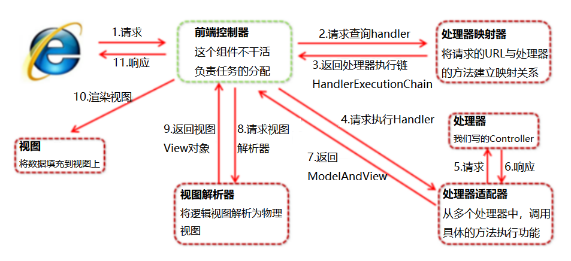

# 11月

## Java基础

### JDK JRE JVM的区别（必会）

- JDK：Java Development Kit，Java标准开发包，提供了编译和运行Java程序所需的各种工具和资源，包括**Java编译器**、**Java运行环境**，以及**常用的Java类库**等，程序员必须安装JDK来编译和调试程序
- JRE：Java Runtime Environment，Java运行环境。普通用户只需安装JRE，即可运行Java程序
- JVM：Java Virtual Mechine，Java虚拟机，是Java实现**跨平台的最核心部分**，负责解释执行字节码文件
- JDK包含JRE，JRE包含JVM
- JVM是Java的核心并且具有平台独立性（体系结构无关、可移植）


### 重载和重写的区别（必会）

- 重载：在**同一个类中**，<u>方法名相同，参数列表不一致</u>即构成重载，与返回值类型无关
- 重写：发生没有被private修饰的**在子父类中**，<u>方法名和参数列表必须相同</u>，子类的**返回值**、**抛出的异常**范围小于等于父类，**权限修饰符**范围大于等于父类


### ==和equals的区别（必会）

- ==
  - 基本类型：比较**值**是否相同
  - 引用类型：比较**地址值**是否相同
- equals
  - 重写前比较地址值
  - 重写后按重写方法的逻辑进行比较
- **String、Integer、Date**类中equals被重写过，比较的是内容


### String、StringBuffer、StringBuilder的区别（必会）

- String是**final类**，内部维护了一个常量字符数组`private final char value[];`，所以String类一旦实例化，他的值就不能改变
- StringBuffer类**JDK1.0**提供，为**字符串拼接**和将**其他对象转换为字符串**提供了特殊支持类，内部维护字符数组，其实例的值可以被改变，其字符串运算方法**由synchronized修饰**，是同步的
- StringBuilder类**JDK1.5**提供，与StringBuffer的API兼容，但**不同步**，用于在单线程下替代StringBuffer
- 区别：
  - String是final类，StringBuffer和StringBuilder不是
  - StringBuffer是JDK1.0提供，线程安全，在并发修改的情况下推荐；Stringbuilder是JDK1.5提供，线程不安全，单线程情况下推荐使用


### 单例模式（必会）

- 单列模式：在程序运行时，同一个类只有一个实例
- 常用的单例设计模式有五种
  - **饿汉式**
  - **懒汉式**
  - **懒汉加锁**
  - **懒汉双检锁**
  - **静态内部类**实现单例


### 接口和抽象类（必会）

- <u>抽象类</u>要被子类**继承**；<u>接口</u>要被类**实现**
- <u>抽象类</u>中的变量是**普通变量**；<u>接口</u>里定义的变量只能是**公共的静态的常量**
- <u>类</u>只能**单继承**；<u>接口</u>可继承接口，并且可以**多继承**


### 手写冒泡排序（必会）

```java
public static void bubbleSort(int[] buf){
    int temp;
    for (int i = 0; i < buf.length - 1; i++) {
        for (int j = 0; j < buf.length - 1 -i; j++) {
            if (buf[j] < buf[j+1]){
                temp = buf[j];
                buf[j] = buf[j+1];
                buf[j+1] = temp;
            }
        }
    }
}
```


## 二、集合

### List、Map、Set的区别（必会）

- <u>List和Set</u>是存储**单列数据**的集合，<u>Map</u>是存储键值对这样的**双列数据**的集合
- <u>List</u>中的数据是**有顺序、可重复的**
- <u>Set</u>中的数据是**无序的、不重复的**；<u>HashSet</u>靠重写**hashCode和equals**实现去重；<u>TreeSet</u>靠实现**Comparable接口**方法或**Comparator比较器**实现去重
- <u>Map</u>中是数据是**无序的**，他的**键不可以重复**，值可以重复


## 三、多线程

### 创建多线程的四种方式（必会）

- **继承Thread类**并重写run方法，实现简单但不能继承其他类
- 实现**Runnable接口**并重写run方法，避免了单继承局限性，实现解耦
- 实现**Callable接口**并重写call方法，可以获取线程执行结果的返回值，并且可以抛异常
- 使用**线程池**创建


### Runnable和callable的区别（必会）

- <u>Runnable</u>**无返回值**，**只能抛运行异常**，且**无法捕获处理**
- <u>callable</u>**有返回值**，支持**泛型**，**允许抛出异常**


### 如何启动一个新线程，调用start和run方法的区别（必会）

- 线程对象调用<u>run</u>方法**不开启线程**，仅是对象调用方法
- 线程对象调用<u>start</u>**开启线程**，并让jvm调用run方法在开启的线程中执行
- 调用start方法可以启动线程，并且使得线程进入就绪状态，而run方法只是thread的一个普通方法，还是在主线程中执行


### 线程有哪几种状态以及状态之间的转换（必会）

- 有NEW、RUNNABLE、TERMINATED、BLOCKED、WATING、TIMED_WATING六种状态

- NEW：尚未启动的线程处于此状态
- RUNNABLE：在Java虚拟机中执行的线程处于此状态
- BLOCKED：被阻塞等待监视器锁定的线程处于此状态
- WAITING：无限期等待另一个线程执行特定操作的线程处于此状态
- TIMED_WAITING：等待另一个线程执行操作的线程在指定的等待时间内处于此状态
- TERMINATED：已退出的线程处于此状态


### 线程相关的基本方法（必会）

- 线程相关基本方法有：wait、sleep、notifly、notiflyall、jion、yield等
- 线程等待（wait）：
  - 一般用在同步方法或同步代码块中，调用该方法线程会释放锁并进入WAITING状态，只有等待其他线程通知或被中断才会返回
- 线程睡眠（sleep）
  - 使当前线程进入TIMED_WAITING状态，但是不会释放锁，休眠时间到了后继续执行代码
- 线程让步（yield）
  - 使当前线程让出CPU执行时间片，重新参与锁的竞争
- 线程中断（interrupt）
  - 中断一个线程，会影响这个线程内部的中断标识位，但不会改变线程状态
- 等待其他线程终止（join）
  - 使当前线程转为阻塞状态，join另一个线程直到该线程结束，当前线程再有阻塞状态变为就绪状态，重新参与锁的竞争
- 线程唤醒（notify）
  - Object类的方法，唤醒正在等待锁的单个线程，如果有多个线程同时在等待，只会随机唤醒某个线程


### wait()和sleep()的区别（必会）

| 区别     | wait()                 | sleep()                |
| -------- | ---------------------- | ---------------------- |
| 所属类   | Object类               | Thread类               |
| 锁的释放 | 在等待过程中会释放锁   | 在等待过程中不会释放锁 |
| 使用范围 | 必须在同步代码块中使用 | 可以在如何地方使用     |


## 四、线程池

### Java中的线程池类

可进行缓存重复利用的线程池、可重用固定线程数的线程池、只执行一个线程的线程池（队列）、只执行一个线程的线程池（延迟或定期执行）、给定延迟运行命令或定期执行的线程池、带并行级别的线程池

1. newCachedThreadPool：创建一个**可进行缓存重复利用的线程池**
2. newFixedThreadPool：创建一个**可重用固定线程数的线程池**，以共享的无界队列方式来运行这些线程，线程池中的线程处于一定的量，可以很好的控制线程的并发量
3. newSingleThreadExecutor：创建一个使用单个 worker 线程的Executor ，以无界队列方式来运行该线程。线程池中**最多执行一个线程，之后提交的线程将会排在队列中以此执行**
4. newSingleThreadScheduledExecutor：创建一个**单线程**执行程序，它可安排在**给定延迟后运行命令或者定期执行**
5. newScheduledThreadPool：创建一个线程池，它可安排在**给定延迟后运行命令或者定期的执行**
6. newWorkStealingPool：创建一个带并**行级别的线程池**，并行级别决定了**同一时刻**最多有多少个线程在执行，如不传并行级别参数，将默认为当前系统的**CPU核心数*2**


### Java线程池创建时核心参数（高薪常问）

- corePoolSize：核心线程数量
- maximumPoolSize：最大线程数量（核心线程+临时线程）
- keepAliveTime：空闲线程存活时间
- unit：时间单位（毫秒、秒、分、时）
- workQueue：阻塞队列，用于保存任务的阻塞队列（默认为int最大值）
- threadFactory：创建线程的工程类
- handler：饱和策略（拒绝策略）默认会抛出异常


## 五、JVM

### ArrayList和LinkedList的区别

- 相同点：ArrayList和LinkedList都实现了List接口，用于存储一系列的引用对象。都可以对元素进行增删改查操作
- 底层原理：ArrayList是**基于动态数组**的数据结构，LinkedList是**基于链表**结构
- 区别：
  - 对于ArrayList，**在列表中间的部分增删时，当前索引后面的所有的元素都会被移动，所用时间就会大大增加**。但是它在**随机访问**时，因为是**根据索引查找元素**，所以**速度很快**。
  - 对于LinkedList则相反，它在集合中**任何位置增删元素所花费的时间都是一样的**，但是它**查询一个元素的时候却比较慢**
- 缺点：
  - LinkedList集合不支持高效的随机访问（RandomAccess），因为可能产生二次项的行为
  - ArrayList的**空间浪费**主要体现在在list列表的**结尾预留一定的容量空间**，而LinkedList的**空间花费**则体现在它的**每一个元素都需要消耗相当的空间**


### 二分查找

```java
private static int getIndex(int[] arr, int i) {
    int minIndex = 0;
    int maxIndex = arr.length - 1;

    while (minIndex <= maxIndex) {
        int midIndex = (minIndex + maxIndex) / 2;
        if (i < arr[midIndex]) {
            maxIndex = midIndex - 1;
        } else if (i > arr[midIndex]) {
            minIndex = midIndex + 1;
        } else {
            return midIndex;
        }
    }

    return -1;
}
```


### 网络七层架构

- 物理层
  - 主要定义物理设备标准，如**接口类型、传输速率**等。主要作用是**传输比特流**，模数转换和数模转换发生在这一层，这一层的数据叫做**比特**
- 数据链路层
  - 主要将物理层接收的数据进行**MAC地址的封装和解封装**。这一层的数据叫做**帧**，工作设备主要是**交换机**
- 网络层
  - 主要将下层接收到的数据进行**IP地址的封装和解封装**。这一层的数据叫做**数据包**，工作设备主要是**路由器**
- 传输层
  - 定义传输数据的**协议和端口**，主要是将从下层接收的数据进行**分段传输**，到达目的地址后进行**重组**。这一层数据叫做**段**
- 会话层
  - 通过传输层建立数据传输的通道，主要是在系统之间**发起会话**或**接受会话请求**
- 表示层
  - 主要对接收的数据进行**解释**、**加密和解密**、**压缩和解压缩**等，也就是把计算机能够个识别的东西**转换成人能识别**的东西
- 应用层
  - 主要是一些**终端应用**


### TCP和UDP的区别

- **连接**
  - TCP需要建立连接；
  - UDP无需建立连接
- **可靠性**
  - TCP提供交付保证，传输过程数据丢失会重发；
  - UDP不提供交付保证，传输过程数据会丢失
- **有序性**
  - 信息到达网络另一端时可能是无序的，TCP会进行排序，UDP不提供排序
- **速度**
  - TCP比较慢，UDP速度比较快；因为TCP必须创建连接
- **报头大小**
  - TCP是重量级协议，报头最少是20字节，包含源端口、目的端口、序列号、ACK号、数据偏移量、保留、控制位、窗口、紧急指针、可选项、填充项、校验位
  - UDP是轻量级协议，报头固定8个字节，包含长度、源端口号、目的端口、校验位
- **流量控制和拥塞控制**
  - TCP有流量控制和拥塞控制
  - UDP没有流量控制和拥塞控制
- **边界记录**
  - TCP是面向字节流的协议，无边界记录
  - UDP是面向报文的协议，发送的每个数据报都是记录型的数据报，就是接收进程可以识别接收到的数据报的记录边界
- **广播和组播**
  - TCP只能单播
  - UDP可以广播和组播
- **应用场景**
  - TCP：因为传输中需要对数据进行确认、重发、排序等操作，相比之下效率没有UDP高。因此应用在效率要求相对低，但对准确性要求相对高的场景。如：文件传输、邮件传输、远程登录
  - UDP应用在效率要求相对高，对准确性要求相对低的场景。如：视频聊天、即时通讯、广播通信


# 12月

## 数据库

### 连接查询

- 内连接
  - 隐式内连接：`select 字段名 from 表1，表2 where 条件;`
  - 显式内连接：`select 字段名 from 表1 [inner] join 表2 on 表连接条件;`
- 外连接
  - 左外连接：`select 字段名 from 表1 left [outer] join 表2 on 表连接条件;`
    - 以左表为基准进行查询，左表的数据会全部显示出来，右表如果和左表匹配，则显示相应的数据，如果不匹配，则显示为null
  - 右外连接：`select 字段名 from 表1 right [outer] join 表2 on 表连接条件;`
    - 以右表为基准进行查询，右表的数据会全部显示出来，左表如果和左表匹配，则显示相应的数据，如果不匹配，则显示为null


### 聚合函数

- count：是用来统计值为非NULL字段数量的；当字段名为*时统计所有行数
- sum：对数值类型的字段求和
- avg：对数值类型的字段求平均值
- max：对数值类型的字段求最大值
- min：对数值类型的字段求最小值


### SQL关键字

- 分页limit：`select * from 表名 limit 跳过数量,显示数量;`
- 分组groud by：`select 字段名, count(*) from 表名 groud by 字段名;`
- 去重distinct：`select distinct 字段名 from 表名;`


### SQL Select语句完整执行顺序

from ... on ... left join ... where ... group by ... sum()/avg() ... having ... select ... order by ... asc/desc ... limit

from	连接查询	where	分组、聚合函数	having	select	排序、asc/desc	limit

### 数据库事务

- 事务特性ACID
  - **原子性**：事务是不可分割的最小操作单位，要么同时成功，要么同时失败
  - **一致性**：使得数据库从一种正确状态转换成另一种正确状态
  - **隔离性**：在事务正确提交之前，不允许把该事务对数据的任何改变提供给任何其他事务
  - **持久性**：事务正确提交后，其结果将永久保存在数据库中，即使在事务提交后有了其他故障，事务的处理结果也会得到保存
- 隔离级别
  - **读未提交**：所有的事务都可以读取到别的事务中未提交的数据，会产生**脏读**问题
  - **读已提交**：是**大多数数据库默认的隔离级别**，满足了简单的隔离要求：一个事务只能看见已经提交事务的数据，可以避免脏读问题；但随之而来产生了**不可重复读**和**虚读**等问题
    - 不可重复读：是指在一个事务内，多次读同一数据。在这个事务还没有结束时，另外一个事务也访问该同一数据。那么，在第一个事务中的两次读数据之间，由于第二个事务的修改，那么第一个事务两次读到的的数据可能是不一样的。这样就发生了在一个事务内两次读到的数据是不一样的，因此称为是不可重复读。
    - 幻读（虚读）：是指当事务不是独立执行时发生的一种现象，例如第一个事务对一个表中的数据进行了修改，这种修改涉及到表中的全部数据行。同时，第二个事务也修改这个表中的数据，这种修改是向表中插入一行新数据。那么，以后就会发生操作第一个事务的用户发现表中还有没有修改的数据行，就好象发生了幻觉一样。
    - 不可重复读和幻读（虚读）差别
      不可重复读的重点是修改： 同样的条件，你读取过的数据，再次读取出来发现值不一样了
      幻读的重点在于新增或者删除： 同样的条件，第 1 次和第 2 次读出来的记录数不一样
      简单来讲，前一个是读取到的数据不一样，后一个是读取到的数据量不一样
  - **可重复读**：**MySQL默认隔离级别**，确保了一个事务中多个实例在并发读取数据时，读取到一样的数据；但也导致了**幻读**的问题
    - 幻读指当用户读 取某一范围的数据行时，另一个事务又在该范围内插入了新行，当用户再读取该范围的数据行时，会发现有新的“幻影” 行，可通过**多版本并发控制**（MVCC）机制解决该问题
  - **可串行化**：事务的最高级别，通过强制事务排序，使之不会相互冲突，从而解决幻读问题。它是在每个读的数据行上加锁，这样一来大幅降低事务的并发能力


### SQL语言分为哪几部分

- 数据定义DDL：creat创建、alter修改、drop删除
- 数据操作DML：insert增、delete删、update改
- 数据控制DCL：grant允许、revoke废弃
- 数据查询DQL：select查询


## MyBatis

### 在Mybatis中，${} 和 #{} 的区别是什么?

- ${}：底层是statement，实际上是对变量进行字符串的拼接，因此存在SQL注入的风险
- #{}：底层是preparedStatement，实际上是将其替换为？，并进行预编译，可以防范SQL注入


### 在Mybatis中，resultType和ResultMap的区别是什么?

- 一般情况下，当数据库字段名和实体类对象的成员变量名一致时，用resultType
- 当数据库字段名和实体类对象的成员变量名不一致时，用resultMap，通过resultMap手动建立映射关系
- 但是，在多表查询时，即使类的成员变量名和数据库字段名一致，也不会完成自动映射，需要通过resultMap手动建立映射关系


### 在Mybatis中，动态SQL标签有哪些?作用是什么?

- if标签，用于判断传入的值是否符合某种规则
  - `<if test=" ... ">`
- where标签，用于做动态拼接查询条件，自动补全where关键字，去掉多余的and和or关键字
- set标签，用在update语句中，相当于set关键字，可去掉SQL语句中多余的逗号
- foreach标签，用于对传入的集合进行遍历，把每一项内容作为参数传入SQL语句汇中
  - `<foreach collection="list" item="id" open="(" separator="," close=")">`
- include标签，用于将大量的重复代码整理起来，减少代码重复率，当使用的时候直接include即可


## 复习部分

### List、Set、Map的区别（必会）

- <u>List和Set</u>是存储**单列数据**的集合，<u>Map</u>是存储键值对这样的**双列数据**的集合
- <u>List</u>中的数据是**有顺序、可重复的**
- <u>Set</u>中的数据是**无序的、不重复的**；<u>HashSet</u>靠重写**hashCode和equals**实现去重；<u>TreeSet</u>靠实现**Comparable接口**方法或**Comparator比较器**实现去重
- <u>Map</u>中是数据是**无序的**，他的**键不可以重复**，值可以重复


### 创建多线程的四种方式（必会）

- **继承Thread类**并重写run方法，实现简单但不能继承其他类
- 实现**Runnable接口**并重写run方法，避免了单继承局限性，实现解耦
- 实现**Callable接口**并重写call方法，可以获取线程执行结果的返回值，并且可以抛异常
- 使用**线程池**创建


### Runnable和callable的区别（必会）

- <u>Runnable</u>**无返回值**，**只能抛运行异常**，且**无法捕获处理**
- <u>callable</u>**有返回值**，支持**泛型**，**允许抛出异常**


### Java中的线程池类

可进行缓存重复利用的线程池、可重用固定线程数的线程池、只执行一个线程的线程池（队列）、只执行一个线程的线程池（延迟或定期执行）、给定延迟运行命令或定期执行的线程池、带并行级别的线程池

1. newCachedThreadPool：创建一个**可进行缓存重复利用的线程池**
2. newFixedThreadPool：创建一个**可重用固定线程数的线程池**，以共享的无界队列方式来运行这些线程，线程池中的线程处于一定的量，可以很好的控制线程的并发量
3. newSingleThreadExecutor：创建一个使用单个 worker 线程的Executor ，以无界队列方式来运行该线程。线程池中**最多执行一个线程，之后提交的线程将会排在队列中以此执行**
4. newSingleThreadScheduledExecutor：创建一个**单线程**执行程序，它可安排在**给定延迟后运行命令或者定期执行**
5. newScheduledThreadPool：创建一个线程池，它可安排在**给定延迟后运行命令或者定期的执行**
6. newWorkStealingPool：创建一个带并**行级别的线程池**，并行级别决定了**同一时刻**最多有多少个线程在执行，如不传并行级别参数，将默认为当前系统的**CPU核心数*2**


### Java线程池创建时核心参数（高薪常问）

- corePoolSize：核心线程数量
- maximumPoolSize：最大线程数量（核心线程+临时线程）
- keepAliveTime：空闲线程存活时间
- unit：时间单位（毫秒、秒、分、时）
- workQueue：阻塞队列，用于保存任务的阻塞队列（默认为int最大值）
- threadFactory：创建线程的工程类
- handler：饱和策略（拒绝策略）默认会抛出异常


## Web

### GET和POST的区别

- GET是from默认的提交方式，执行效率比POST要高
- 请求体：GET没有请求体
- 安全性：
  - GET的参数放在URL中，是不安全的；
  - POST请求参数通过消息体传输，相对安全
- 数据量：
  - GET传输的数据受URL长度限制，数据量较小，一般在18kb以内；
  - POST传输的数据量不受限制
- 编码：
  - GET请求使用的是ASCII字符；
  - POST请求使用的是ISO10646字符集
- 使用情形：
  - 传输非敏感数据，数据量小，推荐使用get；
  - 传输敏感数据，数据量大，推荐使用post


### Servlet生命周期

- web服务器从创建servlet对象到销毁的过程
- 方法：
  - init()：初始化方法，在创建servlet对象后立即调用，只会调用一次
  - service()：处理请求方法，每次请求时都会调用
  - destroy()：销毁方法，当前服务器关闭或重启时调用
- 创建时机
  - 默认是第一次访问时创建servlet对象，并且只会创建一次，是单例对象
  - 通过配置loadOnStartup可以设置创建时机
    - 负整数：第一次被访问时再创建Servlet对象
    - 0或正整数：服务器启动时创建Servlet对象，数字越小优先级越高


### HTTP中重定向和请求转发的区别

- 请求转发：是一种服务器内部的资源跳转方式
  - 实现：`request.getRequestDispatcher("资源路径").forword(request,response);`
  - 浏览器只发出一次请求，URL不改变
  - 只能转发到当前服务器内部的资源
  - 可以在转发的资源间共享数据
- 重定向：是一种资源跳转方式
- 实现：方式一：`response.SetStatus(302);response.SetHeader("location",""资源路径);`，方式二：`response.sendRedirect("资源路径");`
  - 浏览器发出两次请求，URL发生改变
  - 可以重定向到任意位置的资源
  - 不能在资源键共享数据


### Jsp和Servlet的区别

- JSP本质上就是一个Servlet，最终调用的就是==_jspService方法==。JSP在被访问时，由JSP容器（Tomcat）将其转换为Java文件（Serclet），再由JSP容器（Tomcat）将其编译，最终对外提供服务的其实就是这个字节码文件

  

- 不同点：

  - JSP侧重展现数据，servlet主要用于逻辑控制和获取数据
  - jsp中的内置对象都必须通过HttpServletRequest对象，HttpServletResponse对象以及HttpServlet对象得到；servlet中没有内置对象


### cookie和session的区别

- 存储位置
  - cookie的数据存储在客户端浏览器上，不占用服务器资源，并发友好
  - session的数据存储在服务器上，占用服务器资源
- 存储容量不同
  - 单个cookie的大小<=4kb
  - session没有限制
- 存储方式不同
  - cookie只能保管ASCII字符串，并需要通过编码存储为unicode字符或二进制数据
  - session中能存储任何类型的数据，包括但不限于string、integer、list、map
- 安全性
  - cookie存储在客户端，对于用户是可见的，存在cookie欺骗
  - session存储在服务器上相对更加安全
- 有效期不同
  - cookie可以通过设置达到长期有效
  - session默认是在浏览器关闭则失效


## Ajax

### 什么是Ajax，及其优势

- Ajax即异步的JavaScript和XML，能在不更新整个页面的前提下更新数据
  - 提升用户体验
  - 优化了浏览器和服务器之间传输的数据量，减少不必要的数据传输，降低宽带占用


### JavaWeb的三大组件及作用

- Servlet：用于处理请求与响应
- Filter：用于拦截请求与响应
- Listener：用于监听三大域对象request、response、servletContext的创建和销毁，以及域中数据发生变化时调用监听器实现逻辑控制


### 过滤器

- 执行流程：访问被拦截的web资源时首先会经过过滤器，执行放行前的代码当放行后再访问web资源最后在返回到过滤器执行放行后的代码
- 生命周期：在服务器启动时创建，服务器关闭之前销毁
- 应用场景：权限控制、全局乱码统一处理


### 监听器

- 实现步骤：
  - 创建类实现监听器接口
  - 重写监听器接口的所有方法
  - 在实现类上添加@WebListener注解，定义为监听类
- 应用场景：对ServletContext监听，在ServletContext对象创建后和销毁前，进行创建mysql连接池、线程池等操作、销毁mysql连接池、线程池等操作


# 1月

## Spring

### Spring的两大核心是什么?

- IOC：**控制反转**，是一种**解耦合**的设计思想
  - 就是将原本在程序中手动创建对象的**控制权交给spring**框架来管理
  - 当程序中需要一个对象时，**不再使用new的方式**主动创建，而是从spring容器中获取，spring容器会通过**工厂模式**来创建对象
  - 如果容器中的对象**依赖于其他对象**，spring则会依赖IOC容器来**动态注入**对象需要的外部资源
  - IOC的注入方式：构造器注入、setter方法注入、根据注解注入
- AOP：**面向切面编程**，核心思想是将那些**与业务无关**，却被业务模块**共同使用**的功能抽取并**封装**为一个单独的模块，这个模块就称为“切面”
  - AOP是**基于动态代理**实现的，底层同时支持**JDK和CGlib**的代理方式，会根据被代理类**是否有接口**自动选择代理方式。当被代理类有接口时，就会使用JDK动态代理；如果没有接口，就会使用CGlib动态代理，JDK动态代理（反射机制）的效率会比CGlib（字节码技术）的效率更高。
  - 主要的应用场景有：事务管理、日志、性能监视、安全检查等
  - 使用AOP可以减少系统的**冗余代码**，降低模块间的**耦合度**，有利于代码的**扩展和维护**


### Spring支持bean的作用域有几种吗? 每种作用域是什么样的?

- singleton：**单例模式**，对象仅创建一次，然后一直存在容器中（随Spring容器启动而创建；随Spring容器销毁而销毁）
- prototype：**多例模式**，每次获取对象时，容器都会创建一个新对象（spring框架只负责创建，不负责销毁；销毁时机是由Java垃圾回收机制决定的 ）
- request：每一次**HTTP请求**都会产生一个新的对象，该对象仅在当前请求内有效
- session：每一次**HTTP会话**都会产生一个新的对象，该对象仅在当前会话内有效


### Spring框架中都用到了哪些设计模式?

- **工厂模式**：Spring使用工厂模式通过**BeanFactory**和**ApplicationContext**创建bean对象
- **单例模式**：Spring中的**bean**默认都是单例的
- **代理模式**：Spring的AOP功能用到了**JDK**的动态代理和**CGLIB**字节码生成技术
- **模板方法**：用来解决代码重复的问题，比如**RestTemplate**、**jdbcTemplate**
- **适配器模式**：Spring**AOP的增强或通知**使用到了适配器模式
- **观察者模式**：Spring**事件驱动模型**，如Spring实现**ApplicationListener**


### Spring常用注解

| 注解                        | 作用                                                         |
| --------------------------- | ------------------------------------------------------------ |
| @Component（任何层）        | 用于实例化对象                                               |
| @Controller                 | 用于实例化对象                                               |
| @Service                    | 用于实例化对象                                               |
| @Repository（dao层）        | 用于实例化对象                                               |
| @Scope                      | 设置spring对象的作用域                                       |
| @PostConstruct、@PreDestory | 用于设置spring创建对象之后和销毁之前要执行的方法             |
| @Value                      | 简单属性的依赖注入                                           |
| @Autowired                  | 对象属性的依赖注入                                           |
| @ComponentScan              | 组件扫描                                                     |
| @Bean                       | 用于将方法的返回值对象放入容器                               |
| @PropertySource             | 用于引入其它的properties配置文件                             |
| @Import                     | 在一个配置类中导入其它配置类的内容                           |
| @Configuration              | 被此注解标注的类会被Spring认为是配置类，Spring在启动时会自动扫描并加载所有配置类，然后将配置类中bean放入容器 |
| @Transactional              | 此注解可以标注在类上，也可以标在方法上，表示当前类中的方法具有事务管理功能 |


### Spring支持的事务管理方式

- 编程式事务：在代码中硬编码，此方式的缺点是代码耦合，复用性低；优点是可以精确控制要增强的代码（不仅仅限于方法的粒度）
- 声明式事务：是AOP思想的一种应用，将业务方法作为切点，将事务处理方法作为增强，通过动态代理实现事务的管理，此方法优缺点与编程式相反


### Spring的事务传播行为

事务传播行为是为了**解决业务层方法之间相互调用**的事务问题，当事务方法被另一个事务方法调用时，必须指定事务应该如何传播。

Spring支持7种事务传播行为

- propagation_**required（必须）**：存在就加入；没有就创建
- propagation_**requires_new（必须新）**：创建新事务，有就挂起
- propagation_**supports（支持）**：存在就加入；没有就非事务
- propagation_**not_supported（不支持）**：非事务运行，有就挂起
- propagation_**mandatory（强制）**：存在就加入；没有就抛异常
- propagation_**never（强制没有）**：非事务运行，有就抛异常
- propagation_**nested（嵌套）**：如果当前存在事务，则创建一个事务作为当前事务的子事务来运行；如果当前没有事务，则创建一个事务（嵌套事务开始执行时，将取得一个保存点，如果这个嵌套事务失败，将回滚到此保存点；嵌套事务是外部事务的一部分，只有当外部事务结束后它才会被提交）


### spring的事务隔离级别

- isolation_default：这个是PlatfromTransactionManager默认的隔离级别，使用数据库默认的事务隔离级别
- isolation_read_uncommitted：**读未提交**：所有的事务都可以读取到别的事务中未提交的数据，会产生**脏读**问题
- isolation_read_committed：**读已提交**：是**大多数数据库默认的隔离级别**，满足了简单的隔离要求：一个事务只能看见已经提交事务的数据，可以避免脏读问题；但随之而来产生了**不可重复读**和**虚读**等问题
- isolation_repeatable_read：**可重复读**：**MySQL默认隔离级别**，确保了一个事务中多个实例在并发读取数据时，读取到一样的数据；但也导致了**幻读**的问题
- isolation_serializable：**可串行化**：事务的最高级别，通过强制事务排序，使之不会相互冲突，从而解决幻读问题。它是在每个读的数据行上加锁，这样一来大幅降低事务的并发能力

```
- 不可重复读：是指在一个事务内，多次读同一数据。在这个事务还没有结束时，另外一个事务也访问该同一数据。那么，在第一个事务中的两次读数据之间，由于第二个事务的修改，那么第一个事务两次读到的的数据可能是不一样的。这样就发生了在一个事务内两次读到的数据是不一样的，因此称为是不可重复读。
- 幻读（虚读）：是指当事务不是独立执行时发生的一种现象，例如第一个事务对一个表中的数据进行了修改，这种修改涉及到表中的全部数据行。同时，第二个事务也修改这个表中的数据，这种修改是向表中插入一行新数据。那么，以后就会发生操作第一个事务的用户发现表中还有没有修改的数据行，就好象发生了幻觉一样。
- 不可重复读和幻读（虚读）差别
  不可重复读的重点是修改： 同样的条件，你读取过的数据，再次读取出来发现值不一样了
  幻读的重点在于新增或者删除： 同样的条件，第 1 次和第 2 次读出来的记录数不一样
  简单来讲，前一个是读取到的数据不一样，后一个是读取到的数据量不一样

- 幻读指当用户读 取某一范围的数据行时，另一个事务又在该范围内插入了新行，当用户再读取该范围的数据行时，会发现有新的“幻影” 行，可通过**多版本并发控制**（MVCC）机制解决该问题
```


### Spring 的对象默认是单例的还是多例的? 单例 bean 存不存在线程安全问题呢?

- 单例的
- 单例对象是所有线程共享一个实例，因此就可能会存在线程安全问题。但是单例对象又分为无状态和有状态
  - **无状态**对象，只对对象的成员变量进行**查询**操作，不会修改成员变量的值，因此不存在线程安全问题
  - **有状态**对象，会对成员变量的数据进行**修改**操作，因此存在线程安全问题
  - 所以，只有有状态的单例对象才会存在线程安全问题
- 处理方式：
  - 将作用域由**singleton改为prototype**
  - 在类中定义**ThreadLocal**的成员变量，将可变的成员变量保存在TheadLocal中，相当于为每个线程提供了一个独立的变量副本，每个线程只需要操作自己的线程副本变量，从而解决线程安全问题


## SpringMVC

### SpringMVC主要组件

- **DispatcherServlet：前端控制器**，接收请求、响应结果，相当于转发器
- **HandleMapping：处理映射器**，根据请求的URL来查找Handler
- **HandleAdapter：处理器适配器**，负责调用处理器Handler
- **Handler：处理器**，需要程序员开发，处理业务逻辑的Java类
- **ViewResolver：视图解析器**：进行视图的解析，根据视图逻辑名解析成真正的视图
- **View：视图页面**，它的实现类支持不同的视图类型（jsp、freemarker、pdf等等）


### 谈一下SpringMVC的执行流程以及各个组件的作用



1. 用户发送请求到前端控制器DispathcherServlet
2. 前端控制器DispathcherServlet收到请求调用处理器映射器HandlerMapping，去查找处理器Handler
3. 处理映射器HandlerMapping找到具体的处理器Handler（可以根据XML配置、注解进行查找）及拦截器（如果有），返回给映射器前端控制器DispathcherServlet
4. 前端控制器DispathcherServlet调用处理器适配器HandlerAdapter
5. 处理器适配器HandlerAdapter调用自定义的处理器类（Controller，也叫后端控制器），将得到的参数进行处理并返回结果给处理器适配器HandlerAdapter
6. 处理器适配器HandlerAdapter将得到的结果返回给前端控制器DispathcherServlet
7. 前端控制器DispathcherServlet将ModelAndView传给视图解析器ViewReslover
8. 视图解析器ViewReslover将得到的参数从逻辑视图转换为物理视图并返回给前端控制器DispatherServlet
9. 前端控制器DispatherServlet调用物理视图进行渲染并返回
10. 前端控制器DispatherServlet将渲染后的结果返回给浏览器


### SpringMVC支持的转发和重定向的写法

- 转发：  forward方式：在返回值前面加“forward”，比如forword:user.do?name=zhangsan
- 重定向：redireat方式：在返回值前面加redirect，比如redirect:http://www.baidu.com


### SpringMVC常用注解

| 注解                               | 作用                                                         | 位置                 |
| ---------------------------------- | ------------------------------------------------------------ | -------------------- |
| @RequestMaping                     | 用于处理url请求路径映射                                      | 类或方法上           |
| @RequestBody                       | 实现接收http请求的json数据，并转换为java对象                 | 形参前               |
| @ResponseBody                      | 实现将controller方法返回对象转换为json对象                   |                      |
| @PathVariable                      | /test/id => /test/{id}从url路径上获取指定参数，@PathVariable("参数名") | 形参前               |
| @RequestParam                      | /test?id=10，用于对传入的参数做一些限制，其中属性有<br>- value：默认属性，用于指定传入参数的名称<br>- required：用于指定此参数是否必传<br>- defaultValue：当参数为非必传且没有传入时，指定一个默认值 | 形参前               |
| @ControllerAdvice                  | 表示该类是一个全局异常处理类                                 | 类上                 |
| @ExceptionHandler(Exception.class) | 表示该方法可以处理的异常类型                                 | 处理异常类中的方法上 |


### SpringMVC统一异常处理的思想和实现方法

- 对异常进行抛出，最终会抛到框架中，由框架指定异常处理类进行统一处理
  - 方式一：创建一个自定义处理器（实现HandlerExceptionResolver接口），并实现里面的异常处理方法，然后将这个类交给Spring容器管理
  - 方式二：在类上添加@ControllerAdvice注解，表明这是一个全局异常处理类，在方法上添加@ExceptionHandler注解，在ExceptionHandler中的value属性指定可以处理的异常类型


### SpringMVC通过转发数据传递到前台的几种写法？

- 方式一：直接使用request域进行数据传递
  - request.setAttirbuate("name", value);
- 方式二：使用Model进行传递，底层会将数据放入request域进行数据传递
  - model.addAttribuate("name", value);
- 方式三：使用ModelMap传递，底层会将数据放入request域进行数据传递
  - modelmap.put("name", value);
- 方式四：借用ModelAndView在其中设置数据和视图
  - mv.addObject("name", value);
  - mv.setView("success");
  - return mv;


### SpringMVC中拦截使用步骤？

- 创建一个类实现HandlerInterceptor，重写接口中的抽象方法

  - preHandle方法：在调用处理器之前调用该方法，如果返回true则请求继续进行
  - postHandle方法：在调用完处理器后调用该方法
  - afterCompletion方法：在前端控制器渲染完页面后嗲用该方法

- 注册拦截器

  ```
  @Configuration
  public class WebMvcConfig implements WebMvcConfigurer {
  
      @Override
      public void addInterceptors(InterceptorRegistry registry) {
          registry.addInterceptor(new 自定义的拦截器对象).addPathPatterns("拦截路径规则").excludePathPatterns("放行规则");
      }
  }
  ```


### SpringBoot的优点

- **版本锁定**：SpringBoot在**父工程**中进行了大量常见依赖版本锁定，省去了我们**查找依赖版本**和**解决版本冲突**的麻烦
- **起步依赖**：SpringBoot以**功能化的方式**将需要的依赖进行**组装**，我们只要**以start的方式**进行引入
- **默认配置**：SpringBoot实现了**大量依赖框架的默认配置项**，我们无须再进行配置
- **内置Tomcat**：SpringBoot内置了一个tomcat，使用它开发的程序无需再进行tomcat部署，可以直接运行


### SpringBoot的启动器starter

- starter启动器，可以通过启动器集成其他的技术，可以提供对应技术的开发和运行环境
- 执行原理
  - springboot启动时会扫描jar包中的spring.factories文件，去加载自动配置类，创建这些类的对象，放到spring容器中


### SpringBoot中的配置文件

- application和bootstrap两种配置文件
- bootstrap由父ApplicationContext加载，比application配置文件优先被加载，是不能被覆盖的属性，可以加载一些加密/解密的数据
- 读取配置文件的方式
  - 直接获取注入Environment进行获取，这个对象是Spring默认提供的封装配置的对象
  2. 使用@Value注解直接注入对应的值，这能获取到Spring中Environment的值
  3. 使用@ConfigurationProperties注解把对应的值绑定到一个配置对象，然后将配置对象注入到需要读取配置的对象


### SpringBoot常用注解

| 注解                                 | 作用                                                         | 位置 |
| ------------------------------------ | ------------------------------------------------------------ | ---- |
| @SpringBootApplication               | 封装了核心的@SpringBootConfiguration+@EnableAutoConfiguration +@ComponentScan这三个类 |      |
| @MapperScan                          | 指定mybatis接口类的路径，完成对mybatis接口的扫描             |      |
| @RestController                      | 是@Controller 和@ResponseBody的结合                          |      |
| @RequestMapping                      | 请求路径                                                     |      |
| @Get/Post/Put/DeleteMapping          | RESTful风格指定子路径                                        |      |
| @PathVariable                        | 路径变量注解，用{}定义url部分的变量名                        |      |
| @Service                             | 标记业务层的注解                                             |      |
| @Component                           | 注入到IOC容器中                                              |      |
| @ControllerAdvice和@ExceptionHandler | 配合完成统一异常拦截处理                                     |      |


### SpringBoot自动装配原理


- SpringBoot自动装配主要是**基于注解编程**和**约定优于配置**的思想来进行设计的
- 自动装配就是自动地把其他组件中的**Bean装载到IOC容器中**，不需要再去配置文件中添加大量配置
- 我们只需要在SpringBoot的启动类上**添加一个@SpringBootApplication的注解**,就可以开启自动装配
- SpringBootApplication底层最重要的一部分是**@EnableAutoConfiguration**这个注解来实现的，归纳为以下三个核心步骤
  - SpringBoot会**读取所有jar包/META-INF/spring.factories文件**中EnableAutoConfiguration**键对应的值**（SpringFactories机制）
  - 这些值必须**声明为Spring的配置类**，也就是在类中添加@Configuration注解
  - 为了防止非当前所需要的组件进入到容器，配置类中需要**使用@Conditional注解**来声明配置成立的必要条件


## 复习部分

### 在Mybatis中，${} 和 #{} 的区别是什么?

- ${}：底层是**statement**，实际上是对变量进行字符串的拼接，因此存在SQL注入的风险
- #{}：底层是**preparedStatement**，实际上是将其替换为？，并进行预编译，可以防范SQL注入


### 创建线程有几种方式（必会  )

- **继承Thread类**并重写run方法，实现简单但不能继承其他类
- 实现**Runnable接口**并重写run方法，避免了单继承局限性，实现解耦
- 实现**Callable接口**并重写call方法，可以获取线程执行结果的返回值，并且可以抛异常
- 使用**线程池**创建


### java 线程池创建时核心参数（高薪常问）

- corePoolSize：核心线程数量
- maximumPoolSize：最大线程数量（核心线程+临时线程）
- keepAliveTime：空闲线程存活时间
- unit：时间单位（毫秒、秒、分、时）
- workQueue：阻塞队列，用于保存任务的阻塞队列（默认为int最大值）
- threadFactory：创建线程的工程类
- handler：饱和策略（拒绝策略）默认会抛出异常