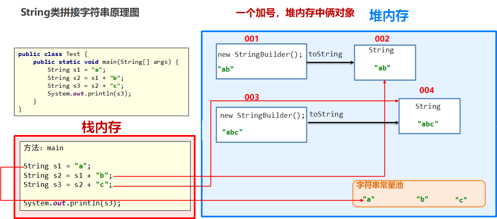
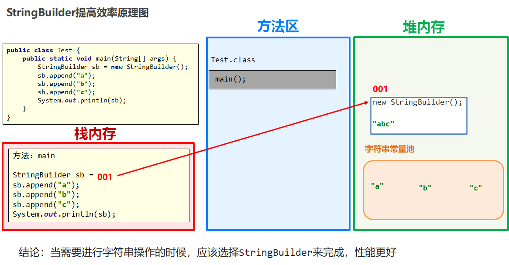

#### 多态

- 概述：多态是同一个**行为（方法）**具有多种不同表现形式。

- 前提：

  - 有继承/实现关系
  - 有方法重写
  - 有父类引用指向子类对象或接口指向实现类对象

- 特点

  - 方法调用：编译看左边（父类），运行看右边（子类）

  ```
  Animal a = new Cat();
  对象a能调用什么方法，由对象a左边的父类决定
  方法运行的效果，由对象a右边new出来的子类决定
  ```

  - 变量调用：编译看左边（父类），运行也看左边（父类）

  ```
  Animal a = new Cat();
  对象a能够访问哪些成员变量，以及变量的结果是多少，全部取决于a左边的父类。（即变量没有多态性）
  ```

- 优点：1.右边对象实现解耦，提高代码的拓展性、2.定义方法时，如果将父类或接口作为参数，在调用方法时，可以传递任意子类对象，极大提高方法的通用性
- 缺点：多态下不能使用子类的特有功能
- 多态类型转换：

```
//向上转型：子类到父类（自动类型转换）
Dog dog = new Dog();
Animal a = dog;
//向下转型：父类到子类（强制类型转换）
Animal a = new Dog();
Dog dog = (Dog)a;
```

- **instanceof**
  - 判断左边的对象是否属于右边的类型，是返回true，否返回false

```java
public static void skill(Animal a){
    if (a instanceof Dog){
        ((Dog) a).lookHome();
    }else if (a instanceof Cat){
        Cat c = (Cat)a;
        c.catchMouse();
    }
}
```


#### Object

- Object类：Object类是所有类的直接或者间接父类

- toString方法：
  - toString方法得到的是对象的地址值，格式为“类全名@16进制地址值"
  - 打印对象时默认都是调用了toString方法，打印地址
  - 一般会重写toString方法，以便打印对象中的具体数据
  
- equals方法
  - 比较两个对象是否相等，默认比较使用==比较两个对象地址值
  - 如果想比较对象的内容，需要重写该方法
  
  【注意】
  
  ```java
  String s1 = null;
  String s2 = new String("str");
  System.out.pringln(s1.equals(s2));	//留有隐患，当比较对象为null时会出现空指针异常
  //保险做法（即使重写了equals方法也可以使用这样的写法）
  System.out.pringln(Object.equals(s1,s2));	//false，比较前会进行非空判断
  ```
  
  


#### 内部类

- 概述：在Java中，允许一个类定义在另一个类的内部，前者称为内部类（寄生类），后者称为外部类（宿主类）

- 静态内部类（static修饰）

  - 静态内部类中可以直接访问外部类的静态成员
  - 静态内部类中不可以直接访问外部类的实例成员，外部类的实例成员必须用外部类对象访问

  ```java
  //创建对象格式：
  外部类名.内部类名 对象名 = new 外部类名.内部类构造器
  Car.Engine c = new Car.Engine("阿斯顿马丁");
  ```

- 成员内部类

  - 无static修饰，属于外部类对象
  - JDK16之前，成员内部类中不能定义静态成员
  - 成员内部类的实例方法可以直接访问外部类的实例成员，因为必须先有外部类对象，才能有成员内部类对象

  ```java
  //创建对象格式：
  外部类名.内部类名 对象名 = new 外部类构造器().new 内部构造器();
  Body.Heart a = new Body().new Heart(100);
  ```

- 局部内部类（语法鸡肋，开发不会用到）

- 匿名内部类（重点）

  - 使用前提：存在一个接口或抽象类
  - 作用：方便创建接口或者省略创建抽象类的子类对象，最终目的是为了简化代码编写
- 特点：
    - 本身会产生class文件
    - 匿名内部类是一个没有名字的内部类
    - 匿名内部类会产生一个匿名内部类的对象
    - 匿名内部类的对象类型相当于是当前new的那个的类型的子类类型
    
  ```java
  //使用匿名内部类简化类的定义，既是定义类，又是创建对象，只不过定义出来的类没有名字
  //使用匿名内部类传参，节省定义实现类的过程
  //实际开发中，如果方法的参数是接口，通常会直接使用匿名内部类传参
  public static void main(String[] args) {
      Swimming s = new Swimming() {
          @Override
          public void swim() {
              System.out.println("学生快乐的自由泳🏊‍");
          }
      };
      go(s);
  
      System.out.println("--------------");
  
      go(new Swimming() {
          @Override
          public void swim() {
              System.out.println("运动员🏊的贼快啊~~~~~");
          }
      });
  }
  
  public static void go(Swimming s){
      System.out.println("开始。。。");
      s.swim();
      System.out.println("结束。。。");
  }
  ```
  
  ```java
  //接口
  interface Swimming{
      void swim();
  }
  ```
  
  

#### 枚举

- 枚举的作用是进行取值的规范和分类

```java
public enum 枚举名称{
    枚举值1,枚举值2,枚举值3,...;
}

//访问枚举值
枚举名称.枚举值
```

- 枚举的本质
  - 枚举的本质是final修饰的Java类（枚举是不能被继承的）
  - 枚举类的构造方法是私有的（枚举是不能在外部创建对象）
  - 枚举值是枚举类的对象，是底层自动创建的

```java
public final class Season extends Enum{
    private Season(String s, int i){
		super(s, i);
	}

	public static final Season SPRING = new Season("SPRING", 0);
	public static final Season SUMMER = new Season("SUMMER", 1);
	public static final Season AUTUMN = new Season("AUTUMN", 2);
	public static final Season WINTER = new Season("WINTER", 3);
}
```


- 拓展


- String字符串拼接原理




- StringBuilder拼接原理

