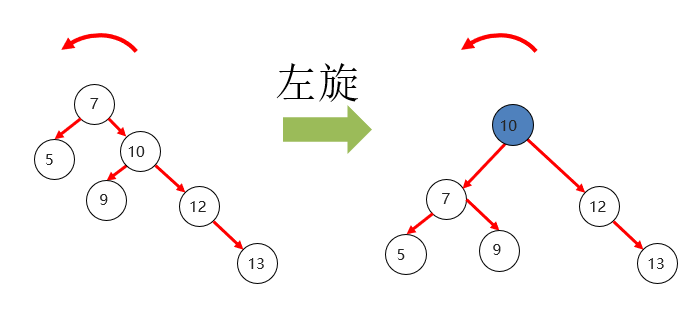
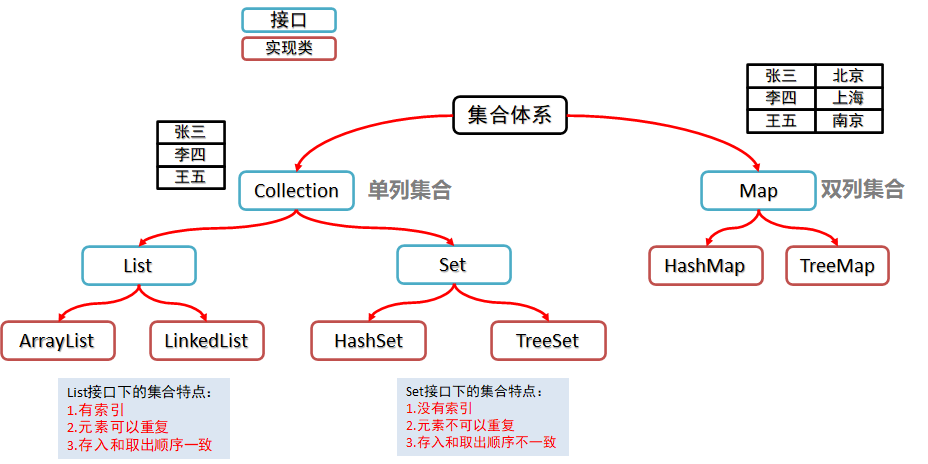

#### 数据结构

- 常见数据结构：栈、队列、数组、链表和红黑树

- 栈：先进后出

- 队列：先进先出

- 数组：查询快，增删慢
  
  - 组成：索引+元素
  
- 链表：增删快，查询慢
  
  - 组成：当前节点的地址+当前节点数据+下一个节点的地址（指向空地址表示结束）
  
- 二叉树：二叉树是指每个节点的子节点数量不超过2

- 二叉查找树：

  - 在二叉树的基础上，元素排列有顺序，**左子树元素小，右子树元素大**
  - 相比普通二叉树的查找速度快
  - 某些特殊情况下，二叉查找树会退化成链表

- 平衡二叉树（AVL树）

  - 在二叉查找树的基础上，规定**左右两个子树的高度差不超过1**
  - **旋转**：当执行插入或者删除操作时，只要左右子树高度差超过1时，就要通过旋转来保持平衡
  - 平衡二叉树适用于元素增删较少，而查找较多的场景

  

- 红黑树

  - 红黑树是一种弱平衡二叉树
  - 规则如下：
    - 每个节点只能是红色或黑色
    - 根节点必须是黑色
    - 如果一个节点没有子节点或父节点，则该节点对应的指针属性值为Nil（叶节点），且为黑色
    - 不能出现两个红色节点相连的情况
    - 对于每一个节点，从该节点到其所有后代叶节点的简单路径上，均包含相同数量的黑色节点
    - 新加入的节点是红色的，如果加入后不满足红黑规则，则需要进行旋转或变色


#### List集合

- 集合与数组区别

  - 数组长度不可变，集合长度可变
  - 数组可以存储基本数据类型和引用数据类型；集合只能存储引用数据类型

  

- List接口常用方法（ArrayList&LinkedList）

| 方法名                             | 说明                                   |
| ---------------------------------- | -------------------------------------- |
| boolean **add**(E e)               | 添加元素                               |
| void **add**(int index,E  element) | 在此集合中的指定位置插入指定的元素     |
| E **remove**(int index)            | 删除指定索引处的元素，返回被删除的元素 |
| boolean **remove**(Object o)       | 从集合中移除指定的元素                 |
| E **set**(int index,E  element)    | 修改指定索引处的元素，返回被修改的元素 |
| E **get**(int  index)              | 返回指定索引处的元素                   |
| void **clear**( )                  | 清空集合                               |
| boolean **contains**(Object  o)    | 判断集合中是否存在指定的元素           |
| int **size**( )                    | 集合的长度，也就是集合中元素的个数     |

#### ArrayList集合

- 底层为数组，查询快，增删慢
- 底层源码分析
  - ArrayList底层是什么数据结构？
    - Object数组
  - 底层的数组的初始化长度是多少？
    - 使用<u>无参构造方法</u>创建时，数组初始长度为0
    - 使用<u>带参构造方法</u>创建时，数组长度由参数值指定
  - 首次调用add方法添加元素的时候，数组的长度变为多少？
    - 如果初始化长度为0，首次添加元素时，扩容为10
  - 如果添加的元素超过数组长度，怎么办？
    - 自动扩容，**长度在原来的基础上增加一半**（>> 1）


#### LinkedList集合

- LinkedList的底层是一个双向链表，增删快(首尾操作效率最高)，查询慢

- 特有方法：

| 方法名                        | 说明                             |
| ----------------------------- | -------------------------------- |
| public void **addFirst**(E e) | 在该列表开头插入指定的元素       |
| public void **addLast**(E e)  | 将指定的元素追加到此列表的末尾   |
| public E **getFirst**()       | 返回此列表中的第一个元素         |
| public  E **getLast**()       | 返回此列表中的最后一个元素       |
| public E **removeFirst**()    | 从此列表中删除并返回第一个元素   |
| public  E **removeLast**()    | 从此列表中删除并返回最后一个元素 |


#### 可变参数

- 可变参数本质是数组
- 一个方法只能有一个可变参数
- 如果方法中有多个参数，可变参数要放在最后

```java
public static void main(String[] args) {
    System.out.println(getSum());
    System.out.println(getSum(11));
    System.out.println(getSum(11,22,33));
}

public static int getSum(int... a){
    int sum = 0;
    for (int i = 0; i < a.length; i++) {
        sum += a[i];
    }
    return sum;
}
```


#### 泛型

- <>中可以随便写个任意标识，常见的如T、E、K、V等形式的代号常用于表示泛型
- 泛型类：
  - 定义格式：`修饰符 class 类名<泛型标记>{ }`
  - 在创建对象时确定泛型
- 泛型接口：
  - 定义格式：`修饰符 interface 接口名<泛型标记>{ }`
  - 实现类实现接口时确定泛型
- 泛型方法：
  - 定义格式：`修饰符 <泛型标记> 返回值类型 方法名（泛型 变量名）{ }`
  - 例如：`public <T> void show(T t){ }`
  - 调用方法、传参时确定泛型

- 类型通配符

  - 当使用泛型的时候，无法确定泛型的具体类型时，可以使用通配符 ? 来表示某一种类型
  - 注意：
    - 泛型通配符 <?> 是在**使用泛型的时候**，用来代表某种类型的符号
    - 前面出现的 <E> <T> 等，虽然也是代表某种类型，但是在**定义泛型的时候**使用的

  ```java
  public static void main(String[] args) {
      ArrayList<Jeep> jeeps = new ArrayList<>();
      ArrayList<Audi> suv = new ArrayList<>();
      ArrayList<Car> cars = new ArrayList<>();
      play(jeeps);
      play(audis);
      play(cars);
  }
  
  public static void play(ArrayList<? extends Car> list){ }
  ```

- 类型通配符的上下限
  - `<? super Car>`规定了下边界
  - `<? extends Car>`规定了上边界

