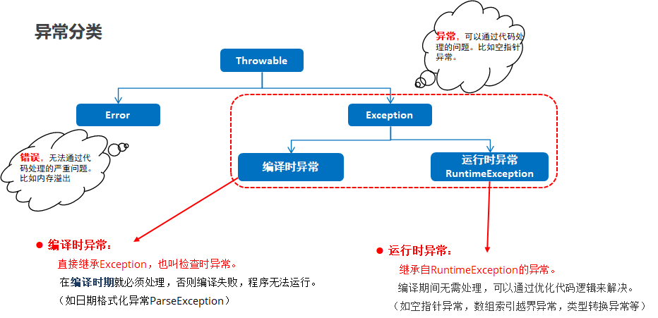

#### 异常




#### 异常处理

- 通常做法：方法抛出异常，main方法捕抓异常

- try - catch

  - 一旦出现异常，try{}里的代码将停止执行，跳转到对应的catch{}块里执行

  - catch{}执行结束后，会接着执行后续代码

  - 如果对应的问题没有被预设的异常类捕获，会直接抛给上层调用者，如果都没被处理，则传给虚拟机导致程序停止运行

  - 多个catch中的异常不能相同

  - 若catch中的多个异常之间有子父类的关系，那么子类异常要在父类前面

  - 异常处理只会匹配一个（从上往下匹配）

    ```java
    try {
        可能出现异常的代码；
    } catch （异常类名A 变量名）{
        异常的处理代码；
    } catch （异常类名B 变量名）{
        异常的处理代码；
    } finally {
        必须执行的代码；（数据库连接的关闭、IO流关闭、锁的释放）
    }
    ```

- 异常查看

  ```java
  try {
      int[] arr = {};
      System.out.print(arr[0]);
  } catch (Exception e) {
      //toString 显示异常的简单信息
      System.out.print(e.toString());
      //打印异常的堆栈信息
      e.printStackTrace();
  }
  ```

- throws

  - 当一个方法内部产生异常，而方法无法做出处理时，把异常交给调用者处理

  - 注意：

    - 当进行方法重写时，子类重写的方法throws的编译异常范围不能大于父类方法的编译异常范围

    ```java
    修饰符 返回值类型 方法名(参数列表) throws 异常类名1，异常类名2{}
    ```

- throw制造异常

  - 格式：`throw new 异常类名();`

  - 注意：throw异常后，后续代码将停止执行

    ```java
    public static void setAge1(int age){
        if(age>=18){
            System.out.println("符合年龄，可以注册");
        }else {
            //产生运行时异常，告知调用者程序出错，运行了throw之后，方法会停止调用
            throw new RuntimeException("年龄非法异常");
        }
    }
    ```

- throws与throw的区别

  - throws
    - 异常处理的方式之一，在定义方法时进行声明
    - 告知调用者，该方法有可能会出现的异常
  - throw
    - 产生异常的关键字，在方法体内部使用
    - 创建并抛出一个异常对象，throw与return有一样的效果


#### 自定义异常

```java
//自定义的编译异常
public class Un18Exception extends Exception{
    public Un18Exception() {
    }

    //message是异常的描述
    public Un18Exception(String message) {
        super(message);
    }
}
```

```java
public static void main(String[] args) {
    try {
        setAge(18);
    } catch (Un18Exception e) {
        e.printStackTrace();
    }

//new的编译异常，需要在方法定义上使用throws进行处理
public static void setAge(int age) throws Un18Exception {
    if (age >= 18) {
        System.out.println("符合年龄，可以注册");
    } else {
        //产生的是自定义的编译异常
        throw new Un18Exception("年龄非法异常");
    }
}
```


#### 多线程

- 并行：同一时刻，多个指令在多个CPU同时执行
- 并发：同一时刻，多个指令在单个CPU交替执行


- 实现多线程 - 继承Thread类

  ```java
  //1.自定义类继承Thread，重写run方法（线程要执行的代码）
  public class MyTread extends Thread {
  
      @Override
      public void run() {
          //获取线程名称
          String name = getName();
          for (int i = 1; i <= 10; i++) {
              System.out.println(name + ":"+ i);
          }
      }
  }
  ```

  ```java
  public static void main(String[] args) {
      
      //2.创建线程对象
      //创建线程时，线程默认的名字Thread-0
      MyThread mt = new MyThread();
      //线程创建之后，可以设置线程名称
      mt.setName("线程1");
      
      //3.启动线程,JVM会自动执行run方法
      mt.start();
      
      MyThread mt2 = new MyThread();
      mt2.setName("线程2");
      mt2.start();
  
  }
  ```


- 实现多线程 - 实现Runnable接口

  ```java
  //1.自定义类实现Runnable接口，重写run方法
  public class MyRun implements Runnable{
      //线程要执行的功能
      @Override
      public void run() {
          for (int i = 1; i <= 10; i++) {
              System.out.println("MyRun:" + i);
          }
  
      }
  }
  ```

  ```java
  public static void main(String[] args) {
      
      //2.创建任务类对象
      MyRun mr = new MyRun();
      
      //3.创建Thread类对象，并将任务对象作为构造方法的参数
      Thread t = new Thread(mr);
      
      //4.调用start方法，启动线程，(自动执行run方法的代码)
      t.start();
      
      for (int i = 1; i <= 10; i++) {
          System.out.println("main:" + i);
      }
  }
  ```


- 两种方式对比

  | 方式             | 优点                                         | 缺点                                         |
  | ---------------- | -------------------------------------------- | -------------------------------------------- |
  | 继承Thread类     | 编程较简单，子类可以直接使用Thread类的方法   | 扩展性差，子类不能再继承其他类               |
  | 实现Runnable接口 | 扩展性强，任务类实现接口后还可以继承其他的类 | 编程较复杂，任务类不能直接使用Thread类的方法 |


- 线程常用方法

  | 方法                                    | 方法说明                                                    |
  | --------------------------------------- | ----------------------------------------------------------- |
  | String **getName**(  )                  | 获取当前线程名称                                            |
  | void **setName**(String  name)          | 设置线程名称                                                |
  | static  Thread **currentThread**(  )    | 获取当前正在执行的线程对象                                  |
  | static  void **sleep**(long time)       | 让线程休眠指定的时间，单位为毫秒。（休眠时让出CPU执行权）   |
  | void  **setPriority**(int  newPriority) | 设置线程优先级（1~10个等级，10为最高优先级，5为默认优先级） |
  | int **getPriority**(  )                 | 获取线程优先级                                              |
  - 线程优先级从低到高分别有1~10级，通常CPU会优先执行优先级较高的线程任务。但这也不是绝对的，因为线程执行还是有随机性，只是概率上来说优先级越高的线程越有机会先执行


#### 线程安全

当多个线程访问共享数据，且多个线程对共享数据有更新操作时，就容易出现线程安全问题。Java中提供了同步机制来解决线程安全问题。实现方式有三种

- 同步代码块

  ```java
  //同步代码块
  synchronized(同步锁){
      有线程安全问题的代码
  }
  ```

  ```java
  //卖票任务
  public static void main(String[] args) {
      
      //创建任务
      Ticket ticket = new Ticket();
      
      //创建三个线程，模拟3个窗口卖票
      Thread t1 = new Thread(ticket,"窗口1");
      Thread t2 = new Thread(ticket,"窗口2");
      Thread t3 = new Thread(ticket,"窗口3");
      
      //启动线程，进行售票
      t1.start();
      t2.start();
      t3.start();
  }
  ```

  ```java
  //同步代码块实现
  public class Ticket implements Runnable{
  
      private static int total = 100; //总票数
      private static Object obj = new Object();
  
      //模拟窗口卖票
      @Override
      public void run() {
          String name = Thread.currentThread().getName(); //获取线程名称
          //一直在卖票
          while (true){
              //同步代码块，线程要先获取锁对象，才能进入代码块，代码块执行结束就释放锁
              //锁要保证所有线程共用一个（唯一）
              //synchronized (obj) {
              //synchronized (this){ //代表当前类的对象，保证Ticket对象只被创建一次就可以
              synchronized (Ticket.class) { //获取类的字节码，字节码在内存中是唯一的
                  if (total > 0) {
                      total--;
                      System.out.println(name + "卖票成功，剩余票数：" + total);
                  } else {
                      break;
                  }
              }
  
              //休眠不是必须的代码，只是为了更好出现并发效果
              //其他没有抢到锁的线程会进入休眠，若执行线程的时间太短，则再次抢锁时，会比其他休眠的线程具有优势
              try {
                  Thread.sleep(10);
              } catch (InterruptedException e) {
                  e.printStackTrace();
              }
          }
      }
  }
  ```

  

- 同步方法

  - 锁的特点
  - 实例方法：同步锁对象就是this，即方法的调用者
    - 静态方法：同步锁对象为当前类的class对象

  ```java
  //同步方法
  修饰符 synchronized 返回值类型 方法名（参数列表）{
      方法体；
  }
  ```

  ```java
  //同步方法实现
  public class Ticket implements Runnable {
  
      private static int total = 100; //总票数
  
      //模拟窗口卖票
      @Override
      public void run() {
          //一直在卖票
          while (true) {
              sale();
              if(total==0){
                  break;
              }
  
              try {
                  Thread.sleep(10);
              } catch (InterruptedException e) {
                  e.printStackTrace();
              }
          }
      }
  
      //定义同步方法，把有安全问题的代码写在方法中
      public synchronized void sale(){
          String name = Thread.currentThread().getName(); //获取线程名称
          if (total > 0) {
              total--;
              System.out.println(name + "卖票成功，剩余票数：" + total);
          }
      }
  }
  ```

  

- 同步代码块和同步方法的区别

  - 同步方法是锁住方法中所有的代码（执行效率更慢）；同步代码块可以锁定指定代码，锁的控制粒度更细
  - 同步方法不能指定锁对象，同步代码块可以指定锁对象


- Lock锁机制

  ```java
  //Lock锁
  Lock lock = new ReentrantLock();//可重入锁
  try{
      lock.lock();//加锁
      需要同步处理的代码；
  } finally {
      lock.unlock();//在finally块中，保证锁一定会被释放
  }
  ```
  
  ```java
  //卖票任务
    public class Ticket implements Runnable {
        private static int total = 100; //总票数
        private static Lock lock = new ReentrantLock(); //可重入锁
        //模拟窗口卖票
        @Override
        public void run() {
            String name = Thread.currentThread().getName(); //获取线程名称
            //一直在卖票
            while (true) {
                try {
                    lock.lock();//加锁,线程要执行代码，必须先获取锁
                    if (total > 0) {
                        total--;
                        System.out.println(name + "卖票成功，剩余票数：" + total);
                    } else {
                        break;
                    }
                }finally {
                    lock.unlock();//解锁的代码一定要执行
                }
    
                try {
                    Thread.sleep(10);
                } catch (InterruptedException e) {
                    e.printStackTrace();
                }
            }
        }
    }
  ```


