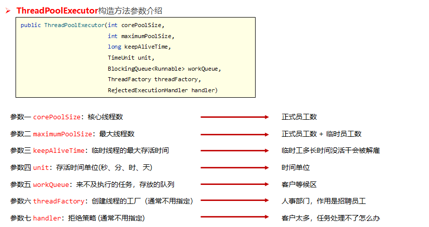
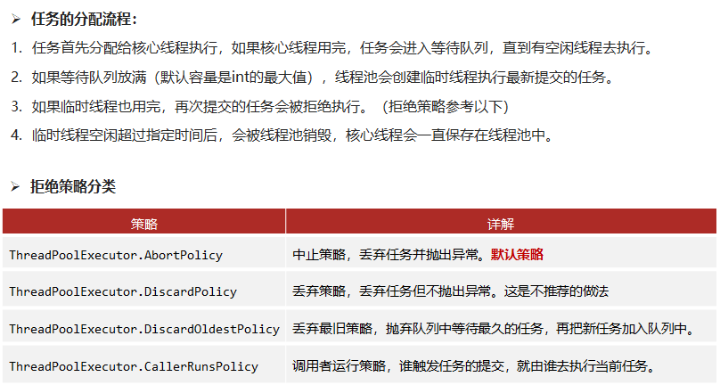

#### 线程死锁

- 容易产生死锁的条件
  - 有多把锁
  - 有多个线程
  - 有同步代码块嵌套


#### 线程等待和唤醒

- 以下的方法都来自Object类

- 方法都必须在同步代码块中使用锁对象进行调用

- notify() 和 notifyAll() 方法并不释放锁，只是告诉在等待锁的线程可以去参与获得锁的竞争了，但被唤醒的线程不是马上得到锁，因为锁还在别人手里没释放

  | 方法名           | 说明                                                         |
  | ---------------- | ------------------------------------------------------------ |
  | void wait()      | 让当前线程释放锁并进入等待，直到被唤醒                       |
  | void notify()    | 唤醒正在等待锁的单个线程，如果有多个线程同时在等待，notify() 方法只会随机唤醒某个线程 |
  | void notifyAll() | 唤醒正在等待锁的所有线程                                     |


#### 线程状态

- 在Thread.State枚举类中，定义了线程的六种状态

  - 新建状态NEW
  - 可运行状态RUNNABLE
  - 终止状态TERMINATED
  - 阻塞状态BLOCKED
  - 无限等待状态WAITING
  - 计时状态TIMED_WAITING

  


#### 面试题

- wait和sleep的区别
  - sleep不释放锁；wait会释放锁
  - sleep休眠时间到就会自动醒来；wait会无限等待，直到被唤醒，唤醒后还需重新竞争锁
  - sleep是Thraead类的静态方法；wait是Object类的方法，wait方法要在同步机制中使用锁调用


#### 线程池

- 优势

  - 提高响应速度，减少了创建新线程的时间
  - 降低资源消耗，重复利用线程池中线程，不需要每次都创建、销毁
  - 便于线程管理，线程池可以集中管理并发线程的数量

- 创建线程池

  - Executors类是线程池的工具类

    | 方法名                                                  | 说明                               |
    | ------------------------------------------------------- | ---------------------------------- |
    | static ExecutorService newFixedThreadPool(int nThreads) | 创建一个线程池，参数为池中的线程数 |

- 使用线程池

  - ExecutorService代表线程池

  - 创建任务

    - 实现Runnable接口，重写run方法
    - 实现Callable<返回值类型>接口，重写call方法

    | 方法名                   | 说明                   |
    | ------------------------ | ---------------------- |
    | submit(Runnable task)    | 提交Runnable类型的任务 |
    | submit(Callable<T> task) | 提交Callable类型的任务 |
    | void shutdown()          | 关闭线程池（谨慎使用） |

    

- 线程池callable实现

  ```java
  public static void main(String[] args) throws ExecutionException, InterruptedException {
      //创建线程池
      ExecutorService pool = Executors.newFixedThreadPool(2);
      MyCall mc = new MyCall();
      
      //提交Callable任务，返回值封装在Future对象中的，让Future对象等待返回结果，线程池可以执行任务
      //如果是用Integer去接收，那么就需要等待线程完全执行完后才能获取到对象，用Future则可以不用等待即可继续执行后面的代码
      Future<Integer> f = pool.submit(mc);
      
      //从Future对象获取返回值
      Integer a = f.get(); //如果线程没执行完,get方法会一直阻塞，直到线程返回结果
      System.out.println("a:"+a);
  }
  ```
  
  ```java
  /*
      Callable<V> ：泛型V就是线程执行完的返回值
   */
  public class MyCall implements Callable<Integer> {
  
      //和run方法一样，都是线程去执行的任务
      @Override
      public Integer call() throws Exception {
          String name = Thread.currentThread().getName();
          System.out.println(name+"线程执行了...");
          Thread.sleep(1000*60);
          return 666;
      }
  }
  ```
  
  


#### 线程池底层核心参数（面试）






#### Lambda

- Lambda表达式是JDK8开始的一种新语法形式

- 作用：简化函数式接口的匿名内部类的代码写法

- 使用前提：必须是接口，接口中有且仅有一个抽象方法

  - `@FunctionalInterface`注解：标记该接口必须是满足函数式接口

  ```java
  #简化格式：
  (匿名内部类被重写方法的形参列表) -> {
      被重写方法的方法体代码
  }
  ```

- 进一步省略写法：

  - 参数类型可以省略不写
  - 如果只有一个参数，()也可以省略
  - 如果方法体代码只有一行代码，可以省略大括号不写，同时要省略分号；如果这行代码是return语句，return也要省略不写

  ```java
  public class LambdaDemo3 {
      public static void main(String[] args) {
          
          Integer[] ages1 = {34, 12, 42, 23};
          
          /**Comparator比较器排序
           参数一：被排序的数组 必须是引用类型的元素
           参数二：匿名内部类对象，代表了一个比较器对象。
           */
          
          //原始写法
          /*
          Arrays.sort(ages1, new Comparator<Integer>() {
              @Override
              public int compare(Integer o1, Integer o2) {
                  return o2 - o1; //  降序
              }
          });
          */
  
          /*
          Arrays.sort(ages1, (Integer o1, Integer o2) -> {
                  return o2 - o1; //  降序
          });
          */
  
          /*
          Arrays.sort(ages1, ( o1,  o2) -> {
              return o2 - o1; //  降序
          });
          */
  
          //最终写法
          Arrays.sort(ages1, ( o1,  o2 ) ->  o2 - o1 );
  
          System.out.println(Arrays.toString(ages1));
      }
  }
  ```


#### 方法引用

- 方法引用是java8的新特性之一， 可以直接引用已有Java类或对象的方法或构造器。方法引用与Lambda表达式结合使用，可以进一步简化代码

- 引用格式

  ```
  对象名::成员方法
  类名::静态方法
  类名::new
  ```

- 使用前提

  - Lambda表达式中仅仅调用了一个方法
  - 调用的方法与要实现的抽象方法的参数和返回值一致

- 演示

  ```java
  public class test {
      public static void main(String[] args) {
          ArrayList<Integer> list = new ArrayList<>();
  
          //遍历集合
          list.forEach(new Consumer<Integer>() {
              @Override
              public void accept(Integer num) {
                  System.out.println(num);
              }
          });
  
          //Lambda简化
          list.forEach((Integer num) -> {
              System.out.println(num);
          });
  
          list.forEach(num -> System.out.println(num));
  
          //使用方法引用简化
          list.forEach(System.out::println);
      }
  }
  ```


#### Stream流

