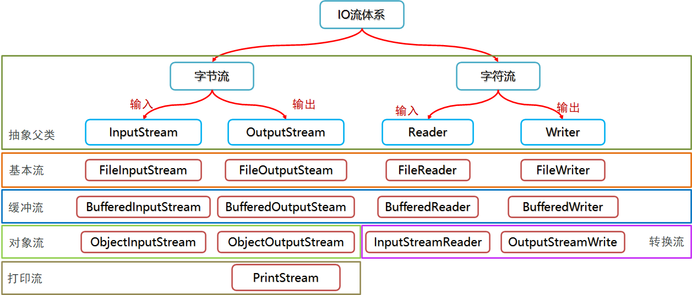

#### File

- File类构造器：通过路径名字符串来创建File对象
  - 在windows中路径支持：\和/ 默认是\
  - Linux/MacOS: 路径只支持 /
  - 字符串中的\要写两个：`\\`

```java
// 1.File(String pathname) 通过字符串路径创建File对象(重要) 定位到一个文件或文件
File file = new File("D:\\MyFileTest\\aaa");

// 2.File(String parent, String child) 通过父路径和子路径创建File对象
File file1 = new File("D:\\MyFileTest", "aaa");

// 3.File(File parent, String child) 通过父路径File对象和子路径创建File对象
File fileParent = new File("D:\\MyFileTest");
File file2 = new File(fileParent, "aaa");
```


- 绝对路径：从盘符开始
- 相对路径：默认从当前项目下开始


- File类功能

  | 方法名                              | 说明                   |
  | ----------------------------------- | ---------------------- |
  | public boolean **creatNewFile**()   | 创建一个新的文件       |
  | public boolean **mkdir**()          | 创建一个单级文件夹     |
  | public boolean **mkdirs**()         | 创建一个多级文件夹     |
  | public boolean **delete**()         | 删除文件或文件夹       |
  | public boolean **isDirectory**()    | 判断是否是文件夹       |
  | public boolean **isFile**()         | 判断是否是文件         |
  | public boolean **exists**()         | 判断是否存在           |
  | public String **getAbsolutePath**() | 返回File对象的绝对路径 |
  | public String **getName**()         | 获取名字               |
  | public String **getParent**()       | 获取父路径             |
  | public long **length**()            | 获取文件大小           |

  - 删除目录注意事项
    - delete方法直接删除不走回收站
    - 如果是一个文件，直接删除；如果是文件夹，只能是空文件夹才能删除


- File类遍历

  ```java
  public static void main (String[]args){
      // 创建File对象
      File file = new File("D:\\MyFileTest");
      //listFiles只能使用文件夹来调用，使用文件调用会返回空指针
      // public File[] listFiles() 显示文件夹中的所有内容,返回File数组
      File[] files = file.listFiles();
      for (File file1 : files) {
          System.out.println(file1);
      }
  }
  ```

  

- 递归：方法自己调用自己
  
- 递归要有结束条件，递归次数不能太多，否则会溢出
  
- 文件搜索

  ```java
  public static void main (String[]args){
      // 1.创建一个File对象定位aaa文件夹
      File file = new File("D:\\MyFileTest\\aaa");
      // 2.定义一个方法listJava(File dir), 列出某个文件夹中的所有java文件
      listJava(file);
  }
  
  public static void listJava (File file){
      // 2.1.调用listFiles()显示文件夹中的所有内容
      File[] files = file.listFiles();
      // 2.2.遍历获取每个内容
      for (File f : files) {
          // 2.3.判断如果是文件,并且是.java文件,打印这个文件
          if (f.isFile()) {
              if (f.getName().endsWith(".java")) {
                  System.out.println(f);
              }
          } else {
              // 2.4.如果是文件夹,再次调用listJava
              listJava(f);
          }
      }
  }
  ```

  

#### IO流

- 注意：输入和输出都是从程序的角度来说的




- IO流操作步骤
  - 创建流对象
  - 相关操作
  - **关闭流（关闭流后再操作会报错）**


- String和byte的转换

  | 方法名                                       | 说明                         |
  | -------------------------------------------- | ---------------------------- |
  | byte[] getBytes()                            | 将String的内容转成byte[]     |
  | String(byte bytes[])                         | 将byte[]的内容转成String     |
  | String(byte[] bytes, int offset, int length) | 将byte[]的部分内容转成String |
  
  ```java
  // String转byte[]
  String str = "你好";
  byte[] bytes = str.getBytes();
  System.out.println(Arrays.toString(bytes));
  
  byte[] buf = {65, 66, 67, 68, 69};
  // byte[]转String
  System.out.println(new String(buf));
  
  // 转数组的一部分
  System.out.println(new String(buf, 0, 3));
  ```
  
  

- 字节流复制文件

- 【注意】输入流未关闭的情况下，输出流**操作同一路径文件**，会造成冲突；输入流尚未关闭仍然占用着原文件，此时获取输出流，输出流会认为该文件不存在并重新创建同名文件覆盖原文件，而后输入流实际读取的是一个空文件，那么输出流写入的内容也为空，最后造成文件内容置空的现象

  ```java
  public static void main(String[] args) throws IOException {
      // 1.创建文件字节输入流
      FileInputStream fis = new FileInputStream("study_day10\\abc\\xyz.png");
      
      // 2.创建文件字节输出流
      FileOutputStream fos = new FileOutputStream("study_day10\\abc\\xiena.png");
      
      //3.循环读写，一次读多个字节，new byte[1024*8] 最好是1024的整数倍
      byte[] buf = new byte[1024 * 8]; //存放读取的数据
      int len; //读到的数量
      while((len = fis.read(buf))!=-1){
          //读到多少，写多少
          fos.write(buf,0,len);
      }
      
      // 4.关闭资源 从下往上看，先开的后关
      fos.close();
      fis.close();
  }
  ```
  

  
- 字符流复制文件

  ```java
  // 1.创建文件字符输入流
  FileReader fir = new FileReader("study_day10\\abc\\3.txt");
  
  // 2.创建文件字符输出流
  FileWriter fiw = new FileWriter("study_day10\\abc\\2.txt");
  
  // 3.循环读写
  int len;
  char[] chars = new char[3];
  while ((len = fir.read(chars)) != -1) {
      fiw.write(chars, 0, len);
      fiw.flush();
  }
  
  // 4.关闭流
  fiw.close();
  fir.close();
  ```

  

- 字符流追加和换行

  ```java
  // 获取文件对象;
  FileWriter fiw = new FileWriter("study_day10\\abc\\3.txt",true);
  
  // 换行
  fiw.write("\r\n");
  
  // 追加续写
  fiw.write("努力学习\r\n赢取白富美");
  
  //关闭
  fiw.close();
  ```

  


