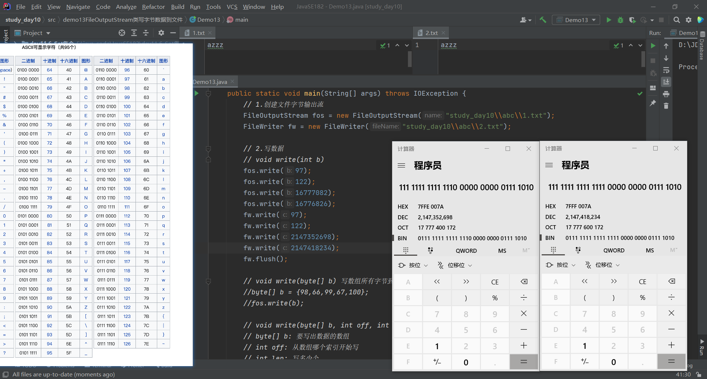
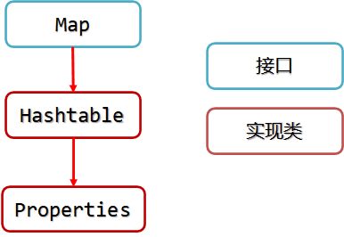

### IO流

- 字节流
  - FileInputStream
    - int read()：读一个字节
    - int read(byte[] b)：读一个字节数组
  - FileOutputStream
    - write(int b)：写一个字节
    - write(byte[] b)：写一个字节数组
    - write(byte[] b, int off, int len)：写一个字节数组的一部分
- 字符流
  - FileReader
    - int read()：读一个字符
    - int read(char[] cbuf)：读一个字符数组
  - FileWriter
    - write(int c)：写一个字符（会将参数b的八个低位写入输出流，忽略b的 24 个高位）
    - write(char[] cbuf)：写一个字符数组
    - write(char[] cbuf, int off, int len)：写一个字符数组的一部分
    - write(String ste)：写一个字符串
    - write(String, int off, int len)：写一个字符串的一部分


- 注意点：

  - 字节输出流FileOutputStream的write(int c)只能写入低位的8位数据
  - 字符输出流FileWriter的writer(int c)只能写入低位的16位数据

  


#### 异常处理

- JDK1.7前

  ```java
  try {
  可能有问题的代码；
  } catch （异常类名 变量名） {
  处理异常的代码；
  } finally {
  释放资源；
  }
  ```

  ```java
  // JDK1.7以前处理IO流异常
          FileReader fir = null;
          try {
              fir = new FileReader("study_day11\\abc\\666.txt");
  //出现异常
              int b = fir.read();
          } catch (FileNotFoundException e) {
              e.printStackTrace();
          } catch (IOException e) {
              e.printStackTrace();
          } finally {
              try {
  //fir可能获取失败，所以要先判断后再关闭
                  if (fir != null) {
                      fir.close();
                  }
              } catch (IOException e) {
                  e.printStackTrace();
              }
          }
  ```

  

- JDK1.7

  ```java
  try (创建流的代码) {
  其他代码；
  } catch （异常类名 变量名）{
  处理异常的代码；
  }
  ```

  ```java
  // JDK1.7处理IO流异常, 只有实现了AutoCloseable接口的类才能放入,会自动关闭流
          try (FileReader fir2 = new FileReader("study_day11\\abc\\666.txt");
               FileWriter fiw = new FileWriter("study_day11\\abc\\666.txt")
          ) {
              int b = fir2.read();
          } catch (FileNotFoundException e) {
              e.printStackTrace();
          } catch (IOException e) {
              e.printStackTrace();
          }
  ```


#### 缓冲流

- 缓冲流的基本原理，是在创建流对象时，会创建一个内置的默认大小的缓冲区数组8KB，通过缓冲区读写，减少系统IO次数，从而提高读写的效率
- 字节流复制文件效率对比：
  - 缓冲流读写一个字节比基本流读写一个字节快非常多
  - 缓冲流读写一个字节数组和基本流读写一个字节数组差不多
  - 【使用】如果使用读写一个字节时，建议使用缓冲流；如果使用读写一个字节数组，建议使用基本流
- 字符缓冲流新增功能：
  - `readLine（）`读取一行数据返回，无数据返回null
  - `newLine()`换行

```java
BufferedOutputStream bos = new BufferedOutputStream(new FileOutputStream("study_day11\\abc\\1.txt"));
//3.写数据
bos.write(97); //真正写数据的还是fos,只不过通过一个8192的数组，减少IO次数
//4.关闭流
bos.close();
//fos.close();  在缓冲流里面会帮助关闭
```


#### 字符集

- ASCII使用一个字节存储一个字符，一个字节是8位
- GBK中一个中文以两个字节存储，英文仍是一个字节（兼容ASCII）
- Unicode（兼容ASCII）
  - UTF-8：一个中文以三个字节存储


#### 转换流

- 编码：将字符转成二进制
- 解码：将二进制解析成文字

```java
// 1.使用GBK编码读取文件内容
InputStreamReader isr = new InputStreamReader(new FileInputStream("study_day11\\abc\\china_gbk.txt"),"GBK");
// 2.使用UTF-8编码写字符数据到文件
OutputStreamWriter osw = new OutputStreamWriter(new FileOutputStream("study_day11\\abc\\china_utf22.txt"),"UTF-8");
// 3.循环读写
int len;
while ((len = isr.read())!=-1){
    osw.write(len);
}
// 4.关闭文件
osw.close();
isr.close();
```


#### 对象流

- ObjectOutputStream序列化：将对象的数据保存到文件
- ObjectInputStream反序列化：读取文件中的数据到程序中形成对象

```java
/*注意:
    1.对象要序列化到文件,这个类要实现Serializable接口
    Serializable标记接口. 主要给JVM虚拟机看的.看到Serializable接口会把对象转成字节数据.我们就可以通过流写到文件中

    2.被transient修饰的成员变量不会保存到文件

    3.InvalidClassException: 无效的类异常（版本号对不上）
    出现的步骤:
    	1.执行 writeObject 把对象保存到文件
    	2.修改 Person 类
    	3.执行 readObject 读取文件的对象
    解决方法：
    在String类找到版本号的编写方式，版本号本身可以随意修改*/

public static void main(String[] args) throws IOException {
    // ObjectOutputStream: 包装加强.把对象保存到文件
    //1.创建对象输出流，把基本输出流当做参数传递
    ObjectOutputStream oos = new ObjectOutputStream(new FileOutputStream("study_day11\\abc\\person.txt"));
    //2.创建对象
    Person person = new Person("刘亦菲", 18);
    //3.将对象写进文件里
    oos.writeObject(person);
    //4.关闭流
    oos.close();
    
    //1.创建对象输入流
    ObjectInputStream ois = new ObjectInputStream(new FileInputStream("study_day11\\abc\\person.txt"));
	//2.创建对象接收读取内容
    Object o = ois.readObject();
	//3.打印输出
    System.out.println(o);
}
```


#### 打印流

```java
//创建打印流
PrintStream ps = new PrintStream("study_day11\\abc\\1.txt");
//打印数据
ps.print(97);//原样输出,参数写什么就打印什么
ps.print(true);
ps.print("我是一个字符串");
//换行 下一句换行
ps.println("我是换行");
ps.print("我被换行了");
//System.out.println(); 常用的打印流
//ps.write(97);  不要使用写的方法，这个是普通的写
//关闭流
ps.close();
```


#### Properties

- Properties类表示属性集。保存的文件后缀是.properties结尾，里面的内容一行一个 key=value，常作为软件的配置文件



| 方法名                                            | 说明                                   |
| ------------------------------------------------- | -------------------------------------- |
| Object **setProperty**(String key, String value)  | 添加键和值，键和值都是String类型       |
| String **getProperty**(String key)                | 通过键获取值                           |
| Set<String> **stringPropertyNames**()             | 获取所有的键                           |
| void **load**(Reader reader)                      | 从输入字符流读取属性列表（键和值）     |
| void **load**(InputStream inStream)               | 从输入字节流读取属性列表（键和元素对） |
| void **store**(Writer writer, String comments)    | 将Properties中的键和值写入输出字符流中 |
| void **store**(OutputStream out, String comments) | 将Properties中的键和值写入输出字节流中 |

```java
//Properties作为Map集合的使用
Properties pp = new Properties();
//设置值
pp.setProperty("姓名", "刘亦菲");
pp.setProperty("年龄", "18");
//获取值
String name = pp.getProperty("姓名");
String age = pp.getProperty("年龄");
System.out.println(name + ":" + age);
//遍历
pp.forEach((k, v) -> System.out.println(k + ":" + v));
```

```java
// Properties属性集保存数据到文件
public static void test01() throws IOException {
    //1.创建properties对象
    Properties pp = new Properties();
    pp.setProperty("username","admin");
    pp.setProperty("password","123456");
    //创建字符输出流
    FileWriter fiw = new FileWriter("study_day11\\abc\\config.properties");
    //调用properties存储方法 第二个参数是个注释
    pp.store(fiw,"");
    //关闭流
    fiw.close();
}

// 加载文件中数据到Properties属性集中
public static void test02() throws IOException {
    //1.创建properties对象
    Properties pp = new Properties();
    System.out.println("pp = " + pp);
    //读取properties文件的数据
    FileReader fir = new FileReader("study_day11\\abc\\config.properties");
    //获取数据
    pp.load(fir);
    fir.close();
    System.out.println("pp = " + pp);
}
```


#### 装饰模式

- 作用：在不改变原类的基础上, 动态地增强或扩展一个类的功能
- 装饰设计模式的三个角色：原对象、装饰对象、共同的接口