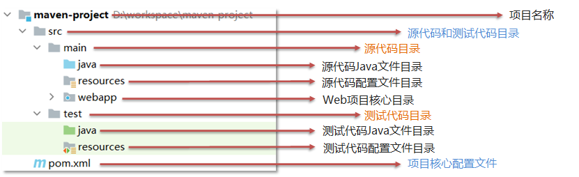
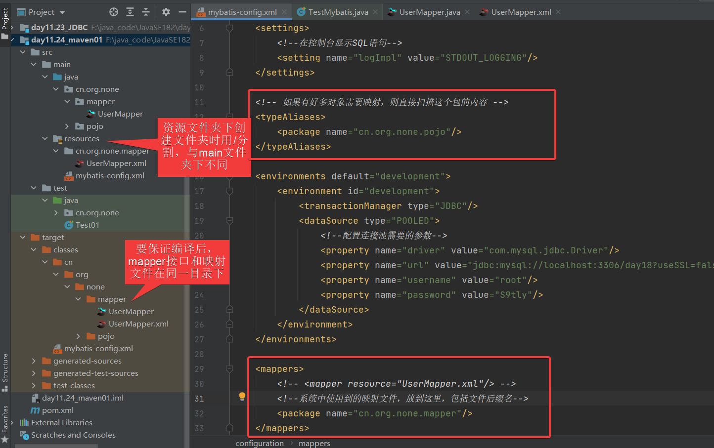

#### Maven

- 是专门用于管理和构建Java项目的工具
  - 提供了一套标准化的项目结构
  - 提供了一套依赖管理机制
  - 提供了一套项目构建的标准化流程（编译、测试、打包、发布）




- Maven坐标
  - groupID：当前Mavent项目隶属的组织名称
  - artifactld：当前Mavent项目名称
  - version：当前项目版本号


- IDEA常用Mavent命令
- Mavent对项目构建的生命周期划分为3套
  - clean：清理项目，就是删除项目下的target目录
  - default：核心工作，例如编译、测试、打包、安装等
    - 同一生命周期内，执行后面的命令时前面所有的命令会自动执行
    - compile：编译代码
    - test：执行测试代码
    - package：将项目打包
    - install：将项目打包并安装到本地仓库中
  - site：产生报告、发布站点等


- 可以通过设置坐标的依赖范围（`<scope></scope>`标签无内容，默认值compile），设置jar包的作用范围

  | **依赖范围** | **编译类路径** | **测试类路径** | **运行类路径** | **例子**          |
  | ------------ | -------------- | -------------- | -------------- | ----------------- |
  | **compile**  | Y              | Y              | Y              | logback           |
  | **test**     | -              | Y              | -              | Junit             |
  | **provided** | Y              | Y              | -              | servlet-api       |
  | **runtime**  | -              | Y              | Y              | jdbc驱动          |
  | **system**   | Y              | Y              | -              | 存储在本地的jar包 |


#### MyBatis

- MyBatis是一个优秀的持久层框架，用于简化JDBC开发


- 配置Mybatis框架

  1. 创建新模块（选用Mavent工具）

  2. 在pom.xml文件的`<dependencies>`标签内导入坐标，然后**刷新**

     ```xml
     <dependencies>
             <!--单元测试-->
             <dependency>
                 <groupId>junit</groupId>
                 <artifactId>junit</artifactId>
                 <version>4.12</version>
                 <scope>test</scope>
             </dependency>
     
             <!--MySQL驱动-->
             <dependency>
                 <groupId>mysql</groupId>
                 <artifactId>mysql-connector-java</artifactId>
                 <version>5.1.46</version>
             </dependency>
     
             <!--MyBatis核心包-->
             <dependency>
                 <groupId>org.mybatis</groupId>
                 <artifactId>mybatis</artifactId>
                 <version>3.5.5</version>
             </dependency>
         </dependencies>
     ```

  3. 在`main/java`下面创建`cn.org.none.pojo`包路径，然后**创建对象类**，并生成javabean

     ```java
     public class User {
         private int id;
         private String username;
         private Date birthday;
         private String sex;
         private String address;
     ```

  4. 在`main/java`下面创建`cn.org.none.mapper`包路径，然后**创建接口类**，并编写方法

     ```java
     public interface UserMapper {
         //查询所有的用户
         List<User> findAllUsers();
     }
     ```

  5. 在`resources`资源文件夹下创建`cn.org.none.mapper`文件夹，配置对应接口的映射文件

     ```xml
     <?xml version="1.0" encoding="UTF-8"?>
     <!DOCTYPE mapper  
       PUBLIC "-//mybatis.org//DTD Mapper 3.0//EN"  
       "http://mybatis.org/dtd/mybatis-3-mapper.dtd">
     
     <!--mapper namespace="包名.接口名"-->
     <mapper namespace="cn.org.none.mapper.UserMapper">
         <!--select id="方法名" resultType="方法返回值类型"-->
         <select id="findAllUsers" resultType="cn.org.none.pojo.User">
             <!-- SQL语句 -->
             select * from user;
         </select>
     </mapper>
     ```

  6. 复制`mybatis-config.xml`到`resources`资源文件夹下，并配置**对象类路径**、**数据库连接池配置**以及**接口类路径**

     ```xml
     <?xml version="1.0" encoding="UTF-8"?>
     <!DOCTYPE configuration  
       PUBLIC "-//mybatis.org//DTD Config 3.0//EN"  
       "http://mybatis.org/dtd/mybatis-3-config.dtd">
     <configuration>
     	<settings>
             <!--在控制台显示SQL语句-->
             <setting name="logImpl" value="STDOUT_LOGGING"/>
         </settings>
     
         <!-- 如果有好多对象需要映射，则直接扫描这个包的内容 -->
         <typeAliases>
             <package name="cn.org.none.pojo"/>
         </typeAliases>
     
         <environments default="development">
             <environment id="development">
                 <transactionManager type="JDBC"/>
                 <dataSource type="POOLED">
                     <!--配置连接池需要的参数-->
                     <property name="driver" value="com.mysql.jdbc.Driver"/>
                     <property name="url" value="jdbc:mysql://localhost:3306/day18?useSSL=false"/>
                     <property name="username" value="root"/>
                     <property name="password" value="S9tly"/>
                 </dataSource>
             </environment>
         </environments>
     
         <mappers>
             <!-- <mapper resource="UserMapper.xml"/> -->
             <!--系统中使用到的映射文件，放到这里，包括文件后缀名-->
             <package name="cn.org.none.mapper"/>
         </mappers>
         
     </configuration>
     ```

  7. 在`test.java.cn.org.none`路径下编写测试类

     ```java
     public class TestMybatis {
     
         @Test
         public void Test01() throws IOException {
             //1.在测试案例里面访问resoureces的资源，可以直接访问文件
             String resource = "mybatis-config.xml";
             //2.读取核心配置文件信息，生成一个输入流
             InputStream inputStream = Resources.getResourceAsStream(resource);
             //3.创建一个生成SqlSession的工厂类 类似于连接池
             SqlSessionFactory sqlSessionFactory = new SqlSessionFactoryBuilder().build(inputStream);
             //4.获取sqlsession 建立连接
             SqlSession sqlSession = sqlSessionFactory.openSession();
             //5.获取执行方法的对象 使用动态代理生成执行方法的对象
             UserMapper userMapper = sqlSession.getMapper(UserMapper.class);
             //6.调用方法
             List<User> allUsers = userMapper.findAllUsers();
             //7.关闭资源
             sqlSession.close();
         }
     ```

     

- 包扫描

  - 对于java和resources文件编译后都在classes类路径下，如果Mapper接口名称和SQL映射文件名称相同，并在同一目录下，则可以使用包扫描的方式简化SQL映射文件的加载

    