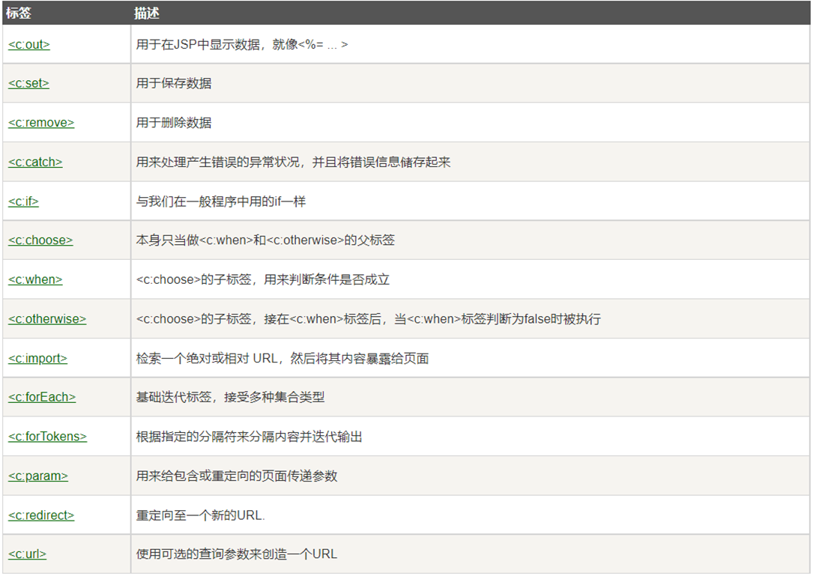
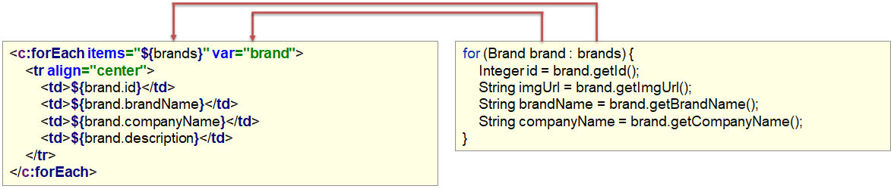
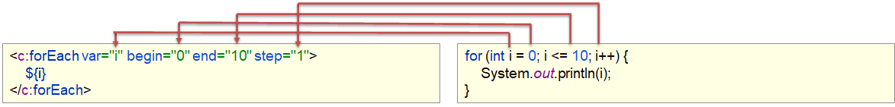
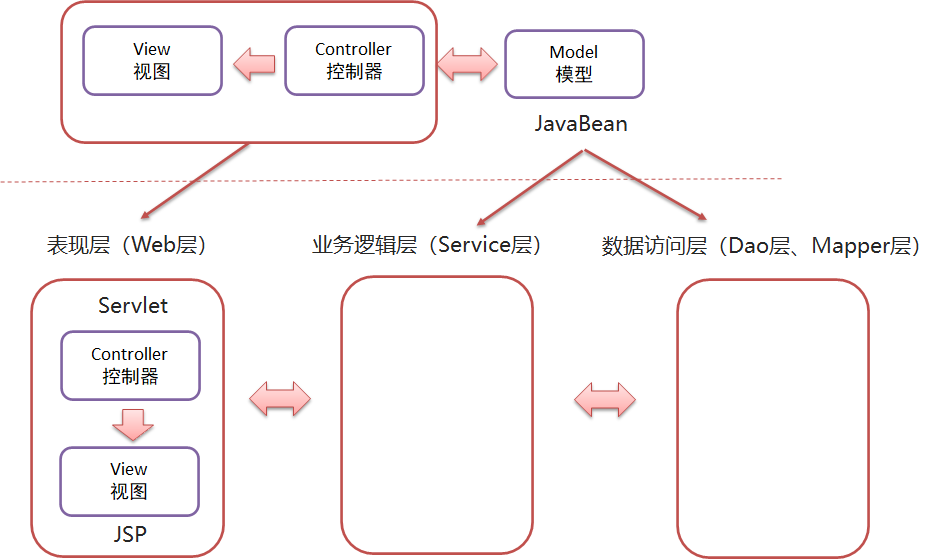
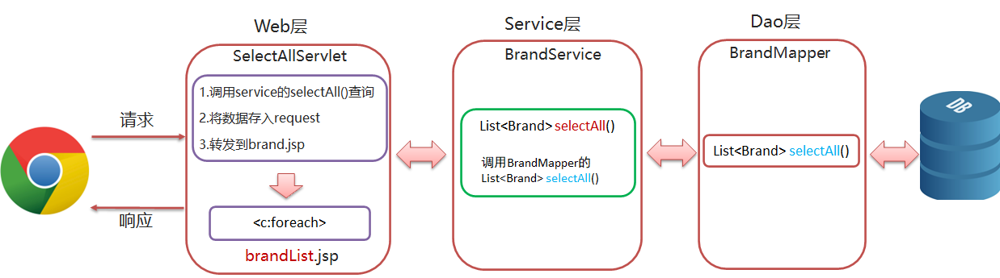
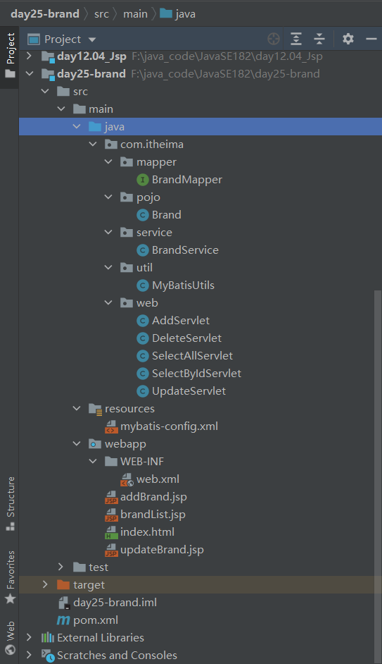

#### JSP概述

- JSP（全称：Java Server Pages）：Java 服务端页面。是一种==动态==的网页技术，其中既可以定义 HTML、JS、CSS等静态内容，还可以定义 Java代码的动态内容，也就是 `JSP = HTML + Java`

- JSP 作用：简化开发，避免了在Servlet中直接输出HTML标签

- 原理：JSP本质上就是一个Servlet，最终调用的就是==_jspService方法==。JSP在被访问时，由JSP容器（Tomcat）将其转换为Java文件（Serclet），再由JSP容器（Tomcat）将其编译，最终对外提供服务的其实就是这个字节码文件

  

- JSP缺点：

  - 书写麻烦：特别是复杂的页面
  - 阅读麻烦
  - 复杂度高：运行需要依赖于各种环境，JRE，JSP容器，JavaEE…
  - 占内存和磁盘：JSP会自动生成.java和.class文件占磁盘，运行的是.class文件占内存
  - 调试困难：出错后，需要找到自动生成的.java文件进行调试
  - 不利于团队协作：前端人员不会 Java，后端人员不精 HTML

- 由于上述的问题， JSP 已逐渐退出历史舞台，以后开发更多的是使用 HTML +  Ajax来替代

  - Serlet：逻辑处理，封装数据
  - JSP：获取数据，遍历展现数据

  


#### 相关依赖

```xml
<dependencies>
        <!--mysql-->
        <dependency>
            <groupId>mysql</groupId>
            <artifactId>mysql-connector-java</artifactId>
            <version>5.1.46</version>
        </dependency>

        <!-- mybatis -->
        <dependency>
            <groupId>org.mybatis</groupId>
            <artifactId>mybatis</artifactId>
            <version>3.5.5</version>
        </dependency>

        <!--servlet-->
        <dependency>
            <groupId>javax.servlet</groupId>
            <artifactId>javax.servlet-api</artifactId>
            <version>3.1.0</version>
            <scope>provided</scope>
        </dependency>

        <!--jsp-->
        <dependency>
            <groupId>javax.servlet.jsp</groupId>
            <artifactId>jsp-api</artifactId>
            <version>2.2</version>
            <scope>provided</scope>
        </dependency>

        <!--jstl-->
        <dependency>
            <groupId>jstl</groupId>
            <artifactId>jstl</artifactId>
            <version>1.2</version>
        </dependency>

        <dependency>
            <groupId>commons-beanutils</groupId>
            <artifactId>commons-beanutils</artifactId>
            <version>1.9.4</version>
        </dependency>
</dependencies>
```


#### JSP脚本

- 用于在 JSP页面内定义 Java代码
- 分类
  - `<%...%>`内容会直接放到_jspService()方法之中
  - `<%=...%>`内容会放到out.print()中，作为out.print()的参数，在页面输出
  - `<%!...%>`内容会放到_jspService()方法之外，被类直接包含


#### EL表达式

- 主要功能：获取数据
- 语法：`${example}`获取域中存储的key为example的数据
- JavaWeb的域对象（el表达式获取数据，会依次从这4个域中寻找，直到找到为止）
  - page：当前页面有效
  - request：当前请求有效
  - session：当前会话有效
  - application：当前应用有效


#### JSTL标签

- JSP标准标签库(Jsp Standarded Tag Library) ，使用标签取代JSP页面上的Java代码

  

- 相关依赖

  ```xml
  <!--jstl-->
  <dependency>
      <groupId>jstl</groupId>
      <artifactId>jstl</artifactId>
      <version>1.2</version>
  </dependency>
  ```

- `<c:if>`标签

  ```jsp
  <c:if test="${status ==1}">
      启用
  </c:if>
  ```

- `<c:forEach>`标签

  - items：被遍历的容器

  - var：遍历产生的临时变量

  - varStatus：遍历状态对象

    

  - begin：开始数

  - end：结束数

  - step：步长

    

  ```jsp
  <%-- varStatus: 遍历状态（排序）
          index:索引（从0开始）
          count:计数器（从1开始）
  --%>
      <c:forEach items="${brands}" var="brand" varStatus="sta">
          <tr align="center">
              <td>${sta.count}</td>
              <td>${brand.brandName}</td>
              <td>${brand.companyName}</td>
              <td>${brand.ordered}</td>
              <td>${brand.description}</td>
              <c:if test="${brand.status==1}">
                  <td>启用</td>
              </c:if>
              <c:if test="${brand.status==0}">
                  <td>禁用</td>
              </c:if>
              <td><a href="#">修改</a> <a href="#">删除</a></td>
          </tr>
      </c:forEach>
  ```


#### MVC模式和三层架构

- MVC是一种分层开发的模式
- 控制器（serlvlet）用来接收浏览器发送过来的请求，控制器调用模型（JavaBean）来获取数据，比如从数据库查询数据；控制器获取到数据后再交由视图（JSP）进行数据展示
  - M：Model，业务模型，处理业务
  - V：View，视图，界面展示
  - C：Controller，控制器，处理请求，调用模型和视图


- 三层架构
  - **表现层**：接收请求，封装数据，调用业务逻辑层，响应数据
  - **业务逻辑层**：对业务逻辑进行封装，组合数据访问层层中基本功能，形成复杂的业务逻辑功能。例如 `注册业务功能` ，我们会先调用 `数据访问层` 的 `selectByName()` 方法判断该用户名是否存在，如果不存在再调用 `数据访问层` 的 `insert()` 方法进行数据的添加操作
  - **数据访问层**：对数据库的CRUD基本操作


- 三层架构就是对MVC模式的实现
  - DAO：Date Acces Object




- 案例



- 目录结构

  