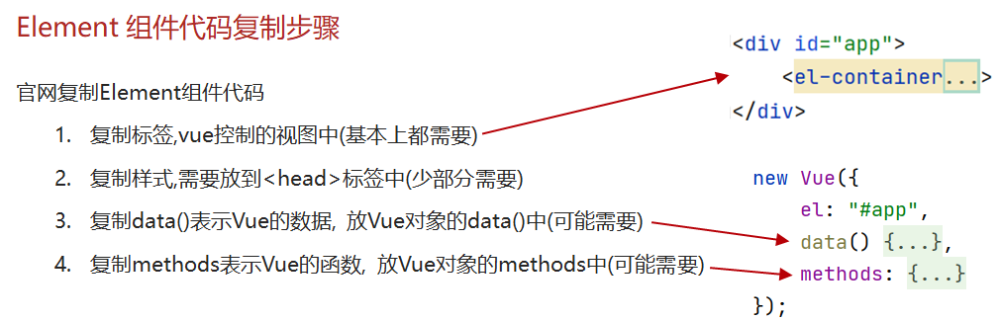
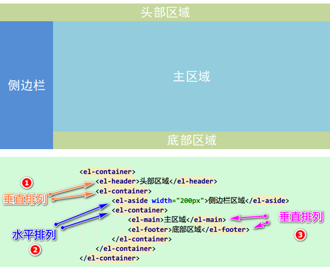

#### Element

- 是饿了么公司前端开发团队提供的，一套基于Vue的网站组件库，用于快速构建网页


#### 快速入门

- 将`element-ui`文件夹直接拷贝到项目的`webapp`下

- 创建HTML页面，并引入Vue.js和Element的css、js文件

  - 必须要先添加vue.js再添加其他的（Element基于vue）

  ```html
  <script src="../js/vue.js"></script>
  <script src="../element-ui/lib/index.js"></script>
  <link rel="stylesheet" href="../element-ui/lib/theme-chalk/index.css">
  ```

- 创建Vue核心对象

  ```html
  <script>
      new Vue({
          el:"#app",
          methods: { ... },
          data(){
              return{ ... }
          }
      });
  </script>
  ```

- 在官网`https://element.eleme.cn/#/zh-CN`复制所需的组件代码

  


#### Element布局

- Layout布局

  - 默认将一行分为 24 栏，根据页面要求给每一列设置所占的栏数
  - el-row：表示一行，类似于tr
  - el-col：表示一列
    - :span属性表示占几格

- Container布局容器

  - 容器布局：将页面分成头部区域、侧边栏区域、主区域、底部区域
  - `<el-container> `的子元素只能是后四者，后四者的父元素也只能是 `<el-container>`
  - `<el-container>`外层容器，当子元素中包含`<el-header>`或`<el-footer>`时，全部子元素会垂直上下排列，否则会水平左右排列
  - `<el-header>`顶栏容器
  - `<el-aside>`侧边栏容器
  - `<el-main>`主要区域容器
  - `<el-footer>`低栏容器

  

