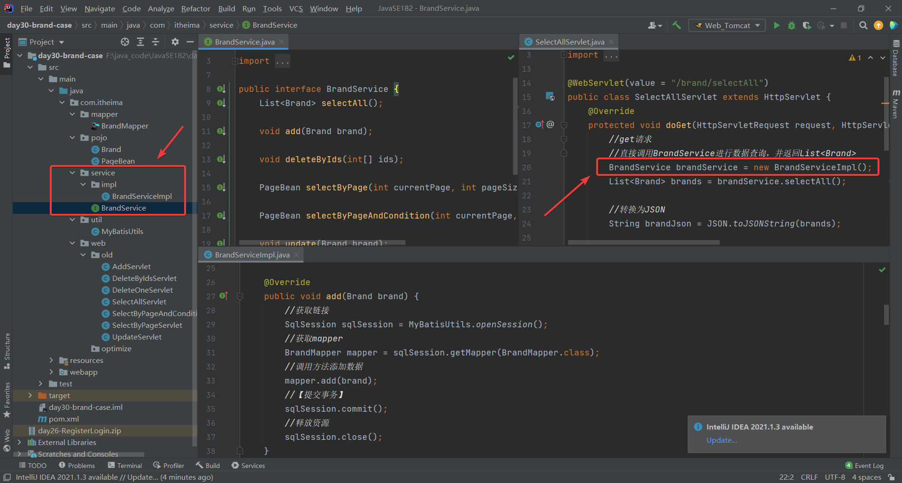

#### 使用接口实现业务层

- 便于系统扩展，实现解耦

  - 例如可以通过BrandService接口，实现不同的数据库（MySQL、oracle等）的实现类，后续只要修改调用的方法即可实现切换

  


#### Servlet优化

- 原有方式问题：需要开发很多Servlet类，造成创建过多浪费


- BaseServlet
  - this指子类servlet：BaseServlet没有被实例化，最终使用的是子类Servlet，调用Servlet的是子类
- 后续如果除了Brand还有其他页面如订单页面等，也可以直接继承BaseServlet
  
```java
public class BaseServlet extends HttpServlet {
    @Override
    protected void service(HttpServletRequest req, HttpServletResponse resp) throws ServletException, IOException {
        //1.获取请求路径  例如:路径 /brand/selectAll(最后一部分表示方法名)
        StringBuffer requestURL = req.getRequestURL();
        //2.根据路径获取到方法名
        int lastIndexOf = requestURL.lastIndexOf("/");
        String methodName = requestURL.substring(lastIndexOf + 1);
        System.out.println("methodName = " + methodName);
        //3.获取到方法
        // 返会获取的方法 字节码对象.getMethod("方法名",方法参数1的字节码对象，方法参数2的字节码对象,.....)
        //this表示子类Servlet
        try {
            Method method = this.getClass().getMethod(methodName, HttpServletRequest.class, HttpServletResponse.class);
            //4.执行方法
            // 方法对象.invoke("方法对象",参数1，参数2,....)
            method.invoke(this, req, resp);
        } catch (NoSuchMethodException e) {
            e.printStackTrace();
        } catch (InvocationTargetException e) {
            e.printStackTrace();
        } catch (IllegalAccessException e) {
            e.printStackTrace();
        }
    }
}
```

  

- BrandServlet

  - 创建BrandServlet继承BaseServlet，设置访问路径为`/brand/*`并将原来的Servlet全部复制到其中
  - 将方法的权限修饰符更改为public（否则需要暴力反射）
  - 将方法进行更改
  - 将原先的访问路径注释
  
  