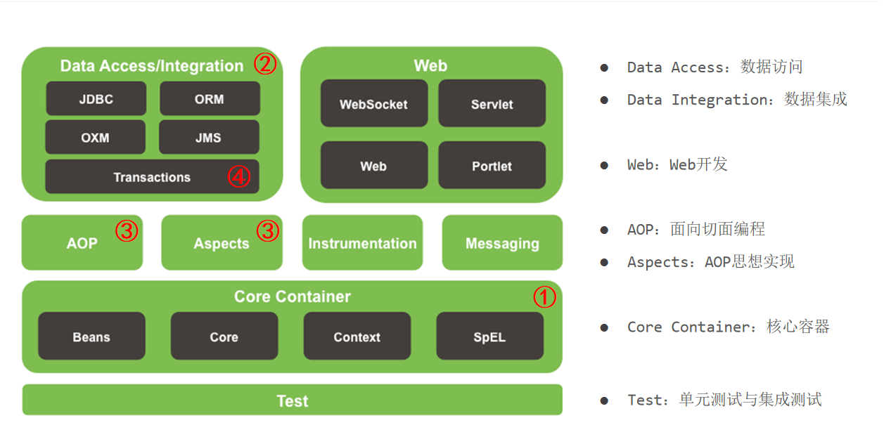

### 解耦

- 判断是否解开耦合：将两者任意一个内容清空，仍不影响
- 思路：自己new => 向工厂类提出需求，由工厂类负责提供（本质上切换了对象获取方式）


#### 工厂解耦

- `beans.properties`配置文件

```
brandService=com.itheima.service.impl.BrandServiceImpl
```

- 工厂类

```java
public class BeanFactory {
    //提前创建一个集合用于保存对象
    //list多用于存储；map多用于存取，故此处用map
    private static Map<String, Object> map = new HashMap<>();

    //提前创建好单例对象
    static {
        try {
            //1.读取配置文件
            //ResourceBundle.getBundle("配置文件名")专门读取properties配置文件
            ResourceBundle rb = ResourceBundle.getBundle("beans");
            //2.遍历配置文件
            Enumeration<String> keys = rb.getKeys();
            while (keys.hasMoreElements()) {
                //2.1获取其中每一个key
                String key = keys.nextElement();
                //2.2获取全类名
                String className = rb.getString(key);
                //3.根据全类名反射创建对象
                Class clazz = Class.forName(className);
                Object instance = clazz.newInstance();
                //4.将对象保存到集合中
                map.put(key, instance);
            }
        } catch (Exception e) {
            throw new RuntimeException(e);
        }
    }

    //对外提供方法用于获取对象
    public static Object getBean(String beanId) {
        return map.get(beanId);
    }
}
```


### 动态代理

- 目标对象的接口

  ```java
  public interface Performer {
      void sing();
  
      String dance();
  }
  ```

- 目标对象的类

  ```java
  public class BaoQiang implements Performer{
      @Override
      public void sing() {
          System.out.println("宝强唱歌");
      }
  
      @Override
      public String dance() {
          System.out.println("宝强跳舞");
          return "跳得不错";
      }
  }
  ```

- 实现动态代理

  ```java
  public class App {
      public static void main(String[] args) {
          //代理对象 = 目标对象 + 增强逻辑
  
          //1.创建目标对象
          Performer performer = new BaoQiang();
  
          //2.编写增强逻辑
          InvocationHandler invocationHandler = new InvocationHandler() {
              @Override
              public Object invoke(Object proxy, Method method, Object[] args) throws Throwable {
                  //增强功能
                  System.out.println("跟用户谈费用");
  
                  //调用目标对象的方法
                  //参数1：目标对象
                  //参数2：方法调用时使用的参数
                  //返回值：obj要看调用的目标对象的返回内容; 如果目标方法是void,此值为null; 如果不是void修饰, 此值就是目标方法的执行结果
                  Object obj = method.invoke(performer, args);
  
                  //增强功能
                  System.out.println("结算费用");
  
                  return obj;
  
              }
          };
  
          //3.动态创建代理对象
          Performer proxyInstance = (Performer) Proxy.newProxyInstance(
                  //类加载器，跟目标对象保持一致
                  performer.getClass().getClassLoader(),
                  //接口，跟目标对象保持一致
                  performer.getClass().getInterfaces(),
                  //代理逻辑
                  invocationHandler
          );
  
          //4.调用代理对象的方法
          proxyInstance.dance();
      }
  }
  ```

  

### Spring

- Spring是分层的java应用轻量级开源框架，核心是IOC和AOP

  - 分层：Spring在三层都有自己的解决方案
    - web层：Springmvc
    - service层：Spring
    - dao层：SpringJdbc
  - 轻量级：只启动Spring核心容器时,占用的内存少；使用简单
  - 核心：IOC（Inverse Of Control：反转控制）和AOP（Aspect Oriented Programming：面向切面编程）

- 体系架构图

  


#### IOC入门

- 对象的创建由原来使用new在类中主动创建变成了从工厂中获取，而对象昂的创建过程由工厂内部实现，而这个工厂就是Spring的IOC容器。即对象不再由我们自己创建，而是直接向Spring要，将对象的创建权交由Spring容器，即反转控制。

#### 实现步骤

- 添加依赖

  ```xml
  <!--spring核心依赖-->
  <dependency>
      <groupId>org.springframework</groupId>
      <artifactId>spring-context</artifactId>
      <version>5.1.6.RELEASE</version>
  </dependency>
  ```

- 创建接口和实现类

  

- 创建Spring配置文件`applicationContext.xml`，并配置bean

  ```xml
  <?xml version="1.0" encoding="UTF-8"?>
  <beans xmlns="http://www.springframework.org/schema/beans"
         xmlns:xsi="http://www.w3.org/2001/XMLSchema-instance"
         xmlns:p="http://www.springframework.org/schema/p"
         xsi:schemaLocation="http://www.springframework.org/schema/beans
          https://www.springframework.org/schema/beans/spring-beans.xsd">
  		
      	<!--
  			bean：让Spring创建一个对象,然后放入容器
  			id：当前对象在容器中的唯一标识（自定义）
  			class：创建对象的全类名
  		-->
  		<bean id="userDao" class="com.itheima.dao.impl.UserDaoImpl"></bean>
  		
  </beans>
  ```

- 创建Service实现类

  ```java
  public class UserServiceImpl {
      @Test
      public void testSave(){
          //1.读取配置文件，启动Spring容器
          ApplicationContext act
                  = new ClassPathXmlApplicationContext("applicationContext.xml");
          //2.从容器中获取dao对象，调用save()方法
          UserDao userDao = (UserDao) act.getBean("userDao");
          userDao.save();
      }
  }
  ```


### API


#### 两个接口

> ==面试题: BeanFactory  ApplicationContext 区别在哪?==

- BeanFactory
  - 这是SpringIOC容器的顶级接口，它定义了SpringIOC最基础的功能
  - BeanFactory在**第一次使用**到某个Bean时（调用getBean()），才对该Bean实例化
- ApplictionContext
  - 这是在BeanFactory基础上衍生出的接口，它扩展了BeanFactory的功能
  - ApplicationContext是在**容器启动时**，一次性创建并加载了所有Bean
- 注意：以上两种方式创建的对象**都是单例**，只是**创建对象的时机不同**


#### 三个实现类

- 这三个类的作用都是**读取配置文件**，初始化Spring的IOC容器，不一样的是加载配置文件的位置
  - `ClassPathXmlApplicationContext`读取类路径下（java和resources文件）的xml作为配置文件
  - `FileSystemXmlApplicationContext`读取本地绝对路径下的xml作为配置文件
  - `AnnotationConfigApplicationContext`读取一个注解配置作为配置文件


#### 一个方法

- `getBean()`用于从Spring容器中获取Bean对象，参数有三种情况
  - `getBean("id")`使用bean的id从容器中查找对象
  - `getBean(Bean.class)`使用bean的class类型从容器中查找对象
  - `getBean("id", Bean.class)`使用bean的id和class类型从容器中查找对象


#### 创建对象

- 创建对象的三种方式

  - 直接调用构造器创建
  - 使用静态工厂创建（直接调用工厂类的静态方法产生对象）
  - 使用实例工厂创建（先创建工厂的实例，然后再调用工厂实例的方法产生对象）

- 在Spring中配置三种创建对象的方式

  - 创建相关对象

  
  - 配置Spring文件

    ```xml
    <!--直接调用构造器创建-->
    <bean id="book" class="com.itheima.createBean.book"></bean>
    <!--使用静态工厂创建
        class：指定工厂类
        factory-method：指定工厂类中的静态方法
    -->
    <bean id="book1" class="com.itheima.createBean.bookFactory" factory-method="getBook1"></bean>
    <!--    使用实例化工厂创建
        factory-bean：指定调用哪个工厂对象
        factory-method：调用工厂对象的哪个方法
    -->
    <bean id="bookFactory" class="com.itheima.createBean.bookFactory"></bean>
    <bean id="book2" factory-bean="bookFactory" factory-method="getBook2"></bean>
    ```

    


