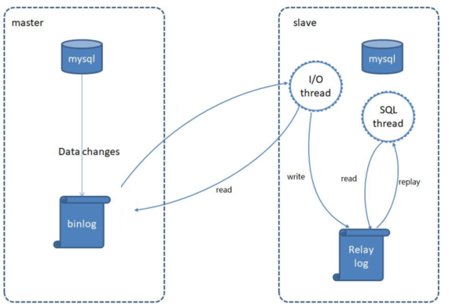
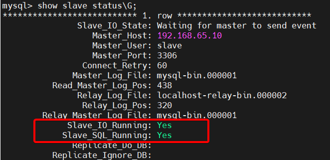
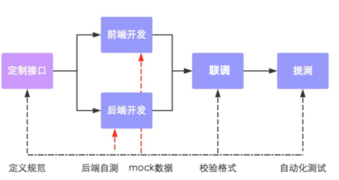

# 瑞吉点餐优化

## Redis缓存

> 通过Redis来做缓存，从而降低数据库的访问压力，提高系统的访问性能，从而提升用户体验。加入Redis做缓存之后，我们在进行数据查询时，就需要先查询缓存，如果缓存中有数据，直接返回，如果缓存中没有数据，则需要查询数据库，再将数据库查询的结果，缓存在redis中。


### 方式一：Spring date redis

#### 环境搭建

- 导入依赖

  ```xml
  <dependency>
      <groupId>org.springframework.boot</groupId>
      <artifactId>spring-boot-starter-data-redis</artifactId>
  </dependency>
  ```

- 添加Redis配置

  ```yaml
  spring:
    redis:
      host: 192.168.65.10
      port: 6379
      password: root #如果有
      database: 0 #redis有16个数据库，默认是0
      jedis:
        pool:
          max-active: 10 #最大链接数
          max-idle: 5 #最大空闲数
          min-idle: 2 #最小空闲数,触发时链接数没到最大值则增加
          max-wait: 5ms #连接池最大阻塞等待时间
  ```

- 添加自定义String类型的序列化器

  ```java
  package com.itheima.config;
  
  import org.springframework.context.annotation.Bean;
  import org.springframework.context.annotation.Configuration;
  import org.springframework.data.redis.connection.RedisConnectionFactory;
  import org.springframework.data.redis.core.RedisTemplate;
  import org.springframework.data.redis.serializer.GenericJackson2JsonRedisSerializer;
  import org.springframework.data.redis.serializer.StringRedisSerializer;
  
  @Configuration
  public class RedisConfig {
  
      @Bean
      public RedisTemplate<Object, Object> redisTemplate(RedisConnectionFactory redisConnectionFactory) {
          RedisTemplate<Object, Object> template = new RedisTemplate();
          template.setConnectionFactory(redisConnectionFactory);
          template.setKeySerializer(new StringRedisSerializer()); //设置key的序列化器
          template.setValueSerializer(new GenericJackson2JsonRedisSerializer());  //设置值序列化器
          return template;
      }
  }
  ```


#### 功能实现

##### Redis缓存设置验证码有效期（redisTemplate实现）

- 在UserController中注入RedisTemplate对象，用于操作Redis

  ```java
  @Autowired
  private RedisTemplate redisTemplate;
  ```

- 在UserController的sendMsg方法中，将生成的验证码保存到Redis

  ```java
  //session.setAttribute(phone,code);//原代码
  //手机号作为key，验证码作为值
  ValueOperations valueOperations = redisTemplate.opsForValue();
  //验证码存储在redis中，并且设置过期时间1分钟
  valueOperations.set(phone,code,1, TimeUnit.MINUTES);
  ```

- 登录成功后清除验证码

  ```java
  //session.removeAttribute(userPhone);//原代码
  redisTemplate.delete(userPhone);
  ```

  

##### Redis缓存菜品信息（redisTemplate实现）

- 在DishServiceImpl中注入RedisTemplate

  ```java
  @Autowired
  private RedisTemplate redisTemplate;
  ```

- 在list方法中,查询数据库之前,先查询缓存, 缓存中有数据, 直接返回

  ```java
  /**
   * 在添加dishDtiList时，采用字符串拼接的形式，创建了一个名称空间，方便管理
   */
  @Override
  public R list(Long categoryId, Integer status) {
      //向Redis查询是否存在该类菜品dishDtoList
      ValueOperations valueOperations = redisTemplate.opsForValue();
      List<DishDto> dishDtoList = (List<DishDto>) valueOperations.get("dish:" + categoryId + "_" + status);
      //如果redis没有这类菜品，则查询数据库得到
      if (dishDtoList == null) {
          List<Dish> dishList = dishDao.list(categoryId, status);
          //将Dish转换为DishDto
          dishDtoList = dishList.stream().map(dish -> {
              DishDto dishDto = new DishDto();
              BeanUtils.copyProperties(dish, dishDto);
              //查询口味信息并传入dishDto
              List<DishFlavor> flavorList = dishFlavorDao.findByDishId(dish.getId());
              dishDto.setFlavors(flavorList);
              return dishDto;
          }).collect(Collectors.toList());
          //数据库查询到的结果保存到Redis中
          valueOperations.set("dish:" + categoryId + "_" + status,dishDtoList);
      }
      return R.success(dishDtoList);
  }
  ```

- 当菜品信息出现修改时，需要清空缓存数据（如果只是清除单个菜品的缓存，那么如果用户修改了菜品的分类，那么原来分类下将少一个菜品，新的分类下将多一个菜品；因此更新完毕后，需要清除redis的所有菜品缓存）

  ```java
  //因此在save方法和update方法需要添加如下代码
  //更新完毕后，需要清除redis的所有菜品缓存
  Set keys = redisTemplate.keys("dish:*");
  redisTemplate.delete(keys);
  ```

  

### 方式二：Spring Cache

#### 介绍

- **Spring Cache**是一个框架，实现了==基于注解==的缓存功能。CacheManager是Spring提供的各种缓存技术抽象接口。

| **CacheManager**    | **描述**                                                     |
| ------------------- | ------------------------------------------------------------ |
| EhCacheCacheManager | 使用EhCache作为缓存技术                                      |
| GuavaCacheManager   | 使用Google的GuavaCache作为缓存技术                           |
| RedisCacheManager   | 使用Redis作为缓存技术                                        |
|                     | spring 自己也搞了一套缓存技术，默认的缓存。spring缓存是缓存在Map集合中 |


#### 注解说明

| 注解           | 说明                                                         |
| -------------- | ------------------------------------------------------------ |
| @EnableCaching | 启动类上使用，开启缓存注解功能                               |
| @Cacheable     | 在方法执行前spring会先查看缓存中是否有数据，<br>如果有数据，则直接返回缓存数据；如果没有数据，再调用方法并将==方法返回值==存入缓存中 |
| @CachePut      | 将方法的返回值放到缓存中                                     |
| @CacheEvict    | 将一条或多条数据从缓存中删除                                 |

- 通用注解属性：

  - value：缓存的名称，每个缓存名称下面可以有多个key

  - key：缓存的key（SPEL语法）

    ```
    写法一：使用形参数据#user.id
    	#user指的是方法形参的名称，id指的是user的id属性，也就是使用user的id属性作为key
    写法二：使用返回值数据#result.id
    	#result代表方法返回值，表示以返回对象的id属性作为key
    ```


##### @Cacheable注解

- 注意： 默认情况方法的返回值是一个null的时候也是会生成缓存的，这样子是没有意义的
- 解决方案：
  - condition属性：符合条件则生成缓存【注意：condition属性值不能访问result结果的】
  - unless属性：符合条件不生成缓存

```java
@GetMapping("/{id}")
@Cacheable(value = "user",key = "#id",unless = "#result==null")
public User getById(@PathVariable Long id){
    User user = userService.findById(id);
    return user;
}
```


##### @CacheEvict注解

- 注意：使用`allEntries = true`清除该名称空间下面的所有数据


#### 环境搭建

- 导入依赖

  ```xml
  <dependency>
      <groupId>org.springframework.boot</groupId>
      <artifactId>spring-boot-starter-cache</artifactId>
  </dependency>
  
  <dependency>
      <groupId>org.springframework.boot</groupId>
      <artifactId>spring-boot-starter-data-redis</artifactId>
  </dependency>
  ```

- 添加Redis配置

  ```yaml
  spring:
    redis:
      host: 192.168.65.10
      port: 6379
      password: root #如果有
      database: 0 #redis有16个数据库，默认是0
      jedis:
        pool:
          max-active: 10 #最大链接数
          max-idle: 5 #最大空闲数
          min-idle: 2 #最小空闲数,触发时链接数没到最大值则增加
          max-wait: 5ms #连接池最大阻塞等待时间
    cache:
      redis:
        time-to-live: 1800000 #设置存活时间，半小时
  ```

- 添加自定义String类型的序列化器

  （略）

- 在启动类上加入@EnableCaching注解，开启缓存注解功能

  ```java
  @Slf4j//通过slf4j记录日志
  @SpringBootApplication
  @MapperScan(basePackages = "com.itheima.reggie.dao")//指定要变成实现类的接口所在的包
  @ServletComponentScan(basePackages = "com.itheima.reggie.filter")
  @EnableCaching//开启Spring Cache注解方式（缓存功能）
  public class ReggieApplication {
      public static void main(String[] args) {
          SpringApplication.run(ReggieApplication.class,args);
          log.info("瑞吉项目启动成功~");
      }
  }
  ```
  
  


#### 功能实现

- 在SetmealServiceImpl的list方法上加入@Cacheable注解

  ```java
  @Override
  @Cacheable(value = "setmeal",
          key = "#categoryId+'_'+#status",
          unless = "#result==null")//注意： 如果是多个参数作为key，语法： #参数一+'_'+#参数2
  public R list(Long categoryId, Integer status) {
      //根据分类id查询套餐
      List<Setmeal> setmealList = setmealDao.list(categoryId,status);
      return R.success(setmealList);
  }
  ```

- 在save和delete方法上加注解@CacheEvict

  ```java
  @CacheEvict(value = "setmeal",allEntries = true)
  ```


### 两种方式的对比

#### Spring date redis

- 优点：
  - 可以**精准控制**每一个key的有效时间
  - 可以让一个方法的**任何数据**成为缓存
- 缺点：
  - 使用起来相对麻烦，需要编码

#### SpringCache

- 优点：
  - 使用方便，不需要编码，通过注解即可实现缓存操作
- 缺点：
  - 只能对有效时间进行**全局**配置，不能把控每一个key的有效时间
  - 只能将方法的**返回值**进行缓存


## 读写分离

> 只有一台MySQL服务器时，存在以下问题：
>
> 1.读和写所有压力都由一台数据库承担，压力大
>
> 2.数据库服务器磁盘损坏则数据丢失，单点故障
>
> 因此可以准备两台MySQL，一台主(Master)服务器，一台从(Slave)服务器，**主库的数据变更（写、更新、删除这些操作）**，需要同步到从库中(主从复制)。而用户在访问我们项目时，如果是写操作(insert、update、delete)，则直接操作主库；**如果是读(select)操作，则直接操作从库**(在这种读写分离的结构中，从库是可以有多个的)，这种结构我们称为**读写分离**


### MySQL主从复制

> MySQL主从复制是一个异步的复制过程，底层是基于Mysql数据库自带的 **二进制日志** 功能。就是一台或多台MySQL数据库（slave，即**从库**）从另一台MySQL数据库（master，即**主库**）进行日志的复制，然后再解析日志并应用到自身，最终实现 **从库** 的数据和 **主库** 的数据保持一致。
>
> **二进制日志：** 
>
> ​	二进制日志（BINLOG）记录了所有的 DDL（数据定义语言）语句和 DML（数据操纵语言）语句，但是不包括数据查询语句。此日志对于灾难时的数据恢复起着极其重要的作用，MySQL的主从复制， 就是通过该binlog实现的。默认MySQL是未开启该日志的。



- MySQL主从复制步骤：
  - MySQL主库master将数据变更记录写入二进制日志（binary log）
  - 从库slave将主库master的binary log复制到它的中继日志（relay log）
  - 从库slave重做中继日志中的事件，将数据变更反映到它自己的数据中


#### 环境搭建

- 准备两台关闭了防火墙并启动mysql的服务器

##### 主库配置

- 修改mysql配置文件`vim /etc/my.cnf`

  ```shell
  # 在[mysqld]下面增加以下配置
  log-bin=mysql-bin   #[必须]启用二进制日志
  server-id=10        #[必须]服务器唯一ID(唯一即可)
  ```

- 重启mysql服务`systemctl restart mysqld`

- 登录mysql，创建一个专门给从库用于同步数据的用户

  ```sql
  GRANT REPLICATION SLAVE ON *.* to '用户名'@'%' identified by '密码';
  /* mysql5.7默认密码校验策略等级为 MEDIUM , 该等级要求密码组成为: 数字、小写字母、大写字母 、特殊字符、长度至少8位 */
  ```

- 登录mysql，查看同步状态`show master status;`，记录**File**和**Position**的值

  ==注：上面SQL的作用是查看Master的状态，执行完此SQL后不要再执行任何操作==


##### 从库配置

- 修改mysql配置文件`vim /etc/my.cnf`

  ```shell
  # 在[mysqld]下面增加以下配置
  log-bin=mysql-bin   #[必须]启用二进制日志
  server-id=11        #[必须]服务器唯一ID(唯一即可)
  ```


-  `vim /var/lib/mysql/auto.cnf`：==注意： 由于linux 是克隆出来的，mysql中还有一个server_uuid是一样的，也需要修改==

- 重启mysql服务`systemctl restart mysqld`

- 登录mysql，设置主库地址和同步位置

  ```mysql
  stop slave;
  
  change master to master_host='主库的ip地址',master_user='主库创建的用户名',master_password='主库的密码',master_log_file='主库的日志文件',master_log_pos=主库的同步位置;
  
  start slave;
  ```

- 登录mysql，确认从库状态是否正常`show slave status\G;`，若失败则重复上一步

  


### ShardingJDBC

> 使用Sharding-JDBC可以轻松实现数据库读写分离

特点：

- 适用于任何基于JDBC和ORM框架，如：JPA、Hibernate、Mybatis、Spring JDBC Template或直接使用JDBC
- 支持任何第三方的数据库连接池，如：DBCP, C3P0, BoneCP, Druid, HikariCP等
- 支持任意实现JDBC规范的数据库，如：MySQL，Oracle，SQLServer，PostgreSQL以及任何遵循SQL92标准的数据库


#### 环境搭建

- 导入依赖

  ```xml
  <dependency>
      <groupId>org.apache.shardingsphere</groupId>
      <artifactId>sharding-jdbc-spring-boot-starter</artifactId>
      <version>4.0.0-RC1</version>
  </dependency>
  ```

- 配置shardingjdbc数据源

  ```yaml
  spring:
    shardingsphere:
      datasource:
        names: master,slave  # 这里数据源名字是可以随便修改，但是一定要与下面配置要对应
        # 主数据源
        master:
          type: com.alibaba.druid.pool.DruidDataSource
          driver-class-name: com.mysql.jdbc.Driver
          url: jdbc:mysql://192.168.65.10:3306/reggie?characterEncoding=utf-8&useSSL=false
          username: root
          password: root
        # 从数据源
        slave:
          type: com.alibaba.druid.pool.DruidDataSource
          driver-class-name: com.mysql.jdbc.Driver
          url: jdbc:mysql://192.168.65.11:3306/reggie?characterEncoding=utf-8&useSSL=false
          username: root
          password: root
      masterslave:
        # 读写分离配置
        load-balance-algorithm-type: round_robin  # 从库负载均衡策略使用轮询
        # 最终的数据源名称（存储在Spring容器中的名字）
        name: dataSource
        # 主库数据源名称
        master-data-source-name: master
        # 从库数据源名称列表（多个使用逗号分割）
        slave-data-source-names: slave
      props:
        sql:
          show: true #开启SQL显示，默认false
  
    main:
      # 允许sharedingjdbc数据源去覆盖druid数据源(后面创建数据源会覆盖前面创建的数据源)
      allow-bean-definition-overriding: true
  ```


## Nginx

> Nginx是一款轻量级的**Web服务器**/反向代理服务器及电子邮件（IMAP/POP3）代理服务器。其特点是占有内存少，并发能力强

### 介绍

#### 作用

- 发布静态资源
- 用做服务器反向代理，实现服务器集群负载均衡
- 做为邮件代理服务器


#### 安装

- 需要提前安装C语言的编译环境，及正则表达式库等第三方依赖库

  ```
  yum -y install gcc pcre-devel zlib-devel openssl openssl-devel
  ```

- 下载Nginx安装包

  ```
  yum install wget
  wget https://nginx.org/download/nginx-1.16.1.tar.gz
  ```

- 解压

  ```
  tar -xvf nginx-1.16.1.tar.gz
  ```

- 配置编译环境（--prefix 指定安装目录）

  ```
  cd nginx-1.16.1
  ./configure --prefix=/usr/local/nginx
  ```

- 编译&安装

  ```
  make & make install
  ```


#### 目录结构

| 目录/文件       | 说明                                |
| --------------- | ----------------------------------- |
| conf            | 配置文件的存放目录                  |
| conf/nginx.conf | Nginx的核心配置文件                 |
| html            | 存放静态资源(html, css, )           |
| logs            | 存放nginx日志(访问日志、错误日志等) |
| sbin/nginx      | 二进制文件，用于启动、停止Nginx服务 |


#### 常用命令

- 首先`vim /etc/profile`，添加nginx全局环境变量，然后重新加载`source /etc/profile`

  

- 常用命令

  | 命令            | 说明                   |
  | --------------- | ---------------------- |
  | nginx -v        | 查看版本               |
  | nginx -t        | 检查配置文件是否有错误 |
  | nginx           | 启动nginx              |
  | nginx -s stop   | 关闭nginx              |
  | nginx -s reload | 重新加载               |


#### Nginx配置文件

- nginx的配置文件（conf/niginx.conf）整体上分为三部分：全局块，events块、http块。

  | 区域     | 职责                                     |
  | -------- | ---------------------------------------- |
  | 全局块   | 配置和nginx运行相关的全局配置            |
  | events块 | 配置和网络连接相关的配置                 |
  | http块   | 配置代理、缓存、日志记录、虚拟主机等配置 |

  

- server块

  ```properties
  server {
      listen 80;				#监听端口	
      server_name localhost;	#服务器名称
      location / {			#匹配客户端请求url
          root html;			#指定静态资源根目录
          index index.html;	#指定默认首页
      }
  }
  ```


### 反向代理

> 正向代理：客户端向代理服务器发送一个请求，并且指定目标服务器，之后代理服务器向目标服务器转发请求，并将获得的内容返回给客户端
>
> 反向代理：代理服务器接收客户端的请求，然后将请求转发给内部网络上的服务器，将从服务器上得到的结果返回给客户端
>
> 不同点：
>
> - 正向代理是客户端的代理，服务器不知道真正的客户端是谁；反向代理是服务器的代理，客户端不知道真正的服务器是谁
> - 正向代理一般是客户端架设的；反向代理一般是服务器架设的
> - 正向代理主要是用来解决访问限制问题；反向代理则是提供负载均衡、安全防护等作用。二者都能提高访问速度


#### 环境搭建

- 修改Nginx配置文件

  ```properties
  #当访问nginx的80端口时，根据反向代理配置，会将请求转发到 http://192.168.65.11:8080 对应的服务上
  server {
      listen 80;	#监听本机被访问端口
      server_name localhost;
      location / {
          proxy_pass http://192.168.65.11:8080; 	#反向代理配置，将监听到的请求转发给指定服务器
      }
  }
  ```

- 检查配置文件，并重新加载

  ```
  nginx -t
  nginx -s reload
  ```

  

### 负载均衡

> **应用集群：**将同一应用部署到多台机器上，组成应用集群，接收负载均衡器分发的请求，进行业务处理并返回响应数据
>
> **负载均衡器：**将用户请求根据对应的负载均衡算法分发到应用集群中的一台服务器进行处理


#### 环境搭建

- 修改Nginx配置文件

  ```properties
  #upstream可以定义一组集群服务器
  upstream targetserver{	
      server 192.168.65.11:8080;
      server 192.168.65.11:8081;
  }
  
  server {
      listen 80;	#监听本机被访问端口
      server_name  localhost;
      location / {
          proxy_pass http://targetserver; #将监听到的请求转发给集群服务器
      }
  }
  ```

- 检查配置文件，并重新加载

  ```
  nginx -t
  nginx -s reload
  ```


#### 负载均衡策略

| 名称        | 说明         | 特点                                                         | 缺点                                   |
| ----------- | ------------ | ------------------------------------------------------------ | -------------------------------------- |
| round_robin | 轮询         | 默认方式                                                     |                                        |
| weight      | 权重方式     | 根据权重分发请求,权重大的分配到请求的概率大                  |                                        |
| ip_hash     | 依据ip分配   | 根据客户端请求的IP地址计算hash值， 根据hash值来分发请求, 同一个IP发起的请求, 会发转发到同一个服务器上 | 将IP与服务器绑死了                     |
| least_conn  | 依据最少连接 | 哪个服务器当前处理的连接少, 请求优先转发到这台服务器         | 没有考虑服务器性能                     |
| url_hash    | 依据url分配  | 根据客户端请求url的hash值，来分发请求, 同一个url请求, 会发转发到同一个服务器上 | 容易把负载高的请求集中到一台服务器上   |
| fair        | 依据响应时间 | 优先把请求分发给处理请求时间短的服务器                       | 最终会导致性能下降，还是不如前两种策略 |


- 权重方式的配置

  ```properties
  #在大数据量的请求下，最终8080接收的请求数是8081的两倍
  upstream targetserver{	
      server 192.168.65.11:8080 weight=2;
      server 192.168.65.11:8081 weight=1;
  }
  ```


## 接口文档

> 接口文档是指定义了接口的**请求路径**、**请求方式**、**请求参数**、**响应数据**等信息的开发文档。




### Yapi

> YApi 是高效、易用、功能强大的 api 管理平台，旨在为开发、产品、测试人员提供更优雅的接口管理服务。
>
> 官方文档：https://hellosean1025.github.io/yapi/


### Swagger & knife4j

> Swagger 是一个规范和完整的框架，用于生成、描述、调用和可视化 RESTful 风格的 Web 服务。
>
> 官网：https://swagger.io/
>
> 直接使用Swagger, 需要按照Swagger的规范定义接口, 实际上就是编写Json文件，编写起来比较繁琐、并不方便, 。而在项目中使用，我们一般会选择一些现成的框架来简化文档的编写，而这些框架是基于Swagger的，如使用**knife4j**框架，来自动生成接口文档。


#### 环境搭建

- 导入依赖

  ```xml
  <dependency>
      <groupId>com.github.xiaoymin</groupId>
      <artifactId>knife4j-spring-boot-starter</artifactId>
      <version>3.0.2</version>
  </dependency>
  ```

- 导入knife4j相关配置

  - 在WebMvcConfig配置类中，添加`@EnableSwagger2`和`@EnableKnife4j`注解，开启Swagger和Knife4j的功能。
  - 在配置类中声明一个Docket类型的bean，通过该bean指定生成文档的信息。

  ```java
  package com.itheima.reggie.config;
  
  import org.springframework.context.annotation.Bean;
  import org.springframework.context.annotation.Configuration;
  import org.springframework.http.converter.HttpMessageConverter;
  import org.springframework.http.converter.json.MappingJackson2HttpMessageConverter;
  import org.springframework.web.servlet.config.annotation.ResourceHandlerRegistry;
  import org.springframework.web.servlet.config.annotation.WebMvcConfigurer;
  import springfox.documentation.builders.ApiInfoBuilder;
  import springfox.documentation.builders.PathSelectors;
  import springfox.documentation.builders.RequestHandlerSelectors;
  import springfox.documentation.service.ApiInfo;
  import springfox.documentation.spi.DocumentationType;
  import springfox.documentation.spring.web.plugins.Docket;
  
  import java.util.List;
  
  @Configuration
  @EnableSwagger2
  @EnableKnife4j
  public class WebMvcConfig implements WebMvcConfigurer {
  
      /**
       * 因为我们的静态资源并没有存放在springboot指定的四个目录里面
       * 分别是：META-INF/resource、/resource、/public、/static
       * 因此需要设置静态资源映射
       */
      @Override
      public void addResourceHandlers(ResourceHandlerRegistry registry) {
          registry.addResourceHandler("/backend/**").addResourceLocations("classpath:/backend/");
          registry.addResourceHandler("/front/**").addResourceLocations("classpath:/front/");
          
          //由于Swagger生成的在线文档中，涉及到很多静态资源，这些静态资源需要添加静态资源映射
          registry.addResourceHandler("doc.html").addResourceLocations("classpath:/META-INF/resources/");
          registry.addResourceHandler("/webjars/**").addResourceLocations("classpath:/META-INF/resources/webjars/");
      }
  
      @Override
      public void extendMessageConverters(List<HttpMessageConverter<?>> converters) {
          //创建一个消息转换器
          MappingJackson2HttpMessageConverter messageConverter = new MappingJackson2HttpMessageConverter();
          //把消息转换器底层依赖的objectMapper添加到消息转换器上
          messageConverter.setObjectMapper(new JacksonObjectMapper());
          //把自定义的消息转换器添加到springmvc的消息转换器的集合里
          converters.add(0,messageConverter);//指定索引为0，优先使用自定义的消息转换器
      }
  
      @Bean
      public Docket createRestApi() {
          // 文档类型
          return new Docket(DocumentationType.SWAGGER_2)
                  .apiInfo(apiInfo())
                  .select()
                  .apis(RequestHandlerSelectors.basePackage("com.itheima.reggie.controller"))//接口文档基于controller包去扫描
                  .paths(PathSelectors.any())
                  .build();
      }
  
      private ApiInfo apiInfo() {
          return new ApiInfoBuilder()
                  .title("瑞吉外卖")
                  .version("1.0")
                  .description("瑞吉外卖接口文档")
                  .build();
      }
  }
  ```

- 设置拦截器放行规则

  ```java
  "/doc.html",
  "/webjars/**",
  "/swagger-resources",
  "/v2/api-docs"
  ```

- 接下来重新启动项目，即可访问接口文档，访问链接为： http://localhost:8080/doc.html


#### 使用注解

> 以上步骤实现的接口文档没有相关参数说明，可读性差。可通过swagger注解解决。

- 常用注解

  | 注解                          | 位置             | 说明                                                         |
  | ----------------------------- | ---------------- | ------------------------------------------------------------ |
  | @Api(tags = "注释")           | 类               | 加载Controller类上,表示对类的说明                            |
  | @ApiModel("注释")             | 类(通常是实体类) | 描述实体类的作用                                             |
  | @ApiModelProperty("注释")     | 属性             | 描述实体类的属性                                             |
  | @ApiOperation(value = "注释") | 方法             | 说明方法的用途、作用                                         |
  | @ApiImplicitParams            | 方法             | 表示一组参数说明                                             |
  | @ApiImplicitParam             | 方法             | 用在@ApiImplicitParams注解中，指定一个请求参数的各个方面的属性 |

  ```java
  @GetMapping("/page")
  @ApiOperation(value = "套餐分页查询接口")
  @ApiImplicitParams({
          @ApiImplicitParam(name = "page",value = "页码",required = false),
          @ApiImplicitParam(name = "pageSize",value = "每页显示数量",required = false),
          @ApiImplicitParam(name = "name",value = "搜索内容",required = false)
  })
  public R page(@RequestParam(defaultValue = "1") Integer page,
                @RequestParam Integer pageSize, String name){
      R result = setmealService.page(page,pageSize,name);
      return result;
  }
  ```


## 项目部署

> 前后端分离：即前后端代码不再混合在同一个maven工程中，而是分为 **前端工程** 和 **后端工程** 
>
> 前端工程部署于Nginx服务器，后端工程部署于Tomcat服务器

| 服务器        | 软件                                                         |
| ------------- | ------------------------------------------------------------ |
| 192.168.65.10 | Nginx(部署前端项目、配置反向代理)，MySQL(主从复制的主库)、Redis |
| 192.168.65.11 | JDK1.8、Git、Maven、jar(项目jar包基于内嵌Tomcat运行)、MySQL(主从复制的从库) |


### 前端部署

#### Nginx

- 部署静态资源：上传到Nginx的html目录下
- 修改Nginx配置文件nginx.conf中的**根目录**和**首页**


#### 设置反向代理

- 修改Nginx配置文件nginx.conf，进行rewrite(url重写) 和 proxy_pass(反向代理)

  - nginx在原始请求路径前增加了/api/前缀
  - 这里写的是一个正则表达式，代表如果请求路径是以 `/api/` 开头，后面的请求路径任意，此时将原始的url路径重写为 `/$1`，这里的`$1`指代的就是`(.*)`分组里面的内容

  ```properties
  location ^~ /api/ {
  	#url重写
      rewrite ^/api/(.*)$ /$1 break;
      #反向代理
      proxy_pass http://192.168.65.11:8081;
  }
  ```


### 后端部署

#### 确认环境

- JDK、Git、Maven


#### 拉取代码

```shell
#创建java代码存放目录
mkdir -p /usr/local/javaapp

#切换目录
cd /usr/local/javaapp

#克隆代码 , 需要使用自己的远程仓库
git clone https://gitee.com/ChuanZhiBoKe/reggie_take_out.git

#设置权限
chmod 777 reggieStart.sh

#运行脚本，自动部署项目
./reggieStart.sh
```


