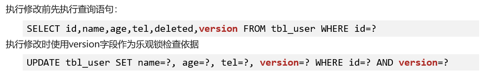

## MyBatisPlus

> MyBatisPlus在 MyBatis 的基础上只做增强不做改变，为简化开发、提高效率而生
>
> 官网：https://baomidou.com/

- 特性
  - 无侵入：只做增强不做改变，不会对现有工程产生影响
  - 强大的 CRUD 操作：内置通用 Mapper，少量配置即可实现单表CRUD 操作
  - 支持 Lambda：编写查询条件无需担心字段写错
  - 支持主键自动生成
  - 内置分页插件


### 入门

- 导入依赖

  ```xml
      <parent>
          <groupId>org.springframework.boot</groupId>
          <artifactId>spring-boot-dependencies</artifactId>
          <version>2.5.6</version>
      </parent>
  
      <dependencies>
          <!--springboot-->
          <dependency>
              <groupId>org.springframework.boot</groupId>
              <artifactId>spring-boot-starter</artifactId>
          </dependency>
  
          <!-- spring整合test -->
          <dependency>
              <groupId>org.springframework.boot</groupId>
              <artifactId>spring-boot-starter-test</artifactId>
          </dependency>
  
          <!-- mybatis-plus的启动器 -->
          <dependency>
              <groupId>com.baomidou</groupId>
              <artifactId>mybatis-plus-boot-starter</artifactId>
              <version>3.4.2</version>
          </dependency>
          <!-- 连接池 -->
          <dependency>
              <groupId>com.alibaba</groupId>
              <artifactId>druid-spring-boot-starter</artifactId>
              <version>1.1.23</version>
          </dependency>
          <!-- mysql要选择正确版本的驱动-->
          <dependency>
              <groupId>mysql</groupId>
              <artifactId>mysql-connector-java</artifactId>
              <version>5.1.47</version>
              <scope>runtime</scope>
          </dependency>
          <!-- lombok -->
          <dependency>
              <groupId>org.projectlombok</groupId>
              <artifactId>lombok</artifactId>
          </dependency>
      </dependencies>
  ```

- 配置文件application.yml

  ```yml
  # 数据源的配置
  spring:
    datasource:
      username: root
      password: root
      driver-class-name: com.mysql.jdbc.Driver
      type: com.alibaba.druid.pool.DruidDataSource
      url: jdbc:mysql:///mybatisplus_db
  
  # 显示SQL语句
  mybatis-plus:
    configuration:
      log-impl: org.apache.ibatis.logging.stdout.StdOutImpl
  ```

- 定义数据接口，继承BaseMapper

  - ==启动类记得添加@MapperScan注解扫描dao包==
  - ==Mapper接口需要继承BaseMapper==
  - ==在BaseMapper接口上指定操作的实体类作为泛型具体类型,默认实体类的名字就是对应表名==

  ```java
  package com.itheima.dao;
  
  import com.baomidou.mybatisplus.core.mapper.BaseMapper;
  import com.itheima.model.User;
  
  public interface UserDao extends BaseMapper<User> {
  }
  ```

- 字段映射与表名映射

  - <u>数据库表名和实体类名不一致</u>：在实体类上方，使用**@TableName**注解，通过**==value==**属性，设置当前类对应的数据库表名称
  - <u>数据库表字段与实体类属性不一致</u>：在实体类属性上方，使用**@TableField**属性注解，通过==**value**==属性，设置当前属性对应的数据库表中的字段关系
  - <u>实体类的属性在数据库表中未定义</u>：在实体类属性上方，使用**@TableField**注解，通过**==exist==**属性设置为false，设置属性在数据库表字段中是否存在，默认为true。（此属性无法与value同时使用）
  - 某些字段和属性不参与查询：在实体类属性上方，使用**@TableField**注解，通过**==select==**属性设置为false。（此属性与select()映射配置不冲突）


### 分页功能

- 设置分页拦截器

  ```java
  package com.itheima.config;
  
  import com.baomidou.mybatisplus.annotation.DbType;
  import com.baomidou.mybatisplus.extension.plugins.MybatisPlusInterceptor;
  import com.baomidou.mybatisplus.extension.plugins.inner.PaginationInnerInterceptor;
  import org.springframework.context.annotation.Bean;
  import org.springframework.context.annotation.Configuration;
  
  @Configuration
  public class MybatisPlusConfig {
  
      /**
       * 如果mp需要实现分页，必须创建一个分页的拦截器存储到spring的容器里面，
       * 当使用selectPage的时候，就会对sql语句进行拦截，从而拼接limit语句实现分页
       */
      @Bean
      public MybatisPlusInterceptor mybatisPlusInterceptor(){
          //1. 创建MybatisPlusInterceptor拦截器容器
          MybatisPlusInterceptor mybatisPlusInterceptor = new MybatisPlusInterceptor();
          //2. 把分页的拦截器添加到mp拦截器容器里面
          mybatisPlusInterceptor.addInnerInterceptor(new PaginationInnerInterceptor(DbType.MYSQL));
          //3. 返回mp拦截器容器即可
          return mybatisPlusInterceptor;
      }
  }
  ```


- 使用分页查询

  ```java
      @Test
      public void findByPage() {
          //1.创建一个Page对象，设置当前页和页面大小
          //参数1：当前页，参数2：页面大小
          Page<User> page = new Page<>(1, 2);
  
          //2.调用selectPage方法，把Page对象传入，即可实现分页；分页结果都存储在Page对象中
          //参数1：当前分页对象，参数2：查询条件
          userDao.selectPage(page, null);
  
          System.out.println("当前页：" + page.getCurrent());
          System.out.println("页面大小：" + page.getSize());
          System.out.println("总记录数：" + page.getTotal());
          System.out.println("总页数：" + page.getPages());
          System.out.println("当前页的数据：" + page.getRecords());
      }
  ```

  

### DQL编程控制

- 条件查询

  ```java
      //==========按条件查询=============
  
      /**
       * 根据年龄查询： 大于18岁
       */
      @Test
      public void findByAge() {
          //1.创建一个条件对象
          QueryWrapper<User> queryWrapper = new QueryWrapper<>();
          //2.设置查询条件
          //参数1：查询的字段，参数2：查询条件
          queryWrapper.gt("age", 18);
          //3.调用selectList方法查询
          System.out.println("用户列表：" + userDao.selectList(queryWrapper));
      }
  
      //方式二：使用lambda格式查询，防止输入的字段名写错
      @Test
      public void findByAgeLambda() {
          //1.创建一个lambda条件对象
          LambdaQueryWrapper<User> queryWrapper = new LambdaQueryWrapper<>();
          //2.设置查询条件
          queryWrapper.gt(User::getAge, 18);
          //3.调用selectList方法查询
          List<User> userList = userDao.selectList(queryWrapper);
          System.out.println("userList = " + userList);
      }
  ```


- 组合条件查询

  ```java
      //==========组合条件查询=============
  
      /**
       * 查询年龄小于28岁，而且大于18岁的用户
       * 默认情况：添加两个条件的关系就是and的关系
       * 生成语句：SELECT id,name,gender,password,age,tel FROM user WHERE (age < ? AND age > ?)
       */
      @Test
      public void selectByConditions() {
          //1.创建lambda条件查询对象
          LambdaQueryWrapper<User> queryWrapper = new LambdaQueryWrapper<>();
          //2.添加查询条件
          queryWrapper.lt(User::getAge, 28);
          queryWrapper.gt(User::getAge, 18);
          //3.查询
          List<User> userList = userDao.selectList(queryWrapper);
          System.out.println("userList = " + userList);
      }
  
      /**
       * 查询年龄小于18岁，或者大于28岁的用户
       * 生成语句：SELECT id,name,gender,password,age,tel FROM user WHERE (age < ? OR age > ?)
       */
      @Test
      public void selectByConditions2() {
          //1.创建lambda条件查询对象
          LambdaQueryWrapper<User> queryWrapper = new LambdaQueryWrapper<>();
          //2.添加查询条件
          queryWrapper.lt(User::getAge, 28);
          queryWrapper.or();
          queryWrapper.gt(User::getAge, 18);
          //3.查询
          List<User> userList = userDao.selectList(queryWrapper);
          System.out.println("userList = " + userList);
      }
  ```


- 条件参数控制（Null值处理）

  ```java
      //==========Null值处理=============
  
      /**
       * 根据年龄搜索，分别最小年龄，最大年龄，名字， 只要三个变量中任何一个不为空都要作为条件查询
       */
      @Test
      public void selectByConditions3() {
          Integer minAge = null;
          Integer maxAge = 26;
          String name = "张";
  
          LambdaQueryWrapper<User> queryWrapper = new LambdaQueryWrapper<>();
          queryWrapper.ge(minAge != null, User::getAge, minAge);//大于等于
          queryWrapper.le(maxAge != null, User::getAge, maxAge);//小于等于
          //模糊查询 like ==> '%搜索内容%'，likeLeft  ==> '%搜索内容'，likeRight  ==> '搜索内容%'
          queryWrapper.like(name != null, User::getName, name);
  
          List<User> userList = userDao.selectList(queryWrapper);
          System.out.println("userList = " + userList);
      }
  ```


- 查询条件

  ```java
      /**
       * between查询范围
       */
      @Test
      public void selectByConditions6(){
          LambdaQueryWrapper<User> queryWrapper = new LambdaQueryWrapper<>();
          queryWrapper.between(User::getAge,18,28);
          List<User> userList = userDao.selectList(queryWrapper);
          System.out.println("userList = " + userList);
      }
  
      /**
       * 右模糊查询（以什么开头）
       */
      @Test
      public void selectByConditions7(){
          LambdaQueryWrapper<User> queryWrapper = new LambdaQueryWrapper<>();
          queryWrapper.likeRight(User::getName,"k");
          List<User> userList = userDao.selectList(queryWrapper);
          System.out.println("userList = " + userList);
      }
  
      /**
       * 分组聚合查询
       */
      @Test
      public void selectByConditions8(){
          QueryWrapper<User> queryWrapper = new QueryWrapper<>();
          queryWrapper.select("gender, count(*) as nums");
          queryWrapper.groupBy("gender");
          List<Map<String, Object>> maps = userMapper.selectMaps(queryWrapper);
          System.out.println(maps);
      }
  ```


- 排序和limit

  ```java
  /**
       * 只显示年龄最大的前五个
       * last()方法：无视优化规则直接拼接到 sql 的最后(有sql注入的风险)，注意只能调用一次,多次调用以最后一次为准
       */
      @Test
      public void selectByConditions9(){
          LambdaQueryWrapper<User> queryWrapper = new LambdaQueryWrapper<>();
          queryWrapper.orderByDesc(User::getAge);
          queryWrapper.last("limit 5");
          //生成语句：SELECT id,name,gender,password,age,tel FROM user ORDER BY age DESC limit 5
          List<User> userList = userDao.selectList(queryWrapper);
          System.out.println("userList = " + userList);
      }
  ```


- 批量操作

  ```java
      //==========批量操作=============
      @Test
      public void selectByIds(){
          List<Long> list = new ArrayList<>();
          list.add(1L);
          list.add(2L);
          list.add(3L);
          userDao.selectBatchIds(list);
      }
  
      @Test
      public void deleteByIds(){
          List<Long> list = new ArrayList<>();
          list.add(1613810063384797186L);
          list.add(1613870490835759106L);
          userDao.deleteBatchIds(list);
      }
  ```


#### 查询投影

- 查询指定字段

  ```java
      /**
       * 只查询其中个别列表，而不是所有列表
       * select()方法就是相当于 select 字段名
       */
      @Test
      public void selectByConditions4(){
          LambdaQueryWrapper<User> queryWrapper = new LambdaQueryWrapper<>();
          queryWrapper.select(User::getGender,User::getAge);//相当于select gender,age
          //生成：SELECT id,name,age FROM user
          List<User> userList = userDao.selectList(queryWrapper);
          System.out.println("userList = " + userList);
      }
  ```

  

- 查询未定义属性

  ```java
      /**
       * 例如：统计男女的人数
       * 查询的结果中包含实体类中未定义的属性，则将每个元素封装成Map对象
       * 【注意: 既然查询字段不是实体类拥有属性，那么不准使用lambda写法】
       */
      @Test
      public void selectByConditions5(){
          QueryWrapper<User> queryWrapper = new QueryWrapper<>();
          queryWrapper.select("gender,count(*)");
          queryWrapper.groupBy("gender");
          //生成语句：SELECT gender,count(*) FROM user GROUP BY gender
          List<Map> list = userDao.selectMaps(queryWrapper);
          System.out.println("list = " + list);
      }
  ```


#### 逻辑删除

> 逻辑删除：为数据设置是否可用状态字段，删除时设置状态字段为不可用状态，数据保留在数据库中
>
> 如果加了逻辑删除字段，查询数据时也会自动带上逻辑删除字段

- 在数据库中添加逻辑删除标记字段

  ```mysql
  -- 添加一列deleted，注意设置默认值为0
  ALTER TABLE tbl_user ADD COLUMN deleted INT(1) DEFAULT 0;
  ```

- 在实体类中添加对应属性，并设定为逻辑删除标记字段

  - 使用`@TableLogic`注解设定

  - yml全局设定

    ```yml
    mybatis-plus:
      global-config:
        db-config:
          table-prefix: tbl_
          # 逻辑删除字段名
          logic-delete-field: deleted
          # 逻辑删除字面值：未删除为0
          logic-not-delete-value: 0
          # 逻辑删除字面值：删除为1
          logic-delete-value: 1
    ```

    


### DML编程控制

#### ID生成策略控制&表前缀配置

- `@TableId`注解

  - 用在实体类中用于**表示主键的属性**上方，设置**type属性**指定当前类中主键属性的生成策略

  

- `@TableName`注解

  - `@TableName("tbl_user")`在实体类上使用，与数据库的表建立映射

- yml全局配置

  ```yml
  # 全局策略配置
    global-config:
      db-config:
        # 定义所有表主键生成策略
        id-type: assign_id
        # 在每个实体类的前面添加相同的前缀
        table-prefix: tbl_
  ```


### 代码生成器

> AutoGenerator 是 MyBatis-Plus 的代码生成器，只需要创建好表，通过 AutoGenerator 可以快速生成 Entity、Mapper、Mapper XML、Service、Controller 等各个模块的代码，极大的提升了开发效率。
>


#### 实现

- 导入依赖

  ```xml
       <!--父工程给生成后的代码用的-->
      <parent>
          <groupId>org.springframework.boot</groupId>
          <artifactId>spring-boot-starter-parent</artifactId>
          <version>2.1.6.RELEASE</version>
      </parent>
      
      <dependencies>
  
          <!--代码生成器-->
          <dependency>
              <groupId>com.baomidou</groupId>
              <artifactId>mybatis-plus-generator</artifactId>
              <version>3.4.0</version>
          </dependency>
  
          <!--模块引擎-->
          <dependency>
              <groupId>org.freemarker</groupId>
              <artifactId>freemarker</artifactId>
              <version>2.3.30</version>
          </dependency>
          
  
          <!--下面是生成后的代码需要用到的依赖-->
  
          <!--web启动器-->
          <dependency>
              <groupId>org.springframework.boot</groupId>
              <artifactId>spring-boot-starter-web</artifactId>
          </dependency>
  
  
          <!--mybatis启动器-->
          <dependency>
              <groupId>com.baomidou</groupId>
              <artifactId>mybatis-plus-boot-starter</artifactId>
              <version>3.4.0</version>
          </dependency>
  
          <dependency>
              <groupId>mysql</groupId>
              <artifactId>mysql-connector-java</artifactId>
              <version>5.1.47</version>
          </dependency>
  
          <dependency>
              <groupId>org.projectlombok</groupId>
              <artifactId>lombok</artifactId>
          </dependency>
  
      </dependencies>
  ```


- 创建test包，复制此类到包下

  ```java
  package cn.itcast.test;
  
  
  import com.baomidou.mybatisplus.core.exceptions.MybatisPlusException;
  import com.baomidou.mybatisplus.core.toolkit.StringPool;
  import com.baomidou.mybatisplus.core.toolkit.StringUtils;
  import com.baomidou.mybatisplus.generator.AutoGenerator;
  import com.baomidou.mybatisplus.generator.InjectionConfig;
  import com.baomidou.mybatisplus.generator.config.*;
  import com.baomidou.mybatisplus.generator.config.po.TableInfo;
  import com.baomidou.mybatisplus.generator.config.rules.NamingStrategy;
  import com.baomidou.mybatisplus.generator.engine.FreemarkerTemplateEngine;
  
  import java.util.ArrayList;
  import java.util.List;
  import java.util.Scanner;
  
  // 演示例子，执行 main 方法控制台输入模块表名回车自动生成对应项目目录中
  public class CodeGenerator {
  
      public static String scanner(String tip) {
          Scanner scanner = new Scanner(System.in);
          StringBuilder help = new StringBuilder();
          help.append("请输入" + tip + "：");
          System.out.println(help.toString());
          if (scanner.hasNext()) {
              String ipt = scanner.next();
              if (StringUtils.isNotBlank(ipt)) {
                  return ipt;
              }
          }
          throw new MybatisPlusException("请输入正确的" + tip + "！");
      }
  
  
      public static void main(String[] args) {
          // 代码生成器
          AutoGenerator mpg = new AutoGenerator();
  
          // 全局配置
          GlobalConfig gc = new GlobalConfig();
          String projectPath = System.getProperty("user.dir");
          String moduleName = scanner("请代码存储的模块名");
          gc.setOutputDir(projectPath + "/"+moduleName+"/src/main/java");
          //代码的作者
          gc.setAuthor("itheima");
          gc.setOpen(false);
          mpg.setGlobalConfig(gc);
  
          // 数据源配置
          DataSourceConfig dsc = new DataSourceConfig();
          dsc.setUrl("jdbc:mysql://localhost:3306/springdb?useUnicode=true&useSSL=false&characterEncoding=utf8");
          // dsc.setSchemaName("public");
          dsc.setDriverName("com.mysql.jdbc.Driver");
          dsc.setUsername("root");
          dsc.setPassword("root");
          mpg.setDataSource(dsc);
  
          // 包配置
          PackageConfig pc = new PackageConfig();
          pc.setModuleName(scanner("功能模块名"));
          //设置父级包名   com.itheima.user  com.itheima.teacher
          pc.setParent("com.itheima");
          mpg.setPackageInfo(pc);
  
          // 自定义配置
          InjectionConfig cfg = new InjectionConfig() {
              @Override
              public void initMap() {
                  // to do nothing
              }
          };
  
          // 如果模板引擎是 freemarker
          String templatePath = "/templates/mapper.xml.ftl";
  
          // 自定义输出配置
          List<FileOutConfig> focList = new ArrayList<>();
          // 自定义配置会被优先输出
          focList.add(new FileOutConfig(templatePath) {
              @Override
              public String outputFile(TableInfo tableInfo) {
                  // 自定义输出文件名 ， 如果你 Entity 设置了前后缀、此处注意 xml 的名称会跟着发生变化！！
                  return projectPath + "/"+moduleName+"/src/main/resources/mapper/" + pc.getModuleName()
                          + "/" + tableInfo.getEntityName() + "Mapper" + StringPool.DOT_XML;
              }
          });
          cfg.setFileOutConfigList(focList);
          mpg.setCfg(cfg);
  
          // 配置模板
          TemplateConfig templateConfig = new TemplateConfig();
  
          templateConfig.setXml(null);
          mpg.setTemplate(templateConfig);
  
          // 策略配置
          StrategyConfig strategy = new StrategyConfig();
          strategy.setNaming(NamingStrategy.underline_to_camel);
          strategy.setColumnNaming(NamingStrategy.underline_to_camel);
          // strategy.setSuperEntityClass("你自己的父类实体,没有就不用设置!");
          strategy.setEntityLombokModel(true);
          strategy.setRestControllerStyle(true);
          // 公共父类
          // strategy.setSuperControllerClass("你自己的父类控制器,没有就不用设置!");
          // 写于父类中的公共字段
          // strategy.setSuperEntityColumns("id");
          strategy.setInclude(scanner("表名，多个英文逗号分割").split(","));
          strategy.setControllerMappingHyphenStyle(true);
          String preName = scanner("请输入表前缀名");
          strategy.setTablePrefix(preName); // 设置表前缀
          mpg.setStrategy(strategy);
          mpg.setTemplateEngine(new FreemarkerTemplateEngine());
  
          // 执行
          mpg.execute();
      }
  }
  ```


- 执行以上代码，在控制台输入功能模块名，表名即可


## 悲观锁&乐观锁

> 悲观锁：借助数据库锁机制，在修改数据之前先锁定，再修改的方式被称之为悲观锁。这是一种对数据的修改持有悲观态度的并发控制方式。总是假设最坏的情况，每次读取数据的时候都默认其他线程会更改数据，因线程想要访问数据时，都需要阻塞挂起。
>
> 乐观锁：乐观锁采取了更加宽松的加锁机制，不会刻意使用数据库本身的锁机制，而是依据数据本身来保证数据的正确性。假设数据一般情况不会造成冲突，所以在数据进行提交更新的时候，才会正式对数据的冲突与否进行检测，乐观锁适用于读多写少的场景，这样可以提高程序的吞吐量。


### 乐观锁实现

- CAS实现：Java 中java.util.concurrent.atomic包下面的原子变量使用了乐观锁的一种 CAS 实现方式。
- 版本号控制：在数据表中加上一个数据版本号 version 字段，表示数据被修改的次数。当数据被修改时，version 值会 +1。当线程 A 要更新数据时，在读取数据的同时也会读取 version 值，在提交更新时，若刚才读取到的 version 值与当前数据库中的 version 值相等时才更新，否则重试更新操作，直到更新成功。


#### 实现案例（MP）

- 数据库表中添加锁标记字段

  ```mysql
  ALTER TABLE tbl_user ADD COLUMN `version` INT DEFAULT 0;
  ```

- 实体类中添加对应字段，并使用`@Version`注解设定当前字段为版本控制字段

  ```java
  package com.itheima.domain;
  
  @Data
  public class User {
  
  	private Long id;
      
      private Integer age;
  	
      @Version
      private Integer version;
  }
  ```

- 配置乐观锁拦截器实现锁机制对应的动态SQL语句拼接

  ```java
  package com.itheima.config;
  
  @Configuration
  public class MybatisPlusConfig {
      @Bean
      public MybatisPlusInterceptor mybatisPlusInterceptor() {
          //1.定义Mp拦截器
          MybatisPlusInterceptor mpInterceptor = new MybatisPlusInterceptor();
  
          //2.添加乐观锁拦截器
          mpInterceptor.addInnerInterceptor(new OptimisticLockerInnerInterceptor());
          
          return mpInterceptor;
      }
  }
  ```

- 使用乐观锁机制在修改前必须先获取对应数据的version

  ```java
    /**
       * 乐观锁的测试
       */
      @Test
      public void testLock(){
          //1. 查询当前要修改的记录
          User user = userDao.selectById(6);
          //2. 修改数据
          user.setAge(32);
          userDao.updateById(user);
      }
  ```

  


