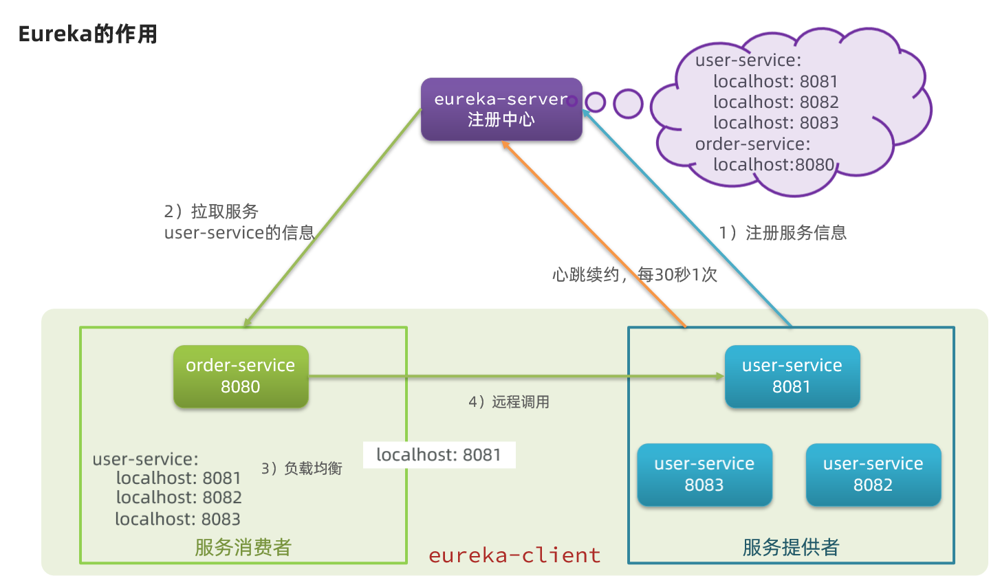
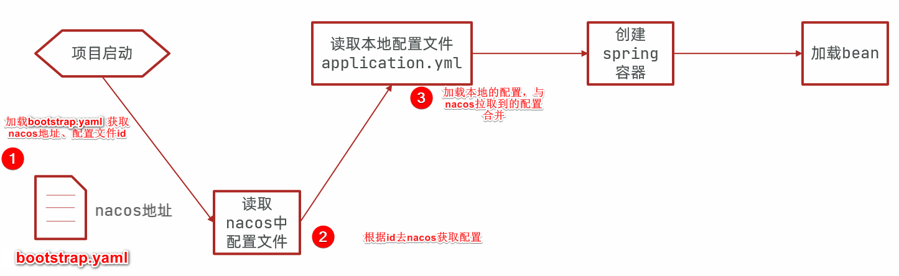

## SpringCloud

> SpringCloud集成了各种微服务功能==组件==，==并基于SpringBoot实现了这些组件的自动装配==，从而提供了良好的开箱即用体验。SpringCloud底层是依赖于SpringBoot的，并且有版本的兼容关系。


- 单体架构：将业务的所有功能集中在一个项目中开发，打成一个包部署。
  - 优点：架构简单，部署成本低；
  - 缺点：
    - 耦合度高
    - 无法针对不同的模块进行针对性性能优化，如果需要提高性能只能整体一起提高
    - 单点容错率低，并发能力差，全部功能集中在一个工程中，对于大型项目不易开发、扩展及维护

- 分布式架构：根据业务功能对系统做拆分，每个业务功能模块作为独立项目开发，称为一个服务
  - 分布式： 把一件事情拆分n个事情来做，n个事情合起来就是一个完整的项目
  - 集群： 多台服务器做的事情是一样
  - 分布式架构的优缺点
    - 优点：降低服务耦合，有利于服务升级和拓展
    - 缺点：服务调用关系错综复杂


### 微服务

微服务是一种经过良好架构设计的**分布式**架构方案，微服务架构特征：

微服务的架构特征：

- **单一职责**：微服务拆分粒度更小，每一个服务都对应唯一的业务
- **自治**：团队独立、技术独立、数据独立、独立部署和交付
- **面向服务**：服务提供统一标准的接口，与语言和技术无关
- **隔离性强**：服务调用做好隔离、容错、降级，避免出现级联问题


- 微服务技术对比

  |                | Dubbo                   | SpringCloud              | SpringCloudAlibaba       |
  | -------------- | ----------------------- | ------------------------ | ------------------------ |
  | 注册中心       | zookeeper、Redis        | Eureka、Consul           | Nacos、Eureka            |
  | 服务远程调用   | Dubbo协议、HTTP、REST等 | Feign（http协议）        | Dubbo、Feign             |
  | 配置中心       | 无                      | SpringCloudConfig        | SpringCloudConfig、Nacos |
  | 服务网关       | 无                      | SpringCloudGateway、Zuul | SpringCloudGateway、Zuul |
  | 服务监控和保护 | dubbo-admin，功能弱     | Hystrix                  | Sentinel                 |

### 服务拆分

- 拆分原则
  - 不同微服务，不要重复开发相同业务
  - 微服务数据独立，不要访问其他微服务的数据库
  - 微服务可以将自己的业务暴露为接口，供其他微服务调用


### 远程调用


> 背景：需要在order-service中向user-service发起一个http的请求，调用`http://localhost:8081/user/{userId}`这个接口


实现步骤：

- 在order-service服务的启动类中注册RestTemplate

  ```java
  package cn.itcast.order;
  
  import org.mybatis.spring.annotation.MapperScan;
  import org.springframework.boot.SpringApplication;
  import org.springframework.boot.autoconfigure.SpringBootApplication;
  import org.springframework.context.annotation.Bean;
  import org.springframework.web.client.RestTemplate;
  
  @MapperScan("cn.itcast.order.mapper")
  @SpringBootApplication
  public class OrderApplication {
  
      public static void main(String[] args) {
          SpringApplication.run(OrderApplication.class, args);
      }
  
       /**
       * 提供远程Http服务
       */
      @Bean
      public RestTemplate restTemplate() {
          return new RestTemplate();
      }
  }
  ```


- 使用getForObject方法，实现远程调用

  ```java
  @Service
  public class OrderService {
  
      @Autowired
      private OrderMapper orderMapper;
  
      @Autowired
      private RestTemplate restTemplate;
  
      public Order queryOrderById(Long orderId) {
          // 1.根据id查询订单
          Order order = orderMapper.findById(orderId);
          //发起远程调用另一个功能模块
          User user = restTemplate.getForObject("http://localhost:8081/user/" + order.getUserId(), User.class);
          order.setUser(user);
          // 4.返回
          return order;
      }
  }
  ```


### Eureka注册中心




#### 搭建Eureka-server

- 在父工程下创建一个子模块

- 导入依赖

  ```xml
  <!-- 添加eureka服务端 -->
  <dependency>
      <groupId>org.springframework.cloud</groupId>
      <artifactId>spring-cloud-starter-netflix-eureka-server</artifactId>
  </dependency>
  ```

- 编写启动类，添加`@EnableEurekaServer`注解，开启Eureka的注册中心功能

  ```java
  package cn.itcast.eureka;
  
  import org.springframework.boot.SpringApplication;
  import org.springframework.boot.autoconfigure.SpringBootApplication;
  import org.springframework.cloud.netflix.eureka.server.EnableEurekaServer;
  
  @SpringBootApplication
  @EnableEurekaServer
  public class EurekaApplication {
      public static void main(String[] args) {
          SpringApplication.run(EurekaApplication.class, args);
      }
  }
  ```

- 编写配置文件

  ```yml
  # 服务器端口号
  server:
    port: 10086
  
  # 服务器名称
  spring:
    application:
      name: euraka-server
  
  # 注册中心服务的网址
  eureka:
    client:
      service-url:
        defaultZone: http://127.0.0.1:10086/eureka
  ```

- 启动服务

  - 启动微服务，然后在浏览器访问：http://127.0.0.1:10086


#### 服务注册

- 导入依赖

  ```xml
  <!-- 注册eureka客户端 -->
  <dependency>
      <groupId>org.springframework.cloud</groupId>
      <artifactId>spring-cloud-starter-netflix-eureka-client</artifactId>
  </dependency>
  ```

- 编写配置文件

  ```yml
  # 写在spring的配置部分中
  spring:
    application:
      name: user-server
  # 指定eureka服务器端的访问地址
  eureka:
    client:
      service-url:
        defaultZone: http://127.0.0.1:10086/eureka
  ```

- 模拟多个user-server实例

  - 修改server.port参数

  ```yml
  # 动态端口
  server:
    port: ${port:8081}
  ```

  - 编辑VM options参数`-Dport=8082`

- 先开启Eureka服务器端，再开启客户端


#### 服务发现

> 将order-service的逻辑修改：向eureka-server拉取user-server的信息，实现服务发现。


- 导入依赖（服务发现、服务注册统一都封装在eureka-client依赖中）

  ```xml
  <!-- eureka客户端 -->
  <dependency>
      <groupId>org.springframework.cloud</groupId>
      <artifactId>spring-cloud-starter-netflix-eureka-client</artifactId>
  </dependency>
  ```

- 编写配置文件

  ```yml
  # 写在spring的配置部分中
  spring:
    application:
      name: order-server
  # 指定eureka服务器端的访问地址
  eureka:
    client:
      service-url:
        defaultZone: http://127.0.0.1:10086/eureka
  ```

- 服务拉取与负载均衡

  - 给RestTemplate这个Bean添加一个@LoadBalanced注解

  ```java
  @MapperScan("cn.itcast.order.mapper")
  @SpringBootApplication
  public class OrderApplication {
  
      public static void main(String[] args) {
          SpringApplication.run(OrderApplication.class, args);
      }
  
      @Bean
      @LoadBalanced
      public RestTemplate restTemplate(){
          return new RestTemplate();
      }
  }
  ```

  - 修改访问的url路径，**用服务名代替ip、端口**，spring会自动帮助我们从eureka-server端，根据user-service这个服务名称，获取实例列表，而后完成负载均衡

  ```java
  @Service
  public class OrderService {
  
      @Autowired
      private OrderMapper orderMapper;
  
      @Autowired
      private RestTemplate restTemplate;
  
      public Order queryOrderById(Long orderId) {
          // 1.查询订单
          Order order = orderMapper.findById(orderId);
          //调用另一个功能模块
          User user = restTemplate.getForObject("http://user-server/user/" + order.getUserId(), User.class);
          order.setUser(user);
          // 4.返回
          return order;
      }
  }
  ```


### Ribbon负载均衡

#### 原理

- SpringCloud底层其实是利用了一个名为Ribbon的组件，来实现负载均衡功能的

  

- SpringCloudRibbon的底层采用了一个拦截器，拦截了RestTemplate发出的请求，对地址做了修改。基本流程如下：

  - loadBalanceInterceptor拦截我们请求的url地址
  - RibbonLoadBalancerClient会从请求url中获取服务名称，也就是userservice
  - DynamicServerListLoadBanancer根据服务名称到eureka拉取服务列表
  - 根据根接口IRule配置的负载均衡策略，选择其中的一个服务
  - RibbonLoadBalancerClient修改请求地址，用localhost:8081替代userservice，得到http://localhost:8081/user/1，发起真实请求

  


#### 负载均衡策略

| 内置负载均衡规则类        | 规则描述                                                     |
| ------------------------- | ------------------------------------------------------------ |
| RoundRobinRule            | 轮询规则：简单轮询服务列表来选择服务器。它是Ribbon默认的负载均衡规则。 |
| AvailabilityFilteringRule | 可用性过滤规则：对以下两种服务器进行忽略：   <br />（1）在默认情况下，这台服务器如果3次连接失败，这台服务器就会被设置为“短路”状态。短路状态将持续30秒，如果再次连接失败，短路的持续时间就会几何级地增加。  <br />（2）并发数过高的服务器。如果一个服务器的并发连接数过高，配置了AvailabilityFilteringRule规则的客户端也会将其忽略。并发连接数的上限，可以由客户端的`<clientName>.<clientConfigNameSpace>.ActiveConnectionsLimit`属性进行配置。 |
| WeightedResponseTimeRule  | 响应权重时间规则：为每一个服务器赋予一个权重值。服务器响应时间越长，这个服务器的权重就越小。这个规则会随机选择服务器，这个权重值会影响服务器的选择。 |
| **ZoneAvoidanceRule**     | 规避区域规则：以区域可用的服务器为基础进行服务器的选择。使用Zone对服务器进行分类，这个Zone可以理解为一个机房、一个机架等。而后再对Zone内的多个服务做==轮询==。 |
| BestAvailableRule         | 最可用规则：忽略那些短路的服务器，并选择并发数较低的服务器。 |
| RandomRule                | 随机规则：随机选择一个可用的服务器。                         |
| RetryRule                 | 重试实现：重试机制的选择逻辑                                 |


#### 自定义负载均衡策略

（一般用默认的负载均衡规则，不做修改）

- 方式一：编码方式（全局）

  ```java
  @MapperScan("cn.itcast.order.mapper")
  @SpringBootApplication
  public class OrderApplication {
  
      public static void main(String[] args) {
          SpringApplication.run(OrderApplication.class, args);
      }
  
      /**
       * 提供远程Http服务
       */
      @Bean
      @LoadBalanced
      public RestTemplate restTemplate(){
          return new RestTemplate();
      }
  
      /**
       * 自定义负载均衡：
       * 方式一：编码方式（全局），方式二：配置文件方式（可指定具体的微服务）
       * 自定义负载均衡：这种方式是全局的配置，无论以后访问哪个微服务都使用随机的方式
       * 注意：如果选择方式二进行配置，则需要注释掉方式一
       */
      @Bean
      public IRule iRule(){
          return new RandomRule();//使用随机的负载均衡规则
      }
  }
  ```


- 方式二：配置文件方式（可指定具体的微服务）

  ```yml
  # 给某个微服务配置负载均衡规则，只对这个微服务起作用
  user-server: # 指定的微服务
    ribbon:
      # 负载均衡规则的类全名
      NFLoadBalancerRuleClassName: com.alibaba.cloud.nacos.ribbon.NacosRule
  ```


#### 饥饿加载

Ribbon默认是采用懒加载，即第一次访问时才会去创建LoadBalanceClient，使得第一次请求的时间会很长。饥饿加载的作用： 启动服务器的时候就去拉取服务列表，缩短第一次请求的时间。

- 配置开启饥饿加载

  ```yml
  ribbon:
    eager-load:
      enabled: true # 开启饥饿加载
      # 指定微服务
      clients:
        - user-server # clients是一个List集合。如果要配置多个服务名字，则换一行。用-做为前缀，每行写一个
  ```


### Nacos注册中心

> [Nacos](https://nacos.io/)是阿里巴巴的产品，现在是[SpringCloud](https://spring.io/projects/spring-cloud)中的一个组件。相比[Eureka](https://github.com/Netflix/eureka)功能更加丰富，在国内受欢迎程度较高。


#### 搭建Nacos

**导入依赖**

- 在cloud-demo**父工程**的pom文件中的`<dependencyManagement>`中引入SpringCloudAlibaba的依赖：

  ```xml
  <!-- springcloud阿里巴巴父模块 -->
  <dependency>
      <groupId>com.alibaba.cloud</groupId>
      <artifactId>spring-cloud-alibaba-dependencies</artifactId>
      <version>2.2.6.RELEASE</version>
      <type>pom</type>
      <scope>import</scope>
  </dependency>
  ```

- 然后在**子工程**user-service和order-service中的pom文件中引入nacos-discovery依赖：

  ```xml
  <!-- nacos -->
  <dependency>
      <groupId>com.alibaba.cloud</groupId>
      <artifactId>spring-cloud-starter-alibaba-nacos-discovery</artifactId>
  </dependency>
  ```

- **注意**：子工程注释掉eureka的依赖

  ```xml
  <dependency>
      <groupId>org.springframework.cloud</groupId>
      <artifactId>spring-cloud-starter-netflix-eureka-client</artifactId>
  </dependency>
  ```


**配置Nacos地址**

- 在user-service和order-service的application.yml中**添加nacos地址**：

  ```yml
  spring:
    cloud:
      nacos:
        server-addr: localhost:8848
  ```

- **注意**：注释掉eureka的地址

  ```yml
  eureka:
    client:
      service-url:
        defaultZone: http://127.0.0.1:10086/eureka
  ```


**重启微服务后，登录nacos管理页面**


#### 服务分级模型（集群）

> 微服务互相访问时，应该尽可能访问同集群实例，因为本地访问速度更快。当本集群内不可用时，才访问其它集群。


- 配置集群，修改order-service和user-service的application.yml文件，添加集群配置， 放在HZ这个集群中

  ```yml
  spring:
    cloud:
      nacos:
        server-addr: localhost:8848
        discovery:
          cluster-name: HZ # 集群名称
  ```

- 模拟集群，user-service的8081和8082在HZ集群，8083在GZ集群（VM options设置）

  ```
  -Dport=8083
  -Dspring.cloud.nacos.discovery.cluster-name=SZ
  ```

- 配置同集群优先的负载均衡策略，修改**order-service**的application.yml文件，修改负载均衡规则

  ```yml
  user-server:
    ribbon:
      NFLoadBalancerRuleClassName: com.alibaba.cloud.nacos.ribbon.NacosRule # 负载均衡规则 
  ```


#### 权重配置

- 在nacos控制台，找到userservice的实例列表，点击编辑，即可修改权重，权重越大则访问频率越高。


#### 环境隔离

> 为了便于管理，Nacos提供了namespace来实现环境隔离功能。用于进行租户级别的隔离，我们最常用的就是不同环境比如测试环境，线上环境进行隔离。不同namespace之间相互隔离，即不同namespace的服务互相不可见.

- 创建命名空间，在nacos控制台创建一个命名空间，然后复制命名空间ID

- 给微服务配置namespace，修改order-service和user-service的application.yml文件：

  ```yml
  spring:
    cloud:
      nacos:
        server-addr: localhost:8848
        discovery:
          cluster-name: HZ
          namespace: 492a7d5d-237b-46a1-a99a-fa8e98e4b0f9 # 命名空间，填ID
  ```


#### 永久实例

- Nacos的服务实例分为两种类型

  - 临时实例：**默认类型**。如果实例宕机超过一定时间，会从服务列表剔除
  - 非临时实例：也叫永久实例。如果实例宕机，不会从服务列表剔除

- 配置永久实例

  ```yml
  spring:
    cloud:
      nacos:
        discovery:
          ephemeral: false # 设置为永久实例
  ```

  

### Nacos与Eureka的区别

- 共同点
  - 都支持服务注册、拉取
  - 都支持心跳方式做健康检测
- 不同点
  - Nacos有临时实例与非临时实例， Eureka是没有临时实例概念
    - 临时实例采用心跳模式，永久实例采用主动检测模式
    - 临时实例心跳不正常会被剔除，永久实例则不会被剔除
  - Nacos不单单支持服务的拉取，还支持服务的主动推送；Eureka只能支持服务拉取，不支持主动推送


### Nacos配置管理

#### 统一配置管理

- Nacos配置中心作用
  - 配置的数据支持动态更新
  - 集中管理配置信息
  - 支持不同环境的配置文件


- 拉取Nacos中管理的配置，与本地的application.yml配置合并。Spring引入了一种新的配置文件：bootstrap.yaml文件，会在application.yml之前被读取



- 实现步骤：

  - 导入依赖

    ```xml
    <!--nacos配置管理依赖-->
    <dependency>
        <groupId>com.alibaba.cloud</groupId>
        <artifactId>spring-cloud-starter-alibaba-nacos-config</artifactId>
    </dependency>
    ```

  - 在application.yml同级目录下添加bootstrap.yaml文件

    ```yaml
    spring:
      application:
        name: userservice # 服务名称，注：要与文件名一致
      profiles:
        active: dev #环境，这里是开发环境dev
      cloud:
        nacos:
          server-addr: localhost:8848 # Nacos地址
          config:
            file-extension: yaml # 文件后缀名
    ```

  - 去除application.yml中重复的配置

  - 读取Nacos中的pattern.dateformat配置

    ```java
    package cn.itcast.user.web;
    
    import cn.itcast.user.pojo.User;
    import cn.itcast.user.service.UserService;
    import org.springframework.beans.factory.annotation.Autowired;
    import org.springframework.beans.factory.annotation.Value;
    import org.springframework.web.bind.annotation.*;
    
    import java.time.LocalDateTime;
    import java.time.format.DateTimeFormatter;
    
    @RestController
    @RequestMapping("/user")
    public class UserController {
    
        @Autowired
        private UserService userService;
    
        @Value("${pattern.dateformat}")
        private String dateformat;
        
        @GetMapping("now")
        public String now(){
            return LocalDateTime.now().format(DateTimeFormatter.ofPattern(dateformat));
        }
    
    }
    ```


#### 热更新配置

##### 方式一：在@Value注入的变量所在的类上添加注解@RefreshScope

```java
@Slf4j
@RestController
@RequestMapping("/user")
@RefreshScope //启动热更新
public class UserController {

    @Autowired
    private UserService userService;

    @Value("${pattern.dateformat}")
    private String dateformat;
```


##### 方式二：使用@ConfigurationProperties注解

- 去掉@RefreshScope注解和@Value注解

- 在user-service服务的config包中添加一个类

  - 添加@Component注解和@Data注解
  - 添加@ConfigurationProperties注解
  - 在类中添加相应属性

  ```java
  package cn.itcast.user.config;
  
  import lombok.Data;
  import org.springframework.boot.context.properties.ConfigurationProperties;
  import org.springframework.stereotype.Component;
  
  @Component
  @Data //@ConfigurationProperties注解依赖于setter方法
  @ConfigurationProperties(prefix = "pattern") //一般该注解都会配合prefix前缀名去使用，通知springcloud给属性名与配置文件一致的属性注入值
  public class PatternProperties {
      private String dateformat;
      private String envSharedValue;
      private String name;
  }
  ```


- 在Controller类中使用@Autowired注入这个类

  ```java
  @Slf4j
  @RestController
  @RequestMapping("/user")
  public class UserController {
  
      @Autowired
      private UserService userService;
  
      @Autowired
      private PatternProperties patternProperties;
  
      @GetMapping("/now")
      public String now() {
          return LocalDateTime.now().format(DateTimeFormatter.ofPattern(patternProperties.getDateformat()));
      }
  }
  ```


##### 方式三：使用@ConfigurationProperties与@EnableConfigurataion注解加载

- 配置类中不使用@Component注解

  ```java
  package cn.itcast.user.config;
  
  import lombok.Data;
  import org.springframework.boot.context.properties.ConfigurationProperties;
  
  @Data //@ConfigurationProperties注解依赖于setter方法
  @ConfigurationProperties(prefix = "pattern") //一般该注解都会配合prefix前缀名去使用，通知springcloud给属性名与配置文件一致的属性注入值
  public class PatternProperties {
      private String dateformat;
      private String envSharedValue;
      private String name;
  }
  ```

- Contrller类

  ```java
  @Slf4j
  @RestController
  @RequestMapping("/user")
  @EnableConfigurationProperties(PatternProperties.class)//该语句的效果其实与@Component在注解的效果是一样的
  public class UserController {
  
      @Autowired
      private UserService userService;
  
      @Autowired
      private PatternProperties patternProperties;
  
      @GetMapping("/now")
      public String now() {
          return LocalDateTime.now().format(DateTimeFormatter.ofPattern(patternProperties.getDateformat()));
      }
  }
  ```


#### 配置共享

- 添加一个userservice.yaml文件，不管是dev，还是test环境，都可以读取到envSharedValue这个属性的值

  ```yaml
  pattern: 
    envSharedValue: 公共配置
  ```

- 配置共享的优先级：指定具体环境的最高，共享环境第二，本地的第三

  - 服务名-profile.yaml > 服务名称.yaml > 本地配置


#### Nacos集群

> nacos集群数据共享是基于数据库实现

- 初始化数据库，==注：要使用mysql5.7以上的版本，5.5运行不了。==

  ```mysql
  CREATE DATABASE IF NOT EXISTS nacos;
  USE nacos;
  
  CREATE TABLE `config_info` (
    `id` bigint(20) NOT NULL AUTO_INCREMENT COMMENT 'id',
    `data_id` varchar(255) NOT NULL COMMENT 'data_id',
    `group_id` varchar(255) DEFAULT NULL,
    `content` longtext NOT NULL COMMENT 'content',
    `md5` varchar(32) DEFAULT NULL COMMENT 'md5',
    `gmt_create` datetime NOT NULL DEFAULT CURRENT_TIMESTAMP COMMENT '创建时间',
    `gmt_modified` datetime NOT NULL DEFAULT CURRENT_TIMESTAMP COMMENT '修改时间',
    `src_user` text COMMENT 'source user',
    `src_ip` varchar(50) DEFAULT NULL COMMENT 'source ip',
    `app_name` varchar(128) DEFAULT NULL,
    `tenant_id` varchar(128) DEFAULT '' COMMENT '租户字段',
    `c_desc` varchar(256) DEFAULT NULL,
    `c_use` varchar(64) DEFAULT NULL,
    `effect` varchar(64) DEFAULT NULL,
    `type` varchar(64) DEFAULT NULL,
    `c_schema` text,
    PRIMARY KEY (`id`),
    UNIQUE KEY `uk_configinfo_datagrouptenant` (`data_id`,`group_id`,`tenant_id`)
  ) ENGINE=InnoDB DEFAULT CHARSET=utf8 COLLATE=utf8_bin COMMENT='config_info';
  
  /******************************************/
  /*   数据库全名 = nacos   */
  /*   表名称 = config_info_aggr   */
  /******************************************/
  CREATE TABLE `config_info_aggr` (
    `id` bigint(20) NOT NULL AUTO_INCREMENT COMMENT 'id',
    `data_id` varchar(255) NOT NULL COMMENT 'data_id',
    `group_id` varchar(255) NOT NULL COMMENT 'group_id',
    `datum_id` varchar(255) NOT NULL COMMENT 'datum_id',
    `content` longtext NOT NULL COMMENT '内容',
    `gmt_modified` datetime NOT NULL COMMENT '修改时间',
    `app_name` varchar(128) DEFAULT NULL,
    `tenant_id` varchar(128) DEFAULT '' COMMENT '租户字段',
    PRIMARY KEY (`id`),
    UNIQUE KEY `uk_configinfoaggr_datagrouptenantdatum` (`data_id`,`group_id`,`tenant_id`,`datum_id`)
  ) ENGINE=InnoDB DEFAULT CHARSET=utf8 COLLATE=utf8_bin COMMENT='增加租户字段';
  
  
  /******************************************/
  /*   数据库全名 = nacos   */
  /*   表名称 = config_info_beta   */
  /******************************************/
  CREATE TABLE `config_info_beta` (
    `id` bigint(20) NOT NULL AUTO_INCREMENT COMMENT 'id',
    `data_id` varchar(255) NOT NULL COMMENT 'data_id',
    `group_id` varchar(128) NOT NULL COMMENT 'group_id',
    `app_name` varchar(128) DEFAULT NULL COMMENT 'app_name',
    `content` longtext NOT NULL COMMENT 'content',
    `beta_ips` varchar(1024) DEFAULT NULL COMMENT 'betaIps',
    `md5` varchar(32) DEFAULT NULL COMMENT 'md5',
    `gmt_create` datetime NOT NULL DEFAULT CURRENT_TIMESTAMP COMMENT '创建时间',
    `gmt_modified` datetime NOT NULL DEFAULT CURRENT_TIMESTAMP COMMENT '修改时间',
    `src_user` text COMMENT 'source user',
    `src_ip` varchar(50) DEFAULT NULL COMMENT 'source ip',
    `tenant_id` varchar(128) DEFAULT '' COMMENT '租户字段',
    PRIMARY KEY (`id`),
    UNIQUE KEY `uk_configinfobeta_datagrouptenant` (`data_id`,`group_id`,`tenant_id`)
  ) ENGINE=InnoDB DEFAULT CHARSET=utf8 COLLATE=utf8_bin COMMENT='config_info_beta';
  
  /******************************************/
  /*   数据库全名 = nacos   */
  /*   表名称 = config_info_tag   */
  /******************************************/
  CREATE TABLE `config_info_tag` (
    `id` bigint(20) NOT NULL AUTO_INCREMENT COMMENT 'id',
    `data_id` varchar(255) NOT NULL COMMENT 'data_id',
    `group_id` varchar(128) NOT NULL COMMENT 'group_id',
    `tenant_id` varchar(128) DEFAULT '' COMMENT 'tenant_id',
    `tag_id` varchar(128) NOT NULL COMMENT 'tag_id',
    `app_name` varchar(128) DEFAULT NULL COMMENT 'app_name',
    `content` longtext NOT NULL COMMENT 'content',
    `md5` varchar(32) DEFAULT NULL COMMENT 'md5',
    `gmt_create` datetime NOT NULL DEFAULT CURRENT_TIMESTAMP COMMENT '创建时间',
    `gmt_modified` datetime NOT NULL DEFAULT CURRENT_TIMESTAMP COMMENT '修改时间',
    `src_user` text COMMENT 'source user',
    `src_ip` varchar(50) DEFAULT NULL COMMENT 'source ip',
    PRIMARY KEY (`id`),
    UNIQUE KEY `uk_configinfotag_datagrouptenanttag` (`data_id`,`group_id`,`tenant_id`,`tag_id`)
  ) ENGINE=InnoDB DEFAULT CHARSET=utf8 COLLATE=utf8_bin COMMENT='config_info_tag';
  
  /******************************************/
  /*   数据库全名 = nacos   */
  /*   表名称 = config_tags_relation   */
  /******************************************/
  CREATE TABLE `config_tags_relation` (
    `id` bigint(20) NOT NULL COMMENT 'id',
    `tag_name` varchar(128) NOT NULL COMMENT 'tag_name',
    `tag_type` varchar(64) DEFAULT NULL COMMENT 'tag_type',
    `data_id` varchar(255) NOT NULL COMMENT 'data_id',
    `group_id` varchar(128) NOT NULL COMMENT 'group_id',
    `tenant_id` varchar(128) DEFAULT '' COMMENT 'tenant_id',
    `nid` bigint(20) NOT NULL AUTO_INCREMENT,
    PRIMARY KEY (`nid`),
    UNIQUE KEY `uk_configtagrelation_configidtag` (`id`,`tag_name`,`tag_type`),
    KEY `idx_tenant_id` (`tenant_id`)
  ) ENGINE=InnoDB DEFAULT CHARSET=utf8 COLLATE=utf8_bin COMMENT='config_tag_relation';
  
  /******************************************/
  /*   数据库全名 = nacos   */
  /*   表名称 = group_capacity   */
  /******************************************/
  CREATE TABLE `group_capacity` (
    `id` bigint(20) unsigned NOT NULL AUTO_INCREMENT COMMENT '主键ID',
    `group_id` varchar(128) NOT NULL DEFAULT '' COMMENT 'Group ID，空字符表示整个集群',
    `quota` int(10) unsigned NOT NULL DEFAULT '0' COMMENT '配额，0表示使用默认值',
    `usage` int(10) unsigned NOT NULL DEFAULT '0' COMMENT '使用量',
    `max_size` int(10) unsigned NOT NULL DEFAULT '0' COMMENT '单个配置大小上限，单位为字节，0表示使用默认值',
    `max_aggr_count` int(10) unsigned NOT NULL DEFAULT '0' COMMENT '聚合子配置最大个数，，0表示使用默认值',
    `max_aggr_size` int(10) unsigned NOT NULL DEFAULT '0' COMMENT '单个聚合数据的子配置大小上限，单位为字节，0表示使用默认值',
    `max_history_count` int(10) unsigned NOT NULL DEFAULT '0' COMMENT '最大变更历史数量',
    `gmt_create` datetime NOT NULL DEFAULT CURRENT_TIMESTAMP COMMENT '创建时间',
    `gmt_modified` datetime NOT NULL DEFAULT CURRENT_TIMESTAMP COMMENT '修改时间',
    PRIMARY KEY (`id`),
    UNIQUE KEY `uk_group_id` (`group_id`)
  ) ENGINE=InnoDB DEFAULT CHARSET=utf8 COLLATE=utf8_bin COMMENT='集群、各Group容量信息表';
  
  /******************************************/
  /*   数据库全名 = nacos   */
  /*   表名称 = his_config_info   */
  /******************************************/
  CREATE TABLE `his_config_info` (
    `id` bigint(64) unsigned NOT NULL,
    `nid` bigint(20) unsigned NOT NULL AUTO_INCREMENT,
    `data_id` varchar(255) NOT NULL,
    `group_id` varchar(128) NOT NULL,
    `app_name` varchar(128) DEFAULT NULL COMMENT 'app_name',
    `content` longtext NOT NULL,
    `md5` varchar(32) DEFAULT NULL,
    `gmt_create` datetime NOT NULL DEFAULT CURRENT_TIMESTAMP,
    `gmt_modified` datetime NOT NULL DEFAULT CURRENT_TIMESTAMP,
    `src_user` text,
    `src_ip` varchar(50) DEFAULT NULL,
    `op_type` char(10) DEFAULT NULL,
    `tenant_id` varchar(128) DEFAULT '' COMMENT '租户字段',
    PRIMARY KEY (`nid`),
    KEY `idx_gmt_create` (`gmt_create`),
    KEY `idx_gmt_modified` (`gmt_modified`),
    KEY `idx_did` (`data_id`)
  ) ENGINE=InnoDB DEFAULT CHARSET=utf8 COLLATE=utf8_bin COMMENT='多租户改造';
  
  
  /******************************************/
  /*   数据库全名 = nacos   */
  /*   表名称 = tenant_capacity   */
  /******************************************/
  CREATE TABLE `tenant_capacity` (
    `id` bigint(20) unsigned NOT NULL AUTO_INCREMENT COMMENT '主键ID',
    `tenant_id` varchar(128) NOT NULL DEFAULT '' COMMENT 'Tenant ID',
    `quota` int(10) unsigned NOT NULL DEFAULT '0' COMMENT '配额，0表示使用默认值',
    `usage` int(10) unsigned NOT NULL DEFAULT '0' COMMENT '使用量',
    `max_size` int(10) unsigned NOT NULL DEFAULT '0' COMMENT '单个配置大小上限，单位为字节，0表示使用默认值',
    `max_aggr_count` int(10) unsigned NOT NULL DEFAULT '0' COMMENT '聚合子配置最大个数',
    `max_aggr_size` int(10) unsigned NOT NULL DEFAULT '0' COMMENT '单个聚合数据的子配置大小上限，单位为字节，0表示使用默认值',
    `max_history_count` int(10) unsigned NOT NULL DEFAULT '0' COMMENT '最大变更历史数量',
    `gmt_create` datetime NOT NULL DEFAULT CURRENT_TIMESTAMP COMMENT '创建时间',
    `gmt_modified` datetime NOT NULL DEFAULT CURRENT_TIMESTAMP COMMENT '修改时间',
    PRIMARY KEY (`id`),
    UNIQUE KEY `uk_tenant_id` (`tenant_id`)
  ) ENGINE=InnoDB DEFAULT CHARSET=utf8 COLLATE=utf8_bin COMMENT='租户容量信息表';
  
  
  CREATE TABLE `tenant_info` (
    `id` bigint(20) NOT NULL AUTO_INCREMENT COMMENT 'id',
    `kp` varchar(128) NOT NULL COMMENT 'kp',
    `tenant_id` varchar(128) default '' COMMENT 'tenant_id',
    `tenant_name` varchar(128) default '' COMMENT 'tenant_name',
    `tenant_desc` varchar(256) DEFAULT NULL COMMENT 'tenant_desc',
    `create_source` varchar(32) DEFAULT NULL COMMENT 'create_source',
    `gmt_create` bigint(20) NOT NULL COMMENT '创建时间',
    `gmt_modified` bigint(20) NOT NULL COMMENT '修改时间',
    PRIMARY KEY (`id`),
    UNIQUE KEY `uk_tenant_info_kptenantid` (`kp`,`tenant_id`),
    KEY `idx_tenant_id` (`tenant_id`)
  ) ENGINE=InnoDB DEFAULT CHARSET=utf8 COLLATE=utf8_bin COMMENT='tenant_info';
  
  CREATE TABLE `users` (
  	`username` varchar(50) NOT NULL PRIMARY KEY,
  	`password` varchar(500) NOT NULL,
  	`enabled` boolean NOT NULL
  );
  
  CREATE TABLE `roles` (
  	`username` varchar(50) NOT NULL,
  	`role` varchar(50) NOT NULL,
  	UNIQUE INDEX `idx_user_role` (`username` ASC, `role` ASC) USING BTREE
  );
  
  CREATE TABLE `permissions` (
      `role` varchar(50) NOT NULL,
      `resource` varchar(255) NOT NULL,
      `action` varchar(8) NOT NULL,
      UNIQUE INDEX `uk_role_permission` (`role`,`resource`,`action`) USING BTREE
  );
  
  INSERT INTO users (username, password, enabled) VALUES ('nacos', '$2a$10$EuWPZHzz32dJN7jexM34MOeYirDdFAZm2kuWj7VEOJhhZkDrxfvUu', TRUE);
  
  INSERT INTO roles (username, role) VALUES ('nacos', 'ROLE_ADMIN');
  ```


- 配置Nacos

  - 创建一个目录名为：nacos-cluster

  - 进入目录nacos-cluster目录，重新解压安装一份新的nacos

  - 进入nacos的conf目录，修改配置文件cluster.conf.example，重命名为cluster.conf，编写集群IP

    ```
    127.0.0.1:8845
    127.0.0.1:8846
    127.0.0.1:8847
    ```

  - 修改application.properties文件，根据实际情况配置数据库地址、用户名、密码

    

    ```properties
    server.port=8845
    
    nacos.inetutils.ip-address=127.0.0.1
    
    #*************** Config Module Related Configurations ***************#
    # mysql的数据库集群
    spring.datasource.platform=mysql
    # 数据库的数量
    db.num=1
    # 连接字符串
    db.url.0=jdbc:mysql://127.0.0.1:3306/nacos?characterEncoding=utf8&connectTimeout=1000&socketTimeout=3000&autoReconnect=true&useUnicode=true&useSSL=false&serverTimezone=UTC
    # 用户名
    db.user.0=root
    # 密码
    db.password.0=root
    ```

  - 将nacos改名成nacos1，并且复制两份，分别命名为：nacos2、nacos3。修改application.properties文件中的server.port

  - 启动三台Nacos


##### Nginx反向代理

- 修改conf/nginx.conf文件

  ```nginx
  upstream nacos-cluster {
  	server 127.0.0.1:8845;
  	server 127.0.0.1:8846;
  	server 127.0.0.1:8847;
  }
  
  server {
      listen       80;
      server_name  localhost;
  
      location / {
          proxy_pass http://nacos-cluster;
      }
  }
  ```

- 启动Nginx服务器

- 修改userservice服务的bootstrap.yaml文件配置

  ```yaml
  spring:
    cloud:
      nacos:
        server-addr: localhost:80 # 反向代理后的Nacos地址
  ```


### Feign远程调用

> 使用RestTemplate发起远程调用，代码可读性差，编程体验不统一，参数复杂URL难以维护
>
> Feign是一个声明式的http客户端，作用就是优雅的实现http请求的发送
>


#### Feign-api

> 将Feign的Client抽取为独立模块，并且把接口有关的POJO、默认的Feign配置都放到这个模块中，所有微服务引用该依赖包，即可直接使用。


- 单独创建一个feign-api的模块，继承父模块

  

- 导入feign的starter依赖

  ```xml
  <dependencies>
      <dependency>
          <groupId>org.springframework.cloud</groupId>
          <artifactId>spring-cloud-starter-openfeign</artifactId>
      </dependency>
  </dependencies>
  ```

- 其他需要使用feign-api的微服务，需要在pom中导入该依赖

  ```xml
  <dependency>
      <groupId>cn.itcast.demo</groupId>
      <artifactId>feign-api</artifactId>
      <version>1.0</version>
  </dependency>
  ```


##### 解决包扫描问题

> UserClient现在在**cn.itcast.feign.client**包下，而order-service的@EnableFeignClients注解默认扫描的是**cn.itcast.order**包和它的子包，不在同一个父包中，无法扫描到UserClient。
>

- 方式一：指定Feign应该扫描的包，对整个包下所有的接口生成代理对象

  ```java
  @EnableFeignClients(basePackages = "cn.itcast.feign.client")
  ```

- 方式二：指定需要加载的Client接口，对指定的接口生成代理对象

  ```java
  @EnableFeignClients(clients = {UserClient.class})
  ```


#### Feign替代RestTemplate

- 导入依赖

  ```xml
  <!--feign-->
  <dependency>
      <groupId>org.springframework.cloud</groupId>
      <artifactId>spring-cloud-starter-openfeign</artifactId>
  </dependency>
  ```

- 添加注解，在order-service的**启动类**添加==**@EnableFeignClients**==注解开启Feign的功能

  ```java
  @MapperScan("cn.itcast.order.mapper")
  @SpringBootApplication
  @EnableFeignClients(basePackages = "cn.itcast.feign.client")
  public class OrderApplication {
  
      public static void main(String[] args) {
          SpringApplication.run(OrderApplication.class, args);
      }
  }
  ```

- 注释掉RestTemplate的代码

  ```java
  @Bean
  @LoadBalanced
  public RestTemplate restTemplate() {
      return new RestTemplate();
  }
  ```


#### 编写Feign客户端

- 在feign-api的模块下创建client包

- 新建一个==**接口**==，指定服务名字`userservice`、访问地址`/user/{id}`、方法参数`id`的注入

  ```java
  package cn.itcast.feign.client;
  
  import cn.itcast.feign.config.DefaultFeignConfiguration;
  import cn.itcast.feign.pojo.User;
  import org.springframework.cloud.openfeign.FeignClient;
  import org.springframework.web.bind.annotation.GetMapping;
  import org.springframework.web.bind.annotation.PathVariable;
  
  @FeignClient(value = "userservice",configuration = FeignConfiguration.class)
  public interface UserClient {
  
      @GetMapping("/user/{id}") 
      public User queryById(@PathVariable("id") Long id);
  
  }
  ```

- 修改OrderCOntroller的代码，使用feign的客户端去调用

  ```java
  package cn.itcast.order.web;
  
  import cn.itcast.feign.client.UserClient;
  import cn.itcast.feign.pojo.User;
  import cn.itcast.order.pojo.Order;
  import cn.itcast.order.service.OrderService;
  import org.springframework.beans.factory.annotation.Autowired;
  import org.springframework.web.bind.annotation.GetMapping;
  import org.springframework.web.bind.annotation.PathVariable;
  import org.springframework.web.bind.annotation.RequestMapping;
  import org.springframework.web.bind.annotation.RestController;
  
  @RestController
  @RequestMapping("order")
  public class OrderController {
  
     @Autowired
     private OrderService orderService;
  
     //注意： 这里注入的是feign接口的代理对象，feign接口的代理对象由springcloud帮你生成。
     @Autowired(required = false)
     private UserClient userClient;
  
      @GetMapping("{orderId}")
      public Order queryOrderByUserId(@PathVariable("orderId") Long orderId) {
          // 1.根据id查询订单并返回
          Order order = orderService.queryOrderById(orderId);
          //2. 使用用户的id调用user系统，查询用户的对象
          //使用feign接口替代了restTemplate，但是底层是一样的
          //User user = restTemplate.getForObject("http://userservice/user/" + order.getUserId(), User.class);
          User user = userClient.findById(order.getUserId());
          //3 把User对象封装到Order
          order.setUser(user);
          return order;
      }
  }
  ```


#### 自定义日志配置

> 一般情况下，默认值就能满足我们使用，如果要自定义时，只需要创建自定义的@Bean覆盖默认Bean即可。

| 类型                   | 作用             | 说明                                                         |
| ---------------------- | ---------------- | ------------------------------------------------------------ |
| **feign.Logger.Level** | 修改日志级别     | 包含四种不同的级别：**NONE**(默认)、**BASIC**(记录什么时候发出、什么时候结束)、**HEADERS**（在basic基础还记录请求头信息）、**FULL**(记录所有的信息) |
| feign.codec.Decoder    | 响应结果的解析器 | http远程调用的结果做解析，例如解析json字符串为java对象       |
| feign.codec.Encoder    | 请求参数编码     | 将请求参数编码，便于通过http请求发送                         |
| feign.Contract         | 支持的注解格式   | 默认是SpringMVC的注解                                        |
| feign.Retryer          | 失败重试机制     | 请求失败的重试机制，默认是没有，不过会使用Ribbon的重试       |

- 日志级别
  - NONE：不记录任何日志信息，这是默认值。
  - BASIC：仅记录请求的方法，URL以及响应状态码和执行时间
  - HEADERS：在BASIC的基础上，额外记录了请求和响应的头信息
  - FULL：记录所有请求和响应的明细，包括头信息、请求体、元数据。


##### 以配置文件的方式

- 基于配置文件修改feign的日志级别可以针对**单个**要调用的服务

  ```yml
  feign:  
    client:
      config: 
        userservice:  # 针对某个微服务的配置
          loggerLevel: BASIC # 日志级别 
  ```

- 也可以针对**所有服务**

  ```yml
  feign:  
    client:
      config: 
        default: # 这里用default就是全局配置，如果是写服务名称，则是针对某个微服务的配置
          loggerLevel: FULL # 日志级别 
  ```

##### 以代码的方式

- 在config包中，创建一个FeignConfiguration类，声明一个Logger.Level的对象

  ```java
  package cn.itcast.order.config;
  
  import feign.Logger;
  import org.springframework.context.annotation.Bean;
  
  public class FeignConfiguration {
  
      @Bean
      public Logger.Level loggerLevel() {
          // 日志级别为BASIC，这是个枚举类型
          return Logger.Level.BASIC;
      }
  }
  ```

- 如果要**局部生效**，则把它放到UserClient接口对应的@FeignClient这个注解中

  ```java
  @FeignClient(value = "userservice", configuration = FeignConfiguration.class) 
  ```

- 如果要**全局生效**，将其放到启动类的@EnableFeignClients这个注解中

  ```java
  @EnableFeignClients(defaultConfiguration = FeignConfiguration.class) 
  ```


#### Feign优化（连接池）

> Feign底层发起http请求，依赖于其它的框架。其底层客户端实现包括：
>
> - URLConnection：默认实现，不支持连接池。每次创建连接要三次握手，结束连接还要四次挥手。
> - Apache HttpClient ：支持连接池
> - OKHttp：支持连接池


##### 配置连接池

- 在application.yml中添加配置（默认是开启的，所以就算没有配置也会一些默认的配置参数）

  - 说明：每个不同的微服务连接路径是不同的，如：访问user-service这个微服务就是一条路径，最多有50个连接。通常最大连接数除以一共有多少个微服务，则每个微服务平均占用多少个连接。后期可再根据访问性能的变化进行调整。

  ```yml
  feign:
    httpclient:
      enabled: true # 开启feign对HttpClient的支持
      max-connections: 200 # 最大的连接数
      max-connections-per-route: 50 # 每个路径的最大连接数
  ```


### GateWay服务网关

> Gateway网关是所有微服务的统一入口
>
> 网关的**核心功能特性**：
>
> - 请求路由
> - 权限控制
> - 限流


#### 搭建网关

- 单独创建一个gateway模块，继承父模块

- 导入依赖

  ```xml
  <!--网关-->
  <dependency>
      <groupId>org.springframework.cloud</groupId>
      <artifactId>spring-cloud-starter-gateway</artifactId>
  </dependency>
  <!--nacos服务发现依赖-->
  <dependency>
      <groupId>com.alibaba.cloud</groupId>
      <artifactId>spring-cloud-starter-alibaba-nacos-discovery</artifactId>
  </dependency>
  ```

- 编写启动类

  ```java
  package cn.itcast.gateway;
  
  import org.springframework.boot.SpringApplication;
  import org.springframework.boot.autoconfigure.SpringBootApplication;
  
  @SpringBootApplication
  public class GatewayApplication {
  
  	public static void main(String[] args) {
  		SpringApplication.run(GatewayApplication.class, args);
  	}
  }
  ```

- 在application.yml配置文件，编写基础配置和路由规则

  - 路由规则：将符合`Path` 规则的一切请求，都代理到 `uri`参数指定的地址

  ```yml
  server:
    port: 10010
  spring:
    application:
      name: gateway
    cloud:
      gateway:
        routes:
          - id: userservicegateway  #一个路由的id，可以是随意的。
            uri: lb://userservice  # 使用负载均衡，把请求转发到userservice这个微服务里面去。lb是LoadBalanced负载均衡的缩写
            predicates:
              - Path=/user/**  # 断言（如果用户访问的路径是： /user/下面的任意路径，我就把这个请求路由到lb://userservice这个微服务里面）
          - id: orderservicegateway
            uri: lb://orderservice
            predicates:
              - Path=/order/**
      nacos:
        server-addr: localhost:80
  ```


#### 断言工厂

像这样的断言工厂在SpringCloudGateway还有十几个：

| 名称       | 说明                           | 示例                                                         |
| ---------- | ------------------------------ | ------------------------------------------------------------ |
| After      | 是某个时间点后的请求           | -  After=2037-01-20T17:42:47.789-07:00[Asia/Shanghai]        |
| Before     | 是某个时间点之前的请求         | -  Before=2031-04-13T15:14:47.433+08:00[Asia/Shanghai]       |
| Between    | 是某两个时间点之前的请求       | -  Between=2037-01-20T17:42:47.789-07:00[Asia/Shanghai],  2037-01-21T17:42:47.789-07:00[Asia/Shanghai] |
| Cookie     | 请求必须包含某些cookie         | - Cookie=chocolate, ch.p                                     |
| Header     | 请求必须包含某些header         | - Header=X-Request-Id, \d+                                   |
| Host       | 请求必须是访问某个host（域名） | -  Host=**.somehost.org,**.anotherhost.org                   |
| Method     | 请求方式必须是指定方式         | - Method=GET,POST                                            |
| Path       | 请求路径必须符合指定规则       | - Path=/red/{segment},/blue/**<br />多个路径之间使用逗号分隔<br />通过大括号获取路径的{参数}信息 |
| Query      | 请求参数必须包含指定参数       | - Query=name, Jack或者-  Query=name                          |
| RemoteAddr | 请求者的ip必须是指定范围       | - RemoteAddr=192.168.1.1/24                                  |
| Weight     | 权重处理                       |                                                              |


- 设置为在某个时间段内才能访问

  ```
  predicates:
    - Between=2023-01-29T20:52:00.789-07:00[Asia/Shanghai],  2023-01-29T20:53:00.789-07:00[Asia/Shanghai]
  ```


#### 过滤器工厂

Spring提供了31种不同的路由过滤器工厂，例如：

| **名称**             | **说明**                     |
| -------------------- | ---------------------------- |
| AddRequestHeader     | 给当前请求添加一个请求头     |
| RemoveRequestHeader  | 移除请求中的一个请求头       |
| AddResponseHeader    | 给响应结果中添加一个响应头   |
| RemoveResponseHeader | 从响应结果中移除有一个响应头 |
| RequestRateLimiter   | 限制请求的流量               |

##### 请求头过滤器

- 给所有进入userservice的请求添加一个请求头

  ```yml
  spring:
    application:
      name: gateway
    cloud:
      nacos:
        server-addr: localhost:80
      gateway:
        routes: #配置路径
          - id: userservice  # 这个路由的id只要唯一即可，不需要与服务名称一致
            uri: lb://userservice  # lb  loadBalance，
            predicates:  # 定义断言
              - Path=/user/**
              - After=2022-01-15T15:00:00.789-07:00[Asia/Shanghai]
            filters:
              - AddRequestHeader=name,zhangsan  # 给/user/路径的每一个请求都添加了一个请求头name=zhangsan
  ```

- 使用@RequestHeader注解在方法中获取名为name的请求头，**为了避免没有这个请求头而报错，将它required设置为false**

  ```java
  @GetMapping("/header")
  public String header(@RequestHeader(name = "name",required = false) String truth){
      return name;
  }
  ```


##### 默认过滤器

- 如果要对所有的路由都生效，则可以将过滤器工厂写到default-filters下

  ```yml
  spring:
      cloud:
      gateway:
        routes:
          - id: userservice
            uri: lb://userservice
            predicates:
              - Path=/user/**
              - After=2022-01-14T22:42:00.789-07:00[Asia/Shanghai]
        default-filters:
          - AddRequestHeader=name,lisi # 给每一个请求都添加了一个请求头name=lisi
  ```


#### 全局过滤器

- 全局过滤器的作用也是处理一切进入网关的请求和微服务响应，与GatewayFilter的作用一样。区别在于GatewayFilter通过配置定义，处理逻辑是固定的；**而GlobalFilter的逻辑需要自己写代码实现**。


- 定义全局过滤器，拦截请求，判断请求的参数是否满足下面条件。在gateway中cn.itcast.gateway.filters包下定义一个过滤器：

  ```java
  package cn.itcast.filter;
  
  import org.springframework.cloud.gateway.filter.GatewayFilterChain;
  import org.springframework.cloud.gateway.filter.GlobalFilter;
  import org.springframework.core.annotation.Order;
  import org.springframework.http.HttpStatus;
  import org.springframework.http.server.reactive.ServerHttpRequest;
  import org.springframework.http.server.reactive.ServerHttpResponse;
  import org.springframework.stereotype.Component;
  import org.springframework.util.MultiValueMap;
  import org.springframework.web.server.ServerWebExchange;
  import reactor.core.publisher.Mono;
  
  import java.util.List;
  
  /*
  需求： 请求参数必须带有一个authorization请求参数过来，并且值是admin。否则不放行
   */
  @Order(-1)  //存在多个全局过滤器的时候，order的数值越小就会越优先执行
  @Component
  public class AuthorizeFilter implements GlobalFilter {
  
      /**
       * 在这个方法里面就可以坚持浏览器的请求是否带有你指定的标识过来，做身份的验证
       */
      @Override
      public Mono<Void> filter(ServerWebExchange exchange, GatewayFilterChain chain) {
          //1. 得到request与response对象、
          ServerHttpRequest request = exchange.getRequest();
          ServerHttpResponse response = exchange.getResponse();
  
          //2. 得到authorization的请求参数，判断请求参数的值是否为admin，如果是放行，如果不行拦截。
          MultiValueMap<String, String> params = request.getQueryParams(); //所有的请求参数都包含在了该map里面
          String token = params.getFirst("authorization");
          if("admin".equals(token)){
              //放行
              return chain.filter(exchange);
          }else{
              response.setStatusCode(HttpStatus.UNAUTHORIZED); //设置状态码是401，代表没有访问的权限
              //不放行，提前给响应
              return response.setComplete();
          }
  
      }
  }
  ```


##### 过滤器执行顺序

> 三类过滤器：DefaultFilter、路由过滤器、GlobalFilter


- 每一个过滤器都必须指定一个int类型的order值，**order值越小，优先级越高，执行顺序越靠前**。
  - GlobalFilter通过实现Ordered接口，或者添加@Order注解来指定order值，由我们自己指定
  - 路由过滤器(局部)和defaultFilter(全局)，它的执行顺序默认是按照声明顺序从1递增。
  - 执行的顺序 defaultFilter > 路由过滤器(局部) > GlobalFilter的顺序执行。


#### 跨域问题

跨域：域名不一致就是跨域，主要包括：

- 域名不同： www.taobao.com 和  www.jd.com 
- 端口不同：localhost:8080和localhost:8081
- 协议不同：https://localhost:8080和http://localhost:8080

跨域问题：浏览器禁止请求的发起者与服务端发生跨域==ajax请求==，请求被浏览器拦截的问题


##### 解决跨域问题

> 因为所有的微服务都要经过网关，所以不需要每个微服务都去处理，在网关中处理就可以了。
>
> CORS方案是浏览器向服务器询问是否允许本次请求跨域，这次询问是options请求，所以要让options请求通过。但如果每次跨域请求都询问，则会导致性能下降，于是设置一个有效期，在有效期内的请求不再每次询问，而是直接允许跨域请求。

- 在gateway服务的application.yml文件中进行配置

  ```yml
  spring:
    cloud:
      gateway:
        # 全局的跨域处理
        globalcors: 
          add-to-simple-url-handler-mapping: true # 解决options请求被拦截问题
          corsConfigurations:
            '[/**]':   # 哪些访问地址做跨域处理
              allowedOrigins: # 允许哪些网站的跨域请求 
                - "http://localhost:8080"
              allowedMethods: # 允许的跨域ajax的请求方式
                - "GET"
                - "POST"
                - "DELETE"
                - "PUT"
                - "OPTIONS"
              allowedHeaders: "*" # 允许在请求中携带的头信息
              allowCredentials: true # 是否允许携带cookie
              maxAge: 360000  # 这次跨域检测的有效期
  ```


