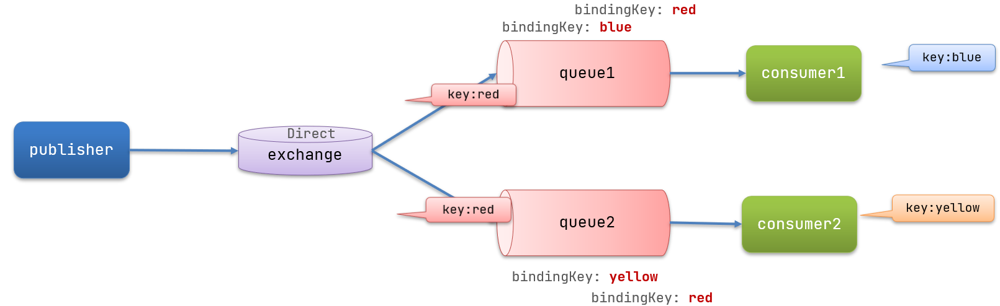

## RabbitMQ

> MQ，中文是消息队列（MessageQueue），字面来看就是存放消息的队列。也就是事件驱动架构中的Broker。
>
> 比较常见的MQ实现：RabbitMQ、RocketMQ、Kafka


### 同步和异步通讯

- 同步通讯：
  - 优点：
    - 时效性强，可以立即得到结果
  - 缺点：
    - 耦合度高：每次加入新的需求都要修改原来的代码
    - 性能下降：调用者需要等待服务提供者响应，等于所有调用服务的响应时间之和
    - 资源浪费：调用链中的每个服务在等待响应的过程中，不能释放请求占用的资源
    - 级联失败：如果服务提供者出现问题，所有调用方都会出现问题，导致整个微服务群故障
- 异步通讯：
  - 优点：
    - **吞吐量提升**：无需等待订阅者处理完成，响应更快
    - 故障隔离：服务没有直接调用，不存在级联问题
    - 调用间没有阻塞，不会造成无效的资源占用
    - **耦合度极低**：每个服务都可以灵活插拔
    - **流量削峰**：不管发布事件的流量波动多大，都由Broker接收，订阅者可以按照自己的速度处理事件
  - 缺点：
    - 架构复杂的情况下，业务没有明显的流程线，不好管理
    - 依赖于Broker的可靠性


### RabbitMQ部署

```shell
# 拉取镜像
docker pull rabbitmq:3-management

# 部署
docker run \
 -e RABBITMQ_DEFAULT_USER=root \
 -e RABBITMQ_DEFAULT_PASS=root \
 -v mq-plugins:/plugins \
 --name mq \
 --hostname mq \
 -p 15672:15672 \
 -p 5672:5672 \
 -d \
 rabbitmq:3-management
```


### RabbitMQ消息模型

> 官方地址：https://www.rabbitmq.com/getstarted.html
>
> - publisher：消息发布者，将消息发送到队列queue
> - queue：消息队列，负责接受并缓存消息
> - consumer：订阅队列，处理队列中的消息


- 消息模型：
  - **简单模型**
  - **工作队列模型**：Workqueues
  - **发布订阅模型**：Publish
  - **路由模型**：Routing
  - **主题模型**：Topics
  - RPC
  - Publisher Confirms


### 原生RabbitMQ实现（了解）

```java
package cn.itcast.mq.helloworld;

import com.rabbitmq.client.*;

import java.io.IOException;
import java.util.concurrent.TimeoutException;

public class ConsumerTest {

    public static void main(String[] args) throws IOException, TimeoutException {
        // 1.建立连接
        ConnectionFactory factory = new ConnectionFactory();
        // 1.1.设置连接参数，分别是：主机名、端口号、vhost、用户名、密码
        factory.setHost("192.168.65.182");
        factory.setPort(5672);
        factory.setVirtualHost("/");
        factory.setUsername("root");
        factory.setPassword("root");
        // 1.2.建立连接
        Connection connection = factory.newConnection();

        // 2.创建通道Channel
        Channel channel = connection.createChannel();

        // 3.创建队列
        String queueName = "simple.queue";
        channel.queueDeclare(queueName, false, false, false, null);

        // 4.订阅消息
        channel.basicConsume(queueName, true, new DefaultConsumer(channel){
            @Override
            public void handleDelivery(String consumerTag, Envelope envelope,
                                       AMQP.BasicProperties properties, byte[] body) throws IOException {
                // 5.处理消息
                String message = new String(body);
                System.out.println("接收到消息：【" + message + "】");
            }
        });
        System.out.println("等待接收消息。。。。");
    }
}
```

```java
package cn.itcast.mq.helloworld;

import com.rabbitmq.client.Channel;
import com.rabbitmq.client.Connection;
import com.rabbitmq.client.ConnectionFactory;
import org.junit.Test;

import java.io.IOException;
import java.util.concurrent.TimeoutException;

public class PublisherTest {
    @Test
    public void testSendMessage() throws IOException, TimeoutException {
        // 1.建立连接
        ConnectionFactory factory = new ConnectionFactory();
        // 1.1.设置连接参数，分别是：主机名、端口号、vhost、用户名、密码
        factory.setHost("192.168.65.182");
        factory.setPort(5672);
        factory.setVirtualHost("/");
        factory.setUsername("root");
        factory.setPassword("root");
        // 1.2.建立连接
        Connection connection = factory.newConnection();

        // 2.创建通道Channel
        Channel channel = connection.createChannel();

        // 3.创建队列
        String queueName = "simple.queue";
        channel.queueDeclare(queueName, false, false, false, null);

        // 4.发送消息
        String message = "hello, rabbitmq!";
        channel.basicPublish("", queueName, null, message.getBytes());
        System.out.println("发送消息成功：【" + message + "】");

        // 5.关闭通道和连接
        channel.close();
        connection.close();
    }
}
```


## SpringAMQP

> SpringAMQP是基于RabbitMQ封装的一套模板，并且还利用SpringBoot对其实现了自动装配。

### 相关配置

- 在父模块中导入依赖

  ```xml
  <!--AMQP依赖，包含RabbitMQ-->
  <dependency>
      <groupId>org.springframework.boot</groupId>
      <artifactId>spring-boot-starter-amqp</artifactId>
  </dependency>
  ```

- 在发布者和订阅者的application.yml中添加配置

  ```yml
  logging:
    pattern:
      dateformat: MM-dd HH:mm:ss:SSS
  
  spring:
    rabbitmq:
      host: 192.168.65.182
      port: 5672
      username: root
      password: root
      virtual-host: /
  ```


### 消息转换器

> Spring发送消息时，默认采用JDK序列化将信息发送给MQ，接收消息的时候，还会把字节反序列化为Java对象。
>
> 存在 数据体积过大、有安全漏洞、可读性差 的问题。

#### 解决方式-配置JSON转换器

- 在父模块中导入依赖

  ```xml
  <dependency>
      <groupId>com.fasterxml.jackson.dataformat</groupId>
      <artifactId>jackson-dataformat-xml</artifactId>
      <version>2.9.10</version>
  </dependency>
    <dependency>
              <groupId>com.fasterxml.jackson.core</groupId>
              <artifactId>jackson-databind</artifactId>
              <version>2.9.10.5</version>
  </dependency>
  ```

- 在发布者和订阅者的启动类中都添加以下Bean

  ```java
  //配置消息转换器
  @Bean
  public MessageConverter jsonMessageConverter(){
      return new Jackson2JsonMessageConverter();
  }
  ```


### 简单模型

- 消息队列

  ```java
  @Configuration
  @Slf4j
  public class RabbitConfig {
  
      //=========简单模型=========
      //声明一个队列，名字为simple.queue
      @Bean
      public Queue simpleQueue() {
          return new Queue("simple.queue");
      }
  ```

- 监听器

  ```java
  package cn.itcast.mq.listener;
  
  import lombok.extern.slf4j.Slf4j;
  import org.springframework.amqp.rabbit.annotation.RabbitListener;
  import org.springframework.stereotype.Component;
  
  @Component
  @Slf4j
  public class SimpleQueueListener {
      /**
       * 这个方法是一个回调方法，只要队列列队里面有消息，就会调用该方法
       * 并且把队列的消息的内容传递给方法的形参message
       */
      //=========简单模型=========
      @RabbitListener(queues = "simple.queue")
      public void listener(String message) {
          log.info("simple.listener消费消息：" + message);
      }
  }
  ```

- 消息发布

  ```java
  package cn.itcast.mq;
  
  import org.junit.jupiter.api.Test;
  import org.springframework.amqp.rabbit.core.RabbitTemplate;
  import org.springframework.beans.factory.annotation.Autowired;
  import org.springframework.boot.test.context.SpringBootTest;
  
  @SpringBootTest
  public class SimpleQueueSend {
  
      //使用springAMQP一定要创建核心类
      @Autowired
      private RabbitTemplate rabbitTemplate;
  
      @Test
      public void sendMessage(){
          String message = "简单模型生产的消息";
          String queueName = "simple.queue";
  
          rabbitTemplate.convertAndSend(queueName,message);
      }
  }
  ```


### 队列模型

> 多个消费者绑定到一个队列，同一条消息只会被一个消费者处理


- 消息队列

  ```java
      //=========队列模型=========
      @Bean
      public Queue workQueue() {
          return new Queue("work.queue");
      }
  ```

- 监听器

  ```java
  package cn.itcast.mq.listener;
  
  import lombok.extern.slf4j.Slf4j;
  import org.springframework.amqp.rabbit.annotation.RabbitListener;
  import org.springframework.stereotype.Component;
  
  @Component
  @Slf4j
  public class WorkQueueListener {
  
      //=========队列模型=========
      @RabbitListener(queues = "work.queue")
      public void listener1(String message) throws InterruptedException {
          log.info("work.listener1消费的消息：" + message);
          Thread.sleep(500);
      }
  
      @RabbitListener(queues = "work.queue")
      public void listener2(String message){
          log.info("work.listener2消费的消息：" + message);
      }
  }
  ```

- 消息发布

  ```java
  package cn.itcast.mq;
  
  import org.junit.jupiter.api.Test;
  import org.springframework.amqp.rabbit.core.RabbitTemplate;
  import org.springframework.beans.factory.annotation.Autowired;
  import org.springframework.boot.test.context.SpringBootTest;
  
  @SpringBootTest
  public class WorkQueueSend {
  
      //使用springAMQP一定要创建核心类
      @Autowired
      private RabbitTemplate rabbitTemplate;
  
      @Test
      public void sendMessage() {
          String message = "队列模型生产的消息";
          String queueName = "work.queue";
  
          for (int i = 1; i <= 10; i++) {
              rabbitTemplate.convertAndSend(queueName, i + ":" + message);
          }
      }
  }
  ```

- 能者多劳

  ```yml
  # 默认是轮询消费消息队列
  spring:
    rabbitmq:
      listener:
        simple:
          prefetch: 1 # 每次只能获取一条消息，处理完成才能获取下一个消息
  ```


### 发布订阅模型

> Exchange（交换机）：只负责转发消息，不具备存储消息的能力。
>
> 交换机类型：
>
> - Fanout：广播，将消息交给所有绑定到交换机的队列
> - Direct：定向，把消息交给符合指定routing key 的队列
> - Topic：通配符，把消息交给符合routing pattern（路由模式） 的队列


- 消息队列

  ```java
      //=========发布订阅模型=========
  
      //定义一个广播交换机
      @Bean
      public FanoutExchange fanoutExchange() {
          return new FanoutExchange("fanout.exchange");
      }
  
      //定义两个队列
      @Bean
      public Queue fanoutQueue1() {
          return new Queue("fanout.queue1");
      }
  
      @Bean
      public Queue fanoutQueue2() {
          return new Queue("fanout.queue2");
      }
  
      //把队列绑定到交换机上
      @Bean
      public Binding bindingQueue1(FanoutExchange fanoutExchange, Queue fanoutQueue1) {
          return BindingBuilder.bind(fanoutQueue1).to(fanoutExchange);
      }
  
      @Bean
      public Binding bindingQueue2(FanoutExchange fanoutExchange, Queue fanoutQueue2) {
          return BindingBuilder.bind(fanoutQueue2).to(fanoutExchange);
      }
  ```

- 监听器

  ```java
  package cn.itcast.mq.listener;
  
  import lombok.extern.slf4j.Slf4j;
  import org.springframework.amqp.rabbit.annotation.RabbitListener;
  import org.springframework.stereotype.Component;
  
  @Component
  @Slf4j
  public class FanoutQueueListener {
  
      //=========发布订阅模型=========
      @RabbitListener(queues = "fanout.queue1")
      public void listener1(String message){
          log.info("fanout.listener1消费的消息：" + message);
      }
  
      @RabbitListener(queues = "fanout.queue2")
      public void listener2(String message){
          log.info("fanout.listener2消费的消息：" + message);
      }
  }
  ```

- 消息发布

  ```java
  package cn.itcast.mq;
  
  import org.junit.jupiter.api.Test;
  import org.springframework.amqp.rabbit.core.RabbitTemplate;
  import org.springframework.beans.factory.annotation.Autowired;
  import org.springframework.boot.test.context.SpringBootTest;
  
  @SpringBootTest
  public class FanoutQueueSend {
  
      //使用springAMQP一定要创建核心类
      @Autowired
      private RabbitTemplate rabbitTemplate;
  
      @Test
      public void sendMessage() {
          String message = "发布订阅模型生产的消息";
          String exchangeName = "fanout.exchange";
  
          //参数一：交换机 参数二：路由key , 参数三：消息
          rabbitTemplate.convertAndSend(exchangeName, "", message);
      }
  }
  ```


### 路由模型

> Direct：定向，把消息交给符合指定routing key 的队列



- 消息队列

  ```java
      //=========路由模型=========
      //方式一：@Bean实现
      //定义一个路由交换机
      /*@Bean
      public DirectExchange directExchange(){
          return new DirectExchange("direct.exchange");
      }
  
      //定义两个队列
      @Bean
      public Queue directQueue1(){
          return new Queue("direct.queue1");
      }
      @Bean
      public Queue directQueue2(){
          return new Queue("direct.queue2");
      }
  
      //把队列绑定到交换机上
      @Bean
      public Binding bindingQueue3(DirectExchange directExchange, Queue directQueue1){
          return BindingBuilder.bind(directQueue1).to(directExchange).with("user");
      }
      @Bean
      public Binding bindingQueue4(DirectExchange directExchange, Queue directQueue2){
          return BindingBuilder.bind(directQueue2).to(directExchange).with("order");
      }*/
  
      //方式二：@RabbitListener注解实现
      /**
       * QueueBinding注解的作用：
       * 1. 在运行的时候如果发现rabbitmq里面没有对应的交换机、队列，就会马上创建交换机与队列
       * 2. 如果Rabbitmq中一旦存在对应交换机与队列，那么就只有监听队列的作用。
       */
      @RabbitListener(bindings = {
              @QueueBinding(
                      //定义交换机
                      exchange = @Exchange(name = "direct.exchange", type = ExchangeTypes.DIRECT),
                      //定义队列
                      value = @org.springframework.amqp.rabbit.annotation.Queue("direct.queue1"),
                      //路由key
                      key = "user"
              )
      })
      public void directListener1(String message) {
          log.info("direct.listener1消费的消息：" + message);
      }
  
      @RabbitListener(bindings = {
              @QueueBinding(
                      //定义交换机
                      exchange = @Exchange(name = "direct.exchange", type = ExchangeTypes.DIRECT),
                      //定义队列
                      value = @org.springframework.amqp.rabbit.annotation.Queue("direct.queue2"),
                      //路由key
                      key = "order"
              )
      })
      public void directListener2(String message) {
          log.info("direct.listener2消费的消息：" + message);
      }
  ```

- 监听器

  ```java
  package cn.itcast.mq.listener;
  
  import lombok.extern.slf4j.Slf4j;
  import org.springframework.amqp.rabbit.annotation.RabbitListener;
  import org.springframework.stereotype.Component;
  
  @Component
  @Slf4j
  public class DirectQueueListener {
  
      //=========路由模型=========
      //方式一：@Bean实现的情况下才需要单独写listener
      //方式二：@RabbitListener注解实现不需要单独写
  /*    @RabbitListener(queues = "direct.queue1")
      public void listener1(String message){
          log.info("direct.listener1消费的消息：" + message);
      }
  
      @RabbitListener(queues = "direct.queue2")
      public void listener2(String message){
          log.info("direct.listener2消费的消息：" + message);
      }*/
  }
  ```

- 消息发布

  ```java
  package cn.itcast.mq;
  
  import org.junit.jupiter.api.Test;
  import org.springframework.amqp.rabbit.core.RabbitTemplate;
  import org.springframework.beans.factory.annotation.Autowired;
  import org.springframework.boot.test.context.SpringBootTest;
  
  @SpringBootTest
  public class DirectQueueSend {
  
      //使用springAMQP一定要创建核心类
      @Autowired
      private RabbitTemplate rabbitTemplate;
  
      @Test
      public void sendMessage() {
          String message = "路由模型生产的user消息";
          String exchangeName = "direct.exchange";
          String routingKey = "user";
  
          //参数一：交换机 参数二：路由key , 参数三：消息
          rabbitTemplate.convertAndSend(exchangeName, routingKey, message);
      }
  }
  ```


### 主题模型


`Routingkey` 一般都是有一个或多个单词组成，多个单词之间以”.”分割，例如： `item.insert`

 通配符规则：

`#`：匹配一个或多个词

`*`：匹配不多不少恰好1个词

举例：

`item.#`：能够匹配`item.spu.insert` 或者 `item.spu`

`item.*`：只能匹配`item.spu`


- 消息队列

  ```java
      //=========主题模型=========
      @RabbitListener(bindings = {
              @QueueBinding(
                      //定义交换机
                      exchange = @Exchange(name = "topic.exchange", type = ExchangeTypes.TOPIC),
                      //定义队列
                      value = @org.springframework.amqp.rabbit.annotation.Queue("topic.queue1"),
                      //路由key
                      key = "work.#"
              )
      })
      public void topicListener1(String message) {
          log.info("topic.listener1消费的消息：" + message);
      }
  
      @RabbitListener(bindings = {
              @QueueBinding(
                      //定义交换机
                      exchange = @Exchange(name = "topic.exchange",type = ExchangeTypes.TOPIC),
                      //定义队列
                      value = @org.springframework.amqp.rabbit.annotation.Queue("topic.queue2"),
                      key = "work.*"
              )
      })
      public void topicListener2(String message){
          log.info("topic.listener2消费的消息：" + message);
      }
  }
  ```

- 消息发布

  ```java
  package cn.itcast.mq;
  
  import org.junit.jupiter.api.Test;
  import org.springframework.amqp.rabbit.core.RabbitTemplate;
  import org.springframework.beans.factory.annotation.Autowired;
  import org.springframework.boot.test.context.SpringBootTest;
  
  @SpringBootTest
  public class TopicQueueSend {
  
      //使用springAMQP一定要创建核心类
      @Autowired
      private RabbitTemplate rabbitTemplate;
  
      @Test
      public void sendMessage() {
          String message = "主题模型生产的消息";
          String exchangeName = "topic.exchange";
          String routingKey = "work.SZ.top100";
  
          //参数一：交换机 参数二：路由key , 参数三：消息
          rabbitTemplate.convertAndSend(exchangeName, routingKey, message);
      }
  }
  ```

