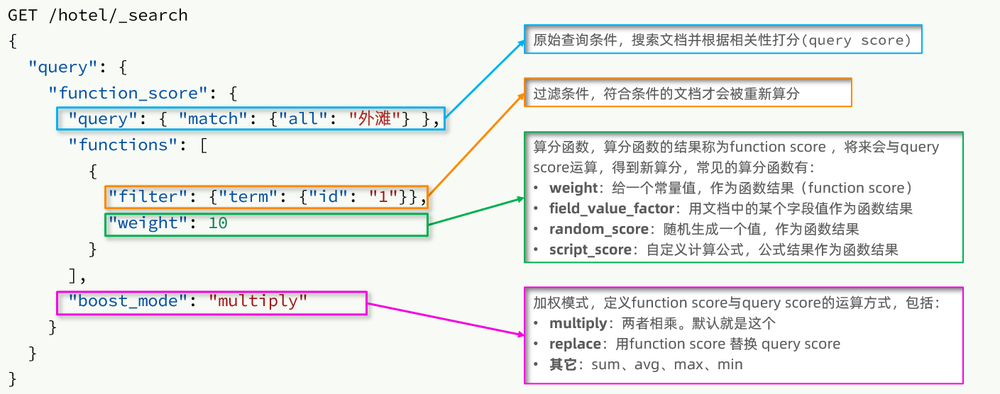

## ElasticSearch

### ElasticSeach概念

> 关系型数据库提供的查询功能太弱。比如：使用模糊查询，左边有通配符，不会走索引，会全表扫描，性能低
>
> ElasticSearch是Java语言开发的，并作为Apache许可条款下的开放源码发布，基于Lucene实现，是一款分布式、高扩展、近实时的搜索服务，可以基于RESTful web接口进行操作。官网：https://www.elastic.co/
>
> - Elasticsearch是面向文档(Document)的分布式搜索引擎
>
> - Kibana是一个与Elasticsearch协同工作的开源分析和可视化平台

- 基于Lucene的产品：
  - Slor：实时性偏弱，在高并发地写入数据时，Slor需要频繁地构建索引库，而索引库构建影响到查询性能
  - Elasticsearch：实时性非常强（近实时），ES在频繁地构建索引库的同时，不太影响查询的性能

- **倒排索引**
  - 首先对所有数据内容进行首先对所有数据的内容进行拆分（分词），拆分成唯一的一个个词语（词条Term）
  - 然后建立词条和每条数据的对应关系（词条在文档出现的位置、频率）
- 应用场景
  - 海量数据的查询
  - 日志数据分析
  - 实时数据分析


#### ElasticSearch与MySQL对比

- 基本概念

  | MySQL  | Elasticsearch | 说明                                                         |
  | ------ | ------------- | ------------------------------------------------------------ |
  | Table  | Index         | 索引(index)，就是文档的集合，类似数据库的表(table)           |
  | Row    | Document      | 文档（Document），就是一条条的数据，类似数据库中的行（Row），文档都是JSON格式 |
  | Cloumn | Feild         | 字段（Field），就是JSON文档中的字段，类似数据库中的列（Column） |
  | Schema | Mapping       | Mapping（映射）是索引中文档的约束，例如字段类型约束。类似数据库的表结构（Schema） |
  | SQL    | DSL           | 语句                                                         |

- Mysql：擅长事务类型操作，可以确保数据的安全和一致性，进行复杂的多表查询
- Elasticsearch：擅长海量数据的搜索、分析、计算


### 安装ElasticSearch

- Docker创建ElasticSearch

  ```shell
  docker run -id --name elasticsearch -d -p 9200:9200 -v /usr/share/elasticsearch/plugins:/usr/share/elasticsearch/plugins -e "discovery.type=single-node" elasticsearch:7.4.0
  ```

- Docker创建Kibana

  ```shell
  docker run -d -p 5601:5601 --link elasticsearch --name=kibana -e "ELASTICSEARCH_URL=http://宿主机地址:9200" kibana:7.4.0
  ```


### DSL操作ES

- 客户端使用GET、POST、PUT、DELETE 4个表示操作方式的动词对服务端资源进行操作：
  - GET：用来获取资源
  - POST：用来新建资源（也可以用于更新资源）
  - PUT：用来新建资源（修改）
  - DELETE：用来删除资源


#### 操作索引库

```shell
#=============操作索引库==============
# 添加索引库
PUT test

# 查询索引库
GET test

# 删除索引库
DELETE test

# 关闭索引库(当索引进入关闭状态，是不能添加文档的)
POST test/_close

# 打开索引库
POST test/_open
```


#### 操作映射

```shell
#=============操作映射==============
# 创建索引库并添加映射
PUT person
{
  "mappings": {
    "properties": {
      "name":{
        "type": "text"
      },
      "age":{
        "type": "integer"
      }
    }
  }
}

# 查询映射
GET person/_mapping

# 注意：ES不能单独修改映射字段名称或类型，不能单独删除某个字段，如果需要修改，直接删除整个索引库再重建

# 添加映射
PUT person/_mapping
{
  "properties":{
    "sex":{
      "type":"keyword"
    }
  }
}
```

ES的数据类型

- 简单数据类型
  - 字符串：
    - text：可以分词，不支持聚合（统计）
    - keyword：不会分词，将全部内容作为一个词条，支持聚合（统计）
  - 数值：long、integer、short、byte、double、float、half_float、scaled_float
  - 布尔boolean
  - 二进制binary
  - 范围类型：integer_range, float_range, long_range, double_range, date_range
  - 日期date
- 复杂数据类型
  - 数组 []：没有专用的array数据类型，任何一个字段的值，都可以被添加0个到多个，但要求他们的类型必须一致，当类型一直含有多个值存储到ES中会自动转化成数组类型 
  - 对象 {} 
- GEO：geo_point经纬度


#### 操作文档

```shell
#=============操作文档==============
# 添加文档，指定id
POST person/_doc/1
{
  "name":"张三",
  "age":18,
  "sex":"男"
}

# 添加文档，不指定id
POST person/_doc
{
  "name":"李四",
  "age":19,
  "sex":"女"
}

# 查询文档，id为1
GET person/_doc/1

# 查询全部，不指定id
GET person/_search

# 修改文档（覆盖）
POST person/_doc/1
{
  "name":"张三",
  "age":23,
  "sex":"男"
}

# 查询张三
GET person/_search
{
  "query": {
    "term": {
      "name": {
        "value": "张三"
      }
    }
  }
}

# 根据id删除文档
DELETE person/_doc/1
```


#### 分词器

> 分词器（Analyzer）是将一段文本，按照一定逻辑，拆分成多个词语的一种工具

-  Standard Analyzer - 默认分词器，按词/字切分，小写处理
-  Simple Analyzer - 按照非字母切分(符号被过滤)，小写处理
-  Stop Analyzer - 小写处理，停用词过滤(the,a,is)
-  Whitespace Analyzer - 按照空格切分，不转小写
-  Keyword Analyzer - 不分词，直接将输入当作输出
-  Patter Analyzer - 正则表达式，默认\W+(非字符分割) （中文会被去掉）
-  Language - 提供了30多种常见语言的分词器

```shell
#=============分词器==============
# 分词效果
GET _analyze
{
  "text":"默认分词器"
  , "analyzer": "standard"
}

# ik分词器，最细粒度分词
GET _analyze
{
  "text": "下个武器池我要抽到护摩之杖",
  "analyzer": "ik_max_word"
}

# 使用分词器创建索引库
PUT person
{
  "mappings": {
    "properties": {
      "name":{
        "type": "text",
        "analyzer": "ik_smart"
      },
      "age":{
        "type": "integer"
      },
      "sex":{
        "type": "keyword"
      }
    }
  }
}
```


#### IK分词器

> IKAnalyzer是一个开源的，基于java语言开发的轻量级的中文分词工具包，并且支持用户词典扩展定义。下载地址：https://github.com/medcl/elasticsearch-analysis-ik/releases
>
> 分词算法：
>
> - ik_smart：最小分词法
> - ik_max_word：最细分词法


**安装IK分词器**

- 将解压后的文件夹放入`/usr/share/elasticsearch/plugins`
- 重启ES


**扩展&停止词典**

> ==注意：当前文件的编码必须是UTF-8 with BOM格式，严禁使用Windows记事本编辑==

- 修改analysis-ik/config/IKAnalyzer.cfg.xml配置

  ```xml
  <?xml version="1.0" encoding="UTF-8"?>
  <!DOCTYPE properties SYSTEM "http://java.sun.com/dtd/properties.dtd">
  <properties>
  	<comment>IK Analyzer 扩展配置</comment>
  	<!--用户可以在这里配置自己的扩展字典 -->
  	<entry key="ext_dict">ext.dic</entry>
  	 <!--用户可以在这里配置自己的扩展停止词字典-->
  	<entry key="ext_stopwords">stop.dic</entry>
  	<!--用户可以在这里配置远程扩展字典 -->
  	<!-- <entry key="remote_ext_dict">words_location</entry> -->
  	<!--用户可以在这里配置远程扩展停止词字典-->
  	<!-- <entry key="remote_ext_stopwords">words_location</entry> -->
  </properties>
  ```

- 在ext.dic文件中添加扩展词典，在stop.dic文件中添加停止词典

- 重启ES


### HighLevelAPI-SpringBoot

> ES官方提供了各种不同语言的客户端，用来操作ES。这些客户端的本质就是组装DSL语句，通过http请求发送给ES。官方文档地址：https://www.elastic.co/guide/en/elasticsearch/client/index.html
>
> 其中的Java Rest Client又包括两种：
>
> - Java Low Level Rest Client
> - Java High Level Rest Client


#### 整合HighLevelAPI

- 导入依赖

  ```xml
  <!-- 导入elasticsearch的RestAPI依赖 -->
  <dependency>
      <groupId>org.elasticsearch.client</groupId>
      <artifactId>elasticsearch-rest-high-level-client</artifactId>
  </dependency>
  ```

- 配置application.yml

  ```yml
  spring:
    elasticsearch:
      rest:
        uris:
          - http://192.168.65.182:9200
  ```

- 编写测试类

  ```java
  @SpringBootTest
  @Slf4j
  public class IndexTest {
  
      @Autowired(required = false)
      private HotelMapper hotelMapper;
  
      // 操作es索引库的核心类
      @Autowired
      private RestHighLevelClient highLevelClient;
  
      //测试java代码是否与es索引库建立链接
      @Test
      public void testConnection(){
          System.out.println("链接对象："+ highLevelClient);
      }
  }
  ```


#### 创建&删除索引

```java
	/**
     * 创建索引库
     */
    @Test
    public void CreatIndex() throws IOException {
        //凡是对索引库的增删改都需要创建indicesClient对象
        //1.创建indicesClient操作索引库的客户端对象
        IndicesClient indicesClient = highLevelClient.indices();

        //2.创建一个创建索引库的请求
        CreateIndexRequest createIndexRequest = new CreateIndexRequest("hotel");

        //3.使用索引库的客户端对象发出创建请求
        CreateIndexResponse response = indicesClient.create(createIndexRequest, RequestOptions.DEFAULT);

        log.info("创建成功吗？" + response.isAcknowledged());
    }

	/**
     * 删除索引库
     */
    @Test
    public void deleteIndex() throws IOException {
        //1.获取索引库的客户端对象
        IndicesClient indicesClient = highLevelClient.indices();
        //2.创建删除请求
        DeleteIndexRequest deleteIndexRequest = new DeleteIndexRequest("hotel");
        //3.发出请求
        AcknowledgedResponse response = indicesClient.delete(deleteIndexRequest, RequestOptions.DEFAULT);
        log.info("删除成功了吗？" + response.isAcknowledged());
    }
```


#### 创建索引并添加映射

```java
// index属性：是否建立索引，默认值true，如果该字段不用查询，则设置false
// copy_to: 把指定字段的值拷贝到另一个字段上，后续查询即可选择此字段进行查询

	/**
     * 创建索引并添加映射
     */
    @Test
    public void creatIndexWithMapping() throws IOException {
        //1.创建操作索引库的客户端对象
        IndicesClient indicesClient = highLevelClient.indices();

        //2.创建一个创建索引库的请求
        CreateIndexRequest createIndexRequest = new CreateIndexRequest("hotel");
        String json = "{\n" +
                "    \"properties\": {\n" +
                "      \"id\":{\n" +
                "        \"type\": \"keyword\"\n" +
                "      },\n" +
                "      \"name\":{\n" +
                "        \"type\": \"text\",\n" +
                "        \"analyzer\": \"ik_smart\",\n" +
                "        \"copy_to\": \"all\"\n" +
                "      },\n" +
                "      \"address\":{\n" +
                "        \"type\": \"text\",\n" +
                "        \"analyzer\": \"ik_smart\"\n" +
                "      },\n" +
                "      \"price\":{\n" +
                "        \"type\": \"double\"\n" +
                "      },\n" +
                "      \"score\":{\n" +
                "        \"type\": \"double\"\n" +
                "      },\n" +
                "      \"brand\":{\n" +
                "        \"type\": \"keyword\",\n" +
                "        \"copy_to\": \"all\"\n" +
                "      },\n" +
                "      \"city\":{\n" +
                "        \"type\": \"keyword\"\n" +
                "      },\n" +
                "      \"starName\":{\n" +
                "        \"type\": \"keyword\"\n" +
                "      },\n" +
                "      \"business\":{\n" +
                "        \"type\": \"keyword\",\n" +
                "        \"copy_to\": \"all\"\n" +
                "      },\n" +
                "      \"location\":{\n" +
                "        \"type\": \"geo_point\"\n" +
                "      },\n" +
                "      \"pic\":{\n" +
                "        \"type\": \"keyword\",\n" +
                "        \"index\": false\n" +
                "      },\n" +
                "      \"isAD\":{\n" +
                "        \"type\": \"boolean\"\n" +
                "      },\n" +
                "      \"all\":{\n" +
                "        \"type\": \"text\",\n" +
                "        \"analyzer\": \"ik_smart\"\n" +
                "      }\n" +
                "    }\n" +
                "  }";
        createIndexRequest.mapping(json, XContentType.JSON);

        //3.发出创建的请求，得到响应
        // 参数一： 创建的请求对象， 参数二：创建索引库参数，我们都使用默认即可
        CreateIndexResponse response = indicesClient.create(createIndexRequest, RequestOptions.DEFAULT);

        //4. 查看响应状态
        log.info("创建成功了吗？" + response.isAcknowledged());
    }
```


#### 增删查改文档

```java
    /**
     * 添加文档
     */
    @Test
    public void addDoc() throws IOException {
        //根据id查询数据库内容
        Hotel hotel = hotelMapper.selectById(36934);
        //转换为Doc的对象
        HotelDoc hotelDoc = new HotelDoc(hotel);
        //创建请求对象
        //设置添加数据POST hotel/_doc/{id}中的id
        IndexRequest request = new IndexRequest("hotel").id(hotelDoc.getId().toString());
        //将对象转换为json，添加到请求中
        String json = JSON.toJSONString(hotelDoc);
        request.source(json, XContentType.JSON);
        //执行请求
        IndexResponse response = highLevelClient.index(request, RequestOptions.DEFAULT);
        //查看响应结果
        log.info(response.getId());
    }

    /**
     * 修改文档
     */
    @Test
    public void updateDoc() throws IOException {
        //1.根据id查询mysql数据，查找到酒店Hotel
        Hotel hotel = hotelMapper.selectById(36934);
        //2.先把Hotel转换为HotelDoc，然后把HotelDoc转换为json
        HotelDoc hotelDoc = new HotelDoc(hotel);
        hotelDoc.setPrice(100);
        String json = JSON.toJSONString(hotelDoc);
        //3.创建一个文档请求对象
        IndexRequest request = new IndexRequest("hotel").id(hotelDoc.getId().toString());
        request.source(json, XContentType.JSON);
        //4.发出文档请求对象
        IndexResponse response = highLevelClient.index(request, RequestOptions.DEFAULT);
        //5. 查看响应结果
        log.info("添加成功的酒店id：" + response.getId());
    }

    /**
     * 查询文档
     */
    @Test
    public void findDoc() throws IOException {
        Long id = 36934L;
        //1.创建请求
        GetRequest request = new GetRequest("hotel").id(id.toString());
        //2.执行请求
        GetResponse response = highLevelClient.get(request, RequestOptions.DEFAULT);
        //3.取出结果
        String hotelDocStr = response.getSourceAsString();
        HotelDoc hotelDoc = JSON.parseObject(hotelDocStr, HotelDoc.class);
        log.info(String.valueOf(hotelDoc));
    }

    /**
     * 删除文档
     */
    @Test
    public void deleteDoc() throws IOException {
        //1.创建一个删除请求，设置操作的索引库和id
        DeleteRequest request = new DeleteRequest("hotel").id("36934");
        //2.发出请求
        DeleteResponse response = highLevelClient.delete(request, RequestOptions.DEFAULT);
        log.info("删除的文档是：" + response.getId());
    }
```


#### 批量添加

> Bulk 批量操作是将文档的增删改查一些列操作，通过一次请求全都做完。减少网络传输次数。

```java
    /**
     * 批量添加
     */
    @Test
    public void batchAdd() throws IOException {
        //1.查询所有的酒店
        List<Hotel> hotelList = hotelMapper.selectList(null);
        //2.创建一个批量请求的对象
        BulkRequest bulkRequest = new BulkRequest();
        //3.遍历所有的酒店，每一个hotel都转化为HotelDoc，并且转换json，创建 单个请求对象，并且设置请求参数
        for (Hotel hotel : hotelList) {
            //每一个hotel都转化为HotelDoc，并且转换json
            HotelDoc hotelDoc = new HotelDoc(hotel);
            String json = JSON.toJSONString(hotelDoc);
            //创建 单个请求对象，并且设置请求参数
            IndexRequest indexRequest = new IndexRequest("hotel");
            indexRequest.id(hotelDoc.getId().toString());
            indexRequest.source(json, XContentType.JSON);
            //4. 把单个请求对象添加到批量请求对象里面
            bulkRequest.add(indexRequest);
        }
        //5. 发送批量请求
        BulkResponse responses = highLevelClient.bulk(bulkRequest, RequestOptions.DEFAULT);
        log.info("添加成功了吗？" + responses.status());
    }
```


### ElasticSearch高级搜索-常用搜索

#### 常见查询类型

- **查询所有**：查询出所有数据
  - **match_all**
- **全文检索查询**：利用分词器对用户输入内容分词，然后去索引库中匹配。比如：输入框搜索
  - **match_query**：单字段查询
  - **multi_match_query**：多字段查询
- **精确查询**：根据精确词条查找数据，一般是keyword、数值、日期、boolean类型字段
  - **ids**
  - **term**：根据词条精确值查询
  - **range**：根据值的范围查询
- **地理查询**：干锅居经纬度查询
  - **geo_bounding_box**：矩形范围查询
  - **geo_distance**：附近查询
- **复合查询**：可以将上述查询条件组合起来合并查询
  - **bool**：布尔查询
    - **must**：必须匹配每个子查询，类似and，**参与算分**
    - **filter**：效果和must一样，不参与算分
    - **should**：选择性匹配子查询，类似or，**参与算分**
    - **must_not**：必须不匹配，类似not，不参与算分
  - **function_score**：算分查询


#### 全文检索查询

> - match_query：单字段查询
> - multi_match_query：多字段查询

- 因为是拿着词条去匹配，因此参与搜索的字段也必须是可分词的**text类型**的字段

- 搜索字段越多，对查询性能影响越大，因此建议采用copy_to，然后单字段查询的方式

  ```shell
  #搜索全部
  GET hotel/_search
  {
    "query": {
      "match_all": {}
    }
  }
  
  #match单字段查询
  #查询all字段中的如家酒店
  #如家酒店被分词：如家、酒店
  GET /hotel/_search
  {
    "query": {
      "match": {
        "all": "如家酒店"
      }
    },
    "size": 200
  }
  
  #搜索结果默认采用的or并集，不是and交集
  #默认显示的是20个数据
  GET hotel/_search
  {
    "query": {
      "match": {
        "name": {
          "query": "如家酒店",
          "operator": "or"
        }
      }
    },
    "size": 20
  }
  
  #multi_match多字段查询，不推荐使用多字段搜索，如果需要多字段搜索，建议使用all字段
  GET /hotel/_search
  {
    "query": {
      "multi_match": {
        "query": "如家酒店",
        "fields": ["name","brand"]
      }
    }
  }
  ```

  ```java
  @SpringBootTest
  @Slf4j
  public class SearchTest {
  
      @Autowired
      private RestHighLevelClient highLevelClient;
  
      /**
       * 定义一个方法处理搜索的响应结果
       */
      private void handlerResponse(SearchResponse response) {
          //获取查询结果
          SearchHits searchHits = response.getHits();
          //获取总记录数
          Long total = searchHits.getTotalHits().value;
          log.info("本次查询的总记录数：" + total);
          //获取本次搜索的结果列表
          SearchHit[] hits = searchHits.getHits();
          for (SearchHit hit : hits) {
              //得到酒店的json数据
              String hotelJson = hit.getSourceAsString();
              //将json对象转换为hotelDoc对象
              HotelDoc hotelDoc = JSON.parseObject(hotelJson, HotelDoc.class);
              //处理高亮显示结果
              HighlightField nameField = hit.getHighlightFields().get("name");
              if (nameField != null) {
                  hotelDoc.setName(nameField.getFragments()[0].toString());
              }
              HighlightField brandField = hit.getHighlightFields().get("brand");
              if (brandField != null) {
                  hotelDoc.setBrand(brandField.getFragments()[0].toString());
              }
              //获取距离
              Object[] sortValues = hit.getSortValues();
              if (sortValues != null && sortValues.length > 0) {
                  log.info(hotelDoc + "距离您：" + sortValues[0] + "公里");
              } else {
                  log.info(String.valueOf(hotelDoc));
              }
          }
      }
  
      /**
       * 搜索如家酒店
       */
      @Test
      public void searchHotel() throws IOException {
          //1.创建一个搜索的请求对象
          SearchRequest searchRequest = new SearchRequest("hotel");
          //2.设置搜索条件
          searchRequest.source().query(QueryBuilders.matchQuery("all", "如家酒店"));
          searchRequest.source().size(200);
          //3.发出搜索请求
          SearchResponse response = highLevelClient.search(searchRequest, RequestOptions.DEFAULT);
          //4.调用方法处理搜索的响应结果
          handlerResponse(response);
      }
  ```


#### 精确查询

> - term：根据词条精确值查询
> - range：根据值的范围查询

- 查询时，用户输入的内容跟值完全匹配时才认为符合条件。如果用户输入的内容过多，反而搜索不到数据

  ```shell
  # 搜索上海的所有酒店
  GET hotel/_search
  {
    "query": {
      "term": {
        "city": {
          "value": "上海"
        }
      }
    }
  }
  
  #搜索价格在100-200之间的酒店
  GET hotel/_search
  {
    "query": {
      "range": {
        "price": {
          "gte": 100,
          "lte": 200
        }
      }
    }
  }
  ```

  ```java
      /**
       * 查询价格在100-200的酒店
       */
      @Test
      public void searchHotel2() throws IOException {
          //创建一个搜索的请求对象
          SearchRequest searchRequest = new SearchRequest("hotel");
          //设置搜索条件
          searchRequest.source().query(QueryBuilders.rangeQuery("price").gte(100).lte(200));
          //发出请求
          SearchResponse response = highLevelClient.search(searchRequest, RequestOptions.DEFAULT);
          //处理响应结果
          handlerResponse(response);
      }
  ```


#### 地理坐标查询

> - geo_bounding_box：矩形范围查询，需要指定矩形的**左上**、**右下**两个点的坐标
> - geo_distance：附近查询，查询到指定中心点小于某个距离值的所有文档

- 常用的是附近查询

  ```shell
  #附近查询，也叫距离查询
  GET hotel/_search
  {
    "query": {
      "geo_distance": {
        "distance": "5km",
        "location": "31.21,121.5"
      }
    }
  }
  #lat:纬度，lon:经度
  GET hotel/_search
  {
    "query": {
      "geo_distance": {
        "distance": "5km",
        "location": {
          "lat": 31.21,
          "lon": 121.5
        }
      }
    }
  }
  ```


#### 复合查询-布尔查询（多重查询）

> 比如在搜索酒店时，除了关键字搜索外，我们还可能根据品牌、价格、城市等字段做过滤

- 每一个不同的字段，其查询的条件、方式都不一样，必须是多个不同的查询，而要组合这些查询，就必须用bool查询了

- 参与**打分的字段越多，查询的性能也越差**。因此这种多条件查询时，建议：

  - 搜索框的关键字搜索，是全文检索查询，使用must查询，参与算分
  - 其它过滤条件，采用filter查询。不参与算分

  ```shell
  #复合查询（布尔查询）
  # 查询必须是上海的酒店，并且价格不超过400块
  # 并且以我为圆心搜索10KM范围之内的
  GET /hotel/_search
  {
    "query": {
      "bool": {
        "must": [
          {
            "term": {
              "name": {
                "value": "如家"
              }
            }
          }
        ],
        "must_not": [
          {
            "range": {
              "price": {
                "gt": 400
              }
            }
          }
        ],
        "filter": {
          "geo_distance": {
            "distance": "10km",
            "location": "31.21,121.5"
          }
        }
      }
    },
    "size": 200
  }
  ```

  ```java
      /**
       * 搜索名字包含“如家”，价格不高于400，在坐标31.21,121.5周围10km范围内的酒店
       */
      @Test
      public void searchHotel3() throws IOException {
          //创建一个搜索请求
          SearchRequest searchRequest = new SearchRequest("hotel");
          //设置搜索请求
          BoolQueryBuilder boolQueryBuilder = new BoolQueryBuilder();
          boolQueryBuilder.must(QueryBuilders.termQuery("name", "如家"));
          boolQueryBuilder.mustNot(QueryBuilders.rangeQuery("price").gt(400));
          boolQueryBuilder.filter(QueryBuilders.
                  geoDistanceQuery("location").point(new GeoPoint("31.21,121.5")).distance("10", DistanceUnit.KILOMETERS));
          searchRequest.source().query(boolQueryBuilder);
          searchRequest.source().size(200);
          //发出请求
          SearchResponse response = highLevelClient.search(searchRequest, RequestOptions.DEFAULT);
          //处理响应结果
          handlerResponse(response);
      }
  ```


#### 复合查询-算分函数查询

> match查询时，文档结果会根据与搜索词条的关联度打分（_score），返回结果时按照分值降序排列

- Elasticsearch默认情况下使用BM25算法（5.1版本以前，使用TF-IDF算法）计算_score得到，按照得到倒序
  - TF-IDF算法：TF（词频）* IDF（逆文档频率）
    - TF：词条在文档中出现的频率
    - IDF：计算词条在所有文档中的权重（出现越多文档，权限越低，反之则越高）
  - BM25：是TF-IDF算法是升级版，单个词条的算分有一个上限，不至于过高，让曲线更加平滑

- function_score查询包含四部分内容：**原始查询条件、过滤条件、算分函数、加权模式**。运行流程如下：

  - 根据**原始条件**查询搜索文档，并且计算相关性算分，称为**原始算分**（query score）
  - 根据**过滤条件**，过滤文档
  - 符合**过滤条件**的文档，基于**算分函数**运算，得到**函数算分**（function score）
  - 将**原始算分**（query score）和**函数算分**（function score）基于**加权模式**做运算，得到最终结果，作为相关性算分

  

- 举例：

  ```shell
  #查询如家酒店，对于深圳的如家进行+10分
  GET hotel/_search
  {
    "query": {
      "function_score": {
        "query": {
          "match": {
            "name": "如家"
          }
        },
        "functions": [
          {
            "filter": {
              "term": {
                "city": "深圳"
              }
            },
            "weight": 10
          }
        ],
        "boost_mode": "sum"
      }
    },
    "size": 200
  }
  ```

  ```java
      /**
       * 查询如家酒店，对于深圳的如家进行+10分
       */
      @Test
      public void searcherHotel4() throws IOException {
          //创建搜索请求
          SearchRequest searchRequest = new SearchRequest("hotel");
          //设置请求
          //创建算分函数
          FunctionScoreQueryBuilder functionScoreQueryBuilder =
                  new FunctionScoreQueryBuilder(QueryBuilders.matchQuery("name", "如家"),
                          new FunctionScoreQueryBuilder.FilterFunctionBuilder[]{
                                  new FunctionScoreQueryBuilder.FilterFunctionBuilder(
                                          QueryBuilders.termQuery("city", "深圳"), ScoreFunctionBuilders.weightFactorFunction(10))
                          }).boostMode(CombineFunction.SUM);
          searchRequest.source().query(functionScoreQueryBuilder);
          searchRequest.source().size(200);
          //发出请求
          SearchResponse response = highLevelClient.search(searchRequest, RequestOptions.DEFAULT);
          //处理响应
          handlerResponse(response);
      }
  ```


### ElasticSearch高级搜索-搜索结果处理

#### 排序

> elasticsearch默认是根据相关度算分（_score）来排序，但是也支持自定义方式对搜索[结果排序](https://www.elastic.co/guide/en/elasticsearch/reference/current/sort-search-results.html)。可以排序字段类型有：keyword类型、数值类型、地理坐标类型、日期类型等
>
> 排序条件是一个数组，也就是可以写多个排序条件。按照声明的顺序，当第一个条件相等时，再按照第二个条件排序，以此类推


#### 分页

> elasticsearch中通过修改from、size参数来控制要返回的分页结果
>
> beginIndex = (当前页-1)*pageSize
>
> - from：从第几个文档开始，从0开始的
> - size：总共查询几个文档


- 普通字段排序（keyword、数值、日期类型）

  ```shell
  #按价格从低到高排序
  GET hotel/_search
  {
    "query": {
      "match": {
        "all": "如家"
      }
    },
    "sort": [
      {
        "price": {
          "order": "asc"
        }
      }
    ]
  }
  ```


- 根据距离升序排序

  ```shell
  #查找如家酒店，查找离我最近的如家酒店, 分页
  GET hotel/_search
  {
    "query": {
      "match": {
        "all": "如家"
      }
    },
    "sort": [
      {
        "_geo_distance": {
          "location": "31.034661,121.612282",
          "order": "asc",
          "unit": "km"
        }
      }
    ],
    "from": 0,
    "size": 5
  }
  ```

  ```java
      /**
       * 假设我的位置是：31.034661，121.612282，寻找我周围距离最近的酒店
       */
      @Test
      public void searcherHotel5() throws IOException {
          //创建搜索请求
          SearchRequest searchRequest = new SearchRequest("hotel");
          //设置搜索
          searchRequest.source().query(QueryBuilders.matchQuery("all", "如家"));
          //排序
          searchRequest.source().sort(SortBuilders.geoDistanceSort("location",
                  new GeoPoint("31.034661,121.612282")).unit(DistanceUnit.KILOMETERS).order(SortOrder.ASC));
          searchRequest.source().size(200);
          //分页
          searchRequest.source().from(0).size(5);
          //发出请求
          SearchResponse response = highLevelClient.search(searchRequest, RequestOptions.DEFAULT);
          //处理响应
          handlerResponse(response);
      }
  ```


#### 高亮显示

> 搜索匹配时，关键字会高亮显示

- 高亮是对关键字高亮，因此**搜索条件必须带有关键字**，而不能是范围这样的查询。
- 默认情况下，**高亮的字段，必须与搜索指定的字段一致**，否则无法高亮
- 如果要对非搜索字段高亮，则需要**添加一个属性**：required_field_match=false

- elasticsearch默认添加的是`<em>`标签

  ```shell
  #高亮显示
  GET /hotel/_search
  {
    "query": {
      "match": {
        "name": "如家"
      }
    },
    "highlight": {
      "require_field_match": "false",
      "fields": {  #指定要高亮的字段
        "name": {},
        "brand": {}
      },
      "pre_tags": "<font color='red'>",
      "post_tags": "</font>"
    },
    "size": 200
  }
  ```

  ```java
      /**
       * 高亮搜索
       */
      @Test
      public void searcherHotel6() throws IOException {
          //创建搜索请求
          SearchRequest searchRequest = new SearchRequest("hotel");
          //设置搜索条件
          searchRequest.source().query(QueryBuilders.matchQuery("name", "如家"));
          //高亮搜索
          HighlightBuilder highlightBuilder = new HighlightBuilder();
          highlightBuilder.requireFieldMatch(false).field("name").field("brand").preTags("<font color='red'>").postTags("</font>");
          searchRequest.source().highlighter(highlightBuilder);
          searchRequest.source().from(0).size(100);
          //发出请求
          SearchResponse response = highLevelClient.search(searchRequest, RequestOptions.DEFAULT);
          //处理响应
          handlerResponse(response);
      }
  ```


### 搜索实战-酒店搜索

- 实体类

  ```java
  package cn.itcast.hotel.pojo;
  
  import com.baomidou.mybatisplus.annotation.IdType;
  import com.baomidou.mybatisplus.annotation.TableField;
  import com.baomidou.mybatisplus.annotation.TableId;
  import com.baomidou.mybatisplus.annotation.TableName;
  import lombok.Data;
  
  @Data
  @TableName("tb_hotel")
  public class Hotel {
      @TableId(type = IdType.INPUT)
      private Long id;
      private String name;
      private String address;
      private Integer price;
      private Integer score;
      private String brand;
      private String city;
      private String starName;
      private String business;
      private String longitude;
      private String latitude;
      private String pic;
      @TableField("isAD")
      private Boolean isAD;
  }
  ```

  ```java
  package cn.itcast.hotel.pojo;
  
  import lombok.Data;
  import lombok.NoArgsConstructor;
  
  @Data
  @NoArgsConstructor
  public class HotelDoc {
  
      private Long id;
      private String name;
      private String address;
      private Integer price;
      private Integer score;
      private String brand;
      private String city;
      private String starName;
      private String business;
      private String pic;
      private String all;
  	private String location;
      private Boolean isAD;
      private Object distance;//距离值
  
      public HotelDoc(Hotel hotel) {
          this.id = hotel.getId();
          this.name = hotel.getName();
          this.address = hotel.getAddress();
          this.price = hotel.getPrice();
          this.score = hotel.getScore();
          this.brand = hotel.getBrand();
          this.city = hotel.getCity();
          this.starName = hotel.getStarName();
          this.business = hotel.getBusiness();
          this.pic = hotel.getPic();
          this.isAD = hotel.getIsAD();
  		this.location = hotel.getLatitude() + ", " + hotel.getLongitude();
  
      }
  }
  ```

  ```java
  package cn.itcast.hotel.pojo;
  
  import lombok.AllArgsConstructor;
  import lombok.Data;
  import lombok.NoArgsConstructor;
  
  import java.util.List;
  
  @Data
  @NoArgsConstructor
  @AllArgsConstructor
  public class PageResult {
      private Long total;
      private List<HotelDoc> list;
  }
  ```

  ```java
  package cn.itcast.hotel.pojo;
  
  import lombok.Data;
  
  @Data
  public class RequestParams {
      private String key;
      private Integer page;
      private Integer size;
      private String sortBy;
      // 下面是新增的过滤条件参数
      private String city;
      private String brand;
      private String starName;
      private Integer minPrice;
      private Integer maxPrice;
      // 我当前的地理坐标
      private String location;
  }
  ```


- HotelService

  ```java
  package cn.itcast.hotel.service.impl;
  
  import cn.itcast.hotel.mapper.HotelMapper;
  import cn.itcast.hotel.pojo.Hotel;
  import cn.itcast.hotel.pojo.HotelDoc;
  import cn.itcast.hotel.pojo.PageResult;
  import cn.itcast.hotel.pojo.RequestParams;
  import cn.itcast.hotel.service.IHotelService;
  import com.alibaba.fastjson.JSON;
  import com.baomidou.mybatisplus.extension.service.impl.ServiceImpl;
  import org.apache.commons.lang3.StringUtils;
  import org.elasticsearch.action.search.SearchRequest;
  import org.elasticsearch.action.search.SearchResponse;
  import org.elasticsearch.client.RequestOptions;
  import org.elasticsearch.client.RestHighLevelClient;
  import org.elasticsearch.common.geo.GeoPoint;
  import org.elasticsearch.common.lucene.search.function.CombineFunction;
  import org.elasticsearch.common.unit.DistanceUnit;
  import org.elasticsearch.index.query.BoolQueryBuilder;
  import org.elasticsearch.index.query.QueryBuilders;
  import org.elasticsearch.index.query.functionscore.FunctionScoreQueryBuilder;
  import org.elasticsearch.index.query.functionscore.ScoreFunctionBuilders;
  import org.elasticsearch.search.SearchHit;
  import org.elasticsearch.search.SearchHits;
  import org.elasticsearch.search.fetch.subphase.highlight.HighlightBuilder;
  import org.elasticsearch.search.fetch.subphase.highlight.HighlightField;
  import org.elasticsearch.search.sort.GeoDistanceSortBuilder;
  import org.elasticsearch.search.sort.SortBuilders;
  import org.elasticsearch.search.sort.SortOrder;
  import org.springframework.beans.factory.annotation.Autowired;
  import org.springframework.stereotype.Service;
  
  import java.io.IOException;
  import java.util.ArrayList;
  
  @Service
  public class HotelService extends ServiceImpl<HotelMapper, Hotel> implements IHotelService {
  
      @Autowired
      private RestHighLevelClient highLevelClient;
  
      @Override
      public PageResult list(RequestParams params) {
          try {
              //创建搜索请求
              SearchRequest searchRequest = new SearchRequest("hotel");
  
              //获取搜索请求参数
              String key = params.getKey();//搜索内容
              Integer curPage = params.getPage();
              Integer size = params.getSize();
  
              //设置搜索条件
              BoolQueryBuilder boolQueryBuilder = new BoolQueryBuilder();
  
              //如果没有搜索内容，则搜索全部
              if (StringUtils.isEmpty(key)) {
                  boolQueryBuilder.must(QueryBuilders.matchAllQuery());
              } else {
                  boolQueryBuilder.must(QueryBuilders.matchQuery("all", key));
              }
  
              //添加过滤的条件
              String city = params.getCity();
              String brand = params.getBrand();
              String starName = params.getStarName();
              Integer minPrice = params.getMinPrice();
              Integer maxPrice = params.getMaxPrice();
  
              //城市
              if (StringUtils.isNotEmpty(city)) {
                  boolQueryBuilder.filter(QueryBuilders.termQuery("city", city));
              }
              //品牌
              if (StringUtils.isNotEmpty(brand)) {
                  boolQueryBuilder.filter(QueryBuilders.termQuery("brand", brand));
              }
              //星级
              if (StringUtils.isNotEmpty(starName)) {
                  boolQueryBuilder.filter(QueryBuilders.termQuery("starName", starName));
              }
              //价格
              if (minPrice != null && maxPrice != null) {
                  boolQueryBuilder.filter(QueryBuilders.rangeQuery("price").gte(minPrice).lte(maxPrice));
              }
  
              //算分函数
              FunctionScoreQueryBuilder functionScoreQueryBuilder = new FunctionScoreQueryBuilder(boolQueryBuilder,
                      new FunctionScoreQueryBuilder.FilterFunctionBuilder[]{
                              new FunctionScoreQueryBuilder.FilterFunctionBuilder(QueryBuilders.termQuery("isAD", true),
                                      ScoreFunctionBuilders.weightFactorFunction(10))
                      }).boostMode(CombineFunction.SUM);
  
              //searchRequest.source().query(boolQueryBuilder);
              searchRequest.source().query(functionScoreQueryBuilder);
  
              //设置分页
              searchRequest.source().from((curPage - 1) * size).size(size);
  
              //设置高亮条件
              HighlightBuilder highlightBuilder = new HighlightBuilder();
              highlightBuilder.requireFieldMatch(false).field("name");
              searchRequest.source().highlighter(highlightBuilder);
  
              //根据地理位置排序
              String location = params.getLocation();//经纬度：116.40400 , 39.92800
              if (StringUtils.isNotEmpty(location)) {
                  GeoDistanceSortBuilder sortBuilder = SortBuilders.geoDistanceSort("location",
                          new GeoPoint(location)).unit(DistanceUnit.KILOMETERS).order(SortOrder.ASC);
                  searchRequest.source().sort(sortBuilder);
              }
  
              //发送请求
              SearchResponse response = highLevelClient.search(searchRequest, RequestOptions.DEFAULT);
  
              //处理响应
              //创建一个PageResult用于从响应中提取total和list
              PageResult pageResult = new PageResult();
              ArrayList<HotelDoc> hotelDocList = new ArrayList<>();
  
              //提取total
              SearchHits searchHits = response.getHits();
              long total = searchHits.getTotalHits().value;
  
              //提取list
              SearchHit[] hits = searchHits.getHits();
              for (SearchHit hit : hits) {
                  //得到每个hotel的json
                  String hotelJson = hit.getSourceAsString();
                  //转换为HotelDoc
                  HotelDoc hotelDoc = JSON.parseObject(hotelJson, HotelDoc.class);
                  //处理高亮
                  HighlightField nameHighlightField = hit.getHighlightFields().get("name");
                  if (nameHighlightField != null) {
                      hotelDoc.setName(nameHighlightField.getFragments()[0].toString());
                  }
                  //添加距离值
                  Object[] sortValues = hit.getSortValues();
                  if (sortValues != null && sortValues.length > 0) {
                      hotelDoc.setDistance(sortValues[0]);
                  }
  
                  hotelDocList.add(hotelDoc);
              }
  
              //传入total和list
              pageResult.setTotal(total);
              pageResult.setList(hotelDocList);
  
              //返回结果
              return pageResult;
  
          } catch (IOException e) {
              e.printStackTrace();
              throw new RuntimeException(e);
          }
      }
  }
  ```


### ElasticSearch聚合搜索

> ==注意==：参与聚合搜索的字段必须是keyword、日期、数值、布尔类型


- **桶聚合Bucket**：用来对文档做分组，类似mysql的group by
  - Termsaggregation：按照文档字段值分组，例如按照品牌、国家分组
  - Date Histogram：按照日期阶梯分组，例如一周或一月为一组
- **度量聚合Metric**：用以计算一些值
  - Avg：求平均值 
  - Max：求最大值
  - Min：求最小值
  - Stats：同时求max、min、avg、sum等
- **管道聚合pipeline**：其它聚合的结果为基础做聚合


#### Bucket聚合

- 桶聚合

  ```sh
  # 按照酒店品牌统计每一个品牌的酒店数量,默认是按照数量降序排序的,目前要求是升序
  GET /hotel/_search
  {
    "size": 0,  // 设置size为0，结果中不包含文档，只包含聚合结果
    "aggs": { // 定义聚合
      "brandAgg": { //给聚合起个名字
        "terms": { // 聚合的类型，按照品牌值聚合，所以选择term
          "field": "brand", // 参与聚合的字段
          "order": {
            "_count": "asc" // 按照_count升序排列
          },
          "size": 20 // 希望获取的聚合结果数量
        }
      }
    }
  }
  ```

- 限定聚合范围（限定要聚合的文档范围）

  ```sh
  GET /hotel/_search
  {
    "query": {
      "range": {
        "price": {
          "lte": 200 // 只对200元以下的文档聚合
        }
      }
    }, 
    "size": 0, 
    "aggs": {
      "brandAgg": {
        "terms": {
          "field": "brand",
          "size": 20
        }
      }
    }
  }
  ```


#### Metric聚合

- 度量聚合

  ```sh
  GET /hotel/_search
  {
    "size": 0, 
    "aggs": {
      "brandAgg": { 
        "terms": { 
          "field": "brand", 
          "size": 20
        },
        "aggs": { // 是brands聚合的子聚合，也就是分组后对每组分别计算
          "score_stats": { // 聚合名称
            "stats": { // 聚合类型，这里stats可以计算min、max、avg等
              "field": "score" // 聚合字段，这里是score
            }
          }
        }
      }
    }
  }
  
  # 嵌套聚合
  # brandAgg的聚合内部嵌套的子聚合scoreAgg
  # 对每个品牌的酒店平均分做排序
  GET /hotel/_search
  {
    "size": 0,
    "aggs": {
      "brandAgg": {
        "terms": {
          "field": "brand",
          "size": 20,
          "order": {
            "scoreAgg.avg": "desc"
          }
        },
        "aggs": {
          "scoreAgg": {
            "stats": {
              "field": "score"
            }
          }
        }
      }
    }
  }
  
  # 统计上海的酒店的每个品牌的平均分高到低排序
  # 第一步：查找出上海的酒店
  # 第二步：对酒店进行分组
  # 第三步：分组之后统计平均分
  GET hotel/_search
  {
    "query": {
      "term": {
        "city": {
          "value": "上海"
        }
      }
    },
    "size": 0,
    "aggs": {
      "brandAgg": {
        "terms": {
          "field": "brand",
          "size": 20,
          "order": {
            "scoerAgg": "desc"
          }
        },
        "aggs": {
          "scoerAgg": {
            "avg": {
              "field": "score"
            }
          }
        }
      }
    }
  }
  ```


- 桶聚合Java代码实现

  ```java
  @SpringBootTest
  @Slf4j
  public class AggsTest {
  
      @Autowired
      private RestHighLevelClient highLevelClient;
  
      /**
       * 统计上海的酒店的每个品牌的平均分
       */
      @Test
      public void aggsSearch() throws IOException {
          //创建搜索请求
          SearchRequest searchRequest = new SearchRequest("hotel");
          //设置搜索条件
          //1.查询上海的酒店
          searchRequest.source().query(QueryBuilders.termQuery("city","上海"));
          searchRequest.source().size(0);
          //2.聚合统计结果
          AggregationBuilder aggregationBuilder =
                  AggregationBuilders.terms("brandAgg").field("brand").size(20).order(BucketOrder.aggregation("scoreAgg",false))
                          .subAggregation(AggregationBuilders.avg("scoreAgg").field("score"));
          searchRequest.source().aggregation(aggregationBuilder);
          //发送请求
          SearchResponse response = highLevelClient.search(searchRequest, RequestOptions.DEFAULT);
          //处理响应
          Terms brandBuckets = response.getAggregations().get("brandAgg");
          List<? extends Terms.Bucket> buckets = brandBuckets.getBuckets();
          for (Terms.Bucket bucket : buckets) {
              Object brandName = bucket.getKey();
              long count = bucket.getDocCount();
              //获取子聚合的结果
              Avg avg = bucket.getAggregations().get("scoreAgg");
              double avgScore = avg.getValue();
              log.info(brandName+" 数量："+ count+" 均值："+ avgScore);
          }
      }
  }
  ```


#### 搜索实战

- DSL语句

  ```sh
  # 通过桶聚合查询城市、星级、品牌
  GET hotel/_search
  {
    "size": 0,
    "aggs": {
      "cityAgg": {
        "terms": {
          "field": "city",
          "size": 100
        }
      },
      "starNameAgg":{
        "terms": {
          "field": "starName",
          "size": 100
        }
      },
      "brandAgg":{
        "terms": {
          "field": "brand",
          "size": 100
        }
      }
    }
  }
  ```


### Elasticsearch拼音搜索

> 拼音分词插件：https://github.com/medcl/elasticsearch-analysis-pinyin

- 测试

  ```sh
  POST /_analyze
  {
    "text": "测试",
    "analyzer": "pinyin"
  }
  ```


#### 自定义分词器

> 默认的拼音分词器会将每个汉字单独分为拼音，而我们希望的是每个词条形成一组拼音，需要对拼音分词器做个性化定制，形成自定义分词器。
>
>  ==自定义分词器是属于某一个索引库的，并不是全局的==


- 分词器的组成包含三部分
  - character filters：在tokenizer之前对文本进行处理。例如删除字符、替换字符
  - tokenizer：将文本按照一定的规则切割成词条（term）。例如keyword，就是不分词；还有ik_smart
  - tokenizer filter：将tokenizer输出的词条做进一步处理。例如大小写转换、同义词处理、拼音处理等


- 声明自定义分词器

  ```sh
  # 自定义分词器
  
  #analyzer: 默认情况下，构建和搜索索引库时都使用该分词器，但如果存在search_analyzer属性后，只在构建时使用
  
  #search_analyzer：只用在搜索索引库时
  
  # 创建索引库时，自定义分词器
  PUT /test
  {
    "settings": {
      "analysis": {
        "analyzer": { 
          "my_analyzer": { 
            "tokenizer": "ik_smart",
            "filter": "py"
          }
        },
        "filter": {
          "py": { 
            "type": "pinyin",
            "keep_full_pinyin": false,
            "keep_joined_full_pinyin": true,
            "keep_original": true,
            "limit_first_letter_length": 16,
            "remove_duplicated_term": true,
            "none_chinese_pinyin_tokenize": false
          }
        }
      }
    },
    "mappings": {
      "properties": {
        "name":{
          "type": "text",
          "analyzer": "my_analyzer",
          "search_analyzer": "ik_smart"
        }
      }
    }
  }
  ```


### Elasticsearch自动补全

Elasticsearch提供了[Completion Suggester](https://www.elastic.co/guide/en/elasticsearch/reference/7.6/search-suggesters.html)查询来实现自动补全功能。这个查询会匹配以用户输入内容开头的词条并返回。为了提高补全查询的效率，对于文档中字段的类型有一些约束：

- 参与补全查询的字段必须是completion类型。
- 字段的内容一般是用来补全的多个词条形成的数组。["如家酒店","如家宾馆"]

**功能实现**

- 构建索引库

  ```sh
  PUT /hotel
  {
    "settings": {
      "analysis": {
        "analyzer": {
          "text_anlyzer": {
            "tokenizer": "ik_max_word",
            "filter": "py"
          },
          "completion_analyzer": {
            "tokenizer": "keyword",
            "filter": "py"
          }
        },
        "filter": {
          "py": {
            "type": "pinyin",
            "keep_full_pinyin": false,
            "keep_joined_full_pinyin": true,
            "keep_original": true,
            "limit_first_letter_length": 16,
            "remove_duplicated_term": true,
            "none_chinese_pinyin_tokenize": false
          }
        }
      }
    },
    "mappings": {
      "properties": {
        "id":{
          "type": "long"
        },
        "name":{
          "type": "text",
          "analyzer": "text_anlyzer",
          "search_analyzer": "ik_smart",
          "copy_to": "all"
        },
        "price":{
          "type": "long"
        },
        "stock":{
          "type": "integer"
        },
        "image":{
          "type": "keyword"
        },
        "category":{
          "type": "keyword",
          "copy_to": "all"
        },
        "brand":{
          "type": "keyword",
          "copy_to": "all"
        },
        "spec":{
          "type": "keyword"
        },
        "sold":{
          "type": "integer"
        },
        "isAD":{
          "type": "boolean"
        },
        "commentCount":{
          "type": "integer"
        },
        "all":{
          "type": "text",
          "analyzer": "text_anlyzer",
          "search_analyzer": "ik_smart"
        },
        "suggestion":{
            "type": "completion",
            "analyzer": "completion_analyzer"
        }
      }
    }
  }
  ```


- 修改Doc

  ```java
  @Data
  public class ItemDoc {
  
      private Long id;//商品id
      private String name;//商品名称
      private Long price;//价格（分）
      private Integer stock;//库存数量
      private String image;//商品图片
      private String category;//分类名称
      private String brand;//品牌名称
      private String spec;//规格
      private Integer sold;//销量
      private Integer commentCount;//评论数
      private Boolean isAD;//商品状态 1-正常，2-下架
  
      //自动补全字段
      private List<String > suggestion;
  
      public ItemDoc(Item item){
          BeanUtils.copyProperties(item,this);
  
          this.suggestion= Arrays.asList(this.brand,this.category);
      }
  }
  ```


### 搜索实战-酒店搜索

```java
@Service
public class HotelService extends ServiceImpl<HotelMapper, Hotel> implements IHotelService {

    @Autowired(required = false)
    private HotelMapper hotelMapper;

    @Autowired
    private RestHighLevelClient highLevelClient;

    @Override
    public PageResult list(RequestParams params) {
        try {
            //创建搜索请求
            SearchRequest searchRequest = new SearchRequest("hotel");

            //获取搜索请求参数
            Integer curPage = params.getPage();
            Integer size = params.getSize();

            //布尔搜索
            BoolQueryBuilder boolQueryBuilder = getBoolQueryBuilder(params);

            //算分函数
            FunctionScoreQueryBuilder functionScoreQueryBuilder = new FunctionScoreQueryBuilder(boolQueryBuilder,
                    new FunctionScoreQueryBuilder.FilterFunctionBuilder[]{
                            new FunctionScoreQueryBuilder.FilterFunctionBuilder(QueryBuilders.termQuery("isAD", true),
                                    ScoreFunctionBuilders.weightFactorFunction(10))
                    }).boostMode(CombineFunction.SUM);

            //searchRequest.source().query(boolQueryBuilder);
            searchRequest.source().query(functionScoreQueryBuilder);

            //设置分页
            searchRequest.source().from((curPage - 1) * size).size(size);

            //设置高亮条件
            HighlightBuilder highlightBuilder = new HighlightBuilder();
            highlightBuilder.requireFieldMatch(false).field("name");
            searchRequest.source().highlighter(highlightBuilder);

            //根据地理位置排序
            String location = params.getLocation();//经纬度：116.40400 , 39.92800
            if (StringUtils.isNotEmpty(location)) {
                GeoDistanceSortBuilder sortBuilder = SortBuilders.geoDistanceSort("location",
                        new GeoPoint(location)).unit(DistanceUnit.KILOMETERS).order(SortOrder.ASC);
                searchRequest.source().sort(sortBuilder);
            }

            //发送请求
            SearchResponse response = highLevelClient.search(searchRequest, RequestOptions.DEFAULT);

            //处理响应
            //创建一个PageResult用于从响应中提取total和list
            PageResult pageResult = new PageResult();
            ArrayList<HotelDoc> hotelDocList = new ArrayList<>();

            //提取total
            SearchHits searchHits = response.getHits();
            long total = searchHits.getTotalHits().value;

            //提取list
            SearchHit[] hits = searchHits.getHits();
            for (SearchHit hit : hits) {
                //得到每个hotel的json
                String hotelJson = hit.getSourceAsString();
                //转换为HotelDoc
                HotelDoc hotelDoc = JSON.parseObject(hotelJson, HotelDoc.class);
                //处理高亮
                HighlightField nameHighlightField = hit.getHighlightFields().get("name");
                if (nameHighlightField != null) {
                    hotelDoc.setName(nameHighlightField.getFragments()[0].toString());
                }
                //添加距离值
                Object[] sortValues = hit.getSortValues();
                if (sortValues != null && sortValues.length > 0) {
                    hotelDoc.setDistance(sortValues[0]);
                }

                hotelDocList.add(hotelDoc);
            }

            //传入total和list
            pageResult.setTotal(total);
            pageResult.setList(hotelDocList);

            //返回结果
            return pageResult;

        } catch (IOException e) {
            e.printStackTrace();
            throw new RuntimeException(e);
        }
    }

    /**
     * 布尔搜索
     */
    private BoolQueryBuilder getBoolQueryBuilder(RequestParams params) {
        //设置搜索条件
        BoolQueryBuilder boolQueryBuilder = new BoolQueryBuilder();

        //搜索内容
        String key = params.getKey();

        //如果没有搜索内容，则搜索全部
        if (StringUtils.isEmpty(key)) {
            boolQueryBuilder.must(QueryBuilders.matchAllQuery());
        } else {
            boolQueryBuilder.must(QueryBuilders.matchQuery("all", key));
        }

        //添加过滤的条件
        String city = params.getCity();
        String brand = params.getBrand();
        String starName = params.getStarName();
        Integer minPrice = params.getMinPrice();
        Integer maxPrice = params.getMaxPrice();

        //城市
        if (StringUtils.isNotEmpty(city)) {
            boolQueryBuilder.filter(QueryBuilders.termQuery("city", city));
        }
        //品牌
        if (StringUtils.isNotEmpty(brand)) {
            boolQueryBuilder.filter(QueryBuilders.termQuery("brand", brand));
        }
        //星级
        if (StringUtils.isNotEmpty(starName)) {
            boolQueryBuilder.filter(QueryBuilders.termQuery("starName", starName));
        }
        //价格
        if (minPrice != null && maxPrice != null) {
            boolQueryBuilder.filter(QueryBuilders.rangeQuery("price").gte(minPrice).lte(maxPrice));
        }
        return boolQueryBuilder;
    }

    public Map<String, List<String>> filters(RequestParams params) {

        try {
            //1.创建搜索请求
            SearchRequest searchRequest = new SearchRequest("hotel");

            //2.设置搜索条件

            //2.1添加布尔搜索
            BoolQueryBuilder boolQueryBuilder = getBoolQueryBuilder(params);
            searchRequest.source().query(boolQueryBuilder);
            searchRequest.source().size(0);

            //2.2聚合查询条件
            AggregationBuilder cityAggregation = AggregationBuilders.terms("cityAgg").field("city").size(100);
            AggregationBuilder starNameAggregation = AggregationBuilders.terms("starNameAgg").field("starName").size(100);
            AggregationBuilder brandAggregation = AggregationBuilders.terms("brandAgg").field("brand").size(100);
            searchRequest.source().aggregation(cityAggregation);
            searchRequest.source().aggregation(starNameAggregation);
            searchRequest.source().aggregation(brandAggregation);

            //3.发送请求
            SearchResponse response = highLevelClient.search(searchRequest, RequestOptions.DEFAULT);

            //4.处理响应
            //4.1自定义一个方法处理响应结果，得到聚合的数据
            List<String> cityList = handlerAgg(response,"cityAgg");
            List<String> starNameList = handlerAgg(response,"starNameAgg");
            List<String> brandList = handlerAgg(response,"brandAgg");

            //4.2定义一个结果集返回
            Map<String,List<String>> resultMap = new HashMap<>();
            resultMap.put("city",cityList);
            resultMap.put("starName",starNameList);
            resultMap.put("brand",brandList);
            return resultMap;
        } catch (IOException e) {
            e.printStackTrace();
            throw new RuntimeException(e);
        }
    }

    /**
     * 自定义一个方法处理响应结果，得到聚合的数据
     */
    private List<String> handlerAgg(SearchResponse response, String aggName) {
        //1，根据聚合的名字得到聚合的结果
        Terms terms = response.getAggregations().get(aggName);
        //2. 得到Buckets,遍历Buckets把结果存储到List集合中
        List<? extends Terms.Bucket> buckets = terms.getBuckets();
        ArrayList<String> list = new ArrayList<>();
        for (Terms.Bucket bucket : buckets) {
            list.add(bucket.getKey().toString());
        }
        //3.返回结果集
        return list;
    }

    public List<String> suggestion(String key) {
        try {
            //创建搜索请求
            SearchRequest searchRequest = new SearchRequest("hotel");
            searchRequest.source().size(0);

            //设置搜索参数,设置内容补全查询条件
            SuggestBuilder suggestBuilder = new SuggestBuilder();

            //hotelSuggestion是自定义的名字
            suggestBuilder.addSuggestion("hotelSuggestion",
                    SuggestBuilders.completionSuggestion("suggestion").prefix(key).skipDuplicates(true).size(20));
            searchRequest.source().suggest(suggestBuilder);

            //发出请求
            SearchResponse response = highLevelClient.search(searchRequest, RequestOptions.DEFAULT);

            //处理响应,把匹配到内容存储到LIst集合中返回
            ArrayList<String> resultList = new ArrayList<>();
            CompletionSuggestion hotelSuggestion = response.getSuggest().getSuggestion("hotelSuggestion");
            List<CompletionSuggestion.Entry.Option> options = hotelSuggestion.getOptions();
            for (CompletionSuggestion.Entry.Option option : options) {
                resultList.add(option.getText().toString());
            }
            return resultList;
        } catch (IOException e) {
            e.printStackTrace();
            throw new RuntimeException(e);
        }
    }

    @Override
    public void insertById(Long id) {
        Hotel hotel = hotelMapper.selectById(id);
        HotelDoc hotelDoc = new HotelDoc(hotel);
        String json = JSON.toJSONString(hotelDoc);

        IndexRequest request = new IndexRequest("hotel").id(hotelDoc.getId().toString());
        request.source(json, XContentType.JSON);

        try {
            highLevelClient.index(request,RequestOptions.DEFAULT);
        } catch (IOException e) {
            e.printStackTrace();
        }
    }

    @Override
    public void deleteById(Long id) {
        DeleteRequest request = new DeleteRequest("hotel").id(String.valueOf(id));
        try {
            highLevelClient.delete(request,RequestOptions.DEFAULT);
        } catch (IOException e) {
            e.printStackTrace();
        }
    }
}
```


### 数据同步

#### 方案分析

常见的数据同步方案有三种：

- 同步调用
  - 优点：实现简单，粗暴
  - 缺点：业务耦合度高，响应速度慢
- MQ异步通知
  - 优点：低耦合，实现难度一般
  - 缺点：依赖mq的可靠性
- Canal监听binlog
  - 优点：完全解除服务间耦合
  - 缺点：开启binlog增加数据库负担、实现复杂度高，只能在MySQL使用


#### 功能实现

- 导入依赖

  ```xml
  <!--amqp-->
  <dependency>
      <groupId>org.springframework.boot</groupId>
      <artifactId>spring-boot-starter-amqp</artifactId>
  </dependency>
  ```

- 在application.yml添加RabbitMQ配置

  ```yml
  spring:
    rabbitmq:
      host: 192.168.32.129
      port: 5672
      virtual-host: /
      username: root
      password: root
  ```


##### 创建交换机和队列

==生产者和消费者**两边**都要创建交换机和队列==

- 声明交换机和队列的名称

  ```java
  package cn.itcast.hotel.constants;
  
  public class MQConstants {
      /**
       * 交换机
       */
      public final static String HOTEL_EXCHANGE = "hotel.direct";
      /**
       * 监听新增和修改的队列
       */
      public final static String HOTEL_INSERT_QUEUE = "hotel.insert.queue";
      /**
       * 监听删除的队列
       */
      public final static String HOTEL_DELETE_QUEUE = "hotel.delete.queue";
      /**
       * 新增或修改的RoutingKey
       */
      public final static String HOTEL_INSERT_KEY = "hotel.insert";
      /**
       * 删除的RoutingKey
       */
      public final static String HOTEL_DELETE_KEY = "hotel.delete";
  }
  ```

- 定义配置类，声明交换机和队列

  ```java
  package cn.itcast.hotel.config;
  
  @Configuration
  public class RabbitConfig {
  
  
      //交换机
      @Bean
      public DirectExchange directExchange(){
          return new DirectExchange(MQConstants.HOTEL_EXCHANGE);
      }
  
  
      // 插入与更新的队列
      @Bean
      public Queue insertQueue(){
          return new Queue(MQConstants.HOTEL_INSERT_QUEUE);
      }
  
  
  
      // 插入与更新的队列
      @Bean
      public Queue deleteQueue(){
          return new Queue(MQConstants.HOTEL_DELETE_QUEUE);
      }
  
      //把插入队列绑定到交换机上
      @Bean
      public Binding insertQueueToExchange(DirectExchange directExchange,Queue insertQueue){
          return BindingBuilder.bind(insertQueue).to(directExchange).with(MQConstants.HOTEL_INSERT_KEY);
      }
  
      //把删除队列绑定到交换上
      @Bean
      public Binding deleteQueueToExchange(DirectExchange directExchange,Queue deleteQueue){
          return BindingBuilder.bind(deleteQueue).to(directExchange).with(MQConstants.HOTEL_DELETE_KEY);
      }
  }
  ```


##### 生产者发送MQ消息

- 在增删改业务中分别发送MQ消息

  ```java
  package cn.itcast.hotel.web;
  
  @RestController
  @RequestMapping("hotel")
  public class HotelController {
  
      @Autowired
      private IHotelService hotelService;
  
      @Autowired
      private RabbitTemplate rabbitTemplate;
  
      @PostMapping
      public void saveHotel(@RequestBody Hotel hotel){
          hotelService.save(hotel);
          //发送消息
          /**
           * 参数一：交换机名称
           * 参数二：routingKey名称
           * 参数三：消息内容
           */
          rabbitTemplate.convertAndSend(MQConstants.HOTEL_EXCHANGE,MQConstants.HOTEL_INSERT_KEY,hotel.getId());
      }
  
      @PutMapping()
      public void updateById(@RequestBody Hotel hotel){
          if (hotel.getId() == null) {
              throw new InvalidParameterException("id不能为空");
          }
          hotelService.updateById(hotel);
  
          //发送消息
          /**
           * 参数一：交换机名称
           * 参数二：routingKey名称
           * 参数三：消息内容
           */
          rabbitTemplate.convertAndSend(MQConstants.HOTEL_EXCHANGE,MQConstants.HOTEL_INSERT_KEY,hotel.getId());
      }
  
      @DeleteMapping("/{id}")
      public void deleteById(@PathVariable("id") Long id) {
          hotelService.removeById(id);
  
          //发送消息
          /**
           * 参数一：交换机名称
           * 参数二：routingKey名称
           * 参数三：消息内容
           */
          rabbitTemplate.convertAndSend(MQConstants.HOTEL_EXCHANGE,MQConstants.HOTEL_DELETE_KEY,id);
      }
  }
  ```


##### 消费者监听MQ

- 导入依赖

- 添加配置

- 编写监听器

  ```java
  package cn.itcast.hotel.listener;
  
  import cn.itcast.hotel.constants.MQConstants;
  import cn.itcast.hotel.service.IHotelService;
  import org.springframework.amqp.rabbit.annotation.RabbitListener;
  import org.springframework.beans.factory.annotation.Autowired;
  import org.springframework.context.annotation.Configuration;
  
  @Configuration
  public class HotelListener {
  
      @Autowired
      private IHotelService hotelService;
  
      @RabbitListener(queues = MQConstants.HOTEL_INSERT_QUEUE)
      public  void listenerInserQueue(Long id){
          hotelService.insertById(id);
      }
  
      @RabbitListener(queues = MQConstants.HOTEL_DELETE_QUEUE)
      public  void listenerDeleteQueue(Long id){
          hotelService.deleteById(id);
      }
  }
  ```

- 实现业务

  ```java
      @Override
      public void insertById(Long id) {
          try {
              Hotel hotel = getById(id);
              HotelDoc hotelDoc = new HotelDoc(hotel);
              String json = mapper.writeValueAsString(hotelDoc);
  
              IndexRequest request = new IndexRequest("hotel").id(hotelDoc.getId().toString());
              request.source(json, XContentType.JSON);
              highLevelClient.index(request,RequestOptions.DEFAULT);
          } catch (Exception e) {
              e.printStackTrace();
              throw new RuntimeException(e);
          }
      }
  
      @Override
      public void deleteById(Long id) {
          try {
              DeleteRequest request = new DeleteRequest("hotel").id(id.toString());
              highLevelClient.delete(request,RequestOptions.DEFAULT);
          } catch (Exception e) {
              e.printStackTrace();
              throw new RuntimeException(e);
          }
      }
  ```


### Elasticsearch集群

**相关概念**：

- 节点（node)  ：集群中的一个 Elasticearch 服务实例。在Elasticsearch中，节点的类型主要分为如下三种：
  - master eligible节点：有资格参加选举成为Master的节点，默认为true（可以通过node.master: false设置）。
  - data节点：保存数据的节点，默认为true（可以通过node.data: false设置）。
  - Coordinating 节点：客户端节点。负责接收客户端请求，将请求发送到合适的节点，最终把结果汇集到一起返回，默认为true。
- 集群（cluster）：一组拥有相同集群名称的节点，集群名称默认是elasticsearch。
- 索引（index) ：es存储数据的地方，相当于关系数据库中的database。
- 分片（shard）：索引库可以被拆分为不同的部分进行存储，称为分片。在集群环境下，一个索引库的不同分片可以拆分到放到不同的节点中，分片的好处有如下两点。==主分片和副本分片永远不会分配在同一个节点上==
  - 提高查询性能（多个节点并行查询）
  - 提高数据安全性（鸡蛋不要放在一个篮子里）
- 主分片（Primary shard）：相对于副本分片的定义。
- 副本分片（Replica shard）：即对主分片数据的备份()，每个主分片可以有一个或者多个副本，数据和主分片一样，副本的好处有如下两点：
  - 数据备份，防止数据丢失
  - 一定程度提高查询的并发能力（同一份完整的索引库的数据，分成了两份，都可以查询）


#### 路由原理

> 文档存入对应的分片，ES计算分片编号的过程，称为路由。
>
> 路由算法 ：shard_index（分片编号） = hash(文档id) % number_of_primary_shards（主分片个数）


#### 脑裂问题

> 一个正常es集群中只有一个主节点（Master），主节点负责管理整个集群。如创建或删除索引，并决定哪些分片分配给哪些节点。
>
> 脑裂就是一个集群出现多个主节点从而使集群分裂，使得集群处于异常状态。


**脑裂原因**

- 网络原因：网络延迟、网络波动
  一般es集群会在内网部署，也可能在外网部署，比如阿里云。
  内网一般不会出现此问题，外网的网络出现问题的可能性大些。
- Master节点负载
  主节点的角色既为master又为data。数据访问量较大时，可能会导致Master节点停止响应（假死状态）。
- JVM内存回收
  当Master节点设置的JVM内存较小时，引发JVM的大规模内存回收，造成ES进程失去响应


**避免脑裂**

- 网络原因：discovery.zen.ping.timeout 超时时间配置大一点。

- 节点负载：角色分离策略

  - 主节点配置：

    ```yml
    node.master: true # 是否有资格参加选举成为master
    node.data: false # 是否存储数据
    ```

  - 数据节点配置：

    ```yml
    node.master: false # 是否有资格参加选举成为master
    node.data: true # 是否存储数据
    ```

- JVM内存回收：修改 config/jvm.options 文件的 -Xms 和 -Xmx 为服务器的物理内存一半。

- 还可以在选举层面解决脑裂问题（即不让第二个老大产生）：

  ```yml
  # 声明获4得大于几票，主节点才有效，请设置为（master eligble nodes / 2） + 1
  discovery.zen.minimum_master_nodes: 5
  ```


#### 故障迁移

> 集群的master节点会监控集群中的节点状态，如果发现有节点宕机，会立即将宕机节点的分片数据迁移到其它节点，确保数据安全，这个叫做故障转移。


#### 搭建集群环境(了解)

- 创建相应目录

  ```sh
  mkdir  /root/es-cluster
  cd   /root/es-cluster
  
  mkdir -p es01/data
  mkdir -p es01/logs
  
  mkdir -p es02/data
  mkdir -p es02/logs
  
  mkdir -p es03/data
  mkdir -p es03/logs
  
  mkdir -p kibana_config
  ```


- 创建docker-compose.yml

  ```yml
  version: '3'
  services:
    es01:
      image: elasticsearch:7.4.0
      container_name: es01
      environment:
        - node.name=es01
        - cluster.name=es-docker-cluster
        - discovery.seed_hosts=es02,es03
        - cluster.initial_master_nodes=es01,es02,es03
        - bootstrap.memory_lock=true
        - "ES_JAVA_OPTS=-Xms512m -Xmx512m"  
      ulimits:
        memlock:
          soft: -1
          hard: -1
      volumes:
        - ./es01/data:/usr/share/elasticsearch/data
        - ./es01/logs:/usr/share/elasticsearch/logs
        - /usr/share/elasticsearch/plugins/:/usr/share/elasticsearch/plugins/
        - ./elasticsearch.yml:/usr/share/elasticsearch/config/elasticsearch.yml
      ports:
        - 9201:9200
      networks:
        - elastic
  
    es02:
      image: elasticsearch:7.4.0
      container_name: es02
      environment:
        - node.name=es02
        - cluster.name=es-docker-cluster
        - discovery.seed_hosts=es01,es03
        - cluster.initial_master_nodes=es01,es02,es03
        - bootstrap.memory_lock=true
        - "ES_JAVA_OPTS=-Xms512m -Xmx512m"
      ulimits:
        memlock:
          soft: -1
          hard: -1
      volumes:
        - ./es02/data:/usr/share/elasticsearch/data
        - ./es02/logs:/usr/share/elasticsearch/logs
        - /usr/share/elasticsearch/plugins/:/usr/share/elasticsearch/plugins/
        - ./elasticsearch.yml:/usr/share/elasticsearch/config/elasticsearch.yml
      ports:
        - 9202:9200
      networks:
        - elastic
  
    es03:
      image: elasticsearch:7.4.0
      container_name: es03
      environment:
        - node.name=es03
        - cluster.name=es-docker-cluster
        - discovery.seed_hosts=es01,es02
        - cluster.initial_master_nodes=es01,es02,es03
        - bootstrap.memory_lock=true
        - "ES_JAVA_OPTS=-Xms512m -Xmx512m"
      ulimits:
        memlock:
          soft: -1
          hard: -1
      volumes:
        - ./es03/data:/usr/share/elasticsearch/data
        - ./es03/logs:/usr/share/elasticsearch/logs
        - /usr/share/elasticsearch/plugins/:/usr/share/elasticsearch/plugins/
        - ./elasticsearch.yml:/usr/share/elasticsearch/config/elasticsearch.yml
      ports:
        - 9203:9200
      networks:
        - elastic
  
    kibana01:
      image: kibana:7.4.0
      container_name: kibana01
      links:
        - es01
        - es02
        - es03
      ports:
        - 5602:5601
      volumes:
        - ./kibana_config/:/usr/local/kibana/config/
      environment:
        ELASTICSEARCH_HOSTS: http://es01:9200
      networks:
        - elastic
  
  networks:
    elastic:
      driver: bridge
  ```


- 创建elasticsearch.yml文件

  ```yml
  network.host: 0.0.0.0
  
  http.cors.enabled: true
  http.cors.allow-origin: "*"
  ```


- 运行docker-compose命令

  ```sh
  docker-compose up -d
  ```


- 安装cerebro监控ES集群，访问：http://192.168.174.129:9000/

  ```sh
  docker search cerebro 
  
  docker pull yannart/cerebro 
  
  docker run -d --name cerebro -p 9000:9000 yannart/cerebro
  ```


- 创建一个test索引库，指定分片数为3，副本数为1

  ```sh
  PUT test
  {
    "settings": {
        "number_of_shards": 3
      , "number_of_replicas": 1
    }
  }
  ```


