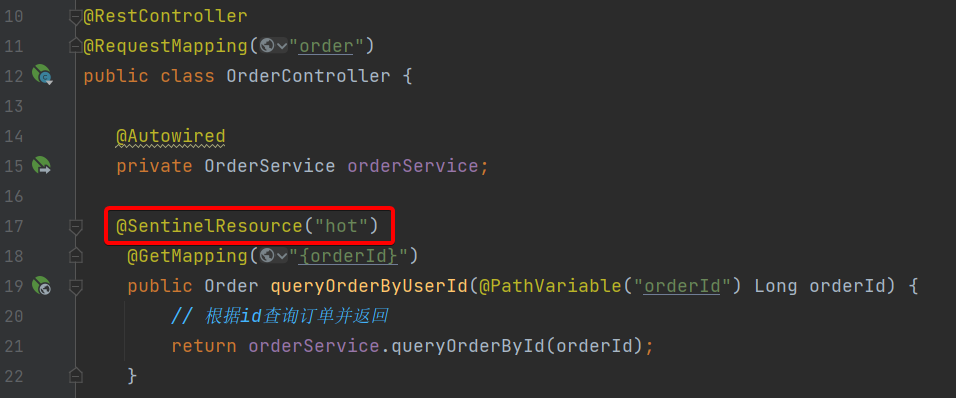

## 雪崩问题

> 微服务之间相互调用，因为调用链中的一个服务故障，引起整个链路都无法访问的情况。

- 解决雪崩问题的常见方式：
  - 避免因**瞬间高并发**流量而导致（预防措施）
    - **流量控制**：限制业务访问的QPS，避免服务因流量的突增而故障
  - 避免因**服务故障**而导致（补救措施）
    - **超时处理**：设定超时时间，请求超过一定时间没有响应就返回错误信息
    - **线程隔离**（舱壁模式）：限定每个业务能使用的线程数，避免耗尽整个服务器资源
    - **熔断降级**：由**断路器**统计业务执行的异常比例，如果超出阈值则会**熔断**该业务，拦截访问该业务的一切请求


## Sentinel

- 服务保护技术对比

  |                  | Sentinel                                       | Hystrix                       |
  | ---------------- | ---------------------------------------------- | ----------------------------- |
  | **隔离策略**     | 信号量隔离                                     | 线程池隔离/信号量隔离         |
  | **熔断降级策略** | 基于慢调用比例或异常比例                       | 基于失败比率                  |
  | 实时指标实现     | 滑动窗口                                       | 滑动窗口（基于 RxJava）       |
  | 规则配置         | 支持多种数据源                                 | 支持多种数据源                |
  | 扩展性           | 多个扩展点                                     | 插件的形式                    |
  | 基于注解的支持   | 支持                                           | 支持                          |
  | **限流**         | 基于 QPS，支持基于调用关系的限流               | 有限的支持                    |
  | **流量整形**     | 支持慢启动、匀速排队模式                       | 不支持                        |
  | 系统自适应保护   | 支持                                           | 不支持                        |
  | **控制台**       | 开箱即用，可配置规则、查看秒级监控、机器发现等 | 不完善                        |
  | 常见框架的适配   | Servlet、Spring Cloud、Dubbo、gRPC  等         | Servlet、Spring Cloud Netflix |


### 安装Sentinel

> https://github.com/alibaba/Sentinel/releases

- 将jar包放到任意非中文目录，执行命令：

  ```sh
  java -jar sentinel-dashboard-1.8.4.jar
  ```

- 修改端口

  ```sh
  java -Dserver.port=8090 -jar sentinel-dashboard-1.8.4.jar
  ```

  | 配置项                           | 默认值   | 说明       |
  | -------------------------------- | -------- | ---------- |
  | server.port                      | 8080     | 服务端口   |
  | sentinel.dashboard.auth.username | sentinel | 默认用户名 |
  | sentinel.dashboard.auth.password | sentinel | 默认密码   |

- 访问http://localhost:8080页面登录，账号和密码默认都是：sentinel


### 微服务整合Sentinel

- 导入依赖

  ```xml
  <!--sentinel-->
  <dependency>
      <groupId>com.alibaba.cloud</groupId> 
      <artifactId>spring-cloud-starter-alibaba-sentinel</artifactId>
  </dependency>
  ```

- 添加配置内容

  ```yml
  spring:
    cloud: 
      sentinel:
        transport:
          dashboard: localhost:8080
        web-context-unify: false # 关闭context整合
  ```

- 访问微服务的任意端点，这样才能触发sentinel的监控


### 流量控制

> 当请求进入微服务时，首先会访问DispatcherServlet，然后进入Controller、Service、Mapper，这样的一个调用链就叫做**簇点链路**。簇点链路中被监控的每一个接口就是一个**资源**。
>
> Sentinel默认只标记Controller中的方法为资源，如果要标记其它方法，需要利用`@SentinelResource("自定义标识")`注解。
>
> Sentinel默认会将Controller方法做context整合，导致链路模式的流控失效，需要修改application.yml，添加配置。


#### 流控模式

- **直接**：统计当前资源的请求，触发阈值时对当前资源直接限流

- **关联**：统计与当前资源相关的另一个资源，触发阈值时，对当前资源限流

  - 两个有竞争关系的资源
  - 一个优先级较高（不限流），一个优先级低（限流）
  - 如下图：对/order/query端点进行限流，当/update资源访问量触发阈值时，就会对/query资源限流，避免影响update

  


- **链路**：统计从指定链路访问到本资源的请求，触发阈值时，对指定链路限流

  - ==注意：==Sentinel默认会将Controller方法做context整合，导致链路模式的流控失效，需要修改application.yml

  - 如下图：只统计从/order/query进入/goods的资源，超出阈值则被限流
  
    


#### 流控效果

- **快速失败**：QPS超过阈值时，拒绝新的请求，并抛出FlowException异常
- **warm up**：预热模式，对超出阈值的请求同样是拒绝并抛出异常。但这种模式阈值会动态变化，从一个较小值逐渐增加到最大阈值
- **排队等待**：可以使得QPS会变的很平滑，请求会进入队列，按照阈值允许的时间间隔依次执行请求；如果请求预期等待时长大于超时时间，直接拒绝


#### 热点参数限流

> 在实际开发中，可能部分商品是热点商品，例如秒杀商品，我们希望这部分商品的QPS限制与其它商品不一样，高一些。那就需要配置热点参数限流。
>
> ==注意==：sentinel点击簇点链路的右侧添加热点存在bug，需要点击左侧菜单中**热点规则**菜单创建


**注意事项**：热点参数限流对默认的SpringMVC资源无效，需要利用`@SentinelResource("自定义标识")`注解标记资源




- 例如：给/order/{orderId}这个资源添加热点参数限流

  - 默认QPS为2
  - 102参数QPS为4
  - 103参数QPS为10

  


### 线程隔离&熔断降级

> 不管是线程隔离还是熔断降级，都是对**客户端**（调用方）的保护。需要在**调用方**发起远程调用时做线程隔离、或者服务熔断。


#### FeignClient整合Sentinel

> 而我们的微服务远程调用都是基于Feign来完成的，因此我们需要将Feign与Sentinel整合，在Feign里面实现线程隔离和服务熔断。


- 修改配置，开启sentinel功能

  ```yml
  feign:
    sentinel:
      enabled: true # 开启feign对sentinel的支持
  ```

- 编写失败降级逻辑

  - 方式一：FallbackClass，无法对远程调用的异常做处理
  - 方式二：**FallbackFactory**，可以对远程调用的异常做处理

- 失败降级兜底实现步骤

  - 步骤一：在feign-api项目的fallback包中定义类，实现FallbackFactory==【注意泛型】==

    ```java
    package cn.itcast.feign.fallback;
    
    import cn.itcast.feign.client.UserClient;
    import cn.itcast.feign.pojo.User;
    import feign.hystrix.FallbackFactory;
    import lombok.extern.slf4j.Slf4j;
    
    @Slf4j
    public class UserClientFallbackFactory implements FallbackFactory<UserClient> {
        @Override
        public UserClient create(Throwable throwable) {
            return new UserClient() {
                @Override
                public User queryById(Long id) {
                    log.error("查询用户异常", throwable);
                    //使得用户侧不再显示报错，而是显示返回数据中的user为null
                    return new User();
                }
            };
        }
    }
    ```

  - 步骤二：在feign-api项目的config包中FeignConfiguration类中将UserClientFallbackFactory注册为一个Bean

    ```java
    @Bean
    public UserClientFallbackFactory userClientFallbackFactory(){
        //失败降级逻辑
        return new UserClientFallbackFactory();
    }
    ```

  - 步骤三：在feign-api项目中的UserClient接口中使用UserClientFallbackFactory

    ```java
    package cn.itcast.feign.client;
    
    import cn.itcast.feign.config.FeignConfiguration;
    import cn.itcast.feign.fallback.UserClientFallbackFactory;
    import cn.itcast.feign.pojo.User;
    import org.springframework.cloud.openfeign.FeignClient;
    import org.springframework.web.bind.annotation.GetMapping;
    import org.springframework.web.bind.annotation.PathVariable;
    
    @FeignClient(value = "userservice", //指定服务名称
            configuration = FeignConfiguration.class, //局部设置日志级别
            fallbackFactory = UserClientFallbackFactory.class) //失败降级处理
    public interface UserClient {
    
        @GetMapping("/user/{id}")
        public User queryById(@PathVariable("id") Long id);
    
    }
    ```


#### 线程隔离

- 线程隔离有两种方式实现：
  - 线程池隔离：给每个服务调用业务分配一个线程池，利用**线程池**本身实现隔离效果
    - 优点：支持自动超时、支持异步调用
    - 缺点：线程的额外开销比较大
    - 场景：低扇出
  - 信号量隔离（**Sentinel默认采用**）：不创建线程池，而是计数器模式，记录业务使用的**线程数量**，达到信号量上限时，禁止新的请求
    - 优点：轻量级，无额外开销
    - 缺点：不支持主动超时、不支持异步调用
    - 场景：高频调用、高扇出


#### 熔断降级

- 断路器熔断策略有三种：**慢调用、异常比例、异常数**
  - **慢调用**：业务的**响应时长**（RT）大于指定时长的请求认定为慢调用请求。在指定时间内，如果请求数量超过设定的最小数量，慢调用比例大于设定的阈值，则触发熔断。
  - **异常比例&异常数**：统计指定时间内的调用，如果调用次数超过指定请求数，并且出现**异常**的比例达到设定的比例阈值（或超过指定异常数），则触发熔断。


- 状态机的三个状态
  - closed：关闭状态，断路器放行所有请求，并开始统计异常比例、慢请求比例。超过阈值则切换到open状态
  - open：打开状态，服务调用被**熔断**，访问被熔断服务的请求会被拒绝，快速失败，直接走降级逻辑。Open状态5秒后会进入half-open状态
  - half-open：半开状态，放行一次请求，根据执行结果来判断接下来的操作
    - 请求成功：则切换到closed状态
    - 请求失败：则切换到open状态


### 授权规则

> 授权规则可以对调用方的来源做控制，有白名单和黑名单两种方式

- 默认情况下，sentinel不管请求者从哪里来，请求者的origin返回值永远是default。因此，我们需要自定义定义一个`RequestOriginParser`的实现类，让**不同的请求，返回不同的origin**。

  ```java
  package cn.itcast.order.sentinel;
  
  import com.alibaba.csp.sentinel.adapter.spring.webmvc.callback.RequestOriginParser;
  import org.springframework.stereotype.Component;
  import org.springframework.util.StringUtils;
  
  import javax.servlet.http.HttpServletRequest;
  
  @Component
  public class HeaderOriginParser implements RequestOriginParser {
      @Override
      public String parseOrigin(HttpServletRequest request) {
          // 1.获取请求头
          String origin = request.getHeader("origin");
          // 2.非空判断
          if (StringUtils.isEmpty(origin)) {
              origin = "blank";
          }
          return origin;
      }
  }
  ```


- 添加网关配置，让**所有从gateway路由到微服务的请求都带上origin头**

  ```yml
  spring:
    cloud:
      gateway:
        # 默认过滤器（对所有请求有效）
        default-filters:
          # 给所有经过网关的请求添加gateway请求头
          - AddRequestHeader=origin,gateway
  ```


- 在sentinel添加一个授权规则，放行origin值为gateway的请求

  


### 自定义异常结果

> 默认情况下，发生限流、降级、授权拦截时，都会抛出异常到调用方。异常结果都是flow limmiting（限流）。这样不够友好，无法得知是限流还是降级还是授权拦截。


- 默认处理请求被限流、降级、授权拦截时抛出的异常：BlockException，其中包含的子类

  | 异常                 | 说明               |
  | -------------------- | ------------------ |
  | FlowException        | 限流异常           |
  | ParamFlowException   | 热点参数限流的异常 |
  | DegradeException     | 降级异常           |
  | AuthorityException   | 授权规则异常       |
  | SystemBlockException | 系统规则异常       |


- 如果要自定义异常时的返回结果，需要实现BlockExceptionHandler接口

  ```java
  package cn.itcast.order.sentinel;
  
  import com.alibaba.csp.sentinel.adapter.spring.webmvc.callback.BlockExceptionHandler;
  import com.alibaba.csp.sentinel.slots.block.BlockException;
  import com.alibaba.csp.sentinel.slots.block.authority.AuthorityException;
  import com.alibaba.csp.sentinel.slots.block.degrade.DegradeException;
  import com.alibaba.csp.sentinel.slots.block.flow.FlowException;
  import com.alibaba.csp.sentinel.slots.block.flow.param.ParamFlowException;
  import org.springframework.stereotype.Component;
  import javax.servlet.http.HttpServletRequest;
  import javax.servlet.http.HttpServletResponse;
  
  @Component
  public class SentinelExceptionHandler implements BlockExceptionHandler {
      @Override
      public void handle(HttpServletRequest request, HttpServletResponse response, BlockException e) throws Exception {
          
          String msg = "未知异常";
          int status = 429; //请求过多
  
          if (e instanceof FlowException) {
              msg = "请求被限流了";
          } else if (e instanceof ParamFlowException) {
              msg = "请求被热点参数限流";
          } else if (e instanceof DegradeException) {
              msg = "请求被降级了";
          } else if (e instanceof AuthorityException) {
              msg = "没有权限访问";
              status = 401;
          }
  
          //返回异常信息
          //{"msg":"msg","status":"status"}
          response.setContentType("application/json;charset=utf-8");
          response.setStatus(status);
          response.getWriter().write("{\"msg\":\""+msg+"\",\"status\":\""+status+"\"}");
      }
  }
  
  ```


### 规则持久化

> sentinel的所有规则都是内存存储，重启后所有规则都会丢失。在生产环境下，我们必须确保这些规则的持久化，避免丢失


- sentinel支持三种规则管理模式

  | 推送模式                                                     | 说明                                                         | 优点                         | 缺点                                                         |
  | ------------------------------------------------------------ | ------------------------------------------------------------ | ---------------------------- | ------------------------------------------------------------ |
  | [原始模式](https://github.com/alibaba/Sentinel/wiki/在生产环境中使用-Sentinel) | API 将规则推送至客户端并直接更新到内存中，扩展写数据源（[WritableDataSource](https://github.com/alibaba/Sentinel/wiki/动态规则扩展)），默认就是这种 | 简单，无任何依赖             | 不保证一致性；规则保存在内存中，重启即消失。严重不建议用于生产环境 |
  | [Pull   ](https://github.com/alibaba/Sentinel/wiki/在生产环境中使用-Sentinel)[模式](https://github.com/alibaba/Sentinel/wiki/在生产环境中使用-Sentinel) | 扩展写数据源（[WritableDataSource](https://github.com/alibaba/Sentinel/wiki/动态规则扩展)），  客户端主动向某个规则管理中心定期轮询拉取规则，这个规则中心可以是 RDBMS、文件 等 | 简单，无任何依赖；规则持久化 | 不保证一致性；实时性不保证，拉取过于频繁也可能会有性能问题。 |
  | **[Push   ](https://github.com/alibaba/Sentinel/wiki/在生产环境中使用-Sentinel)[模式](https://github.com/alibaba/Sentinel/wiki/在生产环境中使用-Sentinel)** | 扩展读数据源（[ReadableDataSource](https://github.com/alibaba/Sentinel/wiki/动态规则扩展)），规则中心统一推送，客户端通过注册监听器的方式时刻监听变化，比如使用  Nacos、Zookeeper  等配置中心。这种方式有更好的实时性和一致性保证。**生产环境下一般采用**  **push**  **模式的数据源。** | 规则持久化；一致性；         | 引入第三方依赖                                               |


#### 实现push模式持久化

- 导入sentinel监听nacos的依赖依赖

  ```xml
  <dependency>
      <groupId>com.alibaba.csp</groupId>
      <artifactId>sentinel-datasource-nacos</artifactId>
  </dependency>
  ```

- 在微服务中配置nacos地址及监听的配置信息

  ```yml
  spring:
    cloud:
      sentinel:
        datasource:
          flow:
            nacos:
              server-addr: localhost:8848 # nacos地址
              dataId: orderservice-flow-rules # 在nacos里的配置文件名称
              groupId: SENTINEL_GROUP
              rule-type: flow # 还可以是：degrade、authority、param-flow
  ```

- 启动sentinel

  ```sh
  java -jar sentinel-dashboard.jar
  ```


