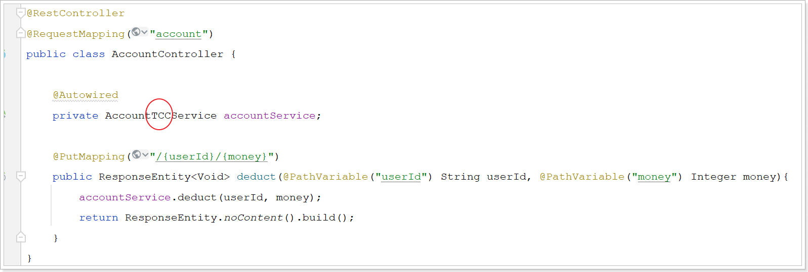

## 分布式事务

- 本地事务

  - ACID
    - 原子性：事务是不可分割的最小操作单位，要么同时成功，要么同时失败
    - 一致性：使得数据库从一种正确状态转换成另一种正确状态
    - 隔离性：在事务正确提交之前，不允许把该事务对数据的任何改变提供给任何其他事务
    - 持久性：对数据库做的一切修改将永久保存，不论是否出现故障


- 分布式事务

  - 跨 **数据源** 或 **服务** 的分布式事务。在数据库水平拆分、服务垂直拆分之后，一个业务操作通常要跨多个数据库、服务才能完成。


### CAP定理

> 在分布式系统中，系统间的网络不能100%保证健康，一定会有故障的时候，而服务又必须对外保证服务。因此Partition Tolerance不可避免。
>
> 如果此时要保证**一致性**，就必须等待网络恢复，完成数据同步后，整个集群才对外提供服务，服务处于阻塞状态，不可用。
>
> 如果此时要保证**可用性**，就不能等待网络恢复，那分区之间就会出现数据不一致。

- 分布式系统的三个指标，不可能同时做到。在P一定要保证的情况下，A和C之间只能实现一个。
  - Consistency：一致性
  - Availability：可用性
  - Partition tolerance：分区容错性


### BASE理论

> BASE理论是对CAP的一种解决思路，包含三个思想：

- **Basically Available** **（基本可用）**：分布式系统在出现故障时，允许损失部分可用性，即保证核心可用。
- **Soft State（软状态）：**在一定时间内，允许出现中间状态，比如临时的不一致状态。
- **Eventually Consistent（最终一致性）**：虽然无法保证强一致性，但是在软状态结束后，最终达到数据一致。


### 解决分布式事务的思路

- **AP模式**：各子事务分别执行和提交，允许出现结果**临时不一致**，然后采用弥补措施恢复数据即可，实现**最终一致**。（软状态 + 最终一致性）
- **CP模式**：各个子事务执行后互相等待，同时提交，同时回滚，达成**强一致**。但事务等待过程中，处于**弱可用**状态。（基本可用）


## Seata

> Seata架构：
>
> - **TC (Transaction Coordinator) - 事务协调者**：维护全局和分支事务的状态，协调全局事务提交或回滚。
> - **TM (Transaction Manager) - 事务管理器**：定义全局事务的范围、开始全局事务、提交或回滚全局事务。
> - **RM (Resource Manager) - 资源管理器**：管理分支事务处理的资源，向TC注册分支事务和报告分支事务的状态，并驱动分支事务提交或回滚。


### 四种分布式事务解决方案对比

|          |              XA              |                             AT                              |                             TCC                              |                             SAGA                             |
| :------: | :--------------------------: | :---------------------------------------------------------: | :----------------------------------------------------------: | :----------------------------------------------------------: |
|  一致性  |            强一致            |                                                             |                            弱一致                            |                           最终一致                           |
|  隔离性  |           完全隔离           |                       居于全局锁隔离                        |                       基于资源预留隔离                       |                            无隔离                            |
| 代码侵入 |              无              |                             无                              |            有，要编写try、confirm、cancel三个接口            |                  有，要编写状态机和补偿业务                  |
|   性能   |              差              |                             好                              |                            非常好                            |                            非常好                            |
|   特点   |    依赖数据库机制实现回滚    |                  依赖数据快照实现数据恢复                   | 使用数据补偿机制，不依赖数据库事务；无需生成快照，无需使用全局锁 |                                                              |
|   场景   | 对一致性、隔离性要求高的业务 | - Seata默认模式<br>- 基于关系型数据库的大多数分布式事务场景 |    - 对性能要求较高的事务<br>- 有非关系型数据库参与的事务    | - 业务流程长、业务流程多<br>- 参与者包含其他公司或遗留系统服务，无法提供TCC模式要求的三个接口 |


### 微服务集成Seata

- 导入依赖

  ```xml
  <!--seata-->
  <dependency>
      <groupId>com.alibaba.cloud</groupId>
      <artifactId>spring-cloud-starter-alibaba-seata</artifactId>
      <exclusions>
          <!--版本较低，1.3.0，因此排除--> 
          <exclusion>
              <artifactId>seata-spring-boot-starter</artifactId>
              <groupId>io.seata</groupId>
          </exclusion>
      </exclusions>
  </dependency>
  <dependency>
      <groupId>io.seata</groupId>
      <artifactId>seata-spring-boot-starter</artifactId>
      <!--seata starter 采用1.5.1版本-->
      <version>${seata.version}</version>
  </dependency>
  ```

- 在参与事务的每个微服务的application.yml中，配置TC服务信息

  - namespace为空，就是默认的public，结合起来，TC服务的信息就是：public@DEFAULT_GROUP@seata-tc-server@GZ，这样就能确定TC服务集群了。然后就可以去Nacos拉取对应的实例信息

  ```yml
  seata:
    registry: # TC服务注册中心的配置，微服务根据这些信息去注册中心获取tc服务地址
      type: nacos # 注册中心类型 nacos
      nacos:
        server-addr: 127.0.0.1:8848 # nacos地址
        namespace: "" # namespace，默认为空
        group: DEFAULT_GROUP # 分组，默认是DEFAULT_GROUP
        application: seata-server # seata服务名称
        username: nacos
        password: nacos
    tx-service-group: seata-demo # 事务组名称
    service:
      vgroup-mapping: # 事务组与cluster的映射关系
        seata-demo: GZ # 【注意】事务组名称一致
  ```


### XA模式


#### 优缺点

- XA模式的优点
  - 事务的强一致性，满足ACID原则
  - 常用数据库都支持，实现简单，并且没有代码侵入
- XA模式的缺点
  - 因为一阶段需要锁定数据库资源，等待第二阶段结束才释放，性能较差
  - 依赖关系型数据库实现事务


#### 实现XA模式

- 创建名为`seata`的数据库，建立`branch_table`和`global_table`两张表

  ```mysql
  SET NAMES utf8mb4;
  SET FOREIGN_KEY_CHECKS = 0;
  
  -- ----------------------------
  -- 分支事务表
  -- ----------------------------
  DROP TABLE IF EXISTS `branch_table`;
  CREATE TABLE `branch_table`  (
    `branch_id` bigint(20) NOT NULL,
    `xid` varchar(128) CHARACTER SET utf8 COLLATE utf8_general_ci NOT NULL,
    `transaction_id` bigint(20) NULL DEFAULT NULL,
    `resource_group_id` varchar(32) CHARACTER SET utf8 COLLATE utf8_general_ci NULL DEFAULT NULL,
    `resource_id` varchar(256) CHARACTER SET utf8 COLLATE utf8_general_ci NULL DEFAULT NULL,
    `branch_type` varchar(8) CHARACTER SET utf8 COLLATE utf8_general_ci NULL DEFAULT NULL,
    `status` tinyint(4) NULL DEFAULT NULL,
    `client_id` varchar(64) CHARACTER SET utf8 COLLATE utf8_general_ci NULL DEFAULT NULL,
    `application_data` varchar(2000) CHARACTER SET utf8 COLLATE utf8_general_ci NULL DEFAULT NULL,
    `gmt_create` datetime(6) NULL DEFAULT NULL,
    `gmt_modified` datetime(6) NULL DEFAULT NULL,
    PRIMARY KEY (`branch_id`) USING BTREE,
    INDEX `idx_xid`(`xid`) USING BTREE
  ) ENGINE = InnoDB CHARACTER SET = utf8 COLLATE = utf8_general_ci ROW_FORMAT = Compact;
  
  -- ----------------------------
  -- 全局事务表
  -- ----------------------------
  DROP TABLE IF EXISTS `global_table`;
  CREATE TABLE `global_table`  (
    `xid` varchar(128) CHARACTER SET utf8 COLLATE utf8_general_ci NOT NULL,
    `transaction_id` bigint(20) NULL DEFAULT NULL,
    `status` tinyint(4) NOT NULL,
    `application_id` varchar(32) CHARACTER SET utf8 COLLATE utf8_general_ci NULL DEFAULT NULL,
    `transaction_service_group` varchar(32) CHARACTER SET utf8 COLLATE utf8_general_ci NULL DEFAULT NULL,
    `transaction_name` varchar(128) CHARACTER SET utf8 COLLATE utf8_general_ci NULL DEFAULT NULL,
    `timeout` int(11) NULL DEFAULT NULL,
    `begin_time` bigint(20) NULL DEFAULT NULL,
    `application_data` varchar(2000) CHARACTER SET utf8 COLLATE utf8_general_ci NULL DEFAULT NULL,
    `gmt_create` datetime NULL DEFAULT NULL,
    `gmt_modified` datetime NULL DEFAULT NULL,
    PRIMARY KEY (`xid`) USING BTREE,
    INDEX `idx_gmt_modified_status`(`gmt_modified`, `status`) USING BTREE,
    INDEX `idx_transaction_id`(`transaction_id`) USING BTREE
  ) ENGINE = InnoDB CHARACTER SET = utf8 COLLATE = utf8_general_ci ROW_FORMAT = Compact;
  
  SET FOREIGN_KEY_CHECKS = 1;
  ```

- 修改每个参与事务的微服务application.yml文件，开启XA模式：

  ```yml
  seata:
    data-source-proxy-mode: XA
  ```

- 在发起全局事务的入口方法上添加`@GlobalTransactional`注解


### AT模式


- AT模式与XA模式的区别
  - 锁：XA模式一阶段不提交事务，锁定资源；AT模式一阶段直接提交，不锁定资源
  - 恢复机制：XA模式依赖数据库机制实现回滚；AT模式利用数据快照实现数据恢复
  - 一致性：XA模式强一致；AT模式最终一致

- AT模式的写隔离

  

#### 优缺点

- AT模式的优点
  - 一阶段完成直接提交事务，释放数据库资源，性能比较好
  - 利用全局锁实现读写隔离
  - 没有代码侵入，框架自动完成回滚和提交
- AT模式的缺点
  - 两阶段之间属于软状态，属于最终一致
  - 框架的快照功能会影响性能，但比XA模式要好很多


#### 实现AT模式

- 在TC服务关联的数据库（seata）中，添加`lock_table`、`distributed_lock`记录全局锁的表，`undo_log`表导入到微服务关联的数据库（seata_demo）：

  ```mysql
  -- ----------------------------
  --    undo_log表 记录数据快照
  -- ----------------------------
  DROP TABLE IF EXISTS `undo_log`;
  CREATE TABLE `undo_log`  (
    `branch_id` BIGINT(20) NOT NULL COMMENT 'branch transaction id',
    `xid` VARCHAR(100) CHARACTER SET utf8 COLLATE utf8_general_ci NOT NULL COMMENT 'global transaction id',
    `context` VARCHAR(128) CHARACTER SET utf8 COLLATE utf8_general_ci NOT NULL COMMENT 'undo_log context,such as serialization',
    `rollback_info` LONGBLOB NOT NULL COMMENT 'rollback info',
    `log_status` INT(11) NOT NULL COMMENT '0:normal status,1:defense status',
    `log_created` DATETIME(6) NOT NULL COMMENT 'create datetime',
    `log_modified` DATETIME(6) NOT NULL COMMENT 'modify datetime',
    UNIQUE INDEX `ux_undo_log`(`xid`, `branch_id`) USING BTREE
  ) ENGINE = INNODB CHARACTER SET = utf8 COLLATE = utf8_general_ci COMMENT = 'AT transaction mode undo table' ROW_FORMAT = COMPACT;
  ```

  ```mysql
  SET NAMES utf8mb4;
  SET FOREIGN_KEY_CHECKS = 0;
  
  -- ----------------------------
  -- 全局锁相关表
  -- ----------------------------
  CREATE TABLE IF NOT EXISTS `lock_table`
  (
      `row_key`        VARCHAR(128) NOT NULL,
      `xid`            VARCHAR(128),
      `transaction_id` BIGINT,
      `branch_id`      BIGINT       NOT NULL,
      `resource_id`    VARCHAR(256),
      `table_name`     VARCHAR(32),
      `pk`             VARCHAR(36),
      `status`         TINYINT      NOT NULL DEFAULT '0' COMMENT '0:locked ,1:rollbacking',
      `gmt_create`     DATETIME,
      `gmt_modified`   DATETIME,
      PRIMARY KEY (`row_key`),
      KEY `idx_status` (`status`),
      KEY `idx_branch_id` (`branch_id`),
      KEY `idx_xid_and_branch_id` (`xid` , `branch_id`)
  ) ENGINE = INNODB;
  
  CREATE TABLE IF NOT EXISTS `distributed_lock`
  (
      `lock_key`       CHAR(20) NOT NULL,
      `lock_value`     VARCHAR(20) NOT NULL,
      `expire`         BIGINT,
      PRIMARY KEY (`lock_key`)
  ) ENGINE = INNODB;
  
  INSERT INTO `distributed_lock` (lock_key, lock_value, expire) VALUES ('AsyncCommitting', ' ', 0);
  INSERT INTO `distributed_lock` (lock_key, lock_value, expire) VALUES ('RetryCommitting', ' ', 0);
  INSERT INTO `distributed_lock` (lock_key, lock_value, expire) VALUES ('RetryRollbacking', ' ', 0);
  INSERT INTO `distributed_lock` (lock_key, lock_value, expire) VALUES ('TxTimeoutCheck', ' ', 0);
  ```

- 修改每个参与事务的微服务application.yml文件，开启AT模式：

  ```yml
  seata:
    data-source-proxy-mode: AT # 默认就是AT
  ```

- 在发起全局事务的入口方法上添加`@GlobalTransactional`注解


### TCC模式

> TCC模式与AT模式非常相似，每阶段都是独立事务，不同的是TCC通过人工编码来实现数据恢复。需要结合业务功能实现三个方法：
>
> - Try：资源的检测和冻结
>
> - Confirm：完成资源操作业务；要求 Try 成功 Confirm 一定要能成功
>
> - Cancel：释放冻结资源，可以理解为try的反向操作


#### 优缺点

- TCC模式的优点
  - 一阶段完成直接提交事务，释放数据库资源，性能好
  - 相比AT模式，无需生成快照，无需使用全局锁，性能最强
  - 使用数据补偿机制，不依赖数据库事务
- TCC模式的缺点
  - 有代码侵入，需要人为编写try、Confirm和Cancel接口
  - 软状态，事务是最终一致
  - 需要考虑Confirm和Cancel失败的情况，需要做幂等处理


#### 空回滚&业务悬挂


- 当某分支事务的try阶段**阻塞**时，可能导致全局事务超时而触发二阶段的cancel操作。在未执行try操作时先执行了cancel操作，这时cancel不能做回滚，就是**空回滚**。
  - 因此，执行cancel操作时，应当判断try是否已经执行，如果尚未执行，则应该空回滚。
- 对于已经空回滚的业务，之前被阻塞的try操作恢复，继续执行try，就永远不可能confirm或cancel ，事务一直处于中间状态，这就是**业务悬挂**。
  - 因此，执行try操作时，应当判断cancel是否已经执行过了，如果已经执行，应当阻止空回滚后的try操作，避免悬挂。


#### 实现TCC模式

- ==需根据业务自定义一张中间表==，在业务相关的数据库中创建如下表：

  - xid：是全局事务id
  - freeze_money：用来记录用户冻结金额
  - state：用来记录事务状态

  ```mysql
  CREATE TABLE `account_freeze_tbl`(
      `xid` varchar(128) NOT NULL,
      `user_id` varchar(255) DEFAULT NULL COMMENT'用户id',
      `freeze_money`int(11) unsigned DEFAULT'0'COMMENT'冻结金额',
      `state`int(1) DEFAULT NULL COMMENT'事务状态，0:try，1:confirm，2:cancel',
      PRIMARY KEY(`xid`)USING BTREE
  )ENGINE=InnoDB DEFAULT CHARSET=utf8 ROW_FORMAT=COMPACT;
  ```

- 在发起全局事务的入口方法上添加`@GlobalTransactional`注解

- 实现逻辑

  ```
  try：
    - 业务悬挂处理（根据xid查询中间表，如果NoNull则证明Cancel已经执行，即刻终止）
    - 将冻结资源，事务状态等添加到中间表
    - 实现业务代码
  confirm：
    - 幂等处理（第一次执行后数据就已经删除，后续操作只会返回false，已经幂等）
    - 根据事务id删除中间表数据
  cancel：
    - 空回滚处理（根据xid查询中间表，如果为Null则说明try还没做，需要空回滚）
    - 幂等处理（处理并发cancel；如果冻结资源状态为cancel，则说明已经cancel了，即刻终止）
    - 释放冻结资源，恢复数据
    - 更新中间表的事务状态、清空冻结资源
  ```

- 编写实体类和Mapper接口

  ```java
  package cn.itcast.account.entity;
  
  import com.baomidou.mybatisplus.annotation.IdType;
  import com.baomidou.mybatisplus.annotation.TableId;
  import com.baomidou.mybatisplus.annotation.TableName;
  import lombok.Data;
  
  @Data
  @TableName("account_freeze_tbl")
  public class AccountFreeze {
      @TableId(type = IdType.INPUT)
      private String xid;
      private String userId;
      private Integer freezeMoney;
      private Integer state;
  
      public static abstract class State {
          public final static int TRY = 0;
          public final static int CONFIRM = 1;
          public final static int CANCEL = 2;
      }
  }
  ```
  
  ```java
  package cn.itcast.account.mapper;
    
  import cn.itcast.account.entity.AccountFreeze;
  import com.baomidou.mybatisplus.core.mapper.BaseMapper;
    
  public interface AccountFreezeMapper extends BaseMapper<AccountFreeze> {
  }
  ```
  
- **声明TCC接口**，三个方法，三个注解，三个属性值

  ```java
  @LocalTCC
  public interface TCCService {
      /**
       * Try逻辑，@TwoPhaseBusinessAction中的name属性要与当前方法名一致，用于指定Try逻辑对应的方法
       */
      @TwoPhaseBusinessAction(name = "prepare", commitMethod = "confirm", rollbackMethod = "cancel")
      void prepare(@BusinessActionContextParameter(paramName = "param") String param);
  
      /**
       * 二阶段confirm确认方法、可以另命名，但要保证与commitMethod一致
       *
       * @param context 上下文,可以传递try方法的参数
       * @return boolean 执行是否成功
       */
      boolean confirm(BusinessActionContext context);
  
      /**
       * 二阶段回滚方法，要保证与rollbackMethod一致
       */
      boolean cancel(BusinessActionContext context);
  }
  ```

  ```java
  package cn.itcast.account.service;
  
  import io.seata.rm.tcc.api.BusinessActionContext;
  import io.seata.rm.tcc.api.BusinessActionContextParameter;
  import io.seata.rm.tcc.api.LocalTCC;
  import io.seata.rm.tcc.api.TwoPhaseBusinessAction;
  
  @LocalTCC
  public interface AccountTCCService {
  
      /**
       * 根据用户id扣减余额，记录冻结金额
       * commitMethod 提交时对于的方法；rollbackMethod回滚时对于的方法
       * @param userId 用户id
       * @param money 扣减金额
       */
      @TwoPhaseBusinessAction(name = "deduct", commitMethod = "confirm", rollbackMethod = "cancel")
      void deduct(@BusinessActionContextParameter("userId")String userId,
                  @BusinessActionContextParameter("money")int money);
  
      /**
       * 执行TCC事务时，提交事务时执行的方法
       * @param ctx 上下文对象
       * @return 执行结果
       */
      Boolean confirm(BusinessActionContext ctx);
      
      /**
       * 执行TCC事务时，回滚事务时执行的方法
       * @param ctx 上下文对象
       * @return 执行结果
       */
      Boolean cancel(BusinessActionContext ctx);
  }
  ```

- **编写实现类**，实现TCC业务

  ```java
  package cn.itcast.account.service.impl;
  
  import cn.itcast.account.entity.AccountFreeze;
  import cn.itcast.account.mapper.AccountFreezeMapper;
  import cn.itcast.account.mapper.AccountMapper;
  import cn.itcast.account.service.AccountTCCService;
  import io.seata.core.context.RootContext;
  import io.seata.rm.tcc.api.BusinessActionContext;
  import org.springframework.beans.factory.annotation.Autowired;
  import org.springframework.stereotype.Service;
  import org.springframework.transaction.annotation.Transactional;
  
  import java.util.Objects;
  
  @Service
  public class AccountTCCServiceImpl implements AccountTCCService {
  
      @Autowired
      private AccountMapper accountMapper;
  
      @Autowired
      private AccountFreezeMapper accountFreezeMapper;
  
      @Override
      @Transactional
      public void deduct(String userId, int money) {
  
          //获取全局事务id
          String xid = RootContext.getXID();
  
          //处理业务悬挂
          AccountFreeze localFreeze = accountFreezeMapper.selectById(xid);
          if (Objects.nonNull(localFreeze)) {
              //如果非空，说明已经cancel过
              return;
          }
  
          //1 扣减余额
          accountMapper.deduct(userId, money);
          //2 记录冻结金额
          AccountFreeze accountFreeze = new AccountFreeze();
          accountFreeze.setXid(xid);
          accountFreeze.setUserId(userId);
          accountFreeze.setFreezeMoney(money);
          accountFreeze.setState(AccountFreeze.State.TRY);
          accountFreezeMapper.insert(accountFreeze);
      }
  
      @Override
      public Boolean confirm(BusinessActionContext context) {
          //删除冻结金额
          String xid = context.getXid();
          int count = accountFreezeMapper.deleteById(xid);
          return count == 1;
      }
  
      @Override
      public Boolean cancel(BusinessActionContext context) {
  
          //获取xid
          String xid = context.getXid();
  
          //获取用户ID和冻结金额
          String userId = context.getActionContext("userId").toString();
          AccountFreeze localFreeze = accountFreezeMapper.selectById(xid);
          Integer freezeMoney = localFreeze.getFreezeMoney();
  
          //处理空回滚
          if (Objects.isNull(localFreeze)) {
              //如果没有经过try方法，则为null
              AccountFreeze accountFreeze = new AccountFreeze();
              accountFreeze.setXid(xid);
              accountFreeze.setUserId(userId);
              accountFreeze.setFreezeMoney(0);
              accountFreeze.setState(AccountFreeze.State.CANCEL);
              accountFreezeMapper.insert(accountFreeze);
              return Boolean.TRUE;
          }
  
          //幂等处理
          if (localFreeze.getState() == AccountFreeze.State.CANCEL) {
              //说明已经回滚过了,不需要再处理
              return Boolean.TRUE;
          }
  
          //1 回退金额
          accountMapper.refund(userId, freezeMoney);
  
          //2 更新冻结金额为0和状态
          localFreeze.setFreezeMoney(0);
          localFreeze.setState(AccountFreeze.State.CANCEL);
          int count = accountFreezeMapper.updateById(localFreeze);
          return count == 1;
      }
  }
  ```

- 改造原Controller方法

  


### Saga模式

> 分布式事务执行过程中，依次执行各参与者的正向操作，如果所有正向操作均执行成功，那么分布式事务提交。如果任何一个正向操作执行失败，那么分布式事务会去退回去执行前面各参与者的逆向回滚操作，回滚已提交的参与者，使分布式事务回到初始状态。


#### 优缺点

- Saga模式的优点
  - 事务参与者可以基于事件驱动实现异步调用，吞吐高
  - 一阶段直接提交事务，无锁，性能好
  - 不用编写TCC中的三个阶段，实现简单
- Saga模式的缺点
  - 软状态持续时间不确定，时效性差
  - 没有锁，没有事务隔离，会有脏写


