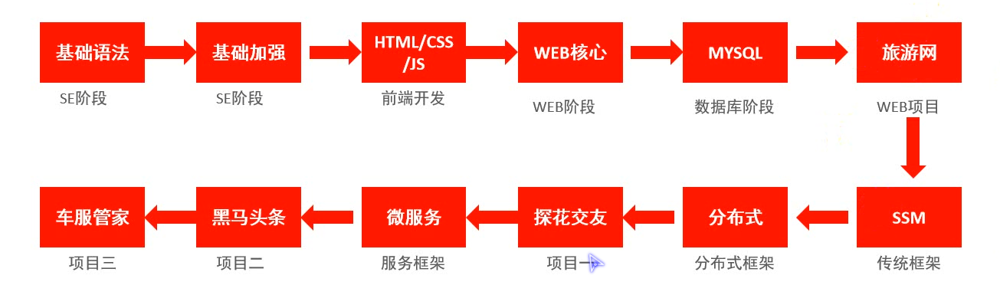

### Java语言介绍

- Java之父：James Gosling

学习路径：



### HelloWorld

```java
public class HelloWorld{						//public限制类名必须与文件名相同
	public static void main(String[] args){		//程序入口，快捷短语main（idea版本大于2019）
		System.out.println("hellp java~");		//快捷短语sout（idea版本大于2019）
	}
}
```

- `javac 文件名.后缀`编译Java文件
- `java 类名`运行Java文件

### IDEA

- 模块划分：project → 多个module → 多个package → 多个java类
- 工程创建
- 模块创建
- 快捷键：复制当行代码“Ctrl+D”，删除当行代码“Ctrl+X”，移动当行代码“Ctrl+shift+上下键”，格式化代码“Ctrl+Alt+L”

### 基础语法

#### 注释：

- 单行注释：`//注释`
- 多行注释：`/*注释*/`
- 文档注释：`/**注释*/`

#### 关键字：

- 常见关键字
  - public：限制类名和文件需要保持一致
  - class：用于声明一个类，创建Java程序的骨架
  - static：
- 关键字的特点：
  - 关键字的字母全部小写
  - 常用的代码编辑器对关键字都有高亮显示
  - main：不属于关键字，它是程序的入口方法，Java虚拟机只能识别这个名字

#### 常量

- 概述
  - 在程序中直接写出来的值
  - 或是在程序中不可以发生改变的值
- 分类：

| 常量类型   | 说明                                           | 举例            |
| ---------- | ---------------------------------------------- | --------------- |
| 字符串常量 | 用双引号括起来的内容                           | “HelloWorld”    |
| 整数常量   |                                                | 100、-10        |
| 小数常量   |                                                | 3.14、6.18、3.0 |
| 字符常量   | 用单引号括起来的内容，不能为空，只能是单个内容 | ‘A’             |
| 布尔常量   |                                                | ture、false     |

#### 常量

- 格式1：`数据类型 变量名 = 初始化值;`
- 格式2：`数据类型 变量名;` 、 `变量名 = 初始化值;`

- 格式3：`数据类型 变量名 = 值 ， 变量名 = 值;`

#### 数据类型

- Java是强类型语言，Java中的数据必须明确数据类型
- 数据类型包括：<u>基本数据类型</u>和<u>引用数据类型</u>

基本数据类型：

| 整型   |                                |       |                                                           |
| ------ | ------------------------------ | ----- | --------------------------------------------------------- |
|        | byte                           | 1字节 | -128 ~ 127                                                |
|        | short                          | 2字节 | -32768 ~ 32767                                            |
|        | int【默认类型】                | 4字节 | -2147483648 ~ 2147483647（21亿）                          |
|        | long（数字后+L）               | 8字节 | -92233......75808 ~ 92233......75807（19位）超过12亿要加L |
| 浮点型 |                                |       |                                                           |
|        | float（数字后+F）              | 4字节 | -1.4E-45 ~ 3.4E38                                         |
|        | double【默认类型】（数字后+D） | 8字节 | -4.9E-324 ~ 1.79E308                                      |
| 字符型 |                                |       |                                                           |
|        | char                           | 2字节 | 0 ~ 65535                                                 |
| 布尔型 |                                |       |                                                           |
|        | boolean                        | 1字节 | ture、false                                               |

引用数据类型：

- 数组
- 类：string
- 接口

#### 标识符

- 用户编程时使用的名字，用于给类、方法、变量、常量等命名
- 组成规则：

- - 由字母、数字、下划线_、美元符号$组成，<u>第一个字符不能是数字</u>
  - 不能使用关键字作为标识符
  - 标识符区分大小写

- Java中标识符的命名规范：

- - 类名使用<u>大驼峰式</u>，例如：HelloWorld
  - 变量名、方法名使用<u>小驼峰式</u>*，*例如：stuAge
  - 自定义常量使用<u>全大写</u>，例如：MAX_VALUE