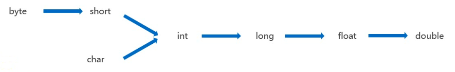

#### 计算机原理

- JDK：Java development kit，Java开发工具，包含了JRE和开发工具
- JRE：Java runtime environment，Java运行环境，包含JVM和Java的核心类库（Java API）
- JVM：Java virtual machine，Java虚拟机

#### 数据类型转换

- 自动类型转换：把一个数据范围小的数值或变量赋值给另一个表示数据范围更大的变量

- 强制类型转换：把一个表示数据范围大的数值或者变量赋值给另一个表示数据范围小的变量（可能导致数据丢失）
- - 格式：`数据类型 变量名= (数据类型)变量/值;`
  - 例如：`float f = (float)2.0;`
- char字符注意点：
  - `char c = 97;		//a`
  - `int c = 'a';		//97`

#### 键盘录入数据

步骤：

1. 导入包：`import java.util.Scanner;   //Scanner:JDK提供的一个可接受键盘输入数据的类`

2. 创建对象：`Scanner sc = new Scanner(System.in);   //sc：变量名`

3. 键盘输入数据：`int i = sc.nextInt();   //i：变量名` 

   ​					   	`String s = sc.next();   //s：变量名`

- **没有字符类型录入**

#### 算术运算符

- 算术运算符：+加、-减、*乘、/除、%取余
- 注意事项：

- - 整数计算的结果还是整数，如果要出现小数需要有小数参与运算
  - **byte、short、char类型在算术运算时会自动提升为int类型**【char类型体现为对应ascii表的数值】
  - 混合运算中，是先乘除后加减，可用()改变运算顺序

#### 字符串的拼接

- 任何类型的数据和字符串使用+操作都表示为拼接（注意：运算顺序，前运算后拼接）

#### 赋值运算符

- 赋值运算符：=等于、+=加等、-=减等、*=乘等、/=除等、%=取余等
- 运行流程：先把符号左边的变量和右边的数据进行运算，**再整体强制转换为左边的类型**，再把结果赋值给左边的变量
- **注意事项：拓展赋值运算符底层隐含了强制类型转换**，`c += x; ==> c = (变量c的数据类型)( c + x );`

#### 自增自减运算符

- ++加加运算符、--减减运算符
- **在参与运算中，++前置：先加一，后使用；后置++：先使用，后加一**

#### 关系运算符（比较运算符）

- 关系运算符：==等于、!=不等于、>大于、<小于、>=大于等于、<=小于等于

#### 逻辑运算符

- 逻辑运算符：&&与、||或、!非
- **短路效应：如果 && 的左边为false，则右边就不执行了；如果 || 的左边为ture，则右边就不执行了**，但如果使用的是&和|，则无论左边结果如何，右边仍会执行

#### 三元运算符

- 格式：`关系表达式 ? 表达式1 : 表达式2;`
- 运算方式：

- - 首先计算关系表达式的值，
  - 如果值为ture，则返回表达式1的值；
  - 如果值为false，则返回表达式2的值；

- 注意：三元运算必须要有应用（1、直接输出，2、使用变量接收【推荐】）