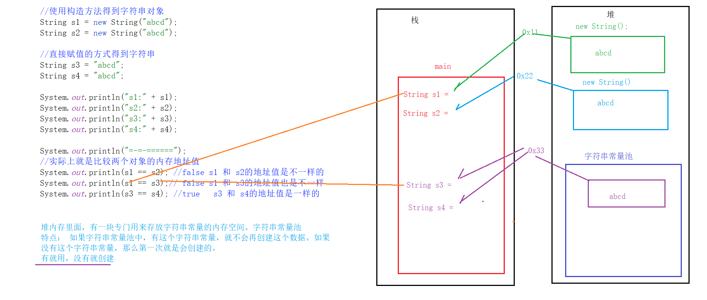

### API

#### String

- 位于java.base --> java.lang下（java.lang包内的不需要导包）

```java
//对象都是一个内存地址，只是在输出字符串时，选择输出的是内容
public static void main(String[] args){
    //使用构造方法得到字符串对象
    String s1 = new String("abcd");
    String s2 = new String("abcd");
    
    //直接赋值的方式得到字符串
    String s3 = "abcd";
    String s4 = "abcd";
    
    System.out.println("s1:" + s1);		//s1:abcd
    System.out.println("s2:" + s2);		//s2:abcd
    System.out.println("s3:" + s3);		//s3:abcd
    System.out.println("s4:" + s4);		//s4:abcd
    
    //实际上就是比较两个对象的内存地址值
    //通过构造方法创建的字符串对象，内容即便是相等的，地址值也是不一样的（每new一次就会得到一个新的地址）
    //通过直接赋值的方式得到的字符串对象，如果内容相同，那么地址值就是一样的（字符串是可以共享的）
    System.out.println(s1 == s2);	//false
    System.out.println(s1 == s3);	//false
    System.out.println(s3 == s4);	//ture
}
```

#### 字符串常量池



#### equals方法

- equals：boolean[返回值类型] equals(Object anObject)

  - 将此字符串与指定对象进行比较
  - 虽然Object可以代表所有的类型，但只有跟字符串类型比较时，才比较内容，否则一律返回false
  - 范例：

  ```java
  String s = "abcd";
  String s1 = new String("abcd");
  
  System.out.println(s == s1);		//false
  //运用equals对比字符串s和s1
  System.out.println(s.equals(s1));	//true
  ```


#### 字符串遍历

```java
String s = "abcde";
String s2 = "";
for (int i = s.length() - 1; i >= 0; i--) {
    //获取每一个字符
    char ch = s.charAt(i);
    s2 += ch;
}
System.out.println("字符串倒序" + s2);
```

#### StringBuilder

```java
public static void main(String[] args) {
    //创建StringBuilder对象
    StringBuilder s = new StringBuilder();
    s.append("一叶知秋");
    s.append('S');
    s.append(01);
    s.append(true);
    System.out.println("s：" + s);               //s：一叶知秋S1true

    //反转
    s.reverse();
    System.out.println("s：" + s);               //s：eurt1S秋知叶一

    //获取长度
    System.out.println("长度：" + s.length());    //长度：10

    //转化为String
    String str = s.toString();
    System.out.println("str：" + str);           //str：eurt1S秋知叶一
}
```

#### String和StringBuilder的转换

```java
public static void main(String[] args) {
    //String和StringBuilder的转换
    String s = "a";
    //字符串转换为StringBuilder
    StringBuilder sb = new StringBuilder("a");
    sb.append("b");
    sb.append("c");
    //StringBuilder转换为字符串
    String str = sb.toString();
}
```

