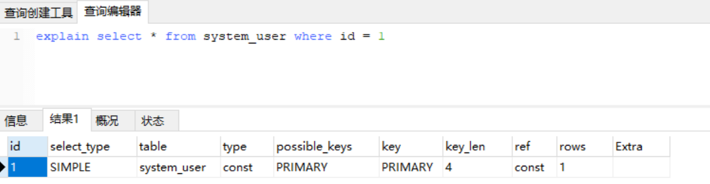

## MySQL体系结构


- 第一层：**网络连接层**

  - 主要是指数据库连接池，会负责处理所有客户端接入的工作

- 第二层：**核心服务层**

  - 主要包含SQL接口（接受SQL 命令，返回查询结果）、解析器、优化器以及缓存缓冲区四块区域

- 第三层：**存储引擎层**

  - 指MySQL支持的各大存储引擎，如MyISAM、InnoDB等

    - MyISAM：不支持事务和外键操作，访问快；适合查询以及插入为主的应用（5.5 之前版本默认存储引擎）
    - InnoDB：支持事务和外键操作，支持并发控制，占用磁盘空间大；适合频繁修改以及涉及到安全性较高的应用（5.5 之后版本默认存储引擎）
    - MEMORY：内存存储，速度快，不安全；适合小量快速访问的数据

  - 修改存储引擎

    ```mysql
    -- 修改存储引擎
    ALTER TABLE 表名 ENGINE = 引擎;
    ```

- 第四层：**系统文件层**

  - 涵盖了所有的配置、日志、数据、索引文件，位于系统硬盘上


## 常见优化方案

> 关键参数：TPS每秒执行的事务数；QPS每秒执行的SQL数（增删查改）

- 索引优化：添加适当索引
- sql语句优化：避免索引失效
- 关联查询：不允许超过3张表，对设计不合理的表进行优化合并
- 设计优化：表的设计要符合三范式（3NF），有时候要进行反三范式操作
- 架构优化：分表（水平分割、垂直分割），主从分离、读写分离
- 配置优化：对mysql配置进行优化（最大并发数、缓存大小）
- 使用其他存储方式：redis、mongodb、es、solr等
- 直接修改MySQL内核
- 硬件升级


## 索引

- 索引：==**是一种数据结构（B+Tree）**==，是对表的数据进行重新编排和建立目录映射

- 建立索引的目的：**减少磁盘IO次数，加快查询效率**

- 页(page)：内存操作的基本单位

  - 数据库对数据的读取并不是以行为单位进行的，无论是读取一行还是多行，都会将该行或者多行所在的页全部加载进来，然后再读取对应的数据记录；也就是说，读取所耗费的时间与行数无关，只与页数有关。页的大小通常为磁盘块大小的 2^n 倍。

    ```mysql
    -- 查询MySQL一页的大小
    SHOW GLOBAL STATUS LIKE 'innodb_page_size';
    ```

- 磁盘块(IO Block)：磁盘操作的基本单位
  
  - 系统从磁盘读取数据到内存时以磁盘块block为基本单位的，位于同一个磁盘块中的数据会被一次性读取出来，不是需要什么取什么
- 度(Degree)：节点的数据存储个数，一旦存储数据超过度值就要进行节点分裂


### 二叉树

- 每一个节点分别包含索引键和一个指向对应数据记录的物理地址的指针
- 缺点：磁盘IO的次数由树的高度来决定。二叉树只能存两个节点，层级越来越大越来越深，发生磁盘的IO会越频繁。


### B-Tree

- B-Tree即B树，又称为多路平衡查找树。每个节点包含key和data。
- 缺点：
  - B-Tree数据是存储到每个节点中，所以每次维护的时候就会维护索引值又维护了数据，这样会就是造成内存的浪费和性能的消耗。
  - 在B-Tree中每一个节点存储空间有限，如果data数据较大，会导致每个节点key太小，当数据量很大时也会导致B-Tree深度较大，增大查询的磁盘IO次数，影响查询效率。


### B+Tree

- 在B-Tree基础上进行优化，使其更适合实现外存储索引结构。InnoDB就是存储引擎就是用B+Tree。
- 在B+Tree中，所有数据记录节点都是按照键值大小顺序存放在同一层叶子节点上，而非叶子节点只存储key值信息，可以大大增大每个节点存储的key值的数量，降低B+Tree的高度。
  - 非叶子节点只存储key值
  - 所有数据存储在叶子节点
  - 所有叶子节点之间都有连接指针


### 非聚簇&聚簇

- 非聚簇：索引文件和数据文件是分离的。叶子节点存储的是数据的磁盘地址，非主键索引和主键索引类似。
  - MyISAM就是非聚簇的，其文件分为.frm 表结构文件、.MYD 表数据文件、.MYI 表索引文件。


- 聚簇：数据文件本身就是索引文件。
  - InnoDB就是聚簇的，其没有.MYD和.MYI，.frm文件（包括的数据结构和索引结构），其数据文件对应于ibdata(1..n)文件中。
  - 在开发过程中如果你使用的是Innodb引擎一定要建立一个主键列。


==面试题：==

- 对于InnoDB引擎如果不建立主键MySQL数据库会怎么处理？
  - MySQL会找唯一字段作为主键
  - 如果没有唯一字段MySQL会生成伪列当做主键，开发人员看不见
- 为什么主键使用UUID不好？为什么使用自增主键最好？
  - UUID是字符串，排序时需要计算字符串的ascii码值，降低效率
  - UUID不是连续的，增加数据时对B+树的改动较大，降低效率


### 索引优劣&注意事项

- 优势：
  - 唯一索引可以保证数据库表每一行的唯一性
  - 大大加快数据的查询速度
  - 加速表与表之间的连接
- 劣势：
  - 创建和维护索引会耗费时间，随着数据量的增加而增加
  - 除了数据表需要占用物理空间之外，每一个索引文件还会占用一定的物理空间
  - 当对表的数据进行INSERT，UPDATE，DELETE 的时候，索引也要动态的维护，这样就会降低增删改数据的速度
- **注意事项**：
  - 建立索引后需要注意的问题
    - 增，删，改都会触发索引重建，并且会产生锁
    - 删除尽量逻辑删除，不要物理删除，防止索引重建
    - 尽量不要更新索引的列，经常频繁更新的列不要建立索引
  - 哪些列适合建立索引
    - 不经常变动的列：主键、电话、手机号、邮箱、订单编号、身份证
  - 哪些列不适合建立索引
    - 经常变动的列：用户名、余额
    - 数据较为单一，存在大量重复数据的列：年龄、性别、状态（表中某列的去重数/表总记录数 == 1(接近1)，那么这种列就特别适合建立索引）


### 索引分类

- **主键索引**：primary key（不为空且唯一）
- **唯一索引**：unique index（唯一）
- **普通索引**：index
- **联合索引**：
  - primary key(id, name)：联合主键索引
  - unique index(id, name)：联合唯一索引
  - index(id, name)：联合普通索引
- 全文索引：fulltext index(字段名)：用于搜索很长一篇文章的时候，效果比较好（最好还是用全文搜索服务Elasticsearch、solr来解决）


### 索引的操作

- 查看索引

  ```mysql
  -- SHOW INDEX FROM 表名
  show index from system_user;
  ```

- 创建索引

  ```mysql
  -- 创建主键索引: alter table 表名 add primary key(列名)
  ALTER TABLE goods ADD PRIMARY KEY (id);
  
  -- 创建唯一索引: CREATE UNIQUE INDEX 索引名 ON 表名(列名)
  CREATE UNIQUE INDEX idx_name ON goods(NAME);
  
  -- 创建普通索引: CREATE INDEX 索引名 ON 表名(列名)
  CREATE INDEX idx_price ON goods(price);
  ```

- 删除索引

  ```mysql
  -- 删除主键索引(非自增长): alter table 表名 drop primary key
  ALTER TABLE goods DROP PRIMARY KEY;
  
  -- 删除唯一索引和普通索引: DROP INDEX 索引名 ON 表名
  DROP INDEX idx_name ON goods;
  DROP INDEX idx_price ON goods;
  ```

- 查看索引详情

  ```mysql
  -- SHOW INDEX FROM 表名
  show index from system_user;
  ```

  

  - **Table**: 表的名称
  - Non_unique: 如果索引不能包括重复词则为0，如果可以重复则为1
  - **Key_name**: 索引的名称
  - Seq_in_index: 索引中的序列号，从1开始
  - **Column_name**: 索引字段的列名称
  - Collation: 列以什么方式存储在索引中。在MySQL中，‘A’(升序)或NULL(无分类)
  - **Cardinality**: 基数。基数越大，越适合建立索引，当进行查询时，MySQL使用该索引的机会就越大
  - Sub_part: 如果列只是被部分地编入索引，则为被编入索引的字符的数目。如果整列被编入索引，则为NULL
  - Packed: 关键字如何被压缩。如果没有被压缩，则为NULL
  - Null: 如果列含有NULL，则含有YES。如果没有，则该列含有NO
  - **Index_type**: 索引存储数据结构（BTREE, FULLTEXT, HASH, RTREE）
  - Comment: 评论


### 执行计划Explain

- 语法：使用Explain关键字放到sql语句前`explain select * from system_user where id = 1;`
- 作用
  - 可以知道SQL语句的执行顺序
  - 可以知道SQL查询语句是否命中索引
  - 可以分析查询语句或表结构的性能瓶颈

#### 详解



| 列名          | 说明                                                         |
| ------------- | ------------------------------------------------------------ |
| ==id==        | 查询标识符，SQL执行的顺序标识符，SQL从大到小的执行。         |
| select_type   | 显示本行是简单或复杂查询。如果查询有任何复杂的子查询，则最外层标记为PRIMARY（DERIVED、UNION、UNION RESUlT） |
| ==table==     | 访问哪张表                                                   |
| partitions    | 在分区数据库中，一个表可以分布在一个或多个数据库分区中       |
| ==type==      | 访问类型（ALL、index、range、ref、eq_ref、const、system）    |
| possible_keys | 显示MySQL可能采用哪些索引来优化查询                          |
| ==key==       | 显示MySQL决定采用哪个索引来优化查询                          |
| ==key_len==   | 显示索引所使用的字节数，索引长度越小效率越高                 |
| ref           | 显示查询时所引用到的索引（关联查询）                         |
| ==rows==      | 粗略估算整个查询需要检查的行数（如果值越大，查询速度就越慢） |
| filtered      | 过滤行的百分比                                               |
| Extra         | 额外信息（用了where条件、用了排序、用了分组）等              |


**id**

- id值相同，从上到下执行。一般查的第一张表为数据量最小的表。
- id值不同，由大到小执行。


**select_type 查询类型**

> union: 取并集，过滤重复。（如果两条SQL语句出现相同的就会过滤掉）
>
> union all: 取并集，不过滤重复。

- 主要用来区分是普通查询、联合查询、子查询等

  | 查询类型     | 说明                                                         |
  | ------------ | ------------------------------------------------------------ |
  | SIMPLE       | 简单查询，查询中不包含子查询或者union                        |
  | PRIMARY      | 查询中如果包含子查询或union，最外层查询则被标记为primary     |
  | SUBQUERY     | 查询时包含了子查询                                           |
  | DERIVED      | from列表中包含了子查询就会标记为derived(派生表)，查询结果放在临时表中 |
  | UNION        | 查询时包含了union查询                                        |
  | UNION RESULT | UNION合并的结果集                                            |


==**type 访问类型**==

> 一般来说，保证查询至少达到range级别，最好能达到ref级别
>
> 数据很少的情况下，MySQL优化器可能会直接走表查询而不会走索引查询。因为MySQL优化器觉得走表或走索引是差不多的

- 衡量你的sql语句性能好坏的参考指标，<font color="red">**以消除ALL为己任**</font>，如果出现ALL代表没有命中索引，是全表查询


**rows 检查行数**

- 它体现建立索引以后，优化的行数，越小速度越快，如果你建立索引，type=ref并且也命中到了，但是row还很大，那说明该表已经没有建立索引的意义了，已经优化到了极限(索引不是万能的)，你需要通过其它持术手段来优化。比如：分库分表、缓存、把数据迁移到es/solr


### 避免索引失效

- 使用索引列进行查询
- 联合索引：采用最左匹配原则
  - 最左边的索引没用到，则失效（无关顺序）；中间断了，则后面的索引也失效
- 索引列最好不要出现范围条件、比较运算符!=、<>、>、>=、or、is not null、内置函数，数据类型要匹配
- 如果采用like模糊查询，%要在后面


### 索引的选择

#### 建立索引的时机

- 在中小型公司，刚开始开发项目的时候不需要关注太多的性能问题，一般不去建立索引。
- 项目上线运行一段时间，刚开始查询很快，后面就查询很慢，可能需要考虑建立索引。
- 用工具分析慢查询SQL日志文件，如果有查询慢的SQL，把慢查询SQL通过explain执行计划进行分析，然后建立相关的索引。 
- 当你发现一张表的数据量，每天增长的非常大，那这个也需要考虑建立索引了。千万不要等到数据达到几百万甚至上千万的时候去建立索引。
- 如果表的数据量不是很大（几千，几万，几十万）这种表就不需要建立索引。

#### 适合建立索引

+ 表的主键列(primary key)
+ 频繁作为查询条件的列应该创建索引(比如银行系统银行帐号，电信系统的手机号)
+ 查询中与其它表关联的列，外键关系建立索引(比如员工表的部门外键)
+ 查询中排序的列，排序列若通过索引去访问将大大提升排序速度(索引能够提高检索速度和排序速度)
+ 查询中统计或分组的列

#### 不适合建立索引 

+ 记录比较少的表
+ 频繁更新的列不适合建立索引(每次更新不单单更新数据，还要更新索引)
+ where条件里用不到的列
+ 数据重复的列，如果某列包含了许多重复的内容，比如表中的某列为国籍、性别、数据的差异率不高，这种列建立索引就没有太大的意义


## MySQL语句优化

### 排序与分组优化

> 如果排序的字段没有建立索引，会使用文件排序（USING filesort），文件排序的效率是相对较低的。目标就是消灭 Using filesort，避免排序时使用文件排序。
>
> **注意: order by本身是不会走索引，如果你想要order by走索引，那么必须前面的where一定要有索引，并且遵循最左匹配原则。**


**注意点**：

- 联合索引在order by后面顺序不一致，会触发**文件排序**
- 排序时的顺序使用一升一降，会触发**文件排序**


### 大数据量分页优化

#### 业务上尽量避免

- 用户实际上是不会查看完所有内容的，只需要将重点部分和用户感兴趣的部分进行展示即可

#### 使用ID限定

```mysql
-- 使用id限定方案，将上一页的ID传递过来，根据id范围进行分页查询
-- 通过程序的设计，持续保留上一页的ID，并且ID保证自增
-- limit 3000000,20 时间: 2.266s -> 时间: 0.005s (使用条件有些苛刻 但效率非常高)
select * from system_user where id > 3000000 limit 20;
```

#### 子查询优化（存疑）

```mysql
-- 通过explain发现，之前我们没有利用到索引，这次我们利用索引查询出对应的所有ID
-- 在通过关联查询，查询出对应的全部数据，性能有了明显提升(失去了默认的按主键id排序)
-- limit 3000000,20 时间:  2.251s -> 时间: 1.364s
explain select * from system_user u, (select id from system_user limit 3000000, 20) t where u.id = t.id;

-- 需要指定id排序
explain select * from system_user u, (select id from system_user ORDER by id limit 3000000, 20) t where u.id = t.id;
```


### 小表驱动大表

> MySQL表关联的算法是 Nest Loop Join(嵌套循环连接)，是通过驱动表的结果集作为循环基础数据，然后一条一条地通过该结果集中的数据作为过滤条件到下一个表中查询数据，然后合并结果。如果小的循环在外层，外层表只需要锁5次，如果1000在外，则需要锁1000次，从而浪费资源，增加消耗。这就是为什么要小表驱动大表。


+ 当外表数据多于内表中的数据时，使用in
+ 当外表数据小于内表中的数据时，使用exists
+ 如果两张表数据量差不多，那么它们的执行性能差不多


#### in&exists

```mysql
-- 使用in 时间: 8.292ms
select * from system_user where id in (select id from department);

使用department表中数据作为外层循环 5次
for(select id from department d)
	每次循环执行employee表中的查询 300万次
	for( select * from system_user e where e.dep_id=d.id)
```

```mysql
-- 使用exists 时间: 14.771ms
SELECT * FROM system_user s WHERE EXISTS (SELECT 1 FROM department d WHERE d.id = s.id);

使用employee表中数据作为外层循环 300万次
for(select * from system_user e)
	每次循环执行department表中的查询 5次
	for( select 1 from department d where d.id = e.dep_id)
```


## 慢查询性能分析

- 开启慢查询日志

  ```mysql
  -- 查看慢查询日志变量
  show variables like '%slow_query_log%';
  show variables like '%slow_query_log_file%';
  show variables like '%long_query_time%';
  
  -- 开启方式一: 只对当前数据库生效，MySQL重启后，会失效 0=OFF 1=ON
  set global slow_query_log=1;
  ```

  ```ini
  # 开启方式二: 想永久生效，修改配置文件my.ini，然后重启MySQL(推荐)
  # 开启MySQL慢查询日志,要配置在[mysqld]下方
  slow_query_log=1
  slow_query_log_file=F:/mysqlslowquery.log
  # 设置慢查询的阈值(默认: 10s)
  long_query_time=0.2
  ```


- 慢查询日志分析

  > 如何找到查询慢的SQL，以及如何优化？
  >
  > 1. 开启慢查询日志(DBA)
  >
  > 2. 查找慢查询SQL
  >
  > 3. explain进行慢查询SQL分析
  >
  > 4. SQL语句调优，数据库服务器参数调优(DBA)

  

  - 可以通过慢查询日志工具进行分析，MySQL默认安装了mysqldumpslow.pl工具实现对慢查询日志信息的分析

    ```sql
    -- 得到返回记录集最多的10个SQL。
    perl mysqldumpslow.pl -s r -t 10 F:\mysqlslowquery.log
    -- 得到访问次数最多的10个SQL
    perl mysqldumpslow.pl -s c -t 10 F:\mysqlslowquery.log
    
    Count: 2（执行了多少次）
    Time=6.99s(13s) 平均执行的时间（总的执行时间）
    Lock=0.00s(0s)（等待锁的时间）
    Rows=1661268.0（每次返回的记录数） (3322536)（总共返回的记录数)
    username[password]@[localhost]
    ```

  - 参数说明

    ```
    -s 按照那种方式排序
       c: 访问统计
       l: 锁定时间
       r: 返回记录
       al: 平均锁定时间
       ar: 平均访问记录数
       at: 平均查询时间
       
    -t 是top，返回多少条数据。
    
    -g 可以跟上正则匹配模式，大小写不敏感。
    ```


## 常见面试题

+ 问题1: 下面查询语句，索引的使用情况?

  ```sql
  -- 建立联合索引(a,b,c)，请说出下列条件的索引使用情况
  select * from table where a=4 
   	使用到索引a
   	
  select * from table where a=4 and b=6 
  	使用到了索引a,b
  	
  select * from table where a=4 and c=5 and b=6 
  	使用到了索引a,b,c
  	
  select * from table where b=4 or b=5 
  	没使用到索引
  	
  select * from table where a=4 and c=6 
  	使用到索引a
  	
  select * from table where a=4 and b>5 and c=6 
  	使用到索引a,b
  	
  select * from table where a=4 and b like 'test%' and c=6
  	使用索引a,b b条件相当于范围查询
  	
  select * from table where a=4 order by b,c
  	使用到索引a 不会产生Using FileSort
  	
  select * from table where b=5 order by a
  	没使用索引 产生Using Filesort
  	
  select * from table where b=5 order by c
  	没使用索引 产生Using Filesort
  	
  select * from table where a=5 group by b,c
  	使用索引a 不会产生Using temporary
  ```

+ 问题2: 什么是索引?

  ```txt
  数据库索引的本质是: 数据结构 是一种b+tree的数据结构，它有二叉树的特征，同时解决平衡和深度的问题，这种数据结构能够帮助我们快速的获取数据库中的数据。
  ```

+ 问题3: 索引的作用?

  ```txt
  当表中的数据量越来越大时，索引对于性能的影响愈发重要。索引优化应该是对查询性能优化最有效的手段。索引能够轻易将查询性能提高好几倍。有了索引相当于我们给数据库的数据加了目录一样，可以快速的找到数据，简单来说是提高数据查询的效率。
  ```

+ 问题4: 索引的分类?

  ```txt
  1.普通索引
  2.主键索引
  3.唯一索引
  4.联合索引（组合索引）
  5.全文索引
  ```

+ 问题5: 索引的原理?

  ```txt
  索引的实现本质上是为了让数据库能够快速查找数据，而单独维护的数据结构，mysql实现索引主要使用的两种数据结构: hash 和 B+Tree，我们比较常用的MyISAM和InnoDB存储引擎都是基于B+Tree的。
  
  hash:（hash索引在MySQL比较少用）他以把数据的索引以hash形式组织起来，因此当查找某一条记录的时候，速度非常快。但是因为是hash结构，每个键只对应一个值，而且是散列的方式分布，所以他并不支持范围查找和排序等功能。
  
  B+树:B+Tree是(MySQL使用最频繁的一个索引数据结构)数据结构，B+Tree每个节点可以存放多个数据，相比二叉树，树的高度更低，磁盘IO更少，查询效率更高。因为是树型结构，所以更适合用来处理排序，范围查找等功能。
  ```

+ 问题6: 索引的优点?

  ```txt
  1. 可以通过建立唯一索引或者主键索引,保证数据库表中每一行数据的唯一性。
  2. 建立索引,可以大大提高检索的数据,以及减少表的检索行数。
  3. 建立索引,在表连接条件时,可以加速表与表直接的相连。
  4. 建立索引,在分组和排序时,可以减少查询时分组和排序所消耗的时间。
  5. 建立索引,在查询中使用索引可以提高性能。
  ```

+ 问题7: 索引的缺点?

  ```txt
  1. 在创建索引和维护索引时,会耗费时间,随着数据量的增加而增加。
  2. 索引文件会占用物理空间,除了数据表需要占用物理空间之外,每一个索引还会占用一定的物理空间。
  3. 当对表进行INSERT,UPDATE,DELETE的时候,索引也要维护,这样就会降低数据的维护速度(建立索引会占用磁盘空间的索引文件。一般情况这个问题不太严重，但如果你在一个大表上创建了多种组合索引，索引文件的会膨胀很快)。
  ```

+ 问题8: 如何分析索引使用情况?

  ```txt
  explain显示了MySQL如何使用索引来处理select语句以及连接表。可以帮助选择更好的索引和写出更优化的查询语句。简单讲，它的作用就是分析查询性能。explain关键字的使用方法很简单，就是把它放在select查询语句的前面。MySQL查看是否使用索引，简单的看type类型就可以。如果它是all，那说明这条查询语句遍历了所有的行，并没有使用到索引。
  ```

+ 问题9: 哪些字段适合加索引?

  ```txt
  1. 在经常需要搜索的列上添加索引,可以加快搜索的速度。
  2. 主键列上可以确保列的唯一性。
  3. 在表与表的而连接条件上加上索引,可以加快连接查询的速度。
  4. 在经常需要排序(order by),分组(group by)和的distinct列上加索引可以加快排序查询的时间。
  ```

+ 问题10: 哪些字段不适合加索引

  ```txt
  1. 查询中很少使用到的列不应该创建索引,如果建立了索引然而还会降低mysql的性能和增大了空间需求。
  2. 很少数据的列也不应该建立索引,比如一个性别字段0或者1,在查询中,结果集的数据占了表中数据行的比例比较大,MySQL需要扫描的行数很多,增加索引,并不能提高效率。
  3. 定义为text和image和bit数据类型的列不应该增加索引。
  4. 当表的修改(UPDATE,INSERT,DELETE)操作远远大于检索(SELECT)操作时不应该创建索引,这两个操作是互斥的关系。
  ```

+ 问题11: 哪些情况会造成索引失效?

  ```txt
  1. 如果条件中有or，即使其中有条件带索引也不会使用(这也是为什么尽量少用or的原因)。
  2. 索引字段的值不能有null值，有null值会使该列索引失效。
  3. 对于联合索引，不是使用的第一部分，则不会使用索引（最左原则）。
  4. like查询以%开头。
  5. 如果列类型是字符串，那一定要在条件中将数据使用单引号引用起来,否则不使用索引。
  6. 在索引的列上使用表达式或者函数会使索引失效。
  ```

+ 问题12: 联合索引最左原则?

  ```txt
  在MySQL建立联合索引时会遵循最左前缀匹配的原则，即最左优先，在检索数据时从联合索引的最左边开始匹配，组合索引的第一个字段必须出现在查询组句中，这个索引才会被用到, 如创建组合索引a,b,c那么查询条件中只使用b和c是使用不到索引的。
  ```

+ 问题13: 聚簇索引和非聚簇索引?

  ```txt
  1. MyISAM——非聚簇索引
     MyISAM存储引擎采用的是非聚簇索引，非聚簇索引的数据表和索引表是分开存储的。非聚簇索引的主键索引和辅助索引几乎是一样的，只是主索引不允许重复，不允许空值，他们的叶子结点的key都存储指向键值对应的数据的物理地址。
  
  2. InnoDB——聚簇索引
     聚簇索引的数据和主键索引存储在一起，主键索引的叶子结点存储的是键值对应的数据本身，辅助索引的叶子结点存储的是键值对应的数据的主键键值。因此主键的值长度越小越好，类型越简单越好。
  ```

+ 问题14: in和exists区别?

  ```txt
  1.当A表数据多于B表中的数据时，使用in优于exists。
  2.当A表数据小于B表中的数据时，使用exists优于in。
  3.如果两张表数据量差不多，那么它们的执行性能差不多。
  ```

+ 问题15: 我有三个表 A,B,C 现在有一个select * from A,B,C你能告诉我？A,B,C三个表在查询的的执行顺序是什么?

  ```txt
  一定通过explain查询id的值才能决定。如果排id相同那么至上而下运行。如果id不同，大的先执行。
  ```

+ 问题16: like查询中哪那些会走索引那些不会走索引？

  ```sql
  -- b 建立了一个索引
  select * from table where b like '%xxxx%' -- 不会
  select * from table where b like 'xxxx%'  -- 会
  select * from table where  b like '%xxxx' -- 不会
  ```

+ 问题17: MySQL事务隔离级别?


+ 问题18: MySQL中锁的分类?

  ```txt
  1.按操作分: 读锁(共享锁)、写锁(排它锁)
  2.按粒度分: 表锁、页锁、行锁  MySQL一页是16kB
  3.思想的层面分: 悲观锁、乐观锁
  ```

+ 问题19: MySQL中有几种连接查询?

  ```txt
  1. 内连接(inner join): 只有两个元素表相匹配的才能在结果集中显示。
  	
  2. 外连接：
     2.1 左外连接(left join): 左边为驱动表，驱动表的数据全部显示，匹配表的不匹配的不会显示。
     2.2 右外连接(right join): 右边为驱动表，驱动表的数据全部显示，匹配表的不匹配的不会显示。
     
     union:	联合查询,将多个查询的结果组合在一起, 去重
     union all: 联合查询,将多个查询的结果组合在一起, 不去重
  ```

+ 问题20: MySQL如何综合性优化?

  ```txt
  1.选择表合适存储引擎: 
    MyISAM: 以读和插入操作为主，只有少量的更新和删除，并且对事务的完整性，并发性要求不是很高的。
    InnoDB: 事务处理，以及并发条件下要求数据的一致性。除了插入和查询外，包括很多的更新和删除。
  
  1.1 合理的设计表(满足3范式)
  
  2.索引优化: 
    -- 表一定要建立主键索引。
    -- 数据量大的表应该有索引。
    -- 经常与其他表进行连接的表，在连接字段上应该建立索引。
    -- 经常出现在Where子句中的字段，特别是大表的字段，应该建立索引。
    -- 索引应该建在选择性高的字段上（sex 性别这种就不适合）。
    -- 索引应该建在小字段上，对于大的文本字段甚至超长字段，不要建索引。
    -- 频繁进行数据操作的表，不要建立太多的索引。
    -- 删除无用的索引，避免对执行计划造成负面影响。
  
  3.sql语句优化:
    -- SELECT语句务必指明列的名称（避免直接使用select * ）
    -- SQL语句要避免造成索引失效的写法
    -- SQL语句中IN包含的值不应过多
    -- 如果排序字段没有用到索引，就尽量少排序
    -- 尽量少用or
    -- 尽量用union all代替 union
    -- 避免在where子句中对字段进行null值判断
    -- 不建议使用%前缀模糊查询
    -- 避免在where子句中对列进行表达式或函数操作
  
  4.缓存优化:
     为了提高查询速度，我们可以通过不同的方式去缓存我们的结果从而提高响应效率。当我们的数据库打开了Query Cache（简称QC）功能后，数据库在执行SELECT语句时，会将其结果放到QC中，当下一次处理同样的SELECT请求时，数据库就会从QC取得结果，而不需要去数据表中查询。如果缓存命中率非常高的话，有测试表明在极端情况下可以提高效率238%。
  
  5.读写分离:
    如果数据库的使用场景读的操作比较多的时候，为了避免写的操作所造成的性能影响 可以采用读写分离的架构，读写分离，解决的是，数据库的写入，影响了查询的效率。读写分离的基本原理是让主数据库处理事务性增、改、删操作（INSERT、UPDATE、DELETE），而从数据库处理SELECT查询操作。
  
  6.MySQL的分库分表:
    数据量越来越大时，单体数据库无法满足要求，可以考虑分库分表
    两种拆分方案：
       垂直拆分, 水平拆分
       表的垂直拆分:就是把原来一个有很多列的表拆分成多个表。
       通常垂直拆分可以按以下原则进行：
  		1、把不常用的字段表单独存放到一个表中。
  		2、把大字段独立存放到一个表中。
  	3、把经常一起使用的字段放到一起。
  	
  	表的水平拆分: 是为了解决单表数据量过大的问题，水平拆分的表每一个表的结构都是完全一致的，将数据平均分为N份
  	
    分库分表常用中间件: MyCat、Sharding-JDBC
  
  运维
  修改数据库的配置
  
  增加硬件
  ```


