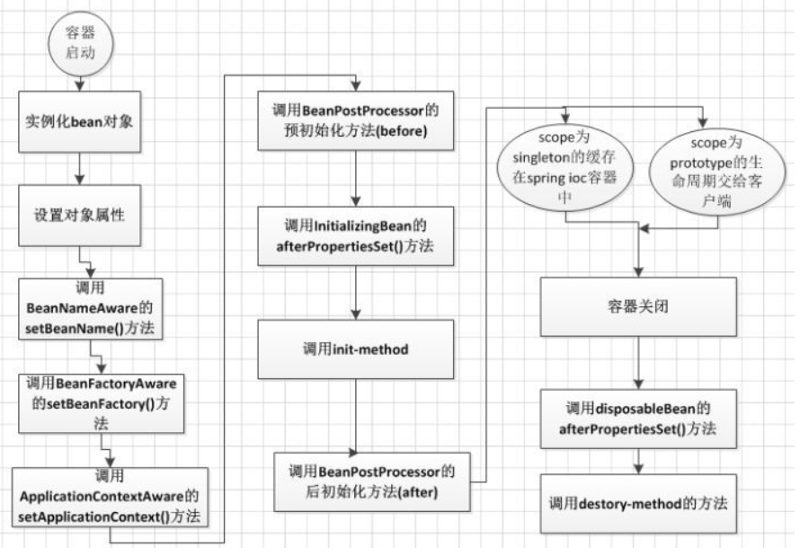
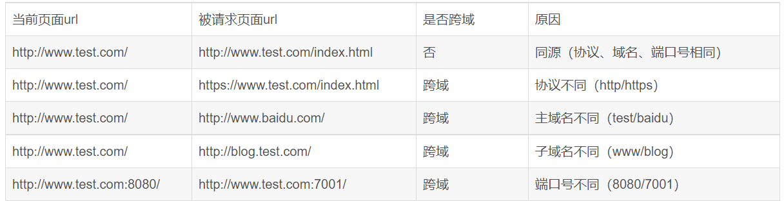
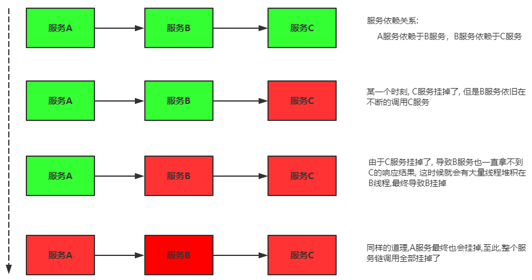
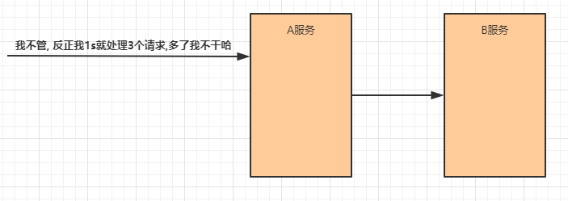
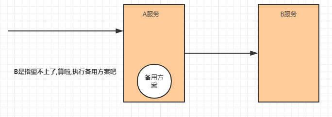

# Spring

## 谈一谈对IOC理解

~~~markdown
1. IOC，翻译过来是控制反转，它是一种解耦合的设计思想
2. IOC的核心点就是将原本在程序中手动创建对象的控制权，交由给Spring框架来管理
3. 当程序中需要一个对象时，不再使用new的方式主动创建，而是从Spring容器中直接获取，而容器会使用工厂模式为我们创建需要的对象
4. 而且容器中的对象如果依赖于其他对象，Spring会基于DI的思想，自动完成对象间的依赖注入
~~~

## Bean有几种注入方式

~~~markdown
* 在IOC中对象依赖依赖注入主要有两种方式
1. 构造器依赖注入：实际上就是在容器中通过触发一个类的构造器来实现的
2. Setter方法注入：实际上就是在容器中先创建类的对象之后，再调用对象的Setter方法进行属性赋值
~~~

## Bean作用域有几种

~~~markdown
* Spring框架支持多种bean的作用域，常见的有下面几种
1. singleton：单例模式，对象仅仅创建一次，然后一直存在于容器中
2. prototype：多例模式，每次获取对象的时候，容器都会创建一个新对象
3. request：每一次HTTP请求都会产生一个新的对象，该对象仅在当前请求内有效
4. session：每一次HTTP会话都会产生一个新的对象，该对象仅在当前会话内有效
~~~

## bean是线程安全的吗

~~~markdown
1. 多例对象每次获取都会创建新实例，也就是说线程之间不存在Bean共享问题，也就不存在线程安全问题
2. 单例对象是所有线程共享一个实例，因此就可能会存在线程安全问题。但是单例对象又分为无状态和有状态。
	只对对象的成员变量进行查询操作，不会修改成员变量的值，这样的Bean称之为无状态Bean，无状态的单例Bean是不存在线程安全问题的
	但是，如果需要对Bean中的成员变量进行数据更新操作，这样的Bean称之为有状态Bean，有状态的单例Bean就可能存在线程安全问题
	所以，最终我们得出结论，在Spring中，只有有状态的单例Bean才会存在线程安全问题。
3. 处理有状态单例Bean的线程安全问题有以下两种方法：
	1）将Bean的作用域由singleton（单例）改为prototype（多例）
	2）在类中定义ThreadLocal的成员变量，并将需要的可变成员变量保存在ThreadLocal中， ThreadLocal本身就具备线程隔离的特性
	   这就相当于为每个线程提供了一个独立的变量副本，每个线程只需要操作自己的线程副本变量，从而解决线程安全问题。
~~~

## 谈一谈对AOP理解

~~~markdown
1. AOP，翻译过来是面向切面编程，核心思想是将那些与业务无关，却为业务模块所共同调用的逻辑（例如事务处理、日志管理）封装起来
2. 使用AOP可以减少系统的重复代码，降低模块间的耦合度，并有利于扩展和维护
3. Spring AOP是基于动态代理的，它底层同时支持JDK和CGLIB的代理方式，并且会根据被代理类是否有接口自动选择最合适的代理方式
4. AOP的主要使用场景有：事务管理、日志、性能监视、安全检查
~~~

> ==ps: 如果让谈一谈对Spring的框架的理解，就将上面IOC和AOP两部分合起来回答==

## AOP的代理有几种方式

~~~markdown
* AOP思想的实现一般都是基于代理模式，在Java中一般采用JDK动态代理模式和CGLIB动态代理模式
1. JDK动态代理模式只能对有接口的类进行代理，所以当一个被代理类有接口时，就可以使用JDK动态代理
2. CGLIB可以对任意的类进行动态代理，但是效率上不如JDK，所以当一个被代理类没有接口时，就可以使用CGLIB动态代理
* 不过这个选择过程对开发者完全透明，Spring底层会自动选择实现，开发者也无需关心
~~~

## AOP中有哪些核心概念

~~~markdown
1. 目标对象：被切面所通知的对象，或者说被代理的对象，也可以称为要进行功能增强的对象
2. 连接点：程序执行过程中的某一行为，大部分情况下是指目标对象中的所有方法
3. 切入点：要进行功能增强的那部分代码
4. 增强：对目标对象要添加的那段功能
5. 代理对象：经过功能增强之后的对象
6. 织入：将增强方法拼接到切点方法上的动作
7. 切面：一种对增强方法和切点执行顺序的定义
~~~

## Spring支持的通知类型

~~~markdown
* 通知是个在方法执行前或执行后要做的动作，实际上是程序执行时要通过SpringAOP框架触发的代码段。 Spring切面可以应用五种类型的通知：
1. 前置通知：在某切点之前执行的通知
2. 返回后通知：在某切点正常完成后执行的通知，不包括抛出异常的情况
3. 抛出异常后通知：在某切点抛出异常退出时执行的通知
4. 后置通知：在某切点退出的时候执行的通知（不论是正常返回还是异常退出）
5. 环绕通知：包围一个切点的通知
~~~

## Spring支持的事务管理方式

~~~markdown
* Spring支持编程式事务和声明式事务
1. 编程式事务：在代码中硬编码，此方式的缺点是代码耦合，复用性低；优点是可以精确控制要增强的代码（不仅仅限于方法粒度）
2. 声明式事务：是AOP思想的一种应用，将业务方法作为切点，将事务处理方法作为增强，通过动态代理实现事务的管理，此方是优缺点与编程式恰好相反
~~~

## Spring支持的事务传播行为

~~~markdown
* 事务传播行为是为了解决业务层方法之间互相调用的事务问题。当事务方法被另一事务方法调用时，必须指定事务应该如何传播。
* 例如：方法可能继续在现有事务中运行，也可能开启一个新事务，并在自己的事务中运行。
* Spring支持7个种事务传播行为的：
1. PROPAGATION_REQUIRED（必须）：如果当前存在事务，则加入该事务；如果当前没有事务，则创建一个新的事务
2. PROPAGATION_SUPPORTS（支持）：如果当前存在事务，则加入该事务；如果当前没有事务，则以非事务的方式继续运行
3. PROPAGATION_MANDATORY（强制）：如果当前存在事务，则加入该事务；如果当前没有事务，则抛出异常
4. PROPAGATION_REQUIRES_NEW（必须新）：创建一个新的事务，如果当前存在事务，则把当前事务挂起
5. PROPAGATION_NOT_SUPPORTED（不支持）：以非事务方式运行，如果当前存在事务，则把当前事务挂起
6. PROPAGATION_NEVER（强制没有）：以非事务方式运行，如果当前存在事务，则抛出异常
7. PROPAGATION_NESTED（嵌套）：如果当前存在事务，则创建一个事务作为当前事务的嵌套事务来运行；如果当前没有事务，则创建一个事务
	嵌套事务是已存在事务的一个子事务，嵌套事务开始执行时，将取得一个保存点，如果这个嵌套事务失败，将回滚到此保存点
	嵌套事务是外部事务的一部分，只有外部事务结束后它才会被提交
~~~

## Spring中的设计模式

~~~markdown
1. 工厂模式：Spring使用工厂模式通过BeanFactory和ApplicationContext创建bean对象
2. 单例模式：Spring中的bean默认都是单例的
3. 代理模式：Spring的AOP功能用到了JDK的动态代理和CGLIB字节码生成技术
4. 模板方法：用来解决代码重复的问题。比如 RestTemplate、jdbcTemplate
5. 适配器模式：SpringAOP的增强或通知使用到了适配器模式
6. 观察者模式：Spring事件驱动模型，如Spring的实现ApplicationListener
~~~

## BeanFactory与AppliacationContext的区别

~~~markdown
* BeanFactory: 最基础的IOC容器，功能相对简单，默认采用延迟初始化策略，也就是容器启动时不创建对象，第一次获取的时候才创建
* ApplicationContext：在BeanFactory的基础上构建，是相对比较高级的容器实现，此容器一般在启动的时候就会创建出所有的对象
~~~

## Spring的常用注解有哪些

~~~markdown
1. 用于向容器中注册对象：@Component、@Controller、@Service、@Repository、@Bean、@Import

2. 用于容器中对象属性的依赖注入： @Autowired、@Qualifier、@Value

3. 组件扫描：@ComponentScan

4. 声明配置类：@Configuration

5. 声明式事务：@Transactional
~~~

## @Resources和@Autowired的区别

~~~markdown
* @Resources和@Autowired都是用来实现自动装配的，主要区别点如下：
1. 提供者不同：@Resources由JDK提供，@Autowired由Spring框架提供
2. 装配顺序不同： 
	@Autowired默认先按类型装配，如果同一个类型的对象有多个，再按照name选择其中一个，或者使用@Qualifier指定其中一个
	@Resource默认是按照名称来装配注入的，只有当找不到与名称匹配的bean才会按照类型来装配注入
~~~

## Spring中bean的生命周期

~~~markdown
* ApplicationContext容器中，Bean的生命周期流程如上图所示，流程大致如下：
1. 首先容器启动后，对bean进行实例化
2. 按照Bean定义信息配置信息，注入所有的属性
3. 如果Bean实现了一些Aware接口，则调用对应的回调方法，在回调方法中可以完成一些对对象的操作
4. 如果Bean实现BeanPostProcessor接口，则调用对应的回调方法，在回调方法中可以完成前置操作
5. 如果Bean实现了InitializingBean接口，则会回调该接口的afterPropertiesSet()方法
6. 如果Bean配置了init-method方法，则会执行init-method配置的方法
7. 如果Bean实现了BeanPostProcessor接口，则调用对应的回调方法，在回调方法中可以完成后置操作
8. 至此就可以正式使用该Bean了，对于单例bean缓存到容器；多例bean返回给客户端
9. 容器关闭后，如果Bean实现了DisposableBean接口，则会回调该接口的destroy()方法
10. 如果Bean配置了destroy-method方法，则会执行destroy-method配置的方法
* 至此，整个Bean的生命周期结束，总结以上步骤，核心主干主要就是五部分构成：
1. 实例化
2. 赋值
3. 初始化
4. 使用
5. 销毁
~~~

 


# SpringMVC

## 什么是MVC模式

~~~markdown
* MVC是Model-View-Controller（模型-视图-控制器）的简称，其主要作用是将视图展示和业务控制代码分离开来。
* Model（模型）: 指的就是数据或者数据的来源
* View （视图）: 指的就是可视化界面
* Controller（控制器）: 控制器作用于模型和视图上，负责请求的调度，它使视图与模型分离开来
~~~

## SpringMVC的执行流程

 

~~~markdown
1. 用户点击某个请求路径，发起一个request请求，此请求会被前端控制器处理
2. 前端控制器请求处理器映射器去查找Handler
3. 处理器映射器根据配置找到相应的Handler(可能包含若干个Interceptor拦截器)，返回给前端控制器
4. 前端控制器请求处理器适配器去执行相应的Handler处理器（常称为Controller）。
5. 处理器适配器执行Handler处理器
6. Handler处理器执行完毕之后会返回一个ModelAndView对象（包括Model数据模型和View视图信息）
7. 处理器适配器接收到Handler处理器返回的ModelAndView后，将其返回给前端控制器
8. 前端控制器接收到ModelAndView后，会请求视图解析器对视图进行解析
9. 视图解析器根据View信息匹配到相应的视图结果，反馈给前端控制器
10. 前端控制器收到View具体视图后，进行视图渲染，将Model中的模型数据填充到View视图中的request域，生成最终的视图(View)
11. 前端控制器向用户返回请求结果
~~~

## SpringMVC的常用组件有哪些

~~~markdown
1. 前端控制器 DispatcherServlet：接收请求、响应结果，相当于转发器
2. 处理器映射器HandlerMapping：根据请求的URL来查找Handler
3. 处理器适配器HandlerAdapter：负责调用处理器Handler
4. 处理器Handler（需要程序员开发）：我们自己业务调用写在这里
5. 视图解析器ViewResolver：进行视图的解析，根据视图逻辑名解析成真正的视图
6. 视图View：页面，它的实现类支持不同的视图类型（jsp，freemarker，pdf等等）
~~~

## SpringMVC的常用注解有哪些

~~~markdown
* @Conntroller：标注在处理器的类上
* @RequestMapping：为处理器方法绑定访问url，可用于类或方法上
* @GetMapping    @PostMapping    @PutMapping    @DeleteMapping: 用于限制请求的类型
* @RequestBody：标注在请求参数前，表示注解实现接收http请求体中的json数据，并将json转换为java对象
* @ResponseBody：标注在类或者方法上，表示将conreoller方法返回对象转化为json对象（可以转换的情况下）响应给客户端
* @RestController：标注在类上，相当于@Conntroller+@ResponseBody的作用

* @PathVariable：标注在请求参数之前，用于获取请求路径上的参数值

* @RequestParam：标注在方法参数之前，用于对传入的参数做一些限制，常见属性如下:
	value：用于指定前端传入的参数名称
	defaultValue：当参数为非必传参数且前端没有传入参数时，指定一个默认值
	它的常见使用场景有下面几个:
		1. 当前端传入的参数名称和后台方法中得参数名称不一致的时时候
		2. 当前端传入的参数需要在后台指定默认值的时候
		3. 当使用List或者Map接收前端提交的请求数据的时候
~~~

## SpringMVC如何处理统一异常

~~~markdown
* 基本步骤：
1. 首先在编写的三层代码中，不去手动处理异常，这样异常一旦发生，就会抛给Spring框架
2. 然后需要给Spring框架配置一个全局的异常处理器，这样当异常发生的时候，框架会自动调用我们编写的异常处理器
3. 最后在异常处理器中，我们要记录下出现的异常，并且给客户端返回一个合理的响应
* 这里面自定义全局异常处理器，会用到两个注解
1. @RestControllerAdvice  标注在类上，声明当前类是一个用于专门处理异常的类
2. @ExceptionHandler 标注在方法上，通过它的value属性指定当前方法可以处理哪些异常
~~~

## SpringMVC怎样设定重定向和转发

~~~markdown
1. 方法或者类上不能标注有@ResponseBody或者@RestController注解
2. 转发：方法的返回值前面加"forward:index.jsp" 
3. 重定向：在返回值前面加"redirect:/index.jsp"
~~~

## Controller是不是单例的

~~~markdown
* Controller默认情况下是单例的，如果controller中定义成员变量，在多线程访问的时候是有线程安全问题
* 解决方案是在控制器里面尽量不去声明可变状态的成员量
* 如果一定需要使用这些可变状态的成员变量，可以使用ThreadLocal机制解决，为每个线程单独生成一份变量副本，独立操作互不影响
~~~

## 如何理解拦截器

~~~markdown
* 拦截器是Spring提供的一种拦截机制，类似于JavaWEB中的过滤器技术，目的是实现对指定请求路径进行拦截，然后做成指定的处理
* 自定义一个拦截器需要实现HandlerInterceptor，并重写接口中定义的3个方法
1. preHandle： 这个方法在Controller处理请求之前被调用，通过方法的返回值可以确定是否放行请求
2. postHandle：这个方法在Controller处理请求之后被调用
3. afterCompletion：这个方法将在整个请求结束之后被调用，此方法主要用于进行资源清理
~~~

 

## 拦截器和过滤器的区别是什么

```markdown
1. 拦截器是基于Java的反射机制而过滤器是基于函数回调
2. 拦截器不依赖Servlet容器，过滤器则依赖Servlet容器
3. 拦截器主要是针对springmvc的controller请求处理，而过滤器则可以针对所有请求起作用
4. 拦截器可以获取到controller类及对应方法的相关数据，过滤器则不能获取
5. 拦截器中可以使用spring容器中的bean对象，但是过滤器则不行
6. 过滤器先于拦截器执行
```


# SpringBoot

## 项目中为什么选择SpringBoot

~~~markdown
* Spring Boot简化了Spring的难度，基于它，可以快速搭建企业级项目，而且开发起来效率也会更高，它的主要优点如下：
1. 版本锁定：SpringBoot在父工程中进行了大量常见依赖的版本锁定，省去了我们查找依赖版本和解决版本冲突的麻烦
2. 起步依赖：SpringBoot以功能化的方式将需要的依赖进行组装，并且允许程序员以start的方式进行引入
3. 默认配置：SpringBoot实现了大量依赖框架的默认配置项，程序员无须再进行自己配置
4. 内置Tomcat：SpringBoot内置了一个tomcat，使用它开发的程序无需再进行tomcat部署，可直接运行
~~~

## SpringBoot的核心注解是哪个

~~~markdown
* Spring Boot的核心注解在启动类上，叫@SpringBootApplication，主要组合包含了以下3个注解：
1. @SpringBootConfiguration：组合了@Configuration注解，实现配置文件的功能
2. @EnableAutoConfiguration：打开自动配置的功能，也可以关闭某个自动配置的选项
3. @ComponentScan：Spring组件扫描，默认会扫描启动类所在的包
~~~

## SpringBoot的自动装配原理


~~~markdown
* Springboot自动装配主要是基于注解编程和约定优于配置的思想来进行设计的
* 自动装配就是自动地把其他组件中的Bean装载到IOC容器中，不需要开发人员再去配置文件中添加大量的配置
* 我们只需要在Springboot的启动类上添加一个@SpringBootApplication的注解，就可以开启自动装配
* SpringBootApplication底层最重要的一部分是@EnableAutoConfiguration这个注解来实现的，归纳为以下三个核心的步骤：
1. SpringBoot会读取所有jar包/META-INF/spring.factories文件中EnableAutoConfiguration键对应的值(SpringFactories机制)
2. 这些值必须声明为Spring的配置类，也就是在类中需要向Spring容器放入对象
3. 为了防止非当前所需的组件进入到容器，配置类中需要使用@Conditional注解来声明配置成立的必要条件
~~~

## SpringBoot启动时都做了什么

~~~markdown
1. SpringBoot在启动的时候从类路径下的META-INF/spring.factories中获取EnableAutoConfiguration指定的值
2. 将这些值作为自动配置类导入容器，自动配置类就生效，帮我们进行自动配置工作
3. 整个J2EE的解决方案和自动配置都在springboot-autoconfigure的jar包中
4. 它会给容器中导入非常多的自动配置类 （xxxAutoConfiguration），就是给容器中导入这个场景需要的所有组件，并配置好这些组件
5. 有了自动配置类，免去了我们手动编写配置注入功能组件等的工作
~~~

## SpringBoot中的starter是干什么的

~~~markdown
* 在Java中，一个项目要成功运行，肯定需要很多依赖，当项目足够复杂时，管理依赖就可能会变成一场噩梦，因为涉及的组件太多了。
* 此时Spring Boot的starter就派上用场了，每个starter都可以为我们提供某个服务场景所需要的一系列依赖，并且以一致的方式传递和管理其他所需的依赖关系。
* 在导入starter之后，SpringBoot主要帮我们完成了两件事情：
1. 相关组件的自动导入
2. 相关组件的自动配置
~~~

## bootstrap.yml和application.yml有何区别

~~~markdown
* SpringBoot两个核心的配置文件：
1. bootstrap(.yml 或者 .properties)：boostrap由父ApplicationContext加载，比applicaton优先加载，在应用程序上下文的引导阶段生效，且里面的属性不能被覆盖
	一般来说我们在SpringCloud Config或者Nacos中会用到它
2. application (.yml 或者.properties)：由 ApplicatonContext 加载，用于SpringBoot项目的自动化配置。
	一般来说我们会将自己项目的业务配置项写在这里面
~~~

## SpringBoot配置文件加载顺序

~~~markdown
* 如果在不同的目录中存在多个配置文件，它的读取顺序是：
1. config/application.properties（项目根目录中config目录下）
2. config/application.yml
3. application.properties（项目根目录下）
4. application.yml
5. resources/config/application.properties（项目 resources 目录中 config 目录下
6. resources/config/application.yml
7. resources/application.properties（项目的resources目录下）
8. resources/application.yml

* 可以简单总结为两点:
1. 同一级目录下properties优先级高于yml
2. config > 根目录  >  resources/config  >  resources/

* 其实我们在真正使用时，很少用到这么多位置，固定在一个位置就可以了
~~~

## SpringBoot可以有哪些方式加载配置

~~~markdown
* properties配置文件
* YML(YAML) 配置文件
* 系统环境变量
* 命令行参数
~~~

## SpringBoot读取配置的方式有几种

~~~markdown
1. 直接获取注入Environment进行获取，这个对象是Spring默认提供的封装配置的对象
2. 使用@Value注解直接注入对应的值，这能获取到Spring中Environment的值
3. 使用@ConfigurationProperties注解把对应的值绑定到一个配置对象，然后将配置对象注入到需要读取配置的对象

* 推荐使用使用第三种方式，在配置比较多的情况下，操作简单，可读性好
~~~

## SpringBoot打成的jar和普通的jar有什么区别

~~~markdown
1. SpringBoot项目最终打包成的jar是可以直接通过java -jar xxx.jar 命令来运行的
2. 这种jar包不可以作为普通的jar被其他项目依赖，即使依赖了也无法使用其中的类
3. 如果非要引用，可以在pom.xml文件中增加配置，将Spring Boot项目打包成两个jar，一个可执行，一个可引用
~~~

## SpringBoot支持哪些日志框架

~~~markdown
* SpringBoot支持Log4j2，Logback作为日志框架，
* 如果你使用Starters启动器，Spring Boot将使用Logback作为默认日志框架
~~~

## SpringBoot项目如何热部署

~~~markdown
* Spring Boot有一个开发工具（DevTools）模块，通过它可以实现SpringBoot项目的热部署
* 也就是开发人员将文件更改后，它会自动部署到服务器并自动重启服务器。
<dependency>
    <groupId>org.springframework.boot</groupId>
    <artifactId>spring-boot-devtools</artifactId>
</dependency>
~~~

## SpringBoot项目如何实现方法的异步调用

~~~markdown
* 在SpringBoot中使用异步调用是很简单的，只需要做两个操作就可以了
1. 在启动类上添加@EnableAsync注解，开启异步调用支持
2. 在被调用的方法上添加@Async注解

controller-a(){
    代码1 
    service-a()
    代码3 
}

@Async
service-a(){

}
~~~

## 如何在SpringBoot启动的时候运行一些特定的代码

~~~markdown
* 可以让启动类可以实现接口CommandLineRunner
* 接口会让我们重写run方法，在此方法中就可以编写自己的代码，这个代码就会在SpringBoot项目启动时执行
~~~

## SpringBoot是否可以使用XML配置 

~~~markdown
* SpringBoot推荐使用Java配置而非XML配置
* 但是SpringBoot中也可以使用XML配置，通过@ImportResource注解可以引入一个XML配置
~~~

## 什么是SpringProfiles

~~~markdown
* Spring Profiles是一种在SpringBoot中进行多环境配置的机制
* 在项目的开发过程中，有些配置文件在开发、测试或者生产等不同环境中可能是不同的，那我们如何在不同环境中自动实现配置的切换呢
* Spring给我们提供了profiles机制给我们提供的就是来回切换配置文件的功能，它允许用户根据配置文件（dev，test，prod等）来注册 bean
* 当应用程序运行时就可以根据激活的环境不同，使用不同的配置和对象了
~~~

## SpringSecurity和Shiro的优缺点

~~~markdown
* Spring Security和Shiro都是用来处理安全的框架，二者的主要区别如下:
1. Spring Security属于Spring家族的一个分支；Shiro是Apache开源的一个安全框架
2. Spring Security是一个重量级的安全管理框架；Shiro则是一个轻量级的安全管理框架
3. Spring Security概念复杂，配置繁琐；Shiro概念简单、配置简单
4. Spring Security功能强大；Shiro功能相对简单

* 对于中小型技术来说，使用Shiro成本更低；对于大型项目，或者有些特殊要求的项目，可以一选择Spring Security
~~~

## SpringBoot微服务中如何实现session共享

~~~markdown
* 在微服务中，一个完整的项目被拆分成多个不相同的独立的服务，各个服务独立部署在不同的服务器上，各自的session被从物理空间上隔离开了
* 但是，我们经常需要在不同微服务之间共享session，常见的方案就是Spring Session + Redis来实现session共享
* 将所有微服务的session统一保存在Redis上，当各个微服务对session有相关的读写操作时，都去操作Redis上的session，这样就实现了session共享
* Spring Session基于Spring中的代理过滤器实现，使得session的同步操作对开发人员而言是透明的，非常简便
~~~

## Spring Boot中如何实现定时任务

~~~markdown
* 在Spring Boot中使用定时任务主要有两种不同的方式，一个就是使用SpringTask，另一个则是使用第三方框架Quartz
* SpringTask主要是通过@Scheduled注解来实现定时任务触发的，格式如下
 	@Scheduled(fixedRate = 5000)
    public void printTime() {
        System.out.println(new Date().toLocaleString());
    }
* 主要属性如下：    
	fixedRate：按一定的频率执行任务，参数类型为long，单位 ms
	fixedDelay：上一次任务执行完后多久再执行，参数类型为long，单位 ms
	initialDelay：延迟多久再第一次执行任务，参数类型为 long，单位 ms
	cron：使用cron表达式指定任务在特定时间执行
~~~

## Spring Boot中如何解决跨域问题

~~~markdown
* 跨域，是指浏览器不能执行其他网站的脚本。它是由浏览器的同源策略造成的，是浏览器对JavaScript实施的安全限制。
* 浏览器从一个域名的网页去请求另一个域名的资源时，出现域名、端口、协议任一不同，都属于跨域。
* 当一个请求url的协议、域名、端口三者之间任意一个与当前页面url不同即为跨域
~~~

 

~~~markdown
* 跨域可以在前端通过JSONP来解决，但是JSONP只可以发送GET请求，无法发送其他类型的请求，在RESTful风格的应用中，就显得非常鸡肋。
* 因此我们推荐在后端通过（CORS，Crossorigin resource sharing） 来解决跨域问题。
* 这种解决方案并非Spring Boot中使用起来很简单通过实现WebMvcConfigurer接口然后重写addCorsMappings方法即可
~~~

~~~java
@Configuration
public class CorsConfig implements WebMvcConfigurer {
	@Override
	public void addCorsMappings(CorsRegistry registry) {
		registry.addMapping("/**")
		.allowedOrigins("*")//允许跨域访问的路径
		.allowCredentials(true)
		.allowedMethods("GET", "POST", "PUT", "DELETE", "OPTIONS")//运行跨越的请求方式
		.maxAge(3600);
	}
}
~~~

## SpringBoot性能如何优化

~~~markdown
* 如果项目比较大，类比较多，不使用@SpringBootApplication，采用@Compoment指定扫包范围
* 在项目启动时设置JVM初始内存和最大内存相同
* 将springboot内置服务器由tomcat设置为undertow

* Undertow是RedHAT红帽公司开源的产品，采用JAVA开发，是一款灵活，高性能的web服务器，提供了NIO的阻塞/非阻塞API，也是Wildfly的默认Web容器。
* 在javaweb容器的世界里，Tomcat和jetty是大众熟知的，undertow目前逐步进入大众的视角，它是一款能和tomcat媲美的神器，在性能方面吊打tomcat。
* 目前Undertow已经成为springboot 默认集成的三大容器之一，主要特点如下：
1. 高性能，在多款同类产品的压测对比中，高并发情况下表现出色
2. Servlet4.0支持，它提供了对Servlet4.0的支持
3. Web Socket完全支持，包含JSR-356，用以满足Web应用巨大数量的客户端
4. 内嵌式，它不需要容器，只需要通过api即可快速搭建Web服务器
5. 灵活性，交由链式Handler配置和处理请求，可以最小化按需加载模块，无须加载多余功能
6. 轻量级，它是一个内嵌Web服务器，由两个核心jar包组成
~~~


# SpringCloud

## 什么是微服务架构

~~~markdown
* 微服务架构就是将单体的应用程序分成多个应用程序，这多个应用程序就成为微服务，每个微服务运行在自己的进程中，并使用轻量级的机制通信。
* 这些服务围绕业务能力来划分，并通过自动化部署机制来独立部署。
* 这些服务可以使用不同的编程语言，不同数据库，以保证最低限度的集中式管理。
~~~

## 什么是SpringCloud

~~~markdown
* SpringCloud是一套微服务的技术栈，也就是说它里面包含了多项技术，是一系列框架的有序集合
* SpringCloud以Spring Boot为基础架构，在上面添加了服务治理中心、配置中心、消息调用、负载均衡等组件
* SpringCloud并没有重复制造轮子，它只是将各家公司开发的比较成熟、经得起实际考验的服务框架组合起来，
* 通过SpringBoot风格进行再封装屏蔽掉了复杂的配置和实现原理，最终给开发者留出了一套简单易懂、易部署和易维护的分布式系统开发工具包
~~~

## SpringCloud组成

~~~markdown
* SpringCloud中的组件有很多，在企业开发中用到的比较多有下面几个：
* Eureka：服务治理中心，负责服务注册与发现
* Ribbon：客户端负载均衡
* Feign： 声明性的服务调用组件
* Hystrix：断路器
* Config： 配置中心
* Gateway：服务网关

* 注意：这些组件可以都用，也可以选择其中的几个使用，还可以将其中的一些进行替换
* 目前在国内，有一套在SpringCloud基础上衍生出来的框架非常流行，就是SpringCloudAliaba，里面主要组件是
* Nacos：服务治理中心，负责服务注册与发现
* Ribbon：客户端负载均衡
* Feign： 声明性的服务调用组件
* Sentinel：断路器
* Nacos： 配置中心
* Gateway：服务网关
~~~

## 什么是服务治理

~~~markdown
* 服务治理是微服务架构中最核心最基本的模块，用于实现各个微服务的自动化注册与发现
1. 服务注册
	在服务治理框架中，会构建一个注册中心，每个微服务需要向注册中心登记自己提供服务的详细信息，这样就会在注册中心形成一张服务清单
	服务注册中心需要以心跳的方式去监测清单中的服务是否可用，如果不可用，需要在服务清单中剔除不可用的服务
2. 服务发现
	服务调用方向服务注册中心咨询服务清单，并拉取服务清单到本地缓存
3. 服务调用
	服务消费者一方根据服务清单中声明的服务提供者的地址，实现对消费者服务实例的访问
4. 服务续约
	服务提供者定期向注册中心上报自己的状自己的状态
5. 服务剔除
	当服务注册中心一段时间内接收不到服务消费者的续约请求时，就会将服务地址从服务清单中进行剔除

* 实现组件
	SpringCloud: Eureka
	SpringCloudAlibaba: Nacos
~~~

 

## 什么是负载均衡

~~~markdown
* 负载均衡就是将负载（工作任务，访问请求）分摊到多个操作单元上进行执行
* 根据负载均衡发生位置的不同，一般分为下面两种:
1. 服务端负载均衡指的是发生在服务提供者一方，比如常见的nginx负载均衡。
2. 客户端负载均衡指的是发生在服务请求的一方，也就是在发送请求之前已经选好了由哪个实例处理请求。
~~~

 

## Ribbon运行原理

~~~markdown
* Ribbon实现负载均衡只要是由其底层的负载均衡拦截器负责的
1. 这个拦截器会拦截发出去的请求，然后根据请求中的微服务id从服务治理中心中获取其对应的真实服务地址
2. 如果获取到了多个地址，Ribbon会根据设置的负载均衡算法在里面挑选一个作为目标地址
3. 将请求发到目标地址
~~~

 

## Ribbon负载均衡策略

~~~markdown
* Ribbon的负载均衡的规则都定义在IRule接口中，它有很多不同的实现类，分别代表不同规则
1. RoundRobinRule：简单轮询服务列表来选择服务器
2. AvailabilityFilteringRule：可用过滤规则，主要思想是先过滤掉不可用的Server实例，再选择并发连接最小的实例
3. WeightedResponseTimeRule：为每一个服务器计算一个权重范围区间，权重区间的宽度越大，而权重区间宽度越大被选中的概率就越大
4. ZoneAvoidanceRule：以区域可用的服务器为基础进行服务器的选择，而后再对区域内的多个服务做轮询
5. BestAvailableRule：忽略那些短路的服务器，并选择并发数较低的服务器
6. RandomRule：随机选择一个可用的服务器
7. RetryRule：轮询重试
~~~

## 什么是服务雪崩

~~~markdown
* 在分布式系统中，由于网络原因或自身的原因，服务一般无法保证 100% 可用。
* 如果一个服务出现了问题，调用这个服务就会出现线程阻塞的情况，此时若有大量的请求涌入，就会出现多条线程阻塞等待，进而导致服务瘫痪。
* 由于服务与服务之间的依赖性，故障会传播，会对整个微服务系统造成灾难性的严重后果，这就是服务故障的雪崩效应
* 概括来讲，服务雪崩指的就是由于一个服务出现问题，导致所有服务都不可用的情况

* 雪崩发生的原因多种多样，有不合理的容量设计，或者是高并发下某一个方法响应变慢，亦或是某台机器的资源耗尽。
* 我们无法完全杜绝雪崩源头的发生，只有做好足够的容错，保证在一个服务发生问题，不会影响到其它服务的正常运行，也就是＂雪落而不雪崩＂。
~~~

 

## 服务容错措施

要防止雪崩的扩散，我们就要做好服务的容错，容错说白了就是保护自己不被猪队友拖垮的一些措施, 下面介绍常见的服务容错思路。

>服务隔离

隔离是指将系统按照一定的原则划分为若干个服务模块，各个模块之间相对独立，无强依赖。

当有故障发生时，能将问题和影响隔离在某个模块内部，而不扩散风险，不波及其它模块，不影响整体的系统服务。

常见的隔离方式有：线程池隔离和信号量隔离。

 

> 服务超时

在上游服务调用下游服务的时候，设置一个最大响应时间，如果超过这个时间，下游未作出反应，就断开请求，释放掉线程。

 

>服务限流

限流就是限制系统的输入和输出流量已达到保护系统的目的。

为了保证系统的稳固运行，一旦达到的需要限制的阈值，就需要限制流量并采取少量措施以完成限制流量的目的。

 

>服务熔断

在互联网系统中，当下游服务因访问压力过大而响应变慢或失败，上游服务为了保护系统整体的可用性，可以暂时切断对下游服务的调用。

这种牺牲局部，保全整体的措施就叫做熔断。

 

服务熔断一般有三种状态：

- 熔断关闭状态（Closed）

  服务没有故障时，熔断器所处的状态，对调用方的调用不做任何限制

- 熔断开启状态（Open）

  后续对该服务接口的调用不再经过网络，直接执行本地的fallback方法

- 半熔断状态（Half-Open）

  尝试恢复服务调用，允许有限的流量调用该服务，并监控调用成功率。如果成功率达到预期，则说明服务已恢复，进入熔断关闭状态；如果成功率仍旧很低，则重新进入熔断关闭状态。

>服务降级

降级其实就是为服务提供一个托底方案，一旦服务无法正常调用，就使用托底方案。

 

## 什么是断路器

~~~markdown
* 当一个服务调用另一个服务由于网络原因或自身原因出现问题，调用者就会等待被调用者的响应
* 当更多的服务请求到这些资源导致更多的请求等待，发生雪崩效应
* 断路器有三种状态
1. 打开状态：一段时间内，达到一定的次数无法调用，并且多次监测没有恢复的迹象，断路器完全打开，那么下次请求就不会请求到该服务
2. 半开状态：短时间内，有恢复迹象，断路器会将部分请求发给该服务，正常调用时，断路器关闭
3. 关闭状态：当服务一直处于正常状态，能正常调用
~~~

## 什么是Hystrix

~~~markdown
* 在分布式系统，我们一定会依赖各种服务，那么这些个服务一定会出现失败的情况，就会导致雪崩
* Hystrix就是这样的一个工具，防雪崩利器，它具有服务降级，服务熔断，服务隔离，监控等一些防止雪崩的技术。
* Hystrix有四种防雪崩方式:
1. 服务降级：接口调用失败就调用本地的方法返回一个空
2. 服务熔断：接口调用失败就会进入调用接口提前定义好的一个熔断的方法，返回错误信息
3. 服务隔离：隔离服务之间相互影响
4. 服务监控：在服务发生调用时,会将每秒请求数、成功请求数等运行指标记录下来。
~~~

## Nacos的作用

~~~markdown
* 服务治理中心
	1. 什么是服务分级存储    内置集群，优先调用本集群
	2. 配置服务权重用什么用  权重调用，灰度发布
	3. 临时和持久节点的区别和使用场景
	   临时和持久化的区别主要在健康检查失败后的表现：持久化实例健康检查失败后会被标记成不健康，而临时实例会直接从列表中被删除
		临时实例比较适合那些需要应对流量突增的场景，服务可以进行弹性扩容，当流量过去之后，服务停掉即可自动注销了
		持久化实例的好处是运维可以实时看到实例的健康状态，便于后续的警告、扩容等一些列措施
	
* 服务配置中心
	1. 统一配置
	2. 配置热更新
	3. 多环境配置和环境隔离
~~~
