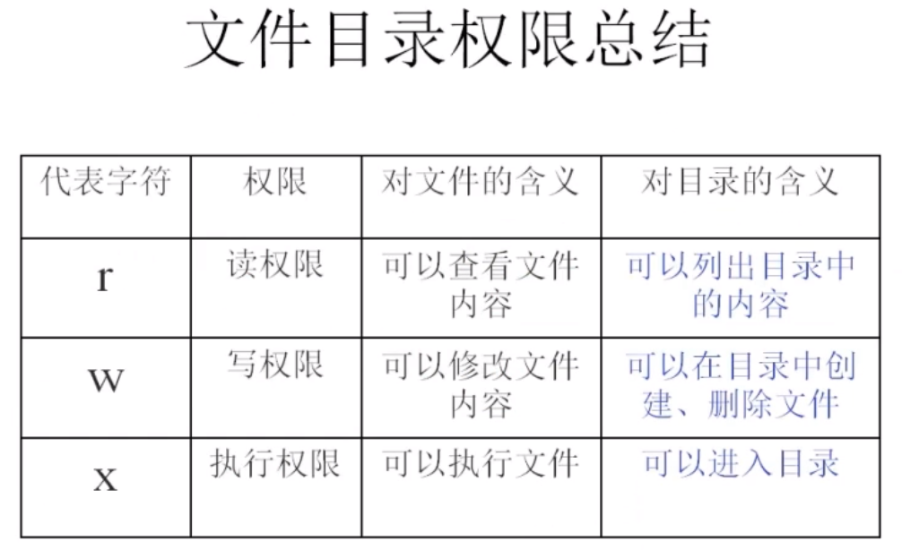

# Linux常用命令

## 文件处理命令

- 目录处理命令：ls【ll 为 ls -ld 缩写】
  - 命令名称：ls
  - 命令英文原意：list
  - 命令所在路径：/bin/ls
  - 执行权限：所有用户
  - 功能描述：显示目录文件
  - 语法：ls 选项[-ald] [文件或目录]
  - -a 显示所有文件，包括隐藏文件
     - -l 详细信息显示
  - -d 查看指定目录属性
     - -i 查看文件i节点（一个文件一定一个i节点，一个i节点不一定只对应一个文件）
  - -rw-r--r-- 开头标识文件类型，-二进制文件 d目录 l软链接文件,read，write，execute


- 目录处理命令：mkdir
  - 命令名称：mkdir
  - 命令英文原意：make directories
  - 命令所在路径：/bin/mkdir
  - 执行权限：所有用户
  - 语法：mkdir -p [目录名]
  - 功能描述：创建新目录，-p 递归创建
  - 范例：
    - $mkdir -p /tmp/Japan/boduo
    - $mkdir /tmp/Japan/longze /tmp/Japan/cangjing


- 目录处理命令：cd
  - 命令名称：cd
  - 命令英文原意：change directory
  - 命令所在路径：shell内置命令
  - 执行权限：所有用户
  - 语法：cd [目录]
  - 功能描述：切换目录
  - 范例：
    - $cd /tmp/Japan/boduo 切换到指定目录
    - $cd .. 回到上一级目录


- 目录处理命令：pwd
  - 命令名称：pwd
  - 命令英文原意：print working directory
  - 命令所在路径：/bin/pwd
  - 执行权限：所有用户
  - 语法：pwd
  - 功能描述：显示当前目录


- 文件处理命令：rmdir
  - 命令名称：rmdir
  - 命令英文原意：remove empty directories
  - 命令所在路径：/bin/rmdir
  - 执行权限：所有用户
  - 语法：rmdir [目录名]。
  - 功能描述：删除空目录
  - 范例：$rmdir /tmp/Japan/boduo


- 目录处理命令：cp
  - 命令名称：cp
  - 命令英文原意：copy
  - 命令所在路径：/bin/cp
  - 执行权限：所有用户
  - 语法：cp -rp [原文件或目录] [目标目录]
    - -r 复制目录
    - -p 保留文件属性
  - 功能描述：复制文件或目录


- 目录处理命令：mv
  - 命令名称：mv
  - 命令英文原意：move
  - 命令所在路径：/bin/mv
  - 执行权限：所有用户
  - 语法：mv [原文件或目录] [目标目录]
  - 功能描述：剪切文件、改名


- 目录处理命令：rm
  - 命令名称：rm
  - 命令英文原意：remove
  - 命令所在路径：/bin/rm
  - 执行权限：所有用户
  - 语法：rm -rf [文件或目录]
    - -r 删除目录
    -  -f 强制执行
  - 功能描述：删除文件


- 文件处理命令：touch
  - 命令名称：touch
  - 命令所在路径：/bin/touch
  - 执行权限：所有用户
  - 语法：touch [文件名]
  - 功能描述：创建空文件
  - 范例：$touch Japanlovestory.list
  - 创建带空格的文件名时要带“”如：“program files”（不建议文件名带空格）


- 文件处理命令：cat/tac
  - 命令名称：cat/tac
  - 命令所在路径：/bin/cat
  - 执行权限：所有用户
  - 语法：cat [文件名] / tac [文件名]
  - 功能描述：显示文件内容 / 反向显示文件内容
    -  -n 显示行号
  - 范例： $cat-n /etc/services 、tac /etc/services


- 文件处理命令：more
  - 命令名称：more
  - 命令所在路径：/bin/more
  - 执行权限：所有用户
  - 语法：more [文件名]
    - （空格）或f     翻页
    -  b                       回翻
    - （Enter）        换行
    - q或Q                退出
  - 功能描述：分页显示文件内容
  - 范例：$more /etc/services


- 文件处理命令：less
  - 命令名称：less
  - 命令所在路径：/usr/bin/less
  - 执行权限：所有用户
  - 语法：less [文件名]
    - 空格、f、pg on    翻页
    - b、pg up              回翻
    - Enter、↑、 ↓        换行
    - q或Q                     退出
    - /关键词                  搜索（按n换页继续搜索）
  - 功能描述：分页显示文件内容（可向上翻页）
  - 范例：$less /etc/services


- 文件处理命令：head
  - 命令名称：head
  - 命令所在路径：/usr/bin/head
  - 执行权限：所有用户
  - 语法：head [文件名]
  - 功能描述：显示文件前面几行（默认10行）
    - -n 指定行数
  - 范例：$head -n 20 /etc/services

 

- 文件处理命令：tail
  - 命令名称：tail
  - 命令所在路径：/usr/bin/tail
  - 执行权限：所有用户
  - 语法：tail [文件名]
  - 功能描述：显示文件后面几行
    - -n 指定行数
    -  -f 动态显示文件末尾内容
  - 范例：$tail -n 18 /etc/services


- 文件处理命令：ln
  - 命令名称：ln
  - 命令英文原意：link
  - 命令所在路径：/bin/ln
  - 执行权限：所有用户
  - 语法：ln -s [原文件] [目标文件]
    - -s 创建软链接
  - 功能描述：生成链接文件
  - 范例：
    - $ln -s /etc/issue /tmp/issue.soft
    - 创建文件/etc/issue的软链接/tmp/issue.soft
    - $In /etc/issue /tmp/issue.hard
    - 创建文件/etc/issue的硬链接/tmp/issue.hard
  - 软连接特征：（类似Windows快捷方式）
    1. lrwxrwxrwx 软连接文件权限都为777
    2. 文件大小-只是符号链接
    3. /tmp/issue.soft -> /etc/issue箭头指向源文件
  - 硬链接特征：
    1. 功能=cp -p命令+同步更新（其中一个文件删除或丢失不影响另一个文件）
    2. 通过i节点识别（i节点相同）
    3. 不能跨分区
    4. 不能针对目录使用


## 权限管理命令

- 权限管理命令：chmod
  - 命令名称：chmod
  - 命令英文原意：change the permissions      mode of a file
  - 命令所在路径：/bin/chmod
  - 执行权限：所有者、root
  - 语法：
    - chmod [{ugoa}{+-=}{rwx}] [文件或目录]
    - chmod [mode=421] [文件或目录]
    - -R 递归修改
  - 例如：
   - chmod u+x,a-x 文件名
   - chmod 421 文件名
  - 功能描述：改变文件或目录权限
  
  

- 权限管理命令：chown
  - 命令名称：chown
  - 命令英文原意：change file ownership
  - 命令所在路径：/bin/chown
  - 执行权限：root
  - 语法：chown [用户] [文件或目录]
  - 功能描述：改变文件或目录的所有者


- 权限管理命令：chgrp
  - 命令名称：chgrp
  - 命令英文原意：change file group      ownership
  - 命令所在路径：/bin/chgrp
  - 执行权限：root
  - 语法：chgrp [用户组] [文件或目录]
  - 功能描述：改变文件或目录的所属组


- 权限管理命令：umask
  - 命令名称：umask
  - 命令英文原意：the user file-creation      mask
  - 命令所在路径：Shell内置命令
  - 执行权限：所有用户
  - 语法：umask [-S]
    - -S 以rwx形式显示新建文件缺省权限
  - 功能描述：显示、设置文件的缺省权限
  - 范例：
    - $umask -S
    - $umask 077 修改文件缺省权限为rwx --- ---
  - 注意：touch 一个新文件默认是没有执行权限的


## 文件搜索命令

- 文件搜索命令：find（最可靠，但占用系统资源高）
  - 命令名称：find
  - 命令所在路径：/bin/find
  - 执行权限：所有用户
  - 语法：find [搜索范围] [匹配条件]
  - 功能描述：文件搜索
  - 例如：
      - $ find /etc -name init
          - 在目录/etc中查找文件init
        - -iname 不区分大小写
      - $ find /etc -name \*init\*
          - 在目录/etc中查找文件名含有init的文件（*匹配任意字符，？匹配单个字符）
      - $ find / -size +204800
          - 在根目录下查找大于100MB的文件【1K=2数据块(512字节=0.5K)】
          - +n 大于 -n 小于 n等于
      - $ find /home -user shenchao
          - 在根目录下查找所有者为shenchao的文件
          - -group 根据所属组查找
      - $ find /etc -cmin -5 在/etc下查找5分钟内被修改过属性的文件和目录（+5超过5分钟）
          - -amin 访问时间access
          - -cmin 文件属性change
          - -mmin 文件内容modify
      - $ find /etc -size +163840 -a -size -204800
          - 在/etc下查找大于80MB小于100MB的文件
          - -a 两个条件同时满足and
          - -o 两个条件满足任意一个即可or
      - $ find /etc -name 文件名 -exec ls -l {} \；
          - 在/etc下查找inittab文件并显示其详细信息
          - -exec或者-ok 命令 {} \；对搜索结果执行操作（-ok会对操作进行询问）
      - $ find /etc -name init* -a -type f 查找以init开头的文件
          - -type 根据文件类型查找。 f 文件，d 目录，l 软链接文件
          - -inum 根据i节点查找


- 文件搜索命令：locate
  - 命令名称：locate
  - 命令所在路径：/usr/bin/locate
  - 执行权限：所有用户
  - 语法：locate 文件名
  - 功能描述：在文件资料库中查找文件
  - 范例：$locate -i inittab （-i不区分大小写）
  - 特点：速度快，但不能实时查找，应该对文件库手动更新**updatedb**。且无法查找/tmp目录下的内容


- 文件搜索命令：which
  - 命令名称：which
  - 命令所在路径：/usr/bin/which
  - 执行权限：所有用户
  - 语法：which 命令
  - 功能描述：搜索**命令所在目录及别名信息**
  - 范例：$which ls


- 文件搜索命令：whereis
  - 命令名称：whereis
  - 命令所在路径：/usr/bin/whereis
  - 执行权限：所有用户
  - 语法：whereis [命令名称]
  - 功能描述：搜索**命令所在目录及帮助文档路径**
  - 范例：$whereis ls


- 文件搜索命令：grep
  - 命令名称：grep
  - 命令所在路径：/bin/grep
  - 执行权限：所有用户
  - 语法：grep -iv [指定字串] [文件]
  - 功能描述：在文件中搜寻字串匹配的那行内容并输出
    - -i 不区分大小写
    - -v 排除指定字符串所在行 如：grep -v ^# /etc/inittab 把以#开头的行去掉
  
  - 范例：#grep mysql /root/install.log


## 帮助命令

- 帮助命令：man、info
  - 命令名称：man、info
  - 命令英文原意：manual
  - 命令所在路径：/usr/bin/man
  - 执行权限：所有用户
  - 语法：man或info [命令或配置文件名称（不用路径）]
  - 功能描述：获得帮助信息
  - 范例：
    - $man ls
      - 查看1s命令的帮助信息
    - $man services
      -  查看配置文件services的帮助信息
    - $man 5 passswd 
      -  查看配置文件passwd的帮助信息（1 命令的帮助  5 配置文件的帮助）


- 帮助命令：whatis
  - 命令名称：whatis
  - 功能描述：查看命令的简短介绍信息
  - 范例：
    - $whatis ls
      - 查看ls命令的简短介绍信息


- 帮助命令：apropos
  - 命令名称：apropos
  - 功能描述：查看配置文件的简短介绍信息
  - 范例：
    - $apropos inittab
      - 查看inittab的简短介绍信息


- 帮助命令：--help
  - 命令名称：--help
  - 功能描述：查看命令的介绍信息
  - 范例：
    - $touch --help
      - 查看touch命令的介绍信息


- 帮助命令：help
  - 命令名称：help
  - 命令所在路径：Shell内置命令
  - 执行权限：所有用户
  - 语法：help命令
  - 功能描述：获得Shell内置命令的帮助信息
  - 范例：
    - $help umask
      - 查看umask命令的帮助信息


## 用户管理命令

- 用户管理命令：useradd
  - 命令名称：useradd
  - 命令所在路径：/usr/sbin/useradd
  - 执行权限：root
  - 语法：useradd 用户名
  - 功能描述：添加新用户
  - 范例：$useradd yangmi

 

- 用户管理命令：passwd
  - 命令名称：passwd
  - 命令所在路径：/usr/bin/passwd
  - 执行权限：所有用户
  - 语法：passwd 用户名
  - 功能描述：设置用户密码
  - 范例：$passwd yangmi

 

- 用户管理命令：who
  - 命令名称：who
  - 命令所在路径：/usr/bin/who
  - 执行权限：所有用户
  - 语法：who
  - 功能描述：查看登录用户信息
  - 范例：$who 
    
    - 【如下：登录用户名；tty为本地登录，pts为远程登录；ID；登录时间及IP】
    
      ```
      none   :0      2019-11-11 21:09 (:0)
      none   pts/1    2019-11-11 21:15 (192.168.31.144)
      ```


- 用户管理命令：w
  - 命令名称：w
  - 命令所在路径：/usr/bin/w
  - 执行权限：所有用户
  - 语法：w
  - 功能描述：查看登录用户详细信息


## 压缩解压命令

- 压缩命令：gzip 【zip格式Linux和Windows都可直接用】
  - 命令名称：gzip
  - 命令英文原意：GNUzip
  - 命令所在路径：/bin/gzip
  - 执行权限：所有用户
  - 语法：gzip [文件]
  - 功能描述：压缩文件，**不保留源文件**
  - 压缩后文件格式：.gz


- 解压命令：gunzip
  - 命令名称：gunzip
  - 命令英文原意：GNUunzip
  - 命令所在路径：/bin/gunzip
  - 执行权限：所有用户
  - 语法：gunzip [压缩文件]
  - 功能描述：解压缩.gz的压缩文件
  - 范例：$gunzip boduo.gz


- 压缩保留源文件的方法： 
  - gzip –c filename > filename.gz 

- 解压缩保留源文件的方法： 
  - gunzip –c filename.gz > filename 


- 打包命令：tar
  - 命令名称：tar
  - 命令所在路径：/bin/tar
  - 执行权限：所有用户
  - 语法：tar 选项[-zcf] [压缩后文件名] [被压缩目录名]
    - -c  打包
    - -v  显示详细信息
    - -f  指定文件名【必选】
    - -z  打包同时gzip压缩
  - 功能描述：打包目录
  - 压缩后文件格式：.tar.gz


- 解包命令：tar
  - tar命令解压缩语法：tar 选项[-zxvf] [被压缩文件名]
    - -x  解包
    - -v  显示详细信息
    - -f  指定解压文件
    - -z  解压缩gzip
  - 范例：$tar -zxf abc.tar.gz

 

- 压缩命令：zip
  - 命令名称：zip
  - 命令所在路径：/usr/bin/zip
  - 执行权限：所有用户
  - 语法：zip 选项[-r] [压缩后文件名] [文件或目录]
    - -r  压缩目录
  - 功能描述：压缩文件或目录
  - 压缩后文件格式：.zip


- 解压命令：unzip
  - 命令名称：unzip
  - 命令所在路径：/usr/bin/unzip
  - 执行权限：所有用户
  - 语法：unzip [压缩文件]
  - 功能描述：解压.zip的压缩文件
  - 范例：$unzip test.zip


- 压缩解命令：bzip2 【推荐压缩大文件】
  - 命令名称：bzip2
  - 命令所在路径：/usr/bin/bzip2
  - 执行权限：所有用户
  - 语法：bzip2 选项[-k] [文件]
    - -k  产生压缩文件后保留原文件
    - -j  进行bzip2压缩
  - 功能描述：压缩文件
  - 压缩后文件格式：.bz2
  - 范例：
    - $bzip2 -k boduo
      - $tar -cjf Japan.tar.bz2 Japan 打包且进行bzip2压缩


- 解压命令：bunzip2
  - 命令名称：bunzip2
  - 命令所在路径：/usr/bin/bunzip2
  - 执行权限：所有用户
  - 语法：bunzip2 选项[-k] [压缩文件]
    - -k  解压缩后保留原文件
  - 功能描述：解压缩
  - 范例：
    - $bunzip2 -k boduo.bz2
    - $tar -xjf Japan.tar.bz2 解包且进行bzip2解压


## 网络命令

- 网络命令：write
  - 指令名称：write
  - 指令所在路径：/usr/bin/write
  - 执行权限：所有用户
  - 语法：write <用户名>
  - 功能描述：给在线用户发信息，以Ctrl+D保存结束
  - 范例：#write linzhiling


- 网络命令：wall
  - 指令名称：wall
  - 命令英文原意：write all
  - 指令所在路径：/usr/bin/wall
  - 执行权限：所有用户
  - 语法：wall [message]
  - 功能描述：发广播信息
  - 范例：#wall ShenChao is a honest man！


- 网络命令：ping
  - 命令名称：ping
  - 命令所在路径：/bin/ping
  - 执行权限：所有用户
  - 语法：ping 选项 IP地址
    - -c 指定发送次数
  - 功能描述：测试网络连通性
  - 范例：#ping -c 4 192.168.1.156


- 网络命令：ifconfig
  - 命令名称：ifconfig
  - 命令英文原意：interface configure
  - 命令所在路径：/sbin/ifconfig
  - 执行权限：root
  - 语法：ifconfig 网卡名称 IP地址
  - 功能描述：查看和设置网卡信息
  - 范例：#ifconfig eth0 192.168.8.250


- 网络命令：mail
  - 命令名称：mail
  - 命令所在路径：/bin/mail
  - 执行权限：所有用户
  - 语法：mail [用户名]
  - 功能描述：查看发送电子邮件
  - 范例：#mail root


- 网络命令：last
  - 命令名称：last
  - 命令所在路径：/usr/bin/last
  - 执行权限：所有用户
  - 语法：last
  - 功能描述：列出目前与过去登入系统的用户信息
  - 范例：#last


- 网络命令：lastlog
  - 命令名称：lastlog
  - 命令所在路径：/usr/bin/lastlog
  - 执行权限：所有用户
  - 语法：lastlog
  - 功能描述：检查某特定用户上次登录的时间
  - 范例：
    - lastlog
    - lastlog -u 用户ID


- 网络命令：traceroute
  - 命令名称：traceroute
  - 命令所在路径：/bin/traceroute
  - 执行权限：所有用户
  - 语法：traceroute
  - 功能描述：显示数据包到主机间的路径
  - 范例：traceroute [www.lampbrother.net](http://www.lampbrother.net)

 

- 网络命令：netstat
  - 命令名称：netstat
  - 命令所在路径：/bin/netstat
  - 执行权限：所有用户
  - 语法：netstat [选项]
  - 功能描述：显示网络相关信息
  - 选项：
    - -t: TCP协议
    - -u: UDP协议
    - -l：监听
    - -r：路由
    - -n：显示IP地址和端口号
  - 范例：
    - netstat -tlun  查看本机监听的端口
    - netstat -an    查看本机所有的网络连接
    - netstat -rn    查看本机路由表（查看网关）


- 网络命令：setup（Redhat专有）
  - 命令名称：setup
  - 命令所在路径：/usr/bin/setup
  - 执行权限：root
  - 语法：setup
  - 功能描述：配置网络
  - 范例：#setup


- 挂载命令（命令行界面需要）
  - 命令名称：mount
  - 命令位置：/bin/mount
  - 执行权限：所有用户
  - 命令语法：mount [-t文件系统] 设备文件名 挂载点（需存在，可自建）
  - 范例：
    - mount -t iso9660 /dev/sr0 /mnt/cdrom
    - umount /dev/sr0       卸载设备（不可在设备目录下执行）


## 关机重启命令

- shutdown命令
  - 语法：shutdown [选项] 时间
  - 选项：
    - -c：取消前一个关机命令
    - -h：关机
    - -r：重启

 

- 其他关机命令
  - [root@localhost~]#halt
  - [root@localhost~]#poweroff     #相对于直接断电
  - [root@localhost~]#init 0


- 其他重启命令
  - [root@localhost~]#reboot
  - [root@localhost~]#init 6
  - 系统运行级别
    - 0   关机
    - 1   单用户（类似于安全模式）
    - 2   不完全多用户，不含NFS服务
    - 3   完全多用户
    - 4   未分配
    - 5   图形界面
    - 6   重启
  - [root@localhost~]#cat /etc/inittab
    - systemctl set-default multi-user.target   #设定为命令行启动
  - [root@localhost~]#runlevel   #查询系统运行级别


- 退出登录命令
  - [root@localhost~]#logout     （Windows为win+L）