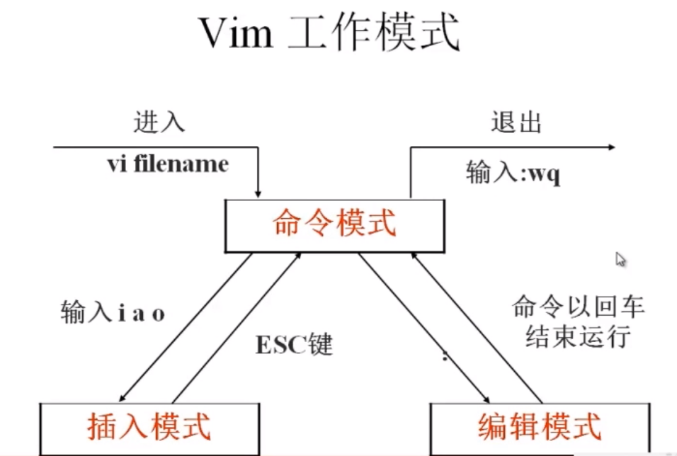

# 文本编辑器Vim

## Vim简介

- Vim是一个功能强大的全屏幕文本编辑器，是Linux/UNIX上最常用的文本编辑器，它的作用是建立、编辑、显示文本文件。
- Vim没有菜单，只有命令。

## 插入命令

| 命令  | 作用                 |
| ----- | -------------------- |
| a     | 在光标所在字符后插入 |
| A     | 在光标所在行行尾插入 |
| i     | 在光标所在字符前插入 |
| I     | 在光标所在行行首插入 |
| 小写o | 在光标下插入新行     |
| 大写O | 在光标上插入新行     |

## 定位命令

| 命令      | 作用       |
| --------- | ---------- |
| :set nu   | 设置行号   |
| :set nonu | 取消行号   |
| gg        | 到第一行   |
| G         | 到最后一行 |
| nG        | 到第n行    |
| :n        | 到第n行    |
| $         | 移至行尾   |
| 数字0     | 移至行首   |

## 删除命令

| 命令    | 作用                           |
| ------- | ------------------------------ |
| x       | 删除光标所在处的字符           |
| nx      | 删除光标所在处后n个字符        |
| dd      | 删除光标所在行，ndd删除n行     |
| dG      | 删除光标所在行到文件末尾内容   |
| D       | 删除光标所在处到行尾内容       |
| :n1,n2d | 删除指定范围的行:3,9d删除3-9行 |

## 复制剪切命令

| 命令 | 作用                         |
| ---- | ---------------------------- |
| yy   | 复制当前行                   |
| nyy  | 复制当前行以下n行            |
| dd   | 剪切当前行                   |
| ndd  | 剪切当前行以下n行            |
| p、P | 粘贴在当前光标所在行下或行上 |

## 替换取消命令

| 命令 | 作用                                |
| ---- | ----------------------------------- |
| r    | 取代光标所在处的字符                |
| R    | 从光标所在处开始替换字符，按Esc结束 |
| u    | 取消上一步操作                      |

## 搜索替换命令

| 命令              | 作用                                    |
| ----------------- | --------------------------------------- |
| /string           | 搜索指定字符串；搜索时忽略大小写:set ic |
| n                 | 搜索指定字符串的下一个出现位置          |
| :%/old/new/g      | 全文替换指定字符串 g=>c 询问确认        |
| :n1,n2s/old/new/g | 在一定范围内替换指定字符串              |

## 保存退出命令

| 命令           | 作用                                   |
| -------------- | -------------------------------------- |
| :w             | 保存修改                               |
| :w newfilename | 另存为指定文件                         |
| :wq            | 保存修改并退出                         |
| ZZ             | 快捷键，保存修改并退出                 |
| :q!            | 不保存修改退出                         |
| :wq!           | 保存修改并退出（文件所有者及root可用） |

## Vim使用技巧

- 将配置写在/home/username/.vimrc或/root/.vimrc中以免下次重写（需自建.vimrc）

- :! 命令
  - 如：:!date
    -  Sat Nov 16 23:15:56 CST 2019
  - 在不退出vim的情况下执行命令

- :r 文件名
  - 导入文件内容到vim里

- :r !命令
  - 将命令的执行结果导入vim

- :map 快捷键 触发命令
  - 若要将快捷键设置为Ctrl+P，实际按键为Ctrl+V+P也可先按Ctrl+V再按Ctrl+P
  - 范例：
    - `:map ^P I#<ESC> `   设置Ctrl+P快捷键，使光标所在行首添加“#”
    - `:map ^B 0x `        设置Ctrl+B快捷键，使删除光标所在行首字符

- :ab 原内容 替换内容