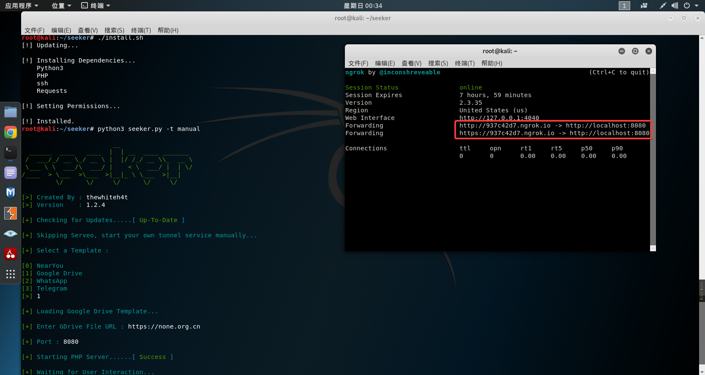

# 获取位置信息

## 总体思路

- 首先用Seeker建立一个用于获取对方位置信息的虚假页面，然后用Ngrok建立一个隧道将公网域名连接在本地用Seeker上搭建的虚假页面，接着可以选择用短网址转换的方式对公网域名进行伪装，于是当对方点击了该链接并同意获取位置信息后，我们即可在本机上得到这些信息。


## 目标页面

- 选择（创造）一个对目标具有诱惑性的页面/网站。


## 构建获取定位信息网页

- Seeker介绍
  - [Seeker](https://github.com/thewhiteh4t/seeker)是一款可以获取高精度地理和设备信息的工具。其在内置PHP服务器上托管了一个虚假网站，网站要求提供位置许可，如果目标允许，我们将可以获得对方的设备信息和位置信息。
  - Seeker用于获取位置信息的模板位于/seeker/template/目录下。
- 获取&运行seeker

```
root@kali:~# git clone https://github.com/thewhiteh4t/seeker.git
root@kali:~# cd seeker/
root@kali:~/seeker# ./install.sh 
[!] Updating...

[!] Installing Dependencies...
    Python3
    PHP
    ssh
    Requests

[!] Setting Permissions...

[!] Installed.
root@kali:~/seeker# python3 seeker.py -t manual
```


## 使用隧道转发实现内网穿透

- Ngrok介绍
  - [Ngrok](https://ngrok.com/download)是一款内网穿透的工具，用于将本地的端口转发到公网上，以便于连接。只需告诉ngrok Web服务器正在侦听的本地端口即可。这样既可以将本地的web服务转发到公网上，也不至于暴露自身的IP。
- 获取&运行ngrok

```
#搭建起本机与ngrok服务器的隧道（此次的端口应与seeker设置的一致）
root@kali:~# ./ngrok http 8080
```




## 短网址域名伪装

- 将以上ngrok产生的网址进行[短网址转换](http://sina.lt/)进行伪装，以增加可信度。


## 实际测试

- 手机端：

 


- kali端：

  


## 总结

- 整个过程能否成功的关键在于利用社会工程学诱使对方点击链接并同意授权位置信息，而获取到的位置信息精度则取决于目标设备。
- 此过程纯粹只是一个概念证明，仅用于教育目的。其主要目的是警示大家不要轻易点击来路不明的链接并授予关键权限，否则你将可能暴露你的设备信息甚至你的位置信息等。


end.