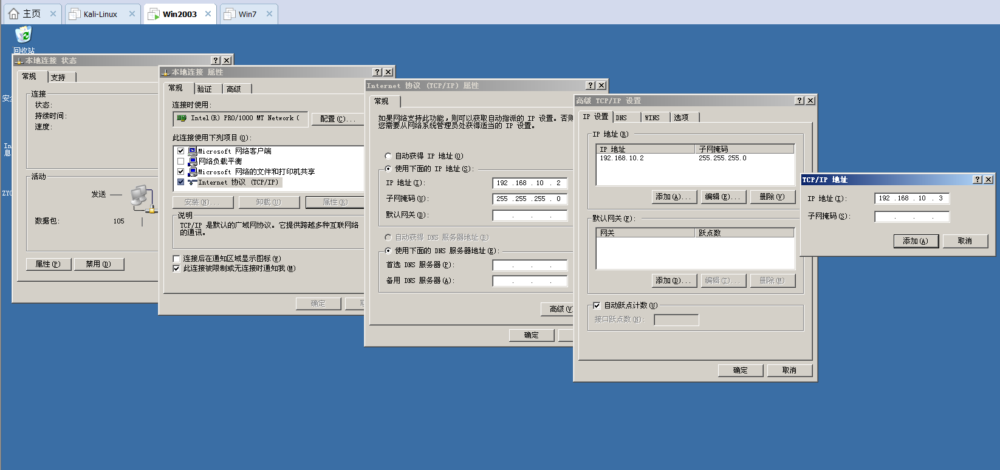
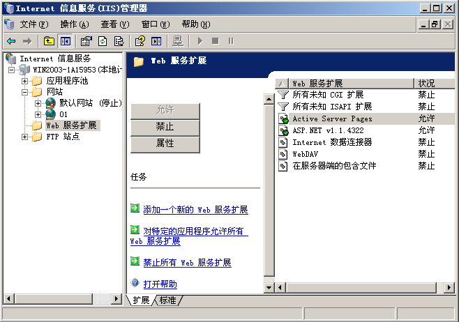
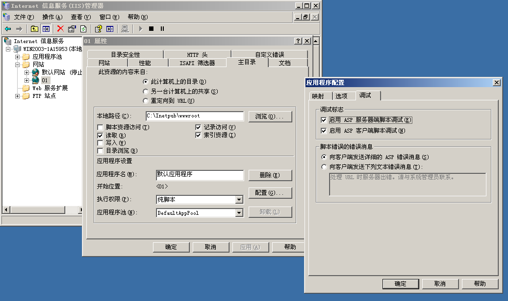
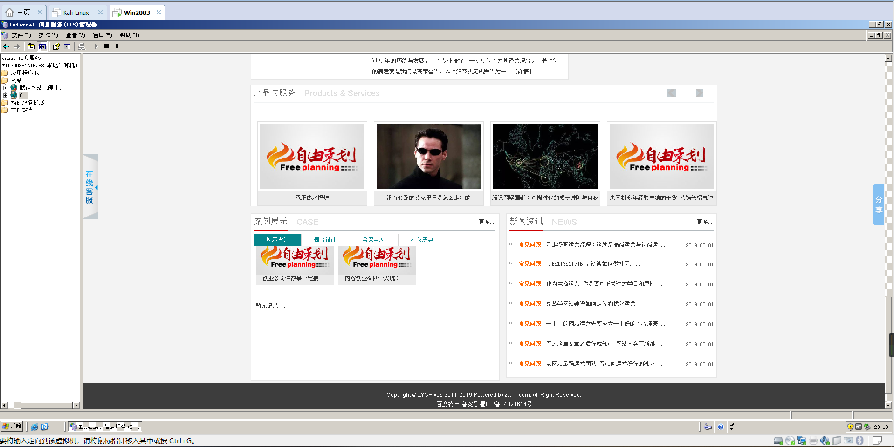
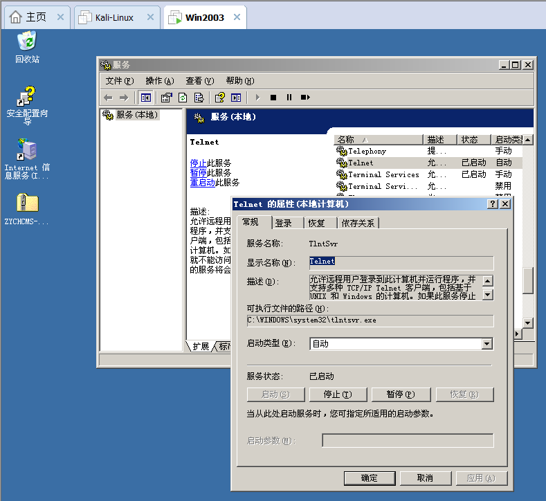
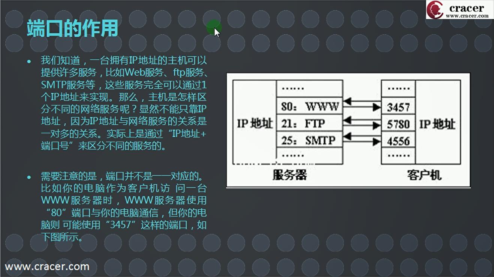
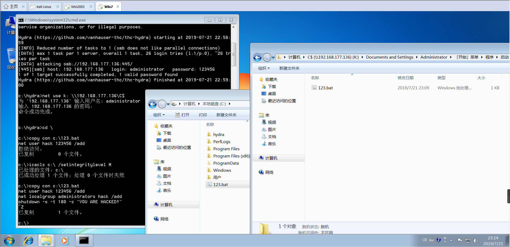
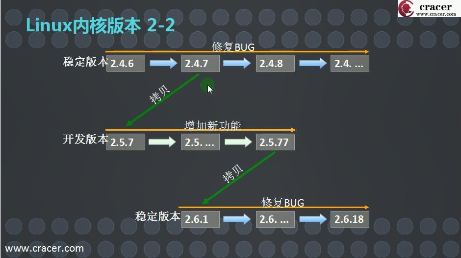

# 零基础必看课程

## 基础部分

### 渗透测试

1. 明确目标
2. 信息收集（基础、系统、应用、版本、服务、人员、防护信息）
3. 漏洞探测（系统、WebServer、Web应用、其他端口服务漏洞、通信安全）
4. 漏洞验证（自动化、手工、实验验证；登录猜解、业务漏洞验证）
5. 信息分析（精确打击、绕过防御机制、定制攻击路径、绕过检测机制、攻击代码）
6. 获取所需（实施攻击、获取内部信息、进一步渗透、**持续性攻击**、清理痕迹）
7. 信息整理
8. 形成报告

### 虚拟机及系统安装

（略）

### 虚拟机功能介绍及使用

（略）

### 网站篇

- **http协议**：超文本传输协议（HTTP，HyperText Transfer Protocol）是互联网上应用最为广泛的一种网络协议。所有的WWW文件都必须遵守这个标准。设计HTTP最初的目的是为了提供一种发布和接收HTML页面的方法。

- **http头讲解**：（详解https://www.cnblogs.com/poissonnotes/p/4844014.html

  - 200：响应状态码
  - Accept-Ranges：响应的 HTTP 标头是由服务器使用以通告其支持部分请求的标志物。此字段的值表示可用于定义范围的单位。
  - Content-Length：请求消息正文的长度
  - Date ：发送HTTP消息的日期

  

- **静态网站：**静态网站是指全部由HTML（标准通用标记语言的子集）代码格式页面组成的网站，所有的内容包含在网页文件中。网页上也可以出现各种视觉动态效果，如GIF动画、FLASH动画、滚动字幕等，而网站主要是静态化的页面和代码组成，一般文件名均以**htm、html、shtml**等为后缀

- **动态网站：**动态网站并不是指具有动画功能的网站，而是指网站内容可根据不同情况动态变更的网站，一般情况下动态网站通过数据库进行架构。动态网站除了要设计网页外，还要通过**数据库**和编程序来使网站具有更多自动的和高级的功能。动态网站体现在网页一般是以**asp，jsp，php，aspx**等结束，而静态网页一般是HTML（标准通用标记语言的子集）结尾，动态网站服务器空间配置要比静态的网页要求高，费用也相应的高，不过动态网页利于网站内容的更新，适合企业建站。动态是相对于静态网站而言。

  - 判断一个网站是什么类型的小技巧：在后面加**/index.html** 或 **/index.php**
  - 判断一个网站所用系统的小技巧：更改后面**字母的大小写**，Linux报错win不报错

- **网站搭建：**

  - 服务器配置：

    

  - 点击详细信息

    

  - 网站默认本地文件夹：wwwroot

    

  - **配置DNS服务：**添加或删除角色→自定义→DNS服务器→下一步。。。
  
  - DNS&域名："正向查找"右键新建区域→下一步。。。右边空白区域右键新建主机→下一步。。。

  - 【DNS改为本地解析127.0.0.1（本地连接属性→TCP/IP属性）】

    

    

  - **添加ip：**“运行”ncpa.cpl→属性→TCP/IP属性→设定IP→高级→添加

    

  - 网站能正常运行：需满足【ip，端口(改为1024~65535)，域名】至少一个不同

    

  - **网站权限配置：**右键权限→添加→高级→立即查找→everyone

    

  - **ASP服务启用允许**

    

  - **网站配置：**右键属性→【主目录】执行权限：纯脚本→点击配置→选项：启用父路径；调试：启用两个调试→【文档】启用默认文档内容：index.asp

    

  - **实操成果：**
  
    

## Windows基础

### 系统目录、服务、端口、注册表

- **系统目录**
  - **Program Files**：64位软件安装目录
  - **Program Files(x86)**：32位软件安装目录
  - **MyDrivers**：驱动文件夹
  - **PerfLogs**：日志文件夹
  - **自启动文件夹**：C:\Users\\***\AppData\Roaming\Microsoft\Windows\Start Menu\Programs\Startup
  - **系统配置文件**：C:\Windows\System32【config文件夹里的SAM文件为用户账号密码文件（进入PE系统将SAM文件删除即可绕过密码登录）】
  - **hosts文件**：C:\Windows\System32\drivers\etc

- **服务**
  
  - **作用**：
    1. 决定计算机的一些功能是否被启用
    2. 不同服务对应的功能不同
    3. 通过计算机提供的服务可以有效实现资源共享
    
  - **常见的服务**：web服务、dns服务、dhcp服务、邮件服务、telnet服务、ssh服务、ftp服务、smb服务
  
  - **查看服务命令**：services.msc
  
  - **Telnet入侵**：DOS命令：`telnet 目标ip`
  
    
  
    

- **端口**

  - 计算机“端口”是英文port的义译，可以认为是计算机与外界通讯交流的出口。按端口号可分为3大类：公认端口（Well Known Ports）；注册端口（Registered Ports）；动态和/私有端口（Dynamic and/or Private Ports），共有65535个端口

  - **通过端口可以进行：**信息搜集、目标探测、服务判断、系统判断、系统角色分析

    

    

- **注册表**

  - **打开注册表：**打开“运行”输入regedit回车

  - **注册表作用：**注册表是windows操作系统中的一个核心数据库，其中存放着各种参数，直接控制着windows的启动、硬件驱动程序的装载以及一些windows应用程序的运行，从而在整个系统中起着核心作用。这些作用包括了软、硬件的相关配置和状态信息，比如注册表中保存有应用程序和资源管理器外壳的初始条件、首选项和卸载数据等，联网计算机的整个系统的设置和各种许可，文件扩展名与应用程序的关联，硬件部件的描述、状态和属性，性能记录和其他底层的系统状态信息，以及其他数据等。

    1. **HKEY_CLASSES_ROOT管理文件系统。**

       根据在Windows中安装的应用程序的扩展名，该根键指明其文件类型的名称，相应打开该文件所要调用的程序等等信息

    2. **HKEY_CURRENT_USER管理系统当前的用户信息。**

       在这个根键中保存了本地计算机中存放的当前登录的用户信息，包括用户登录用户名和暂存的密码。在用户登录Windows 98时，其信息从HKEY_USERS中相应的项拷贝到HKEY_CURRENT_USER中。

    3. **HKEY_LOCAL_MACHINE管理当前系统硬件配置。**

       在这个根键中保存了本地计算机硬件配置数据，此根键下的子关键字包括在SYSTEM.DAT中，用来提供HKEY_LOCAL_MACHINE所需的信息，或者在远程计算机中可访间的一组键中。这个根键里面的许多子键与System.ini文件中设置项类似。

    4. **HKEY_USERS管理系统的用户信息。**

       在这个根键中保存了存放在本地计算机口令列表中的用户标识和密码列表。同时每个用户的预配置信息都存储在HKEY_USERS根键中。HKEY_USERS是远程计算机中访问的根键之一。

    5. **HKEY_CURRENT_CONFIG管理当前用户的系统配置。**

       在这个根键中保存着定义当前用户桌面配置（如显示器等等的数据该用户使用过的文档列表（MRU），应用程序配置和其他有关当前用户的Windows 98中文版的安装的信息。

  

- **利用注册表防病毒：**
  
  不少计算机系统感染了网络病毒后，可能会在这些注册表中做修改
  
  HKEY_CURRENT_USER\Software\Microsoft\Windows\CurrentVersion\RunOnce
  
  HKEY_CURRENT_USER\Software\Microsoft\Windows\CurrentVersion\Run
  
  HKEY_CURRENT_USER\Software\Microsoft\Windows\CurrentVersion\RunServices
  

  
- **病毒经常修改的注册表键值**
  
  1. **IE起始页的修改**
  
     HKEY_CURRENT_USER\Software\Microsoft\Internet Explorer\Main右半部分窗口中的Start Page就是用户当前设置的IE浏览器主页地址了
  
  2. **Internet选项按钮灰化&失效**
  
     HKEY_CURRENT_USER\Software\Policies\Microsoft\Internet Explorer\Control Panel下的DWORD值“Setting”=dword:1 “Links”=dword:1 “SecAddSites”dword:1全部改为0之后再到HKEY_USERS\.DEFAULT\Software\Policies\Microsoft\Internet Explorer\Control Panel下的DWORD值“homepage”键值改为0则无法使用“Internet选项”修改IE设置
  
  3. **“源文件”项不可用**
  
     HKEY_CURRENT_USER\Software\Policies\Microsoft\Internet Explorer\Restrictions的“NoViewSource”被设置为1了，改为0就可恢复正常
  
  4. **“运行”按钮被取消&失效**
  
     HKEY_CURRENT_USER\Software\Microsoft\Windows\CurrentVersion\Policies\Explorer的“NoRun”键值被改为1了，改为0就可恢复
  
  5. **“关机”按钮被取消&失效**
  
     HKEY_CURRENT_USER\Software\Microsoft\Windows\CurrentVersion\Policies\Explorer的“NoClose”键值被改为1了，改为0就可恢复
  
  6. **“注销”按钮被取消&失效**
  
     HKEY_CURRENT_USER\Software\Microsoft\Windows\CurrentVersion\Policies\Explorer的“NoLogOff”键值被改为1了，改为0就可恢复
  
  7. **磁盘驱动器被隐藏**
  
     HKEY_CURRENT_USER\Software\Microsoft\Windows\CurrentVersion\Policies\Explorer的“NoDrives”键值被改为1了，改为0就可恢复。
  
  
  
  - **入侵中常用的注册表：**
  
    HKEY_LOCAL_MACHINE\software\hzhost\config\settings\mysqlpass
  
    HKEY_LOCAL_MACHINE\software\hzhost\config\settings\mssqlpss
    
    HKEY_LOCAL_MACHINE\software\hzhost\config\Settings\mastersvrpass
    
    HKEY_LOCAL_MACHINE\SYSTEM\LIWEIWENSOFTINSTALLFREEADMIN\11
    
    HKEY_LOCAL_MACHINE\SYSTEM\LIWEIWENSOFTINSTALLFreeHost\11

### 黑客常用的DOS命令及批处理

- **常用DOS命令**
  - **color ？** 改变cmd颜色
  - **ping -t -1 65500 ip**（死亡之ping，发送大于64K的文件并一直ping）
  - **ipconfig /all** 查看IP及详细信息
  - **ipconfig/release** 释放IP
  - **ipconfig/renew** 重新获得IP
  - **systeminfo** 查看系统信息（**补丁信息**）
  - **arp -a** 查看局域网内的IP和MAC
  - **net view** 查看局域网内其他计算机名称
  - **shutdown -s -t 60 -c "你被黑了"**（-s关机，-r重启，-t倒计时，-c弹窗提示内容）
  - **shutdown -a**（取消关机）
  - **dir** 查看目录
  - **cd** 切换目录
  - **start www.google.com** 打开网页
  - **md 目录名** 创建目录
  - **copy con C:\123.txt** 在C盘根目录下创建123.txt文件（Ctrl+Z，回车保存）
  - **del 123.txt** 删除123.txt
  - **tree** 树形列出文件夹结构
  - **net use k: \\192.168.1.1\c$** 将目标IP的C盘映射到本地K盘（可用**hydra**爆破用户密码）
  - **net use k: \\192.168.1.1\c$ /del** 删除
  - **net start** 查看开启了哪些服务
  - **net start 服务名** 开启服务
  - **net stop 服务名** 关闭服务
  - **net user** 查看用户
  - **net user 用户名** 查看用户属性
  - **net user 用户名 密码 /add** 建立用户
  - **net user 用户名 /del** 删除用户
  - **net localgroup administrator****s** **用户名 /add** 把“用户”添加到管理员中使其具有管理员权限
  - **net user guest /active:yes** 激活guest用户
  - **net user guest 123456** 用guest用户登录后将密码改为123456
  - **net password** 密码 更改系统登录密码
  - **net share** 查看本地开启的共享
  - **net share c$ /del** 删除C：共享
  - **net share ipc$** 开启ipc$共享
  - **net share ipc$ /del** 删除ipc$共享
  - **netstat -a** 查看开启了哪些端口，常用netstat -an
  - **netstat -n** 查看端口的网络连接情况，常用netstat -an
  - **netstat -v** 查看正在进行的工作
  - **at id号** 开启已注册的某个计划任务
  - **at /delete** 停止所有计划任务，用参数/yes则不需要确认就直接停止
  - **at id号 /delete** 停止某个已注册的计划任务
  - **at** 查看所有的计划任务
  - **attrib 文件名(目录名)** 查看某文件（目录）的属性
  - **attrib 文件名-A-R-S-H或+A+R+S+H** 去掉或添加某文件的存档，只读，系统，隐藏属性
  - **cls** 清屏
  - **ping返回值TTL（默认情况下）：且每经过一个路由则-1**
    - Linux系统的TTL值为64或255
    - Windows NT/2000/XP系统的TTL值为128
    - Windows 98系统的TTL值为32
    - UNIX主机的TTL值为255

- **批处理**

  - 批处理文件是dos命令的组合文件，写在批处理文件的命令会被逐一执行。后缀名为.bat
  - **在cmd中编写批处理文件，`copy con c:\123.bat`把输入的内容复制到文件123.bat中，“Ctrl+Z 回车”结束编辑**

  

- 常用快捷键&优化系统

  - Windows常用快捷键

    - **F1** 显示当前程序或者windows的帮助内容。
    - **F2** 当你选中一个文件的话，这意味着“重命名”
    - **F3** 当你在桌面上的时候是打开“查找：所有文件”对话框
    - **ALT+F4** 关闭当前应用程序中的当前文本（如word中）
    - **F5** 刷新
    - **CTRL+F5** 强行刷新
    - **CTRL+F6** 切换到当前应用程序中的下一个文本（加shift 可以跳到前一个窗口）
    - **F10或ALT** 激活当前程序的菜单栏
    - **windows键或CTRL+ESC** 打开开始菜单
    - **CTRL+ALT+DELETE** 在win9x中打开关闭程序对话框
    - **DELETE** 删除被选择的选择项目，如果是文件，将被放入回收站
    - **SHIFT+DELETE** 删除被选择的选择项目，如果是文件，将被直接删除而不是放入回收站
    - **CTRL+N** 新建一个新的文件
    - **CTRL+O** 打开“打开文件”对话框
    - **CTRL+P** 打开“打印”对话框CTRL+S保存当前操作的文件
    - **CTRL+X** 剪切被选择的项目到剪贴板
    - **CTRL+INSERT或CTRL+C** 复制被选择的项目到剪贴板
    - **SHIFT+INSERT或CTRL+V** 粘贴剪贴板中的项目
    - **ALT+BACKSPACE 或CTRL+Z** 撤销上一步的操作
    - **Ctrl+Shift+ESC**打开资源管理器
    - **Win+M** 最小化所有被打开的窗口。
    - **Win+D** 最小化所有窗口或恢复窗口
    - **Win+L** 锁屏
    - **Win+F** 打开“查找：所有文件”对话框
    - **Win+R** 打开“运行”对话框

  - 系统优化

    - 修改启动项

      “运行”对话框中输入“msconfig"命令，打开系统配置窗口岩找到“启动"选项

    - 加快系统启动速度

      “运行”对话框中输入“msconfig”命令，打开系统配置窗口后找到“引导”选项（英文系统是Boot）。点击“高级选项”此时就可以看到我们将要修改的设置项了。

    - 提高窗口切换提速

      右击计算机属性---性能信息和工具---调整视觉效果（先点击让windows选择计算机的最佳设置---再点击自定义---把最后的勾选去掉--确定）

    - 使用工具优化

### 登录密码破解、手动清除木马病毒

- 使用启动U盘破解：
  - **微PE启动盘教程：**http://www.wepe.com.cn/ubook/

- 使用工具对hash值破解：
  - LC5
  - 彩虹表

- 手动清除木马：
  - 查找开机启动项：“运行”**msconfig**
  - 查询服务：“运行”**services.msc**
  - 查看网络端口连接：DOS命令**netstat -ano**（常见木马端口4444,8888,9527）

拓展：https://www.cnblogs.com/vipsoft/p/3953790.html

## Linux基础

### Linux系统的介绍、安装、密码的破解

- **Linux内核版本号：**XX.YY.ZZ【XX为主版本号，YY为次版本号，次版本号为奇数表示开发版，偶数表示稳定版】

  

- **磁盘分区：**主分区大于4表示为逻辑分区(例:第2块SCSI硬盘的第3个逻辑分区/dev/sdb7)

  

- **Linux中默认使用的文件系统类型：**

  - **EXT3** 第3代扩展（Extended）文件系统
  - **SWAP** 交换文件系统

- **Linux支持的其它文件系统类型**

  - FAT16、FAT32、NTFS
  - XFS、JFS

### Linux系统目录结构，常用命令

- **Centos 7安装vmtools：**点击“虚拟机”重新安装vmtools→打开终端输入“黄色标注”的命令→一直回车→安装完成后重启

  

- **Linux 中各个文件夹的作用**[**https://blog.csdn.net/badguy_gao/article/details/78638735**](https://blog.csdn.net/badguy_gao/article/details/78638735)
  - **/**  根目录
  - **/boot**  引导程序，内核等存放的目录
  - **/bin**  普通用户可以使用的命令的存放目录
  - **/sbin**  超级用户可以使用的命令的存放目录
  - **/lib**  根目录下的所程序的共享库目录
  - **/dev** 设备文件目录
  - **/home**  普通用户的家目录
  - **/root**  用户root的$HOME目录
  - **/etc**  全局的配置文件存放目录
- 命令行提示符“#”表示为root用户，“$”表示为普通用户
- 字符界面与图形界面的切换：Ctrl+Alt+F1图形界面；Ctrl+Alt+F2~7字符界面

Linux命令

- 用于实现某一类功能的指令或程序
- 命令的执行依赖于解释器程序（例如：/bin/bash）

Linux命令的分类

- 内部命令：属于Shell解释器的一部分（系统自带的命令）
- 外部命令：独立于Shell解释器之外的程序文件

**命令行编辑的几个辅助操作**

- **Tab键：**自动补齐
- **反斜杠“\”：**强制换行
- **Ctrl+U：**清空至行首
- **Ctrl+K：**清空至行尾
- **Ctrl+L：**清屏
- **Ctrl+C：**取消本次命令编辑

**Linux命令的通用命令格式：命令字+选项+参数（命令字 --help）**

- 选项：用于调节命令的具体功能
- 以“-”引导短格式选项（单个字符），例如“-”
- 以“--”引导长格式选项（多个字符），例如“-color”
- **多个短格式选项可以写在一起，只用一个“-”引导，例如“-al"**
- 参数：命令操作的对象，如文件、目录名等

**Linux常用命令：**

- **uname -a**  查看系统相关信息，显示主机名、硬件平台等详细信息

- **uname -r**  查看内核版本

- **hostname**  主机名称

- **ifconfig**  查看IP地址

- **cat /proc/cpuinfo**  查看CPU信息

- **cat /proc/meminfo** 查看内存信息

- **halt 或 shutdown -h now**  关机

- **reboot 或 shutdown -r now**  重启

- **pwd**  查看当前工作目录

- **cd 目录位置**  切换工作目录

- **mkdir -p /路径/目录名**  创建新的目录

- **touch 文件名**  新建空文件（若已有同名文件，则更新其修改日期，内容不变）

- **ln -s 源文件或目录 链接文件或目标目录**  为文件或目录建立快捷方式

- **mv 源文件或目录 目标文件或目录**  移动文件或目录（若位置不变，则相当于改名）

- **find 查找目录 查找条件 查找内容**  用于查找文件或目录

  - 常用查找条件：
    - name：按文件名称查找（区分大小写）
    - iname：不区分大小写
    - size：按文件大小查找（+1024表示大于1024的文件，反之-为小于，默认等于）
    - user：按文件属性查找
    - type：按文件类型查找

- **cp 选项 源文件或目录 目标文件或目录**  复制文件或目录

  - cp命令常用选项：

    - r：递归复制整个目录树
    - p：保持源文件的属性不变
    - f：强制覆盖目标同名文件或目录
    - i：需要覆盖文件或目录时进行提醒

- **rm 选项 文件或目录**  删除文件或目录

  - rm命令常用选项

    - f：强行删除文件或目录，不进行提醒
    - i：删除文件或目录时提醒用户确认
    - r：递归删除整个目录树

- **du 选项 目录或文件名**  统计目录及文件的空间占用情况

  - du命令常用选项：

    - a：统计时包括所有的文件，而不仅仅只统计目录
    - h：以更易读的字节单位（K、M等）显示信息
    - s：只统计每个参数所占用空间总的大小

- **ls 选项 目录或文件名**  列表显示目录内容

  - ls命令常用选项：

    - l：以长格式显示
    
    - a：显示所有子目录和文件的信息，包括隐藏文件
    
    - A：类似于“-a”，但不显示“.”和“..”目录的信息
    
    - d：显示目录本身的属性
    
    - h：以更易读的字节单位（K、M等）显示信息
    
    - R：递归显示内容
    
    - color：以颜色区分不同类型文件
    
      

- 最前面的-表示其为文件，l表示其为链接(快捷方式)，d表示其为目录

- r=4，w=2，x=1，每块权限之和为7；

  - 如：**chmod 751 文件名**  表示将该文件权限改为-rwxr-x--x.

- **cat**  显示文件的全部内容

  - **cat -n**  给输出的所有行加上编号
  - **cat 1 2 > 3**  合并文件

- **wc**  统计文件中的行数，单词数，字符数

  - l  统计行数
  - w  统计单词数
  - c  统计字符数

- **history** 查看历史命令

- 压缩命令：

  - **gzip 文件名 文件名.gz**  压缩文件（**源文件变成压缩文件**）
  - **gzip -9 文件名 文件名.gz**  高压缩比压缩文件
  - **gzip -d 文件名.gz**  释放压缩文件
  - **bzip2 文件名 文件名.bz2**  用bzip2进行压缩（相对于gzip压缩率更高）
  - **bzip2 -9 文件名 文件名.bz2**  高压缩比压缩文件
  - **bzip2 -d 文件名.bz2**  释放压缩文件

- 归档命令：

  - **tar -cvf 归档文件名.tar 被归档文件名1 被归档文件名2**  将文件1、2归档，（归档后源文件仍存在）
  - **tar -xvf 归档文件名.tar**  解包归档文件
  - **tar -cvzf 文件名.tar.gz  被压缩的文件1 被压缩的文件2**  创建归档压缩文件后缀为gz
  - **tar -cvjf 文件名.tar.bz2  被压缩的文件1 被压缩的文件2**  创建归档压缩文件后缀为bz2
  - **tar zxvf 文件.tar.gz**  解压释放gz压缩文件
  - **tar jxvf 文件.tar.bz2**  解压释放bz2压缩文件
  - **tar -xvzf 文件名.tar.gz -C /usr/src**  解压释放归档到/usr/src里面
  - **tar -xvjf 文件名.tar.bz2 -C /usr/src**  解压释放归档到/usr/src里面

安装、升级、卸载RPM软件包：

- **rpm 选项 RPM包文件**  安装或升级RPM软件

  - 不同选项适用于不同情况

    - i：安装一个新的RPM软件包
    - U：升级某个RPM软件，若原本未装，则进行安装
    - F：更新某个RPM软件，若原本未装，则放弃安装

- **rpm -e 软件名**  卸载指定的RPM软件

- **apt-get instal 软件包**  kali常见安装命令
- **dpkg -i 软件包**  debian常见安装命令

- **useradd （选项） 用户名**  添加用户账号，选项可省略

  - 常用命令选项

    - u：指定UID标记号
    - d：指定宿主目录，缺省为/home/用户名
    - e：指定帐号失效时间
    - g：指定用户的基本组名（或UID号）
    - G：指定用户的附加组名（或GID号）
    - M：不为用户建立并初始化宿主目录
    - s：指定用户的登录Shell

- **su - 用户名**  切换用户

- **passwd 用户名**  更改该用户密码

- **userdel -r 用户名**  删除该用户（无-r则会保留该用户的宿主目录）

**配置yum源：**https://www.cnblogs.com/sunshine-H/p/8116701.html

**Vim编辑器及其命令：**[**http://c.biancheng.net/vi/**](http://c.biancheng.net/vi/)

### Linux系统网络配置

- **ifconfig**  查看所有活动的网络接口信息

- **ifconfig 网络接口名**  查看指定网络接口信息

  - eth0：以太网
  - 1o：（虚拟）回环设备
  - ppp0：使用PPP协议的串备（通常指调制解调器）
  - tr0：令牌环（Token Ring）
  - fddi0：光纤

- **hostname**  查看或设置当前主机名

- **netstat 选项**  查看系统的网络连接状态、路由器、接口统计等信息

  - 常用选项：

    - a：显示所有活动连接
    - n：以数字形式显示
    - p：显示进程信息
    - t：查看TCP协议相关信息
    - u：查看UDP协议相关信息
    - r：显示路由表信息

- 网络接囗配置文件在/etc/sysconfig/network-scripts/目录下

- 域名解析配置文件在/etc/resolv.conf文件下

- 网站根目录在/var/www/html/目录下

- **service network restart**  重启网络服务（配置完网络后需要重启网络服务）

- **ifdown 网络接口名**  禁用网络接口

- **ifup 网络接口名**  启用网络接口

- 设置路由记录——route

  - **route del default gw IP地址**  删除路由表中的默认网关记录
  - **route add default gw IP地址**  向路由表中添加默认网关记录
  - **route add -net 网段地址/24 gw IP地址**  添加到指定网段的路由记录
  - **route del-net 网段地址**  删除到指定网段的路由记录

## 网络基础

### 网络架构以及TCP/IP协议

- **网络架构：**
  - 局域网 ( LAN )  & 广域网 ( WAN ) 

- **OSI参考模型：**
  - OSI RM：开放系统互连参考模型（Open System Interconnection Reference Model）OSI参考模型具有以下优点
    - 简化了相关的网络操作
    - 提供设备间的兼容性和标准接口
    - 促进标准化工作
    - 结构上可以分隔
    - 易于实现和维护

**内网IP：**

- A级：10.0.0.1 - 10.255.255.254
- B级：172.16.0.1 - 172.31.255.254
- C级：192.168.0.1 - 192.168.255.254

### 交换机、路由器的作用及配置

（略）

end.