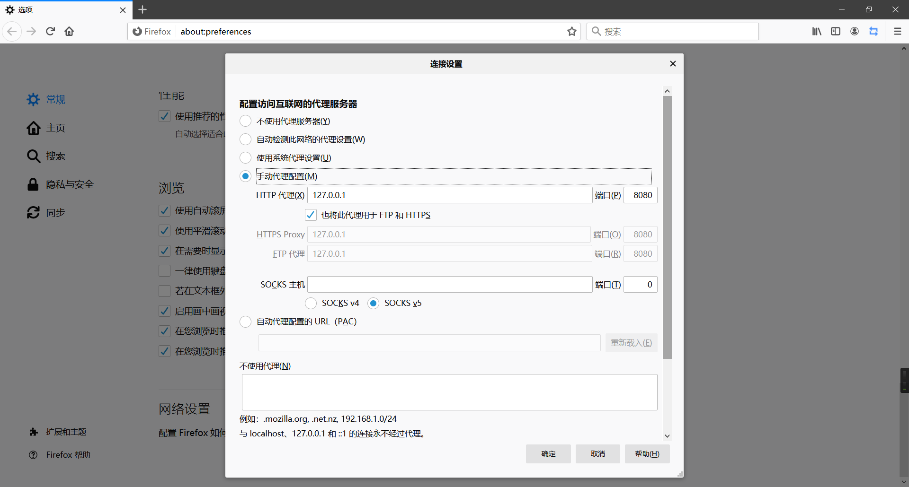
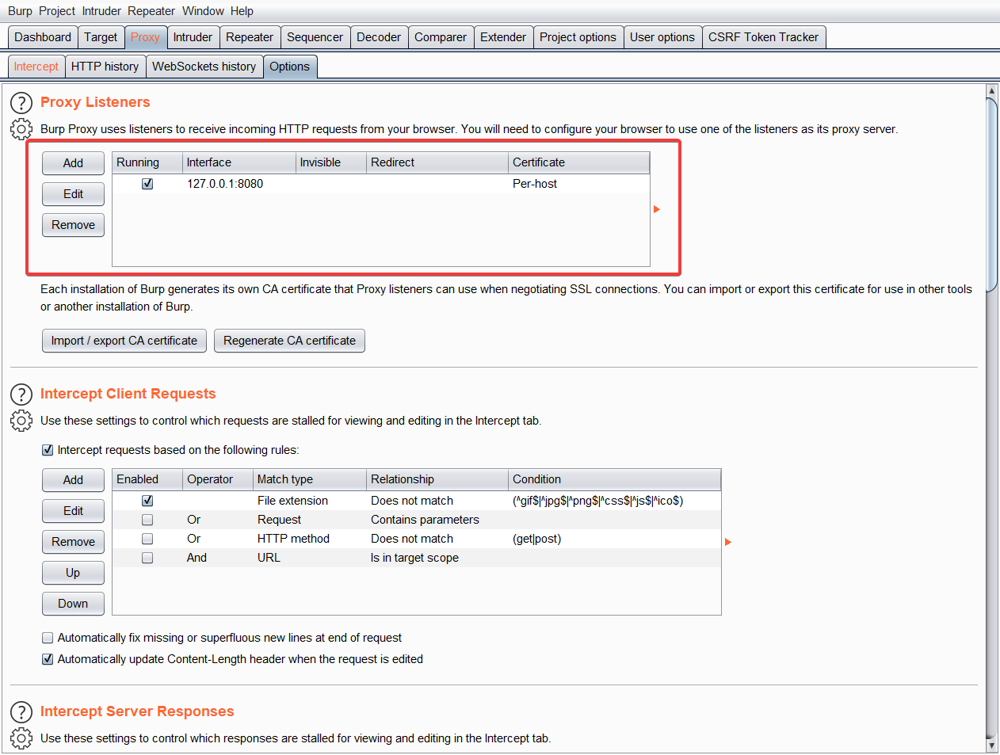
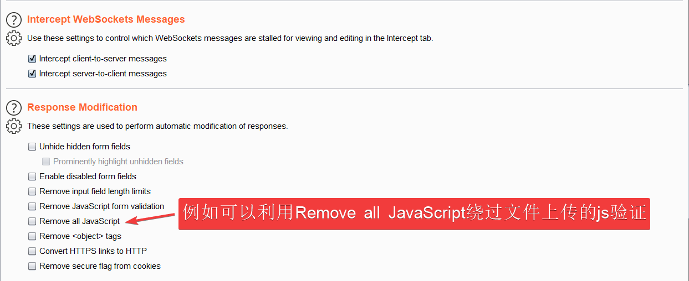
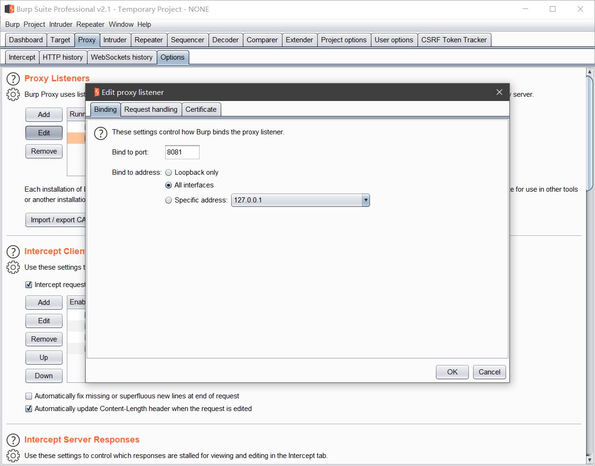
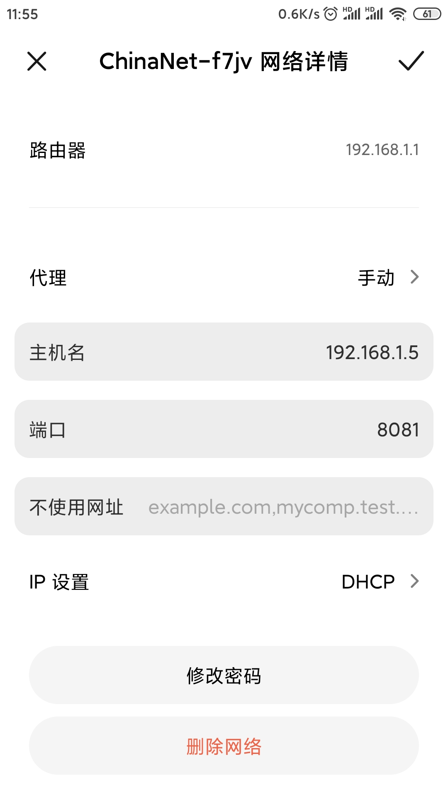
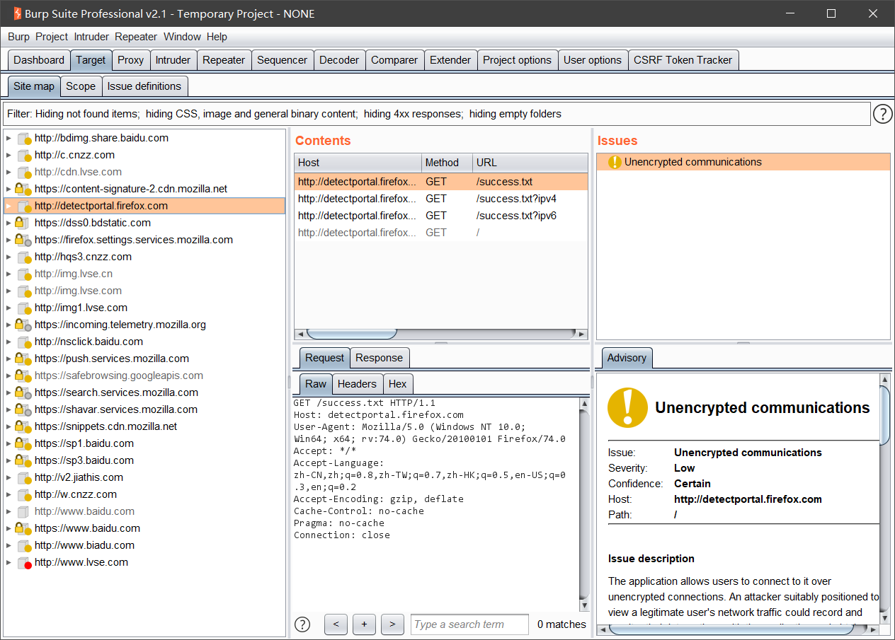
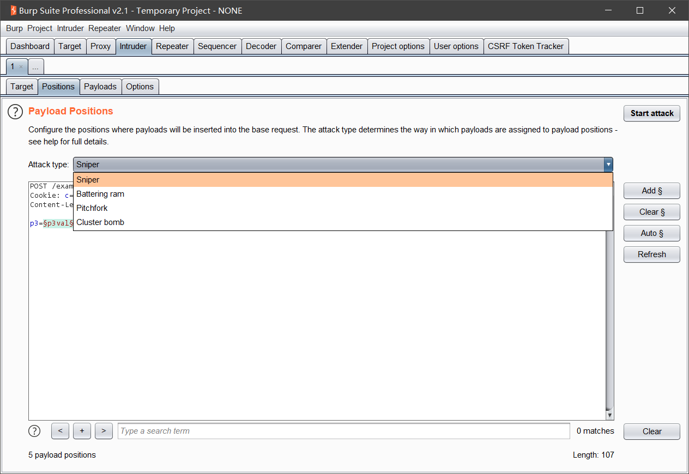

# BurpSuite学习使用

## BurpSuite工具全解析

### BurpSuite安装&配置

- 介绍：BurpSuite是一款用JAVA语言编写的跨平台软件，用于攻击web应用程序的集成平台，包含了许多工具。BurpSuite为这些工具设计了许多接口，以加快攻击应用程序的过程。所有工具都共享一个请求，并能处理对应的HTTP 消息、持久性、认证、代理、日志、警报。
- 配置环境：[下载并安装JRE](http://java.com/download)
  JDK是java开发工具包，是程序员使用java语言编写java程序所需的开发工具包，是提供给程序员使用的。JRE是java运行时环境，包含了java虚拟机，java基础类库。是使用java语言编写的程序运行所需要的软件环境，是提供给想运行java程序的用户使用的。而JDK包含了JRE。
- 安装：直接在[官网](https://portswigger.net/burp)上下载社区版即可满足使用。
- [在浏览器中安装BurpSuite CA证书](https://portswigger.net/support/installing-burp-suites-ca-certificate-in-your-browser)
- 配置浏览器代理：
  

- 配置BurpSuite代理：（一般默认即可）
  

### BurpSuite Proxy（代理）模块

- Proxy模块是BurpSuite以用户驱动测试流程功能的核心，通过代理模式，可以让我们拦截、查看、修改所有在客户端和服务端之间传输的数据。

- Intercept（截断）部分：

  - Forward表示将截断的HTTP或HTTPS请求发送到服务器。
  - Drop表示将截断的HTTP或HTTPS请求丢弃。
  - Intercept is on 和 Intercept is off 表示开启或关闭代理截断功能。
  - Action表示将代理截断的HTTP或HTTPS请求发送到其他模块或做其他处理。
  - 对Intercept进行Raw、Params、Header、Hex切换查看不同的数据格式。

- HTTP history部分

  - HTTP history用来查看提交过的HTTP请求。
  - Filter可以过滤显示某些HTTP请求。点击Filter就可以打开。对于指定URL可以选中右键点击，执行其他操作。WebSockets hIstory与HTTP history功能类似。

- Options部分

  - Options具有的功能：代理监听设置、截断客户端请求、截断服务器响应、截断WebSocket通信、服务端响应修改（绕过JS验证文件上传）、匹配与替换HTTP消息中的内容、通过SSL连接Web服务器配置、其他配置选项。

  - 设置 Proxy Listener（代理监听器）

    - 通过设置Proxy Listeners来截断数据流量。比如设置监听端口等。

  - 设置 Intercept Client Requests（拦截客户端请求）

    - 通过设置Intercept Client Requests来截断符合条件的HTTP请求。

  - 设置 Intercept Server Response（服务器响应拦截）

    - 通过设置Intercept Server Response来筛选出符合条件的HTTP响应。

  - 设置拦截Websockets信息以及Response Modification（响应操作）的内容

    

  - 设置 Match and Replace

    - 可以修改和替换HTTP请求和HTTP响应中的内容。

  - 设置 SSL Pass Through

    - 设置使用Burp直接通过SSL直连到目标服务器。

  - 其他设置Miscellaneous

### BurpSuite截断WebAPP流量

- WebAPP介绍

  - 目前WebApp(手机App)的通信任然使用HTTP协议进行对应的通信。可以通过Burp设置代理，然后手机设置网络代理，通过Burp截断手机APP流量。

    

- 手机网络设置

  - 在手机网络设置中，填写对应的代理

    

- BurpSuite截断手机APP流量

  

### BurpSuite剔除JS脚本（绕过JS文件上传验证）

- JavaScript介绍

  - JavaScript一种直译式脚本语言，是一种动态类型、弱类型、基于原型的语言，内置支持类型。它的解释器被称为JavaScript引擎，为浏览器的一部分，广泛用于客户端的脚本语言，最早是在HTML网页上使用，用来给HTML网页增加动态功能。

  - 例如：对于文件上传的JS验证

    

- BurpSuite截断响应剔除JavaScript脚本
  - 在Proxy模块中的Option下Response Modification，可以勾选Remove all JavaScript剔除JavaScript脚本。
- 浏览器审计工具进行手动剔除JavaScript脚本
  - F12手动剔除

### BurpSuite Target（目标）模块

- Target介绍

  - Target模块主要包含site map（站点地图）、scope（作用域）、issue definition（问题定义）三部分组成，他们帮助渗透测试人员更好地了解目标应用的整体状况、当前的工作涉及哪些目标域、分析可能存在的攻击面等信息。

- Target Scope介绍

  - 作用域的定义比较宽泛，通常来说，当我们对某个产品进行渗透测试时，可以通过域名或者主机名去限制拦截内容，这里域名或主机名就是我们说的作用域；如果我们想限制得更为细粒度化，比如，你只想拦截login目录下的所有请求，这时我们也可以在此设置，此时，作用域就是目录。

- Target Site Map介绍

  - 的左边为访问的URL，按照网站的层级和深度，树形展示整个应用系统的结构和关联其他域的url情况；右边显示的是某一个url被访问的明细列表，共访问哪些url，请求和应答内容分别是什么，都有着详实的记录。 基于左边的树形结构，我们可以选择某个分支，对指定的路径进行扫描和抓取。

    

- Target Site Map分析

  - 通过对站点地图 Sitemap进行分析，分析其中页面的提交参数等。

    

  

  - 对于同一Web系统，不登录与登录系统是具有不同的响应的。针对这样的情况可以使用Burpsuite中Sitemap比较两者的区别。

    

### Burpsuite Dashboard（仪表盘）模块

- Burp 1.x具有的Spider和Scanner模块被集合到了Burp 2.x中的Dashboard模块中。

  

- Dashboard介绍
  - Dashboard分为三部分：Tasks（任务）、Event log（事件日志）、issue activity（动态发现的问题）。
- Tasks部分
  - Tasks 中自带了两个模版，相当于以前版本的spider 和scanner 模块的结合体，支持自定义创建。
    1. live passive crawl from proxy(all traffic)  #（来自代理（所有流量）的被动抓取）
    2. live audit from proxy(all traffic)                # （来自代理（所有流量）的实时审计）
- Event log：这个主要是BurpSuite出现问题或异常状况查看日志用。

### BurpSuite Intruder（入侵）模块

- Intruder介绍

  - 在渗透测试过程中，我们经常使用Burp Intruder，它的工作原理是：Intruder在原始请求数据的基础上，通过修改各种请求参数，以获取不同的请求应答。每一次请求中，Intruder通常会携带一个或多个payload，在不同的位置进行攻击重放，通过应答数据的比对分析来获得需要的特征数据。

- 使用场景

  1. 标识符枚举Web应用程序经常使用标识符来引用用户、账户、资产等数据信息。
  2. 提取有用的数据在某些场景下，而不是简单地识别有效标识符，你需要通过简单标识符
     提取一些其他的数据。
  3. 模糊测试很多输入型的漏洞，如SQL注入，跨站点脚本和文件路径遍历可以通过请求参数提交各种测试字符串，并分析错误消息和其他异常情况，来对应用程序进行检测。由于的应用程序的大小和复杂性，手动执行这个测试是一个耗时且繁琐的过程。这样的场景，您可以设置Payload，通过Burp Intruder自动化地对Web应用程序进行模糊测试。

- 使用步骤

  1. 设置代理，开启Burpsuite截断需要测试的请求。
  2. 将截断的请求发送到Burpsuite Intruder，设置Payload测试。
  3. 筛选Intruder结果，选取有用信息。

- Intruder Positions部分 攻击模式选择

  - Sniper（狙击手）
    - 需要字典：1个【payload set部分只能选择1】
    - 变量数量：不限
    - 加载顺序：将字典**依次**填入所有变量中。
  - Battering ram（攻城槌）
    - 需要字典：1个【payload set部分只能选择1】
    - 变量数量：不限
    - 加载顺序：将字典**同时**填入所有变量中
  - Pitchfork（草叉）
    - 需要字典：N个【payload set可以选择N个】
    - 变量数量：N个【需要和字典数量相同】
    - 加载顺序：字典和变量分别对应，同时填入对应变量中；且字典1中的payload与字典2中的payload为**映射**关系。
  - Cluster bomb（集束炸弹）
    - 需要字典：N个【payload set可以选择N个】
    - 变量数量：N个【需要和字典数量相同】
    - 加载顺序：字典和变量分别对应，分别填入对应变量中；且字典1中的payload与字典2中的payload为**笛卡尔积**的关系。

  

突然发现有份burpsuite文档还没有看......里面的内容比我做的笔记还详细.......那我还做这笔记干嘛[哭笑]

end.

## BurpSuite原理到实战

### 攻击身份验证系统

- 身份验证是应用程序防御恶意攻击的核心。它是防止未经授权访问的第一线。如果攻击者可以绕过防御措施，他通常会完全控制应用程序的功能，并可以不受限制地访问其中的数据。如果没有强大的身份验证依赖，其他核心安全机制（例如会话管理和访问控制）都不会有效。
- 身份验证如今复杂多样，有传统的登陆，也有双因素（2FA）认证【常用的双因素组合是密码 + 某种个人物品，如银行卡+密码】，还有单点登陆（SSO）【当用户在身份认证服务器上登录一次以后，即可获得访问单点登录系统中其他关联系统和应用软件的权限】，0Auth2.0认证【第三方应用认证】。如图就是传统登陆的情况，而针对不同的认证模式，利用Burpsuite进行测试的方式也是不同的，这次就只针对传统登陆的情况。

### SQL时间盲注

- 基于时间的盲注是实际漏洞挖掘场景中最为常用的一个注入手段，因为相比于报错注入或者是布尔盲注，针对基于时间盲注的防御措施十分稀少，较多的开发人员专注于页面的输出控制而忽略了基于时间盲注这种无需关注输出的内容而是针对输出过程做判断的手段。
- sleep()或benchmark()函数，sleep(5);延迟5s，benchmark(1e8,1*1);执行10^8次1\*1达到延迟。

### 绕过前端控件限制

- 比如你在电商平台购物的时候，各种购买条件都是被限制住的，比如数量只能填写数字，收件人的手机号必须符合手机号码的格式，如果不这么做，那页面就会发出提示的信息，告诉你现在的操作是不被允许的，在大部分情况下，都是通过前端JS来校验用户的输入，从而判断出操作是否规范，这就是前端JS验证。
- 隐藏表单最直观的体现就是，在最后支付的时候，客户仅仅只需要点击一个确认按钮，后台就能知道你要买的东西是什么，需要付多少钱，而不需要用户一个框一个框的填写金额，数量，商品名等等，这都是因为在用户点击确认按钮后，发送的http请求往往是携带更多参数的，这些都是被隐藏在表单之中杜绝被用户任意篡改的。
- 客户端的输入是多种多样的，如果web应用程序仅仅依靠客户端控件来控制客户端提交给服务器的数据，往往会产生安全漏洞。比较常见的就有：XX平台0元购买苹果手机，xx运营商平台无视用户绑定任意号码充值，这些都是因为客户端校验的不安全性所导致的漏洞。

### 扫描网站

- 当使用被动扫描模式时，Burp不会重新发送新的请求，它只是对已经存在的请求和应答进行分析，这对系统的检测比较安全，尤其在你授权访问的许可下进行的，通常适用于生产环境的检测。当某种业务场景的测试，每测试一次都会导致业务的某方面问题时，我们可以使用被动扫描模式，去分析问题是否存在，减少测试的风险。
  - 提交的密码为未加密的明文。
  - 不安全的Cookie的属性，比如缺少的HttpOnly和安全标志。
  - cookie的范围缺失。
  - 跨域脚本包含和站点引用泄漏。
  - 表单值自动填充，尤其是密码。
  - SSL保护的内容缓存。
  - 目录列表。
  - 提交密码后应答延迟。
  - session令牌的不安全传输。
  - 敏感信息泄露，像内部IP地址，电子邮件地址，堆栈跟踪等信息泄漏。
  - 不安全的ViewState的配置。
- 当使用主动扫描模式时，Burp会向应用发送新的请求并通过payload验证漏洞。这种模式下的操作，会产生大量的请求和应答数据，直接影响系统的性能，通常使用在非生产环境。它对下列的两类漏洞有很好的扫描效果：客户端的漏洞：XSS、Http头注入、操作重定向；服务端的漏洞：SQL注入、命令行注入、文件遍历。
- 对于第一类漏洞，Burp在检测时，会提交一下input域，然后根据应答的数据进行解析。在检测过程中，Burp会对基础的请求信息进行修改，即根据漏洞的特征对参数进行修改，模拟人的行为，以达到检测漏洞的目的。对于第二类漏洞，一般来说检测比较困难，因为是发生在服务器侧。比如说SQL注入，有可能是返回数据库错误提示信息，也有可能是什么也不反馈。Burp在检测过程中，采用各个技术来验证漏洞是否存在，比如诱导时间延迟、强制修改Boolean值，与模糊测试的结果进行比较，已达到高准确性的漏洞扫描报告。

### 测试Dom_XSS

- DOM：文档对象模型，是HTML和XML文档的编程接口。它允许脚本（js）控制Web页面、窗口和文档。简单来说，DOM就是一张映射表，记录着一堆用代码操控document时的规章制度，更直白点，就是js操作html时的API。
- document.referer属性，window.name属性，location属性，innerHTML属性，documen.write属性等等这些都是可能出现漏洞的地方，而在安全挖掘时也该多多关注这些。

### 测试CSRF

- CSRF（Cross-site request forgery），中文名称：跨站请求伪造。简单来说，就是攻击者盗用了你的身份，以你的名义发送恶意请求。危害：修改密码，发送消息，购买商品，虚拟货币转账
- 防御：
  1. 验证HTTP Referer 字段
  2. 在请求地址中添加token并验证
  3. 在HTTP头中自定义属性并验证
- 验证：
  1. 重放请求====>无一次性token或验证码
  2. referer去掉后重放请求====>无referer验证
  3. 去掉token后重放====>后端认证机制薄弱

### 测试CORS漏洞

- CORS（跨域资源共享）：
  - CORS的用途主要是为了跨域请求，读写资源，目前的主流浏览器都支持CORS CORS的漏洞，既然是用于跨域场景，自然少不了跨域中经常存在的一些安全问题，例如信息泄露等等，CORS的漏洞主要来源于服务端对于Origin的弱校验，从而导致黑客只要构造了一个CORS请求，就能跨域获取到信息。
  - 但是如果跨域请求中允许携带cookie访问（Access-Control-Allow-Credentials:true），就不允许Origin被设置成Access-Control-Allow-Origin:\*，这样的请求会被浏览器屏蔽。
- 特征：
  - 请求中携带CORS特征：Origin:xxxxxxxx
  - 响应中携带CORS特征：
    - Access-Control-Allow-Origin:xxxxxxx 
    - Access-Control-Allow-Methods:POST，GET，OPTIONS 
    - Access-Control-Allow-Credentials:true
- 验证：修改请求中携带CORS特征：Origin:`修改内容(可构造payload)`，返回的响应Access-Control-Allow-Origin:`修改内容`，且Access-Control-Allow-Credentials:true，则表示存在CORS漏洞。

end.