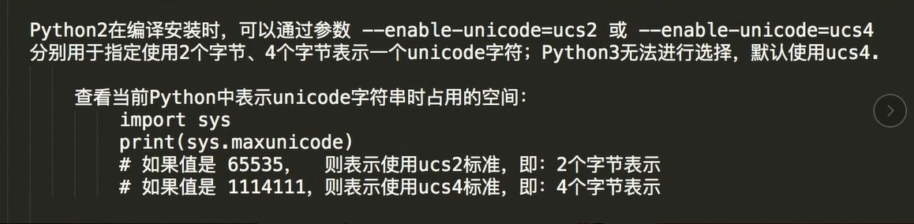

# Python编程基础

## Day1

- 编译型：一次性将所有程序编译成二进制文件。

  - 缺点：开发效率低，不能跨平台。
  - 优点：运行速度快。
  - C，C++等
- 解释型：当程序执行时，一行一行的解释。

  - 优点：开发效率高，可以跨平台。
  - 缺点：运行速度慢。
  - python，php等


- 变量命名规则：变量名可以包括字母、数字、下划线，但是数字不能做为开头。

- Python2打印中文会出现报错，解决方法：首行添加代码：`#-*- encoding:utf-8 -*-`
- python中没有常量，约定俗成全大写为“常量”
- 单行注释：#
- 多行注释：'''注释内容''' 或 """注释内容"""
- 不等于：!= 或 <>
- int（整型）

  - 加减乘除取余+-*/% 幂** 整除//（9//2 输出结果4，9.0//2.0输出结果4.0）
  - 在32位机器上，整数的位数为32位，取值范围为-2^31 ~ 2^31-1，即-2147483648～2147483647
  - 在64位系统上，整数的位数为64位，取值范围为-2^63 ～ 2^63-1，即-9223372036854775808～9223372036854775807
- str（字符串）

  - python当中凡是用引号引起来的都是字符串。
  - 可相加：字符串的拼接。
  - 可相乘：str * int（字符串的重复）
- bool（布尔值）

  - True 、False
- type()可显示数据类型
- input（用户交互）

  - name = input('请输入您的名字：')
  - input输入的内容类型均为str


- if、elif、else：

if 条件 :

  满足条件执行的内容

elif 条件:

  满足上面的条件执行这个

elif 条件:

  满足上面的条件执行这个

else:

  上面所有的条件不满足执行这个

【python中"满足条件执行的内容"前为一个"tab键"或"4个空格"且要统一】

 

- while：

while 条件:

循环体

【python中"循环体"前为一个"tab键"或"4个空格"且要统一】

跳出循环：

- 改变条件
- break：直接跳出循环体
- continue：跳出本次循环，进入下次循环


- 优先级：() > not > and     > or
- x or y  若x为True，则返回x 【and相反】

  - \# print(1 or 2) # 1
  - \# print(3 or 2) # 3
  - \# print(0 or 2) # 2
  - \# print(0 or 100) # 100
- 一个非零数字转换为布尔值为True，零转换为布尔值为False
- Ture转换为数字是1，False转换为数字是0
- 0、None、''、()、[]、{} ==> Flase
- str -----> bool：非空即为True


- 三元运算

  ```python
  a = 1
  b = 5
  c = a if a>b else b   #三元运算
  print(c)              #输出5
  ```

  

## Day2

### 格式化输出：

- 占位符：%s字符串占位符，%d整数占位符，%f浮点数占位符【若要在格式化输出中单纯输出%，需用%%表示】

  ```python
  name = input ('请输入您的姓名：')
  age = input ('请输入您的年龄：')
  height = input ('请输入您的身高：')
  msg = '''------------info of %s-------------
  Name   : %s
  Age    : %s
  Height : %s
  ----------------EDN----------------''' %(name,name,age,height)
  print (msg)
  ```


- format()

  ```python
  s = '我叫{}，今年{}岁，爱好{}，昵称{}'.format('None',20,'女','None')
  print (s)
  s = '我叫{0}，今年{1}岁，爱好{2}，昵称{0}'.format('None',20,'女')
  print (s)
  name = input('请输入您的姓名：')
  s = '我叫{name}，今年{age}岁，爱好{hobby}，昵称{name}'.format(age = 20,name = name,hobby = '女')
  print (s)
  ```

  

### while-else

- 当while被break打断时，不执行else


### ASCII码

- 8位bit = 一个字节byte
- 最左边那位都为0，为预留位
- 1024 byte = 1 kb

### 万国码 unicode

- 一个字符用四个字节（32位）表示

### Unicode 升级 utf-8

- utf-8 一个字符最少用8位去表示
- 一个英文用一个字节（8位）表示
- 一个欧洲文字用两个字节（16位）表示
- 一个中文用三个字节（24 位）表示

### gbk

- 国产，只能用于中文和ascii码中的文字。
- 一个中文用两个字节（16位）表示


## Day3

- .bit_length()输出整数的bit位数

  ```python
  i = 10
  print (i.bit_length())
  ```


### 字符串的索引与切片

```python
s = 'ABCDEFG'
#索引
s1 = s[0]       #形成了一个新的字符串
s2 = s[1]
print (s1)      #输出A
print (s2)      #输出B
s3 = s[-1]
s4 = s[-2]
print (s3)      #输出G
print (s4)      #输出F
#切片：顾头不顾尾
s5 = s[0:4]
print (s5)      #输出ABCD
s6 = s[0:-1]
print (s6)      #输出ABCDEF
s7 = s[0:]
print (s7)      #输出ABCDEFG
s8 = s[:]
print (s8)      #输出ABCDEFG
#[首:尾:步长]
s9 = s[0:5:2]   #隔一个取一个
print (s9)      #输出ACE
s10 = s[0:7:3]  #隔两个取一个
print (s10)     #输出ADG
s11 = s[4:0:-1]
print (s11)     #输出EDCB
s12 = s[3::-1]
print (s12)     #输出DCBA
s13 = s[3::-2]
print (s13)     #输出DB
s14 = s[::-1]
print (s14)     #输出GFEDCBA
```


### 字符串的操作

```python
s = 'nOnE'
s1 = s.capitalize()         #首字母大写
print (s1)                  #输出None
s2 = s.upper()              #全部大写
print (s2)                  #输出NONE
s3 = s.lower()              #全部小写
print (s3)                  #输出none
s4 = s.swapcase()           #大小写翻转
print (s4)                  #输出NoNe
#每个隔开的(特殊字符或数字)单词首字母大写
a = 'none*is_admin'
s5 = a.title()
print (s5)                  #输出None*Is_Admin
s6 = s2.center(10)          #居中，10个位置
print (s6)                  #输出   NONE   
s7 = s2.center(10,'-')      #居中，用-填充
print (s7)                  #输出---NONE---
#若字符串里出现\t则补满前面8位/16位
b = 'abcd\tefgh'
s8 = b.expandtabs()
print (s8)                  #输出abcd    efgh
c = '我是None'
l = len(c)                  #计算字符串长度
print (l)                   #输出6
#判断以什么开头、结尾【str切片】
s9 = a.startswith('no')     #判断是否以no开头
print (s9)                  #输出True
s10 = a.startswith('*',4)   #判断第5位是否以*开头
print (s10)                 #输出True
s11 = a.endswith('admin')   #判断是否以admin结尾
print (s11)                 #输出True
#通过元素找索引，找不到返回-1
s12 = a.find('admin')       #找admin
print (s12)                 #输出8
#通过元素找索引，找不到则报错
s13 = a.index('admin')      #找admin
print (s13)                 #输出8
#删除机制：首尾同时进行元素检索删除，直到遇到非检索元素
#strip左右都删，rstrip删右，lstrip删左
s14 = s6.strip()            #默认删除前后的空格
print (s14)                 #输出NONE
s15 = s7.strip('-')         #删除前后的-
print (s15)                 #输出NONE
d = '*none-none-'
s16 = d.strip('-*')         #删除前后的-和*
print (s16)                 #输出none-none
s17 = d.rstrip('-*')        #删除右边的-和*
print (s17)                 #输出*none-none
s18 = d.count('n')          #统计字符串中n的个数
print (s18)                 #输出4
s19 = d.count('no')         #统计字符串中no的个数
print (s19)                 #输出2
s20 = d.count('n',0,4)      #统计字符串0-4中n的个数
print (s20)                 #输出2
#str ======> list
s21 = d.split('-')          #以-分割，默认不写是空格
print (s21)                 #输出['*none', 'none', '']
s21 = d.split('-',1)        #以-分割一次
print (s21)                 #输出['*none', 'none-']
s22 = d.replace('none','None')#替换，默认全部替换
print (s22)                 #输出*None-None-
s23 = d.replace('none','None',1)#只替换第一个
print (s23)                 #输出*None-none-
#is系列
print (d.isalnum())         #判断字符串是否由字母或数字组成
print (d.isalpha())         #判断字符串是否由字母组成
print (d.isdigit())         #判断字符串是否由数字组成
#for-in
for i in d:
    print(i)                #遍历输出字符串的元素
#if-in
if 'none' in d:
    print ('你好，None！')   #判断字符串中是否含有某些字符
```


## Day4




### 元组tupe()

- 元组：俗称不可变的列表,又被成为只读列表，元祖也是python的基本数据类型之一，用小括号括起来，里面可以放任何数据类型的数据，查询可以，循环也可以，切片也可以，但就是不能改。例：（1，2，3）（"a"，"b"，"c"）


### 列表list[]

- 列表是python的基础数据类型之一     ,其他编程语言也有类似的数据类型。比如JS中的数组， java中的数组等等.。它是以[ ]括起来，每个元素用' ,     '隔开而且可以存放各种数据类型：列表是python中的基础数据类型之一，其他语言中也有类似于列表的数据类型，比如js中叫数组，他是以[]括起来，每个元素以逗号隔开，而且他里面可以存放各种数据类型比如：li = ['alex',123,Ture,(1,2,3,'wusir'),[1,2,3,'小明'],{'name':'alex'}]
- 列表相比于字符串，不仅可以储存不同的数据类型，而且可以储存大量数据，32位python的限制是     536870912 个元素,64位python的限制是 1152921504606846975     个元素。而且列表是有序的，有索引值，可切片，方便取值。


### 增删查改

```python
#增
l = [0,1,'overwatch','none',[2,3]]
print(l[2])           #输出overwatch
print(l[4])           #输出[2, 3]
l.append('admin')
print(l)              #输出[0, 1, 'overwatch', 'none', [2, 3], 'admin']
l.insert(3,'player')
print(l)              #输出[0, 1, 'overwatch', 'player', 'none', [2, 3], 'admin']
l.extend('DG')        #extend迭代处理增添元素
print(l)              #输出[0, 1, 'overwatch', 'player', 'none', [2, 3], 'admin', 'D', 'G']
l.extend([4,5,6])
print(l)              #输出[0, 1, 'overwatch', 'player', 'none', [2, 3], 'admin', 'D', 'G', 4, 5, 6]

#删
l = [0,1,'overwatch','none',[2,3]]
delete = l.pop(2)
print(l)              #输出[0, 1, 'none', [2, 3]]
print(delete)         #输出overwatch【pop有返回值】
l.pop()               #默认删最后一个
print(l)              #输出[0, 1, 'none']
del l[0:2]            #删除前两个元素
print(l)              #输出['none']
l.clear()             #清空列表
print(l)              #输出[]

#查
l = [0,1,'overwatch','none',[2,3]]
print(l[2])           #切片查找overwatch
for i in l:           #迭代查找
    print(i)
#0
#1
#overwatch
#none
#[2,3]
l = [0,1,'overwatch','none',[2,3]]
print(l[2][1])        #输出v

#改
l = [0,1,'overwatch','none',[2,3]]
l[3] = l[3].upper()   #改变第4个元素
print(l)              #输出[0, 1, 'overwatch', 'NONE', [2, 3]]
l[0:2] = 'win'        #迭代处理改动元素
print(l)              #输出['w', 'i', 'n', 'overwatch', 'NONE', [2, 3]]
l[0:3] = [1,2,'win']  #迭代处理改动元素
print(l)              #输出[1, 2, 'win', 'overwatch', 'NONE', [2, 3]]

#其他
l = [0,1,'overwatch','none',[2,3]]
print(len(l))         #输出5
print(l.count('none'))#对none计数，输出1
print(l.index('none'))#查找none的索引【列表无find】，输出3

#排序
l = [6,4,2,3,8,9,1]
l.reverse()           #翻转
print(l)              #输出[1, 9, 8, 3, 2, 4, 6]
l.sort()              #正向排序
print(l)              #输出[1, 2, 3, 4, 6, 8, 9]
l.sort(reverse=True)  #反向排序
print(l)              #输出[9, 8, 6, 4, 3, 2, 1]

#元组【元组的元素只读，元组里的列表可动】
y = (0,1,'none',3,[4,5,'overwatch'])
y[4][2] = y[4][2].upper()
print(y)              #输出(0, 1, 'none', 3, [4, 5, 'OVERWATCH'])
y[4][1] = 'nice'
print(y)              #输出(0, 1, 'none', 3, [4, 'nice', 'OVERWATCH'])
del y[4][2]
print(y)              #输出(0, 1, 'none', 3, [4, 'nice'])
y[4].append('OK')
print(y)              #输出(0, 1, 'none', 3, [4, 'nice', 'OK'])

s = 'none'
s1 = '-'.join(s)      #join()里为可迭代对象，如字符串列表元组
print(s1)             #输出n-o-n-e

#str 转为 list 用 split
#list 转为 str 用 join
l = ['none','is','admin']
s2 = ' '.join(l)
print(s2)             #输出none is admin

#range(n,m)相当于[n,.....,m-1]且n<m，否则输出为空
for i in range(-2,2):
    print(i)
    #-2
    #-1
    #0
    #1
for i in range(-2,4,2):
    print(i)
    #-2
    #0
    #2
```


## Day5

- 数据类型划分：可变数据类型，不可变数据类型

  - 不可变数据类型：元组、bool、int、str    可哈希
  - 可变数据类型：list、dict、set                    不可哈希
- dict、key：必须是不可变数据类型，可哈希；value：任意数据类型。

### 字典dict{}

- 字典的每个键值 key=>value 对用冒号 : 分割，每个键值对之间用逗号 , 分割，整个字典包括在花括号 {} 中。
- dict 优点：
- 二分查找去查询
  - 存储大量的关系型数据
- 字典是python中唯一的映射类型，采用键值对（key-value）的形式存储数据。python对key进行哈希函数运算，根据计算的结果决定value的存储地址，所以字典是无序存储的，且key必须是可哈希的，可哈希表示key必须是不可变类型，如：数字、字符串、元组。
- 字典（dictionary）是除列表以外python之中最灵活的内置数据结构类型。列表是有序的对象运合，字典是无序的对象集合。两者之间的区别在于：字典当中的元素是通过键来存取的，而不是通过偏移存取。

```python
a = 1
b = 2
print(a,b)  #1 2
a,b = b,a   #一行代码实现交换
print(a,b)  #2 1

#字典
dic = {
    'name':'none',
    'age':20,
    'sex':'male',
}

#增
dic['hobby'] = 'game'        #有键值对则覆盖，没有则添加
print(dic)                   #{'name': 'none', 'age': 20, 'sex': 'male', 'hobby': 'game'}
dic.setdefault('hight',175)  #有键值对则不做改变，没有则添加
print(dic)                   #{'name': 'none', 'age': 20, 'sex': 'male', 'hobby': 'game', 'hight': 175}
dic.setdefault('name','admin')
print(dic)                   #{'name': 'none', 'age': 20, 'sex': 'male', 'hobby': 'game', 'hight': 175}

#删
dic.pop('hight')             #有返回值
#print(dic.pop('hight'))     #输出175
print(dic)                   #{'name': 'none', 'age': 20, 'sex': 'male', 'hobby': 'game'}
print(dic.pop('asd',None))   #若没有要删的键则报错，可在","后添加返回值则不报错
dic.popitem()                #py3.5前随机删除，py3.6后删除最后一个
print(dic)                   #{'name': 'none', 'age': 20, 'sex': 'male'}
del dic['name']
print(dic)                   #{'age': 20, 'sex': 'male'}
dic.clear()                  #清空字典
del dic                      #删除字典

#查
dic = {'name':'none','age':20,'sex':'male',}
print(dic['age'])            #输出20，若没有该键则会报错
print(dic.get('name1'))      #输出None，因为没有该键所以返回None，不报错
print(dic.get('name1','没有该值'))#输出：没有该值

print(dic.keys(),type(dic.keys()))#输出dict_keys(['name', 'age', 'sex']) <class 'dict_keys'>
print(dic.values())          #输出dict_values(['none', 20, 'male'])
print(dic.items())           #输出dict_items([('name', 'none'), ('age', 20), ('sex', 'male')])
for i in dic:
    print(i)                 #逐行输出键name//age//sex
for i in dic.values():
    print(i)                 #逐行输出值none//20//male
for i in dic.items():
    print(i)                 #逐行输出键值对('name', 'none')//('age', 20)//('sex', 'male')
for k,v in dic.items():
    print(k,v)               #逐行输出name none//age 20//sex male

#改
dic = {'name':'none','age':20,'sex':'male',}
dic['name'] = 'admin'        ##有键值对则覆盖，没有则添加
print(dic)                   #{'name': 'admin', 'age': 20, 'sex': 'male'}
dic1 = {'name':'none','hobby':'game',}
dic.update(dic1)             #将dic1添加到dic里，有则覆盖，没有则添加
print(dic)                   #{'name': 'none', 'age': 20, 'sex': 'male', 'hobby': 'game'}

#字典的嵌套
dic = {
    'name':['none','admin','asuna'],
    'mike':{
        'age':20,
        'hobby':'game'
    },
    'country':'China'
}
dic['country'] = 'CN'
dic['name'].append('alice')
print(dic['name'])           #输出['none', 'admin', 'asuna', 'alice']
dic['name'][2] = dic['name'][2].capitalize()
print(dic['name'])           #输出['none', 'admin', 'Asuna', 'alice']
dic['mike']['country'] = 'USA'
print(dic['mike'])           #输出{'age': 20, 'hobby': 'game', 'country': 'USA'}
dic['name'].insert(0,'asd')
print(dic['name'])           #输出['asd', 'none', 'admin', 'Asuna', 'alice']

#判断字符串中的整数个数
str = input('>>>')
for i in str:                #对字符串的内容进行逐个检查
    if not i.isdigit():      #判断内容是否为数字
        str = str.replace(i,' ')#若元素不为数字则替换为空格
l = str.split()              #将字符串转换为列表
print(len(l))                #统计列表的元素格个数并输出
```


## Day6

### ascii

- A : 00000010 8位 一个字节

### unicode

- A ：00000000 00000001     00000010 00000100 32位 四个字节
- 中：00000000 00000001     00000010 00000110 32位 四个字节

### utf-8

- A ：00100000 8位 一个字节
- 中：00000001 00000010     00000110 24位 三个字节

### gbk

- A ：00000110 8位 一个字节
- 中：00000010 00000110 16位     两个字节


- 各个编码之间的二进制，是不能互相识别的，会产生乱码。
- 文件的储存，传输，不能是unicode（只能是utf-8 utf-16 gbk,gb2312,asciid等）

- py3中str在内存中是以Unicode编码。传输和储存是以bytes类型。

 ### bytes类型

- 对于英文：

  - str ：

    - 表现形式：s = 'asuna'
    - 编码方式： 01010101 unicode

  -  bytes ：

    - 表现形式：s = b'asuna'
    - 编码方式： 01010101 utf-8、gbk。。。。

- 对于中文：

  - str ：

    - 表现形式：s = '亚丝娜'
    - 编码方式： 01010101 unicode

  - bytes ：

    - 表现形式：s =       b'\xd1\xc7\xcb\xbf\xc4\xc8'
    - 编码方式： 01010101 utf-8、gbk。。。。

```python
# = 赋值，== 判断值是否相等，is 判断内存地址是否相等
li = [1,2,3]
li1 = li
print(li is li1)     #输出True
print(id(li),id(li1))#输出17038760 17038760
#数字，字符串 存在小数据池
#数字：-5 ~ 256
#字符串：不能含有特殊字符，等
n = 6
n1 = 6
print(n is n1)       #输出True


#编码
#str -----> bytes
s = 'asuna'
s1 = s.encode('utf-8')
print(s1)            #输出b'asuna'
s = '亚丝娜'
s1 = s.encode('gbk')
print(s1)            #输出b'\xd1\xc7\xcb\xbf\xc4\xc8'
```


## Day7

### 字典{}与集合({})

```python
#0 '' [] () {}   ------>   False，其他的为True
#元组里面只有一个元素，且没有逗号，该元素是什么类型就什么类型
tu1 = (1)
tu2 = (1,)
print(tu1,type(tu1))           #输出1 <class 'int'>
print(tu2,type(tu2))           #输出(1,) <class 'tuple'>
tu3 = ([1])
tu4 = ([1],)
print(tu3,type(tu3))           #输出[1] <class 'list'>
print(tu4,type(tu4))           #输出([1],) <class 'tuple'>

#要求：删除字典中“键”中含有“k”的键值对
#在循环的字典中删除键值对会报错
# dic = {'k1':'v1','k2':'v2','a3':'v3'}
# for i in dic:
#     if 'k' in i:
#         del dic[i]
#法1
dic = {'k1':'v1','k2':'v2','a3':'v3'}
dic1 = {}
for i in dic:
    if 'k' not in i:
        dic1.setdefault(i,dic[i])
dic = dic1
print(dic)                     #输出{'a3': 'v3'}
#法2
dic = {'k1':'v1','k2':'v2','a3':'v3'}
l = []
for i in dic:
    if 'k' in i:
        l.append(i)
for i in l:
    del dic[i]
print(dic)                     #输出{'a3': 'v3'}

#集合set({})：可变的数据类型，但里面的元素必须是不可变数据类型，无序，不重复
set1 = set({1,2,3})
print(set1)                    #输出{1, 2, 3}
#增
set2 = set({'asd',1,'none','none','asuna'})
set2.add('3')
print(set2)                    #输出{1, 'none', '3', 'asuna', 'asd'} 无序不重复
set2.update('abc')
print(set2)                    #输出{1, 'asuna', 'c', 'asd', 'a', '3', 'b', 'none'}
#删
set2.pop()                     #随机删除，有返回值
print(set2,set2.pop())         #输出{'c', 'asd', 'a', '3', 'b', 'none'} asuna
set2.remove('c')
print(set2)                    #输出{'asd', 'a', '3', 'b', 'none'}
set2.clear()
print(set2)                    #输出set()
#查
set2 = set({'asd',1,'none','none','asuna'})
for i in set2:
    print(i)                   #输出none//1//asuna//asd
#交集
set1 = ({4,5,3,2,1})
set2 = ({1,3,5,6,2})
print(set1 & set2)             #输出{1, 2, 3, 5}
print(set1.intersection(set2)) #输出{1, 2, 3, 5}
#并集
print(set1 | set2)             #输出{1, 2, 3, 4, 5, 6}
print(set1.union(set2))        #输出{1, 2, 3, 4, 5, 6}
#反交集
print(set1 ^ set2)             #输出{4, 6}
print(set1.symmetric_difference(set2)) #输出{4, 6}
#差集
print(set1 - set2)             #输出{4}
print(set1.difference(set2))   #输出{4}
#子集
set1 = ({3,2,1})
set2 = ({1,3,5,6,2})
print(set1 < set2)             #输出True
print(set1.issubset(set2))     #输出True
#超集
print(set2 > set1)             #输出True
print(set2.issuperset(set2))   #输出True

#去重
li = [1,22,22,33,'none','none']
li = list(set(li))
print(li)                      #输出[1, 'none', 22, 33]

#冻结   ----->   不可变
set4 = set({'none','asuna',123})
print(set4,type(set4))         #输出{123, 'none', 'asuna'} <class 'set'>
set4 = frozenset(set4)
print(set4,type(set4))         #输出frozenset({123, 'none', 'asuna'}) <class 'frozenset'>
```


## Day8

### 文件处理

- 文件处理：内存 ↔ 硬盘

1. 文件路径
2. 操作方式：只读，只写，追加，读写，写读......
3. 编码方式：utf-8，gbk......


**读：mode = 'r'**

```python
f = open('E:\test.txt',mode = 'r',encoding = 'utf-8')
content = f.read()
print(content)              #输出0DAY计划
f.close()
```

   

**非文字类文件、上传下载：mode = 'rb'**

```python
f = open('E:\test.txt',mode = 'rb')
content = f.read()
print(content)              #输出b'0DAY\xe8\xae\xa1\xe5\x88\x92'
f.close()
```


**写：mode = 'w'**

```python
f = open('hack',mode = 'w',encoding = 'utf-8')      #没有此文件则创建，有则覆盖
f.write('hack the world')
f.close()
```


**写：mode = 'wb'**

```python
f = open('hack',mode = 'wb')
f.write('hack the world!'.encode('utf-8'))          #str转换为bytes类型
f.close()
```


**追加：mode = 'a'**

```python
f = open('hack',mode = 'a',encoding = 'utf-8')
f.write('hack the world!')
f.close()
```


**读写：mode = 'r+'**

- 若先写后读，则会在文件开头进行写入，读取写入内容后面剩余的内容；读写后再读，无效，只能读取一次】

```python
f = open('hack',mode = 'r+',encoding = 'utf-8')
print(f.read())
f.write('by None')
f.close()
```


**读写：mode = 'r+b'**

```python
f = open('hack',mode = 'r+b')
print(f.read())
f.write('一叶知秋'.encode('utf-8'))
f.close()
```


**写读：mode = 'w+'**

- 如果该文件已存在则打开文件，并从开头开始编辑，即原有内容会被删除。如果该文件不存在，创建新文件。

```python
f = open('hack',mode = 'w+',encoding = 'utf-8')
f.write('by 一叶知秋')
print(f.read())                    #输出为空白
f.close()

f = open('hack',mode = 'w+',encoding = 'utf-8')
f.write('by 一叶知秋')
f.seek(0)                          #将文件指针移至开头
print(f.read())                    #输出by 一叶知秋
f.close()
```


**追加写读：mode = 'a+'**

```python
f = open('hack',mode = 'a+',encoding = 'utf-8')
f.write('by 一叶知秋')
f.seek(0)                          #将文件指针移至开头
print(f.read())                    #输出by 一叶知秋by 一叶知秋
f.close()
```


**read()【一次性读取】**

```python
f = open('hack',mode = 'r+',encoding = 'utf-8')
content = f.read(5)                #单位为字符
print(content)                     #输出by 一叶
f.close
```


**seek()【使文件指针移动到指定位置】**

```python
f = open('hack',mode = 'r+',encoding = 'utf-8')
f.seek(6)                         #单位为字节,若改为seek(4)则会报错，一个中文占3个字节
content = f.read()
print(content)                    #输出叶知秋by 一叶知秋
f.close
```


**tell()【获取文件指针当前的位置】**

```python
f = open('hack',mode = 'a+',encoding = 'utf-8')
print(f.tell())                   #输出30
f.write('hello world')
f.seek(f.tell() - 11)
print(f.read())                   #输出hello world
f.close
```


**readline()   #一行一行的读取**

**readlines()   #每一行当成列表中的一个元素，添加到列表中【一次性读取】**

```python
f = open('hack',mode = 'r+',encoding = 'utf-8')
#print(f.readline())               #输出by 一叶知秋by 一叶知秋
print(f.readlines())              #输出['by 一叶知秋by 一叶知秋\n', 'hello world']
f.close()
```


**显示文件内容【警告：注意读取文件的大小，忌全部读取】**

```python
f = open('hack',mode = 'r+',encoding = 'utf-8')
for i in f:
    print(i)
f.close()
'''
输出为：
by 一叶知秋by 一叶知秋

hello world
'''
```


**truncate()【截取文件】**

```python
f = open('hack',mode = 'r+',encoding = 'utf-8')
f.truncate(15)                    #截存前15个字节的内容
print(f.readlines())              #输出['by 一叶知秋']
f.close()
```


**非close()写法，自动关闭**

```python
with open('hack',mode = 'r+',encoding = 'utf-8') as f:
    print(f.read())               #输出by 一叶知秋
```

```python
with open('hack',mode = 'r+',encoding = 'utf-8') as f,open('hack',mode = 'a+',encoding = 'utf-8') as f1:
    print(f.read())               #输出by 一叶知秋
    f1.write('\nhello world')
    f1.seek(0)
    print(f1.readlines())         #输出['by 一叶知秋\n', 'hello world']
```


**修改文件**

```python
with open('hack',mode = 'r',encoding = 'utf-8') as f,open('hack.bak',mode = 'w',encoding = 'utf-8') as f1:
    for line in f:
        if '一叶知秋' in line:
            line = line.replace('一叶知秋','None')   #修改文件内容
        f1.write(line)   #写文件

import os
os.remove('hack')   #删除原文件
os.rename('hack.bak','hcak')   #重命名新文件
```


### 登录注册

```python
lis = []
i = 3
username = input('请输入注册用户名：')
password = input('请输入初始密码：')
with open('info',mode = 'w',encoding = 'utf-8') as f:
    f.write('{}\n{}'.format(username,password))
print('注册成功！')

while i > 0:
    i-=1
    uname = input('请输入你的用户名：')
    passwd = input('请输入你的密码：')
    with open('info',mode = 'r',encoding = 'utf-8') as f1:
        for line in f1:
            lis.append(line)
    if uname == lis[0].strip() and passwd == lis[1].strip():
        print('登录成功！')
        break
    else:
        print('账号或密码错误！剩余{}次机会！'.format(i))
```


## Day9

### 函数

- 关于<u>参数</u>
  - 没有参数：定义函数和调用函数时括号里都为空
  - 一个参数：传什么就是什么
  - 多个参数：【**顺序：**位置参数，*args，默认参数，**kwargs】
- 关于<u>传参</u>
  - 按照**位置传参**：**必须传，有几个形参就得传几个实参**
  - 按照**关键字传参**：可不传，即使用默认参数
  - 可以混用，但必须是先位置传参再关键字传参（同一个变量仅可传递一个参数）

- 关于<u>返回值</u>
  - 函数中执行了retune后，则该函数后面的内容都不执行
  - 当函数有多个返回值，若只用一个变量接收，得到的是一个元组


- 函数名：地址；函数名+括号：执行


- 默认参数的陷阱：如果默认参数的值是一个可变数据类型，且使用默认参数，那么每一次调用函数时，都是公用这个数据类型的资源


动态参数：用于传递任意个参数，【接受聚合，调用打散】

- 动态参数*args：
  - 默认命名为args
  - 接收的是按照**位置传参**的值，组成一个元组

```python
def sum(*args):
    n = 0
    for i in args:
        n += i
    return n

print(sum(1,2,3,4))                    #输出10
```

- 动态参数**kwargs：
  - 默认命名为kwargs
  - 接收的是按照**关键字传参**的值，组成一个字典

```python
def sum(**kwargs):
    print(kwargs)

print(sum(a = 'aaa',b = 'bbb'))      #{'a': 'aaa', 'b': 'bbb'}
```


动态参数的另一种传参方式

- 在传参时，在实参前面加上*，即对这个实参逐个传参

```python
def func(*args):
    print(args)

l = [1,2,3]
func(*l)                                 #输出(1, 2, 3)

def fun(**kwargs):
    print(kwargs)

d = {'a': 1,'b' : 2}
fun(**d)                                 #输出{'a': 1, 'b': 2}
```


函数的注释

```python
def func():
    '''
    这个函数实现的功能
    参数1：
    参数2：
    return：
    '''
    pass

print(func.__doc__)     #打印该函数的注释
```


## Day10

### 命名空间

- 内置命名空间 —— Python解释器
  - print()、input()、len()
  - 就是Python解释器一启动就可以使用的函数存储在内置命名空间中
  - 启动解释器时就被加载进内存
- 全局命名空间 —— 自定义变量
  - 在程序从上到下被执行的过程中依次加载进内存
- 局部命名空间 —— 函数
  - 函数内部定义的变量
  - 当调用函数时才会产生命名空间，随着函数执行的结束而消失
  - 多个局部命名空间是相互独立的


- 依赖关系：局部命名空间（全局命名空间（内置命名空间））），底层空间可被高层空间调用，但不能反向调用
- 当我们的全局定义和内置命名空间中存在同名时，会使用全局定义的命名空间，即调用查找顺序为局部→全局→内置


### 作用域

- 全局作用域
  - 内置和全局命名空间
  - 可用globals()进行查看，globals()永远显示的是全局的命名空间
- 局部作用域
  - 局部命名空间
  - 可用locals()进行查看，locals()显示的命名空间和其被放置的位置有关


- global
  - 若想在函数内部对函数外的变量进行操作，就需要在函数内部声明其为global。
  - 如果一个变量进行了global声明，那么这个变量在局部的操作将影响全局。
  - global为不安全代码，应用传参进行操作

```python
a = 1
def func():
    global a
    a += 1

func()
print(a)
```


### 闭包

- 闭包
  - 嵌套函数，内部函数调用外部函数的变量
  - 使用`.__closure__`可查看是否为闭包函数
  - 可以减少反复调用时开辟和关闭内存消耗的时间

```python
def outer():
    a = 1
    def inner():
        print(a)
    print(inner.__closure__)     #输出(<cell at 0x00000182AB226BE0: int object at 0x00007FFFC049D6A0>,)

outer()
print(outer.__closure__)         #输出None
```


闭包的常用方法：在函数外部使用函数内部的变量

```python
def outer():
    a = 1            #由于后面会调用该变量，所以不会随函数的结束而消失
    def inner():
        print(a)
    return inner     #返回了inner函数的地址

inn = outer()        #全局变量指向了一个内部函数
inn()                #输出1
```


## Day11

### 装饰器

- 作用：在不修改函数的调用方式的前提下，在原来的函数上添加功能
- 原则：开放封闭原则：对扩展的开放的，对修改是封闭的（用于维护代码的稳定性）
- 本质：闭包函数

```python
import time

def func():
    time.sleep(0.01)
    print('Hello World!')

def wrapper(f):     #装饰器函数
    def inner():
        start = time.time()
        f()        #被装饰的函数
        end = time.time()
        print(end - start)
    return inner

func = wrapper(func)   #将被装饰函数传入装饰函数
func()                 #实际上运行的是inner()
```


### 语法糖

- 以上代码可用**语法糖**来进行简化

```python
import time

def wrapper(f):     #装饰器函数
    def inner():
        start = time.time()
        f()        #被装饰的函数
        end = time.time()
        print(end - start)
    return inner

@wrapper            #语法糖 @装饰器函数
def func():        #被装饰的函数
    time.sleep(0.01)
    print('Hello World!')

func()
```


- 装饰带返回值的函数

```python
import time

def wrapper(f):     #装饰器函数
    def inner():
        start = time.time()
        ret = f()        #记录被装饰的函数的返回值
        end = time.time()
        print(end - start)
        return ret       #返回被装饰函数的返回值
    return inner

@wrapper            #语法糖
def func():
    time.sleep(0.01)
    print('Hello World!')
    return 'by 一叶知秋'

ret = func()
print(ret)
```


- 装饰带参数的函数

```python
import time

def wrapper(f):     #装饰器函数
    def inner(a):  #带上形参
        start = time.time()
        ret = f(a)        #被装饰的函数
        end = time.time()
        print(end - start)
        return ret
    return inner

@wrapper            #语法糖
def func(a):
    time.sleep(0.01)
    print('Hello World!',a)
    return 'by 一叶知秋'

ret = func(1)
print(ret)
```


- 装饰带多个参数的函数

```python
import time

def wrapper(f):     #装饰器函数
    def inner(*args,**kwargs):  #带上形参，动态参数：接受聚合，(1,2)
        start = time.time()
        ret = f(*args,**kwargs)        #被装饰的函数，动态参数：调用打散，*(1,2)
        end = time.time()
        print(end - start)
        return ret
    return inner

@wrapper            #语法糖
def func(a,b):
    time.sleep(0.01)
    print('Hello World!',a,b)
    return 'by 一叶知秋'

ret = func(1,2)
ret = func(1,b=2)
print(ret)
```


- 装饰器的固定格式

```python
def wrapper(f):     #装饰器函数,f是被装饰的函数
    def inner(*args,**kwargs):

        ''' 在被装饰函数之前要做的事 '''

        ret = f(*args,**kwargs)      #被装饰的函数

        ''' 在被装饰函数之后要做的事 '''

        return ret
    return inner

@wrapper            #语法糖
def func(a,b):                       #被装饰的函数
    pass
```


## Day12

### 带参数的装饰器

```python
from functools import wraps
def wrapper(func):
    @wraps(func)     #带参数的装饰器
    def inner(*args,**kwargs):
        print('在被装饰的函数执行前做的事')
        ret = func(*args,**kwargs)
        print('在被装饰的函数执行后做的事')
        return ret
    return inner

@wrapper
def holiday(day):
    '''这是一个放假通知'''
    print('全体放假%s天'%day)
    return '好耶'

print(holiday.__name__)     #输出：holiday，若没有第1,3行代码，则输出inner的信息
print(holiday.__doc__)

ret = holiday(3)
print(ret)
```

