# 软考-信息安全工程师（第一版）

选择题：当你不确定答案的时候，留意绝对性词语

## 第一章-计算机硬件基础

（略）

## 第二章-计算机网络基础

- OSI七层模型

  | 层次 | 名称       | 主要功能                           | 主要设备及协议                                       |
  | ---- | ---------- | ---------------------------------- | ---------------------------------------------------- |
  | 7    | 应用层     | 实现具体的应用功能                 | POP3、FTP、HTTP、Telnet、SMTP、DHCP、TFTP、SNMP、DNS |
  | 6    | 表示层     | 数据的格式与表达、加密、压缩       |                                                      |
  | 5    | 会话层     | 建立、管理和终止会话               |                                                      |
  | 4    | 传输层     | 端到端的连接                       | TCP、UDP                                             |
  | 3    | 网络层     | 分组传输和路由选择                 | 三层交换机、路由器、ARP、RARP、IP、ICMP、IGMP        |
  | 2    | 数据链路层 | 传送以帧为单位的信息、保证数据正确 | 网桥、交换机、网卡、PPTP、L2TP、SLIP、PPP            |
  | 1    | 物理层     | 二进制传输                         | 中继器、集线器                                       |

- TCP/IP模型与OSI模型

  

- ARP：实现IP地址到物理地址的映射；RARP：实现物理地址到IP地址的映射

- 公用IP地址

  
  
  - 将IP地址第一段转换为二进制，对比开头即可判断是哪类地址。

- 专用IP地址
  - A类：10.0.0.0~10.255.255.255，最大主机数：2^24-2=16777214
  - B类：172.16.0.0~172.31.255.255，最大主机数：2^16-2=65534
  - C类：192.168.0.0~192.168.255.255，最大主机数：2^8-2=254

- 子网掩码
  - 将一个网络划分成多个子网（取部分主机号当子网号）
  - 将多个网络合并成一个大的网络（取部分网络号当主机号）
  - 将IP地址与子网掩码的二进制进行“与”运算即可获得网络地址

---

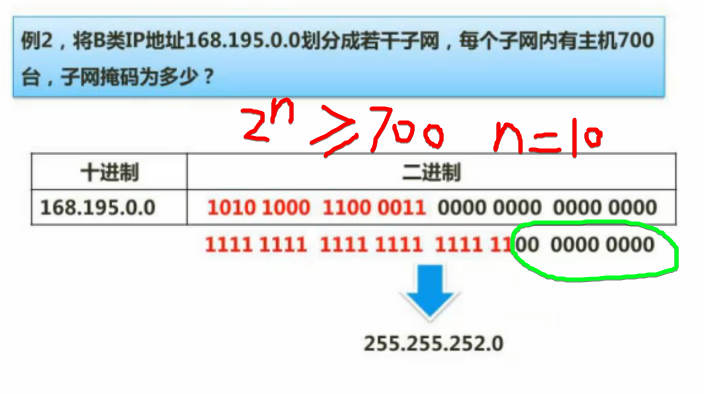

---

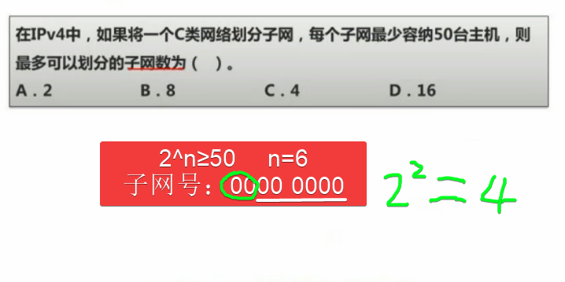

---

- 顶级域名
  - .com：商业机构
  - .net：网络服务机构
  - .org：非营利性组织
  - .gov：政府机构
  - .edu：教育机构
  - .mil：军事机构

- IPv6
  - 128 位的地址空间（2^128）
  - 由 8 个 16 进制字段构成

- IPvV6地址的省写
  - 例如：2001:0db8:85a3:0000:1319:8a2e:0370:7344等价于：2001:0db8:85a3::1319:8a2e:0370:7344
  - 遵守这些规则，如果因为省略而出现了两个以上的冒号，则可以压缩为一个，但这种零压缩在地址中只能出现一次。因此：
    - 2001:0DB8:0000:0000:0000:0000:1428:57ab
    - 2001:0DB8:0000:0000:0000::1428:57ab
    - 2001:0DB8:0:0:0:0:1428:57ab
    - 2001:0DB8:0::0:1428:57ab
    - 2001:0DB8::1428:57ab
    - 以上都是合法的地址，并且它们是等价的。同时前导的零可以省略，因此2001:0DB8:02de::0e13等价于2001:DB8:2de::e13

## 第三章-信息安全基础知识

- **信息安全三要素**：机密性（confidentiality）、完整性（integrity）、可用性（availability）
  - **机密性**：信息不被未授权者知晓
  - **完整性**：信息是正确的、真实的、未被篡改的、完整无缺的
  - **可用性**：信息可以随时正常使用

- **信息安全管理体系**
  - 密码管理：基于密码机制的安全系统
  - 网络管理：功能上包括：配置管理、性能管理、安全管理、故障管理；体系结构包括：协议、表示、安全、对象四方面
  - 设备管理：包括设备的选型、检测、安装、登记、使用、维护和存储管理等
  - 人员管理：确保有关业务人员的思想素质、职业道德和业务素质

- 我国的商用密码管理原船，在中共中央办公厅1996年27号文中，明确了我国发展和管理商用密码实行"**统一领导，集中管理，定点研制，专控经营，满足使用**"的**20字方针**。

- 国家密码管理局于2006年1月6日发布公告，公布了"无线局域网产品须使用的系列密码算法"包括:
  - 对称密码算法：SMS4
  - 签名算法：ECDSA
  - 密钥协商算法：ECDH
  - 杂凑算法：SHA-256
  - 随机数生成算法：自行选择

- 信息系统安全可以划分为以下四个层次：**设备安全，数据安全， 内容安全，行为安全**。其中数据安全即是传统的信息安全。

- **信息安全等级保护**（记忆：**用系安结访**）
  - **用户自主保护级**：隔离用户和数据
  - **系统审计保护级**：在自主访问控制的基础上控制访问权限扩散
  - **安全标记保护级**：具备审计保护所有的功能，提供有关安全策略模型、数据标记，具备准确地标记输出信息的能力，消除通过测试发现的任何错误
  - **结构化保护级**：在安全标记保护级实施的自主和强制访问控制基础上，进一步扩展到所有主体和客体，能够审计利用隐蔽存储信道时可能被使用的事件
  - **访问验证保护级**：满足访问监视器需求，访问监视器仲裁主体对客体的全部访问

- 涉密信息系统安全分级保护
  - 秘密级：其防护水平不低于国家信息安全等级保护**三级**要求
  - 机密级：其防护水平不低于国家信息安全等级保护**四级**要求
  - 绝密级：其防护水平不低于国家信息安全等级保护**五级**要求

- **网络隔离**
  - 第一代【完全隔离】：完全的物理隔离
  - 第二代【硬件卡隔离】：增加硬件卡隔离
  - 第三代【数据转播隔离】：利用转播系统分时复制文件的途径来实现隔离
  - 第四代【空气开关隔离】：使用单刀双掷开关
  - 第五代【安全通道隔离】：通过专用通道硬件和专有安全协议等安全机制来实现内外网络的隔离和数据交换

- 系统安全监控，是指对系统的运行状况和系统中的用户的行为进行监视、控制和记录。安全监控的内容包括有主机系统监视、网络状态监视、用户操作监视、主机应用监视、主机外设监视、网络连接监视等。

- **安全监控**主要分为：
  - 网络安全监控：全面的网络安全机制、细粒度的控制、网络审计和其他包括日志、报警和拦截等功能
  - 主机安全监控：访问控制、系统监控、系统审计、系统漏洞检查

- **风险评估**方法一般可分为三类：定量、定性、定性与定量相结合的综合评估法。

- 信息安全风险评估过程
  - **确定资产**：确定信息系统的资产，并明确资产的价值
  - **脆弱性和威胁分析**：发现资产的脆弱点及由脆弱点所引发的威胁
  - **制定及评估控制措施**：在分析各种威胁及它们发生可能性的基础上，研究消除、减轻、转移威胁风险的手段
  - **决策**：包括评估影响、排列风险、制定决策
  - **沟通与交流**：决策经由领导层的签字批准，并与各方面就决策结论进行沟通
  - **监督实施**：安全措施的实施过程要始终在监督下进行

- 知识产权保护——保护期限

  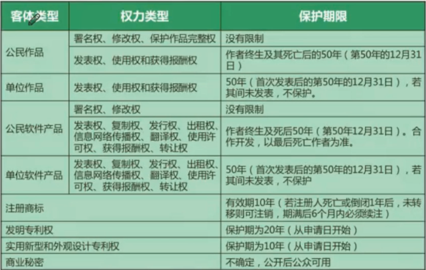

- 知识产权保护——产权人确定

  

- 知识产权保护——侵权判断

  

- **软件著作权产生的时间：自软件开发完成之日起。**
- **【商业秘密权】可以保护软件的技术信息、经营信息。**
- 【软件著作权】保护的是软件产品本身
- 【专利权】保护的是创造性的成果

- 信息安全标注化
  - **国际标准**：ISO、IEC等国际标准化组织
  - **国家标准**：GB-中国，ANSI-美国，BS-英国，JIS-日本
  - **区域(地方)标准**：PASC-太平洋地区标准会议，CEN-欧洲标准委员会，ASAC-亚洲标准咨询委员会，ARSO-非洲地区标准化组织
  - **行业标准**：GJB-中国军用标准，MIT-S——美国军用标准，IEEE-美国电气电子工程师协会
  - **企业标准**

- 我国国家标准代号：强制性标准代号为GB，推荐性标准代号为GB/T，指导性标准代号为GB/Z，实物标准代号GSB
- 行业标准代号：由汉语拼音大写字母组成（如电力行业为DL）
- 地方标准代号：由DB加上省级行政区划分代码的前两位
- 企业标准代号：由Q加上企业代号组成

## 第四章-密码学

### 基本概念

- **密码学**由**密码编制学**（密码编制）和**密码分析学**（密码破译）共同组成。
- 密码学的安全目标：
  - **保密性**：确保信息仅被合法用户访问，而不被泄露给非授权用户、实体或过程
  - **完整性**：指所有资源只能由授权方或以授权的方式进行修改，即信息未经授权不能进行改变
  - **可用性**：指所有资源在适当的时候可以由授权方访问

- 密码体制（密码系统）：

  - **明文空间M**：全体明文的集合

  - **密文空间C**：全体密文的集合

  - **密钥空间K**：全体密钥的集合，其中每一个密钥K均由加密密钥 K~e~ 和解密密钥 K~d~ 组成，即 K = <K~e~，K~d~>

  - **加密算法E**：一族由 M 到 C 的加密变换

  - **解密算法D**：一族由 C 到 M 的解密变换

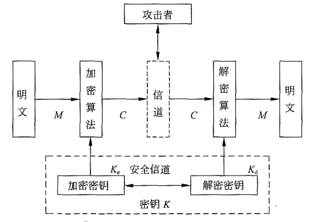

- 对于每一个确定的密钥，加密算法将确定一个具体的加密变换，解密算法将确定一个具体的解密变换，而且解密变换就是加密变换的逆变换。对于明文空间M中的每一个明文 M，加密算法E在密钥 K~e~ 的控制下将明文M加密成密文 C：C=E（M，K~e~）；而解密算法D在密钥 K~d~ 的控制下将密文C解密出同一个明文 M：M = D（C，K~d~）= D（E（M，K~e~），K~d~）

- 如果一个密码体制的 K~d~ = K~e~ ，或由其中一个很容易推出另一个，则称为**单密钥密码体制**或**对称密码体制**或**传统密码体制**。否则称为**双密钥密码体制（非对称密码体制）**。

- 密码分析者攻击密码的方法：
  - **穷举攻击**：采用依次试遍所有可能的密钥对所获得的密文进行解密，直至得到正确的明文；或者用一个确定的密钥对所有可能的明文进行加密，直至得到所获得的密文。
  - **数学分析攻击**：针对加解密算法的数学基础和某些密码学特性，通过数学求解的方法来破译密码。
  - **基于物理的攻击**：利用密码系统实现时泄露的额外信息，推到密码系统中的秘密参数。主要方法包括功耗攻击、电磁场攻击和时间攻击。
- 密码分析者可利用的数据资源：
  - **仅知密文攻击**：攻击者仅根据截获的密文来破译密码。
  - **已知明文攻击**：攻击者根据**已知的某些明文-密文对**来破译密码。（近现代密码学认为，一个密码仅当它能经得起已知明文攻击时才是可取的）
  - **选择明文攻击**：攻击者能够选择明文并获得相应的密文
  - **选择密文攻击**：攻击者能够选择密文并获得相应的明文（主要攻击**公钥密码体制**，特别是**数字签名**）

- 一个密码，如果无论密码分析者截获了多少密文和用什么技术方法进行攻击都不能被攻破，则称为是**绝对不可破译**的。绝对不可破译的密码在理论上是存在的，这就是著名的**“一次一密“密码**。

#### 古典密码

- **置换密码**：把明文中的字母重新排列，字母本身不变，但其位置改变了。

- **代替密码**：首先构造一个或多个密文字母表，然后用密文字母表中的字母或字母组来代替明文字母或字母组，各字母或字母组的相对位置不变，但其本身改变了。代替密码又分为：加法密码、乘法密码、仿射密码。

  - **加法密码**：密文 B = {(a~0~+K) mod n，(a~1~+K) mod n，...，(a~n-1~+K) mod n}；要求 K 是满足 **0＜K＜n** 的正整数。**Caesar（凯撒）密码**（K=3）：把明文字母表循环右移3位得到密文字母表

  - **乘法密码**：密文 B = {a~0~*K mod n，a~1~*K mod n，...，a~n-1~*K mod n}；要求 0＜K＜n 且 K 与 n **互素**（公约数只有1的两个整数，如：13和26的公约数为13则不可）。

    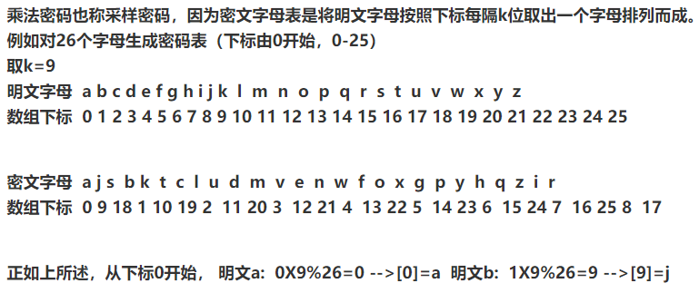

  - **仿射密码**：密文 B = {(a~0~*K~0~+K~1~)mod n，(a~1~*K~0~+K~1~)mod n，...，(a~n-1~*K~0~+K~1~)mod n}；要求 K~0~ 与 n 互素，0≤K~0~＜n；且不允许同时有 K~0~=0，K~1~=1

    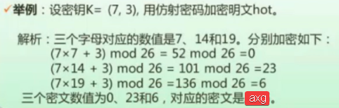

- 简单代替密码：只使用一个密文字母表，并且用密文字母表中的一个字母来代替一个明文字母表中的一个字母。比如：加法密码、乘法密码。
- **多表代替密码**：用多个密文字母表，明文中的每一个字母都有多种可能的字母来代替。多表代替密码的密钥就是这组映射函数或密文字母表，比如著名的 Vigenre（维吉尼亚）密码。
  - **Vigenre（维吉尼亚）密码**的代替规则是用**明文字母**在 Vigenre 方阵中的**列**和**密钥字母**在 Vigenre 方阵中的**行**的交点处的字母来代替该明文字母。

- **代数密码**：**Vernam（维尔南）密码**的明文、密钥和密文均用二元数字序列表示。设明文 M =（m~0~，m~1~，...，m~n-1~），密钥 K =（k~0~，k~1~，...，k~n-1~），密文 C =（c~0~，c~1~，...，c~n-1~），其中 m~i~，k~i~，c~i~ ∈ GF(2)，则 c~i~ = m~i~ ⊕ k~i~ ，i = 0,1,...,n-1；Vernam 密码的加密和解密非常简单，而且**特别适合计算机和通信系统的应用**。

- Vernam 密码经不起己知明文攻击。这是因为只要知道了某些明文-密文对，便可以迅速确定出相应的密钥。如果同一密钥重复使用或密钥本身包含重复，则 Vernam 密码将是不安全的。据此，为了增强 Vernam（维尔南）密码的强度，应当避免密钥重复使用，避免密钥本身包含重复。一种极端情况是：①密钥是真正的随机序列；②密钥至少和现文一样长；③一个密钥只使用一次。如果能够做到这些，则密码就是绝对不可破译的了。

  

- 古典密码的破译方法：
  - 穷举分析
    - 加法密码：对 K 的可能取值逐一穷举
    - 乘法密码：密钥 K 要满足条件（n，k）= 1
    - 仿射密码：密钥 K 有 26×12-1 = 311 种
  - 统计分析
    - 单代替密码的破译大致过程是：首先统计密文的各种统计特征；其次分析双字母、三字母密文组，以区分元音和辅音字母；最后分析字母较多的密文。

### 分组密码

- **分组密码**将明文 M 划分为一系列的明文块 M~i~ ，通常每块包含若干位或字符，并且对每一块都用同一个密钥K~e~进行加密。
- **序列密码**将明文和密钥都划分为位 (bit) 或字符的序列，并且对于明文序列中的每一位或字符都用密钥序列中的对应分量来加密。
  - **分组密码每一次加密一个明文块，而序列密码每一次加密一位或一个字符**。分组密码和序列密码在计算机系统中都有广泛的应用。**序列密码是要害部门使用的主流密码，而商用领域则多用分组密码。**

#### DES 算法

- DES 是一种分组密码。明文、密文和密钥的**分组长度**都是 64 位。
- DES 是面向二进制的密码算法。因而能够加解密任何形式的计算机数据。
- **DES 是对合运算**，因而加密和解密共用同一算法，从而使工程实现的工作量减半。
- **Feistel 结构**。

- DES 加密过程

  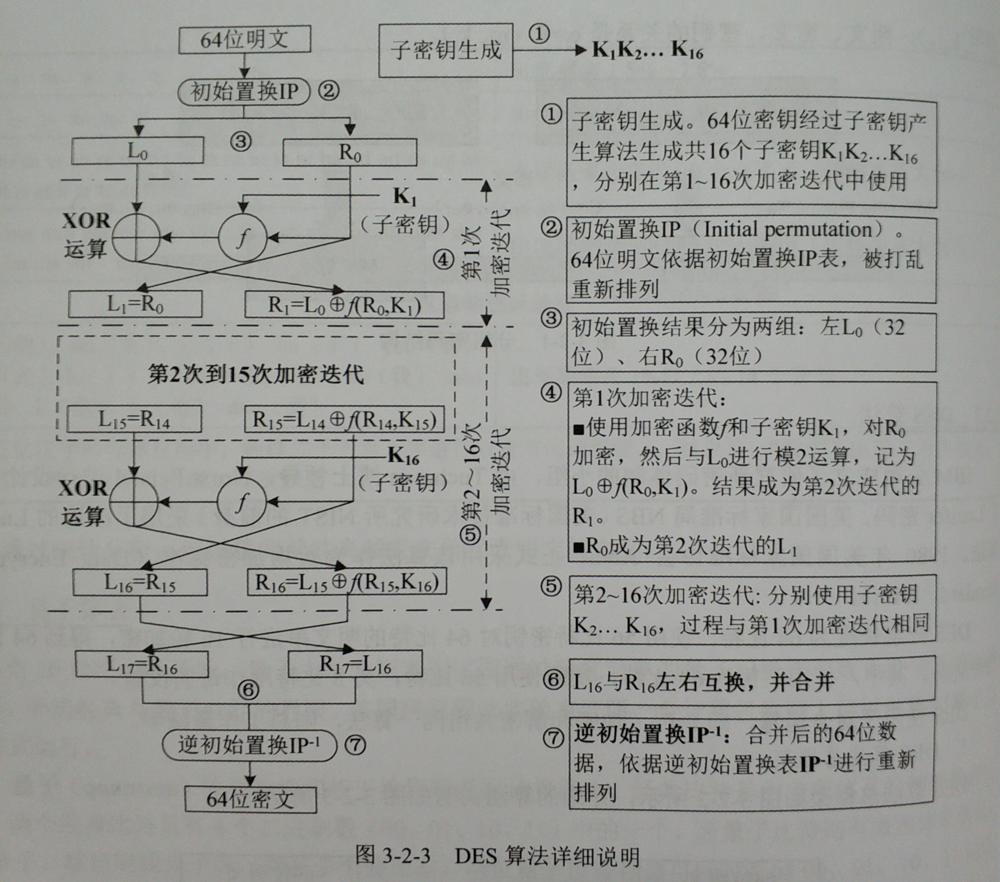

- 子密钥产生过程（详见《信息安全工程师5天修炼》P42）
  - 种子密钥长 64 位，**实际使用 56 位**，密钥中位置为 8 的整数倍的奇偶校验位共 8 个。
  - 64 位密钥经过**置换选择PC1**（64→56位）、**循环左移**（56位）、**置换选择PC2**（56→48位），产生**16个长48位的子密钥**K~1~~K~16~

- **加密函数f**：**选择运算 E **把 R~i-1~ 的 32 位扩展到 48 位，并与 48 位子密钥 K~i~ 进行**异或运算**；然后通过**S盒变换**，将 48 位输入变为 32 位输出；最后进行**置换运算P**将S盒的 32 位输出进行一次置换。
- **S盒变换**：
    - 例如：当 S~1~ 盒输入为 “111000” 时，则第 1 位与第 6 位组成二进制串 “10”（十进制2），中间四位组成二进制 “1100”（十进制12）。查询 S~1~ 盒的 2 行 12 列，得到数字 3 ，得到二进制数是 0011 。**输入 6 位，输出 4 位**。

- DES 的安全性
  - 如果 DES 密钥太短则经不起穷举攻击。
  - DES 存在弱密钥和半弱密钥。
    - 弱密钥：K~1~=K~2~=...=K~16~；弱密钥不受任何循环移位的影响，并且只能得到相同的子密钥，由全 0 或全 1 组成的密钥显然是弱密钥，子密钥生成过程中被分割的两部分分别为全 0 或全 1 时也是弱密得，DES 算法并且存在 **4个弱密钥**。
    - 半弱密钥：由其产生的子密钥有些相同但不完全相同。有些种子密钥只能生成两个不同的子密钥，这样的种子密钥K称为半弱密钥，DES **至少存在 12 个半弱密钥**。半弱密钥将导致把明文加密成相同的密文。

- 3DES
  - 3DES 是 DES 的扩展，是执行看三次的 DES。3DES 安全强度较高，可以抵抗穷举攻击，但是用软件实现起来速度比较慢。
  - 3DES 的两种加密方式
    - 第一、第三次加密使用同一密钥，这种加密方式的密钥长度为 128 位（ 112 位有效）
    
    - 三次加密使用不同密钥，这种加密方式的密钥长度为 19 2位（ 168 位有效）
    
---

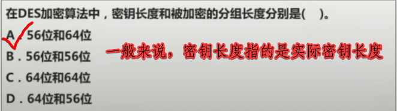

---

#### AES 算法

- 数据长度可变
  - AES 中**一般**将明文、密文分组长度固定为 **128 位**。
  - **密钥长度**可以为 **128、192 或 256 位**。
  - **SP 结构**。
- AES 算法框架
  - 明文State，二维矩阵表示，该数组为 4 行，N~b~ 列，设为 4 × N~b~ ；数组每个元素为 1 个字节，即为 2 个十六进制数。N~b~ = 数据块长度/32。
  - 密钥State，二维矩阵表示，该数组为 4 行，N~k~ 列，设为 4 × N~k~ ；数组每个元素为 1 个字节，即为 2 个十六进制数。N~k~ = 数据块长度/32。
  - 加密轮数 N~r~ ，取决于明文块和密钥块的长度。当明文块和密钥块的长度**都**为 **128 位**时，迭代次数为 **10 次**；当明文块**或**密钥块的长度为 **192 位**时，迭代次数为 **12 次**；当明文块或密钥块的长度为 **256 位**时，迭代次数为 **14 次**。
  - 加密：首先执行“子密钥加”算法；然后进行 n-1 轮加密操作，每轮包含**”字节代换“、”行移位“、”列混淆“、”子密钥加“**；第 n 轮加密操作少了一步**”列混淆“**。
  - 解密：执行的是逆过程，**算法不完全一致**。**AES 不是对合运算，即 (AES)^-1^ ≠ AES** 

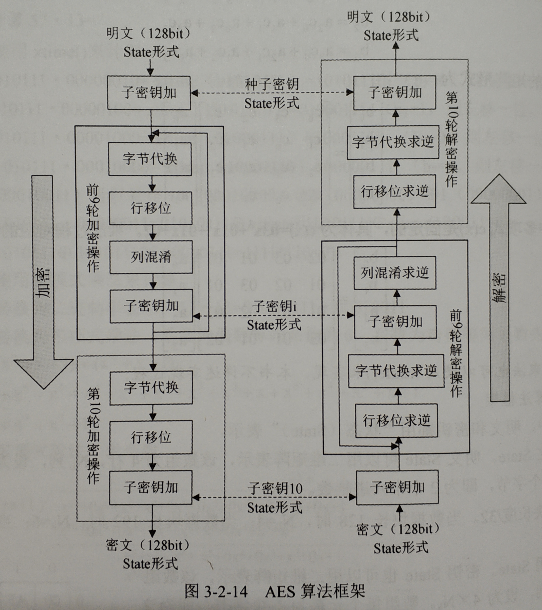

- 子密钥加（最初）：明文分组与种子密钥按位进行异或运算。

- **字节代换ByteSub**：输入State中的每一个字节，通过查询**S盒替换**成新的State。如当前State某元素为 “51” 是指查询S盒的第 5 行第 1 列，得到 “D1” 。

- **行位移变换ShiftRow**：
  
  - 当明文长度为 **128、192 位**时，State矩阵**第 0 行**循环左移 **0 字节**，**第 1 行**循环左移 **1 字节**，**第 2 行**循环左移 **2 字节**，**第 3 行**循环左移 **3 字节**。
  - 当明文长度为 **256 位**时，State矩阵**第 0 行**循环左移 **0 字节**，**第 1 行**循环左移 **1 字节**，**第 2 行**循环左移 **3 字节**，**第 3 行**循环左移 **4 字节**。
  
- **列混淆Mixcolimn**：列混淆是对状态的列进行混合变换。把状态中的每一列看作 GF(2^8^) 上的多项式，并与一个固定多项式 c(x) 相乘然后模多项式扩 x^4^+1 ，其中 c(x) 为：c(x)  = '03'x^3^ + '01'x^2^ + '01'x + '02'  ,只有 c(x)  与 x^4^+1 是互素的，才能保证 c(x) 存在逆多项式 d(x) ，只有逆多项式 d(x) 的存在，才能正确进行解密。

- **子密钥加（轮函数）AddRoundKey**：中间State与该轮子密钥进行异或运算。

  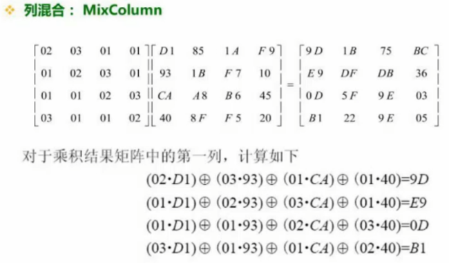

  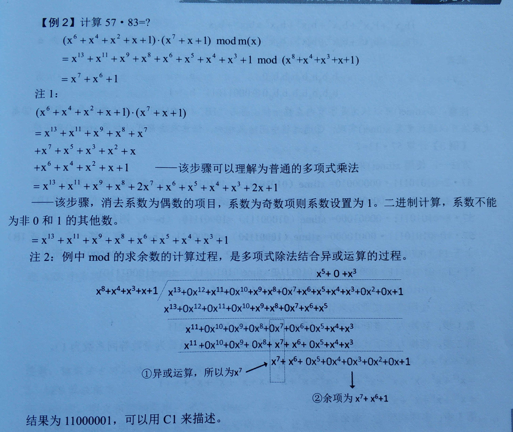

- 解密过程

  - **逆行位移InvShiftRow**：State矩阵第 0 行循环右移 0 字节，第 1 行循环右移 1 字节，第 2 行循环右移 2 字节，第 3 行循环右移 3 字节。
  - **逆字节代换InvByteSub**：通过查询逆S盒实现。
  - **AddRoundKey的逆**就是它自己。
  - **逆列混淆InvMixColumn**：把状态的每列都乘以一个固定的多项式 d(x)： d(x) ='OB' X^3^ + 'OD' X^2^ + '09x' + 'OE' ，即 S'(x) = d(x)s(x) mod (x^4^ + 1)  。

- AES算法的安全性
  - 不存在弱密钥
    - 该算法对密钥的选择没有任何限制，还没有发现弱密钥和半弱密钥的存在。
  - 抗攻击能力强
    - 可抗击穷举密钥的攻击。因为AES的密钥长度可变，针对 128/192/256bit 的密钥，密钥量为 2^128^/2^192^/2^256^ ，足以抵抗穷举搜索攻击。
    - 可抗击线性攻击，经 4 轮变换后，线性分析就无能为力了。
    - 可抗击差分攻击，经 8 轮变换后，差分攻击就无从着手了。
  - 适应性强
    - 数据块长度和密钥长度都可变，因此能够适应不同的安全应用环境。

#### SM4 算法

2006 年我国国家密码管理局公布了无线局域网产品使用的 SM4 密码算法。

- SM4 的数据分组长度和密钥长度都是 **128 位**。
- 加密算法与密钥扩展算法都采用 **32 轮**迭代结构。
- SM4 密码算法以**字节（8 位）**和**字（32 位）**为单位进行数据处理。 
- SM4 密码算法是对合运算，解密算法与加密算法相同，只是轮密钥的**使用顺序相反**。
- **非对称 Feistel 结构**。

- 基本运算
  - 模 2 加：⊕ ，32 位异或运算
  - 循环移位：<<<i ，把 32 位字循环左移 i 位

- SM4 算法框架

  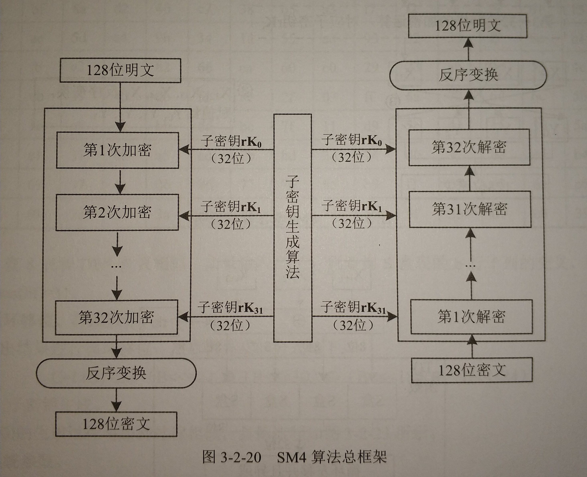

---

---

- 密码部件
  - **S 盒**：SM4 的 S 盒是一种以字节为单位的非线性代替变换，其密码学的作用在于起到混淆的作用。S 盒的**输入和输出都是 8 位**的字节。它本质上是 8 位的非线性置换。设输入字节为 "bf" ，则查询 S 盒表的 b 行 f 列，得到输出字节为 "51" ；即 S_Box ('bf') = '51' 
  - **非线性变换 τ** ：SM4 的非线性变换 τ 是一种以字为单位的非线性代替变换。它由 4 个 S 盒并置构成。本质上它是 S 盒的一种并行应用。
  - **线性变换部件 L** ：线性变换部件 L 是以字为处理单位的线性变换部件，其输入输出都是 32 位的字。其密码学的作用在于起到扩散的作用。
  - **合成变换 T** ：合成变换 T 由非线性变换 τ 和线性变换 L 复合而成，数据处理的单位是字。

- 轮函数：SM4 密码算法采用对基本轮函数进行迭代的结构。利用上述基本密码部件，便可构成轮函数。SM4 密码算法的轮函数是一种以字为处理单位的密码函数。轮函数的输入为 4 个 32 位字，共 128 位。轮密 rk 也是一个 32 位的字。轮函数的输出也是一个 32 位的字。

#### 三种算法的对比

|              | DES                                                   | AES                                                          | SM4                                                          |
| :----------- | ----------------------------------------------------- | ------------------------------------------------------------ | ------------------------------------------------------------ |
| 明文分组长度 | 64 位                                                 | 128 位                                                       | 128 位                                                       |
| 密钥长度     | 64（56）位                                            | 128 位、192 位、256 位                                       | 128 位                                                       |
| 子密钥长度   | 16 × 48 位                                            | 4 × N~k~ 二维矩阵，N~k~ = 数据块长度/32                      | 32 × 32 位                                                   |
| 算法结构     | Feistel 结构                                          | SP 结构                                                      | 非对称 Feistel 结构                                          |
| 对合运算？   | √                                                     | X                                                            | √                                                            |
| 密码部件     | **加密函数**：选择运算E、异或运算、S盒变换、置换运算P | **加密函数**：字节代换（S盒变换），行位移变换，列混淆，子密钥加 | **加密函数**：S盒变换，非线性变换 τ，线性变换部件 L，合成变换 T |

#### 分组密码工作模式

分组密码工作模式是指以某个分组密码算法为基础，解决对任意长度的明文的加密问题的方法。

- 电码本模式 ECB
  - 直接利用分组密码对明文的各分组进行加密。
  - 特点：
    - 要求数据的长度是密码分组长度的**整数倍**，否则最后一个数据块将是短块，需要特殊处理。
    
    - 非常适合处理**短数据加密**，适合**并行计算**。
    
    - 容易**暴露明文的数据模式**。
    
    - 同一明文分组对应的密文分组也相同。
    
  
  

- 密码分组链接模式 CBC
  - 特点：
    - 要求数据的长度是密码分组长度的**整数倍**，否则最后一个数据块将是短块，需要特殊处理。
    - 解决了 ECB 的安全缺陷，可以让**重复的明文分组产生不同的密文分组**。
    
  - **明密文链接**方式
    
    - 除初始向量外，输入是前一组的密文和前一组的明文异或后，再与当前的明文组异或。
    - 加解密均会引发**错误传播无界**（明文或密文错误会引发后续数据全部错误）
  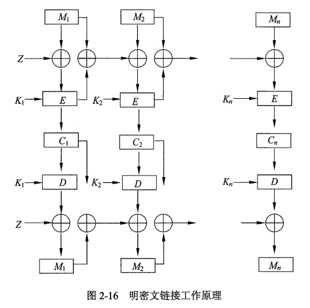
  
  
  
  - **密文链接**方式
    
    - 除初始向量外，输入是前一组的密文与当前明文组的异或。
    - **加密**错误会引发错误传播**无界**，**解密**错误会引发错误传播**有界**（明文或密文错误只产生有限几个数据错误）
  

- 输出反馈模式 OFB

  - 特点：

    - 这种工作模式的安全性取决于分组密码本身的安全性。其**将一个分组密码转换为一个序列密码**。
    - 它具有普通序列密码的优缺点，如**没有错误传播**。设加/解密时错了一位，则只影响密/明文中对应一位，不影响其他位。但因无错误传播而**对密文的篡改难以检测**。
    - **适于加密冗余度较大的数据**，如语音和图像数据。
  - 工作原理：
    1. 种子 I~0~ 的值赋值为位移寄存器 R 的初值。
    2. 利用分组算法 E（如DES、AES、SM4）加密移位寄存器 R 中的内容为密文，并 “选取最右边的 S 位” 作为输出，与明文 m~i~ 异或得到 C~i~ 。
    3. 移位寄存器 R 先左移 S 位，然后将加密算法 E 输出的最右 S 位赋值到寄存器 R 的右 S 位。
    4. 继续②③步，直到把分组密码变为序列密码。

  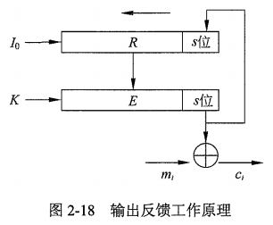

- 密码反馈模式 CFB

  - 特点：
    
    - CFB 与 OFB 模式相似，不同的是填充移位寄存器 R 的不是加密算法 E 输出的最右 S 位，而是 E 输出与明文异或后的密文 C~i~ 的 S 位。
    - CFB 模式的**加解密**具有**错误传播无界**的特性，使得密文反馈工作模式适合数据完整性认证方面的应用。
    
  
  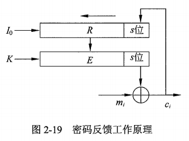

- 计数器模式 CTR
  - 特点：
    - CTR 模式与 OFB 和 CFB 一样，把分组密码转化为序列密码，按序列密码的方式进行加解密。
    - CTR 模式的加密算法是**对合运算**，加解密过程仅涉及加密运算，不涉及解密运算。
    - 优点是**可并行、效率高、适合任意长度的数据、加解密速度快**，而且在加解密处理方式上**适合随机存取数据的加解密**。因此，特别适合计算机随机文件的加密，因为随机文件要求能随机地访问。这对数据库加密是有重要意义的。
    - 缺点是**没有错误传播**，因此**不适合用于数据完整性认证**。
  

### 序列密码

- 序列密码又称**流密码**，原理是明文流与密钥流按顺序逐比特进行异或运算，从而产生密文流。
- 序列密码的加密和解密运算只是简单的模二加运算，所以序列密码的强度依靠密钥序列的随机性和不可预测性。**序列密码中的关键是要保持通信双方的精确同步**。
- 序列密码的加密和解密运算是**对合运算**。

- 位移寄存器
  - 待补充

#### RC4 序列密码算法

- RC4 是一种密钥流产生算法。
- RC4 密码与基于移位寄存器的序列密码不同，它是一种**基于非线性数据表变换**的序列密码。
- RC4 包含两个算法：密钥调度算法（KSA）和伪随机生成算法（PRGA）

---

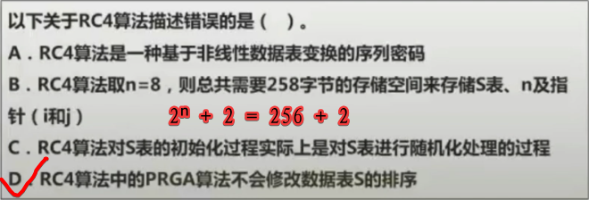

#### 祖冲之算法 ZUC

- 该算法是我国第一个成为国际密码标准的密码算法，成为 3GPP LTE 第三套加密标准核心算法。该算法由比特重组、非线性函数 F、线性反馈位移寄存器（LFSR）组成。该算法输出序列的随机性好，周期足够大；可以抵抗已知的序列密码分析，可抵抗弱密分析。

### Hash 函数

Hash 函数又称哈希函数、散列函数，是将任意长度的消息输出为**定长**的 hash码。Hash 函数用于构建数据的“指纹”，主要用于**数据完整性、数字签名、消息认证**等。

- 特性：
  - **单向性**：已知 hash 函数值 h ，求 H(x) = h 的 x 在计算上是不可行的。**由 Hash 值不能得出相应的报文**。
  - **抗弱碰撞性**：对任何给定的数据 x ，找到满足 y ≠ x 且 H(x) = H(y) 的 y 在计算上是不可行的。**不能找到与给定报文具有相同 Hash 值的另一个报文**。
  - **抗强碰撞性**：两个不同消息 m 和 m' ，使得 H(m) = H(m') 在计算上是不可行的。（抵抗生日攻击的能力强弱）**不同的报文所得到的 Hash 值是不同的**。

#### MD5 算法

其消息分组长度为 512 位，**生成 128 位的摘要**。

#### SHA 算法

安全 Hash 算法（SHA）其输入为长度**小于 2^64^ 位的报文**，该算法对报文**按 512 位为单位分组**处理，**输出为 160 位**的报文摘要。

- 算法步骤：
  1. **填充报文**：使报文长度与 448 模 512 同余（即长度 = 448 mod 512）。若报文本身已经满足上述要求，仍然需要进行填充（例如：若报文长度为 448 位，则仍需填充 512 位使其长度为 960 位），因此填充位数在 1 和 512 之间。填充方法是在报文后附加一个 1 和若干个 0 。然后附上表示填充前报文长度的 64 为数据（最高有效位在前）。需满足总长度：≤ 2^64^ - 1
  2. **初始化缓冲区**：初始化 5 个 32 位的寄存器。
  3. **执行算法主循环**：每次循环处理 512 位的分组。核心算法是具有 4 轮操作的压缩函数。循环次数是报文填充后的分组数。
  4. **输出**：输出 160 位的摘要。

#### SM3 算法

SM3 算法是国家密码管理局与 2010 年颁布的安全密码杂凑算法。基本迭代结构采用了增强型的 **Merkle-Damgard 结构**，把**长度 < 2^64^ 位**的信息，经过填充和迭代压缩，生成长度为 **256 位的摘要**。2018 年 10 月，SM3 正式成为国际标准。SM3 算法可用于数字签名和验证、消息认证码的生成与验证以及随机数的生成。

#### HMAC

- 消息完整性：指数据正确无误、完整不缺，使数据免受未授权的毁坏，就是确保数据的完整性。
- 消息认证码 MAC
  - MAC 是基于消息和秘密钥的公开函数，其输出是固定长度的短数据块。MAC 和加密类似，需要明文、密钥、算法，但 MAC 算法不要求可逆性，而加密算法则要求可逆。
  - 假定通信双方共享秘密钥 K ，发送方 A 向接收方 B 发送报文 M 并附上 MAC，记为：A→B：M║MAC 。接收方 B 到报文后用相同的秘密钥 K 和报文 M 进行相同的计算得出新的 MAC' ，若 MAC‘ = MAC，则：
    1. 接收的报文 M 没有被修改
    2. 接收的报文 M 是 A 所发送的
- HMAC：Hash 消息认证码，是一种基于密钥和散列函数进行消息认证的方法。它要求通信双方共享密钥、约定算法、约定报文 Hash 运算（如MD5、SHA、SM3等）。

### 公钥密码体制

加密密钥和解密密钥不相同的算法，称为非对称加密算法，又称为公钥密码体制，解决了对称密钥算法的密钥分配与发送问题。**公钥用于加密和认证，私钥用于解密和签名**。公钥可以公开，私钥需要严格保密。

- 单向函数（MD5、SHA、SM3）加密效率高，但**加密后不能还原**：
  1. 已知 x ，要计算 y 很容易
  2. 已知 y ，要计算出 x 很难
- 单向陷门函数需满足：
  1. 具有陷门
  2. 已知 x ，要计算 y 很容易
  3. 已知 y ，如果不知道陷门，要计算出 x 很难；如果真的陷门，则计算出 x 很容易
- 实际上已找到的单向性足够的函数有：
  - 因子分解问题：计算素数乘积容易（p×q→n），而计算因子分解困难（n→p×q）
  - 离散对数问题：计算素数幂乘容易（x^y^→z），而计算对数困难（log~x~z→y）

- 公钥密码体制的特点：
  - 明文 M 通过加密算法 E 和加密密钥 K~e~ 变成密文 C 用公式表示为：C = E (M,K~e~)
  - 密文 C 通过解密算法 D 和解密密钥 K~d~ 还原为明文 M 用公式表示为：M = D (C,K~d~)
  - 计算上不能由 K~e~ 求出 K~d~ 
  - 加密算法 E 和解密算法 D 都是高效的

- 数字信封技术：发送方将**用对称密钥加密的密文**和**用接收方的公钥加密后的对称密钥密文**发送给接收方；接收方用自己的私钥对对称密钥密文进行解密得到对称密钥，然后再对密文进行解密。适用于传输大量加密数据。
- 数字签名：发送方先用对方的公钥对明文进行加密成密文，接着使用自己的私钥对明文进行加密生成数字签名，然后将密文和数字签名发送给接收方；接收方使用对方的公钥对数字签名进行解密，然后与密文进行对比确认信息是否由发送方发送，再用自己的私钥还原明文。

#### RSA 密码

- 

距离考试只有两个月时间了，居然说教材和大纲都要改版，难受......就这样了吧，第一版end.