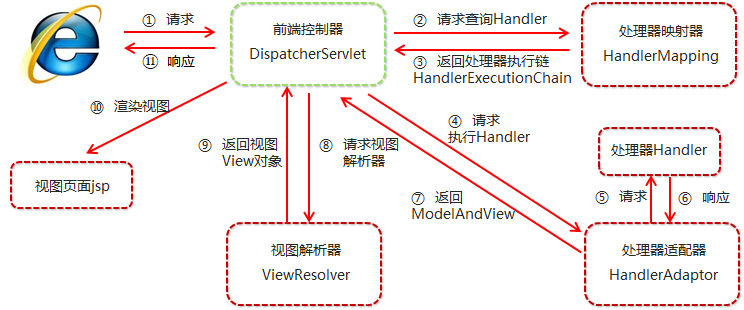

## 01-什么是Spring IOC 和DI ?

IOC : 控制翻转 , 它把传统上由程序代码直接操控的对象的调用权交给容 器，通过容器来实现对象组件的装配和管理。所谓的“控制反转”概念就是对组件对象控制权的转 移，从程序代码本身转移到了外部容器。 

DI : 依赖注入，在我们创建对象的过程中，把对象依赖的属性注入到我们的类中。

## 02-有哪些不同类型的依赖注入实现方式？

依赖注入分为接口注入，Setter方 法注入和构造器注入

构造器依赖注入：构造器依赖注入通过容器触发一个类的构造器来实现的，该类有一系列参数，每 个参数代表一个对其他类的依赖。

Setter方法注入：Setter方法注入是容器通过调用无参构造器或无参static工厂 方法实例化bean之 后，调用该bean的setter方法，即实现了基于setter的依赖注入。

## 03- Spring支持的几种bean的作用域 Scope

Spring框架支持以下五种bean的作用域：

singleton : bean在每个Spring ioc 容器中只有一个实例。

prototype：一个bean的定义可以有多个实例。 

request：每次http请求都会创建一个bean，该作用域仅在基于web的Spring ApplicationContext情形下有效。 

session：在一个HTTP Session中，一个bean定义对应一个实例。该作用域仅在基于web的 Spring ApplicationContext情形下有效。 

global-session：在一个全局的HTTP Session中，一个bean定义对应一个实例。该作用域仅在基 于web的Spring ApplicationContext情形下有效。


## 04- Spring框架中的单例bean是线程安全的吗？

不是，Spring框架中的单例bean不是线程安全的 , spring 中的 bean 默认是单例模式，spring 框架并没有对单例 bean 进行多线程的封装处理。

但是我们一般在使用单例Bean的时候, 不会设置共享数据, 所以也就不会存在线程安全问题 ! 从这个角度讲单例bean也是线程安全的


## 05- spring 自动装配 bean 有哪些方式？

在Spring框架xml配置中共有5种自动装配： 

- byName：通过bean的名称进行自动装配，如果一个bean的 property 与另一bean 的name 相 同，就进行自动装配。
- byType：通过参数的数据类型进行自动装配。
- constructor：利用构造函数进行装配，并且构造函数的参数通过byType进行装配。


## 06- Spring中的事务是如何实现的

1. Spring事务底层是基于数据库事务和AOP机制的

2. ⾸先对于使⽤了@Transactional注解的Bean，Spring会创建⼀个代理对象作为Bean

3. 当调⽤代理对象的⽅法时，会先判断该⽅法上是否加了@Transactional注解

4. 如果加了，那么则利⽤事务管理器创建⼀个数据库连接

5. 并且修改数据库连接的autocommit属性为false，禁⽌此连接的⾃动提交，这是实现Spring事务⾮ 常重要的⼀步 

6. 然后执⾏当前⽅法，⽅法中会执⾏sql 
7. 执⾏完当前⽅法后，如果没有出现异常就直接提交事务
8. 如果出现了异常，并且这个异常是需要回滚的就会回滚事务，否则仍然提交事务 
9. Spring事务的隔离级别对应的就是数据库的隔离级别 
10. Spring事务的传播机制是Spring事务⾃⼰实现的，也是Spring事务中最复杂的 
11. Spring事务的传播机制是基于数据库连接来做的，⼀个数据库连接⼀个事务，如果传播机制配置为 需要新开⼀个事务，那么实际上就是先建⽴⼀个数据库连接，在此新数据库连接上执⾏sql


## 07- Spring中事务失效的场景

因为Spring事务是基于代理来实现的，所以某个加了@Transactional的⽅法只有是被代理对象调⽤时， 那么这个注解才会⽣效 , 如果使用的是被代理对象调用, 那么@Transactional会失效 

同时如果某个⽅法是private的，那么@Transactional也会失效，因为底层cglib是基于⽗⼦类来实现 的，⼦类是不能重载⽗类的private⽅法的，所以⽆法很好的利⽤代理，也会导致@Transactianal失效

如果在业务中对异常进行了捕获处理 , 出现异常后Spring框架无法感知到异常, @Transactional也会失效 


## 08- 说一下Spring的事务传播行为

1.  PROPAGATION_REQUIRED：如果当前没有事务，就创建一个新事务，如果当前存在事务，就 加入该事务，该设置是最常用的设置。 

2.  PROPAGATION_SUPPORTS：支持当前事务，如果当前存在事务，就加入该事务，如果当前不 存在事务，就以非事务执行。 

3.  PROPAGATION_MANDATORY：支持当前事务，如果当前存在事务，就加入该事务，如果当前 不存在事务，就抛出异常。

4.  PROPAGATION_REQUIRES_NEW：创建新事务，无论当前存不存在事务，都创建新事务。

5.  PROPAGATION_NOT_SUPPORTED：以非事务方式执行操作，如果当前存在事务，就把当前 事务挂起。

6.  PROPAGATION_NEVER：以非事务方式执行，如果当前存在事务，则抛出异常。

7.  PROPAGATION_NESTED：如果当前存在事务，则在嵌套事务内执行。如果当前没有事务，则 按REQUIRED属性执行。

## 09- JDK动态代理和CGLIB动态代理的区别

Spring AOP中的动态代理主要有两种方式，JDK动态代理和CGLIB动态代理：

- JDK动态代理只提供接口的代理，不支持类的代理

  > ```
  > Proxy.newProxyInstance(类加载器, 代理对象实现的所有接口, 代理执行器)
  > ```

- CGLIB是通过继承的方式做的动态代理 , 如果某个类被标记为final，那么它是无法使用 CGLIB做动态代理的。

  > ```
  > Enhancer.create(父类的字节码对象, 代理执行器)
  > ```

## 10- 什么是AOP , 你们项目中有没有使用到AOP

AOP一般称为面向切面编程，作为面向对象的一种补充，用于 将那些与业务无关，但却对多个对象产生影响的公共行为和逻辑，抽取并封装为一个可重用的模 块，这个模块被命名为“切面”（Aspect），减少系统中的重复代码，降低了模块间的耦合度，同时 提高了系统的可维护性。

在我们的项目中我们自己写AOP的场景其实很少 , 但是我们使用的很多框架的功能底层都是AOP  , 例如 : 权限认证、日志、事务处理等


## 11- SpringMVC的执行流程知道嘛




1. 用户发送请求至前端控制器DispatcherServlet； 
2. DispatcherServlet收到请求后，调用HandlerMapping处理器映射器，请求获取Handle；
3. 处理器映射器根据请求url找到具体的处理器，生成处理器对象及处理器拦截器(如果有则生 成)一并返回给DispatcherServlet； 
4. DispatcherServlet 调用 HandlerAdapter处理器适配器； 
5. HandlerAdapter 经过适配调用具体处理器(Handler，也叫后端控制器)； 
6. Handler执行完成返回ModelAndView； 
7. HandlerAdapter将Handler执行结果ModelAndView返回给DispatcherServlet； 
8. DispatcherServlet将ModelAndView传给ViewResolver视图解析器进行解析； 
9. ViewResolver解析后返回具体View； 
10. DispatcherServlet对View进行渲染视图（即将模型数据填充至视图中） 
11. DispatcherServlet响应用户


## 12- Spring MVC常用的注解有哪些？

@RequestMapping：用于处理请求 url 映射的注解，可用于类或方法上。用于类上，则表示类中 的所有响应请求的方法都是以该地址作为父路径。 

@RequestBody：注解实现接收http请求的json数据，将json转换为java对象。 

@ResponseBody：注解实现将conreoller方法返回对象转化为json对象响应给客户。

 @Controller：控制器的注解，表示是表现层,不能用用别的注解代替

@RestController :  组合注解 @Conntroller + @ResponseBody

@GetMapping  , @PostMapping , @PutMapping , @DeleteMapping ...

@PathVariable : 接收请求路径中的变量 

@RequestParam : 接收请求参数


## 13- Mybatis #{}和${}的区别

\#{}是占位符，预编译处理；${}是拼接符，字符串替换，没有预编译处理。

Mybatis在处理#{}时，#{}传入参数是以字符串传入，会将SQL中的#{}替换为?号，调用 PreparedStatement的set方法来赋值。

\#{} 可以有效的防止SQL注入，提高系统安全性；${} 不能防止SQL 注入

\#{} 的变量替换是在数据库系统中； ${} 的变量替换是在 数据库系统外


## 14- Mybatis  如何获取生成的主键

我知道的有二种方式

1. 在insert标签上, 使用` useGeneratedKeys="true"`  和 `keyProperty="userId"`
2. 在insert表内部, 使用 `selectKey`标签 , 里面使用`select last_insert_id()`查询生成的ID返回


## 15- 当实体类中的属性名和表中的字段名不一样 ，怎么办

第1种： 通过在查询的SQL语句中定义字段名的别名，让字段名的别名和实体类的属性名一致。

第2种： 通过 ResultMap来映射字段名和实体类属性名


## 16- Mybatis如何实现多表查询

Mybatis是新多表查询的方式也有二种 : 

第一种是 : 编写多表关联查询的SQL语句 , 使用ResultMap建立结果集映射 , 在ResultMap中建立多表结果集映射的标签有`association`和`collection`

```xml
<resultMap id="Account_User_Map" type="com.heima.entity.Account">
    <id property="id" column="id"></id>
    <result property="uid" column="uid"></result>
    <result property="money" column="money"></result>

    <association property="user">
        <id property="id" column="uid"></id>
        <result property="username" column="username"></result>
        <result property="birthday" column="birthday"></result>
        <result property="sex" column="sex"></result>
        <result property="address" column="address"></result>
    </association>

</resultMap>

<!--public Account findByIdWithUser(Integer id);-->
<select id="findByIdWithUser" resultMap="Account_User_Map">
    select  a.*,  username, birthday, sex, address  from account a , user u where a.UID = u.id and a.ID = #{id} ;
</select>
```

第二种是 : 将多表查询分解为多个单表查询, 使用ResultMap表的子标签`association`和`collection`标签的`select`属性指定另外一条SQL的定义去执行, 然后执行结果会被自动封装

```xml
<resultMap id="Account_User_Map" type="com.heima.entity.Account" autoMapping="true">
    <id property="id" column="id"></id>

    <association property="user" select="com.heima.dao.UserDao.findById" column="uid" fetchType="lazy"></association>
</resultMap>

<!--public Account findByIdWithUser(Integer id);-->
<select id="findByIdWithUser" resultMap="Account_User_Map">
    select * from account where  id = #{id}
</select>
```


## 17-Mybatis都有哪些动态sql？能简述一下动 态sql的执行原理吗？

Mybatis动态sql可以让我们在Xml映射文件内，以标签的形式编写动态sql，完成逻辑判断和动态 拼接sql的功能，Mybatis提供了9种动态sql标签 trim|where|set|foreach|if|choose|when|otherwise|bind。

其执行原理为，使用OGNL从sql参数对象中计算表达式的值，根据表达式的值动态拼接sql，以此 来完成动态sql的功能。


## 18- Mybatis是否支持延迟加载？

Mybatis仅支持association关联对象和collection关联集合对象的延迟加载，association指的就是 一对一，collection指的就是一对多查询。在Mybatis配置文件中，可以配置是否启用延迟加载 lazyLoadingEnabled=true|false。


## 19- 如何使用Mybatis实现批量插入 ? 

使用foreach标签 , 它可以在SQL语句中进行迭代一个集合。foreach标签的属性主 要有item，index，collection，open，separator，close。

- collection : 代表要遍历的集合 ,  
- item   表示集合中每一个元素进行迭代时的别名，随便起的变量名；
- index   指定一个名字，用于表示在迭代过程中，每次迭代到的位置，不常用；
- open   表示该语句以什么开始
- separator 表示在每次进行迭代之间以什么符号作为分隔符
- close   表示以什么结束


## 20- Mybatis 批量插入是否能够返回主键

可以, 返回的主键在传入集合的每个对象属性中封装的


## 21- Mybatis的一级、二级缓存 ?

一级缓存:  基于SqlSession级别的缓存  , 默认开启

二级缓存 : 基于SqlSessionFactory的NameSpace级别缓存 , 默认没有开启, 需要手动开启 

```
# 配置cacheEnabled为true
<settings>...
  <!-- 开启二级缓存 -->
  <setting name="cacheEnabled" value="true"/>
  ...
</settings>

# 在映射配置文件中配置cache相关配置
<cache eviction="FIFO" flushInterval="60000" readOnly="false" size="1024">
</cache>
```


