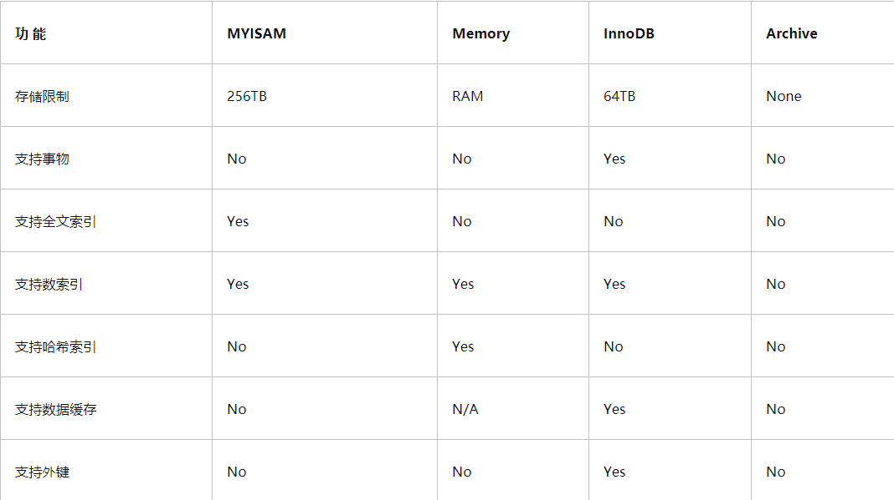
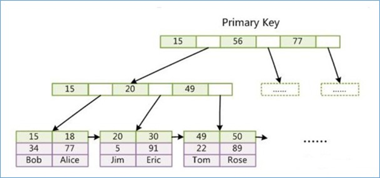
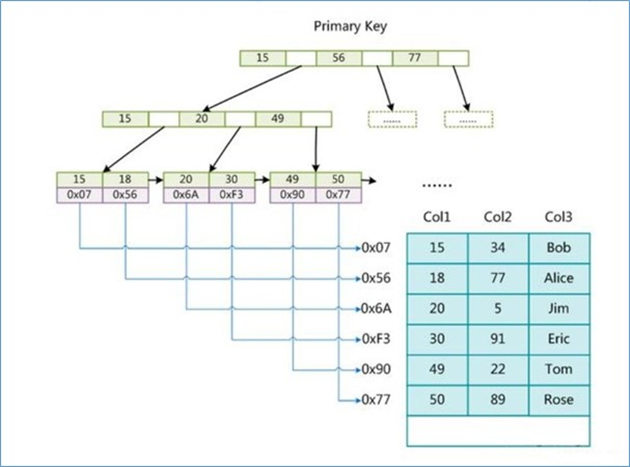
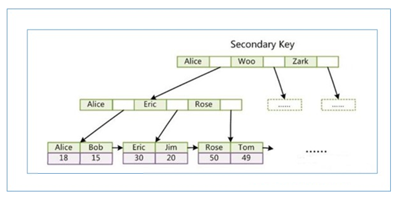
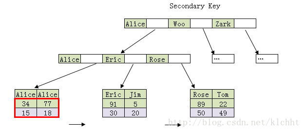

## 1. Mysql查询语句的书写顺序

**Select**   [distinct ]  <字段名称>  **from**  表1   [ <join类型>  join 表2  on <join条件>   ]  **where** <where条件>  **group by** <字段> 

**having** <having条件>   **order by** <排序字段>  **limit** <起始偏移量,行数>

## 2. Mysql查询语句的执行顺序

（8）Select
（9）distinct 字段名1,字段名2，
（7）[fun(字段名)]  
（1）from 表1
（3）<join类型>join 表2 
（2）on <join条件> 
（4）where <where条件> 
（5）group by <字段> 
（6）having <having条件> 
（10）order by <排序字段> 
（11）limit <起始偏移量,行数>

## 3. Mysql 如何实现多表查询

MYSQL多表查询主要使用连接查询  , 连接查询的方式主要有 : 

- 内连接  
  - 隐式内连接 :  Select 字段   From 表A , 表B where 连接条件
  - 显式内连接  :  Select 字段   From 表A  inner join  表B  on 连接条件
- 外连接
  - 左外连接 : Select 字段   From 表A  left join  表B  on 连接条件
  - 右外连接 : Select 字段   From 表A  right join  表B  on 连接条件
  - 全外连接：(很少用)
- 交叉连接 : (很少用)


## 4. MYSQL内连接和外连接的区别 ? 

- 内连接：只有两个元素表相匹配的才能在结果集中显示。
- 外连接：左外连接: 左边为驱动表，驱动表的数据全部显示，匹配表的不匹配的不会显示。
- 右外连接:右边为驱动表，驱动表的数据全部显示，匹配表的不匹配的不会显示。
- 全外连接：连接的表中不匹配的数据全部会显示出来。
- 交叉连接：笛卡尔效应，显示的结果是链接表数的乘积。


## 5. CHAR和VARCHAR的区别？

1. char的长度是不可变的，用空格填充到指定长度大小，而varchar的长度是可变的。
2. char的存取速度比varchar要快得多
3. char的存储方式是：对英文字符（ASCII）占用1个字节，对一个汉字占用两个字节。
   varchar的存储方式是：对每个英文字符占用2个字节，汉字也占用2个字节。


## 6. 了解过Mysql的索引嘛 ? 

MYSQL索引主要有 : **单列索引** , **组合索引**和**空间索引** , 用的比较多的就是单列索引和组合索引 , 空间索引我这边没有用到过

**单列索引 :** 在MYSQL数据库表的某一列上面创建的索引叫单列索引 , 单列索引又分为                

- 普通索引：MySQL中基本索引类型，没有什么限制，允许在定义索引的列中插入重复值和空值，纯粹为了查询数据更快一点。

- 唯一索引：索引列中的值必须是唯一的，但是允许为空值

- 主键索引：是一种特殊的唯一索引，不允许有空值

- 全文索引： 只有在MyISAM引擎、InnoDB（5.6以后）上才能使⽤用，而且只能在CHAR,VARCHAR,TEXT类型字段上使⽤用全⽂文索引。 

**组合索引 :** 在MYSQL数据库表的多个字段组合上创建的索引  , 称为组合索引也叫联合索引

- 组合索引的使用，需要遵循左前缀原则

- 一般情况下，建议使用组合索引代替单列索引（主键索引除外）


## 7. 索引的底层数据结构了解过嘛 ? 

索引是在**存储引擎中实现**的，也就是说不同的存储引擎，会使用不同的索引

MyISAM和InnoDB存储引擎：只⽀支持**B+ TREE索引**， 也就是说默认使用BTREE，不能够更换

MEMORY/HEAP存储引擎：支持HASH和BTREE索引


## 8. MYSQL支持的存储引擎有哪些, 有什么区别 ?



MYSQL存储引擎有很多, 常用的就二种 : **MyISAM**和**InnerDB** , 者两种存储引擎的区别 ; 

- MyISAM支持256TB的数据存储 , InnerDB只支持64TB的数据存储
- MyISAM 不支持事务 , InnerDB支持事务
- MyISAM 不支持外键 , InnerDB支持外键


## 9. 什么是聚簇索引什么是非聚簇索引 ?

**聚簇索引**

在使用`InnoDB`存储引擎的时候, 主键索引B+树叶子节点会存储数据行记录，简单来说**数据和索引在一起存储** , 这就是聚簇索引



**非聚簇索引**

在使用`MyISAM`存储引擎的时候, B+树叶子节点只会存储数据行的指针，简单来说**数据和索引不在一起**  , 这就是非聚簇索引




## 10. 在一个非主键字段上创建了索引, 想要根据该字段查询到数据, 需要查询几次 ? 

需要查询二次 

如果使用`MyISAM`存储引擎 , 会首先根据索引查询到数据行指针, 再根据指针获取数据

如果是`InnoDB`存储引擎 , 会根据索引查找指定数据关联的主键ID , 再根据主键ID去主键索引中查找数据


## 11. 知道什么是回表查询嘛 ? 

当我们为一张表的`name`字段建立了索引 , 执行如下查询语句 : 

`select name,age from user where name='Alice'`

那么获取到数据的过程为 : 

1. 根据`name='Alice'`查找索引树 , 定位到匹配数据的主键值为` id=18`

   

2. 根据`id=18`到主索引获取数据记录  (回表查询)

   

   

**先定位主键值，再定位行记录就是所谓的回表查询，它的性能较扫一遍索引树低 **


## 12. 知道什么叫覆盖索引嘛 ? 

覆盖索引是指只需要在一棵索引树上就能获取SQL所需的所有列数据 , 因为无需回表查询效率更高

实现覆盖索引的常见方法是：将被查询的字段，建立到联合索引里去。

执行如下查询语句 : `select name,age from user where name='Alice'`

因为要查询 `name `和 `age`二个字段 , 那么我们可以建立组合索引

```sql
create index index_name_age on user(name,age) 
```

那么索引存储结构如下 : 




这种情况下, 执行`select name,age from user where name='Alice'` , 会先根据`name='Alice'`, 找到记录 , 这条记录的索引上刚好又包含了 age 数据 , 直接把 ` Alice 77 `数据返回 , 就不会执行回表查询 , 这就是覆盖索引


## 13. 知道什么是左前缀原则嘛 ? 

在mysql建立联合索引时会遵循左前缀匹配的原则，即最左优先，在检索数据时从联合索引的最左边开始匹配，组合索引的第一个字段必须出现在查询组句中，这个索引才会被用到 ; 

例如 : `create index index_age_name_sex on tb_user(age,name,sex);`

上述SQL语句对 `age`,`name`和`sex`建一个组合索引`index_age_name_sex `,实际上这条语句相当于建立了` (age) ,  (age,name) , (age,name,sex) `三个索引 .

```sql
select * from tb_user where age = 49 ;  -- 使用索引

select * from tb_user where age = 49 and name = 'Alice' ;  -- 使用索引

select * from tb_user where age = 49 and name = 'Alice' and sex = 'man';  -- 使用索引

select * from tb_user where age = 49  and sex = 'man';  -- 使用索引 , 但是只有 age 匹配索引 sex没有走索引

select * from tb_user where name = 'Alice' and age = 49 and sex = 'man' ;  -- 使用索引 ,  因为MySQL的查询优化器会自动调整 where 子句的条件顺序以使用适合的索引

select * from tb_user where name = 'Alice'  and sex = 'man' ;  -- 不会使用索引
```


## 14. 什么情况下索引会失效 ?

MySQL 索引通常是被用于提高 WHERE 条件的数据行匹配时的搜索速度，编写合理化的SQL能够提高SQL的执行效率

1. 不要在列上使用函数和进行运算
2. 不要在列上使用函数，这将导致索引失效而进行全表扫描。
3. 尽量避免使用 != 或 not in或 <> 等否定操作符
4. 尽量避免使用 or 来连接条件
5. 多个单列索引并不是最佳选择，建立组合索引代替多个单列索引, 可以避免回表查询
6. 查询中的某个列有范围查询，则其右边所有列都无法使用索引优化查找
7. 索引不会包含有NULL值的列
8. 当查询条件左右两侧类型不匹配的时候会发生隐式转换，隐式转换带来的影响就是可能导致索引失效而进行全表扫描。
9. like 语句的索引失效问题
   like 的方式进行查询，在 like “value%” 可以使用索引，但是对于 like “%value%” 这样的方式，执行全表查询


## 15. 索引是越多越好嘛? 什么样的字段需要建索引, 什么样的字段不需要 ? 

 **需要创建索引情况**

1. 主键自动建立主键索引

2. 频繁作为查询条件的字段应该创建索引

3. 多表关联查询中，关联字段应该创建索引 (on 两边都要创建索引)

4. 查询中排序的字段，应该创建索引

5. 频繁查找字段 , 应该创建索引

6. 查询中统计或者分组字段，应该创建索引

**不要创建索引情况**

1. 表记录太少

2. 经常进⾏行行增删改操作的表

3. 频繁更新的字段

4. where条件里使用频率不高的字段


## 16. mysql的性能优化

1. 从设计方面 选择合适的存储引擎 , 合适的字段类型 , 遵循范式(反范式设计)

   > 1. 存储引擎 : 
   >    不需要事务, 不需要外键读写较多的的使用MyIsam
   >    需要事务, 需要外键的使用InnoDB
   >
   > 2. 合适的字段类型 , 例如 : 
   >    定长字符串用char , 不定长用varchr
   >    状态, 性别等有限数量值的用tinyint
   >
   > 3. 遵循范式 :
   >    第一范式1NF，原子性
   >    第二范式2NF，消除部分依赖
   >    第三范式3NF，消除传递依赖

2.从功能方面可以对索引优化，采用缓存缓解数据库压力，分库分表。

3.从架构方面可以采用主从复制，读写分离，负载均衡


## 17. MYSQL超大分页怎么处理 ?

MYSQL 不是跳过offset行, 而是取offset+N行, 然后放弃前offset行 , 返回N行, 所以当offset比较法的情况下分页效率很低 

正确的处理方法是 : 先快速定位需要获取的id再关联查询获取数据


## 18. 如何定位慢查询 ?

可以在MYSQL配置文件中开启慢查询 , 有两种方式可以开启慢查询

**方式一 : 修改`my.ini`配置文件 , 重启 MySQL 生效**   

```
[mysqld]
log_output='FILE,TABLE'
slow_query_log='ON'
long_query_time=0.001
```

**方式二 : 设置全局变量**

```
SET GLOBAL slow_query_log = 'ON';
SET GLOBAL log_output = 'FILE,TABLE';
SET GLOBAL long_query_time = 0.001;
```


## 19. 一个SQL语句执行很慢, 如何分析 

首先可以开启慢查询, 通过慢查询日志或者命令, 获取到执行慢的SQL语句 , 其次可以使用`EXLPAIN`命令分析SQL语句的执行过程

EXLPAIN命令, 比较重要的字段**(加黑加粗的是重要的)** : 


**select_type重点解读**


**type重点解读：查询性能从上到下依次是最好到最差**


**extra重点解读**


## 20. Mysql锁和分库分表

有精力看看下发的资料和文档, 没精力直接说没搞过 


