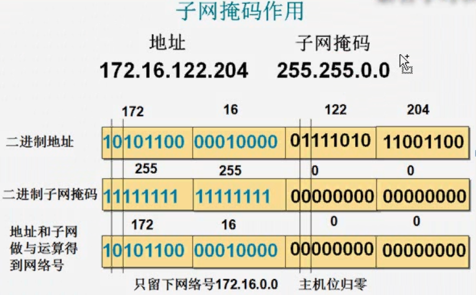
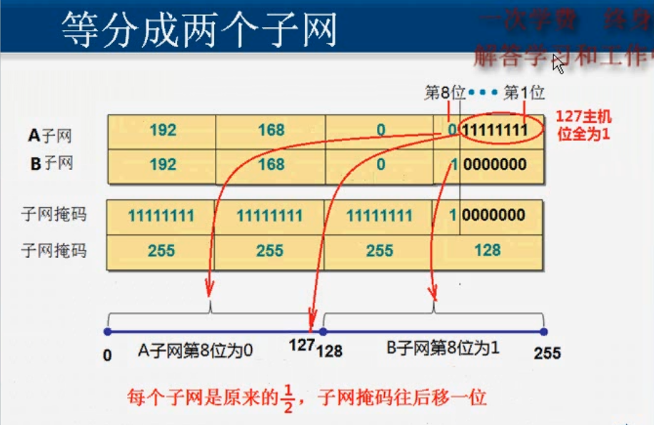
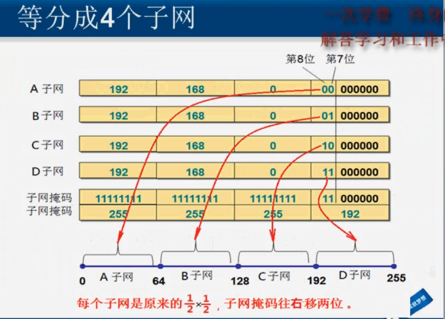
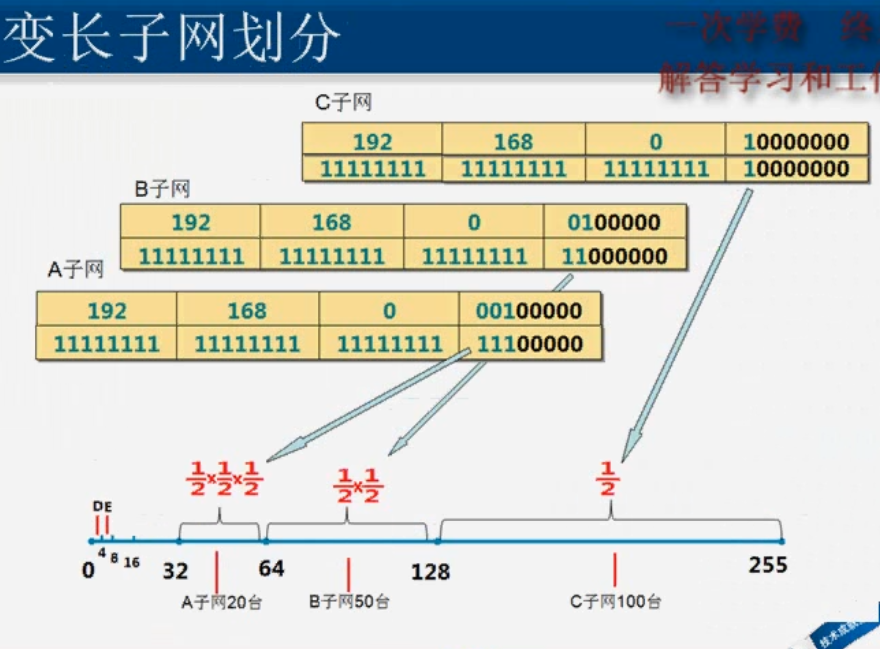
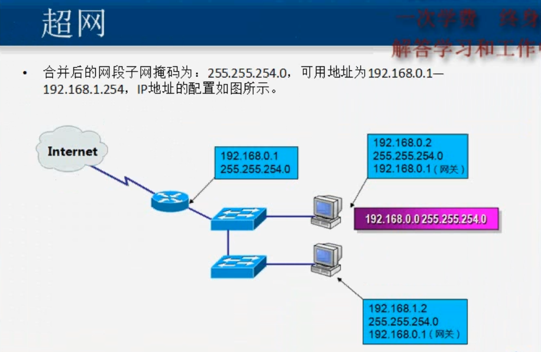
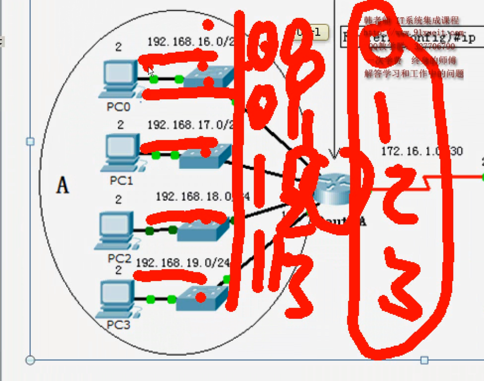

# IP地址和子网

- 二进制和十进制

  ```
  00000001          1
  00000010          2
  00000100          4
  00001000          8
  00010000          16
  00100000          32
01000000          64
  10000000          128

  10000000          128
  11000000          192
  11100000          224
  11110000          240
  11111000          248
  11111100          252
  11111110          254
  11111111          255
  ```
  
  

- IP地址：32位二进制



- A类网络缺省子网掩码：255.0.0.0
- B类网络缺省子网掩码：255.255.0.0
- C类网络缺省子网掩码：255.255.255.0


- 保留的私网地址

  - A类10.0.0.0
  - B类172.16.0.0--172.31.0.0
  - C类192.168.0.0--192.168.255.0
- 本地环回地址：127.0.0.1
- 无法获取DHCP时的地址时，IP为169.254.0.0


## 等长子网划分






## 变长子网划分



- 主机号除4，余数为1、2能用
- 主机号除4，余数为3 的为广播地址


## 超网





- 余数为0,1,2,3可合并为一个网段，子网掩码左移2位；如上图合并为192.168.16.0/22