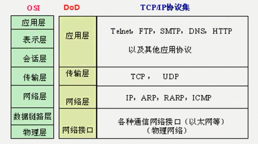

# TCP/IP

## 应用层协议：

- HTTP：TCP+80
- HTTPS：TCP+443
- FTP：TCP+21（连接）、20（传输数据）
- SMTP：TCP+25
- POP3：TCP+110
- RDP：TCP+3389
- DNS：UDP+53
- IP访问Windows共享文件夹：TCP+445
- SQL：TCP+1433
- Telnet：TCP+23
- SSH：TCP+22

## 传输层协议

| https://www.jianshu.com/p/c4090b09e154 | UDP                                        | TCP                                                          |
| -------------------------------------- | ------------------------------------------ | ------------------------------------------------------------ |
| 是否连接                               | 无连接                                     | 面向连接                                                     |
| 是否可靠                               | 不可靠传输，不使用流量控制和拥塞控制       | 可靠传输，使用流量控制和拥塞控制，建立会话（消耗系统资源），丢失重传 |
| 连接对象个数                           | 支持一对一，一对多，多对一和多对多交互通信 | 只能是一对一通信                                             |
| 传输方式                               | 面向报文                                   | 面向字节流                                                   |
| 首部开销                               | 首部开销小，仅8字节                        | 首部最小20字节，最大60字节                                   |
| 适用场景                               | 适用于实时应用（IP电话、视频会议、直播等） | 适用于要求可靠传输的应用，例如文件传输                       |

## 网络层协议：

- IP协议：选择最佳路径的协议（RIP OSPF EIGRP BGP）

- ICMP协议：测试网络状态的协议（ping）
  - **pathping** [**www.baidu.com**](http://www.baidu.com) 跟踪路径，计算丢包情况（利用了TTL，从1开始依次增加TTL）
  - **tracert -d** [**www.baidu.com**](http://www.baidu.com) 跟踪路由

- IGMP协议：组播（多播）

- ARP协议：将计算机的IP地址解析成MAC地址
  - **arp -a** 查看arp表
  - **arp -s ip mac** 更改对应关系

## 其他

- 服务和端口的关系：服务与端口一一对应（端口不能重复）
- `netstat -anb | find "3389"`（a：查看侦听端口 n：以数字显示 b：显示程序）
- 关闭Network Connections服务，则无法更改网络设置
- **TCP/IP筛选不影响出去（建立连接）的流量**
- **winXP防火墙不影响出去（建立连接）的流量**
- **IPSec严格控制进出计算机的流量**
- **TCP/IP筛选比防火墙等级高，防火墙依赖于Windows Firewall服务**
- 运行“msconfig”查看服务
- 运行“wf.msc”查看防火墙
- ping单向不通，可能是防火墙
- Windows防火墙无法拦截反弹式木马（需用IPSec拦截木马流量，白名单规则）

- 数据包（数据+IP）+MAC=数据帧
  - MAC地址决定下一跳给哪个设备
  - IP地址决定最终设备