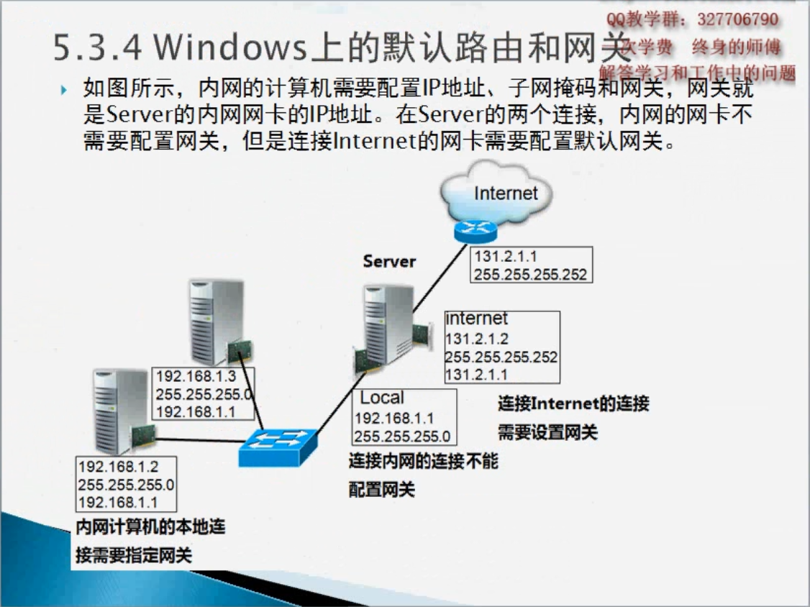

# 静态路由

- 网络畅通的条件：
  1. 数据包能去能回
  2. 沿途的路由器必选知道到目标地址如何转发
  3.  沿途的路由器必选知道 回来的数据包如何转发
- 路由器直连的网络，不用告诉路由器如何转发
- 路由器没有直连的网络，管理员需要告诉路由器到目标网络如何转发（也就是添加静态路由）

- 路由汇总：即超网

- Windows上添加路由表
  - 添加路由表route add 0.0.0.0 mask 0.0.0.0 192.168.31.1
  - 显示路由表route print 或 netstat -r

- 默认路由

  - 网络地址和子网掩码都为0，如图所示配置，这就意味着到任何网络下一跳转发给10.0.0.2。
  - 网络地址和子网掩码均为0的路由就是默认路由。

    Router（config）#ip route 0.0.0.0 0.0.0.0 10.0.0.2

